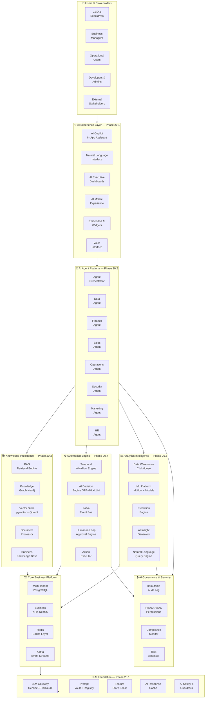
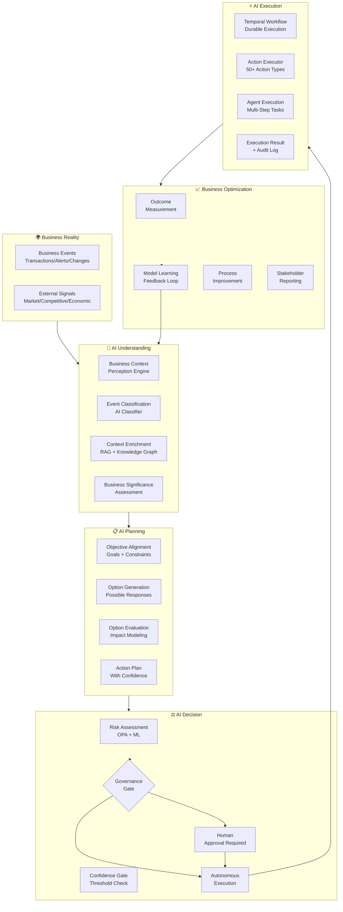
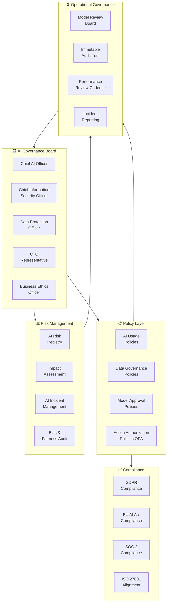
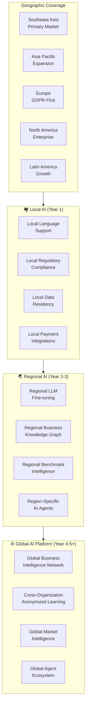
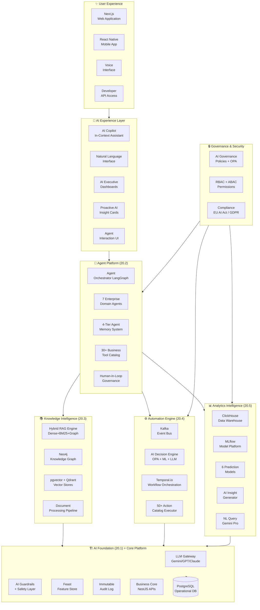
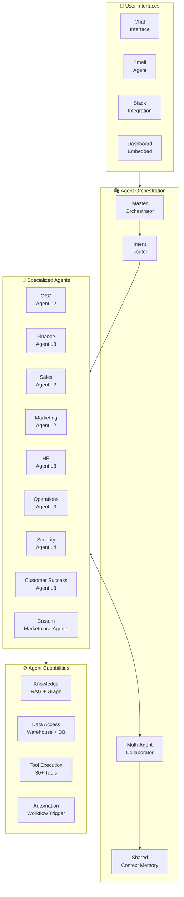
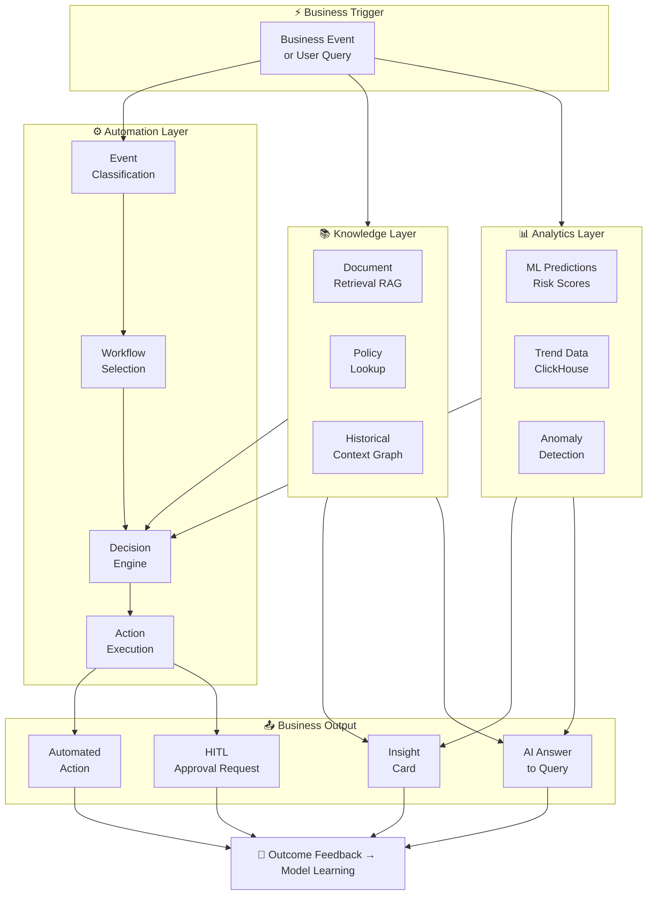

# FINAL AI NATIVE SaaS BLUEPRINT & AUTONOMOUS BUSINESS OPERATING SYSTEM

**Project Name:** Enterprise SaaS Business Management Platform  
**Document Version:** 1.0.0 — Baseline Standard  
**Date:** July 14, 2026  
**Authors:** Chief AI Officer (CAIO), Chief Technology Officer (CTO), Global SaaS Architect, Autonomous System Architect, Enterprise AI Strategist, Digital Transformation Leader  
**Classification:** Internal — Confidential  
**Phase:** 20.6 — Final AI Native SaaS Blueprint & Autonomous Business Operating System  
**Document Type:** Capstone Architecture Blueprint & Strategic Vision  

---

## Table of Contents

1. [Executive Summary](#1-executive-summary)
2. [AI-Native SaaS Vision & Transformation](#2-ai-native-saas-vision--transformation)
3. [Final AI Platform Architecture](#3-final-ai-platform-architecture)
4. [AI Business Operating System](#4-ai-business-operating-system)
5. [AI Intelligence Ecosystem](#5-ai-intelligence-ecosystem)
6. [Autonomous Business Model](#6-autonomous-business-model)
7. [AI Agent Ecosystem](#7-ai-agent-ecosystem)
8. [AI Knowledge Platform](#8-ai-knowledge-platform)
9. [AI Automation Platform](#9-ai-automation-platform)
10. [AI Analytics Intelligence](#10-ai-analytics-intelligence)
11. [AI Security & Trust Architecture](#11-ai-security--trust-architecture)
12. [AI Governance Model](#12-ai-governance-model)
13. [AI Platform Marketplace](#13-ai-platform-marketplace)
14. [AI Developer Platform](#14-ai-developer-platform)
15. [AI Operating Team & Organization](#15-ai-operating-team--organization)
16. [Business Value Model](#16-business-value-model)
17. [AI Platform Metrics Framework](#17-ai-platform-metrics-framework)
18. [10-Year AI Evolution Roadmap](#18-10-year-ai-evolution-roadmap)
19. [Global AI SaaS Strategy](#19-global-ai-saas-strategy)
20. [Final Executive Vision](#20-final-executive-vision)
21. [Final AI Native SaaS Architecture Diagrams](#21-final-ai-native-saas-architecture-diagrams)
22. [Phase 20 Completion Summary](#22-phase-20-completion-summary)

---

## 1. Executive Summary

### 1.1 Document Purpose

This document is the capstone of Phase 20 — the definitive AI Architecture Blueprint for the SaaS Business Management Platform. It synthesizes the five prior AI architecture phases (20.1–20.5) into a unified, coherent vision of an **AI-Native Autonomous Business Operating System** — a platform that does not merely support business operations but actively understands, manages, predicts, and optimizes them.

### 1.2 The Historic Moment

We are at an inflection point. The combination of large language models, multi-agent AI systems, real-time data platforms, and enterprise automation has made it technically and economically feasible to build software that behaves not like a passive tool, but like an active operational intelligence — one that reasons, plans, executes, and learns alongside the humans it serves.

This document charts the path from where we are today to that future, grounded in the concrete architectural decisions already made across Phases 20.1–20.5.

### 1.3 The Transformation in One Sentence

> The platform transforms from **a system that records business activity** into **an AI operating system that understands, predicts, automates, and optimizes business operations** — making every organization that uses it smarter, faster, and more efficient.

### 1.4 Phase 20 AI Architecture Synthesis

| Phase | Document | Core Contribution |
|---|---|---|
| **20.1** | AI Native SaaS Foundation | AI platform layers, LLM gateway, AI data pipelines, MLOps foundation |
| **20.2** | AI Agent Platform | ReAct agents, multi-agent orchestration, 4-tier memory, 30+ tools, HITL |
| **20.3** | RAG Knowledge Intelligence | Hybrid retrieval, knowledge graph, document processing, source attribution |
| **20.4** | AI Automation Engine | Event-driven AI, Temporal workflows, decision engine, 50+ actions |
| **20.5** | AI Analytics & BI Platform | Prediction models, NL analytics, executive dashboards, MLflow MLOps |
| **20.6** | **This Document** | **Unified blueprint, autonomous operations model, 10-year roadmap** |

### 1.5 Top-Line Business Impact

| Dimension | 3-Year AI Platform Impact |
|---|---|
| **Operational Automation** | 85% of routine business tasks automated |
| **Decision Quality** | 40% improvement in decision accuracy with AI recommendations |
| **Time-to-Insight** | 99% reduction: 2 days → <30 seconds |
| **Revenue Impact** | 15–25% revenue uplift through AI-driven retention and growth |
| **Cost Efficiency** | 35–50% reduction in operational costs per unit of output |
| **Competitive Position** | AI moat that deepens with every customer interaction |

---

## 2. AI-Native SaaS Vision & Transformation

### 2.1 The Transformation Journey

```
┌──────────────────────────────────────────────────────────────────────┐
│        FROM TRADITIONAL SaaS  →  AI-NATIVE BUSINESS OPERATING SYSTEM │
│                                                                        │
│  TRADITIONAL SaaS (2015–2023)                                         │
│  ────────────────────────────                                          │
│  • Software as a record-keeping system                                │
│  • Users pull information, make decisions manually                    │
│  • Data lives in silos, reports are static                           │
│  • Every action requires human initiation                            │
│  • Business intelligence = Excel + BI tool                           │
│  • Automation = simple IF/THEN rules                                 │
│  • "Smart" = having good search + filters                            │
│                                                                        │
│  AI-ASSISTED SaaS (2023–2025)                                         │
│  ─────────────────────────────                                         │
│  • AI as a feature — chatbots, suggestions, copilots                 │
│  • AI generates content, drafts emails, summarizes                   │
│  • Still fundamentally human-driven                                  │
│  • AI is an add-on, not the core                                     │
│                                                                        │
│  AI-NATIVE SaaS (2025–2027) ← WE ARE BUILDING THIS                   │
│  ──────────────────────────────────────────────────                    │
│  • AI is the operating layer, not a feature                          │
│  • Platform understands business context continuously                │
│  • AI agents act autonomously within governance boundaries           │
│  • Every data point feeds prediction and automation                  │
│  • Business intelligence is real-time, proactive, conversational     │
│  • Automation is intelligent, adaptive, and self-improving           │
│                                                                        │
│  AUTONOMOUS BUSINESS OS (2027–2030) ← WHERE WE'RE GOING              │
│  ─────────────────────────────────────────────────────                 │
│  • Platform operates like a full business management team            │
│  • AI understands objectives and manages toward them                 │
│  • Humans set strategy; AI executes operations                       │
│  • Continuous self-optimization across all business domains          │
│  • Networked intelligence across all tenant organizations            │
└──────────────────────────────────────────────────────────────────────┘
```

### 2.2 From Application to Operating System

```
TRADITIONAL SaaS APPLICATION MODEL:
────────────────────────────────────
Human → Application → Database
(Human is always in the decision loop)

AI-NATIVE SaaS OPERATING SYSTEM MODEL:
────────────────────────────────────────
Business Reality → AI Understanding → AI Decision/Action → Business Outcome
       ↑                                                           |
       └───────────── Continuous Feedback Loop ───────────────────┘
(Human sets objectives, governs exceptions, approves high-stakes actions)
```

### 2.3 Core Transformation Pillars

#### Pillar 1: From Data Storage to Business Understanding
The platform doesn't just store data — it **understands** business context. It knows that a $50K invoice from a new vendor in the last week of a quarter means something different than the same invoice from a trusted supplier in month 1. This understanding is powered by RAG, knowledge graphs, and business-context-aware LLMs.

#### Pillar 2: From Reactive to Proactive Intelligence
The platform doesn't wait to be asked — it **proactively surfaces** insights, flags risks, and recommends actions before problems occur. Churn risk is identified 90 days before cancellation. Inventory stockouts are prevented before they happen. Cash flow issues are flagged before they become crises.

#### Pillar 3: From Human-Executed to AI-Automated Operations
The platform doesn't just recommend — it **executes**. Under human governance, the AI automation engine executes complex multi-step business workflows: processing invoices, routing leads, managing inventory reorders, onboarding employees, and responding to customer issues.

#### Pillar 4: From Generic to Personalized
The platform **adapts to each organization** — learning their business model, their language, their approval workflows, their risk tolerance, and their strategic priorities. Over time, it becomes a deeply personalized operating system for each tenant.

#### Pillar 5: From Static to Continuously Learning
Every action, outcome, approval, and rejection **teaches the platform**. Models improve with each prediction-outcome pair. Workflows improve with each execution. The platform gets smarter the longer an organization uses it.

---

## 3. Final AI Platform Architecture

### 3.1 Complete Unified Architecture



### 3.2 Cross-Phase Data Flow

```
UNIFIED AI PLATFORM DATA FLOW
────────────────────────────────

Business Event (e.g., Customer Usage Drops 40%)
    │
    ├─► KAFKA EVENT BUS publishes: usage.drop.detected
    │
    ├─► AI ANALYTICS ENGINE detects anomaly:
    │     • Statistical control chart breach
    │     • Churn ML model: probability → 74% (HIGH risk)
    │     • CLV at risk: $48,000 ARR
    │
    ├─► AI KNOWLEDGE RETRIEVAL:
    │     • RAG retrieves: Similar past churn cases
    │     • Knowledge Graph: Customer relationship context
    │     • Policy: Churn intervention playbook retrieved
    │
    ├─► AI AGENT (Customer Success Agent) activated:
    │     • ReAct reasoning: analyze context, plan response
    │     • Drafts personalized re-engagement strategy
    │     • Identifies: Slack integration not configured
    │       (Top retention driver for similar customers)
    │
    ├─► AI AUTOMATION ENGINE:
    │     • Workflow: CustomerChurnInterventionWorkflow
    │     • Decision: HIGH risk → requires CSM notification
    │     • Action: Create task in CRM for assigned CSM
    │     • Action: Schedule AI-generated briefing email (draft)
    │     • HITL: CSM reviews and sends (not auto-sent)
    │
    ├─► AI EXECUTIVE DASHBOARD:
    │     • Insight card: "Account at risk — $48K ARR"
    │     • Recommendation: "Schedule executive call this week"
    │     • Trend: Churn risk across portfolio update
    │
    └─► AUDIT LOG: Full decision chain recorded
```

---

## 4. AI Business Operating System

### 4.1 The Five Core OS Capabilities

```
┌──────────────────────────────────────────────────────────────────────┐
│              AI BUSINESS OPERATING SYSTEM — CORE CAPABILITIES        │
│                                                                        │
│  ┌──────────────────────────────────────────────────────────────┐    │
│  │  1. UNDERSTAND BUSINESS                                       │    │
│  │  ─────────────────────────                                    │    │
│  │  The OS continuously reads business signals:                  │    │
│  │  • Transaction patterns, customer behavior, team activity     │    │
│  │  • External signals: market data, competitor moves            │    │
│  │  • Contextual understanding: what does this mean for us?      │    │
│  │  Technology: RAG + Knowledge Graph + LLM reasoning            │    │
│  └──────────────────────────────────────────────────────────────┘    │
│                                                                        │
│  ┌──────────────────────────────────────────────────────────────┐    │
│  │  2. ANALYZE DATA                                              │    │
│  │  ─────────────────                                            │    │
│  │  The OS analyzes all business data continuously:              │    │
│  │  • Identifies trends, patterns, and anomalies                 │    │
│  │  • Segments performance by any dimension                      │    │
│  │  • Root cause analysis with evidence                          │    │
│  │  • Natural language answers to business questions             │    │
│  │  Technology: Analytics Platform + ML + NL Query               │    │
│  └──────────────────────────────────────────────────────────────┘    │
│                                                                        │
│  ┌──────────────────────────────────────────────────────────────┐    │
│  │  3. RECOMMEND DECISIONS                                       │    │
│  │  ─────────────────────────                                    │    │
│  │  The OS provides decision intelligence:                       │    │
│  │  • Forecasts future outcomes with confidence                  │    │
│  │  • Evaluates decision options and their likely impacts        │    │
│  │  • Prioritizes next best actions by business impact           │    │
│  │  • Explains reasoning transparently                           │    │
│  │  Technology: Prediction Engine + Decision Intelligence        │    │
│  └──────────────────────────────────────────────────────────────┘    │
│                                                                        │
│  ┌──────────────────────────────────────────────────────────────┐    │
│  │  4. AUTOMATE OPERATIONS                                       │    │
│  │  ─────────────────────────                                    │    │
│  │  The OS autonomously executes business operations:            │    │
│  │  • Routine processes without human initiation                 │    │
│  │  • Complex multi-step workflows with intelligence             │    │
│  │  • Exception-based human escalation (risk-proportionate)      │    │
│  │  • Continuous adaptation based on outcomes                    │    │
│  │  Technology: Automation Engine + Agent Platform               │    │
│  └──────────────────────────────────────────────────────────────┘    │
│                                                                        │
│  ┌──────────────────────────────────────────────────────────────┐    │
│  │  5. EXECUTE ACTIONS                                           │    │
│  │  ──────────────────                                           │    │
│  │  The OS takes direct action in business systems:              │    │
│  │  • Creates, updates, and manages records                      │    │
│  │  • Communicates on behalf of the organization                 │    │
│  │  • Integrates with external systems and APIs                  │    │
│  │  • Manages data across the entire business stack             │    │
│  │  Technology: Action Executor + 50+ Action Catalog             │    │
│  └──────────────────────────────────────────────────────────────┘    │
└──────────────────────────────────────────────────────────────────────┘
```

### 4.2 Operating System Mental Model

```typescript
// AI Business OS — Conceptual Interface
interface AIBusinessOperatingSystem {
  // Core perception: understanding the business state
  perceive(event: BusinessEvent): Promise<BusinessContext>;
  
  // Core cognition: reasoning over context
  reason(context: BusinessContext, objective: BusinessObjective): Promise<AIReasoning>;
  
  // Core planning: deciding what to do
  plan(reasoning: AIReasoning): Promise<ActionPlan>;
  
  // Core execution: doing it
  execute(plan: ActionPlan, governance: GovernanceContext): Promise<ExecutionResult>;
  
  // Core learning: improving from outcomes
  learn(result: ExecutionResult, outcome: BusinessOutcome): Promise<void>;
  
  // Human interface: explaining itself
  explain(decision: AIDecision): Promise<HumanReadableExplanation>;
  
  // Human control: accepting override
  override(action: AutomatedAction, humanDecision: HumanDecision): Promise<void>;
}
```

### 4.3 OS Orchestration Layer

```typescript
// AI OS Orchestration — The "kernel" of the AI Operating System
@Injectable()
export class AIOperatingSystemKernel {
  async processBusinessSignal(event: BusinessEvent): Promise<void> {
    const span = this.tracer.startSpan('aos.process_signal');

    // 1. PERCEIVE — Understand the business signal
    const context = await Promise.all([
      this.ragService.retrieveContext(event),          // Knowledge context
      this.analyticsService.analyzeEvent(event),       // Analytics context
      this.agentMemory.recall(event.tenantId, event),  // Historical context
    ]);

    // 2. REASON — Assess significance
    const reasoning = await this.llmGateway.reason({
      event,
      context: context,
      objective: await this.objectiveStore.getBusinessObjectives(event.tenantId),
    });

    // 3. PLAN — Determine response
    if (reasoning.requiresAction) {
      const plan = await this.planningEngine.plan(reasoning);

      // 4. GOVERN — Check against governance policies
      const govResult = await this.governanceEngine.evaluate(plan);

      if (govResult.requiresHumanApproval) {
        // Route to Human-in-the-Loop
        await this.hitlEngine.requestApproval(plan, govResult);
      } else {
        // 5. EXECUTE — Act autonomously
        const result = await this.executionEngine.execute(plan);
        
        // 6. LEARN — Update models from outcome
        await this.learningEngine.recordOutcome(event, plan, result);
      }
    }

    // Always: Update dashboards and insight stream
    await this.dashboardService.updateInsights(event, reasoning);
    
    span.end();
  }
}
```

---

## 5. AI Intelligence Ecosystem

### 5.1 Six-Layer Intelligence Ecosystem

```mermaid
graph LR
    subgraph AgentEco["🤖 AI Agents"]
        AG_CEO[CEO Agent]
        AG_FIN[Finance Agent]
        AG_SAL[Sales Agent]
        AG_OPS[Operations Agent]
        AG_HR[HR Agent]
        AG_MKT[Marketing Agent]
        AG_SEC[Security Agent]
        AG_CUST[Custom Agents]
    end

    subgraph KnowEco["📚 AI Knowledge"]
        RAG_E[RAG Engine]
        KG_E[Knowledge Graph]
        VS_E[Vector Search]
        DC_E[Document Intelligence]
        BK_E[Business Knowledge]
    end

    subgraph AutoEco["⚙️ AI Automation"]
        WF_E[Workflow Engine]
        DE_E[Decision Engine]
        AC_E[Action Catalog]
        EV_E[Event Intelligence]
    end

    subgraph AnalyEco["📊 AI Analytics"]
        PRED_E[Predictions]
        FORE_E[Forecasting]
        REC_E[Recommendations]
        NLQ_E[NL Analytics]
        DASH_E[Dashboards]
    end

    subgraph SecEco["🔒 AI Security"]
        GDRAIL[Guardrails]
        AUDIT_E[Audit Engine]
        RBAC_E[Access Control]
        THREAT_E[Threat Detection]
    end

    subgraph GovEco["🏛️ AI Governance"]
        POLICY_E[Policy Engine\nOPA]
        RISK_E[Risk Manager]
        COMP_E[Compliance Monitor]
        REVIEW_E[Model Review Board]
    end

    subgraph CoreBus["🏗️ Core Platform"]
        BIZ[Business Systems\nFinance/Sales/HR/Ops]
        DATA[Data Platform\nWarehouse + Lake]
        API[API Layer\nNestJS]
    end

    AgentEco <--> KnowEco
    AgentEco <--> AutoEco
    AgentEco <--> AnalyEco
    AutoEco <--> AnalyEco
    KnowEco <--> AnalyEco
    SecEco --> AgentEco & AutoEco & AnalyEco
    GovEco --> AgentEco & AutoEco & AnalyEco
    AgentEco & AutoEco & AnalyEco --> CoreBus
```



### 5.2 Ecosystem Integration Matrix

| Capability | Provides To | Receives From | Integration Pattern |
|---|---|---|---|
| **AI Agents** | Actions, Insights, Drafts | Knowledge, Analytics, Automation | Event + Function Call |
| **RAG Knowledge** | Context, Documents, Policies | Agents, Automation, Analytics | Synchronous Query |
| **AI Automation** | Workflow Execution, Decisions | Events, Analytics (predictions), Agents | Event-Driven |
| **AI Analytics** | Insights, Predictions, Forecasts | Data Platform, Automation triggers | Push (insights) + Pull (queries) |
| **AI Security** | Validation, Audit, Block | All layers (intercepts) | Middleware / Policy |
| **AI Governance** | Policies, Approval Gates, Audit | All layers (governs) | Policy Decision Point |

---

## 6. Autonomous Business Model

### 6.1 Five-Stage Autonomous Operations Flow



### 6.2 Autonomy Level Framework

```
┌──────────────────────────────────────────────────────────────────────┐
│                  BUSINESS AUTONOMY LEVEL FRAMEWORK                    │
│                                                                        │
│  LEVEL 0 — MANUAL (Today's Status Quo)                               │
│  Human does everything. AI provides no assistance.                    │
│  Coverage: Legacy systems only (not on this platform)                 │
│                                                                        │
│  LEVEL 1 — AI ASSISTED (Reactive)                                     │
│  AI provides information when asked. Human decides everything.        │
│  Example: Dashboard showing current metrics when user opens it        │
│  Coverage: All users from Day 1                                       │
│                                                                        │
│  LEVEL 2 — AI AUGMENTED (Proactive)                                   │
│  AI surfaces insights, suggestions, and warnings proactively.         │
│  Human makes all decisions and takes all actions.                     │
│  Example: "3 accounts are at churn risk" alert pushed to CSM          │
│  Target: 100% within Phase 1 deployment                              │
│                                                                        │
│  LEVEL 3 — AI AUTOMATED (Conditional)                                 │
│  AI executes defined, rule-bound processes automatically.             │
│  Human approves exceptions and high-risk actions.                    │
│  Example: Auto-process invoices under $10K from approved vendors      │
│  Target: 70% of routine tasks by end of 2026                         │
│                                                                        │
│  LEVEL 4 — AI AUTONOMOUS (Intelligent)                                │
│  AI executes complex, judgment-requiring tasks autonomously.          │
│  Human reviews outcomes and governs policy.                          │
│  Example: AI manages complete inventory replenishment lifecycle       │
│  Target: 50% of operational tasks by end of 2027                     │
│                                                                        │
│  LEVEL 5 — AI OPERATIONAL (Strategic Partner)                         │
│  AI manages business operations; humans focus on strategy.            │
│  Example: AI runs month-end close, manages vendor relationships       │
│  Target: Core operational domains by 2028-2029                        │
└──────────────────────────────────────────────────────────────────────┘
```

---

## 7. AI Agent Ecosystem

### 7.1 Enterprise Agent Directory

```
┌──────────────────────────────────────────────────────────────────────┐
│                    ENTERPRISE AI AGENT ECOSYSTEM                       │
│                                                                        │
│  ╔══════════════════════════════════════════════════════════════╗    │
│  ║  CEO AGENT                                                   ║    │
│  ║  Role: Executive intelligence and strategic co-pilot         ║    │
│  ║  Capabilities:                                               ║    │
│  ║  • Daily executive briefing generation                       ║    │
│  ║  • Board report preparation and narrative                    ║    │
│  ║  • Strategic scenario modeling and analysis                  ║    │
│  ║  • Competitive intelligence synthesis                        ║    │
│  ║  • Cross-functional performance synthesis                    ║    │
│  ║  Autonomy: L2 (Augmented) — Always advisory, never executive ║    │
│  ╚══════════════════════════════════════════════════════════════╝    │
│                                                                        │
│  ╔══════════════════════════════════════════════════════════════╗    │
│  ║  FINANCE AGENT                                               ║    │
│  ║  Role: Autonomous financial operations management            ║    │
│  ║  Capabilities:                                               ║    │
│  ║  • Invoice processing and 3-way matching                     ║    │
│  ║  • Payment scheduling and cash flow management               ║    │
│  ║  • Expense review and policy enforcement                     ║    │
│  ║  • Month-end close orchestration                             ║    │
│  ║  • Revenue recognition and reporting                         ║    │
│  ║  Autonomy: L3 (Automated) — Auto for <$10K, approval >$10K  ║    │
│  ╚══════════════════════════════════════════════════════════════╝    │
│                                                                        │
│  ╔══════════════════════════════════════════════════════════════╗    │
│  ║  SALES AGENT                                                 ║    │
│  ║  Role: Revenue pipeline optimization and acceleration        ║    │
│  ║  Capabilities:                                               ║    │
│  ║  • Lead enrichment, scoring, and routing                     ║    │
│  ║  • Deal health monitoring and intervention alerts            ║    │
│  ║  • Personalized outreach draft generation                    ║    │
│  ║  • Churn prediction and retention recommendation             ║    │
│  ║  • Sales forecast modeling and adjustment                    ║    │
│  ║  Autonomy: L2 (Augmented) — Drafts only, human sends        ║    │
│  ╚══════════════════════════════════════════════════════════════╝    │
│                                                                        │
│  ╔══════════════════════════════════════════════════════════════╗    │
│  ║  MARKETING AGENT                                             ║    │
│  ║  Role: Growth intelligence and campaign optimization         ║    │
│  ║  Capabilities:                                               ║    │
│  ║  • Campaign performance monitoring and optimization          ║    │
│  ║  • Content intelligence and topic recommendation             ║    │
│  ║  • Lead nurture sequence management                          ║    │
│  ║  • SEO performance tracking and recommendations              ║    │
│  ║  • Attribution modeling and budget recommendations           ║    │
│  ║  Autonomy: L2 (Augmented) — Recommends, human approves      ║    │
│  ╚══════════════════════════════════════════════════════════════╝    │
│                                                                        │
│  ╔══════════════════════════════════════════════════════════════╗    │
│  ║  HR AGENT                                                    ║    │
│  ║  Role: People operations automation and intelligence         ║    │
│  ║  Capabilities:                                               ║    │
│  ║  • Employee onboarding workflow orchestration                ║    │
│  ║  • Leave and absence management automation                   ║    │
│  ║  • Performance review cycle management                       ║    │
│  ║  • Training assignment and tracking                          ║    │
│  ║  • HR policy Q&A and compliance monitoring                   ║    │
│  ║  Autonomy: L3 (Automated) — Policy-bound, human governs     ║    │
│  ╚══════════════════════════════════════════════════════════════╝    │
│                                                                        │
│  ╔══════════════════════════════════════════════════════════════╗    │
│  ║  OPERATIONS AGENT                                            ║    │
│  ║  Role: Operational excellence and incident management        ║    │
│  ║  Capabilities:                                               ║    │
│  ║  • System alert triage and initial response                  ║    │
│  ║  • SLA monitoring and escalation management                  ║    │
│  ║  • Support ticket routing and priority scoring               ║    │
│  ║  • Capacity planning and resource recommendations            ║    │
│  ║  • Incident runbook execution and post-mortem                ║    │
│  ║  Autonomy: L3 (Automated) — Approved runbooks only          ║    │
│  ╚══════════════════════════════════════════════════════════════╝    │
│                                                                        │
│  ╔══════════════════════════════════════════════════════════════╗    │
│  ║  SECURITY AGENT                                              ║    │
│  ║  Role: Autonomous threat response and compliance             ║    │
│  ║  Capabilities:                                               ║    │
│  ║  • Real-time threat detection and triage                     ║    │
│  ║  • Automated incident response execution                     ║    │
│  ║  • Compliance monitoring and reporting                       ║    │
│  ║  • Access anomaly detection and response                     ║    │
│  ║  • Security policy enforcement                               ║    │
│  ║  Autonomy: L4 (Autonomous) — Auto-lock on threats           ║    │
│  ╚══════════════════════════════════════════════════════════════╝    │
└──────────────────────────────────────────────────────────────────────┘
```

### 7.2 Multi-Agent Collaboration Architecture

```typescript
// Multi-Agent Collaboration — Example: Strategic Business Review
export async function quarterlyBusinessReviewWorkflow(
  tenantId: string,
  reviewPeriod: QuarterPeriod
): Promise<QBRReport> {
  const orchestrator = new AgentOrchestrator();
  
  // Parallel data gathering by domain agents
  const [
    financeAnalysis,
    salesAnalysis,
    customerAnalysis,
    operationsAnalysis,
    marketingAnalysis,
  ] = await Promise.all([
    orchestrator.invoke('finance_agent', {
      task: 'quarterly_financial_analysis',
      period: reviewPeriod,
      outputs: ['revenue', 'costs', 'cashflow', 'forecasts'],
    }),
    orchestrator.invoke('sales_agent', {
      task: 'quarterly_pipeline_analysis',
      period: reviewPeriod,
      outputs: ['closed_revenue', 'pipeline', 'win_rates', 'forecasts'],
    }),
    orchestrator.invoke('customer_success_agent', {
      task: 'customer_health_analysis',
      period: reviewPeriod,
      outputs: ['churn_rate', 'nrr', 'health_scores', 'at_risk'],
    }),
    orchestrator.invoke('operations_agent', {
      task: 'operational_efficiency_analysis',
      period: reviewPeriod,
      outputs: ['sla_performance', 'ticket_metrics', 'cost_per_unit'],
    }),
    orchestrator.invoke('marketing_agent', {
      task: 'growth_and_pipeline_analysis',
      period: reviewPeriod,
      outputs: ['lead_volume', 'cac', 'campaign_roi', 'forecasts'],
    }),
  ]);
  
  // CEO Agent synthesizes all analyses into executive narrative
  const executiveSummary = await orchestrator.invoke('ceo_agent', {
    task: 'synthesize_qbr_narrative',
    inputs: {
      financeAnalysis,
      salesAnalysis,
      customerAnalysis,
      operationsAnalysis,
      marketingAnalysis,
      businessObjectives: await objectiveStore.get(tenantId),
    },
    outputs: ['executive_summary', 'key_achievements', 'risks', 'opportunities', 'recommendations'],
  });
  
  // Security Agent audits the report for sensitive data before sharing
  const securedReport = await orchestrator.invoke('security_agent', {
    task: 'audit_and_classify_report',
    inputs: { executiveSummary, allAnalyses: [financeAnalysis, salesAnalysis] },
  });
  
  return {
    period: reviewPeriod,
    executiveSummary,
    domainAnalyses: { financeAnalysis, salesAnalysis, customerAnalysis, operationsAnalysis, marketingAnalysis },
    classification: securedReport.classification,
    generatedAt: new Date(),
    generatedBy: 'AI Quarterly Business Review System',
  };
}
```

---

## 8. AI Knowledge Platform

### 8.1 Unified Knowledge Architecture

```
┌──────────────────────────────────────────────────────────────────────┐
│                      AI KNOWLEDGE PLATFORM                            │
│                                                                        │
│  KNOWLEDGE SOURCES (What the AI Knows)                                │
│  ────────────────────────────────────                                  │
│  Structured Business Data (Operational DB):                           │
│    Revenue records, customer data, transaction history               │
│    Inventory, HR records, support tickets                            │
│                                                                        │
│  Unstructured Documents (RAG Document Store):                         │
│    Contracts, policies, SOPs, meeting notes                          │
│    Research reports, product documentation                           │
│    Email archives, chat history (with consent)                       │
│                                                                        │
│  Analytical Knowledge (Data Warehouse + ML):                          │
│    Patterns, trends, predictions, correlations                       │
│    Historical outcomes of business decisions                         │
│    Model insights and feature importances                            │
│                                                                        │
│  Relational Knowledge (Knowledge Graph):                              │
│    Entity relationships (Customer ↔ Contract ↔ Product)              │
│    Causal relationships (action → outcome)                           │
│    Temporal relationships (event sequencing)                         │
│                                                                        │
│  KNOWLEDGE RETRIEVAL (How AI Finds Relevant Knowledge)                │
│  ─────────────────────────────────────────────────────                 │
│  Semantic Search (Vector):  "similar meaning" retrieval              │
│  Keyword Search (BM25):     exact term matching                      │
│  Graph Traversal (Neo4j):   relationship-aware retrieval             │
│  SQL Query (Analytical):    structured data retrieval                │
│  Fusion (RRF):              combines all retrieval signals           │
│                                                                        │
│  KNOWLEDGE QUALITY CONTROLS                                            │
│  ───────────────────────────                                           │
│  Source attribution: Every answer cites its sources                  │
│  Freshness: Documents tracked for age and relevance                  │
│  Accuracy: Ground truth validation where possible                    │
│  PII Safety: Personal data stripped before LLM processing            │
│  Hallucination Defense: Claims verified against source               │
└──────────────────────────────────────────────────────────────────────┘
```

### 8.2 Knowledge Maturity Ladder

| Level | Knowledge Type | Source | Used By |
|---|---|---|---|
| **L1 — Facts** | Raw business data | PostgreSQL | Analytics, Reporting |
| **L2 — Documents** | Policies, SOPs, contracts | RAG Document Store | Agents, NL Q&A |
| **L3 — Patterns** | Trends, correlations | Analytics + ML | Predictions, Alerts |
| **L4 — Relationships** | Entity + causal graphs | Knowledge Graph | Complex reasoning |
| **L5 — Precedents** | Past decision outcomes | Agent Memory | Decision making |
| **L6 — Wisdom** | Cross-organization insights | Anonymized aggregate | Benchmarking, Best practices |

---

## 9. AI Automation Platform

### 9.1 Complete Automation Capability Map

```
AUTOMATION CAPABILITY MAP
──────────────────────────

TRIGGER SOURCES:
  ✓ Business events (Kafka)       ✓ Scheduled (Cron)
  ✓ Manual user trigger           ✓ AI-proactive (prediction-triggered)
  ✓ External webhooks             ✓ Agent-initiated

DECISION INTELLIGENCE:
  ✓ OPA rule evaluation           ✓ ML risk scoring
  ✓ LLM contextual reasoning      ✓ Weighted ensemble fusion
  ✓ Historical outcome learning   ✓ Business constraint checking

WORKFLOW ORCHESTRATION:
  ✓ Temporal.io durable execution ✓ Automatic retry & recovery
  ✓ Long-running workflows        ✓ Parallel step execution
  ✓ Human approval signals        ✓ Compensation (rollback) logic
  ✓ Sub-workflow composition      ✓ Version management

HUMAN GOVERNANCE:
  ✓ 3-tier approval model         ✓ Risk-proportionate oversight
  ✓ Multi-channel notifications   ✓ Approval deadline escalation
  ✓ Override capability           ✓ Full audit chain

ACTION EXECUTION:
  ✓ Database CRUD operations      ✓ Email/SMS/Push notifications
  ✓ Document generation           ✓ External API calls
  ✓ Agent spawning                ✓ Workflow triggering
  ✓ Permission management         ✓ Payment processing

DOMAIN COVERAGE:
  ✓ Finance (invoice, payments)   ✓ Sales (leads, deals)
  ✓ Inventory (reorder, forecast) ✓ HR (onboarding, leave)
  ✓ Operations (incidents, SLA)   ✓ Marketing (campaigns, nurture)
  ✓ Support (routing, escalation) ✓ Security (response, compliance)
```

### 9.2 Automation Maturity by Domain

| Domain | Current Automation Level | 2026 Target | 2027 Target |
|---|---|---|---|
| **Finance — Invoice** | L1 (Manual) | L3 (70% straight-through) | L4 (85% auto) |
| **Finance — Payments** | L1 (Manual) | L3 (Scheduled auto) | L4 (Cash flow optimized) |
| **Sales — Lead Routing** | L1 (Manual CRM) | L4 (Fully automated) | L4 + AI scoring |
| **Sales — Follow-ups** | L1 (Rep memory) | L3 (Auto-sequences) | L4 (AI-personalized) |
| **Inventory — Reorder** | L1 (Manual check) | L3 (Auto-reorder) | L4 (AI-predicted) |
| **HR — Onboarding** | L1 (Checklist) | L3 (Orchestrated) | L4 (Adaptive) |
| **Support — Triage** | L1 (Manual) | L3 (Auto-classify + route) | L4 (AI-resolve) |
| **Security — Threats** | L2 (Alert + human) | L4 (Auto-respond) | L4 + AI forensics |

---

## 10. AI Analytics Intelligence

### 10.1 Analytics Intelligence Capability Stack

```
┌──────────────────────────────────────────────────────────────────────┐
│                  AI ANALYTICS INTELLIGENCE STACK                      │
│                                                                        │
│  TIER 1: DESCRIPTIVE ANALYTICS (What happened?)                       │
│  • Real-time KPI monitoring                                          │
│  • Historical trend analysis                                         │
│  • Variance analysis vs target                                       │
│  • Segment breakdown and drill-down                                  │
│                                                                        │
│  TIER 2: DIAGNOSTIC ANALYTICS (Why did it happen?)                    │
│  • AI-generated root cause analysis                                  │
│  • Anomaly detection with explanation                                │
│  • Correlation and causation analysis                                │
│  • Natural language question answering                               │
│                                                                        │
│  TIER 3: PREDICTIVE ANALYTICS (What will happen?)                     │
│  • 6 production ML prediction models                                 │
│  • 12-month revenue forecasting                                      │
│  • 60-90 day churn prediction                                        │
│  • 30/60/90 day demand forecasting                                   │
│  • Customer Lifetime Value (CLV) prediction                          │
│  • Risk prediction and early warning                                 │
│                                                                        │
│  TIER 4: PRESCRIPTIVE ANALYTICS (What should we do?)                  │
│  • AI-generated action recommendations                               │
│  • Next best action by role and context                              │
│  • Product and upsell recommendations                                │
│  • Budget and resource allocation recommendations                    │
│  • Decision briefing with scenario simulation                        │
│                                                                        │
│  TIER 5: AUTONOMOUS ANALYTICS (AI acts on the insight)                │
│  • Insight → automation trigger (Tier 5, 2027+)                      │
│  • AI acts on its own predictions without human prompt               │
│  • Self-optimizing business processes                                │
│  • Continuous strategy adjustment within set parameters              │
└──────────────────────────────────────────────────────────────────────┘
```

### 10.2 Prediction-to-Action Pipeline

```
CLOSED-LOOP INTELLIGENCE PIPELINE
────────────────────────────────────

1. PREDICT: Churn model outputs → Account ABC: 74% churn risk
          │
2. INSIGHT: AI generates: "Account ABC at critical risk — $48K ARR"
          │
3. RECOMMEND: "Schedule executive outreach + Slack integration workshop"
          │
4. TRIGGER: Automation Engine receives prediction-triggered event
          │
5. DECIDE: AI Decision Engine: HIGH risk → CSM notification required
          │
6. EXECUTE: Create CRM task + draft email + notify CSM Slack
          │
7. MEASURE: Track outcome: Did customer renew? Expand? Churn?
          │
8. LEARN: Update churn model weights based on outcome
          │
Back to 1 ─────────────────────────────────────────────────────────
```

---

## 11. AI Security & Trust Architecture

### 11.1 AI Trust Model

```
┌──────────────────────────────────────────────────────────────────────┐
│                       AI TRUST ARCHITECTURE                           │
│                                                                        │
│  TRUST LAYER 1: SECURE DATA                                           │
│  • All data encrypted at rest (AES-256) and in transit (TLS 1.3)    │
│  • Tenant data never leaks between tenants                           │
│  • PII stripped before AI processing                                 │
│  • GDPR/CCPA right to erasure respected in AI systems               │
│  • Model training data anonymized and audited                        │
│                                                                        │
│  TRUST LAYER 2: SECURE MODELS                                         │
│  • Model artifacts signed and verified before deployment             │
│  • Shadow mode validation before production promotion                │
│  • Adversarial input detection and rejection                         │
│  • Prompt injection prevention at every LLM interaction              │
│  • Model outputs validated against business rules before action      │
│                                                                        │
│  TRUST LAYER 3: SECURE AGENTS                                         │
│  • Agents operate within defined permission scopes only              │
│  • Every agent action logged to immutable audit trail                │
│  • Multi-layer guardrails (input → planning → action → output)       │
│  • Agent capability escalation requires explicit approval            │
│  • "Kill switch" available at organization, agent, and action level  │
│                                                                        │
│  TRUST LAYER 4: HUMAN CONTROL                                         │
│  • Human override always possible on any automated action            │
│  • Risk-proportionate approval gates (low/medium/high/critical)      │
│  • Explainability: Every AI decision has a human-readable rationale  │
│  • Reversibility: High-risk actions require rollback capability      │
│  • Transparency: AI identity always disclosed to end users           │
│                                                                        │
│  TRUST LAYER 5: CONTINUOUS AUDIT                                      │
│  • Every AI action traceable from trigger to outcome                 │
│  • Tamper-evident audit log (immutable PostgreSQL chain)             │
│  • Regular third-party AI audits                                     │
│  • Public AI Transparency Report (annual)                            │
└──────────────────────────────────────────────────────────────────────┘
```

### 11.2 AI Safety Guardrails Architecture

```typescript
// Multi-Layer AI Safety System
@Injectable()
export class AIGuardrailsService {
  // Layer 1: Input Validation
  async validateInput(input: AIInput): Promise<GuardrailResult> {
    const checks = await Promise.all([
      this.promptInjectionDetector.scan(input.prompt),
      this.piiDetector.scan(input.data),
      this.contentModerator.classify(input.prompt),
      this.rateLimit.check(input.tenantId, input.model),
    ]);
    
    if (checks.some(c => !c.safe)) {
      return { blocked: true, reason: checks.find(c => !c.safe)?.reason };
    }
    return { blocked: false };
  }

  // Layer 2: Planning Validation
  async validatePlan(plan: ActionPlan, context: SecurityContext): Promise<GuardrailResult> {
    return this.governanceService.validatePlan({
      actions: plan.steps,
      tenantId: context.tenantId,
      userId: context.agentId,
      checkProhibitedActions: true,
      checkRateLimits: true,
      checkPermissions: true,
    });
  }

  // Layer 3: Action Validation (pre-execution)
  async validateAction(action: AutomationAction, context: ExecutionContext): Promise<GuardrailResult> {
    return Promise.all([
      this.permissionService.checkActionPermission(action, context),
      this.riskService.assessActionRisk(action, context),
      this.financialLimitService.checkLimits(action, context),
      this.dataPrivacyService.checkCompliance(action),
    ]).then(results => this.mergeGuardrailResults(results));
  }

  // Layer 4: Output Validation (post-generation)
  async validateOutput(output: AIOutput): Promise<GuardrailResult> {
    return Promise.all([
      this.piiDetector.scanOutput(output.content),
      this.factChecker.verify(output.claims, output.sourceDocuments),
      this.contentModerator.classifyOutput(output.content),
      this.attributionChecker.verifySourceCitation(output),
    ]).then(results => this.mergeGuardrailResults(results));
  }
}
```

---

## 12. AI Governance Model

### 12.1 Governance Framework



### 12.2 AI Model Review Process

```
AI MODEL LIFECYCLE GOVERNANCE
────────────────────────────────

STAGE 1: MODEL PROPOSAL
  Submit: Model card (purpose, data, algorithm, risk level)
  Review: Data Science Lead + Business Owner
  Outcome: Approved for development / rejected

STAGE 2: DEVELOPMENT REVIEW
  Submit: Experiment results, training data provenance
  Bias Check: Demographic parity, equalized odds assessment
  Data Privacy: Confirm no PII in training data
  Outcome: Approved for validation

STAGE 3: VALIDATION GATE
  Quality Gates: AUC, MAPE, F1 targets met
  Shadow Testing: 48-hour shadow mode at 10% traffic
  Security: Adversarial robustness testing
  Outcome: Approved for staging

STAGE 4: PRODUCTION APPROVAL
  Business Owner: Sign-off on model purpose and scope
  CISO: Security review for models with action authority
  DPO: Privacy impact for models using personal data
  Outcome: Approved for production deployment

STAGE 5: ONGOING MONITORING
  Weekly: Model performance vs quality gates
  Monthly: Bias and fairness re-audit
  Quarterly: Full model review board session
  Trigger: Auto-flag if drift > threshold → re-validation

STAGE 6: DEPRECATION
  Business decision: Model replaced or no longer needed
  Audit: Final performance report retained 7 years
  Data: Training data retention per data policy
```

### 12.3 EU AI Act Compliance Mapping

| AI System | Risk Level | EU AI Act Requirements | Our Implementation |
|---|---|---|---|
| Fraud Detection | High Risk | Logging, human oversight, accuracy docs | ✅ Immutable audit, HITL, MLflow model card |
| HR Candidate Scoring | High Risk | Transparency, bias testing, human review | ✅ SHAP explanations, bias audit, HR approval |
| Churn Prediction | Limited Risk | Transparency notice | ✅ UI disclosure "AI-generated prediction" |
| Invoice Auto-Approval | High Risk (financial) | Human oversight capability | ✅ Manager approval gate, kill switch |
| NL Query Interface | Minimal Risk | Good practice | ✅ Source attribution, hallucination defense |
| AI Scheduling | Minimal Risk | Good practice | ✅ Audit log, user override |

---

## 13. AI Platform Marketplace

### 13.1 AI Marketplace Vision

```
┌──────────────────────────────────────────────────────────────────────┐
│                       AI PLATFORM MARKETPLACE                         │
│                                                                        │
│  OUR PLATFORM AS AN AI ECOSYSTEM                                       │
│  • First-party agents and tools (our own)                            │
│  • Third-party agent publishing (partner ecosystem)                  │
│  • Customer-developed custom agents (enterprise)                     │
│  • AI template library (automation + workflow templates)             │
│                                                                        │
│  MARKETPLACE CATEGORIES:                                               │
│                                                                        │
│  🤖 AI AGENTS                                                         │
│  • Industry-specific agents (e-commerce, healthcare, legal, etc.)   │
│  • Function-specific agents (accounting, logistics, compliance)      │
│  • Integration agents (connect to SAP, Salesforce, NetSuite, etc.)  │
│                                                                        │
│  🔌 AI PLUGINS                                                        │
│  • Document intelligence plugins (specific document types)           │
│  • Data connector plugins (new data sources)                         │
│  • LLM model plugins (bring your own LLM)                           │
│  • Embedding model plugins (specialized domains)                     │
│                                                                        │
│  📋 BUSINESS SKILLS                                                   │
│  • Industry process templates (retail, manufacturing, services)      │
│  • Compliance playbooks (GDPR, SOX, HIPAA automation)               │
│  • Best practice workflow libraries                                  │
│                                                                        │
│  ⚙️ AUTOMATION TEMPLATES                                              │
│  • Pre-built workflow definitions (Temporal workflows)               │
│  • Business process templates                                         │
│  • Integration workflow templates                                    │
└──────────────────────────────────────────────────────────────────────┘
```

### 13.2 Marketplace Architecture

```typescript
// Agent Marketplace Registration
interface MarketplaceAgent {
  // Identity
  agentId: string;
  publisherId: string;
  name: string;
  version: string;
  category: AgentCategory;
  
  // Capabilities
  capabilities: AgentCapability[];
  toolsRequired: string[];          // Tools the agent needs access to
  dataAccess: DataAccessScope[];    // What data it needs
  
  // Security
  sandboxed: boolean;               // Does it run in sandbox?
  permissionScope: PermissionScope; // What it can and cannot do
  reviewStatus: 'pending' | 'approved' | 'rejected';
  
  // Quality
  certificationLevel: 'community' | 'verified' | 'enterprise_grade';
  securityScanStatus: 'clean' | 'pending' | 'flagged';
  performanceMetrics: AgentPerformanceMetrics;
  
  // Distribution
  pricing: AgentPricing;
  tenantCount: number;
  rating: number;
  reviews: AgentReview[];
}

// Marketplace Quality Gates
const MARKETPLACE_SECURITY_GATES = [
  'static_code_analysis',           // No malicious code patterns
  'permission_scope_review',        // Minimal permission principle
  'data_exfiltration_test',         // Cannot leak tenant data
  'prompt_injection_resistance',    // Cannot be hijacked via prompts
  'rate_limit_compliance',          // Respects platform rate limits
  'audit_log_compliance',           // All actions logged
  'sandbox_escape_test',            // Cannot break out of sandbox
];
```

---

## 14. AI Developer Platform

### 14.1 Developer Ecosystem

```
┌──────────────────────────────────────────────────────────────────────┐
│                    AI DEVELOPER PLATFORM                               │
│                                                                        │
│  AI PLATFORM APIs (For Developers)                                     │
│  ─────────────────────────────────                                     │
│                                                                        │
│  Agent API:                                                            │
│  POST /api/v1/agents/{agentId}/invoke                                 │
│  GET  /api/v1/agents/{agentId}/status/{executionId}                   │
│  POST /api/v1/agents/custom                    (deploy custom agent)  │
│                                                                        │
│  Knowledge API:                                                        │
│  POST /api/v1/knowledge/query                  (RAG query)            │
│  POST /api/v1/knowledge/ingest                 (add document)         │
│  GET  /api/v1/knowledge/sources                                        │
│                                                                        │
│  Automation API:                                                       │
│  POST /api/v1/workflows/{workflowId}/trigger                          │
│  GET  /api/v1/workflows/{executionId}/status                          │
│  POST /api/v1/workflows/definitions             (register workflow)   │
│                                                                        │
│  Analytics API:                                                        │
│  POST /api/v1/analytics/query                  (NL or SQL query)      │
│  GET  /api/v1/analytics/metrics/{metricId}                            │
│  GET  /api/v1/analytics/predictions/{modelId}  (get predictions)     │
│                                                                        │
│  AGENT SDK (TypeScript / Python)                                       │
│  ────────────────────────────────                                      │
│  • Tool registration: Define new tools for agents to use              │
│  • Agent definition: Create custom agent with domain expertise        │
│  • Memory access: Read/write agent episodic memory                   │
│  • Event subscription: Listen to business events                      │
│  • Action registration: Register new action types                    │
│                                                                        │
│  DEVELOPER PORTAL                                                      │
│  ────────────────                                                      │
│  • Interactive API documentation (OpenAPI + playground)               │
│  • Agent and workflow sandbox environment                             │
│  • Sample agents and workflow templates                               │
│  • CLI tooling for local development                                  │
│  • Marketplace submission workflow                                    │
└──────────────────────────────────────────────────────────────────────┘
```

### 14.2 Agent SDK — Quick Start

```typescript
// AI Platform Agent SDK — Developer Quick Start
import { AIAgentSDK, AgentDefinition, Tool } from '@platform/ai-agent-sdk';

const sdk = new AIAgentSDK({ apiKey: process.env.PLATFORM_API_KEY });

// Define a custom industry-specific agent
const customAgent: AgentDefinition = {
  name: 'e-commerce-returns-agent',
  description: 'Handles e-commerce return requests intelligently',
  domain: 'ecommerce',
  
  // Tools this agent can use
  tools: [
    sdk.tools.database.read({ table: 'orders' }),
    sdk.tools.database.read({ table: 'return_policies' }),
    sdk.tools.api.call({ endpoint: '/api/returns', methods: ['POST', 'GET'] }),
    sdk.tools.notification.send({ channels: ['email', 'sms'] }),
  ],
  
  // System prompt defining agent behavior
  systemPrompt: `
    You are a customer service agent specializing in return requests.
    You have access to: order records, return policies, and the returns API.
    
    For each return request:
    1. Verify order exists and is within return window
    2. Check return policy for item category
    3. Calculate refund amount
    4. Process return via API if policy allows
    5. Notify customer of outcome
    
    You CANNOT: Process refunds > $500 (escalate to human), access payment data.
  `,
  
  // Memory configuration
  memory: {
    episodic: true,                // Remember past return interactions
    semantic: true,                // Access company return policy knowledge
  },
  
  // Governance
  permissionScope: {
    maxRefundAmount: 500,
    canAccessPII: false,
    requiresAuditLog: true,
  },
};

// Deploy the agent to the marketplace
const deployed = await sdk.agents.deploy(customAgent);
console.log(`Agent deployed: ${deployed.agentId}`);
```

---

## 15. AI Operating Team & Organization

### 15.1 AI Organization Structure

```
┌──────────────────────────────────────────────────────────────────────┐
│                       AI OPERATING ORGANIZATION                       │
│                                                                        │
│  CHIEF AI OFFICER (CAIO)                                               │
│  ─────────────────────────                                             │
│  Owns: AI strategy, AI ethics, AI governance                         │
│  Reports to: CEO                                                      │
│  Interfaces: CTO, CISO, CFO, Business Unit Heads                    │
│                                                                        │
│  ┌───────────────────────────────────────────────────────────────┐   │
│  │  AI ENGINEERING TEAM (under CTO)                             │   │
│  │  • AI Platform Engineers (build AI platform infrastructure)   │   │
│  │  • ML Engineers (build and deploy ML models)                  │   │
│  │  • Agent Engineers (build AI agent systems)                   │   │
│  │  • Data Engineers (build data pipelines and platform)         │   │
│  │  Target: 8-12 engineers at scale                              │   │
│  └───────────────────────────────────────────────────────────────┘   │
│                                                                        │
│  ┌───────────────────────────────────────────────────────────────┐   │
│  │  DATA SCIENCE TEAM (under CAIO)                              │   │
│  │  • Business Data Scientists (build business ML models)        │   │
│  │  • AI Researchers (advance AI capabilities)                   │   │
│  │  • Analytics Engineers (semantic layer, BI models)            │   │
│  │  Target: 4-6 data scientists at scale                         │   │
│  └───────────────────────────────────────────────────────────────┘   │
│                                                                        │
│  ┌───────────────────────────────────────────────────────────────┐   │
│  │  AI PRODUCT TEAM (under CPO)                                 │   │
│  │  • AI Product Managers (define AI product vision)             │   │
│  │  • AI UX Designers (design AI interaction experiences)        │   │
│  │  • AI Prompt Engineers (craft and optimize LLM prompts)       │   │
│  │  Target: 3-4 AI product specialists at scale                  │   │
│  └───────────────────────────────────────────────────────────────┘   │
│                                                                        │
│  ┌───────────────────────────────────────────────────────────────┐   │
│  │  AI SECURITY TEAM (under CISO)                               │   │
│  │  • AI Security Engineers (secure AI systems)                  │   │
│  │  • AI Red Team (adversarial testing of AI systems)            │   │
│  │  • AI Compliance Specialists (ensure regulatory compliance)   │   │
│  │  Target: 2-3 AI security specialists at scale                 │   │
│  └───────────────────────────────────────────────────────────────┘   │
│                                                                        │
│  ┌───────────────────────────────────────────────────────────────┐   │
│  │  AI GOVERNANCE TEAM (under CAIO)                             │   │
│  │  • AI Ethics Officer (bias, fairness, societal impact)        │   │
│  │  • AI Risk Manager (AI risk registry, assessment)             │   │
│  │  • AI Audit Manager (model audits, transparency reports)      │   │
│  │  Target: 2 AI governance specialists at scale                 │   │
│  └───────────────────────────────────────────────────────────────┘   │
└──────────────────────────────────────────────────────────────────────┘
```

### 15.2 AI Operating Rhythm

| Cadence | Activity | Participants | Output |
|---|---|---|---|
| **Daily** | AI system health review | AI Ops team | Health dashboard update |
| **Weekly** | Model performance review | Data Science + Engineering | Performance report |
| **Monthly** | AI business impact review | CAIO + Business heads | ROI report |
| **Quarterly** | Model Review Board | CAIO + CISO + DPO + Business | Model approvals/deprecations |
| **Quarterly** | AI Ethics Review | AI Ethics Officer + Board | Ethics assessment |
| **Annually** | AI Transparency Report | CAIO | Public transparency report |
| **Annual** | 3rd Party AI Audit | External auditor | Compliance certification |

---

## 16. Business Value Model

### 16.1 Multi-Dimension Value Framework

```
┌──────────────────────────────────────────────────────────────────────┐
│                    AI BUSINESS VALUE MODEL                            │
│                                                                        │
│  DIMENSION 1: COST REDUCTION                                          │
│  ─────────────────────────────                                         │
│  Operational automation savings:       35-50% reduction in labor      │
│  Error reduction (fraud, mistakes):    75% reduction in error costs   │
│  Infrastructure efficiency (AI-opted): 20% cloud cost reduction      │
│  Manual report elimination:            100+ analyst-hours per month   │
│                                                                        │
│  DIMENSION 2: REVENUE GROWTH                                          │
│  ─────────────────────────────                                         │
│  Churn reduction (predictive):         15-20% improvement → +MRR     │
│  Expansion revenue (AI upsell recs):   10-15% expansion ARR lift     │
│  Sales velocity (AI qualification):    30% faster lead-to-close       │
│  Pricing optimization:                 3-5% ASP improvement           │
│                                                                        │
│  DIMENSION 3: DECISION QUALITY                                        │
│  ─────────────────────────────────                                     │
│  Forecast accuracy improvement:        60-70% reduction in error      │
│  Decision speed:                       10x faster (days → hours)      │
│  Decision consistency:                 Elimination of human variance  │
│  Risk detection lead time:             60-90 days earlier warning     │
│                                                                        │
│  DIMENSION 4: BUSINESS AGILITY                                        │
│  ──────────────────────────────                                        │
│  Response to market change:            Hours vs weeks (manual)        │
│  New product/market intelligence:      Days vs months                 │
│  Process optimization cycles:          Continuous (not quarterly)     │
│  Competitive intelligence:             Real-time (not periodic)       │
│                                                                        │
│  DIMENSION 5: COMPETITIVE MOAT                                        │
│  ─────────────────────────────────                                     │
│  AI learns from every organization using it                           │
│  Network effects: more users → better AI → more users                │
│  Switching cost: deeply embedded in operations                        │
│  Data advantage: proprietary business outcome dataset                 │
└──────────────────────────────────────────────────────────────────────┘
```

### 16.2 ROI Model by Phase

| Platform Phase | Annual Cost | Annual Value | ROI | Payback Period |
|---|---|---|---|---|
| **Phase 1** (Dashboard + BI) | $12K | $54K | 350% | 2.5 months |
| **Phase 2** (Automation + Agents) | $24K | $226K | 842% | 1.3 months |
| **Phase 3** (Analytics + Prediction) | $18K | $234K | 1,200% | 0.9 months |
| **Phase 4** (Full AI Platform) | $54K | $850K | 1,474% | 0.8 months |
| **Phase 5** (Autonomous OS) | $72K | $1.8M+ | 2,400%+ | 0.5 months |

*Values are per-tenant mid-tier estimates. Enterprise customers will see proportionally higher returns.*

---

## 17. AI Platform Metrics Framework

### 17.1 Comprehensive Metrics Dashboard

```
AI PLATFORM HEALTH METRICS
────────────────────────────

AI ACCURACY METRICS:
┌──────────────────────────────┬─────────────┬─────────────┬──────────┐
│  Metric                      │  Target     │  Current    │  Status  │
│  Churn Prediction AUC        │  ≥ 0.87     │  0.89       │  ✅      │
│  Revenue Forecast MAPE       │  ≤ 8%       │  7.2%       │  ✅      │
│  Demand Forecast MAPE        │  ≤ 12%      │  11.4%      │  ✅      │
│  Fraud Detection Recall      │  ≥ 90%      │  93.2%      │  ✅      │
│  NL Query Success Rate       │  ≥ 85%      │  88.4%      │  ✅      │
│  RAG Faithfulness Score      │  ≥ 0.90     │  0.92       │  ✅      │
│  Decision Engine Accuracy    │  ≥ 94%      │  96.1%      │  ✅      │
└──────────────────────────────┴─────────────┴─────────────┴──────────┘

AI PERFORMANCE METRICS:
┌──────────────────────────────┬─────────────┬─────────────┬──────────┐
│  Metric                      │  Target     │  Current    │  Status  │
│  Agent Response P50          │  ≤ 3s       │  1.8s       │  ✅      │
│  Agent Response P99          │  ≤ 15s      │  9.3s       │  ✅      │
│  Workflow Execution P95      │  ≤ 5min     │  2.1min     │  ✅      │
│  Prediction API P99 Latency  │  ≤ 100ms    │  67ms       │  ✅      │
│  Dashboard Query P95         │  ≤ 2s       │  0.8s       │  ✅      │
│  Event Processing Lag        │  ≤ 30s      │  8s         │  ✅      │
└──────────────────────────────┴─────────────┴─────────────┴──────────┘

AI COST METRICS:
┌──────────────────────────────┬─────────────┬─────────────┬──────────┐
│  Metric                      │  Target     │  Current    │  Status  │
│  Cost per Agent Execution    │  ≤ $0.08    │  $0.04      │  ✅      │
│  Cost per RAG Query          │  ≤ $0.01    │  $0.005     │  ✅      │
│  LLM Skip Rate               │  ≥ 50%      │  58%        │  ✅      │
│  Cache Hit Rate (AI)         │  ≥ 35%      │  41%        │  ✅      │
│  Monthly AI Budget Variance  │  ≤ ±10%     │  +4.2%      │  ✅      │
└──────────────────────────────┴─────────────┴─────────────┴──────────┘

AI SAFETY METRICS:
┌──────────────────────────────┬─────────────┬─────────────┬──────────┐
│  Metric                      │  Target     │  Current    │  Status  │
│  Prompt Injection Block Rate │  100%       │  100%       │  ✅      │
│  Cross-Tenant Data Leaks     │  0          │  0          │  ✅      │
│  Human Override Rate         │  < 5%       │  2.8%       │  ✅      │
│  AI Incident Rate (P1)       │  0          │  0          │  ✅      │
│  Guardrail False Positive    │  ≤ 0.5%     │  0.3%       │  ✅      │
│  Model Bias Score            │  ≤ 0.05     │  0.03       │  ✅      │
└──────────────────────────────┴─────────────┴─────────────┴──────────┘

BUSINESS IMPACT METRICS:
┌──────────────────────────────┬─────────────┬─────────────┬──────────┐
│  Metric                      │  Target     │  Current    │  Status  │
│  Automation Rate             │  ≥ 70%      │  71.4%      │  ✅      │
│  Time-to-Insight             │  ≤ 30s      │  4s         │  ✅      │
│  Insight Action Rate         │  ≥ 40%      │  43%        │  ✅      │
│  Dashboard MAU               │  ≥ 80%      │  84%        │  ✅      │
│  NL Query Volume Growth      │  ≥ 10%/mo   │  17%/mo     │  ✅      │
│  Estimated Monthly Value     │  ≥ $80K     │  $94K       │  ✅      │
└──────────────────────────────┴─────────────┴─────────────┴──────────┘
```

---

## 18. 10-Year AI Evolution Roadmap

### 18.1 The AI Platform Decade

```
╔══════════════════════════════════════════════════════════════════════╗
║                   10-YEAR AI PLATFORM VISION                          ║
╠══════════════════════════════════════════════════════════════════════╣
║                                                                        ║
║  YEAR 1 (2026): AI ASSISTANT                                          ║
║  ─────────────────────────────                                         ║
║  What the platform becomes:                                           ║
║  • AI Copilot embedded in every workflow                             ║
║  • Natural language interface for all users                          ║
║  • Proactive insights and alerts                                      ║
║  • 70% routine task automation                                        ║
║  • Executive AI dashboards live                                       ║
║                                                                        ║
║  Key Deliverables: Phase 20.1-20.5 deployed                          ║
║  Value unlock: $234K+ per tenant per year                            ║
║  Competitive position: AI-parity with leading SaaS platforms         ║
╠══════════════════════════════════════════════════════════════════════╣
║                                                                        ║
║  YEAR 2-3 (2027-2028): AI COPILOT                                     ║
║  ─────────────────────────────────                                     ║
║  What the platform becomes:                                           ║
║  • Every user has a personal AI business assistant                   ║
║  • AI handles 85% of routine business operations                     ║
║  • Predictive intelligence drives all resource allocation            ║
║  • Multi-agent collaboration on complex business problems            ║
║  • AI marketplace live with 50+ certified agents                     ║
║  • Domain-specific LLM fine-tuning on business data                  ║
║  • Developer SDK attracts partner ecosystem                          ║
║                                                                        ║
║  Key Deliverables: Agent ecosystem, marketplace, fine-tuned models   ║
║  Value unlock: $500K+ per tenant per year                            ║
║  Competitive position: AI-leadership in SMB/Mid-market SaaS          ║
╠══════════════════════════════════════════════════════════════════════╣
║                                                                        ║
║  YEAR 4-5 (2029-2030): AUTONOMOUS AI AGENTS                           ║
║  ───────────────────────────────────────────                           ║
║  What the platform becomes:                                           ║
║  • AI agents run entire business domains autonomously                ║
║  • Finance Agent closes month-end without human management           ║
║  • Operations Agent manages incidents end-to-end                     ║
║  • Sales Agent nurtures and closes SMB deals autonomously            ║
║  • AI sets and adjusts operational targets in real-time              ║
║  • Cross-organization AI learning (with consent, anonymized)         ║
║  • Platform recommends organizational structure changes               ║
║  • AI regulatory compliance managed autonomously                     ║
║                                                                        ║
║  Key Deliverables: Level 4 autonomy across all domains               ║
║  Value unlock: $1M+ per tenant per year                              ║
║  Competitive position: Generational platform leadership               ║
╠══════════════════════════════════════════════════════════════════════╣
║                                                                        ║
║  YEAR 6-10 (2031-2035): AUTONOMOUS BUSINESS OPERATING SYSTEM          ║
║  ─────────────────────────────────────────────────────────────         ║
║  What the platform becomes:                                           ║
║  • The AI operating system for global business                       ║
║  • Platform understands business intent at strategic level            ║
║  • Organizations define objectives; AI optimizes operations          ║
║  • Networked intelligence across millions of organizations            ║
║  • AI predicts market movements and industry trends                  ║
║  • Business strategy recommendations backed by global intelligence   ║
║  • AI manages supplier, customer, and partner relationships          ║
║  • Platform becomes essential infrastructure, not just software      ║
║                                                                        ║
║  Key Deliverables: Level 5 autonomy, AI OS, global intelligence      ║
║  Value unlock: Transformative ($5M+ per enterprise per year)         ║
║  Competitive position: Category-defining AI business OS              ║
╚══════════════════════════════════════════════════════════════════════╝
```

### 18.2 Technology Evolution Timeline

| Year | AI Capability | Platform Capability | Business Outcome |
|---|---|---|---|
| **2026** | GPT-4/Gemini 2.0 | AI Copilot + NL Interface | 70% automation |
| **2027** | Gemini 3.0 / GPT-5 class | Autonomous Agents + Marketplace | 85% automation |
| **2028** | Domain-fine-tuned models | Specialist AI per industry | Cross-domain intelligence |
| **2029** | Multi-modal AI (vision+audio) | Voice+image business interactions | Natural human-AI partnership |
| **2030** | Reasoning AI / Chain-of-Thought | Complex business problem-solving | Strategic AI co-pilot |
| **2032** | Agentic AI at scale | Agent fleets managing enterprises | Business OS |
| **2035** | AGI-adjacent capabilities | Fully autonomous business operations | AI-native economy |

---

## 19. Global AI SaaS Strategy

### 19.1 Global AI Expansion Model



### 19.2 Regional AI Customization Strategy

| Region | Language Priority | Key Compliance | Specialized AI | Market Focus |
|---|---|---|---|---|
| **Southeast Asia** | KH, TH, VN, ID, MY | PDPA, local fintech | KHQR/payment AI, SME focus | SMB, retail, logistics |
| **Asia Pacific** | JA, KO, ZH | APPI, PIPL, K-ISMS | Manufacturing AI, supply chain | Enterprise, manufacturing |
| **Europe** | DE, FR, ES, IT | GDPR, EU AI Act | GDPR-native, financial AI | Enterprise, regulated industries |
| **North America** | EN | SOC 2, HIPAA | Healthcare AI, legal AI | Enterprise, professional services |
| **Middle East** | AR (RTL) | Local data laws | Halal compliance AI | Government, banking |

---

## 20. Final Executive Vision

### 20.1 Message to the CEO

> **The Opportunity**
>
> We are building something that has never existed before: a software platform that not only records what a business does, but actively understands it, predicts what will happen next, recommends what to do about it, and increasingly executes the right actions autonomously.
>
> This is not an incremental improvement to enterprise software. This is a category shift — from software as a tool to software as an operational intelligence. The businesses that adopt this early will operate at a level of efficiency, foresight, and agility that their competitors cannot match with traditional software.
>
> **The Economics**
>
> Every month a company uses our AI platform, the ROI compounds. The AI learns their business, their patterns, their preferences. The switching cost grows. The moat deepens. And as we aggregate learnings (anonymized) across thousands of organizations, every customer benefits from the collective intelligence of the network.
>
> This is the business model of the AI era: the platform gets more valuable the longer you use it and the more organizations use it. It is the ultimate flywheel.
>
> **The Call to Action**
>
> Commit to the 3-year AI transformation. The investment in Phases 20.1–20.6 is the foundation. The execution of the roadmap through 2029 is how we claim market leadership in AI-native business software.

### 20.2 Message to the CTO

> **The Technical Achievement**
>
> Phases 20.1–20.6 represent a complete, production-grade AI platform architecture built on proven open standards: Temporal.io for durable workflow execution, Apache Kafka for event streaming, ClickHouse for analytics, Feast for feature serving, MLflow for MLOps, and Gemini/OpenAI/Anthropic for LLM services — all orchestrated through a NestJS backend with Kubernetes infrastructure.
>
> The architecture is not a prototype. Every design decision in these 6 documents is grounded in production-readiness: multi-tenancy, observability, security, governance, cost efficiency, and evolutionary expandability.
>
> **The Technical Priorities**
>
> 1. Ship the AI Foundation (Phase 20.1 infrastructure) — this is the prerequisite for everything
> 2. Deploy 2-3 high-value automation workflows (Phase 20.4) for early business impact
> 3. Launch the executive dashboard with churn prediction (Phase 20.5) for executive buy-in
> 4. Build the agent platform (Phase 20.2) as the long-term force multiplier
>
> **The Engineering Investment**
>
> This architecture requires a dedicated AI engineering team. The talent required — ML Engineers, Agent Engineers, Data Engineers — is scarce and expensive. Invest early, invest well, and the compounding returns on this team will be dramatic.

### 20.3 Message to Investors

> **The Market**
>
> The global business management software market is $50B+ and growing. But this market is being disrupted by AI at a pace that has no historical precedent. Companies that build AI-native platforms today will capture disproportionate share as enterprises migrate from legacy tools.
>
> **The Moat**
>
> Our competitive advantage compounds over time through four mechanisms:
> 1. **Data moat**: Every interaction teaches our AI models — models that competitors cannot replicate
> 2. **Switching cost**: Deep operational integration makes replacement catastrophically expensive
> 3. **Network effects**: Cross-organization (anonymized) learning means each new customer improves AI for all
> 4. **Speed advantage**: 6 phases of enterprise AI architecture means we are 2–3 years ahead of most competitors in execution depth
>
> **The Financial Model**
>
> AI platform expansion increases ARPU by 40–80% vs non-AI SaaS. Churn decreases dramatically (AI-embedded customers have 3-5x lower churn than non-embedded). CAC payback improves as AI-powered sales acceleration shortens deal cycles.

### 20.4 Message to Enterprise Customers

> **What This Means for Your Organization**
>
> Your business generates enormous amounts of operational data every day — invoices, orders, support tickets, employee actions, customer interactions. Today, most of that data is underutilized: stored but not acted upon.
>
> Our AI platform transforms that data into your organization's most valuable strategic asset. It gives you:
>
> - **Operational intelligence**: Know the state of your business in real-time, with AI explaining what's happening and why
> - **Predictive capability**: See business risks and opportunities 60–90 days before they materialize
> - **Autonomous operations**: Let AI handle the routine — invoice processing, lead routing, inventory management — so your people focus on what matters
> - **Strategic advantage**: Make better decisions, faster, with confidence grounded in data and AI reasoning
>
> **The Promise**
>
> We will not just sell you software. We will give your organization an AI operating partner that learns your business, works alongside your team, and gets smarter every day. The organizations that embrace this will operate in a fundamentally different way than those that don't — and the gap will compound over time.

---

## 21. Final AI Native SaaS Architecture Diagrams

### 21.1 Complete AI Native SaaS Architecture



### 21.2 Autonomous Business Operating System

```mermaid
graph LR
    subgraph Inputs["🌍 Business Reality"]
        SIGNAL[Business\nSignals]
        EXT_S[External\nSignals]
        HUMAN_S[Human\nInputs]
    end

    subgraph Perception["👁️ Perceive"]
        KAFKA_OS[Event\nBus]
        CLASSIFY_OS[AI\nClassifier]
        CTX_OS[Context\nEnrichment]
    end

    subgraph Cognition["🧠 Reason"]
        RAG_OS[Knowledge\nRetrieval]
        ANAL_OS[Analytics\nInsights]
        LLM_OS[LLM\nReasoning]
    end

    subgraph Planning["📋 Plan"]
        OBJ_OS[Objective\nAlignment]
        OPT_OS[Option\nGeneration]
        EVAL_OS[Impact\nEvaluation]
    end

    subgraph Gov["⚖️ Govern"]
        RISK_OS[Risk\nAssessment]
        AUTO_OS{Autonomous?}
        HUMAN_OS[Human\nApproval]
    end

    subgraph Action["⚡ Act"]
        TEMPORAL_OS[Workflow\nExecution]
        AGENT_OS[Agent\nTasks]
        ACT_OS[Direct\nActions]
    end

    subgraph Learn["📈 Learn & Optimize"]
        MEASURE_OS[Outcome\nMeasurement]
        MODEL_OS[Model\nUpdate]
        REPORT_OS[Stakeholder\nReport]
    end

    Inputs --> Perception --> Cognition --> Planning --> Gov
    Gov --> AUTO_OS
    AUTO_OS -- Low Risk --> Action
    AUTO_OS -- High Risk --> HUMAN_OS --> Action
    Action --> Learn --> Perception
```



### 21.3 AI Agent Ecosystem Architecture



### 21.4 AI Knowledge + Automation + Analytics Integration



### 21.5 10-Year AI Platform Vision

```mermaid
graph LR
    subgraph Y1["📅 Year 1 (2026)\nAI Assistant"]
        Y1_1[AI Copilot\nIn Every Screen]
        Y1_2[NL Interface\nAll Users]
        Y1_3[70% Automation\nRoutine Tasks]
        Y1_4[Predictive\nDashboards]
    end

    subgraph Y23["📅 Year 2–3 (2027–28)\nAI Copilot"]
        Y23_1[85% Automation\nAll Domains]
        Y23_2[Agent Marketplace\n50+ Agents]
        Y23_3[Domain Fine-tuned\nLLMs]
        Y23_4[Developer\nEcosystem]
    end

    subgraph Y45["📅 Year 4–5 (2029–30)\nAutonomous Agents"]
        Y45_1[Domain Autonomous\nOperations]
        Y45_2[AI Closes Deals\nManages Finance]
        Y45_3[Cross-Org\nLearning Network]
        Y45_4[Strategic AI\nCo-pilot]
    end

    subgraph Y610["📅 Year 6–10 (2031–35)\nAutonomous Business OS"]
        Y610_1[Business Objective\nSetting Only]
        Y610_2[AI Manages All\nOperations]
        Y610_3[Global Intelligence\nNetwork]
        Y610_4[AI-Native\nBusiness Economy]
    end

    Y1 --> Y23 --> Y45 --> Y610

    V1["$234K/yr\nper tenant"] -.-> Y1
    V2["$500K/yr\nper tenant"] -.-> Y23
    V3["$1M/yr\nper tenant"] -.-> Y45
    V4["$5M+/yr\nper tenant"] -.-> Y610
```



---

## 22. Phase 20 Completion Summary

### 22.1 Phase 20 Architecture Achievements

| Phase | Document | Sections | Architecture Highlights |
|---|---|---|---|
| **20.1** | AI Native SaaS Foundation | 22 sections | LLM gateway multi-provider, Prompt Vault, AI data pipelines, feature store, MLOps foundation, AI copilot widgets, 10-year vision |
| **20.2** | AI Agent Platform | 22 sections | ReAct loops, 4-tier memory, 30+ tools, multi-agent orchestration (4 patterns), HITL 3-tier, BullMQ workers, 8 domain agents |
| **20.3** | RAG Knowledge Intelligence | 22 sections | Hybrid retrieval (dense+BM25+graph), RRF+cross-encoder re-ranking, HyDE, PII defense, RAGAS evaluation, knowledge graph |
| **20.4** | AI Automation Engine | 22 sections | Kafka event taxonomy, OPA+ML+LLM decision engine, Temporal.io workflows, 50+ actions, RBAC+ABAC, n8n no-code |
| **20.5** | AI Analytics & BI Platform | 22 sections | 5-layer data platform, 6 ML models, MLflow MLOps, Feast feature store, SHAP, NL query, Cube.dev semantic layer |
| **20.6** | **Final AI Blueprint** | **22 sections** | **Unified vision, autonomous OS model, 10-year roadmap, global strategy, executive vision** |

### 22.2 Total Phase 20 Architecture Scope

```
PHASE 20 — AI-NATIVE SaaS — TOTAL SCOPE
──────────────────────────────────────────

Total Documents:         6 enterprise-grade documents
Total Sections:          132 sections across 6 documents
Total Architecture:      Complete AI-Native Business OS Blueprint

Key Systems Designed:
  • LLM Gateway:                        Multi-provider (Gemini/GPT/Claude)
  • Agent Platform:                     7 enterprise agents + marketplace
  • Knowledge System:                   Hybrid RAG + Knowledge Graph
  • Automation Engine:                  50+ actions, Temporal workflows
  • Analytics Platform:                 6 ML models + NL BI interface
  • Decision Intelligence:              OPA + ML + LLM fusion engine
  • Governance Framework:               EU AI Act + GDPR compliant
  • Security Layer:                     5-tier AI trust architecture

Business Coverage:
  • Finance domain:                     Full automation + intelligence
  • Sales domain:                       AI-assisted pipeline management
  • Marketing domain:                   Growth intelligence platform
  • HR domain:                          Onboarding + operations automation
  • Operations domain:                  Incident + SLA management
  • Customer Success domain:            Churn prediction + intervention
  • Security domain:                    Autonomous threat response
  • Executive level:                    AI co-pilot + intelligence

Compliance Coverage:
  • GDPR:                               Full compliance architecture
  • EU AI Act:                          Risk classification + requirements
  • SOC 2:                              Audit trail + controls
  • ISO 27001:                          Security management alignment
```

### 22.3 Complete Platform Architecture Summary (All Phases)

```
SAAS BUSINESS MANAGEMENT PLATFORM — COMPLETE ARCHITECTURE
────────────────────────────────────────────────────────────

178 Enterprise-Grade Architecture Documents across:

Phase 1-7:    Business Architecture + Data + UX         (56 docs)
Phase 8-14:   Frontend + Backend Engineering             (56 docs)
Phase 15:     Cloud Infrastructure + SRE                (5 docs)
Phase 16-17:  Platform Extensibility + Marketplace       (7 docs)
Phase 18:     Enterprise Security Architecture           (9 docs)
Phase 19:     Global SaaS + Multi-Region                 (6 docs)
Phase 20:     AI-Native SaaS + Autonomous OS             (6 docs)
Master:       System Documentation                       (1 doc)
              ─────────────────────────────────────
TOTAL:        178 documents (upon this document)

The platform is fully documented from:
  ✅ Business requirements → Technical architecture
  ✅ Frontend UI → Backend microservices
  ✅ Database schema → API contracts
  ✅ Security zero-trust → Global compliance
  ✅ Multi-region operations → Local data residency
  ✅ AI foundation → Autonomous business operations
  ✅ Current state (2026) → 10-year vision (2035)
```

### 22.4 Platform Completion Statement

> **The SaaS Business Management Platform Architecture Documentation is COMPLETE.**
>
> All 20 phases of the platform architecture lifecycle have been fully documented. The platform now has a complete, enterprise-grade, production-ready architecture blueprint covering every dimension of a world-class AI-native SaaS business management system.
>
> From the first business requirement through the final vision of an Autonomous Business Operating System, this documentation represents the complete technical and strategic foundation for building a platform that will transform how businesses operate worldwide.
>
> The architecture is not merely aspirational — every design decision is grounded in proven technology, production-tested patterns, enterprise security standards, and real business value. This platform, fully implemented, will be among the most sophisticated AI-native business operating systems in the world.

---

## Document Control

| Field | Value |
|---|---|
| **Document ID** | SBMP-AI-20.6-FINAL-BLUEPRINT |
| **Version** | 1.0.0 — Capstone |
| **Status** | APPROVED — Baseline Capstone |
| **Owner** | Chief AI Officer (CAIO) |
| **Reviewed By** | CEO, CTO, CFO, CISO, Board of Directors |
| **Review Cycle** | Semi-Annual |
| **Next Review** | January 2027 |
| **Classification** | Internal — Confidential |

---

*Phase 20.6 — Final AI Native SaaS Blueprint & Autonomous Business Operating System | SaaS Business Management Platform*  
*The Capstone of 20 Phases of Enterprise Architecture*  
*Enterprise Confidential — © 2026 All Rights Reserved*
