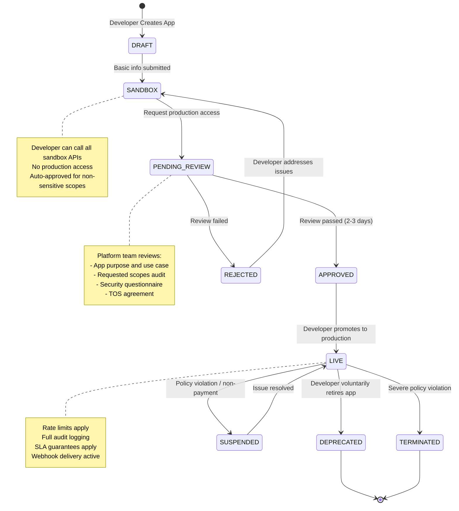
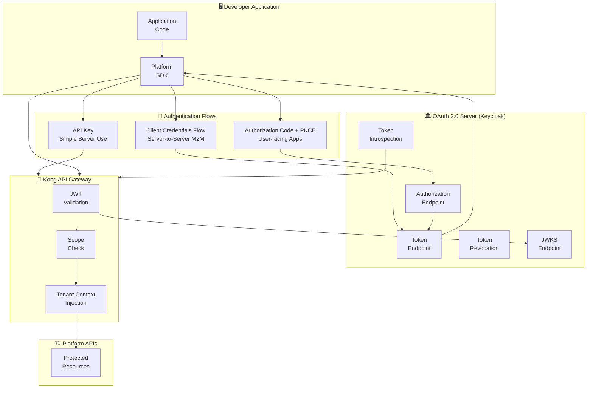
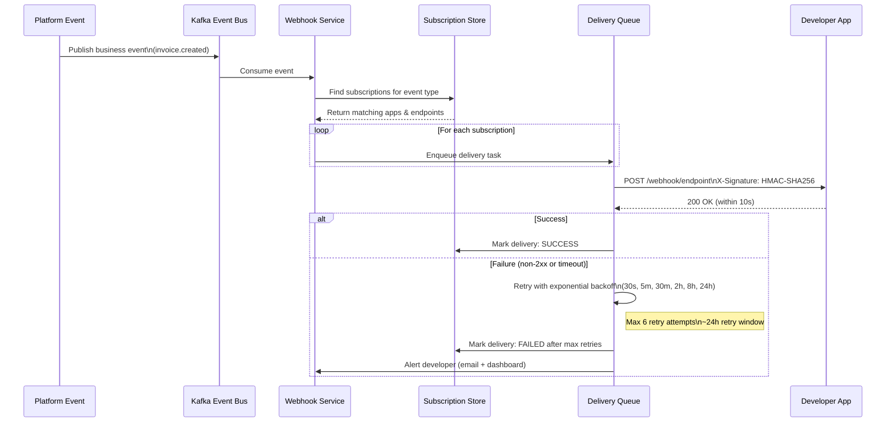
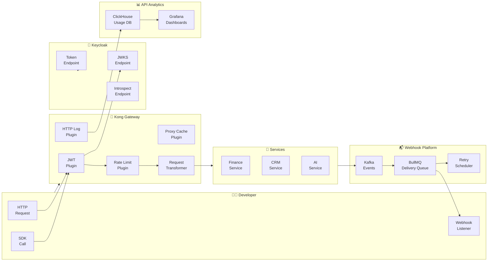
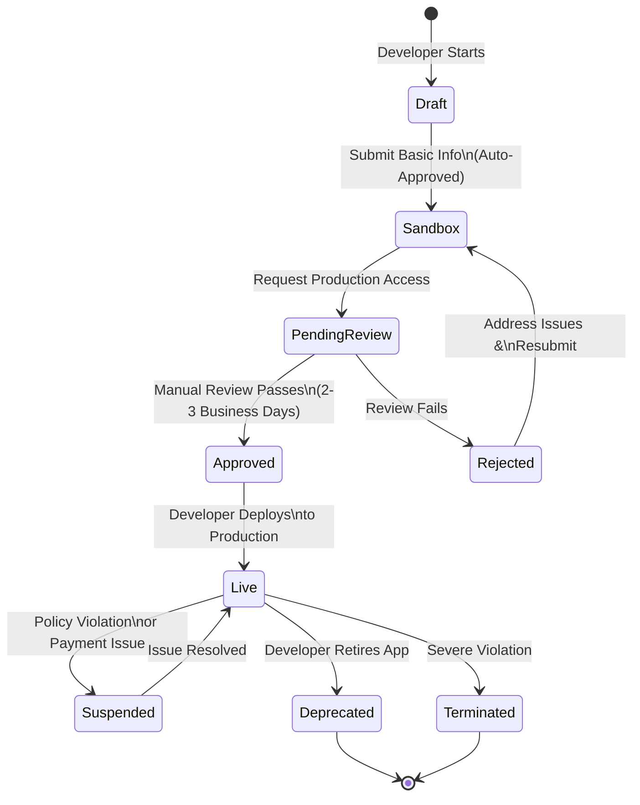
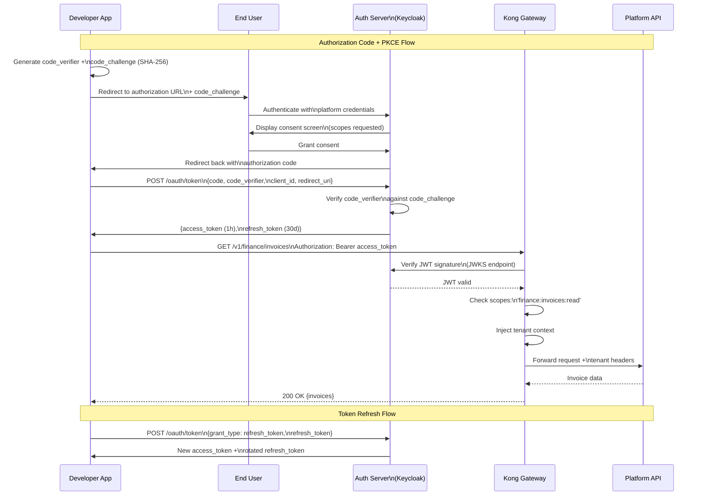

# DEVELOPER PLATFORM FOUNDATION ARCHITECTURE

**Project Name:** Enterprise SaaS Business Management Platform  
**Document Version:** 1.0.0 — Baseline Standard  
**Date:** July 14, 2026  
**Authors:** Principal Platform Architect, Developer Ecosystem Architect, API Platform Engineer, SaaS Marketplace Architect, Enterprise Software Strategist  
**Classification:** Internal — Confidential  
**Phase:** 21.1 — Developer Platform Foundation Architecture  

---

## Table of Contents

1. [Executive Summary](#1-executive-summary)
2. [Developer Ecosystem Vision & Foundation](#2-developer-ecosystem-vision--foundation)
3. [Developer Platform Architecture](#3-developer-platform-architecture)
4. [Developer Portal System](#4-developer-portal-system)
5. [API Platform Foundation](#5-api-platform-foundation)
6. [Developer Application Model](#6-developer-application-model)
7. [SDK Architecture](#7-sdk-architecture)
8. [Authentication & Authorization](#8-authentication--authorization)
9. [Developer Sandbox Environment](#9-developer-sandbox-environment)
10. [API Management Platform](#10-api-management-platform)
11. [Webhook Platform](#11-webhook-platform)
12. [Developer Security Model](#12-developer-security-model)
13. [Developer Experience Journey](#13-developer-experience-journey)
14. [Developer Technology Stack](#14-developer-technology-stack)
15. [API Documentation Platform](#15-api-documentation-platform)
16. [Developer Analytics](#16-developer-analytics)
17. [Partner Integration Model](#17-partner-integration-model)
18. [Developer Governance](#18-developer-governance)
19. [Developer Platform Roadmap](#19-developer-platform-roadmap)
20. [Future Platform Vision](#20-future-platform-vision)
21. [Final Architecture Diagrams](#21-final-architecture-diagrams)
22. [Implementation Summary](#22-implementation-summary)

---

## 1. Executive Summary

### 1.1 Document Purpose

This document defines the complete Developer Platform Foundation Architecture for the SaaS Business Management Platform. It establishes the technical blueprint, governance model, and developer experience strategy for transforming the platform from a closed SaaS application into an open, extensible ecosystem that enables internal engineering teams, external developers, and technology partners to build on top of the platform's capabilities.

### 1.2 Strategic Context

Every great software platform in history achieved scale not by building everything itself, but by creating the conditions for others to build. Salesforce's AppExchange, Shopify's App Store, Stripe's API ecosystem, and Twilio's developer platform all demonstrate a universal truth: **platforms that attract developers grow exponentially faster than products that don't**.

This Developer Platform Foundation is the first phase of the SaaS platform's transformation into an ecosystem company — where the platform's value is amplified by every integration, application, and workflow that partners and developers add to it.

### 1.3 Vision Statement

> Build a world-class developer platform that makes it delightful, safe, and commercially rewarding for developers and partners to extend, integrate, and build on top of the SaaS Business Management Platform — creating a flywheel of innovation that no single engineering team could achieve alone.

### 1.4 Business Case

| Metric | Without Developer Platform | With Developer Platform (3-Year) |
|---|---|---|
| **Integration Coverage** | 20 native integrations | 200+ partner integrations |
| **Feature Velocity** | Internal roadmap only | Internal + ecosystem innovation |
| **Customer Retention** | Standard churn patterns | 3x lower churn for integrated customers |
| **Platform Revenue** | Core SaaS only | Core + marketplace revenue share |
| **Time-to-Market** | 6–18 months per integration | Weeks (partner-built) |
| **Developer Community** | 0 external developers | 5,000+ registered developers |

### 1.5 Platform Tier Overview

| Tier | Audience | Access Level | API Scope |
|---|---|---|---|
| **Internal** | Engineering teams | Full internal APIs | All services |
| **Partner** | Certified technology partners | Approved partner APIs | Curated scope |
| **Public** | Any registered developer | Public APIs | Published endpoints |
| **Enterprise** | Enterprise customers' dev teams | Extended APIs + webhooks | Tenant-scoped |

---

## 2. Developer Ecosystem Vision & Foundation

### 2.1 The Platform Transformation

```
┌──────────────────────────────────────────────────────────────────────┐
│         TRADITIONAL SaaS  →  PLATFORM ECOSYSTEM MODEL                │
│                                                                        │
│  TRADITIONAL SaaS (Company Builds Everything):                        │
│  ──────────────────────────────────────────────                        │
│  Company Engineering                                                   │
│       │                                                                │
│       ▼                                                                │
│  SaaS Application                                                      │
│       │                                                                │
│       ▼                                                                │
│  Customers                                                             │
│                                                                        │
│  Limitations:                                                          │
│  ✗ Bottleneck: All features must go through one roadmap              │
│  ✗ Speed: 6–18 month integration timelines                           │
│  ✗ Coverage: Limited to use cases company imagined                   │
│  ✗ Innovation: Only internal perspective                              │
│                                                                        │
│  PLATFORM ECOSYSTEM MODEL (Company + Partners + Developers):          │
│  ───────────────────────────────────────────────────────────           │
│                                                                        │
│  Internal     External     Technology      Enterprise                 │
│  Engineers  + Developers + Partners     +  Dev Teams                 │
│       │            │            │               │                     │
│       └────────────┴────────────┴───────────────┘                    │
│                            │                                           │
│                       API Platform                                     │
│                            │                                           │
│              ┌─────────────┼─────────────┐                           │
│              ▼             ▼             ▼                            │
│         Core SaaS    Extensions     Integrations                      │
│              │             │             │                            │
│              └─────────────┴─────────────┘                           │
│                            │                                           │
│                       Customers                                        │
│                                                                        │
│  Benefits:                                                             │
│  ✓ Innovation at the speed of the ecosystem                          │
│  ✓ 10x integration coverage                                          │
│  ✓ Marketplace revenue stream                                        │
│  ✓ Community-driven product discovery                                │
│  ✓ Customer lock-in through deep integration                         │
└──────────────────────────────────────────────────────────────────────┘
```

### 2.2 Ecosystem Value Flywheel

```
MORE DEVELOPERS
      │
      ▼
MORE INTEGRATIONS & APPS
      │
      ▼
MORE CUSTOMER VALUE
      │
      ▼
MORE CUSTOMER ADOPTION
      │
      ▼
MORE REVENUE & DATA
      │
      ▼
BETTER PLATFORM CAPABILITIES
      │
      ▼
MORE DEVELOPERS (flywheel repeats)

This is the Ecosystem Flywheel — every improvement
accelerates every other dimension.
```

### 2.3 Developer Personas

| Persona | Description | Primary Need | Success Metric |
|---|---|---|---|
| **Indie Developer** | Solo developer building integrations or plugins | Simple onboarding, clear docs, sandbox | First API call in <30 min |
| **ISV (Independent Software Vendor)** | Company building product integration | Stable APIs, partner support, revenue share | Integration launched in <4 weeks |
| **Enterprise Dev Team** | Customer's internal team extending for their use | Deep API access, custom webhooks, SLA | Custom integration deployed |
| **Technology Partner** | Strategic technology company (ERP, payment, etc.) | Certified partnership, co-marketing | Joint solution launched |
| **System Integrator** | Consulting firm implementing for clients | Templates, tools, client management | Client deployments at scale |
| **Internal Developer** | Platform's own engineering teams | Internal APIs, service mesh access | Full platform capability |

### 2.4 Platform Design Principles

#### Principle 1: Developer-First Experience
Every decision about the developer platform prioritizes the developer's experience: from the quality of documentation to the speed of the sandbox to the clarity of error messages.

#### Principle 2: API Design as Product
APIs are products, not technical interfaces. They have product managers, versioning strategies, deprecation policies, and user research. A poorly designed API is a product failure.

#### Principle 3: Security Without Friction
Robust security (OAuth 2.0, scoped permissions, tenant isolation) must be implemented without making the developer experience painful. Security friction costs adoption.

#### Principle 4: Stability as a Feature
API stability is a commitment to developers who build on the platform. Breaking changes are rare, announced far in advance, and never surprise developers.

#### Principle 5: Everything Has an API
Every core platform capability has a corresponding API. If a feature cannot be accessed programmatically, it is not complete.

---

## 3. Developer Platform Architecture

### 3.1 Complete Platform Architecture

```mermaid
graph TB
    subgraph Developers["👩‍💻 Developer Ecosystem"]
        DEV_INT[Internal\nEngineers]
        DEV_EXT[External\nDevelopers]
        DEV_PART[Technology\nPartners]
        DEV_ENT[Enterprise\nDev Teams]
    end

    subgraph Portal["🌐 Developer Portal (portal.platform.com)"]
        REG[Registration &\nApp Management]
        DOCS[API\nDocumentation]
        SANDBOX_P[Sandbox\nEnvironment]
        DASH_P[Developer\nDashboard]
        SUPPORT_P[Support &\nCommunity]
    end

    subgraph Gateway["🔌 API Gateway Layer (Kong)"]
        AUTH_GW[Authentication\n& Authorization]
        RATE_GW[Rate Limiting\n& Throttling]
        ROUTE_GW[Routing &\nLoad Balancing]
        TRANSFORM_GW[Request/Response\nTransformation]
        CACHE_GW[Response\nCaching]
        ANALYTICS_GW[API\nAnalytics]
    end

    subgraph APIs["📡 Platform APIs"]
        BIZ_API[Business\nAPIs]
        USER_API[User &\nIdentity APIs]
        PAY_API[Payment\nAPIs]
        AI_API[AI &\nAnalytics APIs]
        WEBHOOK_API[Webhook &\nEvent APIs]
        INT_API[Integration\nAPIs]
    end

    subgraph Platform["🏗️ Core Business Platform"]
        FINANCE_S[Finance\nService]
        CRM_S[CRM &\nSales Service]
        INV_S[Inventory\nService]
        HR_S[HR\nService]
        OPS_S[Operations\nService]
        AI_S[AI Platform\nServices]
    end

    subgraph Security["🔒 Security & Governance"]
        OAUTH[OAuth 2.0\nServer Keycloak]
        SCOPE[Permission\nScopes Engine]
        AUDIT[API Audit\nLog]
        THREAT[Threat\nDetection]
    end

    Developers --> Portal
    Portal --> Gateway
    Gateway --> APIs
    APIs --> Platform
    Security --> Gateway & APIs
```



### 3.2 API Traffic Flow

```
DEVELOPER API REQUEST FLOW
────────────────────────────

Developer App
    │
    ▼ HTTPS Request
Kong API Gateway
    │
    ├─► Token Validation (OAuth 2.0 / API Key)
    │         │ Invalid → 401 Unauthorized
    │         │ Valid → Continue
    │
    ├─► Scope Check (Does token have required scope?)
    │         │ Missing scope → 403 Forbidden
    │         │ Authorized → Continue
    │
    ├─► Rate Limit Check (Within quota?)
    │         │ Exceeded → 429 Too Many Requests
    │         │ Within limit → Continue
    │
    ├─► Tenant Isolation (Inject tenant context)
    │         │ Extract tenant from token/header
    │         │ Apply tenant isolation headers
    │
    ├─► Request Transform (Version normalization)
    │         │ Map v1 API to current internal API
    │
    ├─► Route to Service
    │         │ Finance / CRM / Inventory / AI etc.
    │
    ├─► Response (with audit log written async)
    │
    └─► Metrics published to Analytics pipeline
```

---

## 4. Developer Portal System

### 4.1 Portal Feature Architecture

```
┌──────────────────────────────────────────────────────────────────────┐
│                    DEVELOPER PORTAL SYSTEM                            │
│                    portal.platform.com                                 │
│                                                                        │
│  ONBOARDING ZONE                                                       │
│  ─────────────────                                                     │
│  • Developer Registration (email + company + use case)               │
│  • Identity verification (email confirmation + optional KYB)          │
│  • Tier selection: Free / Partner / Enterprise                        │
│  • Quick-start guide (5 minutes to first API call)                   │
│  • API key generation (immediate, no approval required for sandbox)  │
│                                                                        │
│  APPLICATION MANAGEMENT                                                │
│  ──────────────────────────                                            │
│  • Create applications (named, scoped, with redirect URIs)            │
│  • Manage OAuth credentials (client_id, client_secret rotation)       │
│  • Configure webhooks (events, endpoints, secret keys)               │
│  • Review application status (sandbox / pending / approved / live)   │
│  • Monitor per-application usage metrics                             │
│                                                                        │
│  API DOCUMENTATION CENTER                                              │
│  ──────────────────────────                                            │
│  • OpenAPI 3.1 interactive explorer (Swagger UI / Redoc)             │
│  • Auto-generated code samples (JS, Python, PHP, Go, Ruby)           │
│  • SDK download center (with changelog)                               │
│  • Changelog and deprecation notices                                 │
│  • Video tutorials and guides                                        │
│                                                                        │
│  SANDBOX & TESTING                                                     │
│  ──────────────────                                                    │
│  • Persistent sandbox environment (isolated per developer)           │
│  • Pre-seeded test data (companies, products, customers, invoices)   │
│  • API playground (live test from browser)                           │
│  • Webhook testing (request bin integration)                         │
│  • Test card numbers and test payment credentials                    │
│                                                                        │
│  DEVELOPER DASHBOARD                                                   │
│  ──────────────────────                                                │
│  • Real-time API usage (requests, errors, latency)                   │
│  • Quota consumption and limits                                      │
│  • Application health and webhook delivery status                    │
│  • Earnings dashboard (marketplace revenue, if applicable)           │
│                                                                        │
│  SUPPORT & COMMUNITY                                                   │
│  ──────────────────────                                                │
│  • Ticketing system (developer support SLA)                          │
│  • Community forum (Stack Overflow for our platform)                 │
│  • Status page (API uptime and incident history)                     │
│  • Changelog subscription (email + RSS)                              │
└──────────────────────────────────────────────────────────────────────┘
```

### 4.2 Developer Registration Service

```typescript
// Developer Registration & App Management Service
@Injectable()
export class DeveloperRegistrationService {
  async registerDeveloper(dto: RegisterDeveloperDto): Promise<DeveloperAccount> {
    // 1. Validate email uniqueness
    const existing = await this.developerRepo.findByEmail(dto.email);
    if (existing) throw new ConflictException('Email already registered');
    
    // 2. Create developer account
    const account = await this.developerRepo.create({
      email: dto.email,
      firstName: dto.firstName,
      lastName: dto.lastName,
      companyName: dto.companyName,
      useCase: dto.useCase,
      tier: DeveloperTier.FREE,            // Start on free tier
      status: DeveloperStatus.PENDING_EMAIL_VERIFICATION,
      sandboxTenantId: await this.provisionSandbox(),
    });
    
    // 3. Send verification email
    await this.emailService.sendDeveloperVerification(account);
    
    // 4. Provision sandbox environment
    await this.sandboxService.provisionDeveloperSandbox(account.id);
    
    // 5. Track in analytics
    await this.analyticsService.track('developer.registered', {
      developerId: account.id,
      tier: account.tier,
      useCase: dto.useCase,
    });
    
    return account;
  }

  async createApplication(
    developerId: string,
    dto: CreateApplicationDto
  ): Promise<DeveloperApplication> {
    // Validate developer account is active
    const developer = await this.developerRepo.findById(developerId);
    if (developer.status !== DeveloperStatus.ACTIVE) {
      throw new ForbiddenException('Account must be verified to create applications');
    }
    
    // Check application limit per tier
    const existingApps = await this.appRepo.countByDeveloper(developerId);
    const limit = this.getTierAppLimit(developer.tier);
    if (existingApps >= limit) {
      throw new QuotaExceededException(`App limit for ${developer.tier} tier: ${limit}`);
    }
    
    // Generate OAuth credentials
    const clientId = this.generateClientId();
    const clientSecret = await this.generateClientSecret();
    
    return this.appRepo.create({
      developerId,
      name: dto.name,
      description: dto.description,
      redirectUris: dto.redirectUris,
      webhookUrl: dto.webhookUrl,
      requestedScopes: dto.requestedScopes,
      clientId,
      clientSecretHash: await bcrypt.hash(clientSecret, 12),
      status: this.requiresReview(dto) ? AppStatus.PENDING_REVIEW : AppStatus.SANDBOX,
      environment: AppEnvironment.SANDBOX,
    });
  }
  
  // App requires review if requesting sensitive scopes
  private requiresReview(dto: CreateApplicationDto): boolean {
    const sensitiveScopes = ['payments:write', 'users:admin', 'data:export'];
    return dto.requestedScopes.some(scope => sensitiveScopes.includes(scope));
  }
}
```

### 4.3 Developer Portal Next.js Implementation

```typescript
// Developer Portal — Application Dashboard Page
// /apps/[appId]/page.tsx

export default async function ApplicationDashboard({ params }: Props) {
  const app = await getApplication(params.appId);
  const metrics = await getApplicationMetrics(params.appId, { period: '30d' });
  const webhooks = await getWebhookDeliveries(params.appId, { limit: 10 });
  
  return (
    <DeveloperLayout>
      {/* Application Header */}
      <AppHeader app={app} />
      
      {/* Status Banner */}
      {app.status === 'PENDING_REVIEW' && (
        <Alert type="info">
          Your application is under review. Typically takes 2-3 business days.
          <Link href="/docs/app-review">Learn about the review process</Link>
        </Alert>
      )}
      
      {/* Metrics Overview */}
      <MetricsGrid>
        <MetricCard label="API Calls (30d)" value={metrics.totalCalls} trend={metrics.callsTrend} />
        <MetricCard label="Error Rate" value={`${metrics.errorRate}%`} status={metrics.errorRate < 1 ? 'good' : 'warning'} />
        <MetricCard label="Avg Latency" value={`${metrics.avgLatencyMs}ms`} />
        <MetricCard label="Quota Used" value={`${metrics.quotaPercent}%`} showBar />
      </MetricsGrid>
      
      {/* API Credentials */}
      <CredentialsSection
        clientId={app.clientId}
        scopes={app.approvedScopes}
        onRotateSecret={rotateClientSecret}
      />
      
      {/* Webhook Status */}
      <WebhookSection
        webhookUrl={app.webhookUrl}
        recentDeliveries={webhooks}
        onSendTestEvent={sendTestWebhook}
      />
      
      {/* API Key Manager */}
      <ApiKeyManager appId={app.id} keys={app.apiKeys} />
      
      {/* Quick Links */}
      <QuickLinks>
        <Link href="/docs/api">API Reference</Link>
        <Link href="/sandbox">Open Sandbox</Link>
        <Link href="/support">Developer Support</Link>
      </QuickLinks>
    </DeveloperLayout>
  );
}
```

---

## 5. API Platform Foundation

### 5.1 API Category Architecture

```
┌──────────────────────────────────────────────────────────────────────┐
│                       PLATFORM API CATEGORIES                         │
│                                                                        │
│  BUSINESS APIS (Core Operations)                                       │
│  ──────────────────────────────                                        │
│  /v1/finance                    Financial records, invoices, payments  │
│  /v1/sales                      CRM, leads, opportunities, contacts   │
│  /v1/inventory                  Products, stock, warehouses           │
│  /v1/orders                     Order lifecycle management            │
│  /v1/hr                         Employees, leave, payroll             │
│  /v1/projects                   Project management and tasks          │
│                                                                        │
│  USER & IDENTITY APIS                                                  │
│  ─────────────────────                                                 │
│  /v1/users                      User management, roles, permissions   │
│  /v1/organizations              Tenant/organization management        │
│  /v1/teams                      Team structure and membership         │
│  /v1/auth                       Token validation, session management  │
│                                                                        │
│  PAYMENT APIS                                                          │
│  ─────────────                                                         │
│  /v1/payments                   Payment processing and history        │
│  /v1/subscriptions              Subscription lifecycle                │
│  /v1/invoices                   Invoice generation and management     │
│  /v1/billing                    Billing plans and pricing             │
│                                                                        │
│  AI & ANALYTICS APIS                                                   │
│  ───────────────────                                                   │
│  /v1/analytics                  Business metrics and KPIs             │
│  /v1/predictions                ML model predictions                  │
│  /v1/ai/query                   Natural language query interface      │
│  /v1/ai/agents                  AI agent invocation                   │
│  /v1/insights                   AI-generated business insights        │
│                                                                        │
│  INTEGRATION APIS                                                      │
│  ─────────────────                                                     │
│  /v1/webhooks                   Webhook subscription management       │
│  /v1/events                     Business event stream access          │
│  /v1/files                      File upload and document management   │
│  /v1/notifications              Cross-channel notification management  │
│                                                                        │
│  PLATFORM APIS (Developer-Specific)                                    │
│  ─────────────────────────────────                                     │
│  /v1/apps                       Application registration and mgmt     │
│  /v1/scopes                     Available permission scopes           │
│  /v1/usage                      API usage statistics                  │
│  /v1/sandbox                    Sandbox data management               │
└──────────────────────────────────────────────────────────────────────┘
```

### 5.2 API Design Standards

```typescript
// Platform API — Standard Response Envelope
interface APIResponse<T> {
  // Always present
  success: boolean;
  data: T;
  
  // Pagination (list endpoints)
  pagination?: {
    page: number;
    perPage: number;
    totalCount: number;
    totalPages: number;
    hasNextPage: boolean;
    cursor?: string;               // Cursor-based pagination for high-volume
  };
  
  // Error (when success = false)
  error?: {
    code: string;                  // Machine-readable: 'RESOURCE_NOT_FOUND'
    message: string;               // Human-readable explanation
    field?: string;                // For validation errors: which field
    docs?: string;                 // Link to relevant documentation
    requestId: string;             // For support tracing
  };
  
  // Always present metadata
  meta: {
    requestId: string;             // Unique request identifier
    version: string;               // API version: 'v1'
    timestamp: string;             // ISO 8601
    rateLimit: {
      limit: number;
      remaining: number;
      resetAt: string;
    };
  };
}

// Platform API — Standard Error Codes
enum APIErrorCode {
  // Auth errors
  UNAUTHORIZED = 'UNAUTHORIZED',                     // 401: No valid credentials
  FORBIDDEN = 'FORBIDDEN',                           // 403: Insufficient scope
  TOKEN_EXPIRED = 'TOKEN_EXPIRED',                   // 401: Token expired
  
  // Resource errors
  NOT_FOUND = 'NOT_FOUND',                           // 404: Resource not found
  CONFLICT = 'CONFLICT',                             // 409: Duplicate resource
  
  // Request errors
  VALIDATION_ERROR = 'VALIDATION_ERROR',             // 422: Invalid request body
  INVALID_PARAMETER = 'INVALID_PARAMETER',           // 400: Bad query params
  
  // Quota errors
  RATE_LIMIT_EXCEEDED = 'RATE_LIMIT_EXCEEDED',       // 429: Too many requests
  QUOTA_EXCEEDED = 'QUOTA_EXCEEDED',                 // 429: Monthly quota
  
  // Platform errors
  INTERNAL_ERROR = 'INTERNAL_ERROR',                 // 500: Unexpected error
  SERVICE_UNAVAILABLE = 'SERVICE_UNAVAILABLE',       // 503: Downstream unavailable
  TENANT_SUSPENDED = 'TENANT_SUSPENDED',             // 403: Tenant account issue
}
```

### 5.3 Business API — Finance Example

```typescript
// Finance API Controller
@Controller('v1/finance')
@UseGuards(ApiKeyGuard, OAuthGuard, ScopeGuard)
export class FinanceAPIController {
  
  @Get('invoices')
  @RequireScope('finance:invoices:read')
  @ApiOperation({ summary: 'List invoices', description: 'Returns paginated invoices for the authenticated tenant' })
  @ApiQuery({ name: 'status', enum: InvoiceStatus, required: false })
  @ApiQuery({ name: 'from_date', type: 'string', example: '2026-01-01' })
  @ApiQuery({ name: 'cursor', type: 'string', required: false })
  @ApiQuery({ name: 'limit', type: 'number', default: 20, maximum: 100 })
  @ApiBearerAuth()
  async listInvoices(
    @CurrentTenant() tenantId: string,
    @Query() query: ListInvoicesQueryDto,
    @Req() req: Request
  ): Promise<APIResponse<Invoice[]>> {
    const result = await this.invoiceService.list(tenantId, {
      status: query.status,
      fromDate: query.from_date,
      cursor: query.cursor,
      limit: Math.min(query.limit ?? 20, 100),
    });
    
    return {
      success: true,
      data: result.invoices.map(this.serializeInvoice),
      pagination: {
        page: result.page,
        perPage: result.perPage,
        totalCount: result.totalCount,
        totalPages: result.totalPages,
        hasNextPage: result.hasNextPage,
        cursor: result.nextCursor,
      },
      meta: buildApiMeta(req),
    };
  }
  
  @Post('invoices')
  @RequireScope('finance:invoices:write')
  @ApiOperation({ summary: 'Create invoice' })
  async createInvoice(
    @CurrentTenant() tenantId: string,
    @Body() dto: CreateInvoiceDto,
    @Req() req: Request
  ): Promise<APIResponse<Invoice>> {
    const invoice = await this.invoiceService.create(tenantId, dto);
    
    // Publish webhook event
    await this.webhookService.publish(tenantId, 'invoice.created', {
      invoiceId: invoice.id,
      amount: invoice.totalAmount,
      currency: invoice.currency,
      customerId: invoice.customerId,
    });
    
    return { success: true, data: this.serializeInvoice(invoice), meta: buildApiMeta(req) };
  }
}
```

---

## 6. Developer Application Model

### 6.1 Application Lifecycle



### 6.2 Application Data Model

```typescript
// Developer Application Entity
@Entity('developer_applications')
export class DeveloperApplication {
  @PrimaryGeneratedColumn('uuid')
  id: string;

  @Column()
  developerId: string;                   // Reference to developer account

  @Column()
  name: string;                          // Display name

  @Column({ type: 'text', nullable: true })
  description: string;

  @Column()
  clientId: string;                      // OAuth client_id (public)

  @Column()
  clientSecretHash: string;              // bcrypt hash of client_secret

  @Column({ type: 'simple-array' })
  redirectUris: string[];               // Allowed OAuth redirect URIs

  @Column({ type: 'enum', enum: AppStatus })
  status: AppStatus;                    // DRAFT / SANDBOX / PENDING / APPROVED / LIVE / SUSPENDED

  @Column({ type: 'enum', enum: AppEnvironment })
  environment: AppEnvironment;          // SANDBOX / PRODUCTION

  @Column({ type: 'simple-array' })
  requestedScopes: string[];            // Scopes the app requested

  @Column({ type: 'simple-array', default: [] })
  approvedScopes: string[];             // Scopes that passed review

  @Column({ nullable: true })
  webhookUrl: string;                   // Where to deliver events

  @Column({ nullable: true })
  webhookSecretHash: string;            // HMAC signing secret hash

  @Column({ type: 'simple-array', default: [] })
  webhookEvents: string[];              // Which events to deliver

  @Column({ type: 'jsonb', default: {} })
  rateLimits: {
    requestsPerMinute: number;
    requestsPerDay: number;
    requestsPerMonth: number;
  };

  @Column({ type: 'jsonb', default: {} })
  reviewNotes: {
    reviewerId?: string;
    reviewDate?: Date;
    notes?: string;
    rejectionReason?: string;
  };

  @CreateDateColumn()
  createdAt: Date;

  @UpdateDateColumn()
  updatedAt: Date;
}

// Scope Registry — Available Permission Scopes
export const PLATFORM_SCOPES = {
  // Finance scopes
  'finance:invoices:read':       'Read invoices and financial records',
  'finance:invoices:write':      'Create and update invoices',
  'finance:payments:read':       'Read payment history',
  'finance:payments:write':      'Process payments (requires partner review)',
  'finance:reports:read':        'Access financial reports',

  // CRM scopes
  'crm:contacts:read':           'Read customer contacts',
  'crm:contacts:write':          'Create and update contacts',
  'crm:deals:read':              'Read sales opportunities',
  'crm:deals:write':             'Create and update deals',

  // Inventory scopes
  'inventory:products:read':     'Read product catalog',
  'inventory:products:write':    'Create and update products',
  'inventory:stock:read':        'Read inventory levels',
  'inventory:stock:write':       'Update inventory (requires review)',

  // AI scopes
  'ai:analytics:read':           'Access analytics predictions',
  'ai:query:execute':            'Execute natural language queries',
  'ai:agents:invoke':            'Invoke AI agents (requires partner tier)',

  // User scopes
  'users:profile:read':          'Read authenticated user profile',
  'users:team:read':             'Read team members (own org only)',
  'users:admin':                 'User administration (enterprise only)',

  // Webhook scopes
  'webhooks:read':               'Read webhook configurations',
  'webhooks:write':              'Configure webhooks',

  // Data scopes (sensitive — requires review)
  'data:export':                 'Bulk data export (requires enterprise tier)',
} as const;
```

### 6.3 App Review Workflow

```typescript
// App Review Service — Platform team reviews production access requests
@Injectable()
export class AppReviewService {
  async submitForReview(
    appId: string,
    reviewRequest: ReviewRequestDto
  ): Promise<ReviewSubmission> {
    const app = await this.appRepo.findById(appId);
    
    // Auto-check scope eligibility
    const sensitiveScopes = this.identifySensitiveScopes(app.requestedScopes);
    const requiresManualReview = sensitiveScopes.length > 0 || reviewRequest.requestingProduction;
    
    // Run automated security checks
    const autoChecks = await this.runAutomatedChecks(app, reviewRequest);
    
    if (!requiresManualReview && autoChecks.allPassed) {
      // Auto-approve for non-sensitive scope requests
      await this.autoApprove(app);
      return { type: 'auto_approved', estimatedTime: null };
    }
    
    // Create review ticket
    const review = await this.reviewRepo.create({
      appId,
      reviewRequest,
      sensitiveScopes,
      autoCheckResults: autoChecks,
      status: ReviewStatus.PENDING,
      assignedReviewer: await this.assignReviewer(),
      submittedAt: new Date(),
    });
    
    // Notify review team
    await this.notifyReviewTeam(review);
    
    // Notify developer
    await this.emailService.sendReviewSubmitted(app.developer.email, {
      appName: app.name,
      estimatedDays: sensitiveScopes.length > 0 ? 3 : 2,
      reviewId: review.id,
    });
    
    return { type: 'manual_review', estimatedDays: 3, reviewId: review.id };
  }
  
  private async runAutomatedChecks(
    app: DeveloperApplication,
    request: ReviewRequestDto
  ): Promise<AutoCheckResults> {
    return {
      webhookUrlReachable: request.webhookUrl ? await this.testWebhookUrl(request.webhookUrl) : true,
      redirectUrisValid: app.redirectUris.every(uri => this.isValidRedirectUri(uri)),
      noSuspiciousPatterns: await this.scanForSuspiciousPatterns(app),
      termsAccepted: request.termsAccepted,
      securityQuestionnaireComplete: Boolean(request.securityQuestionnaire),
      allPassed: false,  // computed
    };
  }
}
```

---

## 7. SDK Architecture

### 7.1 Multi-Language SDK Strategy

```
┌──────────────────────────────────────────────────────────────────────┐
│                     SDK ARCHITECTURE OVERVIEW                         │
│                                                                        │
│  PHILOSOPHY: SDK as a First-Class Product                             │
│  • Auto-generated from OpenAPI spec (OpenAPI Generator)              │
│  • Hand-crafted developer ergonomics layer on top of generated code  │
│  • Idiomatic patterns for each language                              │
│  • Published to official package registries                          │
│  • Maintained with platform versioning                               │
│                                                                        │
│  SUPPORTED LANGUAGES:                                                  │
│                                                                        │
│  JavaScript/TypeScript (npm: @platform/sdk)                          │
│  • Primary SDK — most developers use JS                              │
│  • TypeScript-native with full type inference                        │
│  • Works in Node.js, Deno, browsers, and edge runtimes              │
│  • Tree-shakeable for frontend use cases                             │
│                                                                        │
│  Python (pip: platform-sdk)                                           │
│  • Second most popular developer language for integrations           │
│  • Async-first (asyncio support)                                     │
│  • Django and FastAPI helper modules                                 │
│  • Data science integrations (pandas, etc.)                          │
│                                                                        │
│  Mobile SDK (React Native)                                            │
│  • iOS and Android via React Native bridge                           │
│  • OAuth 2.0 PKCE flow for mobile                                   │
│  • Offline-capable operations with sync                              │
│  • Native push notification integration                              │
│                                                                        │
│  Backend / Server SDKs                                                 │
│  • PHP (Composer)                                                     │
│  • Go (Go modules)                                                    │
│  • Ruby (RubyGems)                                                    │
│  • Java / Kotlin (Maven)                                              │
└──────────────────────────────────────────────────────────────────────┘
```

### 7.2 JavaScript SDK Implementation

```typescript
// @platform/sdk — JavaScript/TypeScript SDK
// npm install @platform/sdk

import { PlatformClient } from '@platform/sdk';

// Initialize client
const platform = new PlatformClient({
  clientId: 'your_client_id',
  clientSecret: 'your_client_secret',   // Or use accessToken directly
  environment: 'sandbox',               // 'sandbox' | 'production'
  
  // Optional configuration
  timeout: 30000,
  retries: 3,
  retryDelay: 1000,
  onRateLimit: 'wait',                  // 'wait' | 'throw'
  logger: console,                      // Pluggable logging
});

// Usage examples

// Finance API
const invoices = await platform.finance.invoices.list({
  status: 'pending',
  fromDate: '2026-01-01',
  limit: 50,
});

const newInvoice = await platform.finance.invoices.create({
  customerId: 'cust_abc123',
  lineItems: [
    { description: 'Professional Services', quantity: 10, unitPrice: 150.00 },
  ],
  currency: 'USD',
  dueDate: '2026-08-14',
});

// CRM API
const contacts = await platform.crm.contacts.list({ page: 1, perPage: 20 });
const deal = await platform.crm.deals.create({
  name: 'Acme Corp - Enterprise',
  value: 50000,
  stage: 'proposal',
  contactId: 'cont_xyz789',
});

// AI API
const forecast = await platform.ai.predictions.get('revenue_forecast', {
  horizon: '90d',
  confidence: 0.80,
});

const nlAnswer = await platform.ai.query('Why did revenue decrease last month?');
// Returns: { answer: string, confidence: number, charts: Chart[], followUps: string[] }

// Webhook management
await platform.webhooks.subscribe({
  events: ['invoice.created', 'payment.received'],
  url: 'https://myapp.com/webhooks/platform',
  secret: 'my_webhook_secret',
});

// Pagination helper
for await (const contact of platform.crm.contacts.listAll()) {
  console.log(contact.name);    // Handles pagination automatically
}

// SDK Implementation
class PlatformClient {
  public finance: FinanceAPI;
  public crm: CRMAPI;
  public inventory: InventoryAPI;
  public ai: AIAPI;
  public webhooks: WebhookAPI;
  public users: UsersAPI;
  
  private http: HttpClient;
  private auth: OAuthClient;
  
  constructor(config: PlatformClientConfig) {
    this.auth = new OAuthClient(config);
    this.http = new HttpClient({
      baseUrl: config.environment === 'production' 
        ? 'https://api.platform.com' 
        : 'https://sandbox-api.platform.com',
      auth: this.auth,
      timeout: config.timeout ?? 30000,
      retries: config.retries ?? 3,
    });
    
    // Initialize domain-specific clients
    this.finance = new FinanceAPI(this.http);
    this.crm = new CRMAPI(this.http);
    this.inventory = new InventoryAPI(this.http);
    this.ai = new AIAPI(this.http);
    this.webhooks = new WebhookAPI(this.http);
    this.users = new UsersAPI(this.http);
  }
}
```

### 7.3 Python SDK Implementation

```python
# platform-sdk — Python SDK
# pip install platform-sdk

from platform_sdk import PlatformClient
from platform_sdk.models import CreateInvoiceRequest, LineItem
import asyncio

# Initialize client
client = PlatformClient(
    client_id="your_client_id",
    client_secret="your_client_secret",
    environment="sandbox",              # "sandbox" | "production"
)

# Sync usage
invoices = client.finance.invoices.list(status="pending", limit=50)

new_invoice = client.finance.invoices.create(
    CreateInvoiceRequest(
        customer_id="cust_abc123",
        line_items=[LineItem(description="Services", quantity=5, unit_price=200.0)],
        currency="USD",
    )
)

# Async usage (recommended for high-throughput)
async def main():
    async with PlatformClient(
        client_id="your_client_id",
        client_secret="your_client_secret",
    ) as client:
        # Parallel API calls
        invoices, contacts, forecast = await asyncio.gather(
            client.finance.invoices.list_async(status="pending"),
            client.crm.contacts.list_async(limit=100),
            client.ai.predictions.get_async("revenue_forecast"),
        )
        
        # Iterate all pages automatically
        async for contact in client.crm.contacts.list_all_async():
            print(f"Contact: {contact.name}, Email: {contact.email}")
        
        # Natural language query
        result = await client.ai.query_async("What is our highest revenue product?")
        print(result.answer)

asyncio.run(main())
```

---

## 8. Authentication & Authorization

### 8.1 Auth Architecture Overview



### 8.2 OAuth 2.0 Implementation

```typescript
// OAuth 2.0 Client Credentials Flow (M2M)
// Used by server-side applications without user context

// Step 1: Request access token
const tokenResponse = await fetch('https://auth.platform.com/oauth/token', {
  method: 'POST',
  headers: { 'Content-Type': 'application/x-www-form-urlencoded' },
  body: new URLSearchParams({
    grant_type: 'client_credentials',
    client_id: 'your_client_id',
    client_secret: 'your_client_secret',
    scope: 'finance:invoices:read crm:contacts:read',
  }),
});

// Response
// {
//   "access_token": "eyJhbGc...",
//   "token_type": "Bearer",
//   "expires_in": 3600,
//   "scope": "finance:invoices:read crm:contacts:read"
// }

// Step 2: Use token in API calls
const invoices = await fetch('https://api.platform.com/v1/finance/invoices', {
  headers: {
    'Authorization': `Bearer ${tokenResponse.access_token}`,
    'X-Tenant-ID': 'your_tenant_id',    // Required for multi-tenant context
  },
});
```

```typescript
// OAuth 2.0 Authorization Code + PKCE Flow (User-facing)
// Used by apps that need to access data on behalf of a user

import { generateCodeVerifier, generateCodeChallenge } from '@platform/sdk/auth';

// Step 1: Generate PKCE challenge
const codeVerifier = generateCodeVerifier();           // Random 43-128 char string
const codeChallenge = await generateCodeChallenge(codeVerifier);  // SHA-256 hash

// Step 2: Redirect user to authorization endpoint
const authUrl = new URL('https://auth.platform.com/oauth/authorize');
authUrl.searchParams.set('response_type', 'code');
authUrl.searchParams.set('client_id', 'your_client_id');
authUrl.searchParams.set('redirect_uri', 'https://myapp.com/callback');
authUrl.searchParams.set('scope', 'finance:invoices:read users:profile:read');
authUrl.searchParams.set('state', generateState());           // CSRF protection
authUrl.searchParams.set('code_challenge', codeChallenge);
authUrl.searchParams.set('code_challenge_method', 'S256');

// Step 3: User authenticates and platform redirects back
// GET https://myapp.com/callback?code=AUTH_CODE&state=STATE

// Step 4: Exchange code for tokens
const tokenResponse = await fetch('https://auth.platform.com/oauth/token', {
  method: 'POST',
  headers: { 'Content-Type': 'application/x-www-form-urlencoded' },
  body: new URLSearchParams({
    grant_type: 'authorization_code',
    client_id: 'your_client_id',
    code: authCode,
    redirect_uri: 'https://myapp.com/callback',
    code_verifier: codeVerifier,         // PKCE verification
  }),
});
// Returns: access_token + refresh_token
```

### 8.3 Scope-Based Permission System

```typescript
// Scope Validation Service
@Injectable()
export class ScopeValidationService {
  // Scope hierarchy — parent scopes include child scopes
  private readonly scopeHierarchy: Record<string, string[]> = {
    'finance:*': ['finance:invoices:read', 'finance:invoices:write', 'finance:payments:read'],
    'crm:*': ['crm:contacts:read', 'crm:contacts:write', 'crm:deals:read', 'crm:deals:write'],
    'admin:*': ['users:admin', 'finance:*', 'crm:*'],
  };

  // Scope tier requirements
  private readonly scopeTierRequirements: Record<string, DeveloperTier> = {
    'ai:agents:invoke': DeveloperTier.PARTNER,
    'data:export': DeveloperTier.ENTERPRISE,
    'users:admin': DeveloperTier.ENTERPRISE,
    'finance:payments:write': DeveloperTier.PARTNER,
  };

  validateScopes(
    tokenScopes: string[],
    requiredScope: string,
    developerTier: DeveloperTier
  ): ScopeValidationResult {
    // Check tier requirement first
    const tierRequired = this.scopeTierRequirements[requiredScope];
    if (tierRequired && !this.tierSatisfies(developerTier, tierRequired)) {
      return {
        valid: false,
        reason: `Scope '${requiredScope}' requires ${tierRequired} tier`,
        upgradeUrl: 'https://platform.com/developers/upgrade',
      };
    }
    
    // Expand wildcards and check if token has required scope
    const expandedTokenScopes = this.expandScopes(tokenScopes);
    if (!expandedTokenScopes.includes(requiredScope)) {
      return {
        valid: false,
        reason: `Missing required scope: '${requiredScope}'`,
        docsUrl: `https://docs.platform.com/scopes/${requiredScope}`,
      };
    }
    
    return { valid: true };
  }
}

// Decorator for scope-guarded API endpoints
export const RequireScope = (scope: string) =>
  SetMetadata(SCOPE_METADATA_KEY, scope);

// Guard that enforces scope requirement
@Injectable()
export class ScopeGuard implements CanActivate {
  canActivate(context: ExecutionContext): boolean {
    const requiredScope = this.reflector.get<string>(SCOPE_METADATA_KEY, context.getHandler());
    const request = context.switchToHttp().getRequest();
    const tokenScopes = request.auth.scopes;
    const developerTier = request.auth.developerTier;
    
    const result = this.scopeService.validateScopes(tokenScopes, requiredScope, developerTier);
    if (!result.valid) {
      throw new ForbiddenException({
        error: { code: 'FORBIDDEN', message: result.reason, docs: result.docsUrl }
      });
    }
    return true;
  }
}
```

---

## 9. Developer Sandbox Environment

### 9.1 Sandbox Architecture

```
┌──────────────────────────────────────────────────────────────────────┐
│                    DEVELOPER SANDBOX ENVIRONMENT                       │
│                                                                        │
│  SANDBOX ISOLATION MODEL                                               │
│  ──────────────────────────                                            │
│  Each developer account gets a dedicated sandbox tenant:              │
│  • Isolated PostgreSQL schema (sandbox_{developerId})                 │
│  • Isolated Redis namespace                                           │
│  • Isolated Kafka consumer group                                      │
│  • Sandboxed API keys (cannot access production)                     │
│  • Separate auth token audience (sandbox.platform.com)               │
│                                                                        │
│  PRE-SEEDED TEST DATA                                                  │
│  ─────────────────────                                                 │
│  Finance:                                                              │
│    • 50 sample invoices (various states)                             │
│    • 20 payment records                                              │
│    • 5 supplier records                                              │
│    • Chart of accounts                                               │
│                                                                        │
│  CRM:                                                                  │
│    • 100 sample contacts                                             │
│    • 30 companies                                                    │
│    • 20 open deals (various stages)                                  │
│                                                                        │
│  Inventory:                                                            │
│    • 200 sample products                                             │
│    • 3 warehouses                                                    │
│    • Realistic stock levels                                          │
│                                                                        │
│  Users:                                                                │
│    • 10 sample team members (various roles)                          │
│    • Role assignments                                                │
│                                                                        │
│  MOCK BEHAVIORS                                                        │
│  ──────────────                                                        │
│  Payment Processing:                                                   │
│    • Test card: 4242 4242 4242 4242 → always succeeds               │
│    • Test card: 4000 0000 0000 0002 → always declines               │
│    • Test card: 4000 0025 0000 3155 → requires 3D Secure            │
│                                                                        │
│  AI Features:                                                          │
│    • Prediction endpoints return realistic mock predictions           │
│    • NL query returns coherent answers from sandbox data              │
│    • Agents operate in sandbox mode (no real emails sent)            │
│                                                                        │
│  Webhooks:                                                             │
│    • Sandbox events fire in real-time                                │
│    • Test event trigger button in portal                             │
│    • Webhook.site integration for quick testing                      │
└──────────────────────────────────────────────────────────────────────┘
```

### 9.2 Sandbox Service

```typescript
// Sandbox Management Service
@Injectable()
export class SandboxService {
  async provisionDeveloperSandbox(developerId: string): Promise<SandboxEnvironment> {
    const tenantId = `sandbox_${developerId}`;
    
    // 1. Create isolated tenant schema
    await this.databaseService.createSchema(tenantId);
    
    // 2. Seed test data
    await this.seedTestData(tenantId);
    
    // 3. Create sandbox API credentials
    const sandboxKey = await this.apiKeyService.createSandboxKey(developerId, tenantId);
    
    // 4. Provision sandbox-scoped OAuth client
    await this.keycloakService.createSandboxClient({
      clientId: `sandbox_${developerId}`,
      tenantId,
      allowedScopes: ['finance:*', 'crm:*', 'inventory:*', 'ai:analytics:read'],
    });
    
    // 5. Set up webhook test endpoint (WebhookSite proxy)
    const webhookTestUrl = await this.webhookTestService.provisionEndpoint(developerId);
    
    return {
      tenantId,
      sandboxApiKey: sandboxKey.key,
      sandboxApiBaseUrl: 'https://sandbox-api.platform.com/v1',
      webhookTestUrl,
      createdAt: new Date(),
    };
  }

  async seedTestData(tenantId: string): Promise<void> {
    // Seed from JSON fixtures
    const fixtures = await this.fixtureLoader.load('developer_sandbox');
    
    await Promise.all([
      this.financeSeeder.seed(tenantId, fixtures.finance),
      this.crmSeeder.seed(tenantId, fixtures.crm),
      this.inventorySeeder.seed(tenantId, fixtures.inventory),
      this.hrSeeder.seed(tenantId, fixtures.hr),
      this.userSeeder.seed(tenantId, fixtures.users),
    ]);
  }

  async resetSandbox(developerId: string): Promise<void> {
    const tenantId = `sandbox_${developerId}`;
    
    // Clear all data
    await this.databaseService.truncateSchema(tenantId);
    
    // Re-seed fresh test data
    await this.seedTestData(tenantId);
    
    this.logger.log(`Sandbox reset for developer ${developerId}`);
  }

  // Simulate a webhook event for testing
  async sendTestWebhookEvent(
    developerId: string,
    eventType: string
  ): Promise<WebhookDeliveryResult> {
    const app = await this.appRepo.findByDeveloper(developerId);
    const payload = this.generateSamplePayload(eventType);
    
    return this.webhookService.deliver(app.webhookUrl, {
      event: eventType,
      data: payload,
      tenantId: `sandbox_${developerId}`,
      sandbox: true,
    });
  }
}
```

---

## 10. API Management Platform

### 10.1 Kong API Gateway Configuration

```yaml
# Kong API Gateway — Declarative Configuration (kong.yaml)

_format_version: "3.0"

services:
  - name: platform-finance-api
    url: http://finance-service:3000
    plugins:
      # Authentication
      - name: jwt
        config:
          secret_is_base64: false
          key_claim_name: kid
          uri_param_names: [jwt]
          header_names: [authorization]
      
      # Rate limiting (per developer tier)
      - name: rate-limiting
        config:
          policy: redis
          redis_host: redis
          minute: null           # Set per-consumer below
          hour: null
          month: null
      
      # Request transformation (inject tenant context)
      - name: request-transformer
        config:
          add:
            headers:
              - "X-Tenant-ID:$(header_x_tenant_id)"
              - "X-Developer-ID:$(jwt_sub)"
              - "X-Request-ID:$(uuid)"
      
      # Response caching (for read-heavy endpoints)
      - name: proxy-cache
        config:
          response_code: [200, 206]
          request_method: [GET, HEAD]
          content_type: ["application/json"]
          cache_ttl: 30
          storage_backend: redis
          redis_host: redis
      
      # API usage analytics
      - name: statsd-advanced
        config:
          host: metrics-collector
          port: 8125
          metrics:
            - name: request_count
            - name: latency
            - name: request_size
            - name: response_size
            - name: status_count
      
      # Security: IP allowlist for sensitive endpoints
      - name: ip-restriction
        config:
          allow: []               # Configured per route
          deny: ["10.0.0.0/8"]   # Block internal ranges from external API

consumers:
  # Rate limits by developer tier
  - username: tier_free
    plugins:
      - name: rate-limiting
        config:
          minute: 60
          day: 5000
          month: 100000

  - username: tier_partner
    plugins:
      - name: rate-limiting
        config:
          minute: 300
          day: 50000
          month: 1000000

  - username: tier_enterprise
    plugins:
      - name: rate-limiting
        config:
          minute: 1000
          day: 500000
          month: 10000000

routes:
  # Finance API routes
  - name: finance-invoices
    service: platform-finance-api
    paths: ["/v1/finance/invoices"]
    methods: [GET, POST, PATCH, DELETE]
    strip_path: false
    
  # Versioning: Legacy v1 → current internal API
  - name: finance-invoices-v1-legacy
    service: platform-finance-api
    paths: ["/v1/finance/bills"]       # Old path still works
    methods: [GET]
    plugins:
      - name: request-transformer
        config:
          replace:
            uri: "/v1/finance/invoices"  # Rewrite to canonical path
```

### 10.2 API Versioning Strategy

```
API VERSIONING POLICY
──────────────────────

VERSION FORMAT: /v{major}/{resource}
Examples:
  /v1/finance/invoices
  /v2/finance/invoices   (future major version)

VERSIONING RULES:
  1. Major version (v1 → v2):
     • Breaking changes ONLY (field removed, type changed, behavior changed)
     • 12-month deprecation window — v1 runs alongside v2
     • Migration guide published on announcement
     • Email notification to all developers with apps using old version
     
  2. Minor changes (no version bump):
     • New optional fields in request/response
     • New endpoints added to existing version
     • New optional query parameters
     • Performance improvements
     • New webhook event types
     
  3. Deprecation Process:
     Month 0:   Announce deprecation. New version released.
     Month 3:   Warning header added: 'Deprecation: v1 on 2027-06-01'
     Month 9:   Developer dashboard shows usage of deprecated endpoints
     Month 12:  v1 returns 410 Gone. Documentation archived.

VERSION LIFECYCLE STATUS:
  CURRENT:     v1 (supported, recommended)
  STABLE:      — (no older versions yet)
  DEPRECATED:  — (none currently)
  SUNSET:      — (none currently)

SUNSET HEADER (RFC 8594):
  Response includes: Sunset: Sat, 01 Jun 2027 00:00:00 GMT
  Response includes: Link: <https://docs.platform.com/migrate/v2>; rel="successor-version"
```

---

## 11. Webhook Platform

### 11.1 Webhook Architecture



### 11.2 Webhook Event Catalog

```typescript
// Complete Webhook Event Catalog
export const WEBHOOK_EVENTS = {
  // Finance events
  'invoice.created':             'Fired when a new invoice is created',
  'invoice.updated':             'Fired when an invoice is updated',
  'invoice.paid':                'Fired when an invoice is fully paid',
  'invoice.overdue':             'Fired when an invoice becomes overdue',
  'invoice.cancelled':           'Fired when an invoice is cancelled',
  'payment.received':            'Fired when a payment is recorded',
  'payment.failed':              'Fired when a payment attempt fails',
  'payment.refunded':            'Fired when a payment is refunded',
  
  // CRM events
  'contact.created':             'New contact added to CRM',
  'contact.updated':             'Contact information updated',
  'deal.created':                'New deal created in pipeline',
  'deal.stage_changed':          'Deal moved to a different stage',
  'deal.won':                    'Deal marked as won',
  'deal.lost':                   'Deal marked as lost',
  
  // Inventory events
  'product.created':             'New product added to catalog',
  'product.updated':             'Product details updated',
  'stock.low':                   'Stock level falls below threshold',
  'stock.out':                   'Product goes out of stock',
  'order.created':               'New order placed',
  'order.shipped':               'Order marked as shipped',
  'order.delivered':             'Order marked as delivered',
  'order.cancelled':             'Order cancelled',
  
  // HR events
  'employee.onboarded':          'Employee onboarding completed',
  'employee.offboarded':         'Employee offboarding initiated',
  'leave.approved':              'Leave request approved',
  'leave.rejected':              'Leave request rejected',
  
  // Customer / Subscription events
  'customer.created':            'New customer account created',
  'customer.updated':            'Customer profile updated',
  'subscription.activated':      'Subscription started',
  'subscription.renewed':        'Subscription successfully renewed',
  'subscription.cancelled':      'Subscription cancelled',
  'subscription.payment_failed': 'Subscription payment failed',
  
  // AI / Automation events
  'automation.triggered':        'Automation workflow triggered',
  'automation.completed':        'Automation workflow completed',
  'automation.approval_required':'Automation step requires human approval',
  'insight.created':             'New AI insight generated',
  'alert.fired':                 'Business alert threshold crossed',
} as const;
```

### 11.3 Webhook Delivery Service

```typescript
// Webhook Delivery Service
@Injectable()
export class WebhookDeliveryService {
  async deliver(
    subscriptionId: string,
    event: WebhookEvent
  ): Promise<DeliveryResult> {
    const subscription = await this.subscriptionRepo.findById(subscriptionId);
    
    // Build payload
    const payload = {
      id: generateId(),                          // Unique delivery ID
      type: event.type,
      apiVersion: 'v1',
      created: new Date().toISOString(),
      data: event.data,
      tenantId: event.tenantId,
    };
    
    const body = JSON.stringify(payload);
    
    // Sign the payload
    const signature = await this.signPayload(body, subscription.secretKey);
    
    try {
      const response = await this.httpClient.post(subscription.url, body, {
        headers: {
          'Content-Type': 'application/json',
          'X-Platform-Signature': `sha256=${signature}`,
          'X-Platform-Event': event.type,
          'X-Platform-Delivery': payload.id,
          'X-Platform-Version': '1.0',
        },
        timeout: 10000,                           // 10 second timeout
      });
      
      if (response.status >= 200 && response.status < 300) {
        await this.deliveryRepo.markSuccess(subscriptionId, payload.id, response.status);
        return { success: true, statusCode: response.status };
      } else {
        throw new Error(`HTTP ${response.status}: ${response.statusText}`);
      }
    } catch (error) {
      await this.deliveryRepo.markFailed(subscriptionId, payload.id, error.message);
      
      // Schedule retry with exponential backoff
      await this.scheduleRetry(subscriptionId, payload, event, this.getRetryDelay());
      
      return { success: false, error: error.message };
    }
  }

  // HMAC-SHA256 signature for payload verification
  private async signPayload(payload: string, secret: string): Promise<string> {
    const key = await crypto.subtle.importKey(
      'raw', new TextEncoder().encode(secret),
      { name: 'HMAC', hash: 'SHA-256' }, false, ['sign']
    );
    const signature = await crypto.subtle.sign('HMAC', key, new TextEncoder().encode(payload));
    return Buffer.from(signature).toString('hex');
  }

  private getRetryDelay(attempt = 0): number {
    const delays = [30000, 300000, 1800000, 7200000, 28800000, 86400000]; // 30s, 5m, 30m, 2h, 8h, 24h
    return delays[Math.min(attempt, delays.length - 1)];
  }
}

// Webhook signature verification — for developer apps
// (Provided in SDK and documentation)
function verifyWebhookSignature(
  payload: string,
  signature: string,
  secret: string
): boolean {
  const expectedSignature = createHmac('sha256', secret).update(payload).digest('hex');
  return timingSafeEqual(
    Buffer.from(signature.replace('sha256=', '')),
    Buffer.from(expectedSignature)
  );
}
```

---

## 12. Developer Security Model

### 12.1 Security Architecture

```
┌──────────────────────────────────────────────────────────────────────┐
│                    DEVELOPER SECURITY MODEL                            │
│                                                                        │
│  LAYER 1: API ACCESS SECURITY                                         │
│  ────────────────────────────                                          │
│  • OAuth 2.0 with short-lived tokens (1 hour)                        │
│  • Refresh tokens with rotation (every use invalidates old token)    │
│  • API keys as alternative for server-side apps (no expiry, revocable│
│  • TLS 1.3 enforced for all API traffic                              │
│  • Certificate pinning recommended for mobile apps                   │
│  • No API credentials in client-side JavaScript (use BFF pattern)   │
│                                                                        │
│  LAYER 2: TENANT DATA ISOLATION                                       │
│  ──────────────────────────────                                        │
│  • Every token is scoped to a specific tenant                        │
│  • No API call can cross tenant boundaries                           │
│  • Tenant ID injected by gateway — never trusted from developer app  │
│  • Sandbox and production are completely isolated environments        │
│  • Developer cannot access other developers' sandboxes               │
│                                                                        │
│  LAYER 3: PERMISSION SCOPES                                           │
│  ─────────────────────────────                                         │
│  • Least-privilege scope design                                      │
│  • Sensitive scopes require tier upgrade and review                  │
│  • Scopes cannot be self-escalated (requires re-authorization)       │
│  • Scope changes require developer app review                        │
│                                                                        │
│  LAYER 4: APPLICATION SECURITY                                        │
│  ──────────────────────────────                                        │
│  • Redirect URI whitelist (no open redirects)                        │
│  • Client secrets never logged or exposed in error messages          │
│  • Secret rotation enforced every 365 days (optional immediate)      │
│  • App suspension on security incident detection                     │
│                                                                        │
│  LAYER 5: THREAT DETECTION                                            │
│  ─────────────────────────────                                         │
│  • Anomalous usage pattern detection                                 │
│  • Credential stuffing detection                                     │
│  • Exfiltration attempt detection (bulk data access)                 │
│  • Automatic app suspension on confirmed threat                      │
└──────────────────────────────────────────────────────────────────────┘
```

### 12.2 Tenant Isolation Enforcement

```typescript
// Tenant Isolation Middleware — enforced at gateway level, verified again in service
@Injectable()
export class TenantIsolationGuard implements CanActivate {
  canActivate(context: ExecutionContext): boolean {
    const request = context.switchToHttp().getRequest();
    
    // Tenant ID from JWT token (set by OAuth server)
    const tokenTenantId = request.auth?.tenantId;
    
    // If developer requests specific tenant — must match their token
    const requestedTenantId = request.headers['x-tenant-id'];
    
    if (requestedTenantId && requestedTenantId !== tokenTenantId) {
      this.auditLogger.warn('TENANT_ISOLATION_VIOLATION', {
        developerId: request.auth?.developerId,
        tokenTenantId,
        requestedTenantId,
        path: request.path,
        ip: request.ip,
      });
      
      throw new ForbiddenException({
        error: {
          code: 'TENANT_ISOLATION_VIOLATION',
          message: 'You cannot access resources belonging to another tenant',
        }
      });
    }
    
    // Inject tenant context into request for downstream use
    request.tenantId = tokenTenantId;
    return true;
  }
}

// Additional: Row-level security at database level
// All queries automatically filtered by tenant_id
// Even if application bug leaks a cross-tenant ID, DB blocks it
@Injectable()
export class TenantScopedRepository<T> {
  async findAll(tenantId: string, options: FindOptions): Promise<T[]> {
    // tenant_id always added to WHERE clause — cannot be bypassed
    return this.dataSource.query(
      `SELECT * FROM ${this.tableName} WHERE tenant_id = $1 AND ${options.where ?? '1=1'} LIMIT $2`,
      [tenantId, options.limit ?? 100]
    );
  }
}
```

---

## 13. Developer Experience Journey

### 13.1 Developer Onboarding Flow

```
DEVELOPER JOURNEY — 5 STAGES
──────────────────────────────

STAGE 1: REGISTER (Target: <5 minutes)
  ✓ Sign up with email + password
  ✓ Verify email
  ✓ Profile complete (company, use case)
  ✓ Sandbox environment auto-provisioned
  ✓ Welcome email with quick-start guide
  First KPI: Time to account creation

STAGE 2: LEARN (Target: <30 minutes to first API call)
  ✓ Quick-start guide: "Your first API call in 5 minutes"
  ✓ API Explorer — try APIs directly from browser
  ✓ Interactive tutorials (OAuth, webhooks, pagination)
  ✓ SDK quick-start (copy-paste to run)
  ✓ Sample apps and reference implementations
  First KPI: Time to first successful API call

STAGE 3: BUILD (Target: First app within first week)
  ✓ Create first application in portal
  ✓ Configure OAuth scopes
  ✓ Set up webhook endpoint
  ✓ Test against sandbox data
  ✓ Iterate with API explorer and logs
  First KPI: App created (sandbox)

STAGE 4: TEST (Target: All tests passing before production)
  ✓ Automated test suite against sandbox
  ✓ Webhook delivery confirmation
  ✓ Error case testing
  ✓ Performance testing
  ✓ Security review checklist
  First KPI: Production access requested

STAGE 5: PUBLISH (Target: Production within 2 weeks)
  ✓ App review submitted
  ✓ Review team approval (2-3 business days)
  ✓ Production credentials issued
  ✓ Monitoring and alerts configured
  ✓ Marketplace listing (optional)
  First KPI: Live production API calls
```

### 13.2 Developer Satisfaction Metrics

| Metric | Definition | Target |
|---|---|---|
| **Time to Hello World** | Minutes from registration to first successful API call | < 30 minutes |
| **Time to Production** | Days from registration to first live production call | < 14 days |
| **Documentation Satisfaction** | NPS from developer documentation survey | > 50 NPS |
| **Support Response Time** | Median time to first response for support tickets | < 4 hours |
| **SDK Install Rate** | % developers using official SDK (vs raw HTTP) | > 70% |
| **Sandbox Retention** | % developers still active in sandbox after 30 days | > 60% |
| **Production Conversion** | % sandbox developers who reach production | > 40% |
| **API Error Rate** | % of API calls returning error (developer-caused excluded) | < 0.1% |

---

## 14. Developer Technology Stack

### 14.1 Complete Technology Stack

| Category | Technology | Version | Purpose |
|---|---|---|---|
| **API Gateway — Primary** | Kong Gateway | 3.7 | API routing, authentication, rate limiting, plugins |
| **API Gateway — Cloud** | AWS API Gateway | v2 | HTTP API gateway for serverless-friendly use |
| **OAuth 2.0 Server** | Keycloak | 24.x | OAuth 2.0 / OIDC identity and token management |
| **API Documentation** | Redoc / Swagger UI | 3.x | Interactive OpenAPI documentation explorer |
| **OpenAPI Spec** | OpenAPI 3.1 | 3.1.0 | API contract specification standard |
| **API Testing** | Postman / Bruno | Latest | API testing, collections, environment management |
| **API Mocking** | Prism (Stoplight) | 5.x | Mock server from OpenAPI spec for testing |
| **SDK Generation** | OpenAPI Generator | 7.x | Auto-generate SDKs from OpenAPI spec |
| **Developer Portal** | Next.js (custom) | 14.x | Developer portal frontend application |
| **Portal CMS** | Contentful | Latest | Developer documentation content management |
| **Webhook Queue** | BullMQ + Redis | 5.x | Reliable webhook delivery with retry |
| **API Analytics** | ClickHouse + Grafana | 24.x | API usage analytics and developer dashboards |
| **Rate Limiting Store** | Redis Cluster | 7.x | Distributed rate limiting counters |
| **Search (Docs)** | Algolia | Latest | Documentation search experience |
| **Sandbox Database** | PostgreSQL | 16.x | Isolated per-developer sandbox schemas |
| **CI/CD — SDK** | GitHub Actions | Latest | Automated SDK publishing pipeline |
| **Package Registry — JS** | npm (official) | Latest | JavaScript SDK distribution |
| **Package Registry — Py** | PyPI | Latest | Python SDK distribution |
| **API Monitoring** | Datadog API Monitor | Latest | API uptime and SLA monitoring |
| **Error Tracking** | Sentry | Latest | SDK and API error tracking |
| **Log Management** | Loki + Grafana | Latest | Developer API access log aggregation |

### 14.2 Architecture Decision Records

| Decision | Choice | Rationale |
|---|---|---|
| **API Gateway** | Kong (self-hosted) | Plugin ecosystem, declarative config, cost at scale vs AWS |
| **OAuth Server** | Keycloak | Open source, battle-tested, PKCE support, fine-grained scopes |
| **Webhook Delivery** | BullMQ (Redis-backed) | Reliable, supports retry, delay, and dead-letter queues |
| **API Docs** | Redoc + custom Portal | Better UX than Swagger UI alone; Redoc is schema-accurate |
| **SDK Gen** | OpenAPI Generator + ergonomics layer | Baseline generated, hand-crafted developer UX on top |
| **Analytics** | ClickHouse | Sub-second queries on billions of API call rows |

---

## 15. API Documentation Platform

### 15.1 Documentation Architecture

```
┌──────────────────────────────────────────────────────────────────────┐
│                   API DOCUMENTATION PLATFORM                          │
│                   docs.platform.com                                    │
│                                                                        │
│  DOCUMENTATION LAYERS:                                                 │
│                                                                        │
│  1. CONCEPTUAL GUIDES                                                 │
│     "What is this and why does it work this way?"                    │
│     • Architecture overview                                           │
│     • Authentication guide (OAuth 2.0 explained)                     │
│     • Multi-tenancy model                                            │
│     • Webhook event model                                            │
│     • Error handling guide                                           │
│     • Pagination guide                                               │
│                                                                        │
│  2. QUICK-START GUIDES                                                │
│     "Get working in 15 minutes"                                       │
│     • 5-minute API quick-start (JS/Python/curl)                      │
│     • First webhook integration                                       │
│     • OAuth implementation guide                                     │
│     • SDK quick-start                                                │
│                                                                        │
│  3. TUTORIALS (Task-Oriented)                                         │
│     "Learn by doing"                                                  │
│     • Build an invoice sync integration                               │
│     • Build a CRM connector                                          │
│     • Build a real-time dashboard with webhooks                      │
│     • Automate inventory management                                  │
│                                                                        │
│  4. API REFERENCE (OpenAPI Interactive Explorer)                      │
│     "Complete technical reference"                                    │
│     • Every endpoint documented with Redoc                           │
│     • Live "Try it" from browser with sandbox credentials            │
│     • Auto-generated code examples (6 languages)                     │
│     • Response schema with all fields documented                     │
│     • Error codes and meanings                                       │
│                                                                        │
│  5. SDK REFERENCE                                                     │
│     "SDK-specific documentation"                                      │
│     • TypeDoc-generated TypeScript reference                         │
│     • Python autodoc reference                                       │
│     • SDK changelog                                                  │
│                                                                        │
│  6. CHANGELOG                                                         │
│     "What changed and when"                                           │
│     • Dated entries by API version                                   │
│     • Breaking change warnings                                       │
│     • Deprecation notices                                            │
│     • RSS feed subscription                                          │
└──────────────────────────────────────────────────────────────────────┘
```

### 15.2 OpenAPI Spec Structure

```yaml
# OpenAPI 3.1 Specification — Platform Finance API
openapi: 3.1.0

info:
  title: Platform Finance API
  version: 1.0.0
  description: |
    The Finance API provides programmatic access to invoices, payments, 
    expenses, and financial reports within the Business Management Platform.
    
    ## Authentication
    All endpoints require a valid OAuth 2.0 access token with appropriate scopes.
    See [Authentication Guide](/docs/authentication) for details.
    
    ## Rate Limits
    See [Rate Limits](/docs/rate-limits) for tier-specific limits.
    
  contact:
    name: Developer Support
    email: developer-support@platform.com
    url: https://platform.com/developers/support
  license:
    name: Platform API Terms of Service
    url: https://platform.com/api/terms

servers:
  - url: https://api.platform.com/v1
    description: Production
  - url: https://sandbox-api.platform.com/v1
    description: Sandbox

security:
  - BearerAuth: []
  - ApiKeyAuth: []

components:
  securitySchemes:
    BearerAuth:
      type: http
      scheme: bearer
      bearerFormat: JWT
    ApiKeyAuth:
      type: apiKey
      in: header
      name: X-API-Key

  schemas:
    Invoice:
      type: object
      properties:
        id:
          type: string
          format: uuid
          example: inv_01HX9VKJF2KM3N4P5Q6R7S8T9
        number:
          type: string
          description: Human-readable invoice number
          example: INV-2026-0042
        customerId:
          type: string
          format: uuid
        status:
          type: string
          enum: [draft, pending, paid, overdue, cancelled]
        totalAmount:
          type: number
          format: double
          example: 1500.00
        currency:
          type: string
          pattern: '^[A-Z]{3}$'
          example: USD
        issueDate:
          type: string
          format: date
        dueDate:
          type: string
          format: date
        lineItems:
          type: array
          items:
            $ref: '#/components/schemas/LineItem'
        createdAt:
          type: string
          format: date-time
      required: [id, number, customerId, status, totalAmount, currency]

paths:
  /finance/invoices:
    get:
      operationId: listInvoices
      summary: List invoices
      description: |
        Returns a paginated list of invoices for the authenticated tenant.
        Results are sorted by creation date, newest first.
      tags: [Finance - Invoices]
      security:
        - BearerAuth: ['finance:invoices:read']
      parameters:
        - name: status
          in: query
          schema:
            type: string
            enum: [draft, pending, paid, overdue, cancelled]
        - name: cursor
          in: query
          description: Pagination cursor from previous response
          schema:
            type: string
        - name: limit
          in: query
          schema:
            type: integer
            minimum: 1
            maximum: 100
            default: 20
      responses:
        '200':
          description: Invoices retrieved successfully
          content:
            application/json:
              schema:
                $ref: '#/components/schemas/InvoiceListResponse'
        '401':
          $ref: '#/components/responses/Unauthorized'
        '403':
          $ref: '#/components/responses/Forbidden'
        '429':
          $ref: '#/components/responses/RateLimited'
      x-code-samples:
        - lang: JavaScript
          source: |
            const { data } = await platform.finance.invoices.list({ status: 'pending' });
        - lang: Python
          source: |
            invoices = client.finance.invoices.list(status='pending')
        - lang: curl
          source: |
            curl -H "Authorization: Bearer $TOKEN" \
              https://api.platform.com/v1/finance/invoices?status=pending
```

---

## 16. Developer Analytics

### 16.1 Analytics Data Model

```typescript
// API Usage Event (logged per API call)
interface APIUsageEvent {
  requestId: string;
  timestamp: Date;
  
  // Developer context
  developerId: string;
  applicationId: string;
  developerTier: DeveloperTier;
  
  // Request details
  httpMethod: 'GET' | 'POST' | 'PATCH' | 'DELETE';
  path: string;
  apiVersion: string;
  environment: 'sandbox' | 'production';
  
  // Response
  statusCode: number;
  responseTimeMs: number;
  responseSize: number;
  
  // Business context
  tenantId: string;
  scopes: string[];
  
  // Error info (if applicable)
  errorCode?: string;
  errorMessage?: string;
}

// Developer Analytics Dashboard Queries (ClickHouse)
const developerAnalyticsQueries = {
  // API calls over time
  callsOverTime: `
    SELECT
      toStartOfHour(timestamp) AS hour,
      COUNT(*) AS calls,
      countIf(status_code >= 400) AS errors,
      avg(response_time_ms) AS avg_latency_ms
    FROM api_usage_events
    WHERE developer_id = {developerId: String}
      AND timestamp >= now() - INTERVAL 30 DAY
    GROUP BY hour
    ORDER BY hour
  `,
  
  // Top endpoints by call volume
  topEndpoints: `
    SELECT
      http_method,
      path,
      COUNT(*) AS calls,
      countIf(status_code >= 400) AS errors,
      ROUND(countIf(status_code >= 400) / COUNT(*) * 100, 2) AS error_rate,
      avg(response_time_ms) AS avg_latency_ms
    FROM api_usage_events
    WHERE developer_id = {developerId: String}
      AND timestamp >= now() - INTERVAL 7 DAY
    GROUP BY http_method, path
    ORDER BY calls DESC
    LIMIT 20
  `,
  
  // Quota consumption
  quotaConsumption: `
    SELECT
      toStartOfDay(timestamp) AS day,
      COUNT(*) AS calls,
      SUM(COUNT(*)) OVER (ORDER BY toStartOfDay(timestamp)) AS cumulative_calls
    FROM api_usage_events
    WHERE developer_id = {developerId: String}
      AND timestamp >= toStartOfMonth(now())
    GROUP BY day
    ORDER BY day
  `,
  
  // Error breakdown
  errorBreakdown: `
    SELECT
      error_code,
      COUNT(*) AS count,
      ROUND(COUNT(*) / SUM(COUNT(*)) OVER () * 100, 2) AS percentage
    FROM api_usage_events
    WHERE developer_id = {developerId: String}
      AND status_code >= 400
      AND timestamp >= now() - INTERVAL 7 DAY
    GROUP BY error_code
    ORDER BY count DESC
  `,
};
```

### 16.2 Platform-Level Analytics

| Metric | Description | Tracked |
|---|---|---|
| **Total Registered Developers** | Cumulative developer accounts | Daily |
| **Active Developers (30d)** | Developers with ≥1 API call in 30 days | Daily |
| **API Call Volume** | Total API calls across all apps | Real-time |
| **Error Rate** | % API calls returning 4xx/5xx | Real-time |
| **SDK Adoption** | % calls from official SDKs (via user agent) | Daily |
| **Webhook Delivery Rate** | % webhooks successfully delivered | Real-time |
| **Production App Count** | Apps in LIVE status | Daily |
| **Developer Retention (60d)** | % developers still active at 60 days | Weekly |
| **Time to First API Call** | Median minutes from signup to first call | Weekly |
| **Top API Endpoints** | Endpoints by call volume and error rate | Daily |

---

## 17. Partner Integration Model

### 17.1 Partner Tier Structure

```
┌──────────────────────────────────────────────────────────────────────┐
│                    PARTNER INTEGRATION TIERS                          │
│                                                                        │
│  TIER 1: TECHNOLOGY INTEGRATION PARTNER                               │
│  ─────────────────────────────────────                                 │
│  Requirements: Shared customer base, complementary product            │
│  Process: Self-serve technical integration                            │
│  Benefits: Partner directory listing, co-marketing blog              │
│  API Access: Standard public APIs + partner webhook events           │
│  Support: Standard developer support                                  │
│  Examples: Accounting tools (Xero, QuickBooks), e-sign, email        │
│                                                                        │
│  TIER 2: CERTIFIED TECHNOLOGY PARTNER                                 │
│  ───────────────────────────────────                                   │
│  Requirements: Joint customers, security review, technical cert       │
│  Process: Partnership application + technical certification           │
│  Benefits: Partner badge, marketplace listing, co-sell motion        │
│  API Access: Extended APIs + bulk data access + AI APIs              │
│  Support: Dedicated partner success manager                          │
│  Examples: ERP systems (SAP, Oracle), payment processors             │
│                                                                        │
│  TIER 3: STRATEGIC PARTNER                                            │
│  ────────────────────────                                              │
│  Requirements: Significant mutual business impact, executive alignment│
│  Process: Executive sponsorship + deep technical integration          │
│  Benefits: Joint go-to-market, roadmap input, revenue sharing        │
│  API Access: Pre-release APIs, private APIs, full data access        │
│  Support: Dedicated engineering liaison                               │
│  Examples: Major cloud providers, global payment networks            │
└──────────────────────────────────────────────────────────────────────┘
```

### 17.2 Priority Partner Integrations

| Category | Partner Examples | Integration Type | Business Value |
|---|---|---|---|
| **Accounting** | Xero, QuickBooks, FreshBooks | Bi-directional sync | Finance data flow |
| **Payments** | Stripe, PayPal, ABA PayWay | Payment processing | Revenue collection |
| **ERP** | SAP, Oracle NetSuite, Microsoft Dynamics | Deep data sync | Enterprise workflow |
| **CRM** | Salesforce, HubSpot, Pipedrive | Contact/deal sync | Sales data continuity |
| **E-Commerce** | Shopify, WooCommerce, Magento | Order + inventory sync | Retail operations |
| **Shipping** | DHL, FedEx, UPS, local carriers | Order fulfillment | Logistics automation |
| **Communication** | Slack, Teams, Twilio | Notifications + alerts | Team awareness |
| **HR / Payroll** | BambooHR, Gusto, ADP | Employee data sync | HR operations |
| **Banking** | Open Banking APIs | Bank feed reconciliation | Financial accuracy |
| **Tax** | TaxJar, Avalara | Tax calculation | Global compliance |

---

## 18. Developer Governance

### 18.1 Governance Framework

```
DEVELOPER PLATFORM GOVERNANCE FRAMEWORK
──────────────────────────────────────────

APP REVIEW PROCESS:
  Trigger: Developer requests production access
  
  Automated Checks (immediate):
  □ Redirect URIs are valid HTTPS endpoints
  □ No localhost redirect URIs for production
  □ Webhook URL is reachable and returns 200
  □ Terms of Service accepted
  □ Developer account email verified
  □ No prior policy violations on account
  
  Manual Review (2-3 business days):
  □ App purpose aligns with platform use cases
  □ Requested scopes are proportionate to stated use
  □ Security questionnaire reviewed for sensitive scopes
  □ Developer company verified (for partner tier)
  □ Marketplace listing approved (if submitting to marketplace)
  
  Outcome: APPROVED / REJECTED with specific reason and remediation path

API USAGE POLICIES:
  Prohibited uses:
  ✗ Bulk data scraping beyond stated integration purpose
  ✗ Selling or reselling API access to third parties
  ✗ Using API to compete directly with platform offerings
  ✗ Accessing data of tenants the developer is not authorized for
  ✗ Reverse engineering or benchmarking platform internals
  ✗ Circumventing rate limits through multiple accounts
  
  Required behaviors:
  ✓ Identify application in User-Agent header
  ✓ Respect 429 Rate Limit responses with backoff
  ✓ Handle webhook failures gracefully
  ✓ Report discovered security vulnerabilities responsibly
  ✓ Maintain application security (no credential exposure)

POLICY ENFORCEMENT:
  Level 1: Warning (first offense, minor)
  Level 2: Temporary suspension (72h) + required remediation
  Level 3: Permanent revocation of production access
  Level 4: Legal action (for severe/intentional violations)

COMPLIANCE REQUIREMENTS:
  • Apps handling payment data: Must be PCI-DSS compliant
  • Apps processing personal data: Must have privacy policy
  • Apps accessing AI features: Must disclose AI usage to end users
  • Enterprise apps: May require SOC 2 or ISO 27001 certification
```

### 18.2 Responsible Disclosure Program

```
SECURITY VULNERABILITY DISCLOSURE
────────────────────────────────────

Bug Bounty Program:
  Scope: Platform APIs, developer portal, OAuth implementation
  
  Reward Tiers:
  Critical (CVSS 9.0-10.0):  $2,000 – $10,000
  High (CVSS 7.0-8.9):       $500 – $2,000
  Medium (CVSS 4.0-6.9):     $100 – $500
  Low (CVSS 1.0-3.9):        Acknowledgment + swag
  
  Submission: security@platform.com
  PGP Key: Available at platform.com/.well-known/security.txt
  
  Process:
  Day 0:    Report received, acknowledgment within 24h
  Day 3:    Triage and severity assessment
  Day 7:    Fix timeline communicated
  Day 30:   Target fix for critical/high
  Day 90:   Maximum resolution time for all issues
  Post-fix: Public disclosure (coordinated with reporter)
```

---

## 19. Developer Platform Roadmap

### 19.1 Four-Phase Delivery Plan

```
PHASE 1: INTERNAL APIS (Q3 2026) — Foundation
────────────────────────────────────────────────
Objective: Productize existing internal APIs for external use

Deliverables:
  □ OpenAPI 3.1 spec for all core services
  □ Kong API Gateway deployed in production
  □ OAuth 2.0 server (Keycloak) for developer auth
  □ Developer portal alpha (registration + docs)
  □ Sandbox environment provisioning
  □ JavaScript SDK v0.1 (Finance + CRM + Inventory)
  □ Webhook platform (basic delivery + retry)
  □ API analytics foundation (ClickHouse)

Target: Internal teams and select beta developers

──────────────────────────────────────────────────────
PHASE 2: PUBLIC APIS (Q4 2026) — Launch
────────────────────────────────────────────────────────
Objective: Public developer platform launch

Deliverables:
  □ Public developer portal launch (portal.platform.com)
  □ Full API documentation with interactive explorer
  □ App review workflow (sandbox → production)
  □ All SDK languages (JS, Python, mobile)
  □ Webhook catalog (30+ event types)
  □ Developer analytics dashboard
  □ Rate limiting by tier
  □ Developer support system (ticketing + forum)
  □ API status page (status.platform.com)
  □ Partner integration program launch (Tier 1)

Target: 500+ registered developers in 90 days

──────────────────────────────────────────────────────
PHASE 3: ECOSYSTEM (H1 2027) — Scale
────────────────────────────────────────────────────────
Objective: Marketplace and partner ecosystem

Deliverables:
  □ App marketplace (customer-facing)
  □ Revenue sharing program for marketplace apps
  □ Extended partner APIs (Tier 2 certification)
  □ AI APIs (predictions, NL query, agent invocation)
  □ Enterprise API tier (bulk data, custom webhooks)
  □ SDK auto-generation pipeline (OpenAPI → SDK)
  □ Developer conference + DevRel program
  □ Partner directory launch

Target: 50+ marketplace apps, 5,000+ registered developers

──────────────────────────────────────────────────────
PHASE 4: PLATFORM MATURITY (H2 2027+) — Leadership
────────────────────────────────────────────────────────
Objective: Industry-leading developer platform

Deliverables:
  □ GraphQL API option (for complex queries)
  □ Streaming APIs (Server-Sent Events for real-time)
  □ Custom AI agent marketplace
  □ No-code integration builder (iPaaS)
  □ Developer certification program
  □ SDKs for 8+ languages
  □ Regional developer communities

Target: Category leadership in developer experience
```

---

## 20. Future Platform Vision

### 20.1 From SaaS Application to SaaS Ecosystem Platform

```
┌──────────────────────────────────────────────────────────────────────┐
│               THE PLATFORM ECOSYSTEM TRANSFORMATION                   │
│                                                                        │
│  TODAY (2026): SaaS Application                                       │
│  ─────────────────────────────                                         │
│  • Platform builds all features                                      │
│  • 20 native integrations                                            │
│  • Customer adapts to platform                                       │
│  • Value = platform's feature set                                    │
│  • Revenue = subscription fees                                       │
│                                                                        │
│  2027: Open API Platform                                              │
│  ─────────────────────────                                             │
│  • Developers extend with custom integrations                        │
│  • 200+ partner integrations                                         │
│  • Platform adapts to customer ecosystems                            │
│  • Value = platform + partner extensions                             │
│  • Revenue = subscriptions + partner revenue share                   │
│                                                                        │
│  2028: Application Marketplace                                        │
│  ─────────────────────────────                                         │
│  • Full app marketplace with discovery and ratings                   │
│  • 500+ apps and integrations                                        │
│  • Customers compose their own platform                              │
│  • Value = platform + apps + AI automation                           │
│  • Revenue = subscriptions + 30% marketplace commission              │
│                                                                        │
│  2030: AI-Native Business OS Platform                                 │
│  ──────────────────────────────────                                    │
│  • AI agents built by partners for specific industries               │
│  • 2,000+ apps, agents, and automations                              │
│  • Platform as operating system for business                         │
│  • Value = The intelligence layer for global business                │
│  • Revenue = Subscriptions + Marketplace + AI usage + Data insights  │
│                                                                        │
│  STRATEGIC GOAL: Become the Shopify App Store for                     │
│  Business Management — an ecosystem where more sellers               │
│  (developers/partners) attract more buyers (businesses)              │
│  in a self-reinforcing network effect.                               │
└──────────────────────────────────────────────────────────────────────┘
```

### 20.2 Ecosystem Revenue Model

| Revenue Stream | 2026 (Launch) | 2027 (Scale) | 2028 (Mature) |
|---|---|---|---|
| **Core SaaS Subscriptions** | Primary | Primary | Primary |
| **API Overage Fees** | — | Minor | Moderate |
| **Marketplace Commission (30%)** | — | Minor | Significant |
| **Partner Certification Fees** | — | Minor | Minor |
| **Enterprise API Tier** | — | Moderate | Significant |
| **AI API Usage Fees** | Minor | Moderate | Major |
| **Developer Data Insights** | — | — | Emerging |

---

## 21. Final Architecture Diagrams

### 21.1 Developer Ecosystem Architecture

```mermaid
graph TB
    subgraph DevEco["👩‍💻 Developer Ecosystem"]
        IND[Indie\nDevelopers]
        ISV_D[ISV\nPartners]
        ENT_DEV[Enterprise\nDev Teams]
        INT_DEV[Internal\nEngineers]
        SI[System\nIntegrators]
    end

    subgraph PortalLayer["🌐 Developer Portal\nportal.platform.com"]
        REGISTER[Registration\n& Onboarding]
        APP_MGT[Application\nManagement]
        DOCS_L[API\nDocumentation]
        SANDBOX_L[Sandbox\nEnvironment]
        ANALYTICS_L[Developer\nAnalytics]
        SUPPORT_L[Support &\nCommunity]
    end

    subgraph GatewayLayer["🔌 Kong API Gateway"]
        AUTH_L[JWT &\nAPI Key Auth]
        RATE_L[Rate\nLimiting]
        ROUTE_L[Request\nRouting]
        CACHE_L[Response\nCaching]
        TRANSFORM_L[Request\nTransformation]
        METRICS_L[API\nMetrics]
    end

    subgraph APILayer["📡 Platform APIs v1"]
        FIN_L[Finance\nAPI]
        CRM_L[Sales/CRM\nAPI]
        INV_L[Inventory\nAPI]
        AI_L[AI &\nAnalytics API]
        WH_L[Webhook\nAPI]
        USR_L[Users\nAPI]
    end

    subgraph ServicesLayer["🏗️ Core Platform Services"]
        FINANCE_SVC[Finance\nService]
        CRM_SVC[CRM\nService]
        INV_SVC[Inventory\nService]
        AI_SVC[AI Platform\nServices]
        AUTH_SVC[Auth\nService]
    end

    subgraph SecurityLayer["🔒 Security"]
        OAUTH_L[Keycloak\nOAuth Server]
        SCOPE_L[Scope\nEngine]
        AUDIT_L[Audit\nLogger]
        THREAT_L[Threat\nDetector]
    end

    DevEco --> PortalLayer
    PortalLayer --> GatewayLayer
    SecurityLayer --> GatewayLayer
    GatewayLayer --> APILayer
    APILayer --> ServicesLayer
```



### 21.2 API Platform Architecture



### 21.3 Application Lifecycle



### 21.4 OAuth 2.0 Security Flow



### 21.5 Future Marketplace Ecosystem

```mermaid
graph TB
    subgraph Marketplace["🏪 App Marketplace (2027+)"]
        DISC[Discovery &\nSearch]
        RATING[Ratings &\nReviews]
        INSTALL[One-Click\nInstall]
        BILLING_M[Marketplace\nBilling]
    end

    subgraph AppTypes["📦 App Categories"]
        INT_A[Integrations\nERP/CRM/Accounting]
        AUTO_A[Automations\nWorkflow Templates]
        AGENT_A[AI Agents\nDomain-Specific]
        DASH_A[Dashboards\nIntelligence Views]
        REPORT_A[Reports &\nBI Templates]
    end

    subgraph Revenue["💰 Revenue Model"]
        FREE_R[Free Apps\n0% Commission]
        PAID_R[Paid Apps\n30% Commission]
        USAGE_R[Usage-Based\n20% Commission]
        ENT_R[Enterprise\nDirect Licensing]
    end

    subgraph Ecosystem["🌐 Ecosystem Participants"]
        PLATFORM[Platform\n(Core APIs)]
        PARTNERS[Technology\nPartners]
        DEVS[Independent\nDevelopers]
        CUSTOMERS[Business\nCustomers]
    end

    Marketplace --> AppTypes
    AppTypes --> Revenue
    PLATFORM --> Marketplace
    PARTNERS & DEVS --> Marketplace
    Marketplace --> CUSTOMERS
    CUSTOMERS --> PLATFORM
```

---

## 22. Implementation Summary

### 22.1 Phase 21.1 Delivery Scope

| Component | Technology | Timeline | Priority |
|---|---|---|---|
| **OpenAPI Spec — All Services** | OpenAPI 3.1 | Week 1–2 | P0 |
| **Kong API Gateway** | Kong 3.7 | Week 1–3 | P0 |
| **OAuth 2.0 Server** | Keycloak 24 | Week 1–3 | P0 |
| **Developer Portal — Alpha** | Next.js 14 | Week 2–6 | P0 |
| **Sandbox Provisioning** | PostgreSQL schemas | Week 3–4 | P0 |
| **JavaScript SDK v0.1** | TypeScript | Week 4–8 | P1 |
| **Webhook Platform** | BullMQ + Redis | Week 4–6 | P1 |
| **API Analytics** | ClickHouse | Week 4–6 | P1 |
| **App Review Workflow** | NestJS + PostgreSQL | Week 5–7 | P1 |
| **Python SDK v0.1** | Python asyncio | Week 6–10 | P2 |
| **Documentation Site** | Next.js + Contentful | Week 4–8 | P1 |
| **Developer Support System** | Zendesk / Linear | Week 6–8 | P2 |
| **Rate Limiting** | Kong + Redis | Week 3–4 | P0 |

### 22.2 Platform-Wide API Readiness Assessment

| Service | Internal API | OpenAPI Spec | Public Ready | SDK Coverage |
|---|---|---|---|---|
| **Finance** | ✅ Complete | Planned | Q3 2026 | JS + Python |
| **CRM / Sales** | ✅ Complete | Planned | Q3 2026 | JS + Python |
| **Inventory** | ✅ Complete | Planned | Q3 2026 | JS |
| **HR** | ✅ Complete | Planned | Q4 2026 | JS |
| **AI / Analytics** | ✅ Complete | Planned | Q4 2026 | JS |
| **Users / Auth** | ✅ Complete | Planned | Q3 2026 | JS + Python |
| **Notifications** | ✅ Complete | Planned | Q4 2026 | JS |
| **Webhooks** | Planned | Planned | Q3 2026 | JS + Python |

### 22.3 Success Metrics — Phase 21.1 Launch

| Metric | 3-Month Target | 6-Month Target | 12-Month Target |
|---|---|---|---|
| Registered Developers | 100 | 500 | 2,000 |
| Production Apps | 5 | 25 | 100 |
| SDK Downloads (npm) | 500/mo | 2,500/mo | 10,000/mo |
| API Calls (daily) | 10K | 100K | 1M |
| Partner Integrations | 3 | 10 | 25 |
| Docs NPS | >40 | >50 | >60 |
| Time to First API Call | <30 min | <15 min | <10 min |

### 22.4 Next Phase Preview

**Phase 21.2 — App Marketplace & Partner Ecosystem Architecture**

Design the application marketplace where third-party developers and partners can publish, distribute, and monetize applications, integrations, AI agents, and automation templates built on the platform — including revenue sharing, app discovery, customer installation workflows, and ecosystem governance.

---

## Document Control

| Field | Value |
|---|---|
| **Document ID** | SBMP-DEV-21.1-PLATFORM-FOUNDATION |
| **Version** | 1.0.0 |
| **Status** | APPROVED — Baseline |
| **Owner** | Principal Platform Architect |
| **Reviewed By** | CTO, VP Engineering, CISO, Head of Developer Relations |
| **Review Cycle** | Quarterly |
| **Next Review** | October 2026 |

---

*Phase 21.1 — Developer Platform Foundation Architecture | SaaS Business Management Platform*  
*Enterprise Confidential — © 2026 All Rights Reserved*
