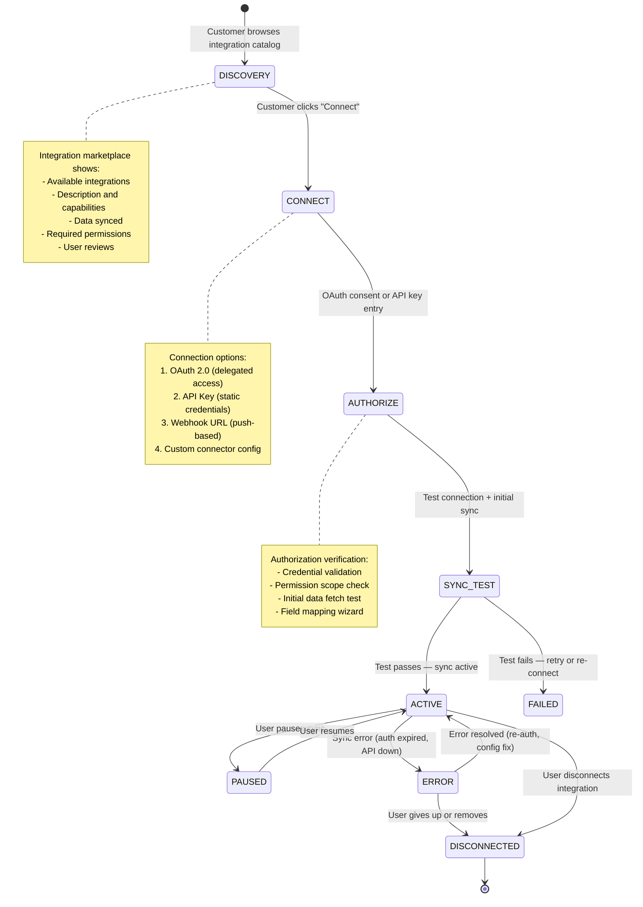
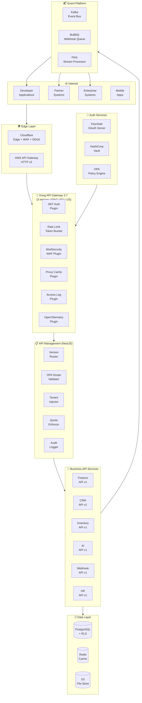
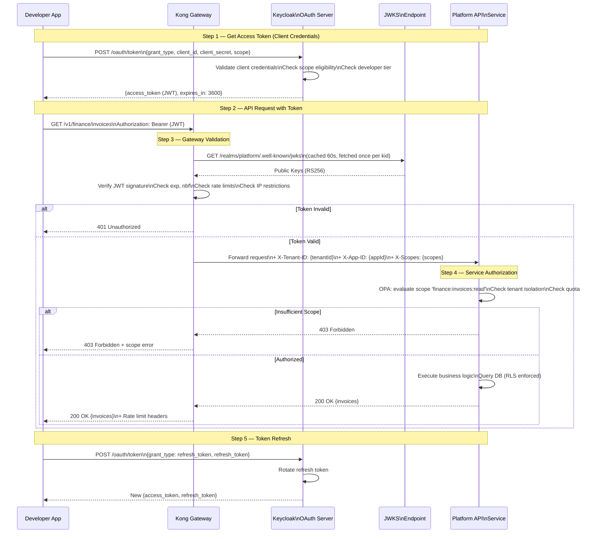
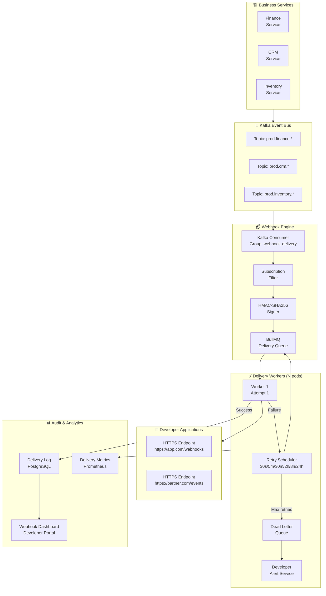
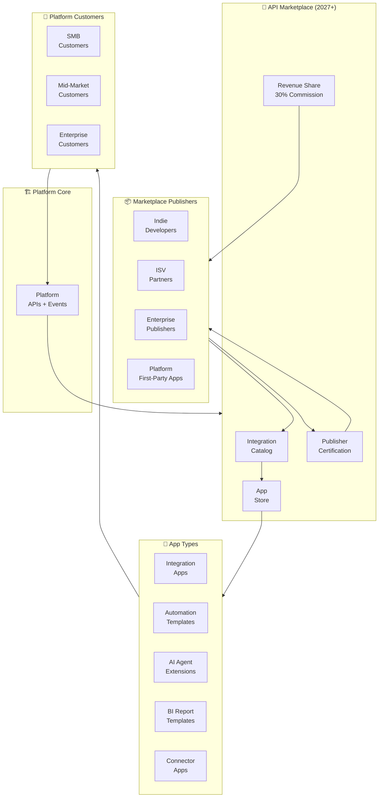

# PUBLIC API & INTEGRATION PLATFORM ARCHITECTURE

**Project Name:** Enterprise SaaS Business Management Platform  
**Document Version:** 1.0.0 — Baseline Standard  
**Date:** July 14, 2026  
**Authors:** Principal API Platform Architect, Integration Architect, Enterprise API Engineer, Cloud Architect, Security Architect, SaaS Ecosystem Strategist  
**Classification:** Internal — Confidential  
**Phase:** 21.2 — Public API & Integration Platform Architecture  

---

## Table of Contents

1. [Executive Summary](#1-executive-summary)
2. [API Platform Foundation & Vision](#2-api-platform-foundation--vision)
3. [Public API Architecture](#3-public-api-architecture)
4. [API Gateway Architecture](#4-api-gateway-architecture)
5. [API Design Principles & Standards](#5-api-design-principles--standards)
6. [API Authentication System](#6-api-authentication-system)
7. [API Authorization Model](#7-api-authorization-model)
8. [API Versioning Strategy](#8-api-versioning-strategy)
9. [Webhook Platform](#9-webhook-platform)
10. [Event-Driven Integration Platform](#10-event-driven-integration-platform)
11. [Third-Party Integration Management](#11-third-party-integration-management)
12. [API Rate Limiting & Quotas](#12-api-rate-limiting--quotas)
13. [API Security Architecture](#13-api-security-architecture)
14. [API Documentation Platform](#14-api-documentation-platform)
15. [API Analytics & Observability](#15-api-analytics--observability)
16. [API Technology Stack](#16-api-technology-stack)
17. [Integration Marketplace Foundation](#17-integration-marketplace-foundation)
18. [Enterprise Integration Architecture](#18-enterprise-integration-architecture)
19. [API Governance Framework](#19-api-governance-framework)
20. [API Evolution Roadmap](#20-api-evolution-roadmap)
21. [Final Architecture Diagrams](#21-final-architecture-diagrams)
22. [Implementation Summary](#22-implementation-summary)

---

## 1. Executive Summary

### 1.1 Document Purpose

This document defines the complete Public API & Integration Platform Architecture for the SaaS Business Management Platform. Building on the Developer Platform Foundation (Phase 21.1), this document goes deep into the technical design of every layer that makes the API platform production-ready at scale: gateway architecture, authentication, authorization, versioning, webhooks, event-driven integrations, rate limiting, security, governance, and the integration marketplace.

### 1.2 Strategic Context

An API platform is not a feature — it is an infrastructure investment that directly determines the platform's ability to grow through ecosystem partnerships. Every integration built on this API extends the platform's reach into new customer workflows. Every partner app reduces the customer's switching cost and deepens retention. Every webhook event replaces a manual data transfer and drives automation.

The architecture defined in this document is designed to:
- **Handle scale** — from 100 to 100 million API calls per day without redesign
- **Maximize security** — with zero trust between all API consumers and platform services
- **Minimize friction** — making integration delightful so developers choose us first
- **Enable governance** — with lifecycle control over every public API surface

### 1.3 Scope of This Document

| Area | Phase 21.1 Covered | Phase 21.2 Covers |
|---|---|---|
| Developer Portal | ✅ Full design | Reference only |
| API Gateway | Overview | **Deep architecture** |
| API Design Standards | Overview | **Complete standards + examples** |
| Authentication | OAuth 2.0 intro | **Full auth system design** |
| Authorization | Scopes intro | **Complete RBAC + ABAC model** |
| API Versioning | Policy overview | **Full versioning architecture** |
| Webhooks | Overview | **Complete delivery architecture** |
| Event Platform | Not covered | **Full event-driven integration** |
| 3rd-Party Integrations | Not covered | **Complete lifecycle + patterns** |
| Rate Limiting | Tiers only | **Full algorithm + enforcement** |
| API Security | Overview | **WAF + injection + audit full design** |
| Governance | Overview | **Complete API lifecycle governance** |

### 1.4 Key Architecture Decisions

| Decision | Choice | Rationale |
|---|---|---|
| **Primary API Paradigm** | REST + selective GraphQL | REST for broad compatibility; GraphQL for complex data queries |
| **API Gateway** | Kong (primary) + AWS API Gateway (edge) | Kong for plugin ecosystem; AWS for global CDN edge |
| **Event Streaming** | Apache Kafka | Durable, ordered, high-throughput event delivery |
| **Webhook Queue** | BullMQ over Redis | Redis-native, supports delay, retry, priority, and dead-letter |
| **Rate Limiting Algorithm** | Token Bucket (sustained) + Sliding Window (burst) | Token bucket for steady limits; sliding window for burst protection |
| **Auth Server** | Keycloak 24 | PKCE support, fine-grained scopes, enterprise SSO federation |

---

## 2. API Platform Foundation & Vision

### 2.1 Closed SaaS vs Open Platform Ecosystem

```
┌──────────────────────────────────────────────────────────────────────┐
│            CLOSED SaaS  vs  OPEN PLATFORM ECOSYSTEM                   │
│                                                                        │
│  CLOSED SaaS MODEL (Information Silo)                                 │
│  ──────────────────────────────────────                                │
│                                                                        │
│  Customer A           Customer B          Customer C                  │
│     │                    │                    │                       │
│   [SaaS]              [SaaS]               [SaaS]                     │
│     │                    │                    │                       │
│  Manual Export       Manual Export        Manual Export               │
│     │                    │                    │                       │
│  [Accounting]         [ERP]             [E-Commerce]                  │
│                                                                        │
│  Problems:                                                             │
│  ✗ Data lives in silos — no automation                               │
│  ✗ Integration requires manual export/import                         │
│  ✗ Every customer solves the same problem independently              │
│  ✗ Errors from manual data entry                                     │
│  ✗ Platform becomes a data dead-end                                  │
│                                                                        │
│  OPEN PLATFORM ECOSYSTEM (Connected Intelligence)                      │
│  ──────────────────────────────────────────────────                    │
│                                                                        │
│  Customer A           Customer B          Customer C                  │
│     │                    │                    │                       │
│   API ←───────── Platform API Gateway ───────→ API                   │
│     │                    │                    │                       │
│  [Xero]              [SAP ERP]         [Shopify]                      │
│     │                    │                    │                       │
│  Real-time            Bi-directional      Event-driven               │
│  Sync                    Sync              Automation                 │
│                                                                        │
│  Benefits:                                                             │
│  ✓ Data flows automatically and in real-time                         │
│  ✓ Customers integrate once and forget                               │
│  ✓ Partners build the integrations (not internal team)               │
│  ✓ Platform becomes the hub of the customer's data ecosystem         │
│  ✓ Switching cost increases with every integration                   │
└──────────────────────────────────────────────────────────────────────┘
```

### 2.2 API Platform Business Value

| Benefit Dimension | Metric | 3-Year Target |
|---|---|---|
| **Integration Coverage** | Native + API integrations | 250+ integrations |
| **Developer Adoption** | Registered developer accounts | 5,000+ developers |
| **API Call Volume** | Daily API calls | 10M+ calls/day |
| **Customer Retention** | Churn delta (integrated vs non-integrated) | 3× lower churn |
| **Time-to-Integration** | Average days to ship partner integration | < 14 days |
| **Marketplace Revenue** | Platform revenue from API ecosystem | 15-20% of total ARR |
| **Automation Rate** | Business tasks automated via API | 70%+ of routine ops |

### 2.3 API Maturity Model

```
LEVEL 0 — NO STANDARD API
  Data access requires manual export or custom database queries.
  No external systems can integrate reliably.

LEVEL 1 — PRIVATE INTERNAL APIS
  Well-designed REST APIs used internally between microservices.
  No external access. No versioning guarantee.
  Status: COMPLETE (existing platform microservices)

LEVEL 2 — PARTNER APIS (Controlled Access)
  Curated set of stable APIs exposed to approved partners.
  OAuth 2.0 auth, SLA guarantees, monitoring, versioning.
  Status: BUILDING NOW (Phase 21.1–21.2)

LEVEL 3 — PUBLIC APIS (Developer Ecosystem)
  Full public API surface with self-serve developer access.
  SDK, documentation, sandbox, marketplace foundation.
  Target: Q4 2026

LEVEL 4 — API MARKETPLACE (Ecosystem Platform)
  Marketplace of partner-built apps, integrations, and agents.
  Revenue sharing, app discovery, automated onboarding.
  Target: H1 2027

LEVEL 5 — AUTONOMOUS INTEGRATION (AI-Native)
  AI agents discover, configure, and manage integrations autonomously.
  Natural language integration setup. Self-healing connections.
  Target: 2028–2029
```

---

## 3. Public API Architecture

### 3.1 Complete Multi-Layer Architecture

```mermaid
graph TB
    subgraph Consumers["🌐 API Consumers"]
        WEB_APP[Web Applications\nNext.js / React]
        MOBILE_APP[Mobile Apps\nReact Native / iOS / Android]
        PARTNER_APP[Partner Systems\nERP / CRM / Accounting]
        IOT_SYS[IoT & Edge\nDevices / Sensors]
        INTERNAL_SVC[Internal\nMicroservices]
        AUTOMATION[Automation\nZapier / Make / n8n]
    end

    subgraph EdgeLayer["🌍 Edge / CDN Layer"]
        CF[Cloudflare\nEdge Cache + WAF]
        AWS_GW[AWS API Gateway\nHTTP API v2]
        DDOS[DDoS\nProtection]
    end

    subgraph GatewayLayer["🔌 API Gateway Layer — Kong 3.7"]
        AUTH_K[JWT Auth\nPlugin]
        RATE_K[Rate Limiting\nToken Bucket]
        ROUTE_K[Intelligent\nRouting]
        TRANS_K[Request/Response\nTransformation]
        CACHE_K[Response\nCaching]
        LOG_K[HTTP Request\nLogging]
        CORS_K[CORS\nPlugin]
        IP_K[IP Restriction\nPlugin]
    end

    subgraph APIManagement["📋 API Management Layer"]
        VERSION[Version\nRouter v1/v2]
        SCOPE_CHK[Scope\nValidator]
        TENANT_INJ[Tenant Context\nInjector]
        AUDIT_API[API Audit\nLogger]
        QUOTA[Quota\nEnforcement]
    end

    subgraph APIServices["📡 Business API Services (NestJS)"]
        FIN_API[Finance\nAPI Service]
        CRM_API[Sales/CRM\nAPI Service]
        INV_API[Inventory\nAPI Service]
        HR_API[HR\nAPI Service]
        AI_API[AI & Analytics\nAPI Service]
        WH_API[Webhook Mgmt\nAPI Service]
        USER_API[Users & Org\nAPI Service]
    end

    subgraph CorePlatform["🏗️ Core Platform"]
        KAFKA_P[Kafka\nEvent Bus]
        CACHE_P[Redis\nCache Layer]
        DB_P[(PostgreSQL\nMulti-Tenant DB)]
        BLOB_P[(S3\nFile Storage)]
    end

    subgraph EventPlatform["📬 Event & Webhook Platform"]
        WH_SVC[Webhook\nDelivery Service]
        EVENT_PROC[Event\nProcessor]
        INT_SVC[Integration\nOrchestrator]
        BULL[BullMQ\nDelivery Queue]
    end

    subgraph Security["🔒 Security Layer"]
        KEYCLOAK[Keycloak\nOAuth 2.0 Server]
        OPA[OPA\nPolicy Engine]
        VAULT[HashiCorp\nVault - Secrets]
        WAF_SEC[ModSecurity\nWAF Rules]
    end

    Consumers --> EdgeLayer
    EdgeLayer --> GatewayLayer
    GatewayLayer --> APIManagement
    APIManagement --> APIServices
    APIServices --> CorePlatform
    CorePlatform --> EventPlatform
    EventPlatform --> Consumers
    Security --> GatewayLayer & APIManagement & APIServices
```



### 3.2 Request Lifecycle — End to End

```
COMPLETE API REQUEST LIFECYCLE
────────────────────────────────

[1] CLIENT REQUEST
    Developer App → HTTPS → Cloudflare Edge
    Headers: Authorization: Bearer {JWT}, Content-Type: application/json
    
[2] EDGE LAYER (Cloudflare, ~1ms)
    ├─ DDoS check: traffic volume patterns
    ├─ WAF: OWASP rule set scan
    ├─ Cache check: GET requests with Surrogate-Key
    └─ Route to nearest Kong region (Singapore / Frankfurt / Virginia)

[3] KONG API GATEWAY (~2ms)
    ├─ JWT validation: verify signature against JWKS endpoint
    ├─ Rate limit check: token bucket per (app_id + endpoint)
    ├─ IP allow/deny: blocklist check
    ├─ CORS headers: set Access-Control-Allow-Origin
    └─ Route: match path to upstream service

[4] API MANAGEMENT LAYER (~1ms)
    ├─ Version routing: /v1/... → current handlers
    ├─ Scope validation: token.scopes ⊇ {required_scope}
    ├─ Tenant injection: extract tenant_id from JWT, add to headers
    ├─ Quota check: monthly usage within plan limits
    └─ Request ID: inject X-Request-ID for tracing

[5] BUSINESS API SERVICE (NestJS, ~5–50ms)
    ├─ DTO validation: class-validator on request body
    ├─ Business logic: service layer execution
    ├─ Database: Prisma query with RLS tenant filter
    ├─ Cache: Redis L1 cache check
    ├─ Event publish: Kafka (async, non-blocking)
    └─ Response: serialize and return

[6] RESPONSE PIPELINE (~1ms)
    ├─ Transform: version compatibility mapping
    ├─ Audit log: async write to ClickHouse
    ├─ Cache store: set cache for cacheable responses
    └─ Metrics: statsd counter/histogram

TOTAL P50: ~10ms | P95: ~50ms | P99: ~150ms
```

---

## 4. API Gateway Architecture

### 4.1 Kong Gateway — Complete Plugin Stack

```
KONG API GATEWAY — PLUGIN ARCHITECTURE
──────────────────────────────────────────

┌──────────────────────────────────────────────────────┐
│  INBOUND REQUEST PLUGINS (execute in order)          │
│                                                      │
│  1. ip-restriction         Block/allow IP ranges     │
│  2. bot-detection          Block known bot agents    │
│  3. cors                   Handle preflight + headers│
│  4. jwt                    Validate Bearer JWT        │
│     └─ OR api-key          Validate X-API-Key header │
│  5. rate-limiting          Token bucket per consumer │
│  6. request-size-limiting  Reject bodies > 10MB      │
│  7. request-validator      Validate against OAS3 spec│
│  8. request-transformer    Add tenant/trace headers  │
│                                                      │
│  OUTBOUND RESPONSE PLUGINS (execute in order)        │
│                                                      │
│  9.  response-transformer  Add standard headers      │
│  10. proxy-cache           Cache 200 GET responses   │
│  11. correlation-id        Add X-Correlation-ID      │
│  12. http-log              Async log to ClickHouse   │
│  13. statsd-advanced       Metrics to Prometheus     │
│                                                      │
│  PLATFORM PLUGINS (route-specific)                   │
│                                                      │
│  14. opentelemetry         Distributed tracing spans │
│  15. file-log              Compliance audit trail    │
│  16. oauth2-introspect     Token introspection cache │
└──────────────────────────────────────────────────────┘
```

### 4.2 Kong Configuration — Production Grade

```yaml
# Kong Declarative Config — Production API Gateway
_format_version: "3.0"
_transform: true

services:
  - name: finance-api-v1
    url: http://finance-service.platform.svc.cluster.local:3001
    connect_timeout: 5000
    read_timeout: 30000
    write_timeout: 30000
    retries: 2
    plugins:
      - name: proxy-cache
        config:
          response_code: [200]
          request_method: [GET, HEAD]
          content_type: ["application/json; charset=utf-8"]
          cache_ttl: 60
          storage_backend: redis
          redis_host: redis.platform.svc.cluster.local
          redis_port: 6379
          cache_control: true
      
      - name: opentelemetry
        config:
          endpoint: http://otel-collector:4318/v1/traces
          resource_attributes:
            service.name: kong-gateway
          header_type: b3

  - name: crm-api-v1
    url: http://crm-service.platform.svc.cluster.local:3002
    connect_timeout: 5000
    read_timeout: 30000
    write_timeout: 30000
    retries: 2

  - name: ai-api-v1
    url: http://ai-service.platform.svc.cluster.local:3010
    connect_timeout: 5000
    read_timeout: 120000   # AI APIs can be slow (LLM calls)
    write_timeout: 120000
    retries: 1            # Do not retry AI requests (idempotency concerns)

# Global plugins (apply to ALL routes)
plugins:
  - name: correlation-id
    config:
      header_name: X-Request-ID
      generator: uuid#counter
      echo_downstream: true

  - name: request-size-limiting
    config:
      allowed_payload_size: 10       # 10 MB max body
      require_content_length: false

  - name: bot-detection
    config:
      allow: []
      deny: [".*Googlebot.*", ".*crawler.*", ".*spider.*"]

  - name: ip-restriction
    config:
      # Block known malicious CIDR ranges (updated via CI/CD pipeline)
      deny: []

  - name: cors
    config:
      origins: ["https://app.platform.com", "https://portal.platform.com", "https://sandbox.platform.com"]
      methods: [GET, POST, PUT, PATCH, DELETE, OPTIONS, HEAD]
      headers: [Authorization, Content-Type, X-API-Key, X-Tenant-ID, X-Request-ID]
      exposed_headers: [X-Request-ID, X-RateLimit-Limit, X-RateLimit-Remaining, X-RateLimit-Reset]
      credentials: true
      max_age: 3600

consumers:
  - username: tier_free
    tags: [tier_free]
    plugins:
      - name: rate-limiting
        config:
          minute: 60
          hour: 1000
          day: 5000
          month: 100000
          policy: redis
          redis_host: redis.platform.svc.cluster.local
          limit_by: consumer
          error_code: 429
          error_message: "Rate limit exceeded. Upgrade your plan for higher limits."

  - username: tier_professional
    tags: [tier_professional]
    plugins:
      - name: rate-limiting
        config:
          minute: 300
          hour: 10000
          day: 100000
          month: 1000000
          policy: redis
          redis_host: redis.platform.svc.cluster.local

  - username: tier_enterprise
    tags: [tier_enterprise]
    plugins:
      - name: rate-limiting
        config:
          minute: 2000
          hour: 100000
          day: 2000000
          month: 50000000
          policy: redis
          redis_host: redis.platform.svc.cluster.local

routes:
  # Finance API routes
  - name: finance-invoices-list
    service: finance-api-v1
    paths: ["/v1/finance/invoices"]
    methods: [GET]
    strip_path: false
    plugins:
      - name: jwt
        config:
          claims_to_verify: [exp, nbf]
          maximum_expiration: 3600
      - name: request-validator
        config:
          body_schema: null    # GET has no body
          parameter_schema:
            - name: status
              in: query
              schema:
                type: string
                enum: [draft, pending, paid, overdue, cancelled]
            - name: limit
              in: query
              schema:
                type: integer
                minimum: 1
                maximum: 100

  - name: finance-invoices-write
    service: finance-api-v1
    paths: ["/v1/finance/invoices"]
    methods: [POST, PATCH, DELETE]
    strip_path: false
    plugins:
      - name: jwt
        config:
          claims_to_verify: [exp, nbf]
      # Write endpoints have stricter rate limits
      - name: rate-limiting
        config:
          minute: 30
          policy: redis
          redis_host: redis.platform.svc.cluster.local
          limit_by: consumer

  # AI API routes — longer timeouts, no caching
  - name: ai-predictions
    service: ai-api-v1
    paths: ["/v1/ai/predictions", "/v1/ai/query", "/v1/ai/agents"]
    methods: [GET, POST]
    strip_path: false
    plugins:
      - name: jwt
        config:
          claims_to_verify: [exp]
      - name: rate-limiting
        config:
          minute: 10           # Strict limit for AI endpoints (expensive)
          hour: 100
          policy: redis
          redis_host: redis.platform.svc.cluster.local
```

### 4.3 Gateway High Availability Architecture

```
KONG GATEWAY — HIGH AVAILABILITY TOPOLOGY
────────────────────────────────────────────

REGION: ap-southeast-1 (Singapore — Primary)
  ┌──────────────────────────────────────────┐
  │  Kubernetes Deployment                   │
  │  • kong-gateway: 3 replicas (HPA 3-10)  │
  │  • Anti-affinity: spread across 3 AZs   │
  │  • PodDisruptionBudget: minAvailable=2  │
  │  • Resources: 2vCPU / 4GB per pod       │
  │                                          │
  │  Kong Database: PostgreSQL (shared)      │
  │  (declarative config preferred for k8s) │
  └──────────────────────────────────────────┘

REGION: eu-west-1 (Frankfurt — Secondary)
  ┌──────────────────────────────────────────┐
  │  Kubernetes Deployment                   │
  │  • kong-gateway: 2 replicas (HPA 2-6)  │
  │  • Same declarative config via GitOps   │
  └──────────────────────────────────────────┘

REGION: us-east-1 (Virginia — Secondary)
  ┌──────────────────────────────────────────┐
  │  Kubernetes Deployment                   │
  │  • kong-gateway: 2 replicas (HPA 2-6)  │
  └──────────────────────────────────────────┘

GLOBAL ROUTING (Cloudflare Load Balancing):
  • Latency-based routing → nearest healthy region
  • Health check: /v1/health every 10s per region
  • Failover: automatic within 30s of health check failure
  • Anycast: single global IP resolved to nearest edge
```

---

## 5. API Design Principles & Standards

### 5.1 REST API Standards

```
REST API DESIGN STANDARDS
───────────────────────────

RESOURCE NAMING:
  ✓ Plural nouns for collections:  /v1/finance/invoices
  ✓ Singular noun for specific:    /v1/finance/invoices/{invoiceId}
  ✓ Lowercase with hyphens:        /v1/customer-accounts
  ✗ Verbs in URL:                  /v1/getInvoice  (WRONG)
  ✗ CRUD verbs in URL:             /v1/createInvoice  (WRONG)

HTTP METHODS:
  GET     → Read (idempotent, cacheable)
  POST    → Create or non-idempotent operations
  PUT     → Full replacement (idempotent)
  PATCH   → Partial update (MERGE, not replace)
  DELETE  → Delete (idempotent)
  HEAD    → Metadata only (same as GET, no body)
  OPTIONS → CORS preflight

HTTP STATUS CODES:
  200 OK                    → Successful GET, PATCH
  201 Created               → Successful POST (creation)
  202 Accepted              → Async operation queued
  204 No Content            → Successful DELETE
  400 Bad Request           → Validation error
  401 Unauthorized          → Missing or invalid credentials
  403 Forbidden             → Valid credentials, insufficient scope
  404 Not Found             → Resource does not exist
  409 Conflict              → Duplicate create / state conflict
  410 Gone                  → Deprecated endpoint
  422 Unprocessable Entity  → Semantically invalid (valid JSON, wrong business logic)
  429 Too Many Requests     → Rate limit exceeded
  500 Internal Server Error → Unexpected platform error
  503 Service Unavailable   → Downstream service down

PAGINATION STANDARDS:
  Cursor-based (preferred for large datasets):
    GET /v1/finance/invoices?cursor={cursor}&limit=20
    Response: { data: [...], next_cursor: "...", has_more: true }
  
  Offset-based (for smaller, static datasets):
    GET /v1/hr/employees?page=2&per_page=50
    Response: { data: [...], pagination: { page, per_page, total } }

FILTERING & SORTING:
  GET /v1/finance/invoices?status=pending&from_date=2026-01-01&sort=created_at:desc
  GET /v1/crm/contacts?search=acme&tags=vip,enterprise

FIELD SELECTION (sparse fieldsets):
  GET /v1/finance/invoices?fields=id,number,total_amount,status

CONSISTENT NAMING CONVENTION:
  • snake_case for JSON fields: total_amount, created_at
  • ISO 8601 for dates: 2026-07-14T09:00:00Z
  • ISO 4217 for currencies: USD, EUR, KHR
  • UUID v4 for resource IDs: inv_01HX9VKJF2KM3N4P5Q6R7S8T9
  • Typed ID prefixes: inv_, ord_, cust_, emp_, prod_
```

### 5.2 GraphQL API Standards

```typescript
// GraphQL API — Schema Design (for complex data query use cases)
// Available at: /v1/graphql

// When to use GraphQL vs REST:
// REST:     Standard CRUD, webhooks, simple resources, wide SDK support
// GraphQL:  Complex nested data requirements, avoid over-fetching,
//           frontend-driven flexible queries, analytics dashboards

const typeDefs = gql`
  type Query {
    # Finance domain
    invoice(id: ID!): Invoice
    invoices(filter: InvoiceFilter, pagination: PaginationInput): InvoiceConnection
    
    # CRM domain
    contact(id: ID!): Contact
    contacts(filter: ContactFilter, pagination: PaginationInput): ContactConnection
    deal(id: ID!): Deal
    
    # Cross-domain (where GraphQL shines — avoid N+1)
    salesDashboard(period: PeriodInput!): SalesDashboard
    customerProfile(contactId: ID!): CustomerProfile  # contact + deals + invoices + tickets
  }
  
  type Mutation {
    createInvoice(input: CreateInvoiceInput!): CreateInvoicePayload
    updateInvoice(id: ID!, input: UpdateInvoiceInput!): UpdateInvoicePayload
    deleteInvoice(id: ID!): DeletePayload
    
    createContact(input: CreateContactInput!): CreateContactPayload
    createDeal(input: CreateDealInput!): CreateDealPayload
  }
  
  type Subscription {
    invoiceUpdated(tenantId: ID!): Invoice!          # Real-time via WebSocket
    stockLevelChanged(productIds: [ID!]!): StockLevel!
  }
  
  type Invoice {
    id: ID!
    number: String!
    status: InvoiceStatus!
    customer: Contact!                   # Resolved via DataLoader (no N+1)
    line_items: [LineItem!]!
    total_amount: Float!
    currency: String!
    issue_date: Date!
    due_date: Date!
    payments: [Payment!]!               # Nested resolution
    created_at: DateTime!
  }
  
  type CustomerProfile {                 # Cross-domain composite type
    contact: Contact!
    deals: [Deal!]!
    invoices: [Invoice!]!
    supportTickets: [Ticket!]!
    healthScore: Float
    lifetimeValue: Float
  }
  
  # Complexity limiting
  # Max query depth: 7
  # Max field count: 50
  # Max complexity score: 1000
`;

// DataLoader — batch and cache resolver calls to prevent N+1
const contactLoader = new DataLoader<string, Contact>(async (contactIds) => {
  const contacts = await contactService.findByIds(contactIds);
  return contactIds.map(id => contacts.find(c => c.id === id) ?? null);
});
```

### 5.3 Event-Driven API (AsyncAPI)

```yaml
# AsyncAPI 3.0 — Event API Specification
asyncapi: 3.0.0

info:
  title: Platform Event API
  version: 1.0.0
  description: |
    Real-time business events published by the platform.
    Consumers can subscribe via Webhooks (push) or Kafka (stream).

channels:
  invoice/created:
    address: platform.finance.invoice.created
    description: Published when a new invoice is created
    messages:
      InvoiceCreatedMessage:
        $ref: '#/components/messages/InvoiceCreated'

  invoice/paid:
    address: platform.finance.invoice.paid
    description: Published when an invoice is fully paid
    messages:
      InvoicePaidMessage:
        $ref: '#/components/messages/InvoicePaid'

  order/status-changed:
    address: platform.inventory.order.status_changed
    description: Published when an order status changes
    messages:
      OrderStatusChangedMessage:
        $ref: '#/components/messages/OrderStatusChanged'

components:
  messages:
    InvoiceCreated:
      payload:
        type: object
        required: [event_id, event_type, occurred_at, tenant_id, data]
        properties:
          event_id:
            type: string
            format: uuid
            description: Unique event identifier (idempotency key)
          event_type:
            type: string
            const: invoice.created
          api_version:
            type: string
            example: "2026-07-14"
          occurred_at:
            type: string
            format: date-time
          tenant_id:
            type: string
            format: uuid
          data:
            type: object
            properties:
              invoice_id: { type: string }
              invoice_number: { type: string }
              customer_id: { type: string }
              total_amount: { type: number }
              currency: { type: string }
              status: { type: string }
              due_date: { type: string, format: date }
```

---

## 6. API Authentication System

### 6.1 Authentication Method Matrix

| Method | Use Case | Token Lifetime | Rotation | Security Level |
|---|---|---|---|---|
| **OAuth 2.0 Client Credentials** | Server-to-server M2M | 1 hour | Refresh token | 🔴 High |
| **OAuth 2.0 Auth Code + PKCE** | User-delegated access | 1 hour + 30d refresh | On use | 🔴 High |
| **API Key (static)** | Simple server integrations | No expiry | Manual/annual | 🟡 Medium |
| **Service Account JWT** | Internal service mesh | 15 min | Auto | 🔴 High |
| **Session Token** | Browser-based portal | 24 hours | Rolling | 🟡 Medium |

### 6.2 OAuth 2.0 — Complete Token Architecture

```
KEYCLOAK REALM ARCHITECTURE FOR API PLATFORM
─────────────────────────────────────────────

Realm: platform-api
│
├── Clients (OAuth Applications)
│   ├── platform-web-app          (public, PKCE, for dashboard)
│   ├── platform-mobile-app       (public, PKCE, for mobile)
│   ├── internal-services         (confidential, client credentials)
│   └── developer-apps/{appId}   (confidential, per registered app)
│
├── Roles
│   ├── Realm Roles (platform-wide)
│   │   ├── platform_admin
│   │   ├── platform_developer
│   │   └── platform_partner
│   └── Client Roles (per-app)
│       ├── finance_manager
│       ├── sales_rep
│       └── readonly_user
│
├── Scopes (Fine-Grained)
│   ├── finance:invoices:read
│   ├── finance:invoices:write
│   ├── crm:contacts:read
│   ├── crm:contacts:write
│   ├── inventory:products:read
│   ├── ai:predictions:read
│   └── ... (25+ scopes total)
│
└── Token Configuration
    ├── access_token_lifespan: 3600s (1 hour)
    ├── refresh_token_lifespan: 2592000s (30 days)
    ├── refresh_token_rotation: true
    ├── access_token_type: JWT (RS256)
    └── jwt_claims:
        ├── sub: {developer_user_id}
        ├── tenant_id: {tenant_uuid}
        ├── app_id: {application_uuid}
        ├── scope: "finance:invoices:read crm:contacts:read"
        ├── tier: "professional"
        ├── env: "production" | "sandbox"
        └── exp, iat, iss, aud
```

### 6.3 JWT Token Validation — Kong Plugin Config

```typescript
// JWT Validation Service — Platform-side verification
@Injectable()
export class JWTValidationService {
  private readonly jwksClient: JwksClient;
  private readonly keyCache = new Map<string, JsonWebKey>();

  constructor() {
    // Cached JWKS fetcher — refreshes every 60s
    this.jwksClient = jwksRsa({
      jwksUri: 'https://auth.platform.com/realms/platform-api/protocol/openid-connect/certs',
      cache: true,
      cacheMaxEntries: 10,
      cacheMaxAge: 60000,             // 1 minute
      rateLimit: true,
      jwksRequestsPerMinute: 5,
    });
  }

  async validateToken(token: string): Promise<ValidatedTokenClaims> {
    // 1. Decode header to get kid (key ID)
    const decoded = jwt.decode(token, { complete: true });
    if (!decoded || typeof decoded === 'string') {
      throw new UnauthorizedException('Invalid token format');
    }

    // 2. Fetch signing key by kid
    const signingKey = await this.jwksClient.getSigningKey(decoded.header.kid);

    // 3. Verify signature + standard claims
    const verified = jwt.verify(token, signingKey.getPublicKey(), {
      algorithms: ['RS256'],
      issuer: 'https://auth.platform.com/realms/platform-api',
      audience: 'platform-api',
    }) as PlatformTokenClaims;

    // 4. Validate environment claim
    if (verified.env === 'sandbox' && !this.isSandboxRequest()) {
      throw new ForbiddenException('Sandbox token cannot access production resources');
    }

    // 5. Check token not revoked (check Redis revocation list)
    const isRevoked = await this.revocationCache.check(verified.jti);
    if (isRevoked) {
      throw new UnauthorizedException('Token has been revoked');
    }

    return {
      sub: verified.sub,
      tenantId: verified.tenant_id,
      appId: verified.app_id,
      scopes: verified.scope.split(' '),
      tier: verified.tier,
      environment: verified.env,
      expiresAt: new Date(verified.exp * 1000),
    };
  }
}
```

### 6.4 API Key Authentication

```typescript
// API Key Authentication — for simpler server integrations
@Injectable()
export class ApiKeyAuthService {
  async validateApiKey(rawKey: string): Promise<ApiKeyContext> {
    // API key format: pk_live_{base62 random} or pk_test_{base62 random}
    const prefix = rawKey.substring(0, 8);
    const isLive = prefix === 'pk_live_';
    const isTest = prefix === 'pk_test_';
    
    if (!isLive && !isTest) {
      throw new UnauthorizedException('Invalid API key format');
    }

    // Hash the key for DB lookup (never store raw keys)
    const keyHash = await this.hashApiKey(rawKey);
    
    // Lookup in database
    const apiKey = await this.apiKeyRepo.findByHash(keyHash);
    if (!apiKey) {
      throw new UnauthorizedException('API key not found');
    }
    
    // Validate key status
    if (apiKey.status === 'revoked') {
      throw new UnauthorizedException('API key has been revoked');
    }
    
    if (apiKey.expiresAt && apiKey.expiresAt < new Date()) {
      throw new UnauthorizedException('API key has expired');
    }
    
    // Update last-used (async, non-blocking)
    this.apiKeyRepo.updateLastUsed(apiKey.id, new Date()).catch(noop);
    
    return {
      keyId: apiKey.id,
      applicationId: apiKey.applicationId,
      tenantId: apiKey.tenantId,
      scopes: apiKey.scopes,
      tier: apiKey.tier,
      environment: isLive ? 'production' : 'sandbox',
    };
  }

  // Secure key generation: prefix + 32 bytes random = 51 chars total
  async generateApiKey(
    applicationId: string,
    environment: 'production' | 'sandbox'
  ): Promise<{ rawKey: string; keyHash: string }> {
    const prefix = environment === 'production' ? 'pk_live_' : 'pk_test_';
    const randomPart = randomBytes(24).toString('base64url');
    const rawKey = `${prefix}${randomPart}`;
    const keyHash = await this.hashApiKey(rawKey);
    
    return { rawKey, keyHash };
    // rawKey shown ONCE to developer in portal — never stored
    // keyHash stored in database
  }
  
  private async hashApiKey(key: string): Promise<string> {
    // Argon2id for API key hashing (slow enough to prevent rainbow tables)
    return argon2.hash(key, { type: argon2.argon2id, memoryCost: 65536 });
  }
}
```

---

## 7. API Authorization Model

### 7.1 Permission Architecture — RBAC + ABAC + Scopes

```
LAYERED AUTHORIZATION MODEL
──────────────────────────────

LAYER 1: SCOPES (What the application is allowed to do)
  Set at application registration time.
  Applied at API Gateway scope check.
  Example: finance:invoices:read
  
LAYER 2: RBAC (What the user is allowed to do)
  Set by tenant admin for each user.
  Applied at API Service layer.
  Example: Role=FinanceManager → can approve invoices
  
LAYER 3: ABAC (Contextual attribute-based rules)
  Applied at data layer with OPA policies.
  Example: A user can only read invoices from their own department.
  
LAYER 4: DATA (Row-Level Security at Database)
  Applied at PostgreSQL via RLS policies.
  Final enforcement layer — cannot be bypassed.
  tenant_id always matches regardless of higher layers.

AUTHORIZATION DECISION FLOW:
  Request → Scope Check → Role Check → Policy Check → RLS → Data
                ↓               ↓            ↓
              403              403          403
```

### 7.2 Complete Scope Registry

```typescript
// Complete Platform Permission Scope Registry
export const PLATFORM_API_SCOPES = {
  // ─── FINANCE SCOPES ──────────────────────────────────────────────────
  'finance:invoices:read':          'Read invoices and financial records',
  'finance:invoices:write':         'Create and modify invoices',
  'finance:invoices:delete':        'Delete invoices (restricted)',
  'finance:payments:read':          'Read payment history and status',
  'finance:payments:write':         'Record and process payments',
  'finance:expenses:read':          'Read expense records',
  'finance:expenses:write':         'Create and submit expenses',
  'finance:reports:read':           'Access financial reports and statements',
  'finance:budgets:read':           'Read budget allocations',
  'finance:budgets:write':          'Create and modify budgets',
  
  // ─── CRM / SALES SCOPES ──────────────────────────────────────────────
  'crm:contacts:read':              'Read customer contacts and companies',
  'crm:contacts:write':             'Create and update contacts',
  'crm:contacts:delete':            'Delete contacts',
  'crm:deals:read':                 'Read sales opportunities and pipeline',
  'crm:deals:write':                'Create and update deals',
  'crm:activities:read':            'Read calls, meetings, and tasks',
  'crm:activities:write':           'Log activities and communications',
  
  // ─── INVENTORY SCOPES ────────────────────────────────────────────────
  'inventory:products:read':        'Read product catalog',
  'inventory:products:write':       'Create and update products',
  'inventory:stock:read':           'Read inventory levels and movements',
  'inventory:stock:write':          'Update stock levels (requires review)',
  'inventory:orders:read':          'Read purchase and sales orders',
  'inventory:orders:write':         'Create and manage orders',
  'inventory:suppliers:read':       'Read supplier records',
  'inventory:suppliers:write':      'Create and update suppliers',
  
  // ─── HR SCOPES ───────────────────────────────────────────────────────
  'hr:employees:read':              'Read employee profiles (non-sensitive)',
  'hr:employees:write':             'Create and update employee records',
  'hr:leave:read':                  'Read leave requests and balances',
  'hr:leave:write':                 'Submit and manage leave requests',
  'hr:payroll:read':                'Read payroll records (sensitive — partner only)',
  
  // ─── AI & ANALYTICS SCOPES ───────────────────────────────────────────
  'ai:analytics:read':              'Read analytics metrics and KPIs',
  'ai:predictions:read':            'Access ML model predictions',
  'ai:query:execute':               'Execute natural language queries',
  'ai:agents:invoke':               'Invoke AI agents (partner tier required)',
  'ai:insights:read':               'Read AI-generated business insights',
  
  // ─── USER & ORG SCOPES ───────────────────────────────────────────────
  'users:profile:read':             'Read authenticated user profile',
  'users:team:read':                'Read team structure (own org only)',
  'users:admin':                    'User management (enterprise tier only)',
  'org:settings:read':              'Read organization settings',
  'org:settings:write':             'Modify organization settings (enterprise)',
  
  // ─── WEBHOOK & EVENT SCOPES ──────────────────────────────────────────
  'webhooks:read':                  'Read webhook configurations',
  'webhooks:write':                 'Create, update, and delete webhooks',
  'events:stream:read':             'Read from event stream (partner tier)',
  
  // ─── DATA SCOPES (SENSITIVE) ─────────────────────────────────────────
  'data:export':                    'Bulk data export (enterprise tier only)',
  'data:import':                    'Bulk data import',
} as const;

// Scope dependency graph — requesting a scope implicitly needs these
export const SCOPE_DEPENDENCIES: Record<string, string[]> = {
  'finance:invoices:write':   ['finance:invoices:read'],
  'finance:payments:write':   ['finance:payments:read', 'finance:invoices:read'],
  'crm:deals:write':          ['crm:deals:read', 'crm:contacts:read'],
  'inventory:orders:write':   ['inventory:orders:read', 'inventory:products:read'],
  'ai:agents:invoke':         ['ai:analytics:read', 'ai:predictions:read'],
};

// Scope tier requirements — some scopes are gated by developer tier
export const SCOPE_TIER_REQUIREMENTS: Record<string, DeveloperTier> = {
  'finance:payments:write':   DeveloperTier.PARTNER,
  'hr:payroll:read':          DeveloperTier.PARTNER,
  'ai:agents:invoke':         DeveloperTier.PARTNER,
  'events:stream:read':       DeveloperTier.PARTNER,
  'users:admin':              DeveloperTier.ENTERPRISE,
  'org:settings:write':       DeveloperTier.ENTERPRISE,
  'data:export':              DeveloperTier.ENTERPRISE,
};
```

### 7.3 OPA Policy Engine — Authorization Rules

```rego
# OPA Policy — Finance Invoice Authorization
# File: policies/finance/invoices.rego

package platform.finance.invoices

import rego.v1

# Default deny
default allow := false

# Allow: READ operations for any user with finance:invoices:read scope
allow if {
    input.method == "GET"
    "finance:invoices:read" in input.token.scopes
    input.token.tenant_id == input.resource.tenant_id   # Tenant isolation
}

# Allow: CREATE/UPDATE for users with finance:invoices:write scope
allow if {
    input.method in ["POST", "PATCH"]
    "finance:invoices:write" in input.token.scopes
    input.token.tenant_id == input.resource.tenant_id
}

# Allow: DELETE only for finance managers or admins
allow if {
    input.method == "DELETE"
    "finance:invoices:delete" in input.token.scopes
    input.token.tenant_id == input.resource.tenant_id
    # Additional role check via RBAC context
    has_role(input.user_roles, ["finance_manager", "admin"])
}

# DENY: Cross-tenant access (belt-and-suspenders — DB RLS handles this too)
deny if {
    input.token.tenant_id != input.resource.tenant_id
}

# DENY: Sandbox token accessing production resource
deny if {
    input.token.environment == "sandbox"
    input.resource.environment == "production"
}

# Helper function
has_role(user_roles, allowed_roles) if {
    some role in allowed_roles
    role in user_roles
}
```

---

## 8. API Versioning Strategy

### 8.1 Versioning Architecture

```
API VERSIONING ARCHITECTURE
──────────────────────────────

VERSION STRATEGY: URL PATH VERSIONING
  /v1/finance/invoices      → Current stable (2026)
  /v2/finance/invoices      → Next major (future — with breaking changes)
  
WHY URL PATH (vs Header/Query):
  ✓ Explicit and visible in logs, bookmarks, and error traces
  ✓ Easy to route at gateway level
  ✓ No ambiguity about which version is active
  ✓ SDK generation per version is straightforward
  ✗ Not "pure" REST (version is not a resource attribute)
  → Trade-off accepted: developer experience > REST purity

VERSION COMPATIBILITY RULES:
  BACKWARDS COMPATIBLE (No version bump required):
    • Adding new optional fields to response body
    • Adding new optional fields to request body  
    • Adding new endpoints to existing version
    • Adding new enum values (consumers must handle unknown)
    • Adding new optional query parameters
    • Making a required field optional
    • Performance improvements

  BREAKING CHANGES (Require new major version):
    • Removing fields from response body
    • Changing field types (string → number)
    • Renaming fields
    • Changing HTTP method for existing endpoint
    • Changing URL structure
    • Making optional fields required
    • Changing authentication requirements
    • Removing endpoints

VERSION LIFECYCLE STATES:
  CURRENT:     Fully supported, recommended for new integrations
  STABLE:      Supported, no new features added, security fixes only
  DEPRECATED:  Supported but announced for retirement
  SUNSET:      Returns 410 Gone, documentation archived
```

### 8.2 Versioning Implementation

```typescript
// Version Router — Kong + NestJS version management
@Injectable()
export class APIVersionRouter {
  // Version metadata registry
  private readonly versionRegistry: VersionRegistry = {
    v1: {
      status: 'CURRENT',
      releasedAt: new Date('2026-07-01'),
      deprecatedAt: null,
      sunsetAt: null,
    },
    // v2 future entry
  };

  // Version compatibility transformer
  async transformRequest(
    version: string,
    path: string,
    request: RawRequest
  ): Promise<NormalizedRequest> {
    // All external versions normalize to internal current format
    switch (version) {
      case 'v1':
        return this.v1Normalizer.normalize(path, request);
      default:
        throw new BadRequestException(`Unknown API version: ${version}`);
    }
  }

  async transformResponse(
    version: string,
    internalResponse: InternalResponse
  ): Promise<ExternalResponse> {
    switch (version) {
      case 'v1':
        return this.v1Serializer.serialize(internalResponse);
      default:
        return internalResponse;
    }
  }
}

// Deprecation Middleware — adds standard deprecation headers
@Injectable()
export class DeprecationMiddleware implements NestMiddleware {
  use(req: Request, res: Response, next: NextFunction): void {
    const version = this.extractVersion(req.path);
    const versionInfo = this.versionRegistry.get(version);
    
    if (versionInfo?.status === 'DEPRECATED') {
      res.setHeader('Deprecation', `true`);
      res.setHeader('Sunset', versionInfo.sunsetAt.toUTCString());
      res.setHeader(
        'Link',
        `<https://docs.platform.com/api/migrate/${version}>; rel="deprecation"`
      );
    }
    
    if (versionInfo?.status === 'SUNSET') {
      res.status(410).json({
        error: {
          code: 'API_VERSION_SUNSET',
          message: `API version ${version} has been retired. Please migrate to v${this.currentVersion}.`,
          docs: `https://docs.platform.com/api/migrate/${version}`,
        }
      });
      return;
    }
    
    next();
  }
}
```

### 8.3 Deprecation Communication Plan

```
API DEPRECATION COMMUNICATION PROTOCOL
─────────────────────────────────────────

ANNOUNCEMENT (Month 0):
  Channels:
  □ Changelog entry with BREAKING CHANGE label
  □ Email to all developers using deprecated endpoints
    (identified via API analytics by endpoint)
  □ Developer portal banner on affected documentation pages
  □ RSS/webhook deprecation feed event
  □ SDK deprecation warnings in affected methods
  
ONGOING WARNINGS (Months 1-12):
  □ Deprecation header on every response: Deprecation: true
  □ Sunset header: Sunset: {date}
  □ Link header to migration guide
  □ Monthly reminder email to still-using developers
  □ Developer dashboard: "X of your endpoints are deprecated"
  
BROWNOUT TESTING (Month 11):
  □ Schedule 24-hour brownout (endpoint returns 410)
  □ Advance notice 4 weeks prior
  □ Support team on standby during brownout
  □ Document customer impact from brownout
  
SUNSET (Month 12):
  □ Endpoint permanently returns 410 Gone
  □ Documentation archived at /docs/archive/v{n}
  □ Remove from SDK (add deprecation note to SDK changelog)
  □ Celebration of migration completion in developer newsletter
```

---

## 9. Webhook Platform

### 9.1 Webhook Delivery Architecture

```mermaid
graph TB
    subgraph Platform["🏗️ Platform Event Sources"]
        FIN_SRC[Finance\nService Events]
        CRM_SRC[CRM\nService Events]
        INV_SRC[Inventory\nService Events]
        HR_SRC[HR\nService Events]
        AI_SRC[AI Platform\nEvents]
    end

    subgraph EventBus["📨 Kafka Event Bus"]
        TOPIC_FIN[Topic:\nplatform.finance.*]
        TOPIC_CRM[Topic:\nplatform.crm.*]
        TOPIC_INV[Topic:\nplatform.inventory.*]
        TOPIC_HR[Topic:\nplatform.hr.*]
    end

    subgraph WebhookEngine["📬 Webhook Engine"]
        CONSUMER[Kafka\nConsumer Group]
        FILTER[Subscription\nFilter Engine]
        ENRICHER[Event\nEnricher]
        SIGNER[HMAC-SHA256\nSigner]
        QUEUE[BullMQ\nDelivery Queue]
    end

    subgraph DeliveryLayer["🚀 Delivery Layer"]
        WORKER1[Delivery\nWorker 1]
        WORKER2[Delivery\nWorker 2]
        WORKER_N[Delivery\nWorker N]
        RETRY[Retry\nScheduler]
        DLQ[Dead Letter\nQueue]
    end

    subgraph DevApps["📱 Developer Applications"]
        APP1[Partner App\n(Accounting Tool)]
        APP2[Enterprise App\n(ERP System)]
        APP3[Custom Integration\n(Customer Internal)]
    end

    subgraph Monitoring["📊 Monitoring"]
        STATUS[Webhook\nStatus Dashboard]
        ALERTS[Delivery\nFailure Alerts]
        METRICS[Delivery\nMetrics]
    end

    Platform --> EventBus
    EventBus --> CONSUMER
    CONSUMER --> FILTER --> ENRICHER --> SIGNER --> QUEUE
    QUEUE --> WORKER1 & WORKER2 & WORKER_N
    WORKER1 & WORKER2 & WORKER_N --> APP1 & APP2 & APP3
    WORKER1 & WORKER2 & WORKER_N --> RETRY
    RETRY --> QUEUE
    RETRY --> DLQ
    DeliveryLayer --> Monitoring
```

### 9.2 Webhook Subscription Management

```typescript
// Webhook Subscription Service
@Injectable()
export class WebhookSubscriptionService {
  async createSubscription(
    applicationId: string,
    dto: CreateWebhookSubscriptionDto
  ): Promise<WebhookSubscription> {
    // Validate URL is HTTPS
    if (!dto.url.startsWith('https://')) {
      throw new BadRequestException('Webhook URL must use HTTPS');
    }
    
    // Test URL reachability (send test event, expect 200 within 5s)
    const testResult = await this.testWebhookEndpoint(dto.url);
    if (!testResult.reachable) {
      throw new BadRequestException(
        `Webhook URL is not reachable: ${testResult.error}. ` +
        'Ensure your endpoint is publicly accessible and returns HTTP 200.'
      );
    }
    
    // Validate event types are valid
    const invalidEvents = dto.events.filter(
      e => !WEBHOOK_EVENTS[e as keyof typeof WEBHOOK_EVENTS]
    );
    if (invalidEvents.length > 0) {
      throw new BadRequestException(`Unknown event types: ${invalidEvents.join(', ')}`);
    }
    
    // Generate HMAC signing secret
    const signingSecret = await this.generateSigningSecret();
    
    return this.subscriptionRepo.create({
      applicationId,
      url: dto.url,
      events: dto.events,
      signingSecretHash: await bcrypt.hash(signingSecret, 12),
      status: SubscriptionStatus.ACTIVE,
      metadata: {
        description: dto.description,
        createdByIp: dto.createdByIp,
      },
      // Return signing secret ONCE — developer must store it securely
      _signingSecret: signingSecret,  // Only in creation response
    });
  }

  // Validate that an incoming webhook is authentic (for developer reference)
  static verifySignature(
    payload: string | Buffer,
    signature: string,             // X-Platform-Signature header value
    secret: string,
    toleranceSeconds = 300          // 5-minute tolerance for timestamp drift
  ): boolean {
    // Signature format: t={timestamp},v1={signature}
    const parts = signature.split(',');
    const timestamp = parts.find(p => p.startsWith('t='))?.slice(2);
    const v1Sig = parts.find(p => p.startsWith('v1='))?.slice(3);
    
    if (!timestamp || !v1Sig) return false;
    
    // Check timestamp is within tolerance
    const eventTime = parseInt(timestamp, 10);
    const now = Math.floor(Date.now() / 1000);
    if (Math.abs(now - eventTime) > toleranceSeconds) {
      return false;  // Replay attack protection
    }
    
    // Compute expected signature
    const signedPayload = `${timestamp}.${payload}`;
    const expectedSig = createHmac('sha256', secret)
      .update(signedPayload)
      .digest('hex');
    
    return timingSafeEqual(Buffer.from(v1Sig), Buffer.from(expectedSig));
  }
}
```

### 9.3 Retry Policy & Dead Letter Queue

```typescript
// BullMQ Webhook Delivery Job — with exponential backoff retry
const webhookQueue = new Queue('webhook-delivery', {
  connection: redisConnection,
  defaultJobOptions: {
    attempts: 7,
    backoff: {
      type: 'exponential',
      delay: 30000,     // First retry: 30s
      // Subsequent delays: 60s, 120s, 240s, 480s, 960s, 1920s (~32 min)
      // Total window: ~1 hour before DLQ
    },
    removeOnComplete: { count: 100, age: 86400 },  // Keep last 100 successes for 24h
    removeOnFail: false,     // Keep all failures for inspection
  },
});

// Worker: processes webhook deliveries
const worker = new Worker<WebhookDeliveryJob>(
  'webhook-delivery',
  async (job) => {
    const { subscriptionId, payload, attemptNumber } = job.data;
    const subscription = await subscriptionRepo.findById(subscriptionId);
    
    if (!subscription || subscription.status !== 'ACTIVE') {
      return;   // Skip: subscription no longer active
    }
    
    // Sign payload with timestamp (replay protection)
    const timestamp = Math.floor(Date.now() / 1000);
    const signedPayload = `${timestamp}.${JSON.stringify(payload)}`;
    const signature = createHmac('sha256', subscription.signingSecret)
      .update(signedPayload)
      .digest('hex');
    
    try {
      const response = await axios.post(subscription.url, payload, {
        timeout: 10000,      // 10-second timeout
        headers: {
          'Content-Type': 'application/json',
          'X-Platform-Signature': `t=${timestamp},v1=${signature}`,
          'X-Platform-Event': payload.event_type,
          'X-Platform-Delivery': payload.event_id,
          'X-Platform-Attempt': String(attemptNumber + 1),
          'User-Agent': 'Platform-Webhook/1.0',
        },
        validateStatus: (status) => status >= 200 && status < 300,
      });
      
      // Record successful delivery
      await deliveryRepo.record({
        subscriptionId,
        eventId: payload.event_id,
        status: 'success',
        statusCode: response.status,
        attemptNumber,
        deliveredAt: new Date(),
        responseTime: Date.now() - job.timestamp,
      });
    } catch (error) {
      // Record failed attempt
      await deliveryRepo.record({
        subscriptionId,
        eventId: payload.event_id,
        status: 'failed',
        statusCode: error.response?.status,
        errorMessage: error.message,
        attemptNumber,
      });
      
      // Re-throw to trigger BullMQ retry
      throw error;
    }
  },
  { connection: redisConnection, concurrency: 50 }
);

// When all retries exhausted → move to DLQ and alert developer
worker.on('failed', async (job, err) => {
  if (job.attemptsMade >= job.opts.attempts) {
    await dlqQueue.add('dead-letter', job.data);
    await alertService.sendWebhookFailureAlert({
      applicationId: job.data.applicationId,
      subscriptionUrl: job.data.subscriptionUrl,
      eventType: job.data.payload.event_type,
      failedAttempts: job.attemptsMade,
    });
  }
});
```

---

## 10. Event-Driven Integration Platform

### 10.1 Event Platform Architecture

```
EVENT-DRIVEN INTEGRATION ARCHITECTURE
──────────────────────────────────────

PUBLISH LAYER (How events enter the platform):
  Business Services → Kafka Producer → Kafka Topics
  
  Kafka Topic Naming Convention:
  {env}.{domain}.{entity}.{action}
  
  Examples:
  prod.finance.invoice.created
  prod.finance.payment.received
  prod.crm.deal.stage_changed
  prod.inventory.stock.level_low
  prod.hr.employee.onboarded
  prod.ai.insight.generated
  prod.automation.workflow.completed

KAFKA TOPIC CONFIGURATION:
  Partitions: 12 (allows 12 parallel consumers per consumer group)
  Replication Factor: 3 (survives 2-node failure)
  Retention: 7 days (allows re-processing of events)
  Compression: LZ4 (good balance speed vs compression)
  Message Format: Apache Avro with Schema Registry

CONSUME LAYER (How events are processed):
  Consumer Groups:
  ├── webhook-delivery-group    → Webhook Engine (external delivery)
  ├── automation-engine-group   → Automation workflows (internal)
  ├── ai-analysis-group         → AI event analysis (internal)
  ├── analytics-group           → Analytics pipeline (internal)
  ├── audit-log-group           → Audit log persistence (internal)
  └── integration-sync-group    → 3rd-party integration sync (internal)
```

### 10.2 Event Schema Registry

```typescript
// Avro Schema — Business Event Envelope
const BusinessEventSchema = {
  type: 'record',
  name: 'BusinessEvent',
  namespace: 'com.platform.events',
  fields: [
    { name: 'event_id', type: 'string', doc: 'UUID v4 — idempotency key' },
    { name: 'event_type', type: 'string', doc: 'e.g. invoice.created' },
    { name: 'api_version', type: 'string', default: '2026-07-14' },
    { name: 'occurred_at', type: { type: 'long', logicalType: 'timestamp-millis' } },
    { name: 'tenant_id', type: 'string' },
    { name: 'actor', type: {
      type: 'record',
      name: 'EventActor',
      fields: [
        { name: 'type', type: { type: 'enum', name: 'ActorType', symbols: ['user', 'system', 'api', 'automation'] }},
        { name: 'id', type: 'string' },
        { name: 'name', type: ['null', 'string'], default: null },
      ]
    }},
    { name: 'data', type: { type: 'map', values: 'string' }, doc: 'Event payload as string map' },
    { name: 'metadata', type: ['null', { type: 'map', values: 'string' }], default: null },
  ]
};

// Event Publisher Service
@Injectable()
export class BusinessEventPublisher {
  private readonly producer: Producer;
  private readonly schemaRegistry: SchemaRegistry;

  async publish(event: BusinessEvent): Promise<RecordMetadata> {
    // Register/fetch schema from Confluent Schema Registry
    const schemaId = await this.schemaRegistry.getLatestSchemaId(
      `${event.event_type}-value`
    );
    
    // Encode with Avro
    const encodedValue = await this.schemaRegistry.encode(schemaId, {
      event_id: event.eventId ?? randomUUID(),
      event_type: event.eventType,
      api_version: '2026-07-14',
      occurred_at: event.occurredAt?.getTime() ?? Date.now(),
      tenant_id: event.tenantId,
      actor: event.actor,
      data: Object.fromEntries(
        Object.entries(event.data).map(([k, v]) => [k, String(v)])
      ),
      metadata: event.metadata ? 
        Object.fromEntries(Object.entries(event.metadata).map(([k, v]) => [k, String(v)])) :
        null,
    });
    
    const topic = `prod.${event.domain}.${event.entity}.${event.action}`;
    
    return this.producer.send({
      topic,
      messages: [{
        key: event.tenantId,         // Partition by tenant for ordering per tenant
        value: encodedValue,
        headers: {
          'ce-id': event.eventId,      // CloudEvents headers
          'ce-type': event.eventType,
          'ce-source': 'platform-api',
          'ce-specversion': '1.0',
        },
      }],
    });
  }
}
```

### 10.3 Event Consumer — Integration Sync

```typescript
// Integration Sync Consumer — syncs events to 3rd-party systems
@Injectable()
export class IntegrationSyncConsumer implements OnApplicationBootstrap {
  private consumer: Consumer;

  async onApplicationBootstrap(): Promise<void> {
    this.consumer = this.kafka.consumer({
      groupId: 'integration-sync-group',
      sessionTimeout: 30000,
      heartbeatInterval: 3000,
    });
    
    await this.consumer.connect();
    
    // Subscribe to all business event topics
    await this.consumer.subscribe({
      topics: [/^prod\..+/],          // Subscribe to all prod.* topics
      fromBeginning: false,
    });
    
    await this.consumer.run({
      partitionsConsumedConcurrently: 4,
      eachMessage: async ({ topic, partition, message }) => {
        // Decode Avro message
        const event = await this.schemaRegistry.decode(message.value);
        
        // Find integrations subscribed to this event type for this tenant
        const integrations = await this.integrationRepo.findByEventType(
          event.tenant_id,
          event.event_type
        );
        
        // Process each matching integration
        await Promise.allSettled(
          integrations.map(integration =>
            this.processIntegrationEvent(integration, event)
          )
        );
      },
    });
  }
  
  private async processIntegrationEvent(
    integration: TenantIntegration,
    event: BusinessEvent
  ): Promise<void> {
    const adapter = this.adapterRegistry.get(integration.type);
    if (!adapter) return;
    
    try {
      // Transform event to integration-specific format
      const transformedPayload = await adapter.transformEvent(
        event,
        integration.fieldMappings
      );
      
      // Call external system API
      await adapter.syncToExternal(
        integration.credentials,
        transformedPayload
      );
      
      // Record sync success
      await this.syncLogRepo.record({
        integrationId: integration.id,
        eventId: event.event_id,
        status: 'success',
        syncedAt: new Date(),
      });
    } catch (error) {
      // Record sync failure and schedule retry
      await this.syncLogRepo.record({
        integrationId: integration.id,
        eventId: event.event_id,
        status: 'failed',
        error: error.message,
      });
      
      // Queue for retry with exponential backoff
      await this.retryQueue.add({ integration, event }, {
        delay: this.calculateRetryDelay(integration.retryCount),
      });
    }
  }
}
```

---

## 11. Third-Party Integration Management

### 11.1 Integration Lifecycle



### 11.2 Integration Adapter Pattern

```typescript
// Integration Adapter Interface — all third-party integrations implement this
interface IntegrationAdapter {
  readonly type: IntegrationType;
  readonly displayName: string;
  readonly capabilities: IntegrationCapability[];
  
  // Test the integration credentials
  testConnection(credentials: IntegrationCredentials): Promise<TestResult>;
  
  // Transform platform event to external system format
  transformEvent(
    event: BusinessEvent,
    fieldMappings: FieldMapping[]
  ): Promise<ExternalPayload>;
  
  // Send transformed data to external system
  syncToExternal(
    credentials: IntegrationCredentials,
    payload: ExternalPayload
  ): Promise<SyncResult>;
  
  // Pull data from external system to platform
  syncFromExternal(
    credentials: IntegrationCredentials,
    lastSyncAt: Date
  ): Promise<ImportedRecord[]>;
  
  // Handle OAuth token refresh
  refreshCredentials?(
    credentials: IntegrationCredentials
  ): Promise<RefreshedCredentials>;
}

// Xero Accounting Integration Adapter
@Injectable()
export class XeroIntegrationAdapter implements IntegrationAdapter {
  readonly type = IntegrationType.XERO;
  readonly displayName = 'Xero Accounting';
  readonly capabilities = [
    IntegrationCapability.INVOICE_SYNC,
    IntegrationCapability.PAYMENT_SYNC,
    IntegrationCapability.CONTACT_SYNC,
    IntegrationCapability.CHART_OF_ACCOUNTS,
  ];

  async testConnection(credentials: XeroCredentials): Promise<TestResult> {
    try {
      const xeroClient = await this.createXeroClient(credentials);
      const organizations = await xeroClient.accountingApi.getOrganisations(
        credentials.tenantId
      );
      
      return {
        success: true,
        organizationName: organizations.body.organisations?.[0]?.name,
      };
    } catch (error) {
      return {
        success: false,
        error: `Cannot connect to Xero: ${error.message}`,
        action: 'Please reconnect your Xero account via OAuth',
      };
    }
  }

  async transformEvent(
    event: BusinessEvent,
    fieldMappings: FieldMapping[]
  ): Promise<XeroInvoicePayload | null> {
    if (event.event_type !== 'invoice.created' && event.event_type !== 'invoice.updated') {
      return null;   // This adapter only handles invoice events
    }
    
    return {
      Type: 'ACCREC',                  // Accounts Receivable
      Contact: {
        ContactID: this.mapField(fieldMappings, event.data, 'customer_id'),
      },
      InvoiceNumber: event.data.invoice_number,
      AmountDue: parseFloat(event.data.total_amount),
      CurrencyCode: event.data.currency,
      DueDate: event.data.due_date,
      Status: this.mapInvoiceStatus(event.data.status),
      LineItems: JSON.parse(event.data.line_items).map((item: LineItem) => ({
        Description: item.description,
        Quantity: item.quantity,
        UnitAmount: item.unit_price,
        AccountCode: this.mapField(fieldMappings, item, 'account_code'),
      })),
    };
  }

  async syncToExternal(
    credentials: XeroCredentials,
    payload: XeroInvoicePayload
  ): Promise<SyncResult> {
    const xeroClient = await this.createXeroClient(credentials);
    
    const response = await xeroClient.accountingApi.createInvoices(
      credentials.tenantId,
      { invoices: [payload] }
    );
    
    return {
      externalId: response.body.invoices?.[0]?.invoiceID,
      syncedAt: new Date(),
    };
  }
}
```

### 11.3 Integration Monitoring

```typescript
// Integration Health Monitor
@Injectable()
export class IntegrationHealthMonitor {
  // Scheduled: every 15 minutes
  @Cron('0 */15 * * * *')
  async checkIntegrationHealth(): Promise<void> {
    const activeIntegrations = await this.integrationRepo.findActive();
    
    await Promise.allSettled(
      activeIntegrations.map(async (integration) => {
        const recentLogs = await this.syncLogRepo.getRecent(
          integration.id,
          { hours: 1, limit: 10 }
        );
        
        const errorRate = recentLogs.filter(l => l.status === 'failed').length / recentLogs.length;
        
        if (errorRate > 0.5 && recentLogs.length >= 5) {
          // High error rate — notify and potentially pause
          await this.alertService.send({
            tenantId: integration.tenantId,
            type: 'integration_degraded',
            integrationName: integration.displayName,
            errorRate: errorRate * 100,
            recommendation: 'Please check your integration configuration',
          });
          
          if (errorRate > 0.9 && recentLogs.length >= 10) {
            // Near-total failure — auto-pause to prevent repeated errors
            await this.integrationRepo.updateStatus(integration.id, 'ERROR');
            await this.alertService.send({
              tenantId: integration.tenantId,
              type: 'integration_auto_paused',
              integrationName: integration.displayName,
              reason: '90%+ sync failure rate over last 10 attempts',
            });
          }
        }
      })
    );
  }
}
```

---

## 12. API Rate Limiting & Quotas

### 12.1 Rate Limiting Algorithm

```
DUAL ALGORITHM RATE LIMITING
──────────────────────────────

ALGORITHM 1: TOKEN BUCKET (Sustained Rate Control)
  Purpose: Limit average rate over time
  Bucket size: matches per-minute limit
  Refill rate: {limit} tokens per minute (continuous)
  
  How it works:
  • Each API call consumes 1 token
  • Tokens refill at steady rate
  • If bucket empty → 429 Too Many Requests
  • Allows burst up to bucket size at once
  
  Example: Free tier (60/min bucket)
  • Developer can make 60 rapid calls, then must wait 1 second per call
  • Prevents sustained abuse while allowing short legitimate bursts

ALGORITHM 2: SLIDING WINDOW (Burst Protection)
  Purpose: Prevent excessive bursting within sub-windows
  Window sizes: 1 second, 1 minute, 1 hour
  
  How it works:
  • Count requests in sliding window
  • Per-second limit: 10 (prevents single-second floods)
  • Per-minute limit: {tier limit}
  • Per-hour limit: {tier_daily_limit / 24}
  
COMBINED:
  Request is rejected (429) if EITHER algorithm rejects it.
  Response headers always show current state of both algorithms.

RESPONSE HEADERS (always included):
  X-RateLimit-Limit-Minute: 60           (tier limit per minute)
  X-RateLimit-Remaining-Minute: 45       (remaining this minute)
  X-RateLimit-Reset-Minute: 1720943460   (Unix timestamp when limit resets)
  X-RateLimit-Limit-Month: 100000        (monthly quota)
  X-RateLimit-Remaining-Month: 89654     (remaining this month)
  X-RateLimit-Policy: free_tier          (which policy applied)
  Retry-After: 15                        (seconds, only on 429)
```

### 12.2 Rate Limit Tiers

| Tier | Per Second | Per Minute | Per Hour | Per Day | Per Month | Cost |
|---|---|---|---|---|---|---|
| **Free** | 10 | 60 | 1,000 | 5,000 | 100,000 | $0 |
| **Professional** | 30 | 300 | 10,000 | 100,000 | 1,000,000 | $49/mo |
| **Business** | 100 | 1,000 | 50,000 | 500,000 | 5,000,000 | $199/mo |
| **Enterprise** | 500 | 5,000 | 200,000 | 2,000,000 | 50,000,000 | Custom |
| **Internal** | Unlimited | Unlimited | Unlimited | Unlimited | Unlimited | N/A |

### 12.3 Endpoint-Specific Limits

```typescript
// Endpoint-level rate limit overrides (more restrictive than tier limits)
const ENDPOINT_RATE_LIMITS: Record<string, EndpointRateLimit> = {
  // AI endpoints are expensive — strict limits
  '/v1/ai/query':           { perMinute: 10,  perHour: 100,   perDay: 500 },
  '/v1/ai/agents/invoke':   { perMinute: 5,   perHour: 50,    perDay: 200 },
  '/v1/ai/predictions':     { perMinute: 30,  perHour: 500,   perDay: 2000 },
  
  // Write operations — more restrictive than reads
  '/v1/finance/invoices POST':   { perMinute: 30,  perHour: 500 },
  '/v1/finance/payments POST':   { perMinute: 10,  perHour: 100 },
  '/v1/inventory/stock PATCH':   { perMinute: 20,  perHour: 300 },
  
  // Bulk/export operations
  '/v1/data/export':        { perMinute: 1,   perHour: 5,     perDay: 20 },
  '/v1/data/import':        { perMinute: 2,   perHour: 10,    perDay: 50 },
  
  // Auth operations (strict — prevent brute force)
  '/v1/auth/token':         { perMinute: 10,  perHour: 50 },
  
  // Webhook management
  '/v1/webhooks POST':      { perMinute: 5,   perHour: 20 },
};

// Rate limit enforcement middleware
@Injectable()
export class EndpointRateLimitMiddleware implements NestMiddleware {
  async use(req: Request, res: Response, next: NextFunction): Promise<void> {
    const endpoint = `${req.path} ${req.method}`;
    const endpointLimit = ENDPOINT_RATE_LIMITS[endpoint];
    
    if (!endpointLimit) {
      return next();    // No endpoint-specific limit, tier limit applies
    }
    
    const key = `rate:endpoint:${req.auth.appId}:${endpoint}:${getCurrentMinute()}`;
    const current = await this.redis.incr(key);
    await this.redis.expire(key, 60);
    
    if (current > endpointLimit.perMinute) {
      const retryAfter = 60 - (Date.now() / 1000 % 60);
      res.setHeader('Retry-After', Math.ceil(retryAfter));
      res.setHeader('X-RateLimit-Limit-Endpoint', endpointLimit.perMinute);
      res.setHeader('X-RateLimit-Remaining-Endpoint', 0);
      
      return res.status(429).json({
        error: {
          code: 'ENDPOINT_RATE_LIMIT_EXCEEDED',
          message: `This endpoint allows ${endpointLimit.perMinute} requests per minute`,
          retryAfter: Math.ceil(retryAfter),
        }
      });
    }
    
    res.setHeader('X-RateLimit-Limit-Endpoint', endpointLimit.perMinute);
    res.setHeader('X-RateLimit-Remaining-Endpoint', endpointLimit.perMinute - current);
    next();
  }
}
```

---

## 13. API Security Architecture

### 13.1 Multi-Layer Security Architecture

```
API SECURITY ARCHITECTURE — DEFENSE IN DEPTH
──────────────────────────────────────────────

LAYER 1: NETWORK PERIMETER (Cloudflare)
  ✓ DDoS mitigation (volumetric + protocol + application layer)
  ✓ IP reputation scoring (block known malicious IPs)
  ✓ Geo-blocking (if required by compliance)
  ✓ TLS 1.3 termination (TLS 1.0/1.1 rejected)
  ✓ HTTP/3 + QUIC support for performance
  ✓ Bot scoring and blocking (Cloudflare Bot Management)

LAYER 2: WAF (Cloudflare + ModSecurity at Kong)
  ✓ OWASP Core Rule Set 3.3 (SQL injection, XSS, LFI, RFI)
  ✓ Custom rules for platform-specific attack patterns
  ✓ Request body inspection
  ✓ Response body scanning (prevent data leakage)
  ✓ Anomaly scoring mode (log first, then block)
  ✓ Virtual patching for known CVEs

LAYER 3: API GATEWAY (Kong)
  ✓ JWT signature verification (RS256, JWKS endpoint)
  ✓ Token expiry validation
  ✓ Rate limiting (token bucket + sliding window)
  ✓ Request size limiting (max 10MB)
  ✓ Content-Type validation
  ✓ Forbidden headers removal (X-Forwarded-For manipulation)

LAYER 4: API MANAGEMENT LAYER
  ✓ Scope authorization (OPA policy evaluation)
  ✓ Tenant isolation (token tenant_id vs resource tenant_id)
  ✓ Quota enforcement (monthly usage limits)
  ✓ Request schema validation (OpenAPI spec validator)
  ✓ Sensitive field masking in logs

LAYER 5: APPLICATION LAYER (NestJS Services)
  ✓ DTO validation (class-validator + class-transformer)
  ✓ Business rule enforcement
  ✓ Prisma parameterized queries (SQL injection prevention)
  ✓ PII detection before logging
  ✓ Idempotency key enforcement (POST endpoints)

LAYER 6: DATABASE LAYER (PostgreSQL + RLS)
  ✓ Row-Level Security: tenant_id always filtered
  ✓ Parameterized queries (no dynamic SQL)
  ✓ Least-privilege database roles per service
  ✓ Encrypted columns for sensitive data (pgcrypto)
  ✓ Audit trigger on sensitive table mutations

LAYER 7: AUDIT & MONITORING
  ✓ Every API call logged to ClickHouse (async, non-blocking)
  ✓ Anomaly detection: unusual patterns, sudden volume spikes
  ✓ Real-time SIEM alerts for security events
  ✓ Compliance audit trail (immutable, WORM storage)
```

### 13.2 Injection Attack Prevention

```typescript
// Input Sanitization Service
@Injectable()
export class InputSanitizationService {
  // SQL Injection: Prisma uses parameterized queries — Prisma prevents this
  // But raw query protection:
  
  sanitizeForRawQuery(input: string): string {
    // Should rarely be needed with Prisma, but for edge cases
    return input
      .replace(/'/g, "''")                     // Escape single quotes
      .replace(/--/g, '')                       // Remove SQL comments
      .replace(/;/g, '')                        // Remove statement terminators
      .replace(/\/\*[\s\S]*?\*\//g, '');        // Remove block comments
  }
  
  // NoSQL Injection: prevent MongoDB-style operator injection
  sanitizeObject(obj: Record<string, unknown>): Record<string, unknown> {
    const sanitized: Record<string, unknown> = {};
    for (const [key, value] of Object.entries(obj)) {
      // Reject keys starting with $ (MongoDB operators)
      if (key.startsWith('$') || key.includes('.')) {
        this.logger.warn(`Potential injection attempt: key=${key}`);
        continue;
      }
      
      if (typeof value === 'object' && value !== null) {
        sanitized[key] = this.sanitizeObject(value as Record<string, unknown>);
      } else if (typeof value === 'string') {
        sanitized[key] = this.sanitizeString(value);
      } else {
        sanitized[key] = value;
      }
    }
    return sanitized;
  }
  
  // Path Traversal: prevent directory traversal in file operations
  sanitizeFilePath(userInput: string): string {
    const normalized = path.normalize(userInput);
    // Ensure path stays within allowed directory
    if (normalized.startsWith('..') || normalized.includes('/../')) {
      throw new BadRequestException('Invalid file path');
    }
    return normalized;
  }

  // XSS: sanitize HTML content (for note/description fields)
  sanitizeHtml(html: string): string {
    return sanitizeHtml(html, {
      allowedTags: ['b', 'i', 'em', 'strong', 'p', 'br', 'ul', 'ol', 'li'],
      allowedAttributes: {},        // No attributes allowed
    });
  }
}

// API Security Headers Middleware
@Injectable()
export class SecurityHeadersMiddleware implements NestMiddleware {
  use(req: Request, res: Response, next: NextFunction): void {
    // Remove server information
    res.removeHeader('X-Powered-By');
    res.removeHeader('Server');
    
    // Security headers
    res.setHeader('X-Content-Type-Options', 'nosniff');
    res.setHeader('X-Frame-Options', 'DENY');
    res.setHeader('X-XSS-Protection', '1; mode=block');
    res.setHeader('Referrer-Policy', 'strict-origin-when-cross-origin');
    res.setHeader('Permissions-Policy', 'geolocation=(), microphone=(), camera=()');
    res.setHeader(
      'Content-Security-Policy',
      "default-src 'none'; frame-ancestors 'none'"
    );
    res.setHeader(
      'Strict-Transport-Security',
      'max-age=31536000; includeSubDomains; preload'
    );
    
    next();
  }
}
```

### 13.3 API Abuse Detection

```typescript
// Anomaly Detection Service — real-time API abuse detection
@Injectable()
export class APIAbuseDetectionService {
  // Patterns that indicate potential abuse
  private readonly ABUSE_PATTERNS = {
    // Credential stuffing: high error rate from single IP
    CREDENTIAL_STUFFING: {
      windowMs: 300000,            // 5 minutes
      maxErrors: 20,
      errorCodes: [401, 403],
    },
    // Data scraping: bulk sequential resource access
    DATA_SCRAPING: {
      windowMs: 60000,             // 1 minute
      maxRequests: 200,
      uniqueResourceCount: 150,
    },
    // Quota circumvention: multiple accounts same IP/fingerprint
    QUOTA_CIRCUMVENTION: {
      windowMs: 3600000,           // 1 hour
      maxNewAccounts: 3,
    },
    // Exfiltration: large response sizes
    DATA_EXFILTRATION: {
      windowMs: 3600000,           // 1 hour
      maxResponseBytes: 100_000_000,  // 100MB
    },
  };

  async analyzeRequest(
    request: APIRequest,
    response: APIResponse
  ): Promise<AbuseSignal[]> {
    const signals: AbuseSignal[] = [];
    
    // Check each pattern asynchronously
    const [credStuffing, dataScraping, exfiltration] = await Promise.all([
      this.checkCredentialStuffing(request, response),
      this.checkDataScraping(request),
      this.checkDataExfiltration(request, response),
    ]);
    
    if (credStuffing.detected) signals.push(credStuffing);
    if (dataScraping.detected) signals.push(dataScraping);
    if (exfiltration.detected) signals.push(exfiltration);
    
    if (signals.length > 0) {
      await this.handleAbuseSignals(request.appId, signals);
    }
    
    return signals;
  }
  
  private async handleAbuseSignals(
    appId: string,
    signals: AbuseSignal[]
  ): Promise<void> {
    const maxSeverity = Math.max(...signals.map(s => s.severity));
    
    if (maxSeverity >= 90) {
      // Critical: immediate automatic suspension + alert
      await this.appService.suspend(appId, 'Automated abuse detection');
      await this.alertService.alertSecurityTeam({ appId, signals });
    } else if (maxSeverity >= 70) {
      // High: alert security team for manual review
      await this.alertService.alertSecurityTeam({ appId, signals });
    } else if (maxSeverity >= 50) {
      // Medium: add to watchlist, increase logging
      await this.watchlistService.addToWatchlist(appId, signals);
    }
    
    // Always: log to SIEM
    await this.siemService.log({ appId, signals, timestamp: new Date() });
  }
}
```

---

## 14. API Documentation Platform

### 14.1 Documentation Stack Architecture

```
API DOCUMENTATION PLATFORM
───────────────────────────

DOCUMENTATION SITE: docs.platform.com
Built with: Next.js (MDX) + Nextra + Algolia Search

STRUCTURE:
  docs.platform.com/
  ├── getting-started/
  │   ├── overview.md            Platform introduction
  │   ├── quick-start.md         First API call in 5 min
  │   ├── authentication.md      OAuth 2.0 guide with examples
  │   ├── sandbox.md             Sandbox environment guide
  │   └── sdks.md                SDK installation and quick-start
  │
  ├── api-reference/             Auto-generated from OpenAPI 3.1
  │   ├── finance/               Finance API endpoints
  │   │   ├── invoices.md        GET/POST/PATCH/DELETE /v1/finance/invoices
  │   │   ├── payments.md
  │   │   └── reports.md
  │   ├── crm/                   CRM API endpoints
  │   ├── inventory/             Inventory API endpoints
  │   ├── ai/                    AI API endpoints
  │   ├── webhooks/              Webhook management + event catalog
  │   └── users/                 User and organization APIs
  │
  ├── guides/                    Task-oriented tutorials
  │   ├── invoice-sync.md        Build an invoice sync integration
  │   ├── crm-connector.md       Build a CRM connector
  │   ├── webhooks-guide.md      Receive and process webhooks
  │   ├── ai-integration.md      Integrate AI predictions
  │   └── pagination.md          Handle paginated results
  │
  ├── sdks/                      SDK documentation
  │   ├── javascript.md          JS/TypeScript SDK reference
  │   ├── python.md              Python SDK reference
  │   └── mobile.md              React Native SDK reference
  │
  ├── changelog/                 API changelog
  │   ├── 2026-07.md            July 2026 changes
  │   └── archive/              Historical changelog
  │
  └── status/                    API status and uptime
      └── [links to status.platform.com]
```

### 14.2 Interactive API Explorer

```typescript
// API Explorer Component — allows "Try It" from documentation
// Uses Scalar or Redoc's built-in try-it feature

const apiExplorerConfig = {
  spec: {
    url: 'https://api.platform.com/v1/openapi.json',
    // OR
    content: openApiSpec,       // Inline for faster load
  },
  
  // Authentication pre-configuration
  authentication: {
    // Sandbox API key pre-filled for logged-in developers
    apiKey: {
      token: developerSandboxKey,
    },
    oauth2: {
      clientId: 'developer-portal-demo',
      scopes: ['finance:invoices:read'],
      authorizationUrl: 'https://auth.platform.com/oauth/authorize',
    },
  },
  
  // Server selection
  servers: [
    { url: 'https://sandbox-api.platform.com/v1', label: 'Sandbox (Safe to test)' },
    { url: 'https://api.platform.com/v1', label: 'Production' },
  ],
  
  // UI customization
  theme: {
    colors: { primary: { main: '#6366f1' } },    // Platform brand color
    typography: { fontFamily: 'Inter, sans-serif' },
  },
  
  // Code generation
  codeGenerators: ['curl', 'javascript', 'python', 'php', 'go', 'ruby'],
};
```

### 14.3 Documentation Quality Standards

```
API DOCUMENTATION QUALITY STANDARDS
──────────────────────────────────────

EVERY ENDPOINT MUST HAVE:
  □ HTTP method and full URL path
  □ Summary (one-line description)
  □ Detailed description (when needed)
  □ Authentication requirements
  □ Required permission scope(s)
  □ All request parameters documented (query, path, header, body)
  □ Complete request body schema with examples
  □ All response schemas (2xx, 4xx, 5xx)
  □ At least 3 code examples (curl, JavaScript, Python)
  □ Documented error codes specific to this endpoint

EVERY RESOURCE MODEL MUST HAVE:
  □ All fields with data type, format, and constraints
  □ Required vs optional fields clearly marked
  □ Example values for all fields
  □ Enum values listed if applicable
  □ Deprecation notice on deprecated fields

DOCUMENTATION QUALITY METRICS:
  □ All public endpoints documented: 100%
  □ Code samples for all endpoints: 100%
  □ Documentation NPS score: > 50
  □ Search success rate (Algolia): > 80%
  □ Bounce rate from docs (< 30% for tutorials)
  □ Time-to-first-API-call correlation with docs engagement
```

---

## 15. API Analytics & Observability

### 15.1 Analytics Data Architecture

```
API ANALYTICS PIPELINE
────────────────────────

COLLECTION:
  Kong HTTP Log Plugin
    ↓ (every request, async batched)
  Kafka Topic: prod.api.access_log
    ↓
  Flink Stream Processor
    ↓ (enrichment: join with app/developer metadata)
  ClickHouse API Analytics Table

SCHEMA: api_access_log (ClickHouse)
  request_id              UUID
  timestamp               DateTime
  tenant_id               UUID
  application_id          UUID
  developer_id            UUID
  developer_tier          Enum('free','professional','business','enterprise')
  environment             Enum('sandbox','production')
  http_method             Enum('GET','POST','PATCH','PUT','DELETE','HEAD')
  path                    String
  api_version             String
  status_code             UInt16
  response_time_ms        UInt32
  request_size_bytes      UInt32
  response_size_bytes     UInt32
  error_code              Nullable(String)
  kong_route_name         String
  upstream_service        String
  cache_hit               Bool
  rate_limit_remaining    UInt32
  
  -- Partitioned by: toYYYYMM(timestamp)
  -- Engine: MergeTree, TTL 90 days for raw, 2 years aggregated
```

### 15.2 Developer Analytics Dashboard Queries

```sql
-- API Platform — Key Analytics Queries (ClickHouse)

-- 1. API Call Volume Over Time (1-hour granularity)
SELECT
    toStartOfHour(timestamp)       AS hour,
    COUNT(*)                        AS total_calls,
    countIf(status_code < 400)     AS success_calls,
    countIf(status_code >= 400)    AS error_calls,
    ROUND(avg(response_time_ms), 1) AS avg_latency_ms,
    ROUND(quantile(0.95)(response_time_ms), 1) AS p95_latency_ms
FROM api_access_log
WHERE timestamp >= now() - INTERVAL 7 DAY
GROUP BY hour
ORDER BY hour;

-- 2. Top API Endpoints by Volume and Error Rate
SELECT
    http_method,
    path,
    COUNT(*)                                                    AS total_calls,
    ROUND(countIf(status_code >= 400) / COUNT(*) * 100, 2)    AS error_rate_pct,
    ROUND(avg(response_time_ms), 1)                            AS avg_ms,
    ROUND(quantile(0.95)(response_time_ms), 1)                 AS p95_ms,
    ROUND(quantile(0.99)(response_time_ms), 1)                 AS p99_ms
FROM api_access_log
WHERE timestamp >= now() - INTERVAL 24 HOUR
  AND environment = 'production'
GROUP BY http_method, path
ORDER BY total_calls DESC
LIMIT 20;

-- 3. Developer Ecosystem Growth
SELECT
    toStartOfWeek(first_call_date)  AS cohort_week,
    COUNT(DISTINCT developer_id)    AS new_developers,
    COUNT(DISTINCT application_id)  AS new_apps
FROM (
    SELECT
        developer_id,
        application_id,
        MIN(timestamp) AS first_call_date
    FROM api_access_log
    GROUP BY developer_id, application_id
)
WHERE first_call_date >= now() - INTERVAL 90 DAY
GROUP BY cohort_week
ORDER BY cohort_week;

-- 4. Error Code Distribution
SELECT
    status_code,
    error_code,
    COUNT(*)                                            AS occurrences,
    ROUND(COUNT(*) / SUM(COUNT(*)) OVER () * 100, 2)  AS percentage,
    COUNT(DISTINCT application_id)                     AS apps_affected
FROM api_access_log
WHERE timestamp >= now() - INTERVAL 24 HOUR
  AND status_code >= 400
GROUP BY status_code, error_code
ORDER BY occurrences DESC;

-- 5. Revenue Attribution by API Usage Tier
SELECT
    developer_tier,
    COUNT(DISTINCT tenant_id)      AS active_tenants,
    COUNT(*)                        AS total_calls,
    ROUND(avg(response_time_ms))   AS avg_latency_ms
FROM api_access_log
WHERE timestamp >= toStartOfMonth(now())
GROUP BY developer_tier
ORDER BY total_calls DESC;

-- 6. Cache Performance
SELECT
    toStartOfHour(timestamp) AS hour,
    countIf(cache_hit)        AS cached_responses,
    countIf(NOT cache_hit AND http_method = 'GET') AS cache_misses,
    ROUND(countIf(cache_hit) / countIf(http_method = 'GET') * 100, 1) AS cache_hit_rate_pct
FROM api_access_log
WHERE timestamp >= now() - INTERVAL 24 HOUR
GROUP BY hour
ORDER BY hour;
```

### 15.3 SLA Monitoring

```yaml
# API SLA Targets and Alerting Rules (Prometheus + Grafana)

groups:
  - name: api_platform_sla
    rules:
      # SLA: P99 latency < 500ms
      - alert: APIHighLatencyP99
        expr: |
          histogram_quantile(0.99,
            sum(rate(kong_latency_bucket[5m])) by (le, service)
          ) > 0.5
        for: 5m
        labels:
          severity: critical
          sla: latency
        annotations:
          summary: "P99 API latency exceeds 500ms SLA"
          description: "Service {{ $labels.service }} P99 latency is {{ $value }}s"

      # SLA: Error rate < 0.1%
      - alert: APIHighErrorRate
        expr: |
          sum(rate(kong_http_status{code=~"5.."}[5m])) by (service) /
          sum(rate(kong_http_status[5m])) by (service) > 0.001
        for: 3m
        labels:
          severity: critical
          sla: error_rate
        annotations:
          summary: "API error rate exceeds 0.1% SLA"

      # SLA: Availability > 99.9%
      - alert: APIServiceUnavailable
        expr: |
          sum(rate(kong_http_status{code="503"}[5m])) > 0
        for: 1m
        labels:
          severity: critical
          sla: availability
        annotations:
          summary: "API service returning 503 errors"

      # Webhook delivery rate < 95% within 30 minutes
      - alert: WebhookDeliveryDegraded
        expr: |
          sum(webhook_delivery_success_total) /
          sum(webhook_delivery_total) < 0.95
        for: 10m
        labels:
          severity: warning
          sla: webhook_delivery
        annotations:
          summary: "Webhook delivery success rate below 95%"
```

---

## 16. API Technology Stack

### 16.1 Complete Technology Stack

| Category | Technology | Version | Purpose | Tier |
|---|---|---|---|---|
| **API Gateway — Primary** | Kong Gateway | 3.7 | API routing, auth, rate limiting, plugins | Core |
| **API Gateway — Edge** | AWS API Gateway HTTP | v2 | Global edge + AWS service integrations | Core |
| **Edge / CDN / WAF** | Cloudflare Enterprise | Latest | DDoS, CDN, WAF, TLS termination, Anycast | Core |
| **WAF Rules** | ModSecurity + OWASP CRS | 3.3.5 | Application-layer WAF at Kong | Core |
| **OAuth 2.0 Server** | Keycloak | 24.x | Token management, OIDC, PKCE, scopes | Core |
| **Secrets Management** | HashiCorp Vault | 1.17 | API key encryption, secret rotation | Core |
| **Policy Engine** | OPA (Open Policy Agent) | 0.66 | Scope and RBAC authorization rules | Core |
| **API Specification** | OpenAPI 3.1 | 3.1.0 | API contract definition standard | Core |
| **AsyncAPI Specification** | AsyncAPI | 3.0.0 | Event and webhook API contracts | Core |
| **API Documentation** | Nextra + Redoc + Scalar | Latest | Documentation site and API explorer | DX |
| **API Testing (Dev)** | Postman / Bruno | Latest | API collection testing and sharing | DX |
| **API Mocking** | Prism (Stoplight) | 5.x | Serve mock API from OpenAPI spec | DX |
| **SDK Generation** | OpenAPI Generator | 7.x | Auto-generate SDK scaffolding | DX |
| **Event Streaming** | Apache Kafka | 3.7 | High-throughput business event bus | Events |
| **Schema Registry** | Confluent Schema Registry | 7.7 | Avro schema management | Events |
| **Stream Processing** | Apache Flink | 1.19 | Real-time event enrichment and routing | Events |
| **Webhook Queue** | BullMQ (Redis-backed) | 5.x | Reliable webhook delivery with retry | Webhooks |
| **API Analytics DB** | ClickHouse | 24.x | API usage analytics at scale | Analytics |
| **Metrics** | Prometheus + Grafana | Latest | Real-time API performance monitoring | Observability |
| **Tracing** | OpenTelemetry + Tempo | Latest | Distributed request tracing | Observability |
| **Logging** | Loki + Grafana | Latest | Structured API log aggregation | Observability |
| **SIEM / Security** | Datadog + Wazuh | Latest | Security event monitoring | Security |
| **Notification (Dev)** | SendGrid | Latest | Developer alerts and emails | DX |
| **Search (Docs)** | Algolia | Latest | Documentation full-text search | DX |
| **Status Page** | Instatus | Latest | Public API status and incidents | DX |

### 16.2 Architecture Decision Records

| ADR | Decision | Context | Rationale |
|---|---|---|---|
| **ADR-001** | Kong over AWS API Gateway for primary gateway | Need plugin ecosystem, custom plugins, on-prem option | Kong's plugin ecosystem (90+), declarative config, Kubernetes-native, no vendor lock-in |
| **ADR-002** | URL path versioning (/v1/) over header versioning | API versioning strategy selection | Simplest for developers to understand, easy to route, visible in logs |
| **ADR-003** | Avro + Schema Registry over JSON Schema | Kafka event format | Schema evolution, compact binary, forward/backward compatibility guarantees |
| **ADR-004** | BullMQ over SQS for webhook delivery | Webhook queue infrastructure | Redis-native (already in stack), rich job management, no additional AWS cost |
| **ADR-005** | ClickHouse over BigQuery for API analytics | Analytics database for API logs | Sub-second queries, self-hosted option, 10x cost reduction vs BigQuery at scale |
| **ADR-006** | OPA for authorization policy | Policy engine choice | Language-agnostic policies, testable, auditable, integrates with any language |
| **ADR-007** | Dual JWT + API Key auth | Authentication method support | JWT for M2M (short-lived), API Key for simpler integrations; cover all developer use cases |

---

## 17. Integration Marketplace Foundation

### 17.1 Marketplace Architecture Vision

```
INTEGRATION MARKETPLACE FOUNDATION
──────────────────────────────────────

MARKETPLACE LAYERS:

LAYER 1: CATALOG (What's available)
  ┌────────────────────────────────────────────────┐
  │  Integration discovery portal                   │
  │  • Category browse (Finance, CRM, etc.)        │
  │  • Search by name, capability, or use case     │
  │  • Filter by: free, paid, verified, featured   │
  │  • Integration cards with:                     │
  │    - Logo, name, publisher                     │
  │    - Short description                         │
  │    - Data synced (read/write)                  │
  │    - Permissions required                      │
  │    - Review count and rating                   │
  │    - Install count                             │
  └────────────────────────────────────────────────┘

LAYER 2: INSTALLATION (Connect it)
  ┌────────────────────────────────────────────────┐
  │  One-click installation flow                   │
  │  Step 1: Review permissions screen            │
  │  Step 2: Connect account (OAuth or API key)   │
  │  Step 3: Field mapping wizard                 │
  │  Step 4: Test connection                      │
  │  Step 5: Go live                              │
  │  [Completion: <5 minutes for most]            │
  └────────────────────────────────────────────────┘

LAYER 3: MANAGEMENT (Monitor it)
  ┌────────────────────────────────────────────────┐
  │  Installed integrations dashboard              │
  │  • Status: Active / Paused / Error            │
  │  • Last sync: timestamp + result              │
  │  • Records synced: count over time            │
  │  • Errors: log and retry options              │
  │  • Permissions: currently granted             │
  │  • Settings: field mappings, filters          │
  │  • Disconnect option                          │
  └────────────────────────────────────────────────┘

AVAILABLE INTEGRATIONS CATALOG:
```

### 17.2 Priority Integration Catalog

```typescript
// Integration Catalog — Available Integrations
export const INTEGRATION_CATALOG: IntegrationDefinition[] = [
  // ACCOUNTING
  {
    id: 'xero',
    name: 'Xero',
    category: 'Accounting',
    description: 'Sync invoices, payments, contacts, and chart of accounts with Xero',
    logoUrl: '/integrations/xero.svg',
    authType: 'oauth2',
    dataDirection: 'bidirectional',
    capabilities: ['INVOICE_SYNC', 'PAYMENT_SYNC', 'CONTACT_SYNC', 'COA'],
    tier: 'free',
    setupTime: '5 minutes',
    docsUrl: '/docs/integrations/xero',
  },
  {
    id: 'quickbooks',
    name: 'QuickBooks Online',
    category: 'Accounting',
    description: 'Two-way sync with QuickBooks for invoices, expenses, and financial data',
    authType: 'oauth2',
    dataDirection: 'bidirectional',
    capabilities: ['INVOICE_SYNC', 'EXPENSE_SYNC', 'CONTACT_SYNC', 'PAYROLL'],
    tier: 'free',
    setupTime: '5 minutes',
  },
  
  // CRM
  {
    id: 'hubspot',
    name: 'HubSpot CRM',
    category: 'CRM',
    description: 'Sync contacts, companies, and deals between platform and HubSpot',
    authType: 'oauth2',
    dataDirection: 'bidirectional',
    capabilities: ['CONTACT_SYNC', 'DEAL_SYNC', 'ACTIVITY_SYNC'],
    tier: 'free',
  },
  {
    id: 'salesforce',
    name: 'Salesforce',
    category: 'CRM',
    description: 'Enterprise Salesforce integration for contacts, opportunities, and accounts',
    authType: 'oauth2',
    dataDirection: 'bidirectional',
    capabilities: ['CONTACT_SYNC', 'DEAL_SYNC', 'ACTIVITY_SYNC', 'CUSTOM_OBJECTS'],
    tier: 'partner',         // Requires partner tier
    certificationLevel: 'certified',
  },
  
  // E-COMMERCE
  {
    id: 'shopify',
    name: 'Shopify',
    category: 'E-Commerce',
    description: 'Sync Shopify orders, products, and inventory in real-time',
    authType: 'oauth2',
    dataDirection: 'bidirectional',
    capabilities: ['ORDER_SYNC', 'PRODUCT_SYNC', 'INVENTORY_SYNC', 'CUSTOMER_SYNC'],
    tier: 'free',
  },
  
  // PAYMENTS
  {
    id: 'stripe',
    name: 'Stripe',
    category: 'Payments',
    description: 'Real-time payment events, invoice payment links, and subscription sync',
    authType: 'api_key',
    dataDirection: 'inbound',
    capabilities: ['PAYMENT_EVENTS', 'INVOICE_PAYMENT_LINK', 'SUBSCRIPTION_SYNC'],
    tier: 'partner',
  },
  
  // COMMUNICATION
  {
    id: 'slack',
    name: 'Slack',
    category: 'Communication',
    description: 'Send business alerts and AI insights to Slack channels',
    authType: 'oauth2',
    dataDirection: 'outbound',
    capabilities: ['ALERTS', 'INSIGHTS', 'NOTIFICATIONS'],
    tier: 'free',
  },
  {
    id: 'teams',
    name: 'Microsoft Teams',
    category: 'Communication',
    description: 'Send platform notifications and reports to Teams channels',
    authType: 'oauth2',
    dataDirection: 'outbound',
    capabilities: ['ALERTS', 'REPORTS', 'NOTIFICATIONS'],
    tier: 'free',
  },
  
  // AUTOMATION
  {
    id: 'zapier',
    name: 'Zapier',
    category: 'Automation',
    description: 'Connect to 6,000+ apps through Zapier triggers and actions',
    authType: 'api_key',
    dataDirection: 'bidirectional',
    capabilities: ['TRIGGERS', 'ACTIONS', 'CUSTOM_WEBHOOKS'],
    tier: 'free',
  },
];
```

---

## 18. Enterprise Integration Architecture

### 18.1 Enterprise Integration Patterns

```
ENTERPRISE INTEGRATION ARCHITECTURE
──────────────────────────────────────

PATTERN 1: DIRECT API INTEGRATION
  Enterprise System → Platform REST API
  Use case: Real-time CRUD operations
  Auth: Service Account JWT (client credentials)
  Example: ERP creating invoices via API when PO approved
  
PATTERN 2: WEBHOOK-DRIVEN INTEGRATION
  Platform Event → Webhook → Enterprise Middleware → Enterprise System
  Use case: React to platform events in real-time
  Auth: HMAC signature verification
  Example: SAP receives webhook on invoice.paid, auto-closes AR item

PATTERN 3: BATCH SYNC (Scheduled)
  Enterprise System → ETL Job → Platform Bulk Import API
  Use case: Large data migrations, daily reconciliation
  Auth: API Key + Data Export scope
  Example: Nightly sync of all contacts from legacy CRM
  
PATTERN 4: EVENT STREAMING (Advanced)
  Platform Kafka Topics → Enterprise Kafka / Event Hub
  Use case: Real-time data streaming to data warehouse
  Auth: Kafka SASL + mTLS
  Example: Finance department's BI tool receives all invoice events
  
PATTERN 5: BIDIRECTIONAL SYNC (Most Complex)
  Platform ↔ Integration Middleware ↔ Enterprise System
  Use case: Keep both systems as source-of-truth for different domains
  Challenge: Conflict resolution, loop prevention
  Example: Platform is CRM master; ERP is accounting master; contacts sync both ways
```

### 18.2 Enterprise System Integrations

| System Category | Examples | Integration Pattern | Key Challenges |
|---|---|---|---|
| **ERP Systems** | SAP S/4HANA, Oracle NetSuite, MS Dynamics | Batch sync + webhooks | Complex data models, slow APIs |
| **Legacy CRM** | Salesforce, Microsoft CRM | Bidirectional sync | Conflict resolution, deduplication |
| **Banking / Open Banking** | Bank feeds, payment networks | Webhook inbound | Compliance, PCI-DSS |
| **Payment Gateways** | Stripe, ABA PayWay, KHQR | Webhook + REST | PCI scope, tokenization |
| **Government Systems** | Tax authority APIs, e-invoicing | REST (one-way) | Strict formats, reliability |
| **Logistics / Shipping** | DHL, FedEx, local carriers | Webhook + REST | Real-time tracking, label APIs |
| **Accounting** | Xero, QuickBooks, FreshBooks | Bidirectional | Double-entry integrity |
| **Data Warehouses** | BigQuery, Snowflake, Redshift | Event streaming | Schema evolution, backfill |

### 18.3 Enterprise Integration Security

```typescript
// Enterprise Service Account Authentication
// For enterprise systems calling the platform API server-to-server

// 1. Create service account in platform admin
const serviceAccount = await platform.admin.serviceAccounts.create({
  name: 'SAP-S4HANA-Integration',
  description: 'Service account for SAP ERP bidirectional sync',
  scopes: [
    'finance:invoices:read',
    'finance:invoices:write',
    'finance:payments:read',
    'crm:contacts:read',
    'crm:contacts:write',
  ],
  ipAllowlist: ['10.20.30.0/24'],      // Only from SAP server subnet
  allowedHours: '06:00-22:00 UTC',    // Business hours only (optional)
});

// 2. Enterprise system uses Client Credentials flow
const tokenResponse = await fetch('https://auth.platform.com/oauth/token', {
  method: 'POST',
  body: new URLSearchParams({
    grant_type: 'client_credentials',
    client_id: serviceAccount.clientId,
    client_secret: serviceAccount.clientSecret,   // Stored in SAP credential vault
    scope: 'finance:invoices:read finance:invoices:write',
  }),
});

// 3. mTLS Certificate Authentication (for highest-security enterprise)
// Enterprise system presents client certificate for mutual authentication
const httpsAgent = new https.Agent({
  cert: fs.readFileSync('/path/to/client.crt'),
  key: fs.readFileSync('/path/to/client.key'),
  ca: fs.readFileSync('/path/to/platform-ca.crt'),
});

const response = await axios.get('https://api.platform.com/v1/finance/invoices', {
  httpsAgent,
  headers: { Authorization: `Bearer ${accessToken}` },
});
```

---

## 19. API Governance Framework

### 19.1 API Lifecycle Governance

```mermaid
graph LR
    subgraph Design["📐 DESIGN"]
        API_SPEC[Write\nOpenAPI Spec]
        DESIGN_REV[Design\nReview]
        MOCK[Create\nMock Server]
        DOC_DRAFT[Draft\nDocumentation]
    end

    subgraph Review["🔍 REVIEW"]
        ARCH_REV[Architecture\nReview Board]
        SEC_REV[Security\nReview]
        COMPAT[Backward\nCompatibility Check]
        CONSUMER_TEST[Consumer\nContract Testing]
    end

    subgraph Publish["🚀 PUBLISH"]
        SANDBOX_PUB[Publish to\nSandbox]
        BETA[Beta Developer\nProgram]
        GA[General\nAvailability]
        ANNOUNCE[Announcement\nEmail + Changelog]
    end

    subgraph Monitor["📊 MONITOR"]
        USAGE_TRACK[Usage\nTracking]
        SLA_MON[SLA\nMonitoring]
        FEEDBACK[Developer\nFeedback]
        ISSUE_TRACK[Issue\nTracking]
    end

    subgraph Retire["🌅 RETIRE"]
        DEPR_NOTICE[Deprecation\nAnnouncement]
        MIGRATION[Migration\nGuide]
        SUNSET[12-Month\nSupport Window]
        TERMINATE[Terminate\n(410 Gone)]
    end

    Design --> Review --> Publish --> Monitor --> Retire
    Monitor --> Design
```

### 19.2 API Review Checklist

```
API DESIGN REVIEW CHECKLIST
──────────────────────────────

NAMING & STRUCTURE:
  □ Resource names are plural nouns
  □ URL hierarchy reflects resource relationships (max 2 levels deep)
  □ No verbs in resource paths
  □ Consistent with existing platform API naming patterns
  □ ID format includes typed prefix (inv_, ord_, cust_)

HTTP & STATUS CODES:
  □ Correct HTTP methods (GET idempotent, POST creates, etc.)
  □ Appropriate status codes for all outcomes
  □ 404 for non-existent resources, not empty array
  □ 422 for business logic violations, 400 for format errors
  □ 409 for conflicts, not 400

AUTHENTICATION & AUTHORIZATION:
  □ All endpoints require authentication (no anonymous access)
  □ Minimum required scopes documented
  □ Sensitive scopes require appropriate tier
  □ No security through obscurity (undocumented fields)

RESPONSE DESIGN:
  □ Standard response envelope (success, data, meta)
  □ Pagination for all list endpoints
  □ Consistent datetime format (ISO 8601 UTC)
  □ Consistent currency format (ISO 4217 code)
  □ No internal implementation details in response

PERFORMANCE:
  □ Estimated response time < 100ms P95 for reads
  □ Expensive operations are async (202 Accepted + polling or webhook)
  □ Appropriate cache headers for GET responses
  □ Field selection supported for large objects

VERSIONING & STABILITY:
  □ Breaking changes not introduced in existing version
  □ New required fields have reasonable defaults
  □ Deprecation plan exists for replaced functionality

SECURITY:
  □ Input validation on all parameters
  □ Output encoding prevents XSS in any rendered output
  □ Rate limiting applied at appropriate granularity
  □ Sensitive data not included in error messages
  □ PII fields identified and masked in logs

DOCUMENTATION:
  □ OpenAPI spec covers all endpoints, parameters, and responses
  □ Code examples in curl, JS, and Python
  □ Error codes documented with recommended actions
  □ Business context explains "why" not just "what"
```

---

## 20. API Evolution Roadmap

### 20.1 Four-Phase Roadmap

```
PHASE 1: INTERNAL & PARTNER APIS (Q3 2026)
────────────────────────────────────────────

Scope:
  □ All existing microservices exposed via Kong API Gateway
  □ OpenAPI 3.1 specification for Finance, CRM, Inventory, HR APIs
  □ OAuth 2.0 (Keycloak) for all API authentication
  □ Scope-based authorization (OPA)
  □ API Keys for partner server-to-server access
  □ Webhook platform (BullMQ): 30+ event types
  □ Partner integrations: Xero, QuickBooks, Slack, Shopify (Phase 1)
  □ API analytics (ClickHouse foundation)
  □ Rate limiting by tier

Audience: Internal teams + 10 beta partner integrations
Success Metric: 10 partner integrations live

───────────────────────────────────────────────────────
PHASE 2: PUBLIC API LAUNCH (Q4 2026)
───────────────────────────────────────────────────────

Scope:
  □ Public API portal: api.platform.com (developer registration)
  □ Self-serve API key + OAuth app creation
  □ JavaScript + Python SDK v1.0 (GA)
  □ Sandbox environment (self-serve)
  □ Full API documentation site (docs.platform.com)
  □ GraphQL API for complex data queries
  □ AsyncAPI spec for webhook events
  □ API versioning governance (review board + process)
  □ App review workflow (sandbox → production)
  □ Developer analytics dashboard

Audience: 500+ registered developers in first 90 days
Success Metric: 1M API calls/day within 90 days of launch

───────────────────────────────────────────────────────
PHASE 3: API ECOSYSTEM (H1 2027)
───────────────────────────────────────────────────────

Scope:
  □ Integration Marketplace launch (catalog + install flow)
  □ 50+ pre-built integrations in catalog
  □ AI APIs publicly available (predictions, NL query)
  □ Event streaming API (Kafka consumer access for enterprise)
  □ Enterprise API tier (higher limits, SLA, dedicated support)
  □ Revenue sharing for marketplace apps (30% commission)
  □ Zapier + Make (Integromat) official connectors
  □ iPaaS platform integration (MuleSoft, Dell Boomi)

Audience: 5,000+ developers, 50+ marketplace integrations
Success Metric: 15% of ARR from API ecosystem

───────────────────────────────────────────────────────
PHASE 4: AUTONOMOUS INTEGRATION (2028+)
───────────────────────────────────────────────────────

Scope:
  □ AI-assisted integration setup (natural language: "Connect my Shopify")
  □ Self-healing integrations (AI detects + fixes broken connections)
  □ GraphQL Federation (expose all services as unified data graph)
  □ Real-time API (WebSocket + SSE for streaming data)
  □ AI agent API (external agents call platform agents)
  □ Data Mesh API (federated data access across tenants, anonymized)
  □ Developer AI Assistant (AI helps developers build integrations)

Audience: Category-leading developer ecosystem
Success Metric: Network effect — API calls grow faster than customer count
```

---

## 21. Final Architecture Diagrams

### 21.1 Public API Platform Architecture



### 21.2 OAuth 2.0 Authentication Flow



### 21.3 Webhook Event Architecture



### 21.4 Third-Party Integration Lifecycle

```mermaid
graph TD
    subgraph Catalog["🏪 Marketplace Catalog"]
        DISC[Customer Discovers\nIntegration]
        CARD[Integration Card\n(capabilities, permissions, reviews)]
    end

    subgraph Install["🔌 Installation"]
        PERM[Permission\nConsent Screen]
        AUTH_INST[OAuth Flow or\nAPI Key Entry]
        MAP[Field Mapping\nWizard]
        TEST[Connection\nTest + Initial Sync]
    end

    subgraph Active["✅ Active Integration"]
        ACTIVE_STATE[Integration ACTIVE\nBidirectional Sync Running]
        EVENT_SYNC[Event-Driven Sync\nKafka → Adapter → External]
        SCHED_SYNC[Scheduled Sync\nBatch reconciliation]
        HEALTH[Health Monitor\n15-min checks]
    end

    subgraph Problems["⚠️ Error Handling"]
        ERROR_STATE[Integration ERROR\nAuto-paused after 90% failure]
        REAUTH[Re-authorize\nCredentials]
        RECONFIG[Reconfigure\nField Mappings]
    end

    subgraph End["🔚 Disconnect"]
        PAUSE[User Pauses\nSync]
        DISCONNECT[Disconnect\nAll credentials revoked]
        DATA_CLEANUP[Data Cleanup\nExternal system untouched]
    end

    DISC --> CARD --> PERM --> AUTH_INST --> MAP --> TEST
    TEST -->|Pass| ACTIVE_STATE
    TEST -->|Fail| AUTH_INST
    ACTIVE_STATE --> EVENT_SYNC & SCHED_SYNC & HEALTH
    HEALTH -->|>90% fail| ERROR_STATE
    ERROR_STATE --> REAUTH & RECONFIG
    REAUTH & RECONFIG --> ACTIVE_STATE
    ACTIVE_STATE --> PAUSE --> ACTIVE_STATE
    ACTIVE_STATE --> DISCONNECT --> DATA_CLEANUP
```

### 21.5 Future API Marketplace Ecosystem



---

## 22. Implementation Summary

### 22.1 Phase 21.2 Delivery Checklist

| Component | Technology | Priority | Timeline |
|---|---|---|---|
| **Kong Gateway — Production Config** | Kong 3.7 declarative YAML | P0 | Week 1–2 |
| **Cloudflare WAF Rules** | OWASP CRS 3.3 custom rules | P0 | Week 1–2 |
| **OAuth 2.0 — Scope Registry** | Keycloak realm config | P0 | Week 1–3 |
| **OPA Authorization Policies** | Rego policy files | P0 | Week 2–4 |
| **OpenAPI 3.1 Specs — All Services** | Finance/CRM/Inventory/HR/AI | P0 | Week 1–4 |
| **Rate Limiting — All Tiers** | Kong + Redis token bucket | P0 | Week 2–3 |
| **Webhook Engine** | BullMQ + Kafka consumer | P0 | Week 3–6 |
| **Webhook Event Catalog (40+ events)** | Event registration + Avro schemas | P1 | Week 4–6 |
| **Event Schema Registry** | Confluent Schema Registry + Avro | P1 | Week 3–5 |
| **Integration Adapters — Phase 1** | Xero, QuickBooks, Shopify, Slack | P1 | Week 4–8 |
| **API Analytics Pipeline** | Kafka → Flink → ClickHouse | P1 | Week 4–8 |
| **Deprecation Middleware** | NestJS middleware + headers | P2 | Week 5–6 |
| **API Version Router** | NestJS router + transformer | P1 | Week 3–5 |
| **mTLS Enterprise Support** | Kubernetes cert-manager | P2 | Week 6–8 |
| **AsyncAPI Specification** | AsyncAPI 3.0 for event catalog | P2 | Week 5–7 |
| **SLA Alerting Rules** | Prometheus alert rules | P1 | Week 3–4 |

### 22.2 API Platform SLA Commitments

| SLA Metric | Target | Measurement | Breach Action |
|---|---|---|---|
| **API Availability** | 99.9% (43.8 min/month downtime) | Uptime Robot + Cloudflare | P0 incident |
| **P50 Response Time** | < 50ms | Kong latency histogram | Alert at 100ms |
| **P95 Response Time** | < 200ms | Kong latency histogram | Alert at 300ms |
| **P99 Response Time** | < 500ms | Kong latency histogram | Incident at 1s |
| **Error Rate (5xx)** | < 0.1% | Kong HTTP status count | Alert at 0.05% |
| **Webhook Delivery Rate** | > 99% (within 24h) | BullMQ DLQ rate | Alert at 95% |
| **Webhook Delivery P50** | < 30 seconds | BullMQ job timing | Alert at 60s |
| **Token Issuance** | < 200ms P95 | Keycloak latency | Alert at 500ms |

### 22.3 Phase 21 Progress Status

| Phase | Document | Status |
|---|---|---|
| **21.1** | Developer Platform Foundation | ✅ Complete |
| **21.2** | Public API & Integration Platform | ✅ Complete (this document) |
| **21.3** | App Marketplace & Partner Ecosystem | 🔜 Next |
| **21.4** | Integration Security & Compliance | Planned |
| **21.5** | Developer Relations & Ecosystem Growth | Planned |

---

## Document Control

| Field | Value |
|---|---|
| **Document ID** | SBMP-API-21.2-PUBLIC-API-INTEGRATION |
| **Version** | 1.0.0 |
| **Status** | APPROVED — Baseline |
| **Owner** | Principal API Platform Architect |
| **Reviewed By** | CTO, VP Engineering, CISO, Head of Developer Relations |
| **Review Cycle** | Quarterly |
| **Next Review** | October 2026 |
| **Related Documents** | Phase 21.1 (Developer Platform Foundation), Phase 14.4 (API Architecture), Phase 18.3 (Application Security) |

---

*Phase 21.2 — Public API & Integration Platform Architecture | SaaS Business Management Platform*  
*Enterprise Confidential — © 2026 All Rights Reserved*
