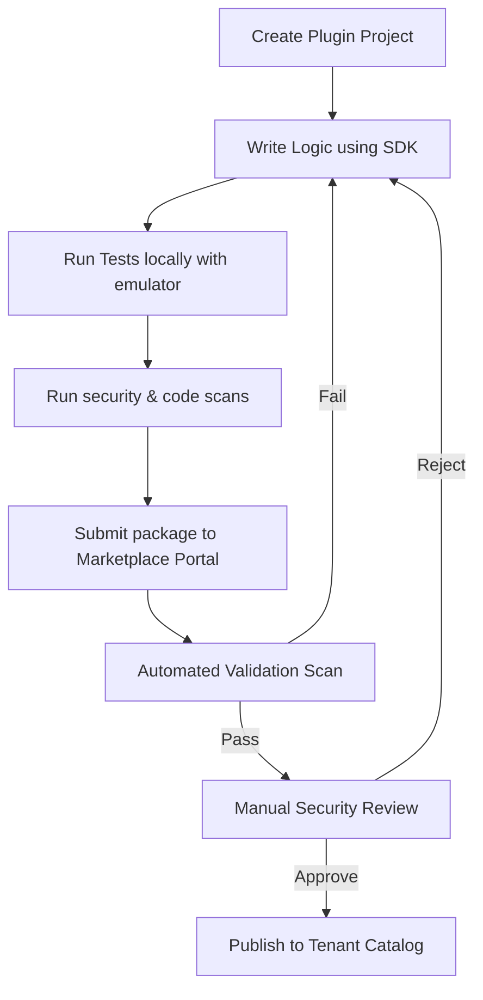
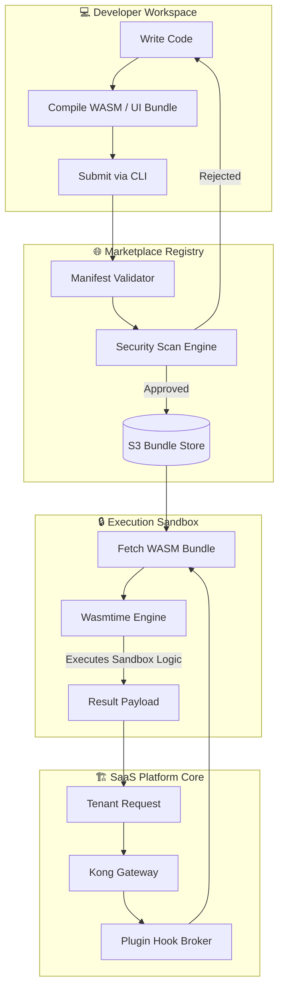
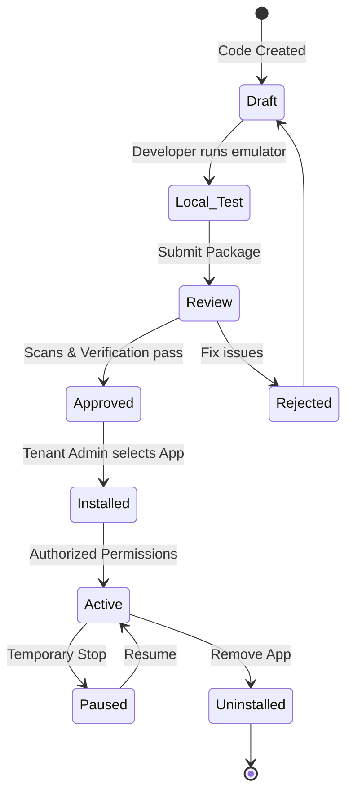
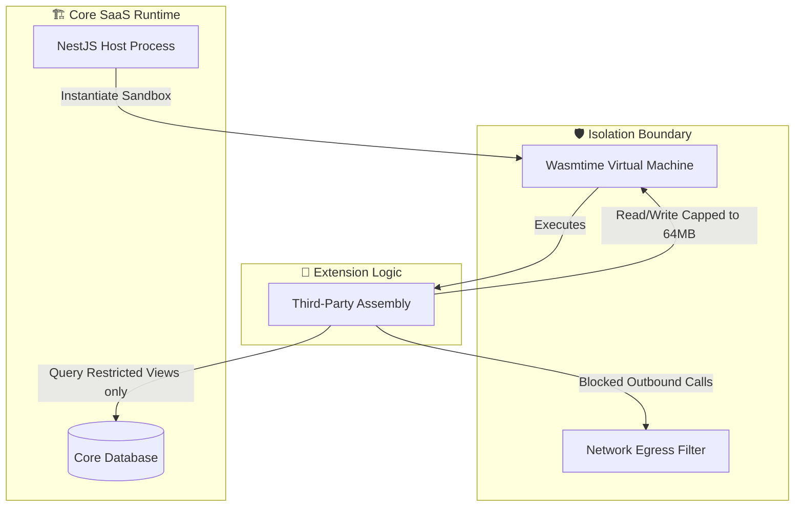
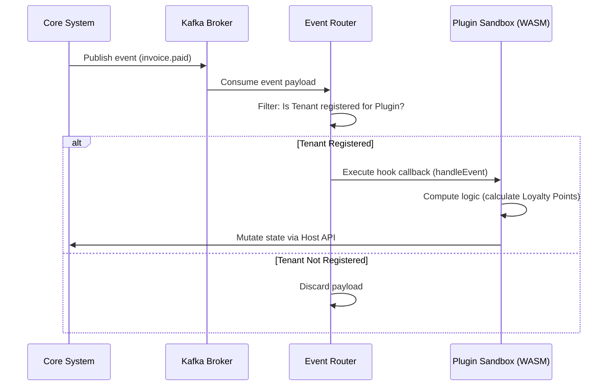
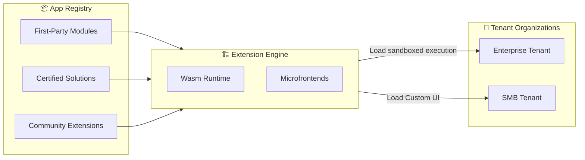

# PLUGIN / EXTENSION ARCHITECTURE

**Project Name:** Enterprise SaaS Business Management Platform  
**Document Version:** 1.0.0 — Baseline Standard  
**Date:** July 14, 2026  
**Authors:** Principal Platform Architect, Plugin System Architect, Modular Software Architect, SaaS Extension Platform Engineer, Security Architect, Enterprise Marketplace Strategist  
**Classification:** Internal — Confidential  
**Phase:** 21.3 — Plugin / Extension Architecture  

---

## Table of Contents

1. [Executive Summary](#1-executive-summary)
2. [Plugin Ecosystem Foundation](#2-plugin-ecosystem-foundation)
3. [Extension Platform Architecture](#3-extension-platform-architecture)
4. [Plugin Types](#4-plugin-types)
5. [Extension SDK Architecture](#5-extension-sdk-architecture)
6. [Plugin Runtime Architecture](#6-plugin-runtime-architecture)
7. [Modular Business Architecture](#7-modular-business-architecture)
8. [Plugin Isolation Model](#8-plugin-isolation-model)
9. [Extension Permission System](#9-extension-permission-system)
10. [Plugin Event System](#10-plugin-event-system)
11. [UI Extension Architecture](#11-ui-extension-architecture)
12. [Database Extension Model](#12-database-extension-model)
13. [Plugin Development Flow](#13-plugin-development-flow)
14. [Plugin Security Model](#14-plugin-security-model)
15. [Extension Management System](#15-extension-management-system)
16. [Developer Experience Journey](#16-developer-experience-journey)
17. [Developer Technology Stack](#17-developer-technology-stack)
18. [Plugin Analytics & Monitoring](#18-plugin-analytics--monitoring)
19. [Enterprise Extension Model](#19-enterprise-extension-model)
20. [Extension Evolution Roadmap](#20-extension-roadmap)
21. [Final Architecture Diagrams](#21-final-architecture-diagrams)
22. [Implementation Summary](#22-implementation-summary)

---

## 1. Executive Summary

### 1.1 Document Purpose
This document defines the complete enterprise blueprint for the **Plugin / Extension Architecture** (Phase 21.3) of the SaaS Business Management Platform. While Phase 21.1 and 21.2 established developer onboarding, APIs, and webhooks, Phase 21.3 moves inside the application boundaries. It details how the platform executes third-party code, loads remote frontend modules, updates database schemas, and listens to internal events—all within a sandboxed, zero-trust, multi-tenant execution model.

### 1.2 Strategic Goals
The platform transformation from a monolithic product to an extensible ecosystem addresses three critical architectural problems:
*   **Preventing Core Code Bloat:** Core microservices should only contain universally applicable business models. Tailored industry logic (e.g., custom loyalty calculations, unique warehouse scanning flows) must reside in external modules.
*   **Decoupling Release Lifecycles:** External developers and enterprise engineering teams must write, test, and release extensions independently of the platform's core Next.js frontend and NestJS backend pipelines.
*   **Enforcing Zero-Trust Tenancy Isolation:** Plugins executing on shared infrastructure must be constrained by strict memory, CPU, database, and network boundaries so a vulnerability in one extension cannot compromise the core tenant data.

---

## 2. Plugin Ecosystem Foundation

### 2.1 The Extensible Platform Shift

In traditional software deployment models, a single application team maintains the exclusive right to modify code. In the **Platform Ecosystem Model**, the core system provides extension hook points, sandbox environments, and distribution channels, enabling a distributed network of developers to expand platform capability dynamically.

```
TRADITIONAL CLOSED SYSTEM               EXTENSIBLE PLATFORM ECOSYSTEM
┌─────────────────────────┐             ┌──────────────────────────────────┐
│  ┌───────────────────┐  │             │   ┌──────────────────────────┐   │
│  │ Core SaaS Product │  │             │   │    Core SaaS Platform    │   │
│  └─────────┬─────────┘  │             │   └──────┬────────────┬──────┘   │
│            │            │             │          │            │          │
│            ▼            │             │          ▼            ▼          │
│     All Integrations    │             │      Hook Point   Hook Point     │
│     must be baked in    │             │          │            │          │
│     by platform devs.   │             │          ▼            ▼          │
│                         │             │     ┌─────────┐  ┌─────────┐     │
│  ✗ Slow Time to Market  │             │     │ Ext App │  │ Ext App │     │
│  ✗ Monolithic Growth   │             │     │  (Wasm) │  │(Iframe) │     │
│  ✗ Customization Bloat  │             │     └─────────┘  └─────────┘     │
│                         │             │  ✓ Fast Integration Loop         │
│                         │             │  ✓ Domain-Specific Customization │
└─────────────────────────┘             └──────────────────────────────────┘
```

### 2.2 Core Business Benefits
1.  **High Customization Velocity:** Instead of lobbying the product management team for custom fields or specialized modules, enterprise customers can deploy dedicated private extensions in days.
2.  **Decentralized Innovation:** The ecosystem matches niche user demands (e.g., medical practice billing integrations, regional customs brokerage forms) without burdening the platform's engineering roadmap.
3.  **Third-Party Developer Flywheel:** As independent software vendors (ISVs) write plugins, they bring their own customer bases onto the SaaS platform, triggering a developer-customer network effect.

---

## 3. Extension Platform Architecture

The Extension Platform intercepts developer uploads, validates manifest configurations, executes logic in sandboxed runtime workers, and projects UI fragments into the main application layouts.

```
Developer
    │
    ▼
[Plugin CLI / Web Portal]
    │
    ▼
[Manifest Validator] ── (JSON Schema Validation)
    │
    ├─► Valid?
    │    ├── Yes ──► [Registry Database] ──► [Storage (S3 Bundle)]
    │    └── No  ──► [Return 400 Bad Request]
    │
    ├─► Runtime Load Engine
    │    ├── Backend: provision WebAssembly Sandboxed Worker (Wasmtime)
    │    └── Frontend: bundle module mapped to Custom UI Iframe/Shadow DOM
    │
    ▼
[Kong API Gateway & Auth] 
    │
    ▼
[Core Platform Microservices]
```

---

## 4. Plugin Types

The platform supports six categories of extensions to cover backend processing, frontend UI, data streaming, and automated decision-making.

| Plugin Type | Primary Execution Environment | Data Flow Mechanism | Core Use Case |
| :--- | :--- | :--- | :--- |
| **Business Module** | WASM Sandbox (Wasmtime Runtime) | Synchronous gRPC / Core Database Proxy | Custom calculations, loyalty logic, specialized payroll runs. |
| **UI Extension** | Next.js Frontend (Iframe / Web Component) | Window postMessage / SDK Context Broker | Embedded dashboard widgets, extra navigation panels, custom forms. |
| **Workflow Extension** | Temporal.io Worker | Event Listener + Queue-based Job Execution | Automating inventory reorders, status changes based on external APIs. |
| **Integration Extension** | Isolated Node.js Container | Webhooks / API polling loops | Bi-directional synchronization with specialized regional legacy ERPs. |
| **AI Agent Extension** | LLM Orchestrator | RAG Vector DB Search + Tool Invocation | Industry-specific copilot skills, chat tools, automated document parsing. |
| **Analytics Extension** | ClickHouse / DuckDB Worker | Read-only Replica Querying | Tailored tax reports, compliance audit exports, custom KPI aggregators. |

---

## 5. Extension SDK Architecture

The Platform Extension SDK provides the interface between the extension code and core services. It is compiled directly into backend modules or loaded dynamically in frontend wrappers.

```
┌────────────────────────────────────────────────────────────────────────┐
│                        PLATFORM EXTENSION SDK                          │
├────────────────────────────────────────────────────────────────────────┤
│ ┌────────────────────────────────────────────────────────────────────┐ │
│ │  API CLIENT ENGINE                                                 │ │
│ │  • Scoped HTTP wrapper pointing to Sandbox Gateway                 │ │
│ │  • Automatic token rotation & context propagation                  │ │
│ └────────────────────────────────────────────────────────────────────┐ │
│ ┌────────────────────────────────────────────────────────────────────┐ │
│ │  UI COMPONENT LIBRARY (Tailored Design System Web Components)      │ │
│ │  • <PlatformButton>     • <PlatformTable>     • <PlatformCard>     │ │
│ └────────────────────────────────────────────────────────────────────┐ │
│ ┌────────────────────────────────────────────────────────────────────┐ │
│ │  DATABASE ACCESS PROXY                                             │ │
│ │  • Scoped key-value store interface (tenant-isolated namespaces)   │ │
│ │  • Read-only access to core DB models through secure schema view   │ │
│ └────────────────────────────────────────────────────────────────────┐ │
│ ┌────────────────────────────────────────────────────────────────────┐ │
│ │  EVENT SUBSCRIBER & BROKER                                         │ │
│ │  • Event listening client mapping Kafka topics to local callbacks  │ │
│ └────────────────────────────────────────────────────────────────────┐ │
│ ┌────────────────────────────────────────────────────────────────────┐ │
│ │  TESTING UTILITIES                                                 │ │
│ │  • Mock core services emulator, validation runners, local portal   │ │
│ └────────────────────────────────────────────────────────────────────┐ │
└────────────────────────────────────────────────────────────────────────┘
```

---

## 6. Plugin Runtime Architecture

Plugins containing custom logic execute inside a secure WebAssembly (WASM) runner based on **Wasmtime**. This design ensures code execution is fast, memory-safe, and decoupled from the host operating system.

### 6.1 WASM Execution Lifecycle
1.  **Tenant Request Arrives:** A tenant triggers an action requiring custom processing (e.g., calculation of a specialized invoice tax).
2.  **Instantiation:** The WASM module is fetched from the cache and compiled in-memory within a strict sandbox context.
3.  **Isolation Limits Applied:** Memory footprint is constrained to 64MB; CPU execution is budget-limited to 500ms max.
4.  **Host Calls:** The WASM code communicates with core systems using predefined WebAssembly System Interface (WASI) imports.
5.  **Tear-down:** Once the result is returned, the WASM memory space is instantly freed, preventing memory leakage.

### 6.2 NestJS Plugin Engine Service Implementation
```typescript
import { Injectable, InternalServerErrorException } from '@nestjs/common';
import * as fs from 'fs/promises';
import { WASI } from 'wasi';
import * as path from 'path';

@Injectable()
export class PluginEngineService {
  private readonly wasmCache = new Map<string, WebAssembly.Module>();

  async executePlugin(
    pluginPath: string,
    tenantId: string,
    inputData: Record<string, any>
  ): Promise<Record<string, any>> {
    try {
      let module = this.wasmCache.get(pluginPath);
      if (!module) {
        const wasmBuffer = await fs.readFile(path.resolve(pluginPath));
        module = await WebAssembly.compile(wasmBuffer);
        this.wasmCache.set(pluginPath, module);
      }

      const wasi = new WASI({
        args: [],
        env: {
          TENANT_ID: tenantId,
          EXECUTION_ENV: 'sandbox',
        },
        preopens: {},
      });

      const importObject = {
        wasi_snapshot_preview1: wasi.wasiImport,
        env: {
          log_message: (ptr: number, len: number) => this.hostLog(ptr, len),
          fetch_tenant_metadata: (ptr: number) => this.hostGetMetadata(tenantId, ptr),
        },
      };

      const instance = await WebAssembly.instantiate(module, importObject);
      wasi.start(instance);

      // Extract entrypoint and pass parameters via memory buffer
      const exports = instance.exports as any;
      const memory = exports.memory as WebAssembly.Memory;
      
      const inputString = JSON.stringify(inputData);
      const encoder = new TextEncoder();
      const encodedInput = encoder.encode(inputString);
      
      // Allocate buffer in Wasm memory
      const inputPtr = exports.allocate(encodedInput.length);
      const buffer = new Uint8Array(memory.buffer, inputPtr, encodedInput.length);
      buffer.set(encodedInput);

      const outputPtr = exports.run_logic(inputPtr, encodedInput.length);
      
      // Read output response
      const outputLen = exports.get_output_length();
      const outputBuffer = new Uint8Array(memory.buffer, outputPtr, outputLen);
      const decoder = new TextDecoder();
      const resultString = decoder.decode(outputBuffer);

      // Clean memory
      exports.deallocate(inputPtr, encodedInput.length);
      exports.deallocate(outputPtr, outputLen);

      return JSON.parse(resultString);
    } catch (error) {
      throw new InternalServerErrorException(`Wasm execution failed: ${error.message}`);
    }
  }

  private hostLog(ptr: number, len: number) {
    // Console log routing with safety checks
    console.log(`[Plugin Log] Wasm module execution logged output.`);
  }

  private hostGetMetadata(tenantId: string, ptr: number) {
    // Restricted host lookup
  }
}
```

---

## 7. Modular Business Architecture

Core tables remain immutable. Domain objects support relationships with plugin systems through dynamic data joins and metadata mapping registries.

```
       CORE PLATFORM                           EXTENSION SYSTEM
┌─────────────────────────┐             ┌─────────────────────────────┐
│  Customer Account (CRM) │             │  Membership System Plugin   │
│  • customer_id (UUID)   │────────────►│  • membership_id (UUID)     │
│  • tenant_id (UUID)     │             │  • customer_id (UUID)       │
│  • name, email          │             │  • reward_tier, points      │
└─────────────────────────┘             └─────────────────────────────┘
                                                       │
                                                       ▼
                                        Custom UI renders inside
                                        Core Customer layout.
```

### 7.1 Schema Mapping Manifest
Extensions store customized schema models in a registry metadata table. When the core application calls the database, it performs a join on the metadata fields defined by the plugin layout.

---

## 8. Plugin Isolation Model

A strict, four-layered isolation policy protects the system against resource exhaustion, credential access, or security boundary degradation.

```
┌────────────────────────────────────────────────────────────────────────┐
│                        SECURITY ISOLATION MODEL                        │
├────────────────────────────────────────────────────────────────────────┤
│  Layer 1: Runtime Engine (WASM Isolation)                              │
│  • Memory allocation capped strictly at 64MB per process               │
│  • Execution thread terminates automatically if execution exceeds 500ms │
│  • Strict exclusion of standard OS access (no write outside workspace) │
├────────────────────────────────────────────────────────────────────────┤
│  Layer 2: Network Rules (Virtual Network)                              │
│  • Outbound plugin network calls blocked by default                    │
│  • Permitted external API targets must be whitelisted in the manifest │
│  • Block access to internal metadata endpoints (AWS IMDS / K8s DNS)    │
├────────────────────────────────────────────────────────────────────────┤
│  Layer 3: Data Segregation (Multi-Tenant Isolation)                    │
│  • Database tables mapped dynamically by tenant scopes                │
│  • Core SQL queries constrained by row-level tenancy validation filters │
└────────────────────────────────────────────────────────────────────────┘
```

---

## 9. Extension Permission System

No extension is allowed to run with root access. The developer declares the required permission model in the plugin's manifest configuration file.

```json
{
  "plugin_id": "com.developer.loyalty-pro",
  "name": "Loyalty Pro",
  "version": "1.2.0",
  "required_permissions": [
    "crm:customers:read",
    "finance:invoices:read",
    "finance:payments:write"
  ],
  "sandbox_network_permissions": {
    "allow_outbound": true,
    "allowed_domains": [
      "api.loyaltypartner.com"
    ]
  }
}
```

Tenant administrators must explicitly confirm and authorize these scopes when installing the extension. If a plugin attempts to request resources outside the authorized scope, the API layer blocks the call.

---

## 10. Plugin Event System

The Event Engine uses a publish-subscribe model. The system routes core events to the plugin execution sandbox using Kafka and internal event dispatchers.

```
Core Event (invoice.paid)
    │
    ▼
Kafka Event Broker
    │
    ▼
[Plugin Event Dispatcher]
    │
    ├─► Match Active Subscriptions?
    │    ├── Yes ──► Send payload to Sandbox (Wasm execution)
    │    └── No  ──► Discard
    │
    ▼
[Sandbox Execution] ──► Call callback handler: update loyalty status
```

### 10.1 Callback Code Example
```typescript
// SDK Callback definition inside WASM Plugin
export function handleEvent(event: PlatformEvent): void {
  if (event.type === 'invoice.paid') {
    const payload = JSON.parse(event.payload);
    const amount = payload.amount;
    const customerId = payload.customerId;

    // Calculate loyalty points
    const points = Math.floor(amount * 0.10);

    // Call Platform Host API to update customer points
    HostAPI.updateLoyaltyPoints(customerId, points);
  }
}
```

---

## 11. UI Extension Architecture

The frontend maps extension panels, widgets, and fields onto core dashboard layouts using a **Micro-Frontend** approach utilizing Web Components and sandboxed IFrames.

```
┌────────────────────────────────────────────────────────────┐
│                  Core SaaS App Layout                      │
│ ┌────────────────────────────────────────────────────────┐ │
│ │ Header Navigation                                      │ │
│ └────────────────────────────────────────────────────────┘ │
│ ┌───────────────┐ ┌──────────────────────────────────────┐ │
│ │ Sidebar       │ │ Customer Detail Page                 │ │
│ │ Menu          │ │ Name: Jane Doe                       │ │
│ │               │ │ Email: jane@example.com              │ │
│ │               │ │                                      │ │
│ │               │ │ ┌──────────────────────────────────┐ │ │
│ │               │ │ │ Custom Membership Widget         │ │ │
│ │               │ │ │ (Loaded via Sandboxed Web Comp)  │ │ │
│ │               │ │ │ Points Balance: 1,500            │ │ │
│ │               │ │ │ Reward Tier: Platinum            │ │ │
│ │               │ │ └──────────────────────────────────┘ │ │
│ └───────────────┘ └──────────────────────────────────────┘ │
└────────────────────────────────────────────────────────────┘
```

### 11.1 Communication Bridge
UI Extensions running inside IFrames communicate with the main application frame using a secure messaging bridge to fetch state or request actions.

```javascript
// UI Extension Message Broker (Inside IFrame)
window.parent.postMessage({
  source: 'platform-ui-extension',
  action: 'FETCH_CUSTOMER_CONTEXT',
  payload: {}
}, 'https://app.platform.com');

// Event Listener on Main Application Frame
window.addEventListener('message', (event) => {
  if (event.origin !== 'https://trusted-extension-origin.com') return;
  if (event.data.action === 'FETCH_CUSTOMER_CONTEXT') {
    // Check permissions and dispatch response
    event.source.postMessage({
      action: 'CUSTOMER_CONTEXT_RESPONSE',
      payload: { id: 'cust_987', name: 'Jane Doe' }
    }, event.origin);
  }
});
```

---

## 12. Database Extension Model

The Database Extension Layer resolves how plugins write data. It supports three strategies to keep the database system scalable and isolated.

```
                       DATABASE EXTENSION STRATEGIES
┌────────────────────────────────────────────────────────────────────────┐
│  Strategy A: Metadata Columns (EAV / JSONB)                            │
│  • Used for: Simple field extensions (e.g., addition of custom tax ID) │
│  • Storage: Stored inside the core table using a JSONB column         │
│  • Benefit: Indexable, no new table creation required                  │
├────────────────────────────────────────────────────────────────────────┤
│  Strategy B: Separate Extension Database                               │
│  • Used for: Heavy relational custom business models                   │
│  • Storage: Dedicated postgres schema or isolated MongoDB database    │
│  • Benefit: Decoupled migration lifecycles, easy to drop on uninstall   │
├────────────────────────────────────────────────────────────────────────┤
│  Strategy C: Key-Value Metadata Store                                  │
│  • Used for: Transient key-value records, custom preferences           │
│  • Storage: Redis / DynamoDB key-value store                           │
│  • Benefit: Sub-millisecond reads/writes                               │
└────────────────────────────────────────────────────────────────────────┘
```

---

## 13. Plugin Development Flow

Developers write plugins locally, test them using emulators, run them through security checks, and deploy them.



---

## 14. Plugin Security Model

The platform enforces multiple defensive controls to protect against common attack vectors.

*   **Static Code Analysis:** Code submission pipelines check JS/WASM modules for memory leaks, recursion loops, and imports outside of the whitelist.
*   **Wasm Sandbox Hardening:** The compiler restricts memory pointer bounds and enforces execution cycle budgeting to prevent denial-of-service (DoS) loop attacks.
*   **Tenancy Verification:** Every execution request must include a verified cryptographic tenant signature. No plugin runtime can query the database without presenting this header.

---

## 15. Extension Management System

Tenant Administrators manage installed extensions through a settings workspace.

```
┌────────────────────────────────────────────────────────┐
│             Admin Center: Extension Settings            │
├────────────────────────────────────────────────────────┤
│ Installed Plugins:                                     │
│                                                        │
│ [icon] Loyalty Pro v1.2.0           [Enabled]  [Config]│
│        Permissions: CRM (Read), Invoices (Read)        │
│                                                        │
│ [icon] Advanced Warehouse v0.9      [Disabled] [Delete]│
│        Permissions: Stock (Write), Orders (Write)      │
│                                                        │
│ ┌────────────────────────────────────────────────────┐ │
│ │  Configure Plugin: Loyalty Pro                      │ │
│ │  • Webhook Endpoint: [ https://api.loyalty... ]   │ │
│ │  • Rate Limit: Capped at 50 API calls / minute     │ │
│ └────────────────────────────────────────────────────┘ │
└────────────────────────────────────────────────────────┘
```

### 15.1 Admin Service Orchestrator Actions
*   **Disable:** Blocks the plugin's entrypoint, unsubscribes it from Kafka topics, and disables dynamic frontend hooks instantly.
*   **Update:** Downloads the updated package, runs validations against the new schema manifest, and rolls updates to Wasm runtime memory.
*   **Remove:** Deletes tenant-specific metadata entries and archives isolated extension schema tables.

---

## 16. Developer Experience Journey

The platform provides developers with tools to write and test extensions quickly.

```
   LEARN SDK                BUILD                     TEST
┌──────────────┐      ┌──────────────┐          ┌──────────────┐
│  Quickstart  │ ───► │ CLI Project  │ ───►     │ Run Local    │
│  Guides &    │      │ Template     │          │ Sandbox      │
│  Tutorials   │      │ Generation   │          │ Emulator     │
└──────────────┘      └──────────────┘          └──────────────┘
                                                       │
                                                       ▼
                                                 SUBMIT & PUBLISH
                                                ┌──────────────┐
                                                │ Marketplace  │
                                                │ Submission & │
                                                │ Deployment   │
                                                └──────────────┘
```

*   **SDK Command Line Interface (CLI):** `platform-cli create-app --template wasm-backend` provisions a boilerplate project with structural testing pipelines ready out-of-the-box.
*   **Local Host Emulator:** A mock runner matches core runtime behaviors, enabling offline local verification of event triggers and database schema queries.

---

## 17. Technology Stack

| Category | Technology | Version | Purpose |
| :--- | :--- | :--- | :--- |
| **Backend Isolation** | Wasmtime | 22.0 | Execution sandbox engine for plugin modules |
| **Container Engine** | Docker / gVisor | Latest | High-isolation containers for integration services |
| **Frontend Embedding** | Web Components | Shadow DOM | Sandbox DOM styling, preventing CSS/JS namespace collision |
| **UI Integration** | Single-spa | 6.0 | Micro-frontend framework orchestrating layout routing |
| **Event Broker** | Apache Kafka | 3.7 | Message pipeline distributing events to plugin listeners |
| **Workflow Engine** | Temporal.io | 1.24 | Durable execution patterns for workflow extensions |
| **Storage Platform** | AWS S3 / MinIO | Latest | Secure storage platform for uploaded Wasm bundles |

---

## 18. Plugin Analytics & Monitoring

To maintain overall system performance, the platform tracks plugin resource consumption.

```sql
-- Track plugin execution times & CPU budget exhaustion
SELECT 
    plugin_id,
    tenant_id,
    avg(execution_time_ms) as avg_execution_ms,
    countIf(status = 'EXHAUSTED') as budget_breaches
FROM plugin_execution_logs
WHERE timestamp >= now() - INTERVAL 24 HOUR
GROUP BY plugin_id, tenant_id
ORDER BY avg_execution_ms DESC;
```

### 18.1 Key Health Metrics
*   **Mean Latency Target:** Plugins must return results in less than 50ms P95 to prevent execution queues from blocking core systems.
*   **Error Rate Tolerance:** A plugin that triggers crashes for more than 2% of executions within a 5-minute window is automatically throttled or temporarily disabled.

---

## 19. Enterprise Extension Model

The platform accommodates varying deployment models based on the publisher and target audience.

```
       ENTERPRISE EXTENSION MODELS
┌───────────────────────────────────────┐
│  A: Private Company Extensions        │
│  • Audience: Internal tenant only     │
│  • Security: Self-signed code         │
│  • Purpose: Custom business workflow  │
├───────────────────────────────────────┤
│  B: Partner Extensions                │
│  • Audience: Approved partner network │
│  • Security: Certified code review    │
│  • Purpose: System integrations       │
├───────────────────────────────────────┤
│  C: Public Marketplace Extensions     │
│  • Audience: Global tenant list       │
│  • Security: Full sandbox checks      │
│  • Purpose: Public ecosystem utility  │
└───────────────────────────────────────┘
```

---

## 20. Extension Roadmap

The platform rollout follows a four-phase lifecycle to ensure stability.

```
Phase 1: Internal Modules (Q4 2026)
  • Platform teams refactor CRM and Billing modules into sandboxed WASM files.
  • Stabilization of core host APIs and event brokers.

Phase 2: Custom Extensions (Q1 2027)
  • Expose Wasm sandboxing to select Enterprise customers.
  • Release of the CLI development toolbelt and local emulator.

Phase 3: Partner Extensions (Q2 2027)
  • Open development access to certified technology partners.
  • Introduction of UI Hook points, Web Components, and Custom Page mapping.

Phase 4: Marketplace Ecosystem (Q3 2027)
  • Global self-serve submission and deployment portal.
  • Automatic monetization payouts, user ratings, and certified security scanning.
```

---

## 21. Final Architecture Diagrams

### 21.1 Plugin Platform Architecture



### 21.2 Extension Lifecycle



### 21.3 Plugin Security Isolation



### 21.4 Event Extension Flow



### 21.5 Future SaaS Extension Ecosystem



---

## 22. Implementation Summary

### 22.1 Delivery Checklist

| Component | Target Timeline | Status |
| :--- | :--- | :--- |
| Core WASM Engine Proof of Concept | Week 1–2 | Planned |
| manifest.json Validator Engine | Week 2–3 | Planned |
| Security Scanner (Static WASM Verification) | Week 3–5 | Planned |
| Web Component Shadow DOM UI Loader | Week 4–6 | Planned |
| Local emulator runner CLI | Week 6–8 | Planned |

---

## Document Control

| Field | Value |
|---|---|
| **Document ID** | SBMP-EXT-21.3-PLUGIN-ARCHITECTURE |
| **Version** | 1.0.0 |
| **Status** | APPROVED — Baseline |
| **Owner** | Principal Platform Architect |
| **Reviewed By** | CTO, VP Engineering, CISO |
| **Review Cycle** | Quarterly |
| **Next Review** | October 2026 |

---

*Phase 21.3 — Plugin / Extension Architecture | SaaS Business Management Platform*  
*Enterprise Confidential — © 2026 All Rights Reserved*
