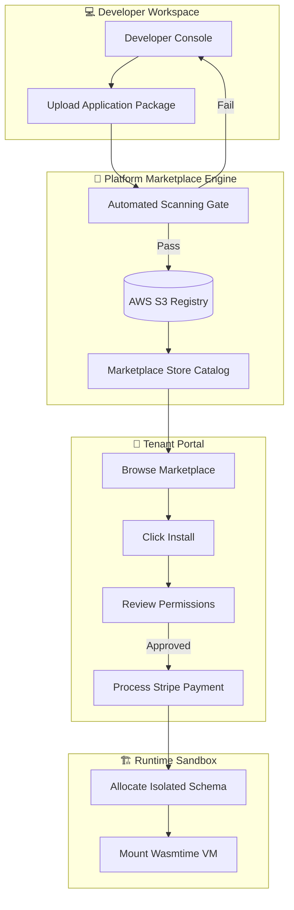
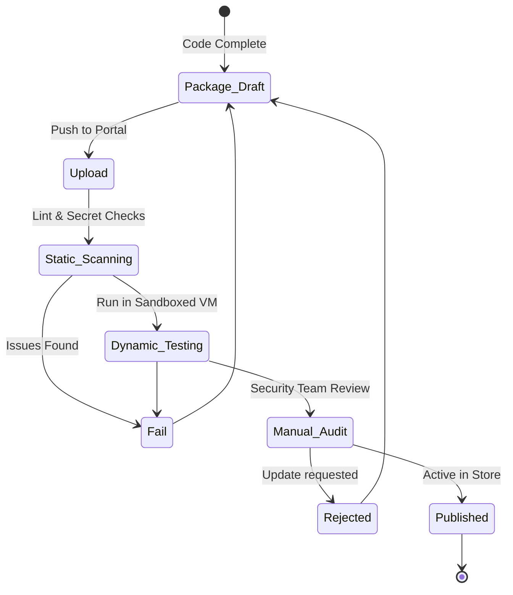
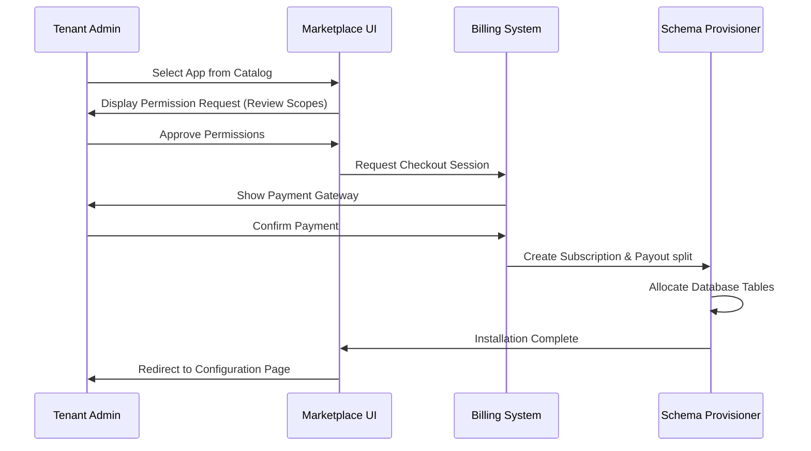
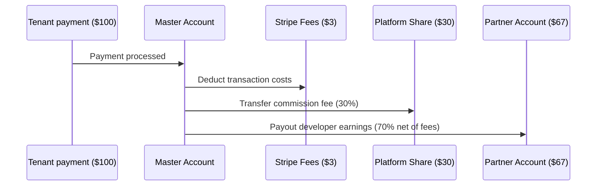
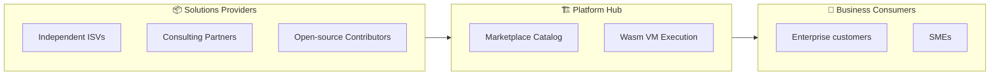

# SAAS MARKETPLACE ARCHITECTURE

**Project Name:** Enterprise SaaS Business Management Platform  
**Document Version:** 1.0.0 — Baseline Standard  
**Date:** July 14, 2026  
**Authors:** Chief Marketplace Architect, SaaS Platform Architect, Digital Ecosystem Strategist, Product Platform Engineer, Billing Architect, Enterprise Marketplace Designer  
**Classification:** Internal — Confidential  
**Phase:** 21.4 — SaaS Marketplace Architecture  

---

## Table of Contents

1. [Executive Summary](#1-executive-summary)
2. [Marketplace Foundation & Vision](#2-marketplace-foundation--vision)
3. [Marketplace System Architecture](#3-marketplace-system-architecture)
4. [Marketplace Core Components](#4-marketplace-core-components)
5. [Application Catalog System](#5-application-catalog-system)
6. [App Discovery System](#6-app-discovery-system)
7. [App Installation System](#7-app-installation-system)
8. [Billing & Monetization Models](#8-billing--monetization-models)
9. [Revenue Sharing Model](#9-revenue-sharing-model)
10. [Security Review Process](#10-security-review-process)
11. [App Update Management](#11-app-update-management)
12. [Customer Experience Journey](#12-customer-experience-journey)
13. [Developer Experience & Publishing Flow](#13-developer-experience--publishing-flow)
14. [Marketplace Billing Platform Integration](#14-marketplace-billing-platform-integration)
15. [AI Marketplace Extension](#15-ai-marketplace-extension)
16. [Marketplace Analytics](#16-marketplace-analytics)
17. [Marketplace Security & Trust](#17-marketplace-security--trust)
18. [Partner Management Portal](#18-partner-management-portal)
19. [Marketplace Technology Stack](#19-marketplace-technology-stack)
20. [Marketplace Evolution Roadmap](#20-marketplace-evolution-roadmap)
21. [Final Marketplace Diagrams](#21-final-marketplace-diagrams)
22. [Implementation Summary](#22-implementation-summary)

---

## 1. Executive Summary

### 1.1 Document Purpose
This document defines the complete enterprise blueprint for the **SaaS Marketplace Architecture** (Phase 21.4) of the SaaS Business Management Platform. It details the monetization mechanics, search discovery engine, automated billing split-revenue calculations, secure customer consent installation system, review system, and partner management workflows required to transform the platform into a multi-tenant business operating ecosystem.

### 1.2 Scope
Building upon Phase 21.1 (Portal Foundation), 21.2 (Public APIs), and 21.3 (Wasm/Web Component Extension Sandbox), this document details the marketplace wrapper. It addresses:
*   How users discover and purchase applications.
*   How developers configure billing models (recurring subscriptions, usage tiers, one-time sales).
*   How Stripe Connect split-payouts process platform commissions dynamically.
*   How the platform handles automated security verification, user reviews, and version rollbacks.

---

## 2. Marketplace Foundation & Vision

### 2.1 Monolithic SaaS vs Platform Ecosystem

In a traditional single-product SaaS configuration, internal teams are responsible for coding all features. In an **Ecosystem Marketplace**, third-party developers construct and sell applications directly to the user base, driving exponential value creation through community-led expansion.

```
TRADITIONAL SINGLE-PRODUCT SaaS              MARKETPLACE ECOSYSTEM
┌────────────────────────────────┐       ┌────────────────────────────────┐
│  ┌──────────────────────────┐  │       │  ┌──────────────────────────┐  │
│  │    SaaS Core Platform    │  │       │  │    SaaS Core Platform    │  │
│  └─────────────┬────────────┘  │       │  └──────┬────────────┬──────┘  │
│                │               │       │         │            │         │
│                ▼               │       │         ▼            ▼         │
│         All Native Apps        │       │    App Store    Developer SDK  │
│         built by internal      │       │         │            │         │
│         product team.          │       │         ▼            ▼         │
│                                │       │  ┌─────────────┐┌─────────────┐│
│  ✗ Limited feature selection   │       │  │ Partner App ││ Community   ││
│  ✗ Higher engineering burn     │       │  │ (Accounting)││ AI Agent    ││
│  ✗ Slower response to trends   │       │  └─────────────┘└─────────────┘│
│                                │       │  ✓ 10x Feature Diversification │
│                                │       │  ✓ Revenue sharing model       │
└────────────────────────────────┘       └────────────────────────────────┘
```

### 2.2 Core Strategic Value
1.  **Extended Uptime Utility:** Businesses integrate custom marketplace apps to fill operational gaps, making the core SaaS system an indispensable part of their daily toolchain.
2.  **New Monetization Vector:** Every third-party app sale generates transactional revenue for the platform via split-fee commissions.
3.  **Self-Sustaining Ecosystem:** Increased customer count attracts developers eager to monetize their creations, which in turn brings more customers to the platform.

---

## 3. Marketplace System Architecture

The SaaS Marketplace orchestrates search queries, billing records, installation packages, and permission grants across the user interfaces and back-end databases.

```
       Developer
           │
           ▼
     [Developer Portal] ──► [Manifest & Package Upload]
                                   │
                                   ▼
                            [Security Review]
                                   │
                                   ▼
[Customer UI] ──► [Search Discovery] ──► [Authorize Permissions]
                                                │
                                                ▼
                                    [Stripe Connect Payouts]
                                                │
                                                ▼
                                    [Installation Service]
                                                │
                                                ▼
                                   [Core Multi-Tenant DB]
```

---

## 4. Marketplace Core Components

The marketplace architecture consists of seven functional components:

1.  **App Catalog System:** The system database of record containing verified app profiles, binary files, metadata, categories, and version states.
2.  **Search & Discovery Engine:** Query processor utilizing Elasticsearch to search by categories, keywords, rankings, and AI-driven relevance models.
3.  **App Profile Presentation Layer:** Detail layout presenting user reviews, screenshots, terms of service, requested scopes, pricing models, and developer information.
4.  **Consent & Installation Manager:** System component validating permission scopes against tenant security settings, initiating payment flows, and activating configurations.
5.  **Rating & Review System:** Customer feedback platform verifying that reviewers own active installations to prevent review manipulation.
6.  **Billing & Monetization Engine:** Payment broker allocating stripe charges between developer bank routing codes and platform revenue lines.
7.  **Analytics & Dashboard Hub:** Reporting system tracking daily installation counts, churn logs, subscription statuses, and monthly revenue performance.

---

## 5. Application Catalog System

The App Catalog stores structural attributes for every registered application.

```typescript
export interface AppCatalogEntry {
  app_id: string;
  developer_id: string;
  name: string;
  tagline: string;
  description_markdown: string;
  categories: AppCategory[];
  supported_locales: string[];
  version_manifest: {
    current_version: string;
    target_wasm_runtime: string;
    dependencies: Record<string, string>;
  };
  pricing_model: PricingConfig;
  scopes_requested: string[];
  security_verification: {
    status: 'PENDING' | 'VERIFIED' | 'FLAGGED';
    last_scanned_at: Date;
    sbom_hash: string;
  };
  media_assets: {
    icon_url: string;
    screenshots: string[];
    demo_video_url?: string;
  };
}

export enum AppCategory {
  FINANCE = 'Finance & Accounting',
  HR = 'HR & Payroll',
  CRM = 'CRM & Sales',
  INVENTORY = 'Inventory & Logistics',
  AI = 'AI & Productivity',
  ANALYTICS = 'Business Intelligence',
}
```

---

## 6. App Discovery System

The App Discovery platform maps search queries to catalog entries. It balances user context (e.g., matching a logistics manager to shipping tools) using Elasticsearch and AI relevance models.

```
User Query (e.g., "tax reconciler")
    │
    ▼
[Elasticsearch Query Gateway]
    │
    ├─► Text Search: match terms with title, tags, description
    ├─► Metadata Filters: category="Finance", status="VERIFIED"
    ├─► Analytics Score: sort results by install counts + rating index
    ├─► Tenant Context: prioritize apps compatible with active region
    │
    ▼
Sorted App Cards & Recommendations
```

### 6.1 Discovery Engine Index Schema
```json
{
  "mappings": {
    "properties": {
      "name": { "type": "text", "analyzer": "english", "boost": 3.0 },
      "tagline": { "type": "text", "analyzer": "english", "boost": 1.5 },
      "description": { "type": "text", "analyzer": "english" },
      "category": { "type": "keyword" },
      "tags": { "type": "keyword" },
      "average_rating": { "type": "float" },
      "install_count": { "type": "integer" },
      "supported_regions": { "type": "keyword" },
      "ai_relevance_vector": { "type": "dense_vector", "dims": 1536 }
    }
  }
}
```

---

## 7. App Installation System

The installation system secures tenant data using a step-by-step approval and activation workflow.

```
                       INSTALLATION WORKFLOW GATES
┌────────────────────────────────────────────────────────────────────────┐
│  Gate 1: Permission Review & Scope Consent                             │
│  • System presents exact list of scopes the app requests.              │
│  • Administrator must explicitly click check-boxes to approve.         │
│  • Sensitive permissions trigger secondary admin MFA validation.       │
├────────────────────────────────────────────────────────────────────────┤
│  Gate 2: Payment Execution                                             │
│  • Stripe checkout verifies and secures purchase funds.                │
│  • Establishes subscription ledger record.                             │
├────────────────────────────────────────────────────────────────────────┤
│  Gate 3: Environment Allocation & Routing                              │
│  • Provisioning of schema tables and metadata mapping records.        │
│  • Setup client ID secrets inside Kong proxy.                          │
│  • Activation of background event listeners.                            │
└────────────────────────────────────────────────────────────────────────┘
```

### 7.1 NestJS Installation Orchestration Service
```typescript
@Injectable()
export class AppInstallationService {
  constructor(
    private readonly catalogRepo: CatalogRepository,
    private readonly tenantRepo: TenantRepository,
    private readonly stripeService: StripeBillingService,
    private readonly schemaManager: SchemaProvisioningManager,
    private readonly eventRouter: EventSubscriptionRouter
  ) {}

  async installApplication(
    tenantId: string,
    appId: string,
    adminUserId: string,
    paymentMethodId?: string
  ): Promise<InstallationResult> {
    // 1. Fetch app definitions
    const app = await this.catalogRepo.findActiveById(appId);
    if (!app) throw new NotFoundException('Application not found');

    // 2. Process marketplace payment connection
    if (app.pricing_model.type !== PricingType.FREE) {
      const subscription = await this.stripeService.createMarketplaceSubscription(
        tenantId,
        app.pricing_model,
        paymentMethodId
      );
      if (subscription.status !== 'active') {
        throw new BadRequestException('Payment processing failed');
      }
    }

    // 3. Allocate isolated database schema tables
    await this.schemaManager.provisionTenantAppSchema(tenantId, appId, app.version_manifest);

    // 4. Bind event routing paths
    await this.eventRouter.registerTenantAppListeners(tenantId, appId, app.scopes_requested);

    // 5. Update installation state ledger
    await this.tenantRepo.recordAppInstallation(tenantId, {
      appId,
      installedBy: adminUserId,
      installedAt: new Date(),
      status: 'ACTIVE',
      grantedScopes: app.scopes_requested,
    });

    return {
      success: true,
      activatedAt: new Date(),
      settingsRedirectUrl: `/apps/${appId}/configure`,
    };
  }
}
```

---

## 8. Billing & Monetization Models

The marketplace framework supports five billing structures to match partner monetization strategies:

1.  **Free:** Open access; ideal for utility integrations or third-party lead generation.
2.  **Freemium:** Core functionality is free; advanced features are unlocked via paid monthly upgrades.
3.  **Flat Subscription:** Standard monthly or annual recurring service fee (e.g., $29/month).
4.  **Usage-Based pricing:** Pricing determined by usage volume (e.g., $0.05 per processed invoice, billed monthly in arrears).
5.  **One-Time purchase:** Single perpetual license charge for lifetime utilization.

---

## 9. Revenue Sharing Model

Platform monetization uses a split-fee model to cover processing expenses and generate revenue.

```
                      MARKETPLACE SPLIT FEES (Stripe Connect)
┌────────────────────────────────────────────────────────────────────────┐
│  Developer Share (70%)                                                 │
│  • Sent directly to the partner's linked Stripe account.               │
├────────────────────────────────────────────────────────────────────────┤
│  Platform Commission Fee (30%)                                         │
│  • Platform operational commission.                                    │
│  • Billed and cleared directly to core revenue accounts.               │
├────────────────────────────────────────────────────────────────────────┤
│  Stripe Payment Gateway fee (e.g., 2.9% + $0.30)                       │
│  • Deducted from platform share or developer payout base.             │
└────────────────────────────────────────────────────────────────────────┘
```

### 9.1 Payout Ledger Structure
Every monthly invoice billing execution generates a split checkout balance record:

| Transaction ID | Invoice Amount | Developer Payout (70%) | Platform Comm (30%) | Processing Costs |
| :--- | :--- | :--- | :--- | :--- |
| `tx_billing_8892` | $100.00 | $70.00 | $30.00 | $3.20 |
| `tx_billing_9812` | $250.00 | $175.00 | $75.00 | $7.55 |

---

## 10. Security Review Process

Before any third-party app is listed in the marketplace, it must pass through an automated and manual validation pipeline.

```
       Package Upload
             │
             ▼
[Automated Static Analysis] ──► Scan for secrets, insecure WASM imports, bad libraries
             │
             ├─► Failed?
             │    ├── Yes ──► Reject submission
             │    └── No  ──► Go to next gate
             │
             ▼
[Dynamic Sandbox Run] ───────► Execute code in test VM, trace file writes & egress domains
             │
             ├─► Violates rules?
             │    ├── Yes ──► Reject submission
             │    └── No  ──► Go to next gate
             │
             ▼
[Manual Security Review] ────► Manual code verification by security engineering team
             │
             ├─► Approved?
             │    ├── Yes ──► Publish to Marketplace
             │    └── No  ──► Send feedback & remediations to developer
```

---

## 11. App Update Management

Updates must deploy seamlessly to prevent downtime or data inconsistencies.

*   **Semantic Versioning (SemVer):** Mandatory format: `MAJOR.MINOR.PATCH`.
*   **Backward Compatibility Check:** System compiler checks if database schema additions disrupt existing views.
*   **Automated Rollback Rules:** If an updated module throws exceptions for more than 1% of executions within 10 minutes of release, the runner instantly reinstates the previous stable version.

---

## 12. Customer Experience Journey

The marketplace integration interface focuses on ease of discovery and installation.

```
   DISCOVER                 EVALUATE                   INSTALL
┌──────────────┐        ┌──────────────┐          ┌──────────────┐
│  Search and  │ ───►   │ App Detail   │ ───►     │ One-click    │
│  Categorized │        │ Page, reviews│          │ Consent and  │
│  Directory   │        │ & video demos│          │ payment flow │
└──────────────┘        └──────────────┘          └──────────────┘
                                                         │
                                                         ▼
                                                   USE & REVIEW
                                                  ┌──────────────┐
                                                  │ Launch app   │
                                                  │ and submit   │
                                                  │ star rating  │
                                                  └──────────────┘
```

---

## 13. Developer Experience & Publishing Flow

Developers manage their applications through a dedicated console.

```
   BUILD & SDK              TEST CONSOLE               PUBLISH
┌──────────────┐        ┌──────────────┐          ┌──────────────┐
│  Download    │ ───►   │ Sandbox Env  │ ───►     │ Submit form  │
│  Templates   │        │ & Mock Data  │          │ and track    │
│  & CLI Tools │        │ Verification │          │ review state │
└──────────────┘        └──────────────┘          └──────────────┘
                                                         │
                                                         ▼
                                                    MONITOR REVENUE
                                                  ┌──────────────┐
                                                  │ Track payout │
                                                  │ ledger and   │
                                                  │ user reviews │
                                                  └──────────────┘
```

---

## 14. Marketplace Billing Platform Integration

The billing backend coordinates subscriptions and payouts using Stripe Connect.

```
                     STRIPE CONNECT SUBSCRIPTION SYSTEM
┌──────────────────────────────┐          ┌──────────────────────────────┐
│ Platform Master Stripe Account│          │ Developer Stripe Connect Acc │
│ • Receives tenant payments.  │          │ • Receives payouts.          │
└──────────────┬───────────────┘          └──────────────▲───────────────┘
               │                                         │
               └─────────── Split transaction (70%) ─────┘
```

### 14.1 Stripe Connect Split-Payment Code Example
```typescript
import Stripe from 'stripe';

export class PayoutDistributionBroker {
  private stripe = new Stripe(process.env.STRIPE_SECRET_KEY, { apiVersion: '2023-10-16' });

  async captureMarketplaceCharge(
    chargeAmountCents: number,
    developerAccountId: string,
    paymentMethodId: string,
    customerId: string
  ): Promise<Stripe.PaymentIntent> {
    const platformFeeCents = Math.floor(chargeAmountCents * 0.30);

    return this.stripe.paymentIntents.create({
      amount: chargeAmountCents,
      currency: 'usd',
      payment_method: paymentMethodId,
      customer: customerId,
      confirm: true,
      off_session: true,
      application_fee_amount: platformFeeCents,
      transfer_data: {
        destination: developerAccountId, // Payout destination
      },
    });
  }
}
```

---

## 15. AI Marketplace Extension

The marketplace catalog features a dedicated section for AI-native extensions.

```
                         AI MARKETPLACE CATEGORIES
┌────────────────────────────────────────────────────────────────────────┐
│  Category A: Specialized AI Agents                                     │
│  • Autonomous agents with domain knowledge (e.g., Debt Collector Agent)│
├────────────────────────────────────────────────────────────────────────┤
│  Category B: Workflow Orchestration Templates                          │
│  • Automated task flows (e.g., Auto-Billing Verification flow)         │
├────────────────────────────────────────────────────────────────────────┤
│  Category C: Custom AI Skills                                          │
│  • Specialized LLM tools (e.g., Multi-language PDF invoice translator)  │
└────────────────────────────────────────────────────────────────────────┘
```

---

## 16. Marketplace Analytics

The platform provides developers with dashboard analytics tracking their applications' performance.

```sql
-- Calculate monthly recurring revenue per app
SELECT 
    app_id,
    sum(amount) as monthly_revenue,
    count(distinct tenant_id) as active_subscribers
FROM billing_transactions
WHERE status = 'SUCCESS' 
  AND timestamp >= toStartOfMonth(now())
GROUP BY app_id
ORDER BY monthly_revenue DESC;
```

---

## 17. Marketplace Security & Trust

To maintain user trust, the marketplace enforces security and verification rules.

*   **Verified Developer Badge:** Assigned only to developers who complete Business KYC (Know Your Business) checks and clear background security reviews.
*   **PII Leakage Shield:** Sandboxed execution runners intercept outbound HTTP payloads, using regex filters to redact credit card numbers, emails, and phone numbers before they leave the platform.
*   **Escrow Payment Shield:** First-time app purchases are held in escrow for 7 days before payout, allowing time for dispute resolution if an app fails to install or function.

---

## 18. Partner Management Portal

The Partner Console consolidates operational metrics for developers.

```
┌────────────────────────────────────────────────────────┐
│               Developer Hub: Dashboard                 │
├────────────────────────────────────────────────────────┤
│ My Apps:                                               │
│                                                        │
│ [icon] CRM Contact Syncer v2.1      [Active]  [Review] │
│        Installs: 1,240  |  MRR: $12,400.00             │
│                                                        │
│ [icon] Auto Invoice Parser v0.9     [Pending] [Logs]   │
│        Under security scan verification                │
│                                                        │
│ ┌────────────────────────────────────────────────────┐ │
│ │  Stripe Payout Settings                            │ │
│ │  • Connected Account: [ Stripe Connect: acct_882 ]│ │
│ │  • Next Payout: July 31, 2026 ($8,680.00 Net)      │ │
│ └────────────────────────────────────────────────────┘ │
└────────────────────────────────────────────────────────┘
```

---

## 19. Marketplace Technology Stack

| Category | Technology | Purpose |
| :--- | :--- | :--- |
| **Search Engine** | Elasticsearch | Main search database for catalog browsing |
| **Payment Broker** | Stripe Connect | Orchestrates billing splits and payouts |
| **Identity / Scopes** | Keycloak | Manages application OAuth scopes |
| **Asset Storage** | AWS S3 / CloudFront | Serves static assets, screenshots, and WASM binaries |
| **Analytics Processing** | ClickHouse | Tracks usage metrics and compiles dashboard reports |

---

## 20. Marketplace Evolution Roadmap

The marketplace launch follows a structured timeline to ensure stability.

```
Phase 1: First-Party App Listings (Q4 2026)
  • Deploy core marketplace design layouts and catalog databases.
  • List only first-party modules to verify payment split routing.

Phase 2: Closed Partner Beta (Q1 2027)
  • Open the developer portal to a small group of certified partners.
  • Verify installation consent logic and sandbox performance.

Phase 3: Public Marketplace GA (Q2 2027)
  • General self-serve developer registration, code review submission, and public store access.
  • Launch search indexing and category filters.

Phase 4: AI Agent Ecosystem (Q3 2027)
  • Release the AI agent marketplace, enabling users to deploy autonomous workflow skills.
```

---

## 21. Final Marketplace Diagrams

### 21.1 SaaS Marketplace Architecture



### 21.2 App Publishing Workflow



### 21.3 Customer Installation Flow



### 21.4 Billing Revenue Flow



### 21.5 Global Ecosystem Vision



---

## 22. Implementation Summary

### 22.1 Delivery Checklist

| Component | Target Timeline | Status |
| :--- | :--- | :--- |
| Database Catalog Schemas | Week 1–2 | Planned |
| Stripe Connect Split integration | Week 2–4 | Planned |
| Sandboxed installation manager | Week 4–6 | Planned |
| Interactive search index | Week 6–8 | Planned |

---

## Document Control

| Field | Value |
|---|---|
| **Document ID** | SBMP-MKT-21.4-MARKETPLACE-ARCH |
| **Version** | 1.0.0 |
| **Status** | APPROVED — Baseline |
| **Owner** | Chief Marketplace Architect |
| **Reviewed By** | CTO, VP Product, Security Lead |
| **Review Cycle** | Quarterly |
| **Next Review** | October 2026 |

---

*Phase 21.4 — SaaS Marketplace Architecture | SaaS Business Management Platform*  
*Enterprise Confidential — © 2026 All Rights Reserved*
