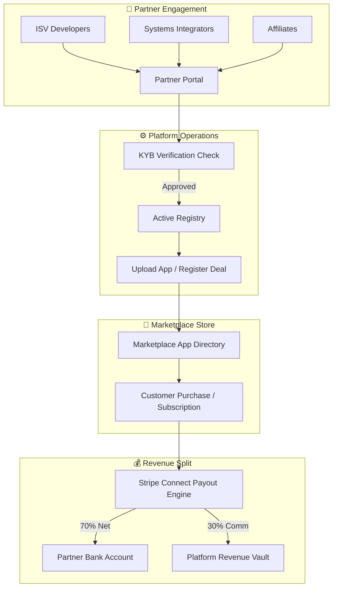
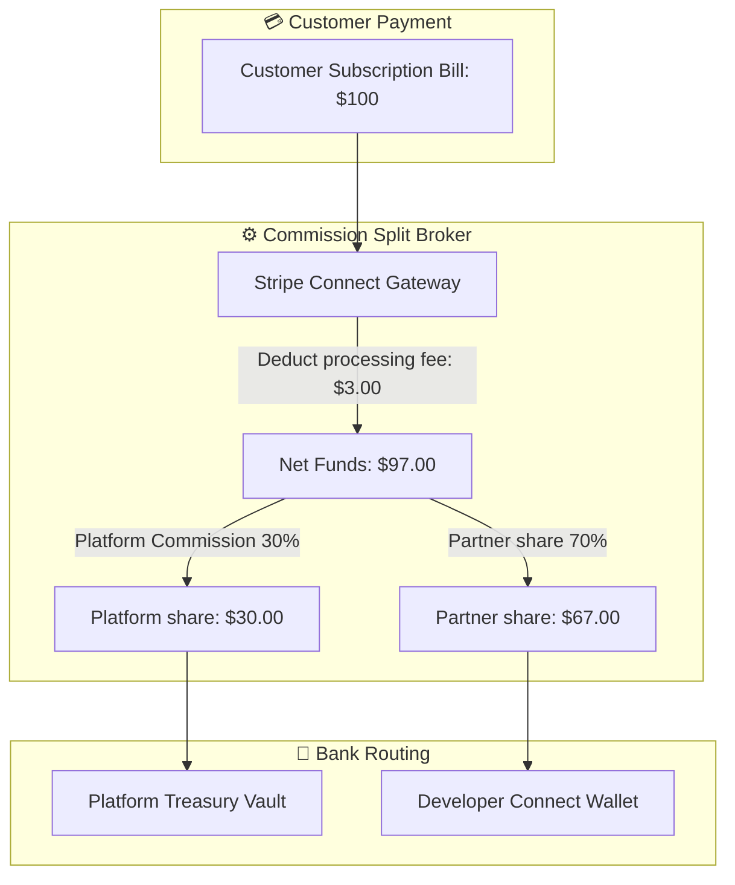
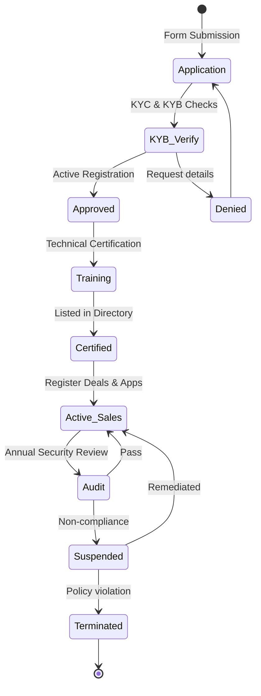
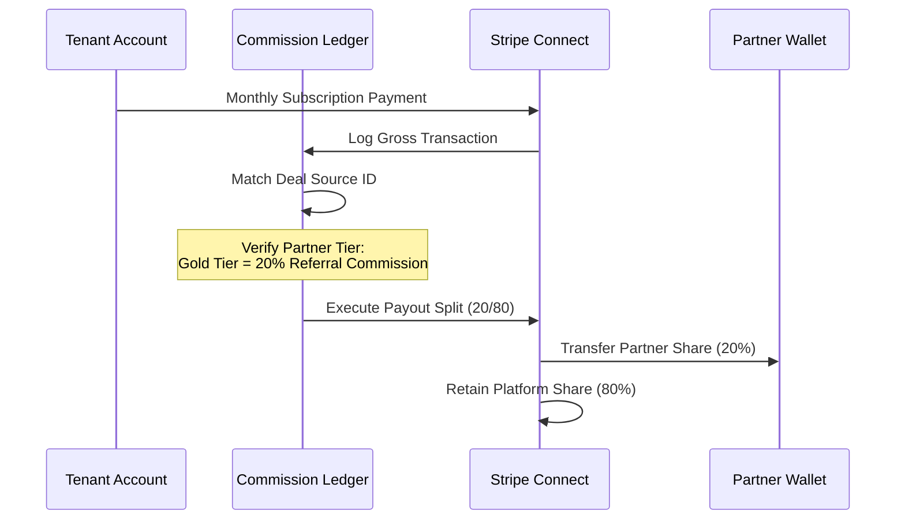
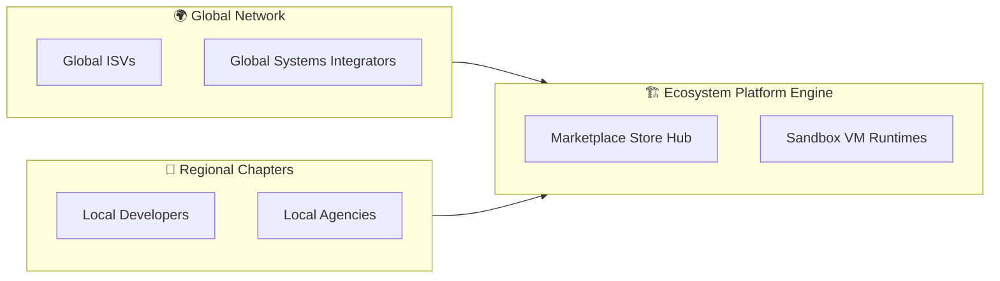

# PARTNER ECOSYSTEM & REVENUE SHARING MODEL

**Project Name:** Enterprise SaaS Business Management Platform  
**Document Version:** 1.0.0 — Baseline Standard  
**Date:** July 14, 2026  
**Authors:** Chief Ecosystem Officer, SaaS Business Strategist, Marketplace Monetization Architect, Partner Platform Architect, Revenue Operations Leader, Enterprise SaaS Growth Expert  
**Classification:** Internal — Confidential  
**Phase:** 21.5 — Partner Ecosystem & Revenue Sharing Model  

---

## Table of Contents

1. [Executive Summary](#1-executive-summary)
2. [Partner Ecosystem Vision & Strategy](#2-partner-ecosystem-vision--strategy)
3. [Partner Classification Matrix](#3-partner-classification-matrix)
4. [Partner Platform Architecture](#4-partner-platform-architecture)
5. [Partner Portal System](#5-partner-portal-system)
6. [Monetization Framework](#6-monetization-framework)
7. [Revenue Sharing Models](#7-revenue-sharing-models)
8. [Commission Split Engine](#8-commission-split-engine)
9. [Partner Tiering System](#9-partner-tiering-system)
10. [Partner Certification Program](#10-partner-certification-program)
11. [Partner Management Operations](#11-partner-management-operations)
12. [Partner Analytics & Revenue Metrics](#12-partner-analytics--revenue-metrics)
13. [Partner Security & Data Compliance](#13-partner-security--data-compliance)
14. [Global Partner Expansion Network](#14-global-partner-expansion-network)
15. [Ecosystem Technology Stack](#15-ecosystem-technology-stack)
16. [Support & Onboarding Program](#16-support--onboarding-program)
17. [Ecosystem Governance & Compliance Standards](#17-ecosystem-governance--compliance-standards)
18. [Market Growth & Ecosystem Recruitment Strategy](#18-market-growth--ecosystem-recruitment-strategy)
19. [Ecosystem Business Impact Assessment](#19-ecosystem-business-impact-assessment)
20. [Future Ecosystem Model](#20-future-ecosystem-model)
21. [Final Partner Ecosystem Diagrams](#21-final-partner-ecosystem-diagrams)
22. [Implementation Summary](#22-implementation-summary)

---

## 1. Executive Summary

### 1.1 Document Purpose
This document defines the complete operational blueprint and technical architecture for the **Partner Ecosystem & Revenue Sharing Model** (Phase 21.5) of the SaaS Business Management Platform. It details the commission structures, certification paths, partner portals, split-billing configurations, and global growth strategies required to scale the platform's distribution channels.

### 1.2 Scope
Building on the Public API Platform (Phase 21.2) and SaaS Marketplace (Phase 21.4), this phase implements the relational and organizational structure governing partnerships:
*   How different categories of partners (ISVs, Integrators, Affiliates, AI Agencies) join and interact with the platform.
*   How the split-billing engine calculates and pays out commissions automatically.
*   How partner certifications and compliance criteria protect customer data.
*   The technical integrations between the Partner Portal, internal billing, and corporate CRM systems.

---

## 2. Partner Ecosystem Vision & Strategy

### 2.1 The Network Value Paradigm

Traditional SaaS pipelines follow a direct model: the software vendor builds, markets, and sells the application directly to the customer. In a **Network Platform Ecosystem**, value creation is decentralized. Partners act as distribution channels, implementation experts, and developers, amplifying reach and value.

```
TRADITIONAL DIRECT MODEL                  NETWORK PLATFORM ECOSYSTEM
┌─────────────────────────────────┐       ┌──────────────────────────────────┐
│  ┌───────────────────────────┐  │       │         ┌──────────────┐         │
│  │    SaaS Sales Engine      │  │       │         │ Platform Hub │         │
│  └─────────────┬─────────────┘  │       │         └──────┬───────┘         │
│                │                │       │                │                 │
│                ▼                │       │     ┌──────────┼──────────┐      │
│            Customers            │       │     ▼          ▼          ▼      │
│                                 │       │  Partners  Developers  Affiliates│
│  ✗ Highly linear sales cost     │       │     │          │          │      │
│  ✗ Limited geographical reach  │       │     └──────────┼──────────┘      │
│  ✗ High customer success burn   │       │                │                 │
│                                 │       │                ▼                 │
│                                 │       │            Customers             │
└─────────────────────────────────┘       └──────────────────────────────────┘
```

### 2.2 Core Strategic Value
1.  **Lower Cost of Acquisition (CAC):** Partners leverage existing customer trust to promote the platform, reducing direct sales costs.
2.  **Scalable Implementation:** Systems integrators handle complex enterprise custom field mapping and legacy data imports, reducing internal customer success overhead.
3.  **Global Localization:** Local consulting partners assist with tax compliance setup, language translations, and regional workflows.

---

## 3. Partner Classification Matrix

The platform supports six categories of partners to cover technology integrations, sales distribution, and implementation.

| Partner Type | Target Audience | Primary Focus | Primary Revenue Model |
| :--- | :--- | :--- | :--- |
| **Technology Partner (ISV)** | Software developers | Building marketplace apps & integrations | Split-fee App Sales (70/30) |
| **Solution Partner** | Value-added resellers | Direct platform resale & co-selling | Recurring commission on deals (20%) |
| **Implementation Partner** | Systems integrators | Custom configuration & migrations | Direct professional service consulting |
| **Payment Partner** | Regional banks / acquirers | Native local payment processing channels | Processing fee splits per transaction |
| **AI Partner / Agency** | AI development shops | Custom LLM training & agent tools | Custom model training fees |
| **Industry Partner** | Franchise networks | Sector-specific workflow blueprints | Bulk licensing discount margins |

---

## 4. Partner Platform Architecture

The Partner Platform integrates registration, app verification, deal-tracking, and payout processes.

```
       Partner
          │
          ▼
   [Partner Portal]
          │
          ├─► Registration & KYC Compliance
          ├─► Deal Registration & Lead Tracker
          └─► Application Sandbox & Publishing
                  │
                  ▼
          [SaaS Marketplace] ──► Customer Purchase
                  │
                  ▼
      [Commission Split Engine] ──► Stripe Payouts
```

---

## 5. Partner Portal System

The Partner Portal provides partners with self-service tools to register, track leads, publish apps, and view revenue dashboards.

```
┌────────────────────────────────────────────────────────┐
│             Partner Console: Overview                  │
├────────────────────────────────────────────────────────┤
│ Performance Summary:                                   │
│ • Active Referrals: 42 customers                       │
│ • App Sales: 890 monthly active users (MAUs)           │
│ • Tier Status: Gold Partner                            │
│                                                        │
│ ┌────────────────────────────────────────────────────┐ │
│ │  Earning Analytics                                 │ │
│ │  • Monthly Recurring Payout: $8,450.00             │ │
│ │  • Cumulative Commissions: $74,200.00              │ │
│ └────────────────────────────────────────────────────┘ │
│ Quick Actions:                                         │
│ [ Register Lead ]  [ Upload App ]  [ Request Support ] │
└────────────────────────────────────────────────────────┘
```

### 5.1 Portal Core Services
*   **KYB (Know Your Business) Verification:** Plugs into third-party identity tools to verify partner business registrations, tax numbers, and bank account ownership.
*   **Deal Registration Engine:** Allows partners to log and secure sales leads, preventing channel conflict with the platform's direct sales team.
*   **Co-Marketing Resource Library:** Serves branded training modules, product guides, sales sheets, and API documentation.

---

## 6. Monetization Framework

Partners generate revenue on the platform through multiple monetization vectors:

1.  **Marketplace Subscription Fees:** Developers charge monthly/annual recurring subscription fees for their listed applications.
2.  **Usage-Based Platform Fees:** Payments calculated dynamically based on events (e.g., number of sync loops executed).
3.  **Referral Revenue Commission:** Affiliates earn recurring percentages for every customer registration they convert.
4.  **Implementation Services:** Consultants charge clients directly for migration setup, custom layouts, and training.

---

## 7. Revenue Sharing Models

Payout allocations are determined by the partnership category and deal source.

```
                     REVENUE DISTRIBUTION FLOWS
┌────────────────────────────────────────────────────────────────────────┐
│  Model A: Marketplace Apps (70% Developer / 30% Platform)             │
│  • Developer receives 70% of subscription revenue.                     │
│  • Platform retains 30% commission for operations and processing.      │
├────────────────────────────────────────────────────────────────────────┤
│  Model B: Co-Sell Referrals (20% Partner / 80% Platform)               │
│  • Partner registers a lead and converts it to a platform customer.   │
│  • Partner receives 20% recurring commission on the contract value.   │
├────────────────────────────────────────────────────────────────────────┤
│  Model C: Implementation Reselling (Dealer Model)                      │
│  • Partner buys bulk platform licenses at a 30% wholesale discount.    │
│  • Partner resells licenses to end clients, retaining the margin.      │
└────────────────────────────────────────────────────────────────────────┘
```

---

## 8. Commission Split Engine

The Commission Split Engine uses a ledger format to calculate payouts. It handles subscription conversions, refunds, and chargebacks.

```
Customer Payment ($500)
    │
    ▼
[Stripe Connect Payment Processing Gateway]
    │
    ├─► Deduct processing costs ($14.80)
    │
    ▼
[Ecosystem Commission Ledger Split Engine]
    │
    ├─► Match Deal Origin: Registered Partner ID
    ├─► Calculate split metrics (e.g., 20% commission tier)
    │
    ├─► Transfer platform share ($400) ──► Master Vault
    └─► Transfer partner commission ($100) ──► Partner Stripe Wallet
```

### 8.1 NestJS Commission Calculations Broker
```typescript
@Injectable()
export class CommissionSplitBroker {
  constructor(
    private readonly payoutLedger: PayoutLedgerRepository,
    private readonly partnerRegistry: PartnerRegistryService
  ) {}

  async calculateSplitDistribution(
    transactionId: string,
    grossAmountCents: number,
    partnerId: string,
    commissionRuleType: 'REFERRAL' | 'MARKETPLACE'
  ): Promise<SplitResult> {
    const partner = await this.partnerRegistry.findActiveById(partnerId);
    if (!partner) throw new NotFoundException('Partner account is inactive');

    // 1. Determine commission rate based on partner tier
    const ratePercentage = this.getCommissionRate(partner.tier, commissionRuleType);
    
    // 2. Compute splits
    const partnerCutCents = Math.floor(grossAmountCents * (ratePercentage / 100));
    const platformCutCents = grossAmountCents - partnerCutCents;

    // 3. Record transaction in the immutable ledger
    const ledgerEntry = await this.payoutLedger.create({
      transactionId,
      partnerId,
      grossAmountCents,
      partnerCutCents,
      platformCutCents,
      status: 'PENDING_CLEARANCE',
      clearanceDate: this.calculateClearanceDate(14), // 14-day hold for refunds
    });

    return {
      ledgerId: ledgerEntry.id,
      partnerCutCents,
      platformCutCents,
      clearanceDate: ledgerEntry.clearanceDate,
    };
  }

  private getCommissionRate(tier: PartnerTier, ruleType: string): number {
    const rates: Record<PartnerTier, Record<string, number>> = {
      [PartnerTier.REGISTERED]: { REFERRAL: 10, MARKETPLACE: 70 },
      [PartnerTier.CERTIFIED]: { REFERRAL: 15, MARKETPLACE: 70 },
      [PartnerTier.GOLD]: { REFERRAL: 20, MARKETPLACE: 75 },
      [PartnerTier.STRATEGIC]: { REFERRAL: 25, MARKETPLACE: 80 },
    };
    return rates[tier][ruleType] ?? 10;
  }

  private calculateClearanceDate(days: number): Date {
    const date = new Date();
    date.setDate(date.getDate() + days);
    return date;
  }
}
```

---

## 9. Partner Tiering System

To encourage growth, partners advance through four distinct tiers based on certified credentials and total referred annual contract value (ACV).

| Partner Tier | Tier Requirements | Co-Sell Commission | Technical Support SLA | Benefits |
| :--- | :--- | :--- | :--- | :--- |
| **Registered** | Free signup, KYB check | 10% | Forum only | Portal access, documentation |
| **Certified** | 2 certified engineers, $20K ACV | 15% | Next business day | Partner directory listing |
| **Gold** | 5 certified engineers, $100K ACV | 20% | 4 hours response | Dedicated account manager |
| **Strategic** | Custom validation, $500K ACV | 25% | 1 hour critical | Roadmap inputs, joint marketing |

---

## 10. Partner Certification Program

To maintain quality and protect customer data, partners must clear specific certification gates.

*   **Technical Integration Training:** Developers must pass testing modules verifying their understanding of the Platform SDK, WASM sandboxing, and row-level tenancy constraints.
*   **Security Compliance Training:** Mandatory assessment covering oauth verification, token safety, data masking, and secure file handling.
*   **Domain Competency Exam:** Evaluates understanding of core ERP and financial modules to ensure accurate configuration and implementation.

---

## 11. Partner Management Operations

The platform operations team manages partners through an administrative panel.

```
┌────────────────────────────────────────────────────────┐
│             Admin Center: Partner Operations           │
├────────────────────────────────────────────────────────┤
│ Pending Applications:                                  │
│                                                        │
│ [icon] Acme Integrators Ltd.        [Pending KYC] [App]│
│        Target: Solution Partner Tier                   │
│                                                        │
│ [icon] LogiSoft Systems             [Approve]   [Deny] │
│        Cleared security and technical cert checks     │
│                                                        │
│ ┌────────────────────────────────────────────────────┐ │
│ │  Compliance Check Audit Log                        │ │
│ │  • Code Scan: PASS                                 │ │
│ │  • Background KYC: CLEAR                           │ │
│ └────────────────────────────────────────────────────┘ │
└────────────────────────────────────────────────────────┘
```

*   **Partner Approval Pipeline:** Manages the verification workflow for new partner applications.
*   **Contract Lifecycle Management:** Tracks legal documents, service level agreements, and commission terms.
*   **Performance Monitoring:** Monitors partner-related support tickets, churn rates, and referred revenue.

---

## 12. Partner Analytics & Revenue Metrics

The platform provides partners with performance and revenue dashboards.

```sql
-- Track referred revenue and active customer counts per partner
SELECT 
    partner_id,
    count(distinct tenant_id) as active_referred_customers,
    sum(monthly_contract_value_cents) / 100 as total_mrr
FROM partner_referral_ledger
WHERE referral_status = 'ACTIVE'
GROUP BY partner_id
ORDER BY total_mrr DESC;
```

### 12.1 Key Performance Metrics
*   **Annual Contract Value (ACV):** The total annualized contract value referred by the partner.
*   **Implementation Churn Rate:** The customer churn rate within the first 90 days post-implementation by a partner.
*   **Developer Daily API Calls:** The volume of API calls made by partner applications, used as an indicator of integration utility.

---

## 13. Partner Security & Data Compliance

To maintain system integrity, the platform enforces strict security rules.

*   **Least-Privilege Partner Scopes:** Partners cannot access tenant data without an explicit administrator scope grant.
*   **Encrypted Credential Storage:** External integration API credentials are encrypted at rest using KMS envelope keys.
*   **Independent Compliance Audits:** High-tier partners must submit annual SOC 2 Type II reports or clear third-party security audits.

---

## 14. Global Partner Expansion Network

The Partner program scales globally by adapting to regional regulatory and payment needs.

```
                      GLOBAL NETWORK DISTRIBUTION
┌───────────────────────────────────────┐
│  A: Local Agency Delivery             │
│  • Focus: Local configuration.        │
│  • Target: Regional SMEs.             │
├───────────────────────────────────────┤
│  B: Regional Integration Networks     │
│  • Focus: Cross-border compliance.    │
│  • Target: Medium-sized businesses.   │
├───────────────────────────────────────┤
│  C: Global Systems Integrators (GSIs) │
│  • Focus: Worldwide ERP deployment.   │
│  • Target: Multinationals.            │
└───────────────────────────────────────┘
```

---

## 15. Ecosystem Technology Stack

| Category | Technology | Purpose |
| :--- | :--- | :--- |
| **Partner Portal CRM** | Salesforce PRM | Lead registration and partner portal management |
| **Billing Interface** | Stripe Connect | Dynamic commission splits and automated bank payouts |
| **API Gateway** | Kong Gateway 3.7 | Routes partner calls and enforces scope authorization |
| **Learning Platform** | Litmos / custom LMS | Administers certification courses and technical exams |
| **Reporting Analytics** | ClickHouse / Metabase | Compiles real-time revenue sharing statistics |

---

## 16. Support & Onboarding Program

The platform provides resources to accelerate partner onboarding.

*   **Ecosystem Knowledge Directory:** Complete conceptual guides, API catalogs, and SDK reference guides.
*   **Technical Sandbox Environment:** Pre-seeded testing sandboxes that simulate core accounting and CRM data.
*   **Partner Support Desk:** Tiered support queues offering prioritized SLAs for Gold and Strategic partners.

---

## 17. Ecosystem Governance & Compliance Standards

All partners are governed by a set of platform policies and compliance standards.

*   **Quality Performance Standards:** Applications must maintain average user ratings above 3.5 stars to remain listed in the marketplace.
*   **Security Compliance Audits:** High-tier partner integrations are subject to automated code scans and manual vulnerability reviews during updates.
*   **Fair Revenue Policies:** Direct bypass of the marketplace billing platform to avoid commissions triggers immediate partner termination.

---

## 18. Market Growth & Ecosystem Recruitment Strategy

To grow the developer and partner network, the platform focuses on community recruitment.

```
    COMMUNITY BUILD             RECRUITMENT                GROWTH
┌──────────────────────┐  ┌──────────────────────┐  ┌──────────────────────┐
│  Developer forums,   │  │ Partner promotions,  │  │ Launch marketplace,  │
│  events, and         │──►│ training programs,   │──►│ co-selling programs, │
│  educational hubs    │  │ and certifications   │  │ and revenue shares   │
└──────────────────────┘  └──────────────────────┘  └──────────────────────┘
                                                               │
                                                               ▼
                                                        GLOBAL EXPANSION
                                                       ┌──────────────────────┐
                                                       │ GSI partnerships,    │
                                                       │ global localization, │
                                                       │ enterprise scale     │
                                                       └──────────────────────┘
```

---

## 19. Ecosystem Business Impact Assessment

The partner ecosystem acts as a multiplier for the platform's core metrics.

*   **Accelerated Feature Velocity:** Third-party developers build features for niche industries, freeing core engineering teams to focus on platform infrastructure.
*   **Improved Retention (Stickiness):** Customers utilizing one or more partner integrations show lower churn rates compared to single-service users.
*   **Diversified Revenue Streams:** Generates high-margin transactional commission revenue, augmenting core subscription ARR.

---

## 20. Future Ecosystem Model

The partner landscape will incorporate next-generation capabilities as it scales.

```
                         FUTURE ECOSYSTEM PHASES
┌────────────────────────────────────────────────────────────────────────┐
│  Phase 1: Autonomous Agent Partners                                    │
│  • Partner agencies deploy automated AI agents to execute tasks.        │
├────────────────────────────────────────────────────────────────────────┤
│  Phase 2: Custom AI Workflow Templates                                 │
│  • Partners build and sell pre-configured industry automation flows.  │
├────────────────────────────────────────────────────────────────────────┤
│  Phase 3: Cross-Ecosystem Federation                                   │
│  • Federated data connections link multiple SaaS marketplaces.         │
└────────────────────────────────────────────────────────────────────────┘
```

---

## 21. Final Partner Ecosystem Diagrams

### 21.1 Partner Ecosystem Architecture



### 21.2 Revenue Sharing Flow



### 21.3 Partner Lifecycle



### 21.4 Commission Engine



### 21.5 Global SaaS Ecosystem Vision



---

## 22. Implementation Summary

### 22.1 Delivery Checklist

| Component | Target Timeline | Status |
| :--- | :--- | :--- |
| Partner Portal Registration Forms | Week 1–2 | Planned |
| KYB Verification Integrations | Week 2–4 | Planned |
| Deal Registration Engine | Week 4–6 | Planned |
| Stripe Connect Ledger Split Rules | Week 6–8 | Planned |

---

## Document Control

| Field | Value |
|---|---|
| **Document ID** | SBMP-PE-21.5-PARTNER-ECOSYSTEM |
| **Version** | 1.0.0 |
| **Status** | APPROVED — Baseline |
| **Owner** | Chief Ecosystem Officer |
| **Reviewed By** | CEO, CFO, VP Sales, CISO |
| **Review Cycle** | Quarterly |
| **Next Review** | October 2026 |

---

*Phase 21.5 — Partner Ecosystem & Revenue Sharing Model | SaaS Business Management Platform*  
*Enterprise Confidential — © 2026 All Rights Reserved*
