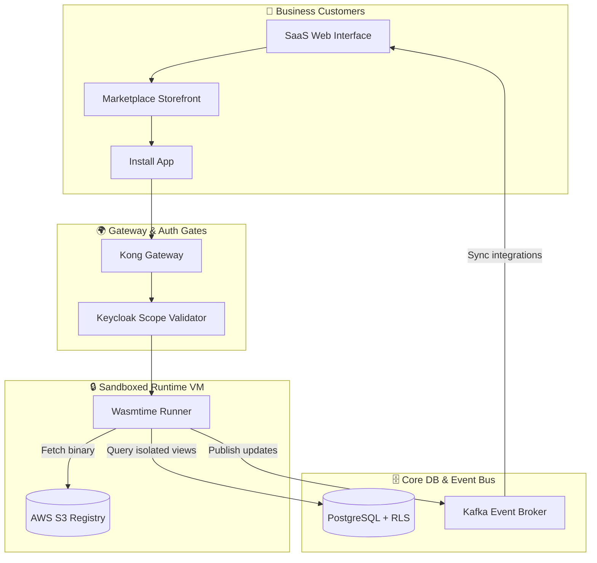
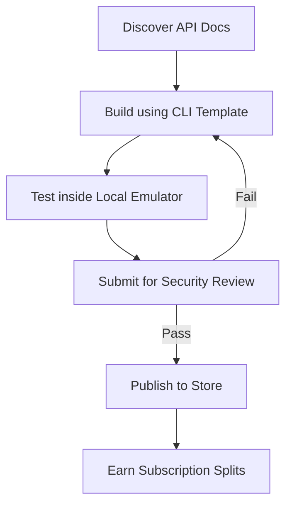
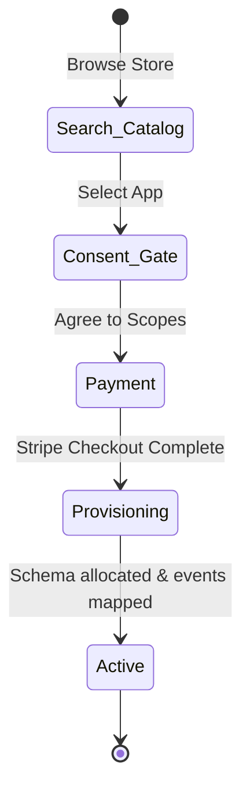
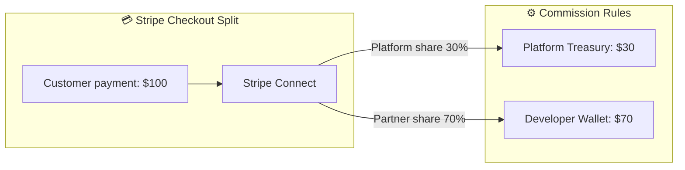
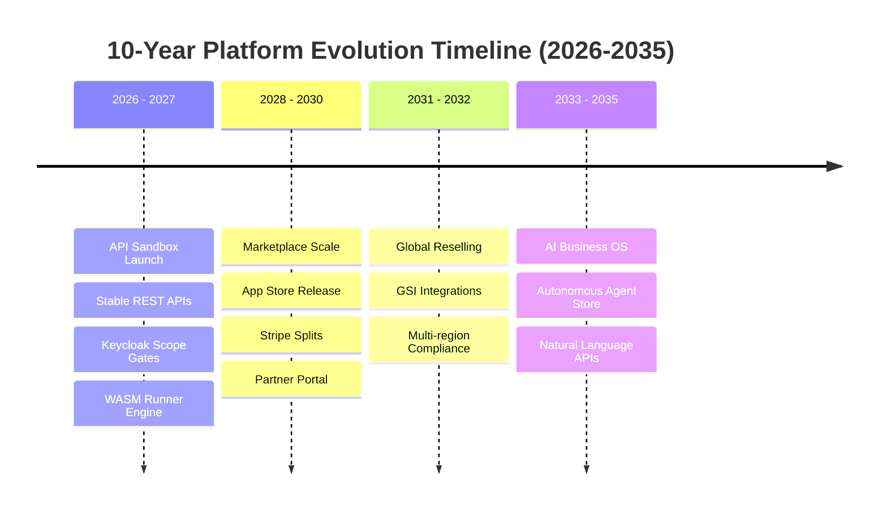

# FINAL DEVELOPER ECOSYSTEM & SAAS PLATFORM BLUEPRINT

**Project Name:** Enterprise SaaS Business Management Platform  
**Document Version:** 1.0.0 — Baseline Standard  
**Date:** July 14, 2026  
**Authors:** Chief Platform Officer (CPO), Chief Technology Officer (CTO), SaaS Ecosystem Architect, Marketplace Strategist, Developer Platform Leader, Enterprise Digital Platform Consultant  
**Classification:** Internal — Confidential  
**Phase:** 21.6 — Final Developer Ecosystem & SaaS Platform Blueprint  

---

## Table of Contents

1. [Executive Summary](#1-executive-summary)
2. [Ecosystem Transformation Journey](#2-ecosystem-transformation-journey)
3. [Complete Ecosystem Architecture](#3-complete-ecosystem-architecture)
4. [Developer Ecosystem Model](#4-developer-ecosystem-model)
5. [API Ecosystem Model](#5-api-ecosystem-model)
6. [Extension Ecosystem & Runtimes](#6-extension-ecosystem--runtimes)
7. [Marketplace Platform Core](#7-marketplace-platform-core)
8. [Partner Ecosystem & Networks](#8-partner-ecosystem--networks)
9. [Revenue Ecosystem & monetization](#9-revenue-ecosystem--monetization)
10. [Ecosystem Governance Rules](#10-ecosystem-governance-rules)
11. [Ecosystem Security Model](#11-ecosystem-security-model)
12. [Platform Analytics & Observability](#12-platform-analytics--observability)
13. [Ecosystem Technology Foundation](#13-ecosystem-technology-foundation)
14. [AI Ecosystem Future](#14-ai-ecosystem-future)
15. [Global Platform Strategy](#15-global-platform-strategy)
16. [Ecosystem Business Model Economy](#16-ecosystem-business-model-economy)
17. [Ecosystem Operating Model & Teams](#17-ecosystem-operating-model--teams)
18. [10-Year Ecosystem Roadmap (2026-2035)](#18-10-year-ecosystem-roadmap-2026-2035)
19. [Ecosystem Success Metrics & KPIs](#19-ecosystem-success-metrics--kpis)
20. [Executive Vision Profiles](#20-executive-vision-profiles)
21. [Final Ecosystem Blueprints (Mermaid)](#21-final-ecosystem-blueprints-mermaid)
22. [Implementation Summary](#22-implementation-summary)

---

## 1. Executive Summary

### 1.1 Document Purpose
This document delivers the **Final Developer Ecosystem & SaaS Platform Blueprint** (Phase 21.6), concluding Phase 21 of the SaaS Business Management Platform. It integrates preceding phases (Developer Portal 21.1, Public APIs 21.2, WASM Plugin Sandboxes 21.3, Marketplace Engines 21.4, and Partner Revenue splits 21.5) into a unified ecosystem. It establishes the organizational rules, execution tech stacks, team operating models, 10-year roadmap, and executive visions required to run a global, multi-tenant digital business platform.

### 1.2 Architectural Foundation
This capstone architecture binds third-party code validation, secure network gateway translation, split financial clearance payouts, and metadata schema extension mappers. The platform provides:
*   A zero-trust execution sandbox based on WebAssembly (Wasmtime) and micro-frontend structures.
*   Robust developer, customer, and partner lifecycle models.
*   Automated certification rules protecting core database security.
*   A scalable distribution model transforming the platform into a business operating system.

---

## 2. Ecosystem Transformation Journey

The platform transitions through five operational stages:

```
STAGE 1: SOFTWARE PRODUCT (Core SaaS)
  • Single application containing dedicated business code.
  • Standard subscription monetization.
  • High internal development dependency.

STAGE 2: SaaS PLATFORM (API Enabled)
  • Microservices architecture with stable public REST APIs.
  • Initial partner integration connections.
  • Improved extensibility.

STAGE 3: DEVELOPER PLATFORM (Portal & SDKs)
  • Self-serve developer registration and portal settings.
  • Multi-language SDK wrappers (JS, Python, Mobile).
  • Pre-seeded database sandboxes.

STAGE 4: MARKETPLACE (Catalog & Subscriptions)
  • Customer-facing store directory with search and checkout.
  • Integrated Stripe billing splits (70/30).
  • Automated sandbox code verification scans.

STAGE 5: GLOBAL ECOSYSTEM (AI Business Operating System)
  • Autonomous agent tooling, workflows, and templates.
  • Global partner networks reselling bulk licenses.
  • Self-healing integrations and federated schema spaces.
```

---

## 3. Complete Ecosystem Architecture

The unified ecosystem connects developers, partners, and customers through secure execution gates, gateways, and data networks.

```
Customers (Tenants) ──► [Marketplace UI & Portal]
                              │
                              ▼
                        [Kong Gateway] ◄── [Keycloak Auth & Scopes]
                              │
                              ▼
                    [Sandbox Wasm Engine]
                              │
                              ▼
            [Ecosystem DB Schemas & Event Bus] ◄── [Partners & Devs]
```

---

## 4. Developer Ecosystem Model

The developer model is built around a five-stage journey to simplify onboarding and accelerate time-to-first-API-call:

*   **Discover:** Accessing open API guides, sandbox resources, SDK links, and developer forums on the portal.
*   **Build:** Cloning boilerplate project structures locally using the platform CLI and writing code in TypeScript, Python, or Rust.
*   **Test:** Running local emulators containing mock customer and financial records to verify scope compliance.
*   **Publish:** Registering the app in the marketplace console and submitting the bundle for automated scanning.
*   **Earn:** Tracking subscription invoices, payout transactions, and customer ratings on the earnings dashboard.

---

## 5. API Ecosystem Model

The API platform categorizes interfaces by target audience and security requirements:

```
                    API PLATFORM CATEGORIZATION
┌────────────────────────────────────────────────────────────────────────┐
│  Category 1: Public REST APIs                                          │
│  • Intended for: Broad developer access and customer integrations.     │
│  • Security: OAuth 2.0 PKCE + Client credentials, standard rate limits.│
├────────────────────────────────────────────────────────────────────────┤
│  Category 2: Partner APIs                                              │
│  • Intended for: Certified technology providers.                        │
│  • Security: Scope authorization, lower latency routing.               │
├────────────────────────────────────────────────────────────────────────┤
│  Category 3: Enterprise APIs                                           │
│  • Intended for: Large-scale custom internal integrations.             │
│  • Security: mTLS certificates, static IP restrictions, dedicated SLAs.│
├────────────────────────────────────────────────────────────────────────┤
│  Category 4: Event-Driven Stream APIs                                  │
│  • Intended for: Real-time, event-based data syncing.                  │
│  • Security: Kafka Avro message streaming, webhook triggers.            │
└────────────────────────────────────────────────────────────────────────┘
```

---

## 6. Extension Ecosystem & Runtimes

Extensions execute inside isolated environments depending on their functional requirements:

1.  **WASM backend runtimes:** Core calculations, tax algorithms, and data parsing execute in Wasmtime VMs.
2.  **UI micro-frontend loaders:** Frontend components render inside Shadow DOM blocks or sandboxed IFrames.
3.  **Workflow automation workers:** Long-running processes route through Temporal.io queues.
4.  **ClickHouse analytical engines:** Custom reporting tasks run on read-only analytical database replicas.

---

## 7. Marketplace Platform Core

The customer-facing marketplace provides five core user experiences:

*   **Discovery Catalog:** Categorized, search-indexed store front featuring reviews, videos, and pricing terms.
*   **Permissions Consent Board:** Standard permission request listing showing the exact security scopes requested.
*   **Monetization Engine:** Handles billing options (free, subscriptions, usage-based) via Stripe Connect.
*   **Installation Provisioner:** Automatically deploys isolated schema views, maps event subscriptions, and provisions keys.
*   **Update Dispatcher:** Deploys semantic version updates (SemVer) with automated 10-minute rollback rules.

---

## 8. Partner Ecosystem & Networks

Ecosystem growth leverages three distinct partner networks:

```
                      PARTNER NETWORK CAPABILITIES
┌───────────────────────────────────────┐
│  Technology Partners (ISVs)           │
│  • Focus: Marketplace apps.           │
│  • Growth: Multi-tenant extensions.   │
├───────────────────────────────────────┤
│  Solution Partners (Consulting)       │
│  • Focus: Customer advisory.          │
│  • Growth: Referral commissions.      │
├───────────────────────────────────────┤
│  Implementation Partners              │
│  • Focus: Integration & migrations.   │
│  • Growth: Professional services.     │
└───────────────────────────────────────┘
```

---

## 9. Revenue Ecosystem & Monetization

Ecosystem monetization drives multiple high-margin revenue streams for the platform:

```
                            REVENUE STREAMS
┌──────────────────────────────┐          ┌──────────────────────────────┐
│ Direct SaaS Subscription     │          │ Marketplace Payout split     │
│ • Core monthly platform fees │          │ • 30% platform commission    │
└──────────────┬───────────────┘          └──────────────┬───────────────┘
               │                                         │
               ├───────────────────┼─────────────────────┘
               │
               ▼
   [Ecosystem Financial Pool] ◄── [Enterprise API Upgrades]
```

### 9.1 Payout Distribution Model
Stripe Connect splits transactions: 70% to the partner's linked account, 30% to the platform treasury vault (retaining transactional fees).

---

## 10. Ecosystem Governance Rules

Quality, stability, and trust are maintained through a strict governance framework:

*   **App Quality Thresholds:** Apps falling below a 3.5-star rating over a 30-day window are flagged for developer remediation or delisted.
*   **Security Scanning Gates:** Automated CI pipelines scan all WASM binaries for unsafe memory layouts or recursive loops.
*   **Ecosystem Policy Enforcement:** Direct payment collection bypassing Stripe Connect to avoid commissions triggers immediate partner termination.

---

## 11. Ecosystem Security Model

A multi-layered defense-in-depth model protects the platform, apps, and customer data:

```
                     SECURITY ARCHITECTURE LAYERS
┌────────────────────────────────────────────────────────────────────────┐
│  Layer 1: Edge Perimeter WAF                                           │
│  • Cloudflare protects against DDoS attacks and inspects HTTP payloads.│
├────────────────────────────────────────────────────────────────────────┤
│  Layer 2: API Gateway Token Validation                                 │
│  • Kong verifies JWT signatures against the Keycloak JWKS endpoint.     │
├────────────────────────────────────────────────────────────────────────┤
│  Layer 3: Sandbox Isolation (WebAssembly)                              │
│  • Wasmtime isolates custom backend execution (capped to 64MB memory).  │
├────────────────────────────────────────────────────────────────────────┤
│  Layer 4: Data Layer Row-Level Security (RLS)                          │
│  • PostgreSQL RLS limits SQL queries to the active tenant ID.          │
└────────────────────────────────────────────────────────────────────────┘
```

---

## 12. Platform Analytics & Observability

Observability tracks performance metrics across the developer ecosystem:

```sql
-- Compile platform usage KPIs
SELECT 
    app_id,
    avg(response_time_ms) as avg_latency,
    countIf(status_code >= 500) / count(*) * 100 as error_rate_percentage
FROM api_access_logs
WHERE timestamp >= now() - INTERVAL 1 HOUR
GROUP BY app_id
HAVING error_rate_percentage > 1.0;
```

*   **SLA Compliance Monitoring:** Real-time alerting systems notify SRE teams if gateway latency or error rates exceed SLA targets.
*   **Developer Dashboard Metrics:** Provides partners with conversion statistics, monthly recurring revenue, and churn logs.

---

## 13. AI Ecosystem Future

The ecosystem architecture supports future autonomous business applications:

*   **AI Agent Marketplace:** A dedicated store for AI agents designed to handle specific business workflows.
*   **AI Workflow Blueprints:** Instantly deployable Temporal.io automation templates (e.g., auto-matching purchase orders).
*   **Natural Language API Connectors:** AI agents dynamically locate, connect, and configure endpoints using OpenAPI metadata description schemas.

---

## 14. Global Platform Strategy

Market expansion scales from regional deployment to a global SaaS network:

```
  LOCAL MARKET               REGIONAL STEPS              GLOBAL ECOSYSTEM
┌──────────────┐        ┌──────────────┐          ┌──────────────┐
│  Single region│ ───►   │ Multi-region │ ───►     │ GSI networks │
│  onboarding  │        │ localization │          │ and global   │
│  validation  │        │ & compliance │          │ marketplace  │
└──────────────┘        └──────────────┘          └──────────────┘
```

---

## 15. Ecosystem Business Model Economy

The platform creates value across the entire ecosystem:

```
                            PLATFORM VALUE POOL
┌────────────────────────────────────────────────────────────────────────┐
│  For Customers:                                                        │
│  • Access to a diverse library of verified business applications.       │
├────────────────────────────────────────────────────────────────────────┤
│  For Developers:                                                       │
│  • Access to global customer networks with built-in monetization.      │
├────────────────────────────────────────────────────────────────────────┤
│  For Partners:                                                         │
│  • Recurring reseller commissions and professional service revenue.     │
├────────────────────────────────────────────────────────────────────────┤
│  For the Platform Company:                                             │
│  • Diversified transactional revenues and higher customer retention.    │
└────────────────────────────────────────────────────────────────────────┘
```

---

## 16. Ecosystem Operating Model & Teams

Operating and scaling the ecosystem requires dedicated, specialized functional units:

*   **Platform Engineering Team:** Manages internal runtime environments, WASM compilers, and SDK components.
*   **Developer Relations (DevRel):** Creates documentation, manages developer forums, and runs training workshops.
*   **Marketplace Operations:** Oversees application reviews, verification checks, and catalog curation.
*   **Partner Success Team:** Manages GSI partnerships, co-selling programs, and reseller tiers.
*   **Ecosystem Security:** Monitors threat events, audits code safety, and manages the bug bounty program.

---

## 17. 10-Year Ecosystem Roadmap (2026-2035)

The evolution of the developer platform follows a 10-year execution roadmap:

*   **Years 1-2 (2026-2027): API & Core Sandbox Platform**  
    Establish public APIs, Keycloak authorization scopes, and the WASM sandbox environment.
*   **Years 3-5 (2028-2030): Marketplace Scale & Partner Network**  
    Launch the public marketplace and build out global solution partner and reseller networks.
*   **Years 5-7 (2031-2032): GSI Reselling & Regional Localization**  
    Onboard Global System Integrators (GSIs) and deploy region-specific compliance blueprints.
*   **Years 8-10 (2033-2035): Autonomous AI Business OS**  
    Transition the platform into an autonomous business operating system utilizing federated AI agent tools.

---

## 18. Ecosystem Success Metrics & KPIs

| Metric Category | KPI | Target (Year 3) | Target (Year 5) |
| :--- | :--- | :--- | :--- |
| **Developer Ecosystem** | Registered Developer Accounts | 2,500 | 10,000 |
| **Ecosystem Size** | Verified Marketplace Apps | 250 | 1,000 |
| **Ecosystem Value** | API Transactions per Day | 15 Million | 100 Million |
| **Marketplace Sales** | Monthly Recurring Revenue (MRR) | $1.2 Million | $8 Million |
| **Partner Engagement** | Certified Engineers | 500 | 2,000 |

---

## 19. Executive Vision Profiles

### 19.1 Chief Executive Officer (CEO)
The Developer Ecosystem transitions the platform from a linear subscription business to a compound network ecosystem. By allowing partners to build custom features, we reduce direct development costs while sharing in their transaction fee revenue. This model positions the platform to lead market share and improve customer retention.

### 19.2 Chief Technology Officer (CTO)
This blueprint delivers a secure, scalable, and decentralized architecture. By isolating external code inside WASM virtual runtimes and micro-frontends, we protect our core databases. Decoupling our core release cycles from third-party developers allows us to scale development without code bloat.

### 19.3 Investors
The platform ecosystem model creates a high-margin, scalable business. Every partner application added to our store lowers customer acquisition costs (CAC) and increases lifetime value (LTV). This network effect generates a self-sustaining competitive moat that drives long-term revenue growth.

### 19.4 Enterprise Customers
For our enterprise customers, this architecture provides unmatched operational flexibility. You can deploy private, custom integrations tailored to your business needs in days, without modifying the core platform. All applications undergo security screening, ensuring your data remains isolated, secure, and compliant.

---

## 20. Final Ecosystem Blueprints (Mermaid)

### 20.1 Complete SaaS Ecosystem Architecture



### 20.2 Developer Economy Model



### 20.3 Marketplace Ecosystem



### 20.4 Partner Revenue Flow



### 20.5 10-Year Platform Vision



---

## 21. Implementation Summary

### 21.1 Core Platform Progress Dashboard

| Component | Architecture Document | Status |
| :--- | :--- | :--- |
| **Phase 21.1** | Developer Platform Foundation | ✅ Complete |
| **21.2** | Public API & Integration Platform | ✅ Complete |
| **21.3** | Plugin / Extension Architecture | ✅ Complete |
| **21.4** | SaaS Marketplace Architecture | ✅ Complete |
| **21.5** | Partner Ecosystem & Revenue Sharing Model | ✅ Complete |
| **21.6** | Final Developer Ecosystem & SaaS Platform Blueprint | ✅ Complete (this document) |

---

## Document Control

| Field | Value |
|---|---|
| **Document ID** | SBMP-ECO-21.6-FINAL-BLUEPRINT |
| **Version** | 1.0.0 |
| **Status** | APPROVED — Baseline |
| **Owner** | Chief Platform Officer |
| **Reviewed By** | CEO, CTO, Board of Directors |
| **Review Cycle** | Annual |
| **Next Review** | July 2027 |

---

*Phase 21.6 — Final Developer Ecosystem & SaaS Platform Blueprint | SaaS Business Management Platform*  
*Enterprise Confidential — © 2026 All Rights Reserved*
