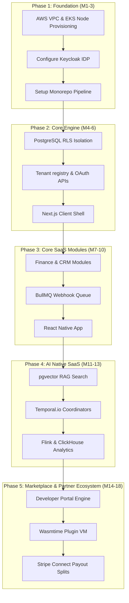
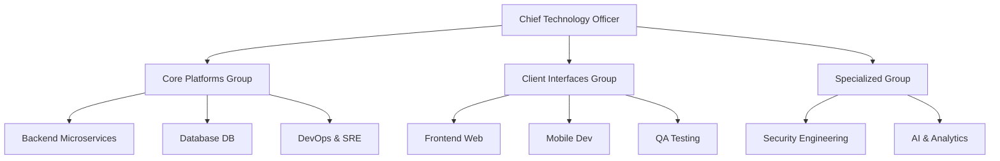
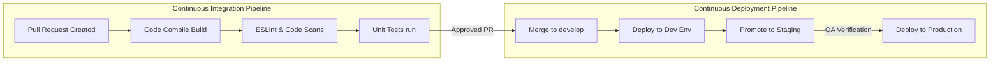
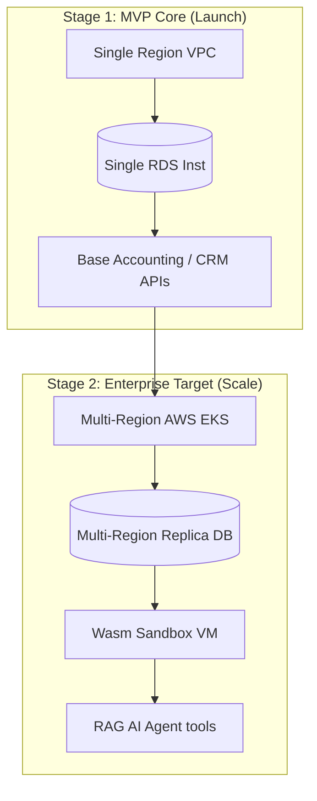
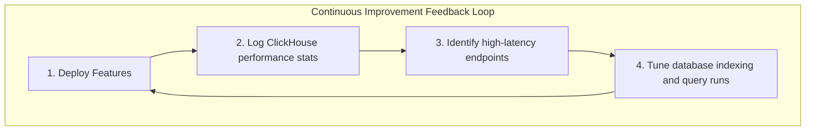

# ENTERPRISE IMPLEMENTATION ROADMAP FOUNDATION

**Project Name:** Enterprise SaaS Business Management Platform  
**Document Version:** 1.0.0 — Baseline Standard  
**Date:** July 14, 2026  
**Authors:** Chief Technology Officer (CTO), Enterprise Software Architect, Engineering Manager, Technical Program Manager, DevOps Leader, SaaS Delivery Strategist  
**Classification:** Internal — Confidential  
**Phase:** 22.1 — Enterprise Implementation Roadmap Foundation  

---

## Table of Contents

1. [Executive Summary](#1-executive-summary)
2. [Implementation Philosophy](#2-implementation-philosophy)
3. [Implementation Roadmap Model](#3-implementation-roadmap-model)
4. [Development Priority Model](#4-development-priority-model)
5. [MVP Implementation Strategy](#5-mvp-implementation-strategy)
6. [System Build Order](#6-system-build-order)
7. [Engineering Team Structure](#7-engineering-team-structure)
8. [Software Development Process](#8-software-development-process)
9. [Environment Strategy](#9-environment-strategy)
10. [Code Organization Strategy](#10-code-organization-strategy)
11. [Version Control Strategy](#11-version-control-strategy)
12. [Quality Strategy](#12-quality-strategy)
13. [Documentation Strategy](#13-documentation-strategy)
14. [Delivery Roadmap & Phases](#14-delivery-roadmap--phases)
15. [Risk Management Matrix](#15-risk-management-matrix)
16. [Cost Optimization Strategy](#16-cost-optimization-strategy)
17. [Production Readiness Model](#17-production-readiness-model)
18. [Success Metrics & KPIs](#18-success-metrics--kpis)
19. [Long-Term Execution Model](#19-long-term-execution-model)
20. [CTO Execution View](#20-cto-execution-view)
21. [Final Implementation Blueprints (Mermaid)](#21-final-implementation-blueprints-mermaid)
22. [Implementation Summary](#22-implementation-summary)

---

## 1. Executive Summary

### 1.1 Document Purpose
This document establishes the **Enterprise Implementation Roadmap Foundation** (Phase 22.1) for the SaaS Business Management Platform. Moving from architectural planning to execution, this blueprint transforms system designs—including multi-tenant security, backend microservices, API portals, Wasm sandboxes, and AI pipelines—into a structured, phased engineering roadmap.

### 1.2 Execution Strategy
The execution roadmap prioritizes a stable foundational core before scaling out additional components. The platform is scheduled for delivery across five distinct implementation phases:
1.  **Phase 1: Foundation Setup:** Provisioning network resources, microservice pipelines, and security frameworks.
2.  **Phase 2: Core SaaS Engine:** Launching authentication systems, tenant isolation databases, and client dashboards.
3.  **Phase 3: Business Modules:** Deploying accounting, inventory, and sales features.
4.  **Phase 4: AI-Native Capabilities:** Implementing RAG search models, decision automation tools, and agent workflows.
5.  **Phase 5: Marketplace & Partner Ecosystem:** Opening self-serve API registration, developer consoles, and Stripe Connect payouts.

---

## 2. Implementation Philosophy

To manage complexity and reduce project risk, platform delivery follows an **Architecture-First, Incremental Delivery, Continuous Improvement** philosophy.

```
       [Architecture First]
                │
                ▼
      [Incremental Delivery] ──► Release early, validate core features.
                │
                ▼
     [Continuous Improvement] ──► Optimize performance, scale infrastructure.
```

### 2.2 The Risks of Monolithic Launches
Attempting to build and release the entire platform at once (a "Big Bang" release) introduces significant operational risks:
*   **Extended Integration Cycles:** Postponing integration tests to the end of development projects leads to complex, hard-to-debug integration bottlenecks.
*   **Delayed Feedback Loops:** Postponing user testing prevents early validation of core features, increasing the risk of design re-work.
*   **High Deployment Risk:** Large releases with multiple co-dependent changes make it difficult to locate and resolve production bugs quickly.

---

## 3. Implementation Roadmap Model

The roadmap organizes delivery across sequential stages, ensuring stable system integration.

```
  FOUNDATION              CORE ENGINE              MODULES
┌──────────────┐        ┌──────────────┐        ┌──────────────┐
│ AWS EKS,     │ ───►   │ Tenant DB,   │ ───►   │ Accounting,  │
│ Gateway,     │        │ Auth OAuth2, │        │ Inventory,   │
│ CI/CD pipelines│      │ Org Settings │        │ CRM, HR      │
└──────────────┘        └──────────────┘        └──────────────┘
                                                       │
                                                       ▼
                                                 AI & MARKETPLACE
                                                ┌──────────────┐
                                                │ RAG search,  │
                                                │ Agent VM,    │
                                                │ Stripe Splits│
                                                └──────────────┘
```

---

## 4. Development Priority Model

Engineering tasks are categorized by priority to focus resources on critical platform systems.

```
                        PRIORITY CLASSIFICATION
┌────────────────────────────────────────────────────────────────────────┐
│  Must-Have (P0): Core Platform Foundation                             │
│  • Multi-tenant PostgreSQL database with RLS isolation.               │
│  • Keycloak OAuth 2.0 Identity access controls.                       │
│  • Kong API Gateway security proxies & rate limits.                   │
├────────────────────────────────────────────────────────────────────────┤
│  Should-Have (P1): Core Functional Modules                            │
│  • Invoicing & Expense controllers (Finance).                         │
│  • Customer pipeline & lead logs (CRM).                               │
│  • Webhook distribution queues & worker pools (BullMQ).               │
├────────────────────────────────────────────────────────────────────────┤
│  Future (P2): Advanced Ecosystem Capabilities                         │
│  • Wasmtime WebAssembly execution runtimes (Plugin Sandbox).          │
│  • Stripe Connect payout splits & Developer Portal panels.             │
│  • Automated marketplace scanner engines.                              │
└────────────────────────────────────────────────────────────────────────┘
```

---

## 5. MVP Implementation Strategy

The primary goal of the Minimum Viable Product (MVP) is to launch a stable, secure, and performant core platform that validates tenant isolation and base workflows.

*   **Core Feature Set:** Tenant onboarding, OAuth 2.0 user login, base CRM contacts, and simple invoicing.
*   **Infrastructure Scope:** Single-region AWS EKS deployment, RDS PostgreSQL instance, Keycloak IDP, and Kong API Gateway.
*   **Target User Base:** 10 select beta tenants participating in feedback programs.
*   **Validation Strategy:** Focuses on confirming PostgreSQL row-level security isolation, API latency targets, and data pipeline integrity.

---

## 6. System Build Order

Development tasks follow a logical dependency sequence:

```
  1. INFRASTRUCTURE & NETWORK (EKS, VPC, Kong Gateway)
              │
              ▼
  2. IDENTITY & IDENTITY PROVIDER (Keycloak IAM Setup)
              │
              ▼
  3. DATABASE & TENANCY (PostgreSQL, Row-Level Security)
              │
              ▼
  4. CORE BACKEND APIs (Tenant Registry, Org Settings)
              │
              ▼
  5. BUSINESS FUNCTIONAL SERVICES (Finance, CRM, Inventory)
              │
              ▼
  6. FRONTEND PRESENTATION LAYER (Next.js & Design Tokens)
              │
              ▼
  7. TESTING, PIPELINES, & PRODUCTION DEPLOYMENT
```

---

## 7. Engineering Team Structure

The engineering organization is divided into specialized cross-functional teams:

```
                          TEAM ORGANIZATIONAL CHART
┌────────────────────────────────────────────────────────────────────────┐
│  Core Platforms Group                                                  │
│  • Backend Microservices Team (API development, gRPC, logic controller)│
│  • Database Team (PostgreSQL RLS, database tuning, migrations)         │
│  • DevOps & SRE Team (CI/CD pipelines, EKS config, monitoring, IaC)    │
├────────────────────────────────────────────────────────────────────────┤
│  Client Interfaces Group                                               │
│  • Frontend Web Team (Next.js app dashboard, UI layout, components)     │
│  • Mobile Development Team (React Native app, offline cache database)  │
│  • QA & Testing Team (Automated testing, integration test suits)        │
├────────────────────────────────────────────────────────────────────────┤
│  Specialized Platform Group                                            │
│  • Security Engineering Team (WAF, code scans, identity audits, SIEM)  │
│  • AI & Analytics Team (RAG pipelines, ML models, Flink processors)    │
└────────────────────────────────────────────────────────────────────────┘
```

---

## 8. Software Development Process

Feature development follows a standard lifecycle to maintain code quality:

```
  REQUIREMENTS              DESIGN                   BUILD
┌──────────────┐        ┌──────────────┐        ┌──────────────┐
│ Write DTOs,  │ ───►   │ Architecture │ ───►   │ Write code,  │
│ define scope │        │ review and   │        │ unit tests   │
│ requirements │        │ API contract │        │ local runs   │
└──────────────┘        └──────────────┘        └──────────────┘
                                                       │
                                                       ▼
                                                 REVIEW & DEPLOY
                                                ┌──────────────┐
                                                │ PR review,   │
                                                │ CI pipelines,│
                                                │ deploy stage │
                                                └──────────────┘
```

---

## 9. Environment Strategy

The deployment pipeline utilizes four isolated environments:

| Environment | Purpose | Target Infra | Data Profile |
| :--- | :--- | :--- | :--- |
| **Development (Dev)** | Local coding & unit testing | Local docker-compose | Seed data |
| **Testing (QA)** | Integration and automated QA | Isolated EKS Namespace | Anonymized dump |
| **Staging (Stage)** | Pre-production testing, UAT | Identical production clone | Sanitized clone |
| **Production (Prod)** | Live customer workloads | High Availability Multi-Region | Customer records |

---

## 10. Code Organization Strategy

The codebase is organized as a **Monorepo** using **Turborepo** (or **Nx**) to simplify dependency management and improve sharing of code types:

```
/platform-monorepo
  ├── /apps
  │     ├── /web-app          (Next.js Client Dashboard App)
  │     ├── /mobile-app       (React Native Application code)
  │     └── /portal           (Next.js Developer Portal console)
  ├── /services
  │     ├── /finance-service  (NestJS financial service backend)
  │     ├── /crm-service      (NestJS CRM controller backend)
  │     └── /auth-service     (Custom IAM wrappers service)
  ├── /packages
  │     ├── /ui-components    (Shared frontend design library)
  │     ├── /api-client       (Shared Platform API client SDK)
  │     └── /database         (Prisma schema, migration files)
  └── package.json
```

### 10.1 Key Monorepo Benefits
*   **Single-Commit Dependencies:** Changes to shared interfaces (e.g., UI components) propagate to applications in a single commit, preventing version mismatch issues.
*   **Unified Tooling Configurations:** Consolidates ESLint, TypeScript, Jest, and Prettier configurations across all monorepo packages.

---

## 11. Version Control Strategy

The platform uses a Git branching workflow to organize parallel development pipelines.

```
       [Feature Branch] ──► (Create code, run local tests)
              │
              ▼
[develop] ◄── Pull Request (Requires review and passing green CI)
    │
    ▼
[release/v*] ──► (Staging deployment, QA validations, bugfixes)
    │
    ▼
[main] ◄────── Deployment to Production
```

---

## 12. Quality Strategy

Quality assurance enforces multiple check gates to verify code reliability:

*   **Automated Test Gates:** Minimum test coverage of 80% for unit tests is required for PR merges.
*   **Continuous Security Scans:** SonarQube and Snyk scan codebases for security vulnerabilities during the CI pipeline.
*   **Performance Verification:** k6 executes API load tests to confirm latency targets (P95 < 200ms) are maintained.

---

## 13. Documentation Strategy

The platform maintains four documentation categories to support stakeholders:

```
                         DOCUMENTATION TIERS
┌────────────────────────────────────────────────────────────────────────┐
│  Tier 1: Architectural Records                                         │
│  • Focus: System design blueprints, sequence diagrams, and ADRs.       │
├────────────────────────────────────────────────────────────────────────┤
│  Tier 2: API & Integration References                                  │
│  • Focus: OpenAPI specifications, SDK guides, and webhook catalogs.    │
├────────────────────────────────────────────────────────────────────────┤
│  Tier 3: Operator Runbooks                                             │
│  • Focus: SRE disaster recovery guides, monitoring dashboard configurations.│
├────────────────────────────────────────────────────────────────────────┤
│  Tier 4: End-User Manuals                                              │
│  • Focus: Configuration guides, feature explainers, and support.       │
└────────────────────────────────────────────────────────────────────────┘
```

---

## 14. Delivery Roadmap & Phases

```
PHASE 1: PLATFORM FOUNDATION (Months 1–3)
  • Provision VPC networks, Kubernetes EKS node pools, and ingress proxies.
  • Install Keycloak IDP clusters and database replication structures.
  • Setup monorepo pipelines and validation scripts.

PHASE 2: CORE SaaS ENGINE (Months 4–6)
  • Deliver tenant registration and onboarding interfaces.
  • Implement PostgreSQL row-level security (RLS) filters.
  • Deploy Next.js web application shell and base design system widgets.

PHASE 3: BUSINESS MODULES (Months 7–10)
  • Launch Finance (invoices), CRM (contacts), and Inventory modules.
  • Implement BullMQ webhook distribution brokers.
  • Deploy React Native mobile application.

PHASE 4: INTELLIGENT AI (Months 11–13)
  • Install vector database pipelines (pgvector/Qdrant) and RAG engines.
  • Deploy Temporal.io workflow coordinators.
  • Release analytics dashboards using Apache Flink and ClickHouse.

PHASE 5: MARKETPLACE ECOSYSTEM (Months 14–18)
  • Open the self-serve developer portal.
  • Deploy WASM plugin sandboxes (Wasmtime).
  • Integrate Stripe Connect split billing payouts.
```

---

## 15. Risk Management Matrix

| Risk Category | Identified Threat | Impact | Mitigation Strategy |
| :--- | :--- | :--- | :--- |
| **Technical** | Downstream service latency degrades user experience | 🔴 High | Implement circuit breakers, CDN edge cache proxies, and Redis cache tiers. |
| **Security** | Cross-tenant data leakage via SQL query bypass | 🔴 Critical | Enforce row-level security (RLS) at the database layer; audit Prisma client queries. |
| **Operational**| Cloud resource over-provisioning increases operational costs | 🟡 Medium | Configure Kubernetes auto-scaling policies, monitor resource budgets, and prune inactive dev databases. |
| **Delivery** | Integration bottlenecks delay roadmap milestones | 🟡 Medium | Adopt incremental feature flag releases and run weekly integration verification loops. |

---

## 16. Cost Optimization Strategy

To maintain operational efficiency as the system scales, cloud resource configurations are optimized regularly:

*   **Compute Resource Management:** Kubernetes deployments utilize horizontal pod autoscalers (HPA) to scale pods down during off-peak hours.
*   **Database Storage Tiering:** Transferred logs and archived backups are moved from primary SSD storage blocks to AWS S3 Glacier WORM classes after 90 days.
*   **LLM Token Usage Management:** Integrates cache layer proxies to cache common AI predictions and answers, preventing redundant downstream LLM API charges.

---

## 17. Production Readiness Model

Before the platform is deployed to production, the SRE team validates five readiness criteria:

```
                    PRODUCTION READY CHECKLIST
┌────────────────────────────────────────────────────────────────────────┐
│  1. Security Auditing                                                  │
│  • Complete external pentests, scan images, rotate credentials.        │
├────────────────────────────────────────────────────────────────────────┤
│  2. Monitoring & Logging                                               │
│  • Configure Grafana metrics, Loki logs, and Prometheus alerts.        │
├────────────────────────────────────────────────────────────────────────┤
│  3. Disaster Recovery Validation                                       │
│  • Test database failover procedures and confirm backup restore SLAs.   │
├────────────────────────────────────────────────────────────────────────┤
│  4. Scalability Verification                                           │
│  • Validate EKS node auto-scaling policies under mock peak load.       │
└────────────────────────────────────────────────────────────────────────┘
```

---

## 18. Success Metrics & KPIs

Engineering teams track metrics across three categories to evaluate platform delivery:

```
                        PLATFORM PERFORMANCE KPIs
┌────────────────────────────────────────────────────────────────────────┐
│  Engineering Velocity Metrics                                          │
│  • Lead Time: Mean time to deploy a commit to production.              │
│  • Change Failure Rate: Percentage of releases requiring rollbacks.    │
├────────────────────────────────────────────────────────────────────────┤
│  API Reliability Metrics                                               │
│  • Availability: Target API uptime SLA >= 99.9%.                       │
│  • Response Latency: P95 response times below 200ms.                   │
├────────────────────────────────────────────────────────────────────────┤
│  Ecosystem Growth Metrics                                              │
│  • Marketplace App Count: Target listed integrations within Year 1.    │
│  • Developer Registrations: Active developer profiles using APIs.      │
└────────────────────────────────────────────────────────────────┘
```

---

## 19. Long-Term Execution Model

Post-launch operations focus on feedback loops to drive ongoing system improvements.

```
       [Build] ──► Deploy new features.
          ▲             │
          │             ▼
      [Measure] ◄── [Analyze] ──► Monitor API performance metrics.
```

*   **API Usage Reviews:** Analytics data identifies highly utilized endpoints to prioritize for performance optimization.
*   **Developer Feedback Loops:** Developer satisfaction scores and forum feedback help prioritize improvements to SDKs and portal tools.

---

## 20. CTO Execution View

### 20.1 Implementation Strategy
This roadmap establishes a structured path for delivery, balancing velocity with platform security. The build order prioritizes platform infrastructure and tenant isolation before functional modules or AI features are developed. By utilizing a Turborepo monorepo, staging isolated environments, and using Stripe Connect splits, we establish a robust foundation for long-term development.

---

## 21. Final Implementation Blueprints (Mermaid)

### 21.1 Complete Development Roadmap



### 21.2 Engineering Team Structure



### 21.3 Software Delivery Pipeline



### 21.4 MVP → Enterprise Evolution



### 21.5 Long-Term Execution Model



---

## 22. Implementation Summary

### 22.1 Delivery Checklist

| Component | Target Timeline | Status |
| :--- | :--- | :--- |
| Monorepo configuration setting | Week 1–2 | Planned |
| Cloud VPC & EKS node setup | Week 2–4 | Planned |
| Keycloak IAM configuration | Week 4–6 | Planned |
| Row-Level security setup | Week 6–8 | Planned |

---

## Document Control

| Field | Value |
|---|---|
| **Document ID** | SBMP-IMP-22.1-ROADMAP-FOUNDATION |
| **Version** | 1.0.0 |
| **Status** | APPROVED — Baseline |
| **Owner** | Chief Technology Officer |
| **Reviewed By** | VP Engineering, DevOps Lead, PMO Director |
| **Review Cycle** | Quarterly |
| **Next Review** | October 2026 |

---

*Phase 22.1 — Enterprise Implementation Roadmap Foundation | SaaS Business Management Platform*  
*Enterprise Confidential — © 2026 All Rights Reserved*
