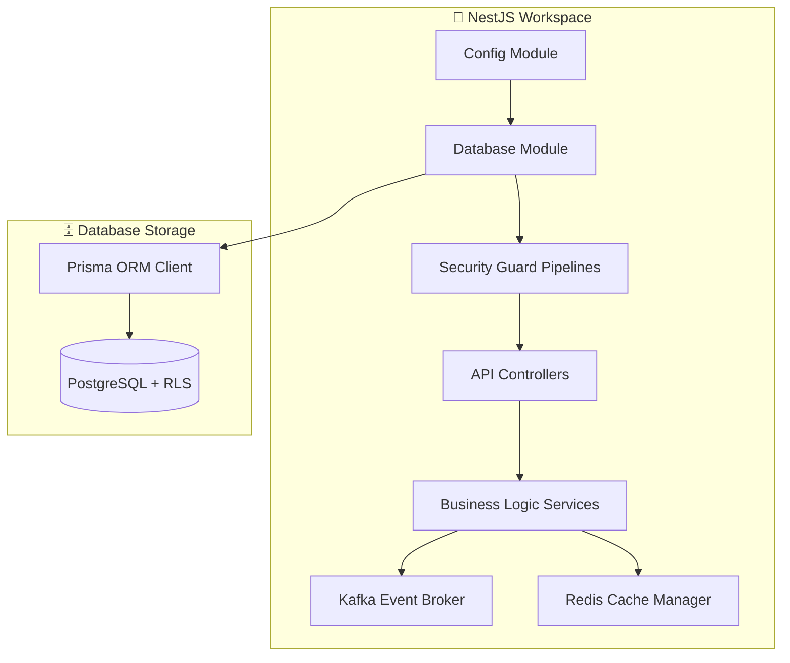
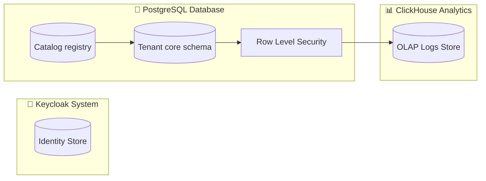
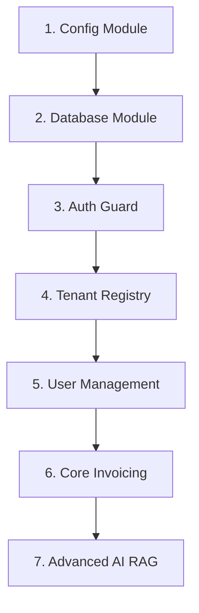
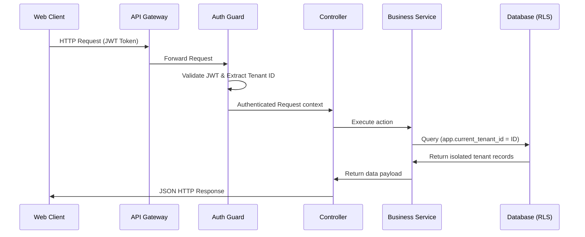
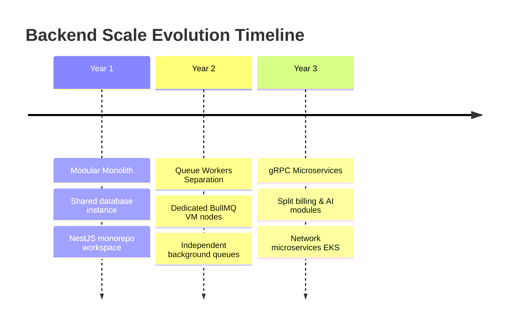

# DATABASE & BACKEND IMPLEMENTATION STRATEGY

**Project Name:** Enterprise SaaS Business Management Platform  
**Document Version:** 1.0.0 — Baseline Standard  
**Date:** July 14, 2026  
**Authors:** Principal Backend Architect, Database Architect, Enterprise Software Engineer, NestJS Architect, PostgreSQL Expert, API Architect, Engineering Lead  
**Classification:** Internal — Confidential  
**Phase:** 22.2 — Database & Backend Implementation Strategy  

---

## Table of Contents

1. [Executive Summary](#1-executive-summary)
2. [Backend Implementation Philosophy](#2-backend-implementation-philosophy)
3. [Backend Modular Monorepo Architecture](#3-backend-modular-monorepo-architecture)
4. [Database Implementation Strategy](#4-database-implementation-strategy)
5. [Database Development Order](#5-database-development-order)
6. [Core Database Schema Models](#6-core-database-schema-models)
7. [Multi-Tenant Database Isolation Model](#7-multi-tenant-database-isolation-model)
8. [Backend Module Implementation Order](#8-backend-module-implementation-order)
9. [API Implementation Strategy](#9-api-implementation-strategy)
10. [Authentication Implementation](#10-authentication-implementation)
11. [Authorization System](#11-authorization-system)
12. [Event-Driven Backend Engine](#12-event-driven-backend-engine)
13. [Distributed Caching Strategy](#13-distributed-caching-strategy)
14. [Background Job Queue System](#14-background-job-queue-system)
15. [Backend Security Controls](#15-backend-security-controls)
16. [Testing Strategy](#16-testing-strategy)
17. [Backend Development Workflow](#17-backend-development-workflow)
18. [Backend Team Structure](#18-backend-team-structure)
19. [Production Backend Readiness Checklist](#19-production-backend-readiness-checklist)
20. [Backend Evolution Roadmap](#20-backend-evolution-roadmap)
21. [Final Backend Blueprints (Mermaid)](#21-final-backend-blueprints-mermaid)
22. [Implementation Summary](#22-implementation-summary)

---

## 1. Executive Summary

### 1.1 Document Purpose
This document delivers the **Database & Backend Implementation Strategy** (Phase 22.2). It defines the backend and database architecture, technology selections, build orders, and security strategies for the core backend. It provides code examples, schema definitions, and implementation guidelines for NestJS microservices and the PostgreSQL multi-tenant database.

### 1.2 Tech Stack Selection
*   **Application Framework:** NestJS / Node.js (TypeScript) — leveraging dependency injection, modular organization, and built-in guard pipelines.
*   **Database Engine:** PostgreSQL — providing robust transaction support, JSONB document storage, and row-level security (RLS) policies.
*   **Data Access Layer:** Prisma ORM — generating TypeScript types directly from schemas and simplifying database migrations.
*   **In-Memory Store:** Redis — handles distributed caching, user sessions, and rate-limiting counters.
*   **Queue Engine:** BullMQ (Redis-backed) — manages background jobs and task distribution.

---

## 2. Backend Implementation Philosophy

Backend development prioritizes stability, security, and extensibility. The system build order establishes foundational layers before implementing customer-facing modules or AI-native tools:

```
  1. FOUNDATION MODULES (Config, Database Connection, Error Logging)
              │
              ▼
  2. SECURITY & IDENTITY (Keycloak integration, JWT Validation, RLS Guard)
              │
              ▼
  3. TENANT MANAGEMENT (Tenant Provisioning, Billing Subscription setup)
              │
              ▼
  4. CORE BUSINESS SERVICES (Invoices, CRM contacts, Inventory tracking)
              │
              ▼
  5. ADVANCED INTEGRATION (AI Agent RAG connectors, Marketplace Wasm runtime)
```

---

## 3. Backend Modular Monorepo Architecture

The backend codebase is organized as a modular structure inside a single NestJS monorepo, keeping dependencies clear and encouraging reuse:

```
/src
  ├── /modules
  │     ├── /auth         (Keycloak JWT Strategy, token validation)
  │     ├── /tenant       (Tenant registration and provisioning controller)
  │     ├── /user         (User profiles, team memberships, role bindings)
  │     ├── /finance      (Invoices, expenses, payment transactions)
  │     └── /crm          (Contacts, accounts, sales opportunities)
  ├── /common
  │     ├── /interceptors (Logging interceptor, response wrapper)
  │     ├── /filters      (Global exception filter, error-code mappers)
  │     └── /decorators   (User context decorators, RLS bypass decorator)
  ├── /config
  │     └── configuration.ts (Env variables mapping, validation schemas)
  ├── /database
  │     ├── schema.prisma (Prisma models of databases)
  │     └── prisma.service.ts (Database connection and pool wrapper)
  ├── /security
  │     ├── rls.guard.ts  (DB Tenancy check middleware)
  │     └── roles.guard.ts (RBAC scopes checker)
  ├── /events
  │     └── kafka.service.ts (Producer/Consumer wrappers for event streaming)
  └── /integration
        └── xero.adapter.ts (Accounting adapter implementation integrations)
```

---

## 4. Database Implementation Strategy

The database uses a layered model to separate operational customer records from analytical logs, AI vector indexes, and system logs:

```
┌────────────────────────────────────────────────────────────────────────┐
│  Layer 1: Identity & Access Control (Keycloak DB)                      │
│  • Manages credentials, MFA configurations, and JWT validation keys.   │
├────────────────────────────────────────────────────────────────────────┤
│  Layer 2: Tenant Registry (Shared Catalog Database)                    │
│  • Stores tenant accounts, billing plans, and data routing metadata.   │
├────────────────────────────────────────────────────────────────────────┤
│  Layer 3: Core Business & Financial Ledger (RLS PostgreSQL)            │
│  • Holds invoices, customer records, CRM contacts, and audits.         │
├────────────────────────────────────────────────────────────────────────┤
│  Layer 4: AI & Vector Embeddings Index (pgvector Extension)             │
│  • Stores document chunks and high-dimensional semantic search vectors. │
├────────────────────────────────────────────────────────────────────────┤
│  Layer 5: Analytics Warehouse (ClickHouse Cluster)                     │
│  • Aggregates API access logs and long-term financial reports.         │
└────────────────────────────────────────────────────────────────────────┘
```

---

## 5. Database Development Order

Database development tasks are organized in a sequential order to establish core entities and isolation rules before implementing downstream services:

*   **Phase 1: Shared Catalog Database (Catalog / Tenant Registry):** Setup the database registry to manage tenant accounts, subscriptions, and connection strings.
*   **Phase 2: Tenant Core Schema & Isolation:** Configure row-level security (RLS) rules and tenant ID requirements.
*   **Phase 3: User Registry & RBAC:** Deploy roles, permissions, user profiles, and organization tables.
*   **Phase 4: Functional Business Databases:** Add product logs, CRM contacts, inventory records, and core ledgers.
*   **Phase 5: Financial Transactions & Audits:** Deploy invoice tables, payment transactions, and immutable audit logs.
*   **Phase 6: Analytical Log Tables:** Configure ClickHouse logging tables and Kafka CDC streaming processes.

---

## 6. Core Database Schema Models

The Prisma data schema defines core entities, multi-tenant fields, and relational mappings:

```prisma
datasource db {
  provider = "postgresql"
  url      = env("DATABASE_URL")
}

generator client {
  provider = "prisma-client-js"
}

model Tenant {
  id            String         @id @default(uuid())
  name          String
  slug          String         @unique
  status        TenantStatus   @default(ACTIVE)
  createdAt     DateTime       @default(now())
  updatedAt     DateTime       @updatedAt
  subscriptions Subscription[]
  users         User[]
  invoices      Invoice[]
  auditLogs     AuditLog[]
}

enum TenantStatus {
  ACTIVE
  SUSPENDED
  TERMINATED
}

model User {
  id        String     @id @default(uuid())
  tenantId  String
  email     String     @unique
  firstName String
  lastName  String
  roleId    String
  createdAt DateTime   @default(now())
  tenant    Tenant     @relation(fields: [tenantId], references: [id], onDelete: Cascade)
  role      Role       @relation(fields: [roleId], references: [id])
  auditLogs AuditLog[]
}

model Role {
  id          String       @id @default(uuid())
  name        String       @unique
  permissions Permission[]
  users       User[]
}

model Permission {
  id    String @id @default(uuid())
  scope String @unique
  roles Role[]
}

model Subscription {
  id        String             @id @default(uuid())
  tenantId  String
  tier      SubscriptionTier   @default(FREE)
  expiresAt DateTime
  tenant    Tenant             @relation(fields: [tenantId], references: [id])
}

enum SubscriptionTier {
  FREE
  STANDARD
  ENTERPRISE
}

model Invoice {
  id          String        @id @default(uuid())
  tenantId    String
  amountCents Int
  status      InvoiceStatus @default(DRAFT)
  dueDate     DateTime
  tenant      Tenant        @relation(fields: [tenantId], references: [id], onDelete: Cascade)
}

enum InvoiceStatus {
  DRAFT
  UNPAID
  PAID
  VOID
}

model AuditLog {
  id        String   @id @default(uuid())
  tenantId  String
  userId    String
  action    String
  payload   Json
  timestamp DateTime @default(now())
  tenant    Tenant   @relation(fields: [tenantId], references: [id])
  user      User     @relation(fields: [userId], references: [id])
}
```

---

## 7. Multi-Tenant Database Isolation Model

The platform uses a **Shared Database, Shared Schema, Tenant ID Row-Level Security** model to manage multi-tenant data.

```
┌────────────────────────────────────────────────────────┐
│                 Single PostgreSQL Instance             │
│ ┌────────────────────────────────────────────────────┐ │
│ │                  Core Shared Schema                │ │
│ │ ┌───────────────────┐ ┌──────────────────────────┐ │ │
│ │ │ Invoices Table    │ │ Customer Table           │ │ │
│ │ │ tenant_id = 't_1' │ │ tenant_id = 't_1'        │ │ │
│ │ │ tenant_id = 't_2' │ │ tenant_id = 't_2'        │ │ │
│ │ └───────────────────┘ └──────────────────────────┘ │ │
│ └────────────────────────────────────────────────────┘ │
└────────────────────────────────────────────────────────┘
```

### 7.1 Trade-off Analysis

| Strategy | Advantages | Disadvantages |
| :--- | :--- | :--- |
| **Shared Database / Shared Schema (Selected)** | * Lower hosting costs.<br/>* Simpler database migrations.<br/>* Easier resource scaling. | * Complex row-level query policies.<br/>* Risk of data leakage if security filters are bypassed. |
| **Database per Tenant** | * Strict isolation boundary.<br/>* Customized schemas.<br/>* Easy backup isolation. | * High hosting overhead.<br/>* Difficult database migrations.<br/>* Complex resource scaling. |

### 7.2 PostgreSQL Row-Level Security (RLS) Rules
To prevent data leakage, database queries are isolated by tenant ID at the database layer:

```sql
-- Enable Row Level Security on the Invoices table
ALTER TABLE "Invoice" ENABLE ROW LEVEL SECURITY;

-- Create policy requiring matching tenant ID
CREATE POLICY tenant_isolation_policy ON "Invoice"
    USING (tenant_id = current_setting('app.current_tenant_id', true));
```

---

## 8. Backend Module Implementation Order

The backend modules are built sequentially to ensure dependencies are resolved:

```
  1. CONFIGURATION: Load env settings and set validation rules
              │
              ▼
  2. DATABASE CONNECTION: Build Prisma wrapper with client pool limits
              │
              ▼
  3. AUTHENTICATION MODULE: Set JWT verification filters (Keycloak)
              │
              ▼
  4. AUTHORIZATION GUARD: Apply RLS context mapping guards
              │
              ▼
  5. TENANT REGISTRY SERVICE: Setup onboarding controller routes
              │
              ▼
  6. BUSINESS FUNCTIONAL SERVICE: Implement CRM, Invoices, Inventory logic
```

---

## 9. API Implementation Strategy

Backend controllers route calls through structured execution layers:

```
Client Inbound Call
    │
    ▼
[Controller Layer] ──────► Validation DTO checks, route parameters mapping
    │
    ▼
[Service Layer] ─────────► Transaction management, core business logic
    │
    ▼
[Repository Layer] ──────► Executes SQL queries through Prisma client
    │
    ▼
PostgreSQL Database
```

### 9.1 Coding Conventions & Standards
*   **Strict DTO Validation:** All endpoint controllers use `class-validator` decorators to sanitize input payloads before execution.
*   **Global Filters:** Unhandled exceptions map to standardized response wrappers (e.g., `statusCode`, `message`, `errorCode`, `timestamp`).

---

## 10. Authentication Implementation

The authentication engine parses, validates, and decodes user identity tokens.

```
Client Auth Request
    │
    ▼
[API Gateway] ──► Validates JWT Signature via JWKS Cache
    │
    ▼
[NestJS Authentication Guard] ──► Checks token expiration and extracts user ID
    │
    ▼
[Tenant Context Interceptor] ──► Appends current tenant ID to the thread context
```

### 10.1 NestJS JWT Validation Guard
```typescript
import { Injectable, CanActivate, ExecutionContext, UnauthorizedException } from '@nestjs/common';
import * as jwt from 'jsonwebtoken';
import { jwksClient } from 'jwks-rsa';

@Injectable()
export class JwtAuthGuard implements CanActivate {
  private client = jwksClient({
    jwksUri: process.env.KEYCLOAK_JWKS_URI,
    cache: true,
    rateLimit: true,
  });

  async canActivate(context: ExecutionContext): Promise<boolean> {
    const request = context.switchToHttp().getRequest();
    const authHeader = request.headers.authorization;

    if (!authHeader || !authHeader.startsWith('Bearer ')) {
      throw new UnauthorizedException('Missing Authorization Header');
    }

    const token = authHeader.split(' ')[1];
    try {
      const decoded = jwt.decode(token, { complete: true }) as any;
      const key = await this.client.getSigningKey(decoded.header.kid);
      
      const verified = jwt.verify(token, key.getPublicKey(), {
        algorithms: ['RS256'],
        audience: process.env.KEYCLOAK_AUDIENCE,
        issuer: process.env.KEYCLOAK_ISSUER,
      }) as any;

      // Bind tenant & user details to request thread
      request.user = {
        userId: verified.sub,
        tenantId: verified.tenant_id,
        roles: verified.resource_access?.[process.env.KEYCLOAK_CLIENT_ID]?.roles || [],
      };

      return true;
    } catch (err) {
      throw new UnauthorizedException('Token validation failed');
    }
  }
}
```

---

## 11. Authorization System

The authorization system checks permission scopes and roles before executing request handlers.

```typescript
import { Injectable, CanActivate, ExecutionContext, ForbiddenException } from '@nestjs/common';
import { Reflector } from '@nestjs/core';

@Injectable()
export class RolesGuard implements CanActivate {
  constructor(private reflector: Reflector) {}

  canActivate(context: ExecutionContext): boolean {
    const requiredRoles = this.reflector.getAllAndOverride<string[]>('roles', [
      context.getHandler(),
      context.getClass(),
    ]);

    if (!requiredRoles) return true;

    const request = context.switchToHttp().getRequest();
    const user = request.user;

    const hasRole = requiredRoles.some((role) => user.roles?.includes(role));
    if (!hasRole) {
      throw new ForbiddenException('Access denied: Insufficient privileges');
    }

    return true;
  }
}
```

---

## 12. Event-Driven Backend Engine

The system routes state changes asynchronously using a publish-subscribe architecture built on Apache Kafka.

```
State Change (e.g., Invoiced Created)
    │
    ▼
[Service Logic] ──► Publishes event payload to Kafka Producer client
    │
    ▼
[Kafka Broker] ──► Distributes payload to message topics
    │
    ▼
[Consumer Service] ──► Triggers background updates (e.g., sends email)
```

### 12.1 Kafka Event Schema Definition
Events use a standardized structure derived from CloudEvents definitions:

```json
{
  "specversion": "1.0",
  "type": "com.platform.finance.invoice.created",
  "source": "/finance/invoices",
  "id": "evt_4492-9982-1209",
  "time": "2026-07-14T09:48:00Z",
  "datacontenttype": "application/json",
  "tenantid": "tenant_9982",
  "data": {
    "invoiceId": "inv_3392",
    "amountCents": 12500,
    "customerId": "cust_8820"
  }
}
```

---

## 13. Distributed Caching Strategy

The platform uses Redis to manage shared cache pools, session data, and rate-limiting counters.

```
Client API Request
    │
    ▼
[Cache Interceptor Check]
    ├── Cache Hit  ──► Return cached JSON result directly (~2ms)
    └── Cache Miss ──► Query Database, cache result, and return response
```

### 13.1 Caching Policies
*   **Session Data:** Cached for 1 hour; cache is invalidated on user logout.
*   **Metadata Tables:** Cached for 24 hours; cache is updated on system configuration changes.
*   **Rate Limits:** Uses sliding window counters, resetting every 60 seconds.

---

## 14. Background Job Queue System

Heavy processing tasks are routed through a Redis-backed BullMQ queue to avoid blocking main execution threads.

```
API Request
    │
    ▼
[BullMQ Producer Service] ──► Push background job to Redis Queue
    │
    ▼
[Redis Storage Engine] ──► Store pending job queues
    │
    ▼
[Isolated Worker Pool] ──► Process background task (e.g., generate PDF)
```

### 14.1 BullMQ Job Queue Checklist
*   **Notification Engine Queue:** Handles system emails and SMS dispatches.
*   **Data Export Queue:** Generates CSV backups and analytical reports.
*   **AI RAG Ingestion Queue:** Processes PDF parsing, semantic vector chunking, and Qdrant index updates.

---

## 15. Backend Security Controls

The platform applies multiple security layers to protect the system against common OWASP API threats:

*   **Request Validation:** The `ValidationPipe` validates all inputs against defined class DTO schemas, filtering out unexpected fields.
*   **Query Injection Protection:** Prisma ORM parametrizes database queries to protect against SQL injection.
*   **Rate Limiting Middleware:** Enforces API rate limits by token and IP range to prevent denial of service (DoS) attacks.
*   **Audit Logging:** Every mutating request logs details (e.g., user ID, action, payload hash) to the ClickHouse audit table.

---

## 16. Testing Strategy

The QA pipeline verifies code reliability through a multi-tier testing framework:

```
  UNIT TESTING             INTEGRATION TESTING            SECURITY PENTESTING
┌──────────────┐         ┌───────────────────┐         ┌─────────────────────┐
│ Jest mocks   │ ───►    │ Test containers,  │ ───►    │ OWASP validations,  │
│ class logic  │         │ PostgreSQL, Redis │         │ authorization checks│
└──────────────┘         └───────────────────┘         └─────────────────────┘
```

*   **Unit Tests:** Verify individual business functions in isolation using mocked database services.
*   **Integration Tests:** Verify module communication using ephemeral Testcontainers instances running PostgreSQL and Redis.
*   **Load Tests:** Simulate concurrent API usage using k6 scripts to verify performance under peak load.

---

## 17. Backend Team Structure

The backend team is divided into specialized roles to manage development and operations:

```
                         BACKEND ROLES & GROUPS
┌────────────────────────────────────────────────────────────────────────┐
│  Engineering Lead                                                      │
│  • Manages roadmap delivery and reviews system architecture.          │
├────────────────────────────────────────────────────────────────────────┤
│  Database Engineer                                                     │
│  • Manages schema design, database performance tuning, and migrations. │
├────────────────────────────────────────────────────────────────────────┤
│  API Engineers                                                         │
│  • Develop backend services, controller endpoints, and integrations.   │
├────────────────────────────────────────────────────────────────────────┤
│  Security Engineer                                                     │
│  • Manages code security audits, Keycloak config, and pen testing.     │
└────────────────────────────────────────────────────────────────────────┘
```

---

## 18. Production Backend Readiness Checklist

Before a production release, the engineering team verifies five operational checkpoints:

*   **Active Database Connection Pooling:** Configure PgBouncer limits based on estimated peak load.
*   **Database Migrations:** Run dry-run migrations on staging replicas to check migration safety.
*   **Centralized Logging:** Configure logs to stream to the Grafana Loki stack.
*   **SLA Alerting Rules:** Enforce error rate and latency alerts on Prometheus monitoring channels.
*   **Disaster Recovery (DR) Drills:** Confirm database backup validity and failover mechanisms.

---

## 19. Backend Evolution Roadmap

The backend architecture evolves from a modular monolith to a microservices architecture as it scales:

```
STAGE 1: MODULAR MONOLITH (Current)
  • Single NestJS workspace organizing modules into bounded domains.
  • Shared database, shared memory cache, simple deploy.
  • Low deployment overhead.

STAGE 2: ISOLATED WORKERS
  • Run heavy modules (e.g., background queues) on dedicated VM worker pools.
  • Separate process memory boundaries to avoid resource contention.

STAGE 3: FUNCTIONAL SERVICE SEPARATION
  • Refactor core domains (e.g., Billing, AI Search) into separate NestJS deployments.
  • Internal communications route via fast gRPC connections.

STAGE 4: GLOBAL MICROSERVICES
  • Bounded services deploy to dedicated Kubernetes clusters.
  • Multi-region database replication; independent deployment lifecycles.
```

---

## 20. Final Backend Blueprints (Mermaid)

### 20.1 NestJS Modular Monorepo Architecture



### 20.2 Database Architecture & Layers



### 20.3 Module Development Order



### 20.4 API Request Flow



### 20.5 Production Backend Evolution



---

## 21. Implementation Summary

### 21.1 Core Platform Progress Dashboard

| Component | Architecture Document | Status |
| :--- | :--- | :--- |
| **Phase 22.1** | Enterprise Implementation Roadmap Foundation | ✅ Complete |
| **Phase 22.2** | Database & Backend Implementation Strategy | ✅ Complete (this document) |

---

## Document Control

| Field | Value |
|---|---|
| **Document ID** | SBMP-BE-22.2-BACKEND-STRATEGY |
| **Version** | 1.0.0 |
| **Status** | APPROVED — Baseline |
| **Owner** | Principal Backend Architect |
| **Reviewed By** | Database Architect, Engineering Lead, DevOps Lead |
| **Review Cycle** | Quarterly |
| **Next Review** | October 2026 |

---

*Phase 22.2 — Database & Backend Implementation Strategy | SaaS Business Management Platform*  
*Enterprise Confidential — © 2026 All Rights Reserved*
