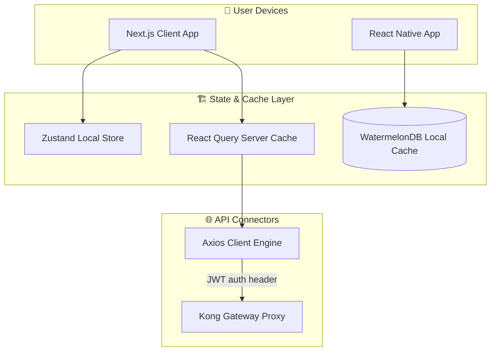
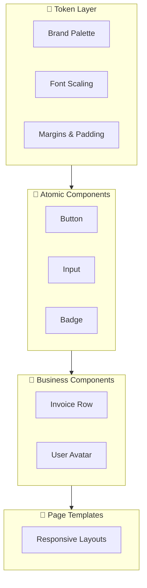
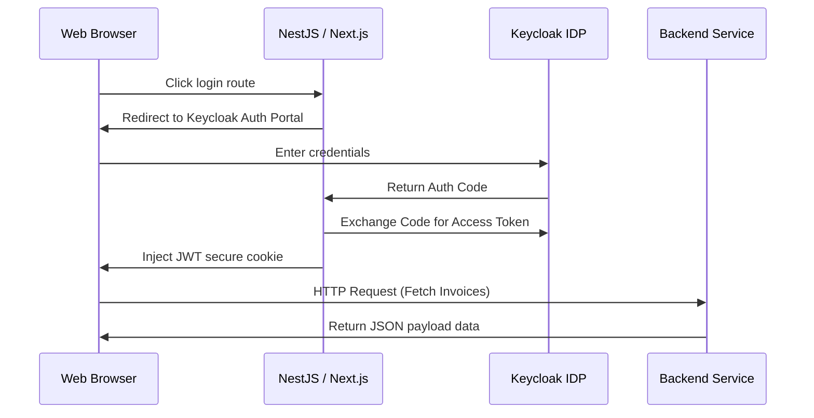
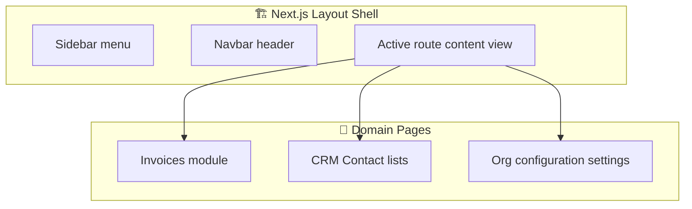
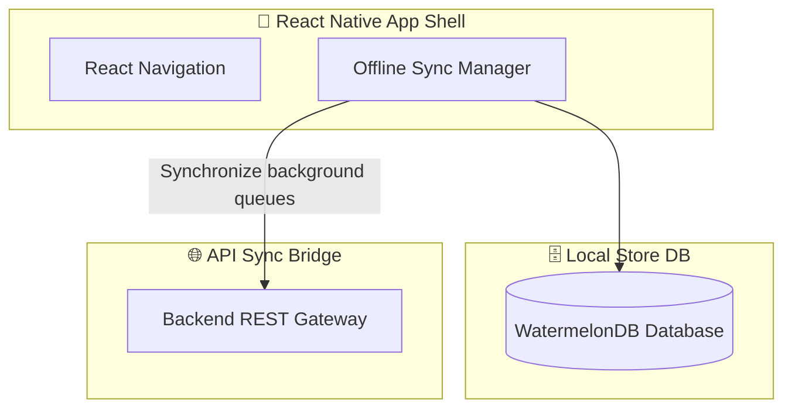

# FRONTEND & UX IMPLEMENTATION STRATEGY

**Project Name:** Enterprise SaaS Business Management Platform  
**Document Version:** 1.0.0 — Baseline Standard  
**Date:** July 14, 2026  
**Authors:** Principal Frontend Architect, UX Architect, Design System Engineer, React/Next.js Expert, Mobile Application Architect, and SaaS Product Engineering Leader  
**Classification:** Internal — Confidential  
**Phase:** 22.3 — Frontend & UX Implementation Strategy  

---

## Table of Contents

1. [Executive Summary](#1-executive-summary)
2. [Frontend Architecture Foundation](#2-frontend-architecture-foundation)
3. [Frontend Application Architecture](#3-frontend-application-architecture)
4. [Frontend Project Structure](#4-frontend-project-structure)
5. [Design System Architecture](#5-design-system-architecture)
6. [Component Architecture](#6-component-architecture)
7. [State Management Strategy](#7-state-management-strategy)
8. [API Integration Architecture](#8-api-integration-architecture)
9. [Authentication UX Flow](#9-authentication-ux-flow)
10. [Role-Based UI System](#10-role-based-ui-system)
11. [Web Application Development Order](#11-web-application-development-order)
12. [Mobile Application Strategy](#12-mobile-application-strategy)
13. [UX Design Process](#13-ux-design-process)
14. [Performance Optimization](#14-performance-optimization)
15. [Frontend Security](#15-frontend-security)
16. [Testing Strategy](#16-testing-strategy)
17. [Frontend Development Workflow](#17-frontend-development-workflow)
18. [Frontend Team Structure](#18-frontend-team-structure)
19. [Frontend Technology Stack](#19-frontend-technology-stack)
20. [Frontend Evolution Roadmap](#20-frontend-evolution-roadmap)
21. [Final Frontend Blueprints (Mermaid)](#21-final-frontend-blueprints-mermaid)
22. [Implementation Summary](#22-implementation-summary)

---

## 1. Executive Summary

### 1.1 Document Purpose
This document establishes the **Frontend & UX Implementation Strategy** (Phase 22.3). It transforms design guidelines, styling choices, user journeys, and micro-frontend structures into an executable frontend strategy. It defines development standards, repository organization structures, state management rules, API loaders, and offline mobile synchronization patterns for the Next.js web application, React Native mobile apps, and the partner marketplace portal.

### 1.2 Frontend Philosophy
*   **Component-Driven Development (CDD):** Building modular, self-contained UI components verified in Storybook isolation before page deployment.
*   **State Separation:** Separating server state caching (managed by React Query) from UI state management (managed by Zustand).
*   **Performance First:** Enforcing performance budgets across code splitting, image optimization, dynamic page preloading, and offline cache storage.
*   **Accessible Designs:** Enforcing WCAG 2.1 AA compliance across all user interfaces.

---

## 2. Frontend Architecture Foundation

The platform's user interface layer has evolved through four operational stages:

```
STAGE 1: SIMPLE UI
  • Ad-hoc styles and inline JS scripting.
  • Direct database queries embedded in frontend markup.
  • No styling standards or reusable components.

STAGE 2: COMPONENT SYSTEM
  • Introduction of reusable UI components (buttons, text inputs).
  • Separation of concerns between markup and style.
  • Basic component encapsulation.

STAGE 3: DESIGN SYSTEM (Figma + CSS Tokens)
  • Centrally managed design tokens (colors, typography, margins).
  • Shared component library across teams.
  • Storybook configuration for verification.

STAGE 4: ENTERPRISE PLATFORM (Federated Micro-Frontends)
  • Independent deployment of web application sub-pages.
  • Dynamic layout projection of third-party marketplace UI widgets.
  • Centralized token authentication, routing, and postMessage bridges.
```

---

## 3. Frontend Application Architecture

The frontend ecosystem delivers targeted user experiences across multiple channels:

```
       User Action
            │
            ▼
    [Next.js App Shell]
            │
            ├─► Customer Portal ──► Account Billing & Support tickets
            ├─► Admin Dashboard ──► KYC reviews & Platform analytics
            ├─► Business Dashboard ──► ERP modules, CRM pipeline, Invoices
            │
            ▼
   [React Native Client] ──► Offline-first Mobile CRM & ERP Apps
```

---

## 4. Frontend Project Structure

The Next.js and React Native codebases share a directory structure to organize shared utilities, state stores, and page modules:

```
/src
  ├── /components
  │     ├── /ui           (Atomic design system blocks: buttons, cards)
  │     └── /layout       (AppShell layout, Navigation sidebar, Header navbar)
  ├── /features
  │     ├── /invoices     (Invoice forms, billing history table components)
  │     └── /customers    (Customer lists, contact profile page widgets)
  ├── /pages
  │     ├── /invoices     (Invoice route path handlers and SSR layouts)
  │     └── /customers    (Customer route path handlers)
  ├── /hooks
  │     ├── /useAuth.ts   (Token management context hooks)
  │     └── /useRLS.ts    (Active tenant context lookup hooks)
  ├── /services
  │     └── /api          (React Query API fetch hooks and client bindings)
  ├── /store
  │     └── /useUIStore.ts (Zustand state store for navigation and themes)
  ├── /utils
  │     └── /format.ts    (Date, currency, and numerical format utilities)
  └── /styles
        └── globals.css   (Tailwind directives, base token definitions)
```

---

## 5. Design System Architecture

The Enterprise Design System governs styling and layouts to ensure visual consistency across all applications:

```
                       DESIGN SYSTEM TIERS
┌────────────────────────────────────────────────────────────────────────┐
│  Tier 1: Design Tokens                                                 │
│  • Brand color variables, spacing configurations, font scaling rules.   │
├────────────────────────────────────────────────────────────────────────┤
│  Tier 2: Component Styles                                              │
│  • Typography tokens, border styles, form inputs, button variations.   │
├────────────────────────────────────────────────────────────────────────┤
│  Tier 3: Layout Templates                                              │
│  • Responsive grids, card containers, headers, and footer components.  │
├────────────────────────────────────────────────────────────────────────┤
│  Tier 4: Complex Data Displays                                         │
│  • Interactive data tables (pagination/filtering) and charts.          │
└────────────────────────────────────────────────────────────────────────┘
```

---

## 6. Component Architecture

User interfaces are organized into four architectural tiers following Atomic Design principles:

*   **Atomic Components:** Basic, stateless elements containing no business logic (e.g., `<Button>`, `<Input>`, `<Badge>`).
*   **Business Components:** Relational blocks that manage local state (e.g., `<InvoiceRow>`, `<ContactAvatar>`).
*   **Feature Components:** Domain-specific units composed of atomic and business elements (e.g., `<BillingForm>`, `<CustomerHistoryTable>`).
*   **Page Components:** Main layouts and page wrappers linked to Next.js routes, managing SSR data preloading and metadata tags.

---

## 7. State Management Strategy

The application separates UI state from server state caching to optimize performance and prevent redundant network requests:

```
                  STATE ARCHITECTURE SEPARATION
┌──────────────────────────────┐          ┌──────────────────────────────┐
│  Zustand Global Store        │          │  React Query Client Cache    │
│  • UI themes & settings      │          │  • Server data synchronization│
│  • Sidebar open/close state  │          │  • Background data polling   │
│  • User permissions list     │          │  • Mutation mutation invalidations│
└──────────────────────────────┘          └──────────────────────────────┘
```

### 7.1 React Query Implementation Example
```typescript
import { useQuery, useMutation, useQueryClient } from '@tanstack/react-query';
import axios from 'axios';

interface Invoice {
  id: string;
  amountCents: number;
  status: string;
}

export function useFetchInvoices() {
  return useQuery<Invoice[]>({
    queryKey: ['invoices'],
    queryFn: async () => {
      const { data } = await axios.get('/api/v1/invoices');
      return data;
    },
    staleTime: 5 * 60 * 1000, // Consider data fresh for 5 minutes
    refetchOnWindowFocus: false,
  });
}

export function useCreateInvoice() {
  const queryClient = useQueryClient();

  return useMutation({
    mutationFn: async (newInvoice: Partial<Invoice>) => {
      const { data } = await axios.post('/api/v1/invoices', newInvoice);
      return data;
    },
    onSuccess: () => {
      // Invalidate cache to trigger automatic refetch
      queryClient.invalidateQueries({ queryKey: ['invoices'] });
    },
  });
}
```

---

## 8. API Integration Architecture

The API Integration layer handles request and response transformations, token injection, loading states, and error handling:

```
User Event (Form Submit)
    │
    ▼
[API Client Hook] ──► Inject Bearer Token, map payload formats
    │
    ▼
[Axios / fetch client] ──► Dispatch network request with request ID header
    │
    ▼
[Response Pipeline]
    ├── 2xx Success ──► Parse response and update React Query cache
    └── 4xx/5xx Error ──► Trigger global error toast notify (filters)
```

*   **Loading States:** Skeletons are displayed during page transitions to improve perceived performance.
*   **Error Boundaries:** React Error Boundaries capture unexpected errors and display fallback error screens.

---

## 9. Authentication UX Flow

The login and access workflow secures applications through unified identity steps:

```
   LOGIN FORM               TOKEN CHECK              ACL RULES
┌──────────────┐        ┌──────────────┐          ┌──────────────┐
│  Enter credentials  │ ───►   │ Decode JWT   │ ───►     │ Verify role  │
│  or OAuth    │        │ token and    │          │ scopes and   │
│  federation  │        │ verify state │          │ redirect     │
└──────────────┘        └──────────────┘          └──────────────┘
                                                         │
                                                         ▼
                                                   DASHBOARD ACCESS
                                                  ┌──────────────┐
                                                  │ Mount layout │
                                                  │ and prefetch │
                                                  │ route data   │
                                                  └──────────────┘
```

*   **Refresh Token Rotation:** An Axios interceptor automatically refreshes access tokens in the background before they expire.
*   **Public Routes:** Homepages, docs, and the status page bypass authentication checks.

---

## 10. Role-Based UI System

The application hides or displays UI components dynamically based on the active user's roles and scopes:

```typescript
import React from 'react';
import { useAuth } from './useAuth';

interface ProtectedWrapperProps {
  requiredScopes: string[];
  children: React.ReactNode;
  fallback?: React.ReactNode;
}

export const ScopeGuard: React.FC<ProtectedWrapperProps> = ({
  requiredScopes,
  children,
  fallback = null,
}) => {
  const { user } = useAuth();

  if (!user) return fallback;

  // Check if the user possesses the required scopes
  const hasAccess = requiredScopes.every((scope) => user.scopes.includes(scope));

  return hasAccess ? <>{children}</> : fallback;
};

// Usage Example
// <ScopeGuard requiredScopes={['finance:invoices:write']}>
//   <button onClick={handlePayInvoice}>Pay Invoice</button>
// </ScopeGuard>
```

---

## 11. Web Application Development Order

Web application modules are developed in a sequential order to build layout foundations before implementing features:

1.  **Grid Layout Systems:** Build the layout shell, sidebar navigation, top header, page grid rules, and theme configuration.
2.  **Authentication Forms:** Implement Keycloak login forms, MFA views, and token refresh logic.
3.  **Customer settings & Dashboards:** Build baseline tables, search bars, and statistics widgets.
4.  **Core business modules:** Deploy Invoices, CRM contacts, and Inventory managers.
5.  **Analytics dashboards:** Build metric charts and custom report builders.
6.  **AI integrations:** Add next-generation chat interfaces and autonomous agents control panels.

---

## 12. Mobile Application Strategy

React Native applications are built using an offline-first architecture to ensure reliability:

```
                  MOBILE SYNCHRONIZATION FLOW
┌──────────────────────────────┐          ┌──────────────────────────────┐
│  React Native UI Layer       │          │  Background Sync Queue       │
│  • Render data from Watermelon│          │  • Log write actions offline │
│  • Sub-10ms query execution  │          │  • Synchronize changes when  │
│  • Smooth 60fps animations   │          │    connection is restored    │
└──────────────┬───────────────┘          └──────────────▲───────────────┘
               │                                         │
               └────── Writes data locally ──────────────┘
```

*   **Offline Data Access:** Local data is cached using WatermelonDB to support offline usage.
*   **Push Notifications:** Firebase Cloud Messaging (FCM) routes real-time system alerts to mobile clients.

---

## 13. UX Design Process

Designing and implementing user interfaces follows a standard design process:

*   **Research:** Analyze user behavior and define layout requirements using target personas.
*   **Wireframe:** Develop structural design layouts in Figma.
*   **Prototype:** Create interactive design flows to test and validate usability.
*   **Implementation:** Build modular React components following style guides.
*   **Verify & Test:** Run automated integration tests, accessibility scans, and collect user feedback.

---

## 14. Performance Optimization

The frontend uses multiple optimization techniques to maintain fast page load times:

*   **Code Splitting:** Next.js dynamic routing implements route-based code splitting to minimize bundle sizes.
*   **Dynamic Asset Delivery:** Next.js `<Image>` component optimizes images dynamically based on screen resolution.
*   **Asset Preloading:** Next.js `Link` component preloads linked page bundles in the background.
*   **Bundle Auditing:** Webpack Bundle Analyzer runs during build pipelines to identify and optimize large dependencies.

---

## 15. Frontend Security

The platform applies multiple security layers to protect the client application:

*   **Sanitization:** React automatically escapes values to protect against Cross-Site Scripting (XSS) attacks.
*   **CSP (Content Security Policy) Headers:** Restricts scripts and assets to whitelisted source domains.
*   **CSRF Tokens:** Session state changes utilize verification tokens to block Cross-Site Request Forgery (CSRF).
*   **Token Protection:** Session cookies are stored with `HttpOnly`, `Secure`, and `SameSite=Strict` flags.

---

## 16. Testing Strategy

The QA pipeline verifies UI reliability through a multi-tier testing framework:

```
  UNIT TESTING             INTEGRATION TESTING            ACCESSIBILITY AUDITS
┌──────────────┐         ┌───────────────────┐         ┌─────────────────────┐
│ Vitest mock  │ ───►    │ React Testing      │ ───►    │ automated axe-core  │
│ component    │         │ Library user flows│         │ WCAG AA validation  │
└──────────────┘         └───────────────────┘         └─────────────────────┘
```

*   **Unit Tests:** Vitest mocks and tests individual UI components.
*   **Integration Tests:** React Testing Library validates user flows and forms.
*   **E2E Tests:** Playwright executes end-to-end integration tests across browsers.
*   **Accessibility Tests:** Automated `axe-core` tests verify accessibility compliance (WCAG AA).

---

## 17. Frontend Development Workflow

Developers follow a structured workflow to maintain code quality:

```
  Figma Draft
      │
      ▼
[CLI project generation] ──► Generate component files and write unit tests
      │
      ▼
[Storybook Verification] ──► Test visual variations and state configurations
      │
      ▼
[Pull Request Review] ────► Code review and automated checks
      │
      ▼
[Staging Deployment] ────► Manual QA verification and accessibility audits
      │
      ▼
Production Release
```

---

## 18. Frontend Technology Stack

| Category | Technology | Purpose |
| :--- | :--- | :--- |
| **Web Framework** | React / Next.js 14 | Handles web dashboard routing, SSR, and layout rendering |
| **Mobile Framework** | React Native | Cross-platform mobile client engine |
| **Language** | TypeScript | Strong typing for UI state and API payloads |
| **Styling Library** | Tailwind CSS | Utility-first CSS framework |
| **Component Playground**| Storybook | Interactive sandbox playground for UI components |
| **Server Cache** | React Query (TanStack) | Manages API data synchronization and caching |
| **Client State** | Zustand | Lightweight client state manager |
| **Mobile Local DB** | WatermelonDB | High-performance offline-first local SQL database |
| **E2E Testing Tool** | Playwright | Multi-browser end-to-end user testing framework |

---

## 19. Frontend Evolution Roadmap

The frontend architecture evolves to support more complex applications as it scales:

*   **Year 1: Component Library & MVP UI**  
    Establish design tokens, launch core Tailwind CSS layouts, and release MVP forms.
*   **Year 2: Enterprise Dashboard & Storybook Portal**  
    Build out complex ERP widgets, deploy the interactive Storybook catalog, and launch the developer portal.
*   **Year 3: Dynamic Micro-Frontend Ingestion**  
    Implement dynamic layout orchestration, importing sandboxed partner widgets via Web Components.
*   **Year 4: AI Native Voice & Copilot Interfaces**  
    Integrate conversational UI, inline AI suggestions, and automated search features.

---

## 20. Final Frontend Implementation Blueprint (Mermaid)

### 20.1 Frontend Architecture Layout



### 20.2 Design System Architecture



### 20.3 User Authentication Flow



### 20.4 Web Application Structure



### 20.5 Mobile Application Architecture



---

## 21. Implementation Summary

### 21.1 Core Platform Progress Dashboard

| Component | Architecture Document | Status |
| :--- | :--- | :--- |
| **Phase 22.1** | Enterprise Implementation Roadmap Foundation | ✅ Complete |
| **Phase 22.2** | Database & Backend Implementation Strategy | ✅ Complete |
| **Phase 22.3** | Frontend & UX Implementation Strategy | ✅ Complete (this document) |

---

## Document Control

| Field | Value |
|---|---|
| **Document ID** | SBMP-FE-22.3-FRONTEND-UX-STRATEGY |
| **Version** | 1.0.0 |
| **Status** | APPROVED — Baseline |
| **Owner** | Principal Frontend Architect |
| **Reviewed By** | UX Architect, Web Lead, Mobile Lead, PMO |
| **Review Cycle** | Quarterly |
| **Next Review** | October 2026 |

---

*Phase 22.3 — Frontend & UX Implementation Strategy | SaaS Business Management Platform*  
*Enterprise Confidential — © 2026 All Rights Reserved*
