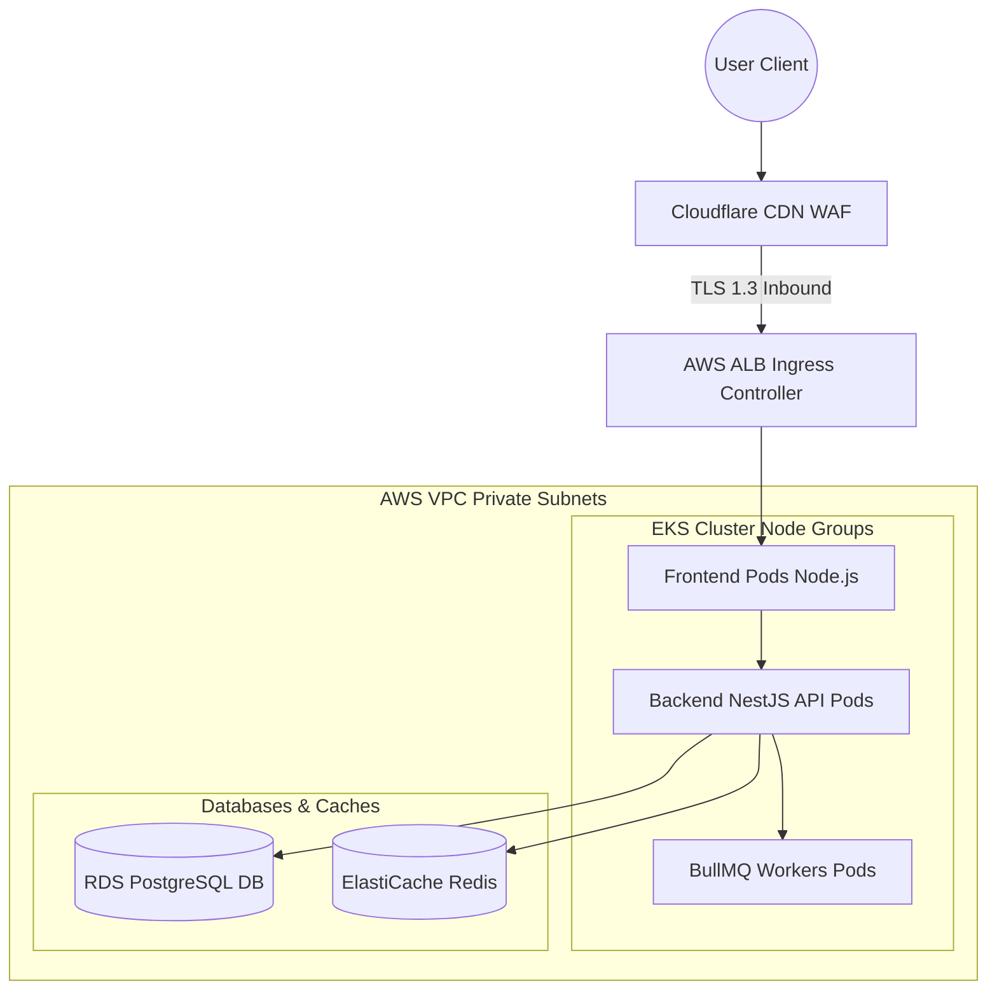
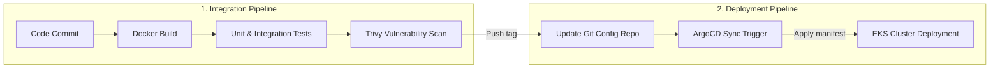
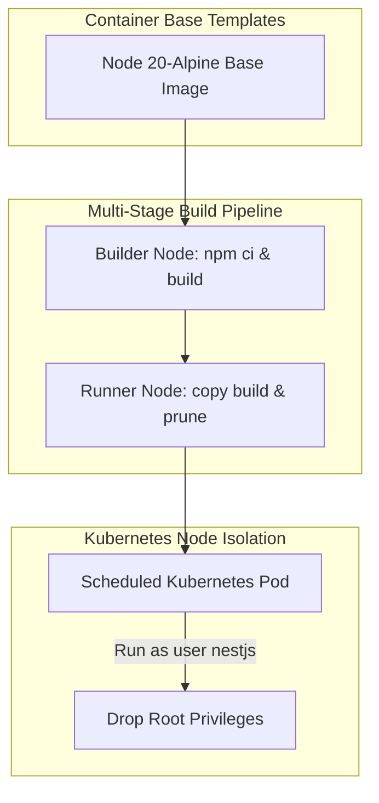
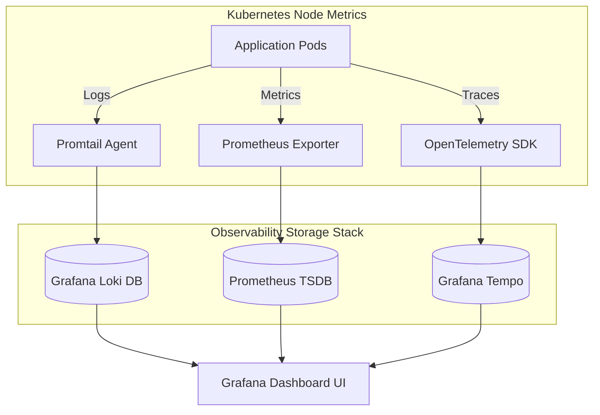
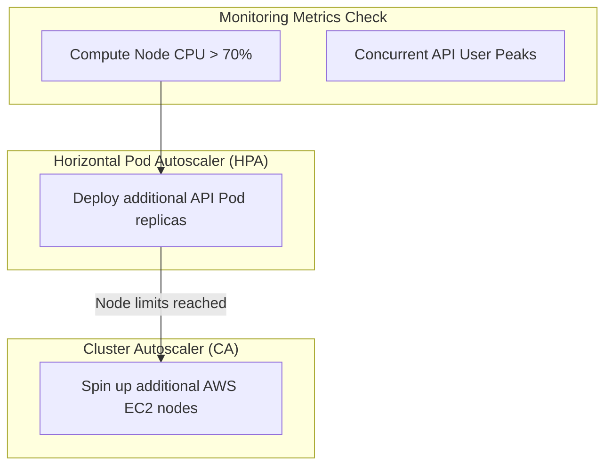

# DEVOPS & CLOUD DEPLOYMENT PLAN

**Project Name:** Enterprise SaaS Business Management Platform  
**Document Version:** 1.0.0 — Baseline Standard  
**Date:** July 14, 2026  
**Authors:** Principal DevOps Architect, Cloud Infrastructure Architect, Site Reliability Engineer (SRE), Kubernetes Engineer, Security Engineer, and Enterprise SaaS Operations Leader  
**Classification:** Internal — Confidential  
**Phase:** 22.4 — DevOps & Cloud Deployment Plan  

---

## Table of Contents

1. [Executive Summary](#1-executive-summary)
2. [DevOps Foundation & Philosophy](#2-devops-foundation--philosophy)
3. [Cloud Infrastructure Architecture](#3-cloud-infrastructure-architecture)
4. [Cloud Platform Strategy](#4-cloud-platform-strategy)
5. [Container Architecture](#5-container-architecture)
6. [Enterprise Docker Strategy](#6-enterprise-docker-strategy)
7. [CI/CD Pipeline Design](#7-cicd-pipeline-design)
8. [GitOps Strategy](#8-gitops-strategy)
9. [Environment Management](#9-environment-management)
10. [Deployment Strategies](#10-deployment-strategies)
11. [Database Operations](#11-database-operations)
12. [Monitoring & Observability](#12-monitoring--observability)
13. [Security Operations (DevSecOps)](#13-security-operations-devsecops)
14. [Backup & Disaster Recovery](#14-backup--disaster-recovery)
15. [High Availability Architecture](#15-high-availability-architecture)
16. [Scaling Strategy](#16-scaling-strategy)
17. [Cost Optimization Strategy](#17-cost-optimization-strategy)
18. [DevOps & SRE Team Structure](#18-devops--sre-team-structure)
19. [Production Operations Guide](#19-production-operations-guide)
20. [DevOps Evolution Roadmap](#20-devops-evolution-roadmap)
21. [Final DevOps Blueprints (Mermaid)](#21-final-devops-blueprints-mermaid)
22. [Implementation Summary](#22-implementation-summary)

---

## 1. Executive Summary

### 1.1 Document Purpose
This document establishes the **DevOps & Cloud Deployment Plan** (Phase 22.4). It defines the cloud infrastructure topology, containerization strategies, CI/CD pipeline automation structures, environment configurations, and site reliability operations for the SaaS platform. It provides target patterns for Kubernetes node management, zero-trust cloud network security, infrastructure cost optimization, and automated GitOps deployments.

### 1.2 Operations Strategy
*   **Infrastructure as Code (IaC):** Every network resource, database instance, load balancer, and compute node group is declared in Terraform scripts.
*   **GitOps Continuous Delivery:** Platform deployments are managed by ArgoCD, which synchronizes cluster state directly with declarations in Git configurations.
*   **Observability First:** Logging and monitoring infrastructures (Prometheus, Loki, Tempo, Grafana) are provisioned during cluster setup to ensure system visibility.

---

## 2. DevOps Foundation & Philosophy

The operations strategy shifts management from manual deployments to automated pipelines, minimizing human error and accelerating delivery:

```
  DEVELOPMENT               OPERATIONS               AUTOMATION
┌──────────────┐        ┌──────────────┐        ┌──────────────┐
│ Write IaC    │ ───►   │ Continuous   │ ───►   │ Automated    │
│ code, define │        │ monitoring   │        │ smoke tests, │
│ helm charts  │        │ and alerts   │        │ rollbacks    │
└──────────────┘        └──────────────┘        └──────────────┘
                                                       │
                                                       ▼
                                               CONTINUOUS DELIVERY
                                              ┌──────────────┐
                                              │ GitOps deploys│
                                              │ to prod automatically│
                                              └──────────────┘
```

### 2.1 Deployment Model Comparison

| Dimension | Traditional Deployment | Modern DevOps |
| :--- | :--- | :--- |
| **Release Frequency** | Monthly or Quarterly | Multiple times per day |
| **Infrastructure Provisioning** | Manual VM setup by administrators | Automated Infrastructure as Code (Terraform) |
| **Rollback Capability** | Manual rebuilds from backups | Automated redeployment of last-known-good Git commit |
| **System Visibility** | Reactive alerting based on ping tests | Proactive observability (tracing, logs, metrics) |

---

## 3. Cloud Infrastructure Architecture

The cloud topology routes client requests through global CDN caches, load balancers, and isolated subnets to access applications:

```
  Client Request
        │
        ▼
   [Cloudflare CDN Edge Cache] ──► Block malicious attacks, cache static files
        │
        ▼
   [AWS Application Load Balancer] ──► Route traffic, terminate TLS 1.3
        │
        ▼
   [Kubernetes EKS Worker Nodes (Private Subnets)]
        ├── Web Dashboard Pods (Next.js Node.js runtime)
        ├── Backend API Pods (NestJS microservices)
        └── Queue Worker Pods (BullMQ tasks)
        │
        ▼
   [Database & Storage Layers]
        ├── Multi-AZ PostgreSQL Database Instance
        ├── Redis Cluster (Cache)
        └── AWS S3 Storage Buckets (File assets)
```

---

## 4. Cloud Platform Strategy

The platform's cloud footprint matches different provider tiers based on the organization's growth phase:

| Phase | Target Provider | Rationale & Cost Target | Service Stack |
| :--- | :--- | :--- | :--- |
| **Startup (MVP)** | DigitalOcean / Managed Kubernetes | * Lower host overhead.<br/>* Fixed resource cost.<br/>* Under $500/month. | Managed K8s, PostgreSQL Cluster, Redis Cache. |
| **Growth (Scale)** | AWS (Single-Region) | * High availability nodes.<br/>* Auto-scaling pools.<br/>* Under $3,000/month. | EKS, RDS Multi-AZ PostgreSQL, ElastiCache Redis, S3. |
| **Enterprise (Global)** | AWS (Multi-Region Active-Active) | * Data residency compliance.<br/>* Regional failover routes.<br/>* Over $10,000/month. | Multi-Region EKS, Aurora Global DB, Cloudflare Enterprise WAF. |

---

## 5. Container Architecture

The system utilizes modular, specialized containers to isolate runtime concerns and manage system resources efficiently:

*   **Next.js Frontend Container:** Built on lightweight Node.js Alpine base images, optimized for Server-Side Rendering (SSR) tasks.
*   **NestJS Backend Container:** Runs NestJS API endpoints with configured RAM limit pools (max 512MB limits).
*   **PostgreSQL Engine Container:** Custom DB image configured with `pg_vector` extension files.
*   **Redis Cache Container:** In-memory store container optimized for session caching and sliding window rate limits.
*   **Background Queue Worker Container:** Runs BullMQ processing scripts to handle PDF generation, email dispatches, and image processing.

---

## 6. Enterprise Docker Strategy

Container images follow security guidelines to prevent host breaches and minimize image sizes:

```dockerfile
# Multi-stage build for NestJS Backend Microservice
FROM node:20-alpine AS builder
WORKDIR /usr/src/app
COPY package*.json ./
RUN npm ci
COPY . .
RUN npm run build
RUN npm prune --production

FROM node:20-alpine AS runner
WORKDIR /usr/src/app
ENV NODE_ENV=production
# Run as non-privileged system user for container safety
RUN addgroup -g 1001 -S nodejs && adduser -S nestjs -u 1001
COPY --chown=nestjs:nodejs --from=builder /usr/src/app/node_modules ./node_modules
COPY --chown=nestjs:nodejs --from=builder /usr/src/app/dist ./dist
USER nestjs
EXPOSE 3000
CMD ["node", "dist/main.js"]
```

### 6.1 Docker Image Security Checklist
*   **Distroless & Minimalist Images:** Use Alpine or Distroless base images to reduce vulnerability surface areas.
*   **Non-Root User Configuration:** Explicitly declare `USER nestjs` to prevent root-privilege execution within clusters.
*   **Prisma Engine Pruning:** Prune unused OS dependencies from the generated Prisma client library.

---

## 7. CI/CD Pipeline Design

The integration pipeline executes multiple automated checks before permitting code promotion:

```
  Git Push / PR             Verify Build             Security Scan
┌──────────────┐        ┌──────────────┐        ┌──────────────┐
│ Trigger CI   │ ───►   │ Compile build, │ ───►  │ Scan image   │
│ pipeline     │        │ run unit tests │        │ for CVEs     │
└──────────────┘        └──────────────┘        └──────────────┘
                                                       │
                                                       ▼
                                               GIT GITOPS DEPLOY
                                              ┌──────────────┐
                                              │ ArgoCD syncs │
                                              │ config state │
                                              │ to cluster   │
                                              └──────────────┘
```

---

## 8. GitOps Strategy

The GitOps delivery model treats the Git repository as the single source of truth for the platform's infrastructure state:

*   **Config Isolation:** Infrastructure Helm charts and Kubernetes manifests are maintained in a dedicated Git configuration repository separate from source code.
*   **Automated Sync Checks:** ArgoCD runs continuous drift analysis, comparing active cluster states with configurations in the Git repository.
*   **Self-Healing Clusters:** ArgoCD automatically remediates cluster manual modifications, applying defined Git configs back onto nodes.

---

## 9. Environment Management

The deployment pipeline utilizes four isolated cloud environments to manage releases:

| Environment | VPC / Cluster Location | Deployment Strategy | Access Policy |
| :--- | :--- | :--- | :--- |
| **Development (Dev)** | Shared Dev cluster namespace | Continuous merge deployment | Developer access |
| **Testing (QA)** | Isolated QA namespace | Automated pipeline runs | QA team access |
| **Staging (Stage)** | Production VPC clone cluster | Rolling zero-downtime updates | Release manager access |
| **Production (Prod)** | Dedicated Production VPC | Automated canary rollouts | SRE / Break-Glass access |

---

## 10. Deployment Strategies

Production deployments use a **Canary Deployment** model to verify release stability:

```
                  CANARY RELEASE DISTRIBUTION
┌────────────────────────────────────────────────────────┐
│                   Target Cluster Load                  │
│ ┌───────────────────────────────────┐ ┌──────────────┐ │
│ │  Stable Service Instances (v1.0)  │ │ Canary (v2.0)│ │
│ │  Handles 90% of requests          │ │ Handles 10%  │ │
│ └───────────────────────────────────┘ └──────────────┘ │
└────────────────────────────────────────────────────────┘
```

*   **Canary Steps:** 10% of production traffic is routed to the new release for 1 hour. If error rates remain below targets, traffic increases to 100% using rolling updates.
*   **Automatic Rollback Rules:** Automated triggers roll back deployment containers if the endpoint error rate (HTTP 5xx) increases by more than 1% during verification periods.

---

## 11. Database Operations

Database operations prioritize data integrity and minimal downtime:

```
  CDC EVENT
┌──────────────┐
│ Debezium     │ ──► Kafka Stream ──► ClickHouse Analytics Database
│ captures WAL │
└──────────────┘
```

*   **Online Zero-Downtime Migrations:** DB migrations use schema-add operations (e.g., adding nullable columns) before deprecating old attributes, supporting concurrent versions of backend code.
*   **Point-in-Time Recovery (PITR):** Write-Ahead Logs (WAL) stream directly to AWS S3 buckets, supporting data recovery down to the second.

---

## 12. Monitoring & Observability

Observability pipelines gather telemetry across metrics, logs, and traces to monitor system health:

```
Telemetry Source
    │
    ├─► Prometheus Node Exporters ──► Gather CPU, RAM, and Pod state metrics
    ├─► Promtail / FluentBit ────────► Stream stdout logs to Loki
    └─► OpenTelemetry SDK ───────────► Send trace spans to Grafana Tempo
```

*   **Service Level Indicators (SLIs):** System alerts trigger pager notifications if service metrics degrade (e.g., API P95 latency > 200ms, database CPU utilization > 80%).

---

## 13. Security Operations (DevSecOps)

Security checks are integrated into all phases of the development pipeline:

*   **Secrets Isolation:** Dynamic secrets and credentials are store-mounted using AWS Secrets Manager, keeping credentials out of image configurations or Git repositories.
*   **Static Application Security Testing (SAST):** Trivy and Snyk audit container images for vulnerabilities during the CI pipeline.
*   **Zero-Trust Network Routing:** Kubernetes NetworkPolicies restrict cross-pod communication (e.g., frontend pods cannot communicate with PostgreSQL databases directly).

---

## 14. Backup & Disaster Recovery

The disaster recovery strategy defines backup frequencies and recovery targets to maintain business continuity:

*   **Recovery Metrics:** Recovery Point Objective (RPO) is set to 1 hour; Recovery Time Objective (RTO) is set to 4 hours.
*   **Multi-Region Failovers:** Cross-region backups replicate catalog configurations daily, supporting DNS failovers via AWS Route 53 if a primary cloud region goes offline.

---

## 15. High Availability Architecture

The infrastructure architecture avoids single points of failure to maximize uptime:

*   **Multi-AZ Deployments:** Compute nodes and managed services are distributed across three AWS Availability Zones (AZs).
*   **Compute Redundancy:** Deployments enforce minimum pod counts (replicaCount >= 2) with PodAntiAffinity rules to prevent scheduling duplicate pods on the same host node.

---

## 16. Scaling Strategy

The platform scales resources dynamically based on active load:

```
  Incoming Request Load Peaks
              │
              ▼
  [Prometheus metrics triggers API]
              │
              ▼
  [Kubernetes Horizontal Pod Autoscaler] ──► Scales pod replicas based on CPU target (>70%)
              │
              ▼
  [Kubernetes Cluster Autoscaler] ─────────► Spins up new EC2 VM instances on node group pools
```

---

## 17. Cost Optimization Strategy

To maintain operational efficiency as the system scales, cloud resource configurations are optimized regularly:

*   **AWS Karpenter Node Profiling:** Karpenter spins up spot EC2 instances for non-production environments, reducing compute costs by up to 50%.
*   **PostgreSQL RDS Storage Scaling:** RDS storage volumes utilize GP3 storage classes with automatic capacity scaling, preventing over-provisioning.
*   **Container Limits Configuration:** All Kubernetes deployment manifests declare strict memory and CPU resource request limits to prevent node resource exhaustion.

---

## 18. DevOps & SRE Team Structure

Operational responsibilities are distributed across specialized engineering roles:

```
                          OPERATIONS GROUP
┌────────────────────────────────────────────────────────────────────────┐
│  DevOps Engineer                                                       │
│  • Manages CI/CD pipelines, Dockerfiles, and Helm charts.              │
├────────────────────────────────────────────────────────────────────────┤
│  Cloud Engineer                                                        │
│  • Provisions Terraform IaC scripts and manages AWS account limits.    │
├────────────────────────────────────────────────────────────────────────┤
│  Site Reliability Engineer (SRE)                                       │
│  • Manages Grafana alerts, on-call paging, and DR recovery workflows.   │
├────────────────────────────────────────────────────────────────────────┤
│  Security Engineer                                                     │
│  • Manages secret configurations, WAF rules, and vulnerability audits. │
└────────────────────────────────────────────────────────────────────────┘
```

---

## 19. Production Operations Guide

System maintenance and deployments follow strict operational guidelines to ensure stability:

*   **Deployment Windows:** Production releases are scheduled during low-traffic windows (e.g., 02:00–04:00 UTC).
*   **On-Call Rotations:** SRE engineers participate in rotating on-call shifts, managing system alerts received from PagerDuty.
*   **Post-Mortem Policy:** Post-mortem analyses are conducted after all major incidents to identify root causes and assign mitigation actions.

---

## 20. DevOps Evolution Roadmap

The operations architecture evolves to support more complex deployments as it scales:

*   **Phase 1: Manual Scripting (MVP)**  
    Deploy applications using manual bash scripts and docker-compose configurations on single VM instances.
*   **Phase 2: CI/CD Pipelines**  
    Automate build and test pipelines using GitHub Actions, pushing images to secure registries.
*   **Phase 3: Managed Kubernetes**  
    Deploy applications to managed AWS EKS clusters using Helm charts.
*   **Phase 4: GitOps & ArgoCD Integration**  
    Transition cluster state management to ArgoCD GitOps pipelines.
*   **Phase 5: Multi-Region Active-Active Cloud Mesh**  
    Deploy multi-region active-active clusters with unified service routing meshes.

---

## 21. Final DevOps Blueprints (Mermaid)

### 21.1 Cloud Infrastructure Architecture



### 21.2 CI/CD Pipeline



### 21.3 Docker Deployment Architecture



### 21.4 Monitoring Architecture



### 21.5 Production Scaling Model



---

## 22. Implementation Summary

### 22.1 Core Platform Progress Dashboard

| Component | Architecture Document | Status |
| :--- | :--- | :--- |
| **Phase 22.1** | Enterprise Implementation Roadmap Foundation | ✅ Complete |
| **Phase 22.2** | Database & Backend Implementation Strategy | ✅ Complete |
| **Phase 22.3** | Frontend & UX Implementation Strategy | ✅ Complete |
| **Phase 22.4** | DevOps & Cloud Deployment Plan | ✅ Complete (this document) |

---

## Document Control

| Field | Value |
|---|---|
| **Document ID** | SBMP-OPS-22.4-DEVOPS-DEPLOY-PLAN |
| **Version** | 1.0.0 |
| **Status** | APPROVED — Baseline |
| **Owner** | Principal DevOps Architect |
| **Reviewed By** | SRE Lead, Security Lead, CTO, Cloud Platform VP |
| **Review Cycle** | Quarterly |
| **Next Review** | October 2026 |

---

*Phase 22.4 — DevOps & Cloud Deployment Plan | SaaS Business Management Platform*  
*Enterprise Confidential — © 2026 All Rights Reserved*
