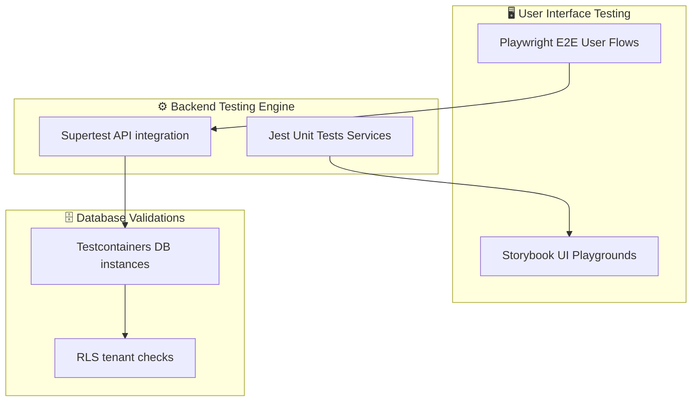
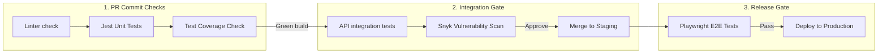
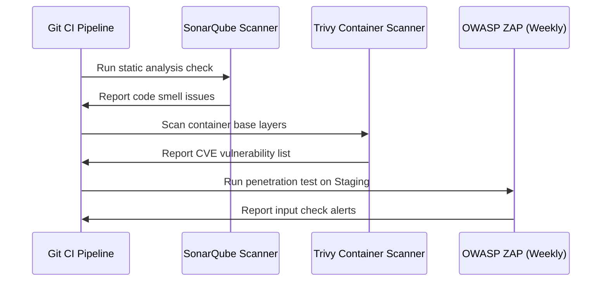
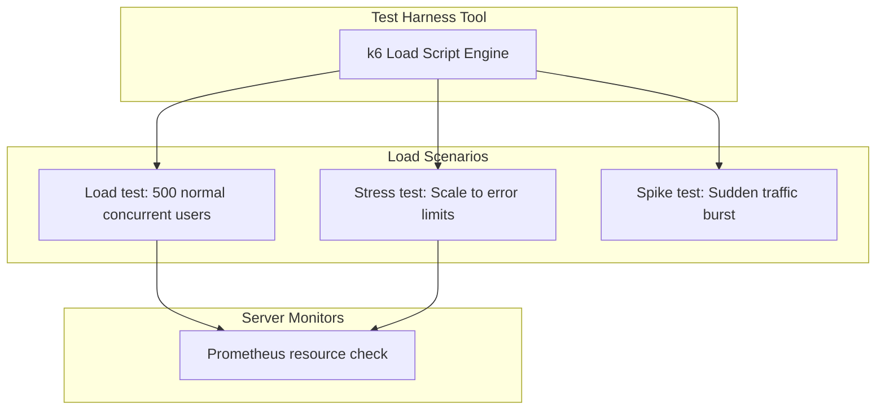
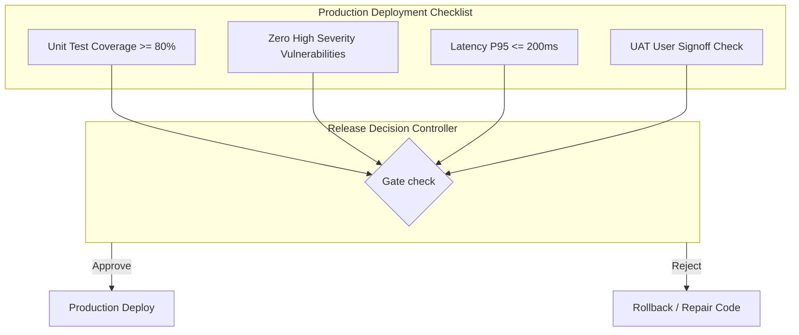

# TESTING & QUALITY ENGINEERING PLAN

**Project Name:** Enterprise SaaS Business Management Platform  
**Document Version:** 1.0.0 — Baseline Standard  
**Date:** July 14, 2026  
**Authors:** Principal QA Architect, Quality Engineering Lead, Software Testing Architect, Security Testing Specialist, Performance Engineer, and Enterprise SaaS Quality Leader  
**Classification:** Internal — Confidential  
**Phase:** 22.5 — Testing & Quality Engineering Plan  

---

## Table of Contents

1. [Executive Summary](#1-executive-summary)
2. [Quality Engineering Foundation](#2-quality-engineering-foundation)
3. [Testing Strategy Model](#3-testing-strategy-model)
4. [Software Testing Lifecycle](#4-software-testing-lifecycle)
5. [Unit Testing Strategy](#5-unit-testing-strategy)
6. [Backend Testing](#6-backend-testing)
7. [Frontend Testing](#7-frontend-testing)
8. [Database Testing](#8-database-testing)
9. [API Testing](#9-api-testing)
10. [End-to-End Testing](#10-end-to-end-testing)
11. [Security Testing](#11-security-testing)
12. [Performance Testing](#12-performance-testing)
13. [Scalability Testing](#13-scalability-testing)
14. [AI System Testing](#14-ai-system-testing)
15. [Automation Testing Pipeline](#15-automation-testing-pipeline)
16. [Test Environment Strategy](#16-test-environment-strategy)
17. [Bug Management Process](#17-bug-management-process)
18. [Quality Metrics & KPIs](#18-quality-metrics--kpis)
19. [QA Team Structure](#19-qa-team-structure)
20. [Quality Roadmap](#20-quality-roadmap)
21. [Final Quality Engineering Blueprints (Mermaid)](#21-final-quality-engineering-blueprints-mermaid)
22. [Implementation Summary](#22-implementation-summary)

---

## 1. Executive Summary

### 1.1 Document Purpose
This document establishes the **Testing & Quality Engineering Plan** (Phase 22.5). It defines the test automation architecture, QA pipelines, security scans, load tests, and AI evaluation gates for the SaaS platform. It provides target patterns for Jest mocks, Playwright E2E suites, k6 load parameters, OWASP vulnerability tests, and LLM hallucination checks to ensure platform reliability.

### 1.2 Quality Mandate
*   **Preventive Quality:** Shifting testing left in the lifecycle to identify requirements defects early and enforce static code analysis (SonarQube/Snyk) during local development.
*   **Automation First:** Every API endpoint, UI view, and database migration must have automated tests run during CI/CD execution.
*   **Strict Quality Gates:** Deployment pipelines enforce minimum test coverage thresholds (80% unit, 100% security vulnerabilities) before production releases.

---

## 2. Quality Engineering Foundation

The testing strategy shifts manual validation tasks to automated quality engineering gates, preventing bugs from reaching production:

```
    PREVENT BUGS            DETECT ISSUES            IMPROVE QUALITY
┌──────────────────┐    ┌──────────────────┐    ┌──────────────────────┐
│  Define clear    │    │  Continuous test │    │  Log feedback loops  │
│  API contracts   │ ──►│  execution in CI │ ──►│  to refactor code    │
│  and DTO schemas │    │  pipeline runs   │    │  and improve logic   │
└──────────────────┘    └──────────────────┘    └──────────────────────┘
```

### 2.1 QA Mindset Comparison

| Dimension | Traditional QA | Quality Engineering |
| :--- | :--- | :--- |
| **Focus** | Manual bug detection post-development | Bug prevention via test automation and CI/CD gates |
| **Timing** | Verification at the end of the sprint | Shift-left testing integrated into developer workflows |
| **Execution** | Manual testing using spreadsheet logs | Automated testing (Unit, Integration, E2E) |
| **Responsibility** | Dedicated testers isolated from developers | Shared responsibility across all engineering roles |

---

## 3. Testing Strategy Model

The platform uses a testing hierarchy model to balance test execution speed, coverage, and cost:

```
      E2E TESTS           (Playwright / Cypress user flow tests)
    ┌───────────┐
    │  ~5% Vol  │
   ┌┴───────────┴┐
   │  ~15% Vol   │        API & INTEGRATION (NestJS REST tests / DB integration)
  ┌┴─────────────┴┐
  │   ~80% Vol    │       UNIT TESTING (Jest/Vitest component and service tests)
 ┌┴───────────────┴┐
```

---

## 4. Software Testing Lifecycle

The QA process is integrated into all phases of the feature development lifecycle:

```
  REQUIREMENTS              PLANNING                  DESIGN
┌──────────────┐        ┌──────────────┐        ┌──────────────┐
│ Verify user  │ ───►   │ Define test  │ ───►   │ Write test   │
│ story criteria│        │ strategy and │        │ cases and mock│
│ and scopes   │        │ environment  │        │ data schemas │
└──────────────┘        └──────────────┘        └──────────────┘
                                                       │
                                                       ▼
                                                EXECUTION & FEEDBACK
                                                ┌──────────────┐
                                                │ Run pipelines│
                                                │ check coverage│
                                                │ fix bugs      │
                                                └──────────────┘
```

---

## 5. Unit Testing Strategy

Unit tests verify business logic in isolation, using mocked database connections and services:

*   **Backend Services:** Mock database interfaces using Prisma client mock libraries, validating service logic branches under positive and negative test cases.
*   **Utility Functions:** Validate math helper libraries (e.g., tax calculation, split conversions) against edge-case input values.
*   **Frontend Components:** Verify component state changes (e.g., button clicks, loading states) using Vitest and fireEvent wrappers.
*   **Custom React Hooks:** Validate hooks (e.g., token management, window layouts) using `@testing-library/react-hooks` wrappers.

---

## 6. Backend Testing

Backend testing verifies the reliability of API endpoints, business logic modules, and database integrations:

*   **API Verification:** Test routing endpoints, validation rules, HTTP response codes, and return body envelopes using Supertest.
*   **Authentication & Access Control:** Verify token verification gates, check that invalid JWTs return HTTP 401, and confirm expired logins are blocked.
*   **Authorization Scope Controls:** Test page visibility guards, checking that unauthorized roles (e.g., Employee accessing Billing routes) return HTTP 403.
*   **Business Rules Execution:** Validate business logic modules (e.g., processing invoices, applying bulk updates).

---

## 7. Frontend Testing

Frontend testing verifies user interface components and client-side logic:

*   **UI Components Playground:** Maintain visual catalog libraries using Storybook, testing visual variations and responsive layouts.
*   **Form Validation:** Verify form behavior, checking that invalid inputs (e.g., invalid emails, empty passwords) block form submission.
*   **Route Navigation:** Verify route transition logic and check that unauthorized pages redirect users to login screens.
*   **State Store Operations:** Validate local state changes (Zustand) and server state caching (React Query invalidations).

---

## 8. Database Testing

Database testing validates data integrity, migration safety, and query performance:

*   **Schema & Migrations Safety:** Verify that database migration files execute successfully on test database containers.
*   **Query Performance Benchmarks:** Identify slow queries and verify index configurations using query analysis tools (`EXPLAIN ANALYZE`).
*   **Tenancy Row-Level Isolation:** Verify tenant isolation policies (RLS), checking that queries for a tenant ID return only matching rows.
*   **Database Transaction Safety:** Verify that multi-row transactions roll back completely if any query within the transaction fails.

---

## 9. API Testing

API testing validates endpoint compliance against defined specifications:

```typescript
import * as request from 'supertest';
import { Test } from '@nestjs/testing';
import { INestApplication } from '@nestjs/common';
import { AppModule } from '../src/app.module';

describe('Invoices API Endpoint (Integration)', () => {
  let app: INestApplication;

  beforeAll(async () => {
    const moduleRef = await Test.createTestingModule({
      imports: [AppModule],
    }).compile();

    app = moduleRef.createNestApplication();
    await app.init();
  });

  it('/POST /api/v1/invoices (Validation Check)', () => {
    return request(app.getHttpServer())
      .post('/api/v1/invoices')
      .set('Authorization', `Bearer invalid_mock_token`)
      .send({ amountCents: -100 }) // Invalid amount
      .expect(400)
      .expect((res) => {
        expect(res.body.message).toContain('amountCents must be a positive number');
      });
  });

  afterAll(async () => {
    await app.close();
  });
});
```

---

## 10. End-to-End Testing

End-to-End (E2E) tests verify critical user journeys across all system components:

*   **Tenant Onboarding Flow:** Validate the registration form, payment configuration, account setup, and dashboard routing.
*   **User Login Flow:** Validate standard credentials login, Keycloak redirects, and multi-factor authentication (MFA).
*   **Invoicing Flow:** Verify invoice creation, customer assignments, fee calculations, and database records updates.
*   **Payment & Webhooks Flow:** Mock payment events, verify database updates, and check invoice status changes.

---

## 11. Security Testing

Security tests run continuously to protect the platform against vulnerabilities:

*   **OWASP Top 10 Auditing:** Scan dependencies for known vulnerabilities and test inputs for SQL injection and XSS.
*   **Authentication Attacks:** Run brute-force tests on login routes to verify rate-limiting and account lockout mechanisms.
*   **Access Control Auditing:** Verify scope verification logic, checking that requests with modified request IDs are blocked.
*   **Data Protection Auditing:** Verify that sensitive database fields (e.g., keys, customer PII) are stored using encryption.

### 11.1 Security Tool Matrix
*   **Static Scans:** SonarQube & Snyk (run on every commit).
*   **Dynamic Scanning:** OWASP ZAP (scheduled weekly scans).
*   **Adversary Testing:** Burp Suite (manual penetration testing during release cycles).

---

## 12. Performance Testing

Performance testing verifies system reliability and response times under load:

*   **Load Testing:** Validate system performance under normal peak load (e.g., 500 concurrent users).
*   **Stress Testing:** Validate system stability and error rates under extreme load conditions.
*   **Spike Testing:** Verify system recovery times and load balancing during sudden traffic spikes.
*   **Endurance Testing:** Monitor memory usage and resource consumption under sustained load to identify leaks.

---

## 13. Scalability Testing

Scalability testing verifies system auto-scaling configurations and database performance:

*   **Horizontal Autoscaling:** Verify that Kubernetes Horizontal Pod Autoscalers (HPA) launch new pod replicas when CPU usage exceeds 70%.
*   **Cluster Autoscaling:** Verify that new host EC2 instances are provisioned when resource limits are reached.
*   **Multi-Tenant Load Scaling:** Simulate concurrent request loads across 100 tenant accounts to verify database performance under load.

---

## 14. AI System Testing

AI tests verify response accuracy, safety, and operational costs:

*   **Response Accuracy & Consistency:** Evaluate LLM response quality against golden datasets using accuracy metrics (e.g., RAGAS framework).
*   **Prompt Injection Safeguards:** Test inputs against prompt injection payloads, verifying that guardrails block unexpected system prompts.
*   **Hallucination Prevention:** Compare LLM responses with source documents to verify factual consistency.
*   **Token Cost Optimization:** Monitor API call volume, token counts, and downstream LLM API charges.

---

## 15. Automation Testing Pipeline

The CI/CD pipeline enforces automated quality checks at each step:

```
  Git Push / PR             Verify Build             Quality Gate
┌──────────────┐        ┌──────────────┐        ┌──────────────┐
│ Compile code,│ ───►   │ Run unit &   │ ───►   │ Check test   │
│ run linters  │        │ integration  │        │ coverage and │
│ and scans    │        │ test suites  │        │ vulnerabilities│
└──────────────┘        └──────────────┘        └──────────────┘
                                                       │
                                                       ▼
                                               DEPLOY & MONITOR
                                              ┌──────────────┐
                                              │ Deploy to    │
                                              │ Staging/Prod │
                                              │ and verify   │
                                              └──────────────┘
```

---

## 16. Test Environment Strategy

The testing pipeline utilizes isolated environments to manage validation stages:

| Environment | Purpose | Infrastructure Config | Data Profile |
| :--- | :--- | :--- | :--- |
| **Development (Dev)** | Local coding & unit testing | Local docker-compose | Seed data |
| **QA / Test** | Automated integration tests | Ephemeral Testcontainers | Anonymized test set |
| **Staging** | Pre-production testing, UAT | Production cluster clone | Sanitized database copy |
| **Production** | Live customer workloads | High Availability Multi-Region | Live customer records |

---

## 17. Bug Management Process

Bug resolution follows a structured lifecycle to track issues to completion:

```
  REPORT BUG                ANALYZE                  FIX & DEPLOY
┌──────────────┐        ┌──────────────┐        ┌──────────────┐
│ Log details, │ ───►   │ Reproduce    │ ───►   │ Fix bug and  │
│ environment, │        │ issue and    │        │ add regression│
│ reproduction │        │ assign tag   │        │ unit test    │
└──────────────┘        └──────────────┘        └──────────────┘
                                                       │
                                                       ▼
                                                VERIFY & CLOSE
                                                ┌──────────────┐
                                                │ QA validates │
                                                │ fix and      │
                                                │ closes ticket│
                                                └──────────────┘
```

---

## 18. Quality Metrics & KPIs

Engineering teams track metrics across four categories to evaluate platform quality:

*   **Test Coverage:** Minimum unit test coverage of 80% is required for PR merges.
*   **Bug Leakage Rate:** Target bug leakage to production remains under 2% per release cycle.
*   **Build Success Rate:** Target CI/CD pipeline build success rate exceeds 95%.
*   **Performance Latency targets:** P95 response times must remain below 200ms.

---

## 19. QA Team Structure

QA responsibilities are distributed across specialized engineering roles:

```
                            QA DIVISION
┌────────────────────────────────────────────────────────────────────────┐
│  QA Lead / Architect                                                   │
│  • Defines quality standards and reviews test architecture.           │
├────────────────────────────────────────────────────────────────────────┤
│  Automation Engineer                                                   │
│  • Builds and maintains integration and E2E test suites.               │
├────────────────────────────────────────────────────────────────────────┤
│  Performance Engineer                                                  │
│  • Builds load test scripts and monitors resource usage under load.    │
├────────────────────────────────────────────────────────────────────────┤
│  Security Tester                                                       │
│  • Runs penetration tests and audits authentication mechanisms.        │
└────────────────────────────────────────────────────────────────────────┘
```

---

## 20. Quality Roadmap

The quality architecture evolves to support automated testing as the system scales:

*   **Phase 1: Local Unit Testing (MVP)**  
    Enforce unit tests for backend services and core utility functions.
*   **Phase 2: Automated Integration Testing**  
    Integrate API integration tests (Supertest) and database migration validations into CI/CD pipelines.
*   **Phase 3: End-to-End Automated Test Runs**  
    Deploy automated Playwright E2E test runs on Staging deployments.
*   **Phase 4: Continuous Performance & Vulnerability Testing**  
    Run weekly scheduled k6 load tests and OWASP ZAP security scans.
*   **Phase 5: AI-Assisted Test Generation**  
    Utilize AI to generate test cases and validate LLM response accuracy automatically.

---

## 21. Final Quality Engineering Blueprints (Mermaid)

### 21.1 Testing Architecture



### 21.2 CI/CD Quality Pipeline



### 21.3 Security Testing Flow



### 21.4 Performance Testing Model



### 21.5 Production Quality Gate



---

## 22. Implementation Summary

### 22.1 Core Platform Progress Dashboard

| Component | Architecture Document | Status |
| :--- | :--- | :--- |
| **Phase 22.1** | Enterprise Implementation Roadmap Foundation | ✅ Complete |
| **Phase 22.2** | Database & Backend Implementation Strategy | ✅ Complete |
| **Phase 22.3** | Frontend & UX Implementation Strategy | ✅ Complete |
| **Phase 22.4** | DevOps & Cloud Deployment Plan | ✅ Complete |
| **Phase 22.5** | Testing & Quality Engineering Plan | ✅ Complete (this document) |

---

## Document Control

| Field | Value |
|---|---|
| **Document ID** | SBMP-QA-22.5-TESTING-QE-PLAN |
| **Version** | 1.0.0 |
| **Status** | APPROVED — Baseline |
| **Owner** | Principal QA Architect |
| **Reviewed By** | QE Lead, Security Lead, DevOps Lead, PMO Director |
| **Review Cycle** | Quarterly |
| **Next Review** | October 2026 |

---

*Phase 22.5 — Testing & Quality Engineering Plan | SaaS Business Management Platform*  
*Enterprise Confidential — © 2026 All Rights Reserved*
