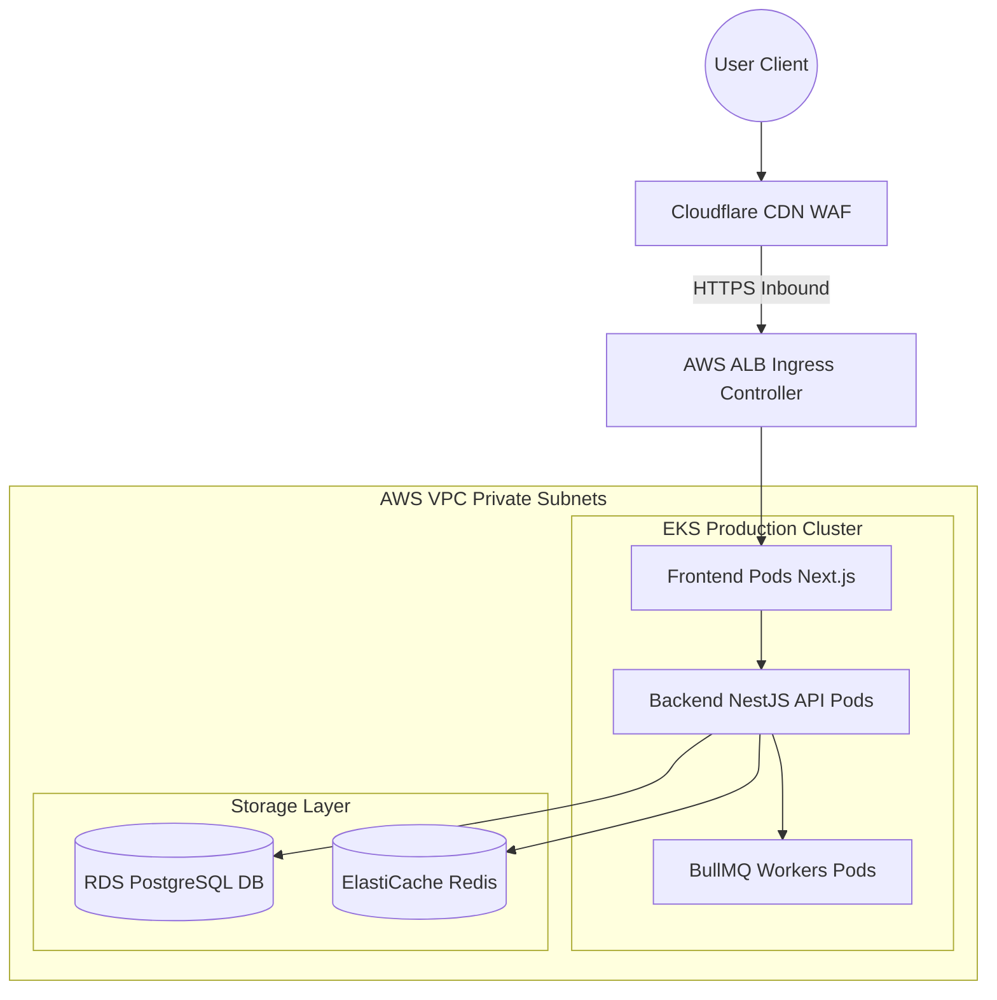
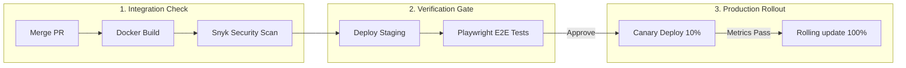
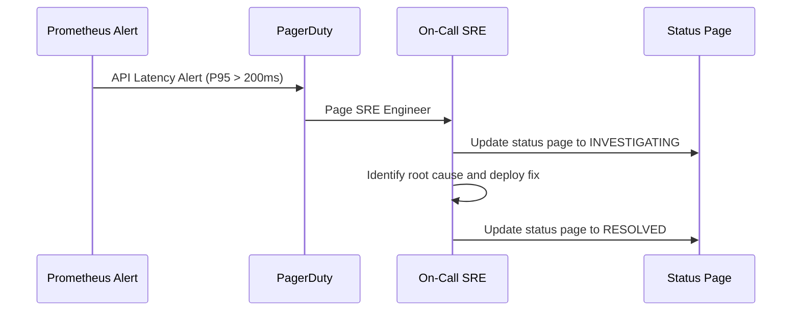
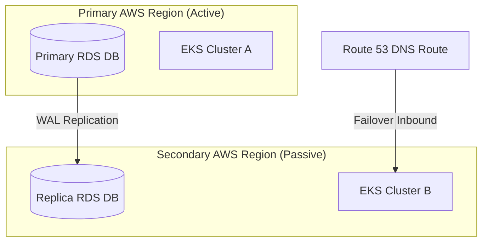
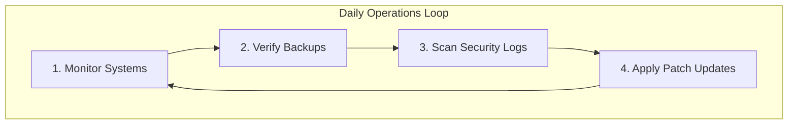

# PRODUCTION LAUNCH BLUEPRINT

**Project Name:** Enterprise SaaS Business Management Platform  
**Document Version:** 1.0.0 — Baseline Standard  
**Date:** July 14, 2026  
**Authors:** Chief Technology Officer (CTO), Site Reliability Engineer (SRE), Release Manager, Cloud Architect, Security Lead, and Enterprise SaaS Operations Expert  
**Classification:** Internal — Confidential  
**Phase:** 22.6 — Production Launch Blueprint  

---

## Table of Contents

1. [Executive Summary](#1-executive-summary)
2. [Production Readiness Foundation](#2-production-readiness-foundation)
3. [Release Management Strategy](#3-release-management-strategy)
4. [Production Environment Architecture](#4-production-environment-architecture)
5. [Go-Live Checklist](#5-go-live-checklist)
6. [Deployment Strategy](#6-deployment-strategy)
7. [Database Production Setup](#7-database-production-setup)
8. [Security Final Review](#8-security-final-review)
9. [Monitoring & Observability Setup](#9-monitoring--observability-setup)
10. [Incident Response Plan](#10-incident-response-plan)
11. [Backup & Disaster Recovery](#11-backup--disaster-recovery)
12. [SLA & Reliability Model](#12-sla--reliability-model)
13. [Production Operations Team](#13-production-operations-team)
14. [Customer Support Operations](#14-customer-support-operations)
15. [Performance Management](#15-performance-management)
16. [Cost Management & Governance](#16-cost-management--governance)
17. [Post-Launch Improvement Cycle](#17-post-launch-improvement-cycle)
18. [Production Success Metrics](#18-production-success-metrics)
19. [SaaS Operations Model](#19-saas-operations-model)
20. [Future Production Evolution](#20-future-production-evolution)
21. [Final Production Blueprints (Mermaid)](#21-final-production-blueprints-mermaid)
22. [Implementation Summary](#22-implementation-summary)

---

## 1. Executive Summary

### 1.1 Document Purpose
This document establishes the **Production Launch Blueprint** (Phase 22.6). It integrates and synthesizes the implementation strategies for the backend database, frontend UI, DevOps pipelines, and quality engineering plans into a production launch strategy. It provides checklists, incident runbooks, deployment guides, and disaster recovery procedures to ensure a stable, secure, and performant production launch.

### 1.2 Launch Methodology
The launch process uses a phased rollout strategy, validating system stability in production before migrating live business workloads:
1.  **Stage 1: Internal Sandbox Testing:** Run automated smoke tests, load verification scripts, and security scans in isolated production sandboxes.
2.  **Stage 2: Beta Partner Run:** Onboard selected early-adopter tenants to validate core workflows under real-world usage conditions.
3.  **Stage 3: Phased Canary Traffic Scale:** Route production traffic incrementally to the production environment, verifying cluster metrics at each step.
4.  **Stage 4: Full Production Cutover:** Redirect DNS routes to the production environment and activate monitoring systems.

---

## 2. Production Readiness Foundation

Before a feature or service is deployed to production, it must pass four readiness evaluation gates to verify stability:

```
  SYSTEM READY              SECURITY READY           PERFORMANCE READY
┌──────────────┐        ┌──────────────┐        ┌──────────────┐
│ Compiles,    │ ───►   │ CVE checks,  │ ───►   │ Load tests   │
│ unit tests   │        │ RLS policies,│        │ pass, latency│
│ pass in CI   │        │ mTLS verified│        │ targets met  │
└──────────────┘        └──────────────┘        └──────────────┘
                                                       │
                                                       ▼
                                                OPERATIONS READY
                                                ┌──────────────┐
                                                │ Runbooks in  │
                                                │ place, logs  │
                                                │ streaming    │
                                                └──────────────┘
```

---

## 3. Release Management Strategy

Code modifications follow a structured release process through isolated environments before deployment:

```
  DEVELOPMENT               QA / TESTING               STAGING
┌──────────────┐        ┌──────────────┐        ┌──────────────┐
│ Commit changes│ ───►   │ Automated    │ ───►   │ Production   │
│ in monorepo  │        │ integration  │        │ clone checks,│
│ branch local │        │ verification │        │ UAT validation│
└──────────────┘        └──────────────┘        └──────────────┘
                                                       │
                                                       ▼
                                                  PRODUCTION
                                                ┌──────────────┐
                                                │ Canary sync, │
                                                │ error check, │
                                                │ DNS cutover  │
                                                └──────────────┘
```

---

## 4. Production Environment Architecture

The production environment isolates customer traffic and secures resource pools in dedicated subnets:

```
   User Traffic (Inbound)
         │
         ▼
  [Cloudflare WAF / CDN Edge]
         │
         ▼
  [AWS Application Load Balancer] (Public Subnets)
         │
         ▼
  [EKS Node Groups: Private Subnets]
         ├── Web / Page rendering Pods (Next.js)
         ├── Business API Services Pods (NestJS)
         └── Kafka event brokers & workers
         │
         ▼
  [Database & Cache Isolation Subnets]
         ├── RDS PostgreSQL Instance (Multi-AZ Active-Passive)
         ├── ElastiCache Redis Cluster
         └── AWS S3 secure objects storage
```

---

## 5. Go-Live Checklist

The following checklists must be completed and signed off before launching the production environment:

### 5.1 Infrastructure & Networking
*   [ ] Configure AWS Route 53 DNS latency routing policies.
*   [ ] Verify Cloudflare WAF configurations, SSL certificates, and DDoS settings.
*   [ ] Verify AWS EKS autoscaling node configurations and pod limits.

### 5.2 Database Setup
*   [ ] Verify PostgreSQL multi-AZ replication status and PgBouncer connection limits.
*   [ ] Confirm daily database backup jobs and test point-in-time recovery (PITR) restore workflows.
*   [ ] Verify PostgreSQL row-level security (RLS) policies and tenant isolation rules.

### 5.3 Security Verification
*   [ ] Complete external penetration testing audits and resolve vulnerabilities.
*   [ ] Mount secrets from AWS Secrets Manager; rotate development credentials.
*   [ ] Restrict cross-namespace communications using EKS NetworkPolicies.

### 5.4 Monitoring & Observability
*   [ ] Configure Prometheus metrics, Loki log streams, and Tempo tracing links.
*   [ ] Set PagerDuty notification routes and configure alerting thresholds on Grafana dashboards.
*   [ ] Verify system error logging configurations.

---

## 6. Deployment Strategy

Production releases use a **Canary Release** strategy to minimize deployment risk:

*   **Canary Steps:** Route 10% of user traffic to the new release for 1 hour. If error rates remain below targets, scale the deployment to 100% using rolling updates.
*   **Automated Rollbacks:** ArgoCD automatically rolls back the deployment if the endpoint error rate (HTTP 5xx) increases by more than 1% during verification.
*   **Bypass Rule:** Critical security patches bypass canary verification steps, routing directly to rolling updates after staging validations.

---

## 7. Database Production Setup

The production database is optimized to handle high transaction volumes:

*   **Connection Pooling:** PgBouncer limits connections to protect database resources.
*   **Performance Tuning:** Database memory settings are optimized based on server resources (e.g., `shared_buffers` set to 25% of system RAM).
*   **Backup Strategy:** Run automated daily database snapshot backups, keeping copies in isolated S3 buckets for 30 days.

---

## 8. Security Final Review

The security team validates system access controls and data protection mechanisms before launch:

*   **Authentication Validation:** Confirm OAuth login redirection flows, Keycloak JWKS public key validation, and token rotation rules.
*   **Authorization Scope Verification:** Test roles and permissions, checking that unauthorized API endpoints return HTTP 403.
*   **Data Encryption Check:** Verify that sensitive database columns are stored using envelope encryption keys.

---

## 9. Monitoring & Observability Setup

Telemetry pipelines gather system health indicators and stream them to Grafana:

```
  SYSTEM SOURCE             LOG AGENT                STORAGE ENGINE
┌──────────────┐        ┌──────────────┐        ┌──────────────┐
│ App / Pods   │ ───►   │ Promtail /   │ ───►   │ Loki /       │
│ stdout stream│        │ FluentBit    │        │ Prometheus   │
└──────────────┘        └──────────────┘        └──────────────┘
                                                       │
                                                       ▼
                                                   DASHBOARD UI
                                                  ┌──────────────┐
                                                  │ Grafana      │
                                                  │ metrics and  │
                                                  │ alerts panel │
                                                  └──────────────┘
```

---

## 10. Incident Response Plan

System alerts trigger a structured incident response workflow to ensure fast resolution:

```
  ALERT RECEIVED            TRIAGE & LOCK            INVESTIGATION
┌──────────────┐        ┌──────────────┐        ┌──────────────┐
│ Grafana/Loki │ ───►   │ Page on-call │ ───►   │ Locate logs  │
│ triggers     │        │ SRE and lock │        │ and traces   │
│ alert email  │        │ issue ticket │        │ in dashboard │
└──────────────┘        └──────────────┘        └──────────────┘
                                                       │
                                                       ▼
                                                FIX & POSTMORTEM
                                                ┌──────────────┐
                                                │ Apply fix,   │
                                                │ run post-    │
                                                │ mortem checks│
                                                └──────────────┘
```

---

## 11. Backup & Disaster Recovery

Disaster recovery plans target rapid service restoration during outages:

*   **Database Restore Procedures:** RDS backup snapshot restore workflows are tested weekly to verify restoration speed.
*   **Data Recovery SLA:** RTO is set to 4 hours; RPO is set to 1 hour.
*   **Secondary Region Failover:** Run active-passive database replicas in a secondary AWS region, supporting Route 53 DNS redirection if the primary region goes offline.

---

## 12. SLA & Reliability Model

The platform commits to service level agreements (SLAs) to guarantee system reliability:

*   **Uptime Target:** Guarantee API availability uptime >= 99.9% (excluding scheduled maintenance windows).
*   **API Latency SLA:** P95 response times must remain below 200ms.
*   **Support Response Time SLA:** Critical issues must receive a first response within 1 hour.

---

## 13. Production Operations Team

Operational responsibilities are distributed across engineering roles:

```
                        PRODUCTION OPERATIONS
┌────────────────────────────────────────────────────────────────────────┐
│  Site Reliability Engineer (SRE)                                       │
│  • Manages system uptime, incident response, and alerts.               │
├────────────────────────────────────────────────────────────────────────┤
│  DevOps Engineer                                                       │
│  • Manages CI/CD pipelines, container configurations, and IaC scripts. │
├────────────────────────────────────────────────────────────────────────┤
│  Backend / Database Engineer                                           │
│  • Monitors database performance and resolves code issues.             │
├────────────────────────────────────────────────────────────────────────┤
│  Security Engineer                                                     │
│  • Audits credentials, manages certificates, and monitors logs.        │
└────────────────────────────────────────────────────────────────────────┘
```

---

## 14. Customer Support Operations

The customer support team coordinates communication during incidents:

*   **Ticketing Integration:** Customer tickets feed directly into Zendesk systems to coordinate L1/L2 escalation pathways.
*   **Status Page Management:** Incidents are updated on a public status page to communicate system state to customers.
*   **Feedback Loops:** Product issues are logged in Jira to prioritize bug fixes and feature updates.

---

## 15. Performance Management

Monitoring systems track performance metrics to ensure system health:

*   **API Latency Metrics:** Grafana panels track P95 and P99 API latencies.
*   **Database CPU Load:** Prometheus monitors database CPU usage and active connection counts.
*   **Liveness Probes:** Kubernetes liveness probes restart unhealthy pods automatically.

---

## 16. Cost Management & Governance

Cloud resource configurations are optimized regularly to control costs:

*   **Autoscaling Scale-Down Policies:** Compute nodes scale down automatically during off-peak hours to reduce host usage.
*   **Storage Tiering:** Database log files are archived to lower-cost S3 storage after 90 days.
*   **API Rate Limits:** Enforce rate-limiting policies to prevent system resource abuse and manage infrastructure costs.

---

## 17. Post-Launch Improvement Cycle

Operations follow a continuous feedback loop to drive ongoing system improvements:

```
       [Build] ──► Deploy updates.
          ▲             │
          │             ▼
      [Measure] ◄── [Analyze] ──► Audit system usage and error logs.
```

---

## 18. Production Success Metrics

Platform operations track metrics across four categories to evaluate launch success:

| Metric Category | Metric | Target SLA |
| :--- | :--- | :--- |
| **Availability** | System Uptime | >= 99.9% Uptime |
| **Performance** | API Latency | P95 <= 200ms |
| **Delivery** | Deployment Frequency | Zero-downtime canary updates |
| **Security** | Vulnerability Count | Zero critical vulnerabilities |

---

## 19. SaaS Operations Model

Daily operations follow structured schedules to maintain system health:

*   **Daily Log Checks:** SREs review error logs and investigate anomaly reports.
*   **Weekly Backups Verification:** Test database snapshot restores on staging clusters to verify backup validity.
*   **Monthly Security Scanning:** Run vulnerability scans and rotate cloud credentials.

---

## 20. Future Production Evolution

The production architecture evolves to support global scaling:

*   **Single Region Setup (MVP)**  
    Launch the core platform in a single AWS region using multi-AZ deployments.
*   **Active-Passive Multi-Region (Growth)**  
    Deploy active-passive database replicas in a secondary region to support disaster recovery failovers.
*   **Active-Active Multi-Region (Enterprise)**  
    Scale database replication to active-active configurations using Global Databases, routing traffic dynamically based on latency.

---

## 21. Final Production Blueprints (Mermaid)

### 21.1 Production Architecture



### 21.2 Release Pipeline



### 21.3 Incident Response Flow



### 21.4 Disaster Recovery Model



### 21.5 SaaS Operations Lifecycle



---

## 22. Implementation Summary

### 22.1 Core Platform Progress Dashboard

| Component | Architecture Document | Status |
| :--- | :--- | :--- |
| **Phase 22.1** | Enterprise Implementation Roadmap Foundation | ✅ Complete |
| **Phase 22.2** | Database & Backend Implementation Strategy | ✅ Complete |
| **Phase 22.3** | Frontend & UX Implementation Strategy | ✅ Complete |
| **Phase 22.4** | DevOps & Cloud Deployment Plan | ✅ Complete |
| **Phase 22.5** | Testing & Quality Engineering Plan | ✅ Complete |
| **Phase 22.6** | Production Launch Blueprint | ✅ Complete (this document) |

---

## Document Control

| Field | Value |
|---|---|
| **Document ID** | SBMP-OPS-22.6-LAUNCH-BLUEPRINT |
| **Version** | 1.0.0 |
| **Status** | APPROVED — Baseline |
| **Owner** | Chief Technology Officer |
| **Reviewed By** | SRE Lead, Release Manager, DevOps Lead, PMO Director |
| **Review Cycle** | Quarterly |
| **Next Review** | October 2026 |

---

*Phase 22.6 — Production Launch Blueprint | SaaS Business Management Platform*  
*Enterprise Confidential — © 2026 All Rights Reserved*
