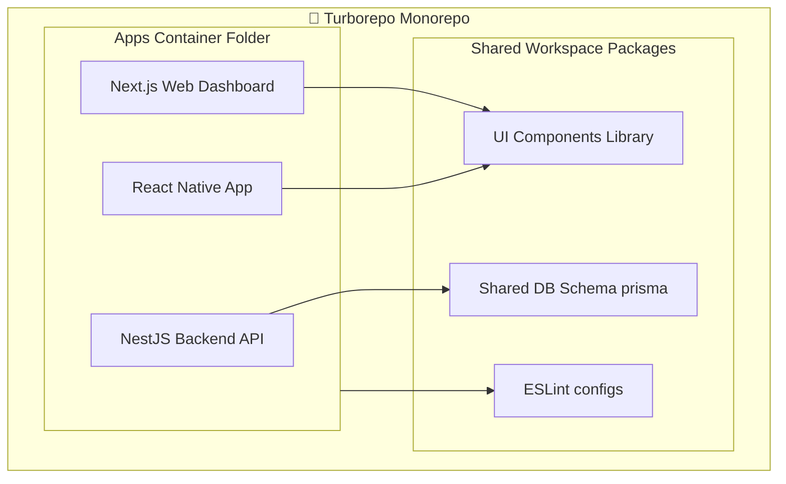
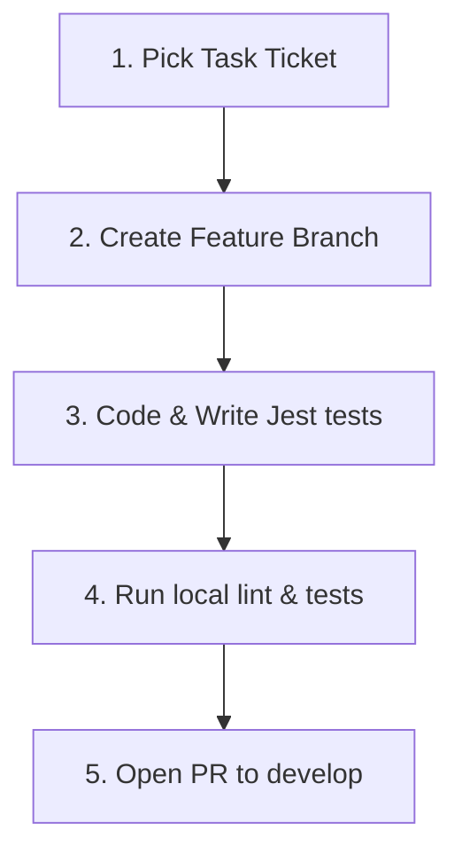
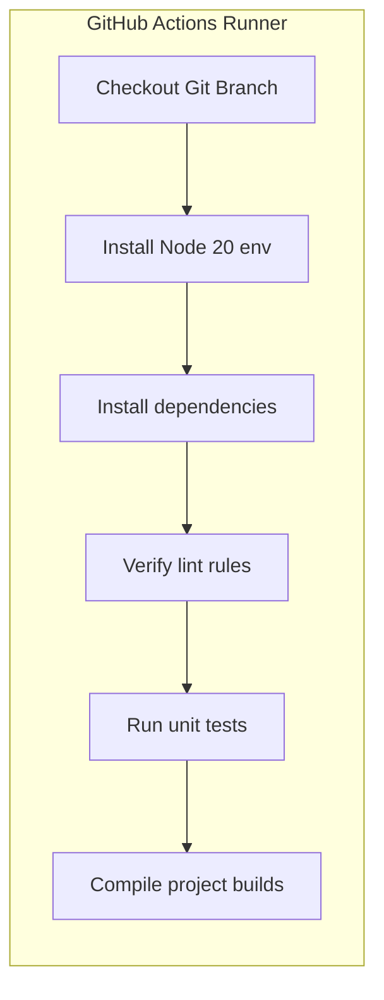
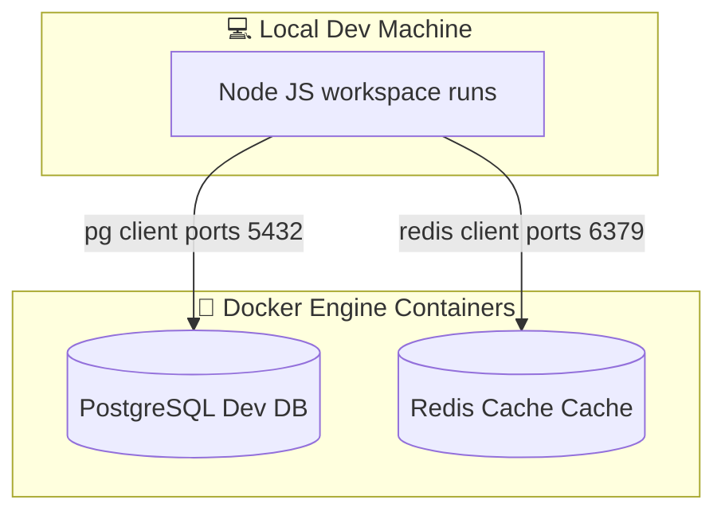
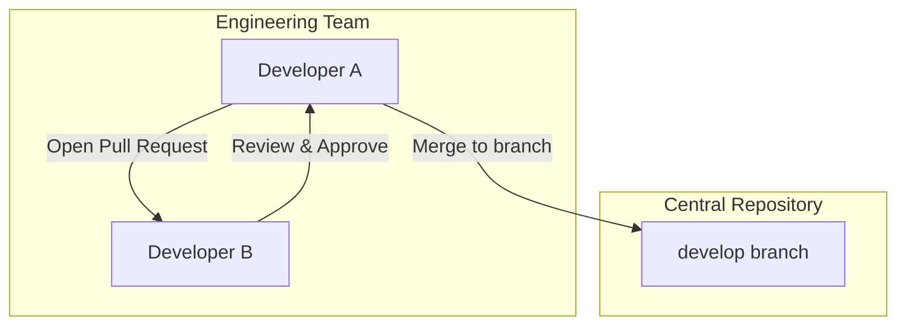

# PROJECT REPOSITORY & DEVELOPMENT FOUNDATION

**Project Name:** Enterprise SaaS Business Management Platform  
**Document Version:** 1.0.0 — Baseline Standard  
**Date:** July 14, 2026  
**Authors:** Principal Software Engineer, Solution Architect, Engineering Manager, DevOps Engineer, and Enterprise Development Lead  
**Classification:** Internal — Confidential  
**Phase:** 23.1 — Project Repository & Development Foundation  

---

## Table of Contents

1. [Executive Summary](#1-executive-summary)
2. [Repository Strategy Comparison](#2-repository-strategy-comparison)
3. [Monorepo Project Structure](#3-monorepo-project-structure)
4. [Backend Foundation Setup](#4-backend-foundation-setup)
5. [Frontend Foundation Setup](#5-frontend-foundation-setup)
6. [Mobile Foundation Setup](#6-mobile-foundation-setup)
7. [Database Foundation Setup](#7-database-foundation-setup)
8. [Local Development Environment](#8-local-development-environment)
9. [Configuration Management](#9-configuration-management)
10. [Coding Standards](#10-coding-standards)
11. [Git Branching Workflow](#11-git-branching-workflow)
12. [Commit Conventions](#12-commit-conventions)
13. [Code Review & PR Process](#13-code-review--pr-process)
14. [Development Tools](#14-development-tools)
15. [Documentation Structure](#15-documentation-structure)
16. [Security Foundation](#16-security-foundation)
17. [Continuous Integration (CI) Foundation](#17-continuous-integration-ci-foundation)
18. [Team Development Journey](#18-team-development-journey)
19. [Initial Project Onboarding Checklist](#19-initial-project-onboarding-checklist)
20. [First Development Milestone](#20-first-development-milestone)
21. [Final Foundation Blueprints (Mermaid)](#21-final-foundation-blueprints-mermaid)
22. [Implementation Summary](#22-implementation-summary)

---

## 1. Executive Summary

### 1.1 Document Purpose
This document establishes the **Project Repository & Development Foundation** (Phase 23.1). It initiates the execution plan for the SaaS Business Management Platform. It delivers concrete coding standards, monorepo workspaces (Turborepo), configuration mappings, local docker development environments, git branching policies, and initial CI workflows.

### 1.2 Execution Objectives
*   **Establish the Code Repository:** Deploy a Turborepo monorepo configuration that organizes the Next.js frontend, NestJS backend, and React Native mobile applications.
*   **Configure Local Environments:** Deliver a docker-compose setup to provision local PostgreSQL databases, Redis cache servers, and local emulators.
*   **Enforce Standards:** Configure ESLint, Prettier, and Husky Git hooks to enforce coding guidelines before commits are made.

---

## 2. Repository Strategy Comparison

We compare monorepos and multi-repos to select the most suitable repository architecture:

| Dimension | Monorepo (Selected) | Multi-Repository |
| :--- | :--- | :--- |
| **Dependency Management** | * Atomic updates across projects.<br/>* Single lockfile reduces version drift. | * Independent dependency updates.<br/>* Risk of interface version drift. |
| **Code Reuse** | * Share types and configurations easily without npm registries. | * Shared code must be published to private registries. |
| **CI/CD Pipelines** | * Shared CI configurations.<br/>* Incremental builds reduce compilation times. | * Decoupled pipeline runtimes.<br/>* Difficult to test cross-service changes. |
| **Operational Overhead**| * High initial setup complexity.<br/>* Large repository sizes. | * Lower initial setup complexity.<br/>* Multiple repositories to maintain. |

### 2.1 Recommendation: Turborepo Monorepo
We select a **Turborepo Monorepo** using npm workspaces. This architecture simplifies shared type definitions (e.g., matching Prisma DB types directly to frontend clients), synchronizes dependency versions, and leverages build caching to speed up CI/CD pipeline runs.

---

## 3. Monorepo Project Structure

The platform monorepo workspace organizes apps, packages, infrastructure, scripts, and documentation:

```
/saas-platform
  ├── /apps
  │     ├── /backend            (NestJS API Application Service)
  │     ├── /web                (Next.js Client Web Dashboard App)
  │     └── /mobile             (React Native Mobile Application code)
  ├── /packages
  │     ├── /ui-library         (React Tailwind UI design system library)
  │     ├── /shared-types       (Prisma schema client and shared DTO types)
  │     └── /eslint-config      (Shared ESLint lint rule packages)
  ├── /infrastructure
  │     ├── /docker-compose.yml (Local db, redis, and catalog setups)
  │     └── /terraform          (Terraform infrastructure deployment setups)
  ├── /docs                     (System architecture docs and design assets)
  ├── /scripts                  (Local build, seed, and tooling scripts)
  ├── package.json              (Workspace root dependencies lockfile)
  └── turbo.json                (Turborepo pipeline caching rules)
```

---

## 4. Backend Foundation Setup

The NestJS backend application initializes with a modular configuration system to manage dependencies:

*   **NestJS Initialization:** Initialized with the `@nestjs/cli` tool using TypeScript execution parameters.
*   **Modular Architecture:** NestJS divides modules by domains (e.g., `AuthModule`, `TenantModule`, `BillingModule`), keeping concerns separated.
*   **Configuration System:** Uses the `@nestjs/config` library to load environment variables, using Joi schemas to validate configurations at startup.
*   **Prisma Database Connection:** Mounts the Prisma client service in a global module, configuring connection pooling limits and logging parameters.

---

## 5. Frontend Foundation Setup

The Next.js client web application initializes with Tailwind CSS and TanStack React Query to manage rendering and data caching:

*   **Next.js Initialization:** Initialized using Next.js 14 App Router, supporting Server-Side Rendering (SSR) and Client-Side Hydration.
*   **Routing System:** Organized using folder-based routing, mapping pages dynamically to nested paths (e.g., `/app/invoices/page.tsx`).
*   **Tailwind CSS Integration:** Configured with Tailwind CSS directives using tokens defined in the shared ui-library package.
*   **React Query API Client:** Integrated in the App wrapper (`_app.tsx` / `layout.tsx`) to manage server state synchronization.

---

## 6. Mobile Foundation Setup

The React Native mobile application initializes with React Navigation and local caching databases:

*   **React Native Initialization:** Initialized using React Native CLI (TypeScript template), target SDK levels set to iOS 15+ and Android 12+.
*   **Routing Navigation:** Configured with `@react-navigation/native` to handle screen stacks and tab bars.
*   **Offline Cache Store:** Integrated with WatermelonDB to store data locally and support offline usage.
*   **API Client Connection:** Uses Axios instances configured with interceptors to inject authorization headers.

---

## 7. Database Foundation Setup

The database system uses Prisma ORM to manage schemas and migration files:

*   **PostgreSQL Setup:** Runs on local Docker containers during development; RDS PostgreSQL instances run in production.
*   **Prisma Schema Files:** Database tables are declared in a shared schema file (`/packages/shared-types/schema.prisma`).
*   **Migration Management:** Database updates are managed using `prisma migrate dev` command queues.
*   **Development Seeding:** Database seeds populate initial records (e.g., permissions, admin roles, mock tenants) for local development.

---

## 8. Local Development Environment

The development environment runs local dependencies using Docker Compose, providing consistent runtimes across developer machines:

```yaml
version: '3.8'

services:
  postgres:
    image: postgres:15-alpine
    container_name: saas_dev_db
    ports:
      - "5432:5432"
    environment:
      POSTGRES_DB: saas_platform_dev
      POSTGRES_USER: saas_dev_user
      POSTGRES_PASSWORD: saas_secure_password
    volumes:
      - pgdata:/var/lib/postgresql/data

  redis:
    image: redis:7-alpine
    container_name: saas_dev_redis
    ports:
      - "6379:6379"
    volumes:
      - redisdata:/data

volumes:
  pgdata:
  redisdata:
```

---

## 9. Configuration Management

Environment variables are managed using isolated `.env` configuration files:

*   **Variables Template:** A `.env.example` file is committed to the repository, defining required keys without sensitive values.
*   **Validation Rules:** Backend config modules run Joi schemas at startup to check for required parameters (e.g., `DATABASE_URL`, `KEYCLOAK_ISSUER`).
*   **Secrets Isolation:** Developer API keys are stored in AWS Secrets Manager; local variables use Git-ignored `.env` files.

---

## 10. Coding Standards

The monorepo enforces coding standards at the workspace root using linting and formatting tools:

*   **TypeScript Configuration:** Configured with `tsconfig.json` rules, setting `strict: true` and `noImplicitAny: true`.
*   **Code Linting (ESLint):** Bounded packages share a unified `.eslintrc.js` configuration.
*   **Code Formatting (Prettier):** Enforces code formatting rules (singleQuotes, semi, tabWidth: 2) on file saves.
*   **Husky Git Hooks:** Executed on commit attempts to run linters and formatting checks before code is committed.

---

## 11. Git Branching Workflow

Branch development follows the Git branching workflow to organize parallel release tracks:

```
       [feature/ticket-101] ──► (Create code, run local tests)
              │
              ▼
[develop] ◄── Pull Request (Requires review and passing green CI)
    │
    ▼
[release/v*] ──► (Staging deployment, QA validations, bugfixes)
    │
    ▼
[main] ◄────── Deployment to Production
```

*   **Branch Conventions:** Feature branches use standardized naming patterns (e.g., `feature/ticket-id-description`).

---

## 12. Commit Conventions

Git commit messages follow the Conventional Commits specification to support automated changelog generation:

```
<type>(<scope>): <short summary description>

[optional body details]

[optional footer details]
```

### 12.1 Commit Categories
*   `feat`: A new feature or endpoint.
*   `fix`: A bug fix or security patch.
*   `docs`: Documentation updates.
*   `test`: Adding or refactoring test cases.
*   `refactor`: Restructuring code without changing behavior.

---

## 13. Code Review & PR Process

Pull Requests must pass three automated check gates before being merged:

```
  CREATE PR                 AUTOMATED CI             CODE REVIEW
┌──────────────┐        ┌──────────────┐        ┌──────────────┐
│ Open PR to   │ ───►   │ Lint check,  │ ───►   │ Requires at  │
│ develop      │        │ unit tests,  │        │ least two approvals│
│ branch       │        │ build checks │        │ from team    │
└──────────────┘        └──────────────┘        └──────────────┘
                                                       │
                                                       ▼
                                                 MERGE DEVELOP
                                                ┌──────────────┐
                                                │ Merge branch │
                                                │ and delete   │
                                                │ feature      │
                                                └──────────────┘
```

---

## 14. Development Tools

Engineering teams use standardized tools to manage development and testing:

*   **Integrated Development Environment (IDE):** VS Code configured with ESLint and Prettier plugins.
*   **Database Client:** DBeaver or pgAdmin to inspect local PostgreSQL tables.
*   **API Testing Tool:** Bruno or Postman to test API controllers.
*   **Docker Desktop:** Manages local container instances.

---

## 15. Documentation Structure

Platform documentation is organized into markdown directories:

*   `/docs/architecture`: System design records and sequence diagrams.
*   `/docs/api`: OpenAPI JSON specifications and Postman collections.
*   `/docs/database`: Schema dictionaries and database relationship maps.
*   `/docs/operations`: Docker configurations and SRE incident guides.
*   `/docs/development`: Local setup guides and code style reference sheets.

---

## 16. Security Foundation

Development pipelines apply multiple security rules to protect source code and credentials:

*   **Secrets Scanning:** GitGuardian hooks scan code files to prevent AWS keys or passwords from being committed.
*   **Dependency Auditing:** Snyk scans project dependencies for security vulnerabilities daily.
*   **Workspace Tenancy Isolation:** Developers configure local databases using isolated credentials to prevent access collisions.

---

## 17. Continuous Integration (CI) Foundation

The initial CI workflow executes on every pull request to verify compilation safety:

```yaml
name: CI Foundation Pipeline
on: [pull_request]

jobs:
  verify:
    runs-on: ubuntu-latest
    steps:
      - name: Checkout Code
        uses: actions/checkout@v4

      - name: Setup Node.js
        uses: actions/setup-node@v4
        with:
          node-size: 20
          cache: 'npm'

      - name: Install Dependencies
        run: npm ci

      - name: Run ESLint
        run: npm run lint

      - name: Run Unit Tests
        run: npm run test

      - name: Compile Monorepo Projects
        run: npm run build
```

---

## 18. Team Development Journey

Feature development follows a standard workflow to coordinate team actions:

*   **Task Assignment:** Developers pull tickets from the planning board.
*   **Local Setup:** Pull the latest `develop` commits and run `npm ci` updates.
*   **Feature Coding:** Write feature code, add matching Jest test cases, and verify logic.
*   **Pipeline Run:** Confirm all local tests and lint checks pass before creating PRs.
*   **Review & Merge:** Address review feedback, resolve conflicts, and merge to develop.

---

## 19. Initial Project Onboarding Checklist

The onboarding checklist helps developers set up their local environment:

*   [ ] Clone the Git monorepo.
*   [ ] Install Node.js 20 and Docker Desktop.
*   [ ] Run `npm install` at the workspace root.
*   [ ] Run `docker-compose up -d` to launch database containers.
*   [ ] Run `npm run migrate:dev` to run migrations and seed data.
*   [ ] Run `npm run dev` to start local development servers.

---

## 20. First Development Milestone

The first development milestone establishes a verified foundation before implementing business modules:

| Deliverable | Target Metric | Verification Method |
| :--- | :--- | :--- |
| **Backend NestJS Core** | Active DB connection | Start server, execute health check endpoint |
| **Frontend Next.js app** | UI token validation | Launch app dashboard interface |
| **Database Migrations** | Initial schema deployed | Verify migrations history table |
| **CI/CD Pipeline** | Automated checks pass | Verify GitHub Actions pipeline runs |

---

## 21. Final Foundation Blueprints (Mermaid)

### 21.1 Monorepo Architecture



### 21.2 Development Workflow



### 21.3 CI Pipeline



### 21.4 Local Development Environment



### 21.5 Team Collaboration Flow



---

## 22. Implementation Summary

### 22.1 Foundation Setup Dashboard

| Component | Target Timeline | Status |
| :--- | :--- | :--- |
| Monorepo structure creation | Week 1 | Planned |
| Docker Compose local database config | Week 1 | Planned |
| NestJS app initialization | Week 1 | Planned |
| Prisma DB schema generation | Week 2 | Planned |

---

## Document Control

| Field | Value |
|---|---|
| **Document ID** | SBMP-EXEC-23.1-REPO-FOUNDATION |
| **Version** | 1.0.0 |
| **Status** | APPROVED — Baseline |
| **Owner** | Enterprise Development Lead |
| **Reviewed By** | Principal Architect, Engineering Manager, DevOps Lead |
| **Review Cycle** | Quarterly |
| **Next Review** | October 2026 |

---

*Phase 23.1 — Project Repository & Development Foundation | SaaS Business Management Platform*  
*Enterprise Confidential — © 2026 All Rights Reserved*
