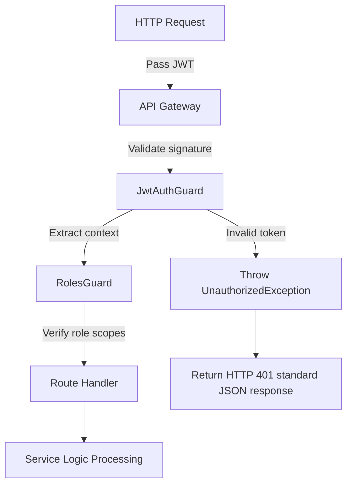
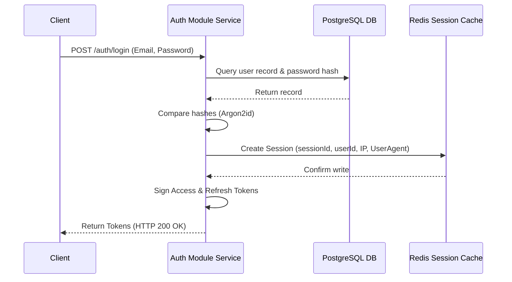
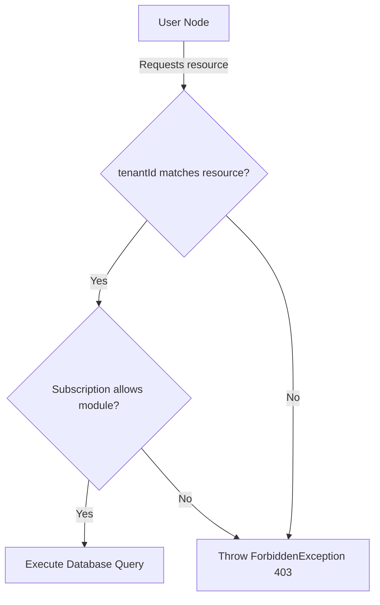
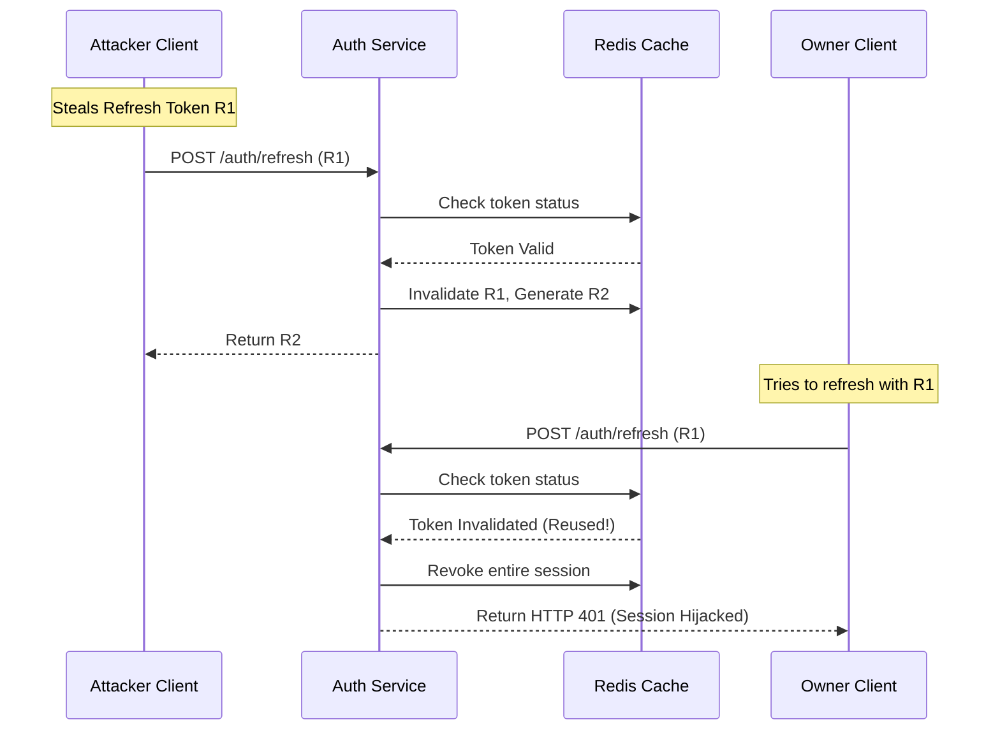
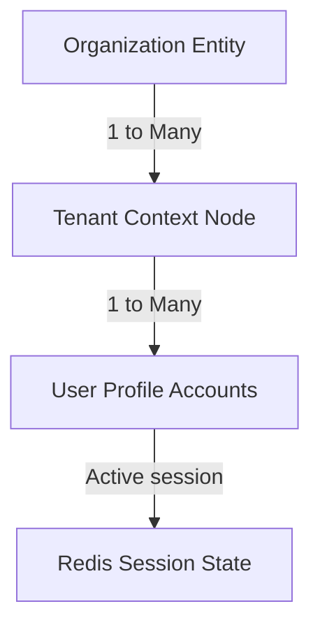

# AUTHENTICATION FOUNDATION & IDENTITY CORE ARCHITECTURE

**Project Name:** Enterprise SaaS Business Management Platform  
**Document Version:** 1.0.0 — Baseline Standard  
**Date:** July 14, 2026  
**Authors:** Principal Backend Architect, Security Architect, and NestJS Enterprise Engineer  
**Classification:** Internal — Confidential  
**Phase:** 23.10 — Authentication Foundation & Identity Core Architecture  

---

## Table of Contents

1. [Executive Summary](#1-executive-summary)
2. [Authentication Architecture Overview](#2-authentication-architecture-overview)
3. [Identity Architecture Design](#3-identity-architecture-design)
4. [Authentication Core Module Structure](#4-authentication-core-module-structure)
5. [Authentication Flow Design](#5-authentication-flow-design)
6. [JWT Architecture Design](#6-jwt-architecture-design)
7. [Password Security Architecture](#7-password-security-architecture)
8. [Session Management Architecture](#8-session-management-architecture)
9. [Multi-Tenant Authentication Design](#9-multi-tenant-authentication-design)
10. [Role-Based Authentication Foundation](#10-role-based-authentication-foundation)
11. [Security Protection Strategy](#11-security-protection-strategy)
12. [Authentication Integration Architecture](#12-authentication-integration-architecture)
13. [Authentication Architecture Diagrams](#13-authentication-architecture-diagrams)
14. [Enterprise Implementation Guidelines](#14-enterprise-implementation-guidelines)
15. [Implementation Summary](#15-implementation-summary)

---

## 1. Executive Summary

### 1.1 Document Purpose
This document establishes the **Authentication Foundation & Identity Core Architecture** (Phase 23.10). It details the core identity services, token models, session tracking mechanisms, and tenant isolation policies required to secure user access across the SaaS ecosystem.

---

## 2. Authentication Architecture Overview

### 2.1 Identity Management as a Core Platform Capability
Identity management forms the security backbone of the SaaS platform. It establishes user trust, enforces data isolation, and acts as the gatekeeper for all business transactions, integrations, and admin operations.

### 2.2 Core Concepts
*   **Authentication (AuthN):** Verification of who a user is (e.g., verifying credentials).
*   **Authorization (AuthZ):** Determination of what a user can access (e.g., validating permissions).
*   **Identity Management:** Lifecycle management of user credentials, profiles, and relationships.
*   **Access Control:** The enforcement mechanism restricting operations based on policies (e.g., RBAC, ABAC).

---

## 3. Identity Architecture Design

Identity resolution flows from raw credentials to granular business access:

```
┌──────┐     ┌──────────┐     ┌──────────────┐     ┌──────────────┐
│ User │ ──► │ Identity │ ──► │AuthN / AuthZ │ ──► │ Business     │
│ Node │     │ Service  │     │ Gateways     │     │ Module Scope │
└──────┘     └──────────┘     └──────────────┘     └──────────────┘
```

### 3.1 Identity Entities
*   **User Identity:** Represents the individual actor (e.g., email, profile details).
*   **Organization Identity:** Represents a parent business entity mapping multiple business units.
*   **Tenant Identity:** Represents the isolated multi-tenant slice (e.g., database schema context, storage path).
*   **Session Identity:** Represents a transient, active browser or device login instance.

---

## 4. Authentication Core Module Structure

The authentication module is located under `src/core/auth/`:

```
src/core/auth/
 ├── auth.module.ts            (Initializes authentication modules and Passport strategies)
 ├── auth.service.ts           (Handles credential checks, password validation, and token signing)
 ├── strategies/
 │    ├── jwt.strategy.ts      (Validates and decodes JWT payloads)
 │    ├── local.strategy.ts    (Validates initial username/password credentials)
 │    └── refresh.strategy.ts  (Validates session refresh tokens)
 ├── guards/
 │    ├── jwt-auth.guard.ts    (Blocks unauthenticated requests)
 │    └── roles.guard.ts       (Enforces role-based permissions)
 ├── decorators/
 │    ├── current-user.decorator.ts (Injects decoded user objects into route handlers)
 │    └── roles.decorator.ts   (Attaches allowed role arrays to route handlers)
 └── interfaces/
      └── auth-user.interface.ts (TypeScript interface representing authenticated users)
```

---

## 5. Authentication Flow Design

```
User Login ──► Verify Credentials ──► Check Password ──► Issue JWTs ──► Save Session (Redis) ──► Return tokens
```

1.  **User Login:** Client sends credentials via HTTPS POST.
2.  **Verify Credentials:** The module queries the user database to check account existence and status.
3.  **Password Validation:** Compares password hashes using Argon2id.
4.  **Generate Access Token:** Signs a short-lived access token with tenant scopes.
5.  **Generate Refresh Token:** Signs a rotating refresh token.
6.  **Store Session:** Registers the session details in Redis.
7.  **Return Response:** Sends tokens and expirations back to the client.

---

## 6. JWT Architecture Design

### 6.1 Token Lifespan
*   **Access Token:** 15 minutes.
*   **Refresh Token:** 7 days.

### 6.2 Token Payload Schema
```json
{
  "sub": "user-uuid-1111",
  "userId": "user-uuid-1111",
  "tenantId": "tenant-uuid-2222",
  "role": "TenantAdmin",
  "permissions": ["user:create", "billing:update"]
}
```

### 6.3 Lifecycle Management
*   **Token Rotation:** Old refresh tokens are invalidated immediately upon reuse.
*   **Token Revocation:** Tokens can be dynamically blacklisted in Redis to force logout.

---

## 7. Password Security Architecture

### 7.1 Hashing Specifications
*   **Algorithm:** Argon2id.
*   **Salting:** Every password hash uses a unique, cryptographically secure salt generated at hash runtime.

### 7.2 Hashing Matrix Comparison

| Attribute | bcrypt | Argon2id |
| :--- | :--- | :--- |
| **Primary Risk Defense** | CPU brute-forcing | GPU/ASIC brute-forcing |
| **Configurable Parameters** | Work factor (CPU) | Memory cost, Time cost, Parallelism |
| **Memory Hardness** | No | Yes (defends against custom hardware attacks) |
| **Recommendation** | Legacy Standard | **Enterprise Target** |

---

## 8. Session Management Architecture

### 8.1 Redis Session Ledger Schema
Active sessions are stored in Redis:

```json
{
  "sessionId": "session-uuid",
  "userId": "user-uuid",
  "deviceInfo": "Chrome Mac OS",
  "ipAddress": "192.168.1.1",
  "loginTime": "2026-07-14T03:03:11Z",
  "expiresAt": "2026-07-21T03:03:11Z"
}
```

### 8.2 Session Operations
*   **Multi-Device Login:** Allows users to log in from multiple devices while maintaining independent sessions.
*   **Dynamic Revocation:** Allows users to terminate sessions on other devices remotely.

---

## 9. Multi-Tenant Authentication Design

Users are linked to tenants and subscription plans:

```
User ──► belongs to ──► Tenant ──► bound by ──► Subscription Plan
```

*   **Tenant Context Propagation:** Request decoders inject the verified `tenantId` into the request context, enforcing Row-Level Security (RLS) policies.
*   **Module Enforcement:** Cross-references the tenant's active subscription to block requests to disabled feature modules.

---

## 10. Role-Based Authentication Foundation

The platform enforces a five-tier Role-Based Access Control (RBAC) model:

*   `SUPER_ADMIN`: Cross-tenant platform administrator.
*   `TENANT_ADMIN`: Administrator for a specific tenant scope.
*   `MANAGER`: Manager within a tenant scope.
*   `STAFF`: Operational staff.
*   `USER`: Standard end user.

---

## 11. Security Protection Strategy

*   **Brute-Force Protection:** Locks accounts for 30 minutes after 5 failed login attempts.
*   **Token Theft Mitigation:** Uses rotating refresh tokens to detect and mitigate hijack attempts.
*   **Session Hijacking Defense:** Validates changes in IP address and user-agent strings during token refreshes.

---

## 12. Authentication Integration Architecture

The authentication module integrates with core platform components:
*   **API Gateway:** Decodes JWTs at the edge to route requests.
*   **User Module:** Queries user profiles and password hashes.
*   **Tenant Module:** Verifies tenant status and subscription plans.
*   **Audit Log Module:** Logs critical identity events (e.g., failed logins, password changes).

---

## 13. Authentication Architecture Diagrams

### 13.1 Authentication & Authorization Request Flow



### 13.2 Login Flow & Session Storage



### 13.3 Multi-Tenant Access Validation



### 13.4 Session Hijack Detection Pipeline



### 13.5 Identity Inheritance Tree



---

## 14. Enterprise Implementation Guidelines

### 14.1 Folder Organization
Keep authentication decorators, guards, and strategies centralized under `src/core/auth/` to simplify security audits.

### 14.2 Production Security Standards
*   **HTTPS Only:** Tokens must only be transmitted over encrypted channels.
*   **Cookie Security:** Refresh tokens should be stored in `HttpOnly`, `Secure`, and `SameSite=Strict` cookies.

---

## 15. Implementation Summary

### 15.1 Authentication Setup Schedule

| Task | Target Timeline | Status |
| :--- | :--- | :--- |
| Set up Passport JWT strategies | Day 1 | Planned |
| Implement Argon2id password hash compare logic | Day 2 | Planned |
| Set up Redis session managers | Day 3 | Planned |
| Implement session hijack detection filters | Day 4 | Planned |

---

## Document Control

| Field | Value |
|---|---|
| **Document ID** | SBMP-BE-23.10-AUTH-IDENTITY |
| **Version** | 1.0.0 |
| **Status** | APPROVED — Baseline |
| **Owner** | Security Architect |
| **Reviewed By** | Principal Architect, Lead Developer, DevOps Director |
| **Review Cycle** | Quarterly |
| **Next Review** | October 2026 |

---

*Phase 23.10 — Authentication Foundation & Identity Core Architecture | SaaS Business Management Platform*  
*Enterprise Confidential — © 2026 All Rights Reserved*
