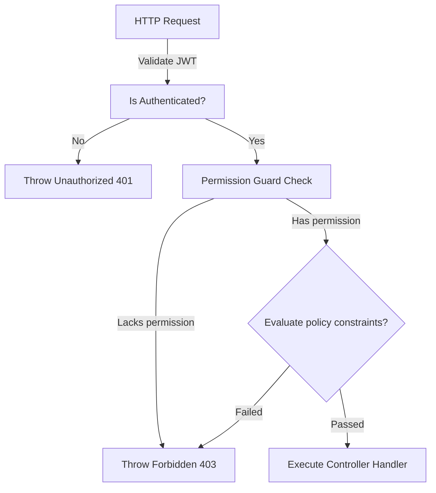
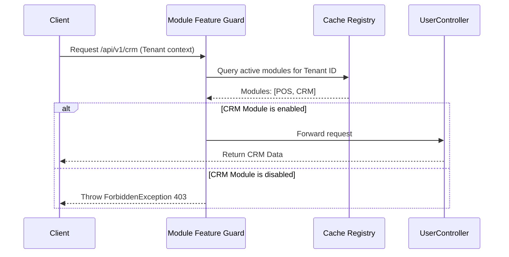
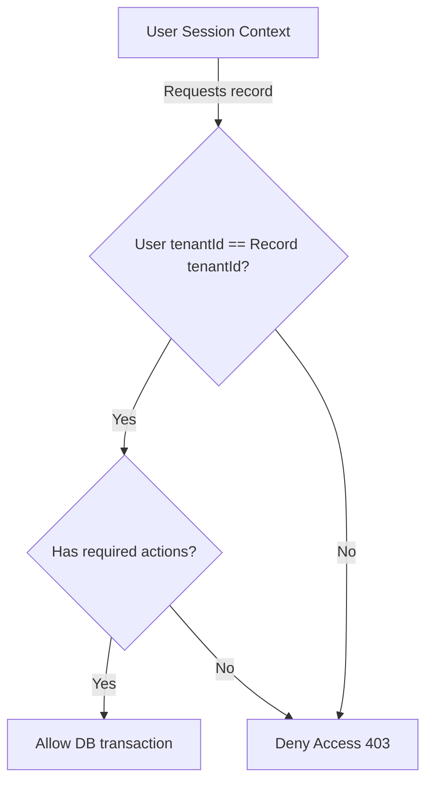
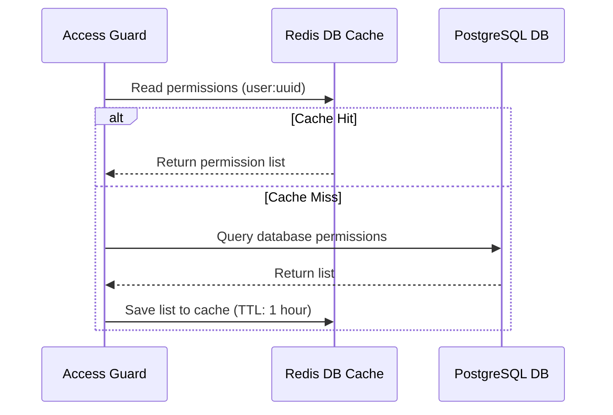
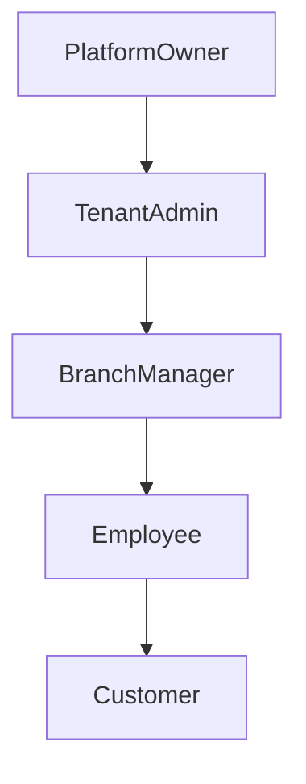

# AUTHORIZATION & PERMISSION MANAGEMENT ARCHITECTURE

**Project Name:** Enterprise SaaS Business Management Platform  
**Document Version:** 1.0.0 — Baseline Standard  
**Date:** July 14, 2026  
**Authors:** Principal Backend Architect, Security Architect, and NestJS Enterprise Engineer  
**Classification:** Internal — Confidential  
**Phase:** 23.11 — Authorization & Permission Management Architecture  

---

## Table of Contents

1. [Executive Summary](#1-executive-summary)
2. [Authorization Architecture Overview](#2-authorization-architecture-overview)
3. [Authorization Model Design](#3-authorization-model-design)
4. [Authorization Core Module Structure](#4-authorization-core-module-structure)
5. [RBAC Architecture Design](#5-rbac-architecture-design)
6. [Permission System Design](#6-permission-system-design)
7. [ABAC Architecture Design](#7-abac-architecture-design)
8. [Multi-Tenant Authorization Strategy](#8-multi-tenant-authorization-strategy)
9. [Permission Checking Flow](#9-permission-checking-flow)
10. [Permission Cache Strategy](#10-permission-cache-strategy)
11. [SaaS Module-Level Authorization](#11-saas-module-level-authorization)
12. [Security Considerations](#12-security-considerations)
13. [Authorization Architecture Diagrams](#13-authorization-architecture-diagrams)
14. [Enterprise Implementation Guidelines](#14-enterprise-implementation-guidelines)
15. [Implementation Summary](#15-implementation-summary)

---

## 1. Executive Summary

### 1.1 Document Purpose
This document establishes the **Authorization & Permission Management Architecture** (Phase 23.11). It details the RBAC/ABAC designs, policy enforcement guards, subscription-level module locks, and caching mechanisms required to secure multi-tenant SaaS features.

---

## 2. Authorization Architecture Overview

### 2.1 The Limits of Authentication
While authentication verifies identity (who is requestor), it does not control action permissions. Without authorization boundaries, authenticated users can manipulate data belonging to other tenants (IDOR) or execute unauthorized admin operations (privilege escalation).

### 2.2 Core Concepts
*   **Authentication (AuthN):** Establishes identity.
*   **Authorization (AuthZ):** Determines if the identity can execute an action.
*   **Permission:** The granular capability to execute an action on a resource.
*   **Role:** A collection of permissions assigned to users.
*   **Policy:** Context-sensitive rules (e.g., limit approvals based on metadata).

---

## 3. Authorization Model Design

Authorization flows through five distinct dimensions:

```
User ──► Roles ──► Permissions ──► Resource Targets ──► Executed Actions
```

### 3.1 Resource-Action Matrix Example
*   **Resource:** `Invoice`
*   **Actions:** `create`, `read`, `update`, `delete`, `approve`
*   **Manager Role:** Assigned all invoice actions.
*   **Staff Role:** Assigned `read` and `create` actions only.

---

## 4. Authorization Core Module Structure

The authorization components are located under `src/core/authorization/`:

```
src/core/authorization/
 ├── authorization.module.ts       (Initializes authorization modules and configures Casl module scopes)
 ├── authorization.service.ts      (Handles database queries and maps permissions to active sessions)
 ├── guards/
 │    ├── permissions.guard.ts     (Enforces permission boundaries on controllers)
 │    └── roles.guard.ts           (Enforces role boundaries on controllers)
 ├── decorators/
 │    ├── permissions.decorator.ts (Attaches target permissions to controllers)
 │    └── roles.decorator.ts       (Attaches target roles to controllers)
 ├── policies/
 │    ├── user.policy.ts           (Custom rules mapping user relationships)
 │    ├── tenant.policy.ts         (Enforces tenant boundaries)
 │    └── resource.policy.ts       (Enforces resource boundaries)
 └── interfaces/
      └── permission.interface.ts  (TypeScript interfaces representing permission entities)
```

---

## 5. RBAC Architecture Design

### 5.1 Hierarchical Roles
*   `PlatformOwner`: Full control across the entire platform.
*   `TenantAdmin`: Administrative access within a specific tenant context.
*   `BranchManager`: Operational control within a specific branch context.
*   `Employee`: Standard operations within a tenant context.
*   `Customer`: Read-only access to customer profiles and portals.

---

## 6. Permission System Design

### 6.1 Naming Convention
Permissions use the format `module.resource.action` (e.g., `pos.order.create`, `inventory.product.update`).

### 6.2 Data Schema Structure
```json
{
  "module": "pos",
  "resource": "order",
  "actions": ["create", "read", "update"]
}
```

---

## 7. ABAC Architecture Design

### 7.1 Attribute-Based Logic
Attribute-Based Access Control (ABAC) evaluates context-sensitive attributes at runtime. For example, a user can approve an invoice if:
*   Their role is `BranchManager`.
*   The invoice amount is less than `$5,000`.
*   The invoice belongs to the user's active tenant.

---

## 8. Multi-Tenant Authorization Strategy

The platform enforces strict tenant boundaries using a hierarchical isolation model:

```
User ──► Tenant ──► Branch ──► Module ──► Permission
```

*   **Tenant Separation:** Guards verify that `tenantId` parameters match active user session keys.
*   **Module Locking:** Blocks requests if the tenant's subscription plan does not include the target module.

---

## 9. Permission Checking Flow

```
HTTP Request ──► Verify JWT ──► Resolve Context ──► Verify Permissions ──► Evaluate Policies ──► Execute Service
```

1.  **JWT Verification:** Decodes JWT values.
2.  **Context Resolution:** Resolves user context variables.
3.  **Permission Check:** Guards verify if the user possesses the required permission (e.g., `pos.order.create`).
4.  **Policy Evaluation:** Checks dynamic attributes (e.g., amount limits).
5.  **Service Execution:** Routes the request to the target controller and service layer.

---

## 10. Permission Cache Strategy

To prevent database overhead on every HTTP request, user permissions are cached in Redis:

```
Authorization Guard ──► Read Redis Cache ──► Fallback to Database on Cache Miss
```

### 10.1 Cache Invalidation Policy
Caches are invalidated immediately when:
*   A user's roles or permissions are updated.
*   A tenant's subscription plan is modified.

---

## 11. SaaS Module-Level Authorization

Feature gates restrict module access based on the tenant's subscription plan:

*   **Free Plan:** Allows access to POS only.
*   **Pro Plan:** Allows access to POS, Inventory, CRM, and Reports.

---

## 12. Security Considerations

*   **Privilege Escalation:** Validates that users cannot assign roles with higher permissions than their own.
*   **Broken Access Control:** Implements default-deny policies across all routes.
*   **IDOR Attacks:** Resolves resources dynamically to confirm ownership before executing database operations.

---

## 13. Authorization Architecture Diagrams

### 13.1 RBAC / ABAC Decision Flow



### 13.2 SaaS Tenant Module Gates



### 13.3 Multi-tenant boundary isolation



### 13.4 Permission cache lookup pipeline



### 13.5 Role Inheritance Tree



---

## 14. Enterprise Implementation Guidelines

### 14.1 Naming Standards
Use consistent, lowercase namespaces: `[module].[resource].[action]` (e.g., `inventory.product.create`).

### 14.2 Production Best Practices
*   **Default Deny:** Block all access by default; endpoints must explicitly declare required permissions.
*   **Audit Logging:** Log all access violations to track potential security breaches.

---

## 15. Implementation Summary

### 15.1 Authorization Setup Schedule

| Task | Target Timeline | Status |
| :--- | :--- | :--- |
| Set up Casl module utilities | Day 1 | Planned |
| Create permission guards | Day 2 | Planned |
| Implement Redis permission caches | Day 3 | Planned |
| Configure feature gate checks | Day 4 | Planned |

---

## Document Control

| Field | Value |
|---|---|
| **Document ID** | SBMP-BE-23.11-AUTHZ-PERMISSIONS |
| **Version** | 1.0.0 |
| **Status** | APPROVED — Baseline |
| **Owner** | Security Architect |
| **Reviewed By** | Principal Architect, Lead Developer, Compliance Lead |
| **Review Cycle** | Quarterly |
| **Next Review** | October 2026 |

---

*Phase 23.11 — Authorization & Permission Management Architecture | SaaS Business Management Platform*  
*Enterprise Confidential — © 2026 All Rights Reserved*
