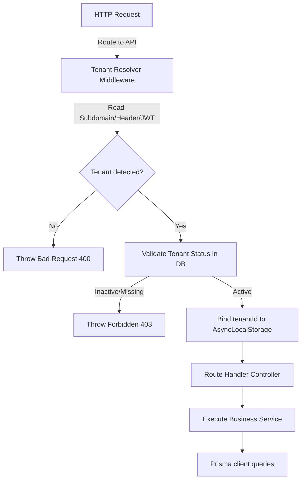
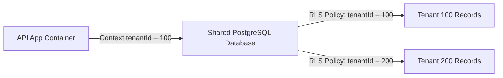
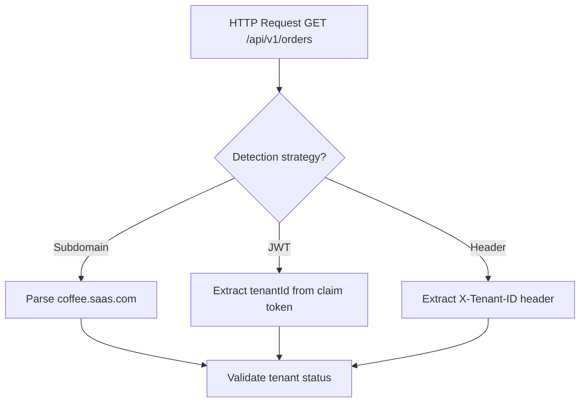
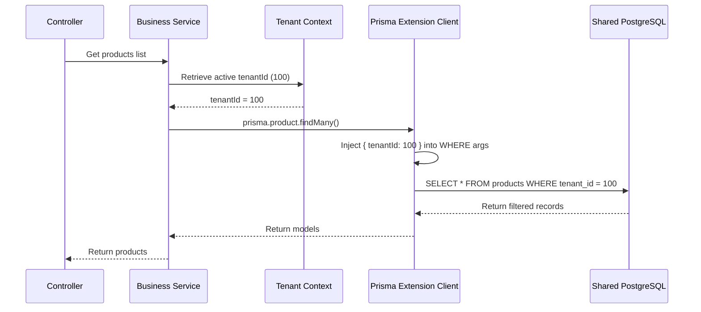
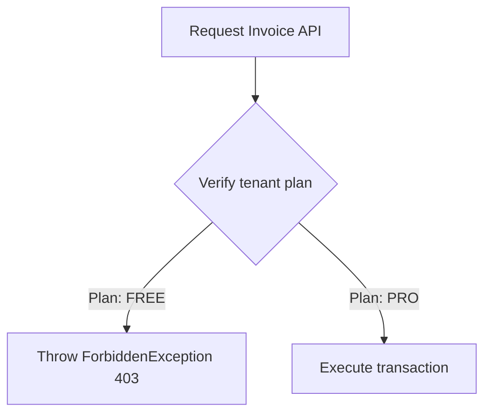

# TENANT CONTEXT & MULTI-TENANT CORE ARCHITECTURE

**Project Name:** Enterprise SaaS Business Management Platform  
**Document Version:** 1.0.0 — Baseline Standard  
**Date:** July 14, 2026  
**Authors:** Principal Backend Architect, SaaS Platform Architect, and NestJS Enterprise Engineer  
**Classification:** Internal — Confidential  
**Phase:** 23.12 — Tenant Context & Multi-Tenant Core Architecture  

---

## Table of Contents

1. [Executive Summary](#1-executive-summary)
2. [Multi-Tenant SaaS Architecture Overview](#2-multi-tenant-saas-architecture-overview)
3. [Tenant Architecture Model](#3-tenant-architecture-model)
4. [Tenant Core Module Structure](#4-tenant-core-module-structure)
5. [Tenant Identification Strategy](#5-tenant-identification-strategy)
6. [Tenant Context Flow](#6-tenant-context-flow)
7. [Database Multi-Tenant Strategy](#7-database-multi-tenant-strategy)
8. [Tenant Data Isolation Strategy](#8-tenant-data-isolation-strategy)
9. [Prisma Multi-Tenant Architecture](#9-prisma-multi-tenant-architecture)
10. [Tenant Subscription Integration](#10-tenant-subscription-integration)
11. [Tenant Configuration Management](#11-tenant-configuration-management)
12. [Tenant Security Architecture](#12-tenant-security-architecture)
13. [Tenant Context Architecture Diagrams](#13-tenant-context-architecture-diagrams)
14. [Enterprise Implementation Guidelines](#14-enterprise-implementation-guidelines)
15. [Implementation Summary](#15-implementation-summary)

---

## 1. Executive Summary

### 1.1 Document Purpose
This document establishes the **Tenant Context & Multi-Tenant Core Architecture** (Phase 23.12). It details tenant detection methods, data isolation models, Prisma query extension filters, configurations, and multi-tenant security layers.

---

## 2. Multi-Tenant SaaS Architecture Overview

### 2.1 What Multi-Tenancy Means
Multi-tenancy is an architectural model where a single instance of a software application serves multiple distinct user groups (tenants). Each tenant's data is logically isolated, preventing unauthorized access while sharing compute, storage, and networking resources.

### 2.2 Single-Tenant vs. Multi-Tenant Applications
*   **Single-Tenant:** Each customer runs dedicated application pods and databases. Highly secure, but costly to scale and maintain.
*   **Multi-Tenant:** Customers share an application instance and database, using logical separation (e.g., PostgreSQL Row-Level Security). Highly cost-effective and easy to manage.

---

## 3. Tenant Architecture Model

The hierarchy of tenant-aware resources is structured as follows:

```
Platform Owner ──► Tenant (Organization) ──► Branches ──► Users ──► Business Modules
```

### 3.1 Bounded Tenant Roles
*   `PlatformOwner`: Platform administrators managing global systems.
*   `TenantOwner`: The billing owner of a tenant account.
*   `TenantAdmin`: Administrative user managing configuration settings.
*   `BranchManager`: Manages operations for a specific branch.
*   `StaffUser`: Executes daily business tasks.

---

## 4. Tenant Core Module Structure

The tenant module is located under `src/core/tenant/`:

```
src/core/tenant/
 ├── tenant.module.ts            (Initializes multi-tenant modules)
 ├── tenant.service.ts           (Handles tenant lookup, registration, and status validation)
 ├── tenant.context.ts           (Wrapper managing thread-safe AsyncLocalStorage instances)
 ├── middleware/
 │    └── tenant.middleware.ts  (Extracts and validates tenant contexts from HTTP requests)
 ├── guards/
 │    └── tenant.guard.ts       (Enforces tenant access rules)
 ├── decorators/
 │    └── tenant.decorator.ts   (Injects verified tenant contexts into controllers)
 └── interfaces/
      └── tenant-context.interface.ts (TypeScript definitions for tenant context structures)
```

---

## 5. Tenant Identification Strategy

| Detection Strategy | Implementation Details | Pros | Cons |
| :--- | :--- | :--- | :--- |
| **Subdomain** | `https://coffee.saas.com` | Standard UX, clean branding | Requires wildcards, complex DNS config |
| **JWT Token** | Claims key: `tenantId` | Highly secure, tamper-proof | Requires login, not suited for public views |
| **Request Header** | Header: `X-Tenant-ID` | Simple, flexible for API integrations | Easy to spoof if not validated |
| **Custom Domain** | `https://coffee.com` | Premium corporate branding | Complex DNS and SSL management |

---

## 6. Tenant Context Flow

```
HTTP Request ──► Resolve Tenant ──► Validate Status ──► Build Context ──► Controller ──► Service ──► Prisma Filtered Query
```

*   **Tenant Resolution:** Extracts the tenant identifier using the configured strategy.
*   **Validation:** Verifies the tenant exists and is active.
*   **Context Binding:** Binds the tenant context to the execution thread using `AsyncLocalStorage`.
*   **Database Query:** Automatically appends tenant filters to database operations.

---

## 7. Database Multi-Tenant Strategy

### 7.1 Database Options

| Attribute | Database per Tenant | Schema per Tenant | Shared Database + Row-Level Security (RLS) |
| :--- | :--- | :--- | :--- |
| **Infra Cost** | High | Moderate | **Low** |
| **Scalability** | Complex | Moderate | **High** |
| **Security** | Isolation by design | Schema separation | Logical separation |
| **Maintenance** | Complex | Hard | **Simple** |

**Recommendation:** The SaaS platform leverages a **Shared Database + tenant_id (RLS)** model to minimize infrastructure costs while using Prisma and PostgreSQL policies to enforce data isolation.

---

## 8. Tenant Data Isolation Strategy

Every tenant-scoped database table includes a `tenant_id` foreign key:
*   `users`, `products`, `orders`, `customers`, `invoices`, `payments`.

Database engines enforce policies preventing Tenant A from reading or modifying Tenant B's records.

---

## 9. Prisma Multi-Tenant Architecture

Prisma client query extensions automatically append tenant filters to database operations:

```typescript
// Query Extension Logic
const prisma = new PrismaClient().$extends({
  query: {
    $allModels: {
      async findMany({ args, query }) {
        args.where = { ...args.where, tenantId: TenantContext.getTenantId() };
        return query(args);
      },
    },
  },
});
```

This guarantees that all `findMany`, `findFirst`, `update`, and `delete` operations are scoped to the active tenant by default.

---

## 10. Tenant Subscription Integration

Access to business modules is restricted based on the tenant's subscription plan:

*   **Free Plan:** Access to POS module only.
*   **Pro Plan:** Access to POS, Inventory, CRM, and Reports.

---

## 11. Tenant Configuration Management

Tenants can customize regional settings within their logical workspace:

```json
{
  "businessName": "Coffee Shop",
  "currency": "USD",
  "timezone": "America/New_York",
  "language": "en",
  "enabledModules": ["pos", "inventory"]
}
```

---

## 12. Tenant Security Architecture

*   **Cross-Tenant Data Leakage:** Prevented by automatic Prisma database filters and PostgreSQL RLS.
*   **Tenant Spoofing:** Resolved tenant contexts are matched against signed JWT claims.
*   **Audit Logging:** Logs all cross-tenant access attempts to detect security violations.

---

## 13. Tenant Context Architecture Diagrams

### 13.1 Request Tenant Resolution Flow



### 13.2 Multi-Tenant Data Isolation



### 13.3 Tenant Identification Routing Matrix



### 13.4 Prisma Automatic Filter Pipeline



### 13.5 Subscription Module Feature Gate



---

## 14. Enterprise Implementation Guidelines

### 14.1 Tenant Lifecycle Management
*   **Provisioning:** Creating a tenant automatically sets up their logical database schema, runs database migrations, and provisions default roles.
*   **Suspension:** Suspending a tenant deactivates all user accounts and blocks API requests.

### 14.2 Database Scalability
Database operations are monitored to identify scaling thresholds, determining when a tenant should be migrated to a dedicated database instance.

---

## 15. Implementation Summary

### 15.1 Multi-Tenant Setup Schedule

| Task | Target Timeline | Status |
| :--- | :--- | :--- |
| Set up AsyncLocalStorage contexts | Day 1 | Planned |
| Implement tenant resolution middlewares | Day 2 | Planned |
| Configure Prisma query extensions | Day 3 | Planned |
| Set up tenant settings schemas | Day 4 | Planned |

---

## Document Control

| Field | Value |
|---|---|
| **Document ID** | SBMP-BE-23.12-MULTI-TENANCY |
| **Version** | 1.0.0 |
| **Status** | APPROVED — Baseline |
| **Owner** | SaaS Platform Architect |
| **Reviewed By** | Principal Architect, Lead Developer, DB Administrator |
| **Review Cycle** | Quarterly |
| **Next Review** | October 2026 |

---

*Phase 23.12 — Tenant Context & Multi-Tenant Core Architecture | SaaS Business Management Platform*  
*Enterprise Confidential — © 2026 All Rights Reserved*
