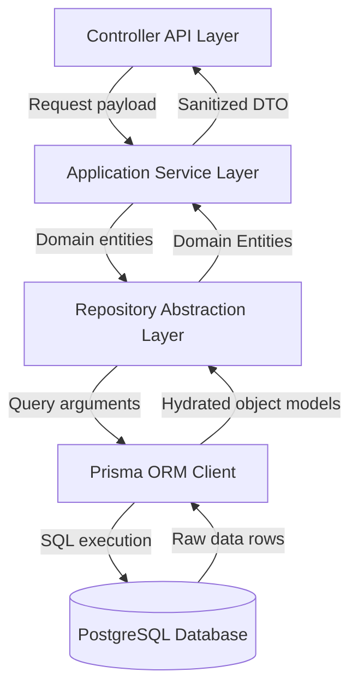
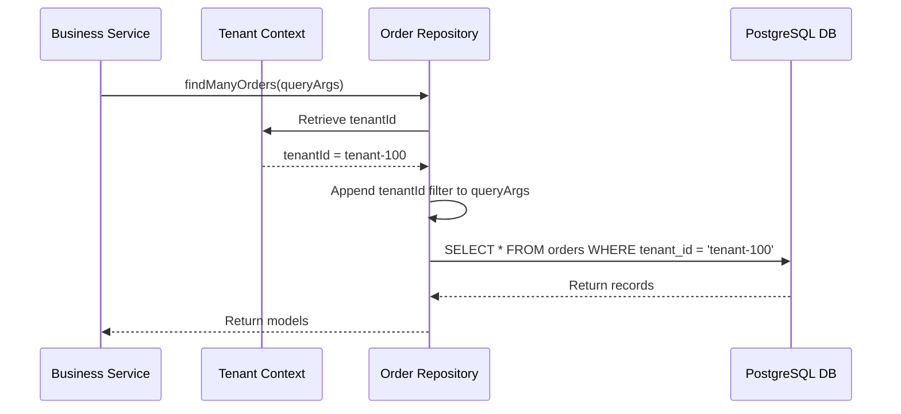
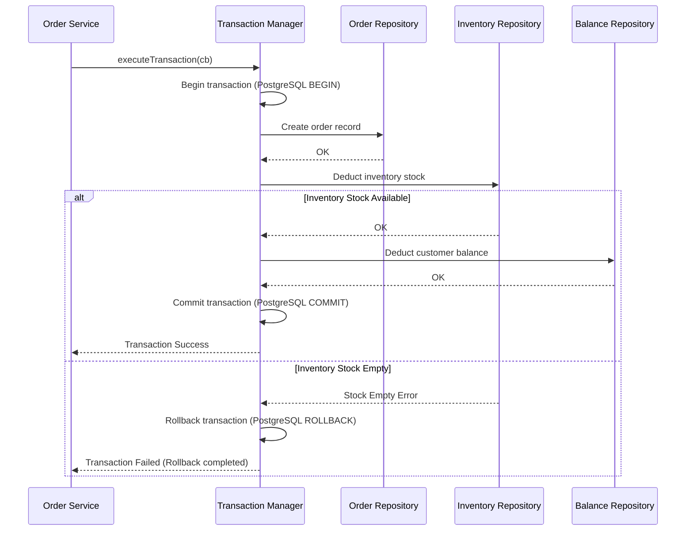
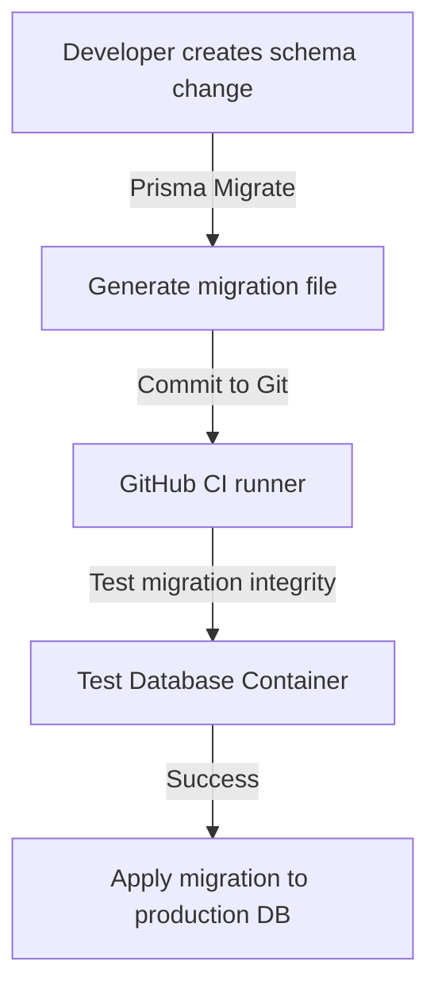
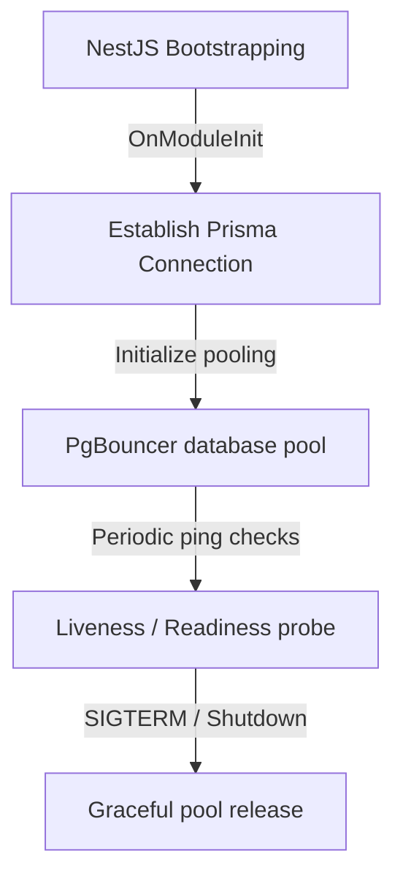

# DATABASE ACCESS LAYER & REPOSITORY ARCHITECTURE

**Project Name:** Enterprise SaaS Business Management Platform  
**Document Version:** 1.0.0 — Baseline Standard  
**Date:** July 14, 2026  
**Authors:** Principal Backend Architect, Database Architect, and NestJS Enterprise Engineer  
**Classification:** Internal — Confidential  
**Phase:** 23.13 — Database Access Layer & Repository Architecture  

---

## Table of Contents

1. [Executive Summary](#1-executive-summary)
2. [Database Access Architecture Overview](#2-database-access-architecture-overview)
3. [Database Layer Architecture Design](#3-database-layer-architecture-design)
4. [Database Core Module Structure](#4-database-core-module-structure)
5. [Prisma Service Architecture](#5-prisma-service-architecture)
6. [Repository Pattern Design](#6-repository-pattern-design)
7. [Base Repository Architecture](#7-base-repository-architecture)
8. [Multi-Tenant Repository Integration](#8-multi-tenant-repository-integration)
9. [Database Transaction Architecture](#9-database-transaction-architecture)
10. [Database Error Handling Integration](#10-database-error-handling-integration)
11. [Database Performance Strategy](#11-database-performance-strategy)
12. [Database Migration Strategy](#12-database-migration-strategy)
13. [Database Security Architecture](#13-database-security-architecture)
14. [Database Architecture Diagrams](#14-database-architecture-diagrams)
15. [Enterprise Implementation Guidelines](#15-enterprise-implementation-guidelines)
16. [Implementation Summary](#16-implementation-summary)

---

## 1. Executive Summary

### 1.1 Document Purpose
This document establishes the **Database Access Layer & Repository Architecture** (Phase 23.13). It details connection lifecycles, repositories, multi-tenant query injections, transactional boundaries, and error translation mappers.

---

## 2. Database Access Architecture Overview

### 2.1 The Need for Database Abstraction
Direct ORM access within controllers tightly couples the API layer to the database schema. This coupling makes testing difficult, prevents switching ORM libraries, and bypasses domain-level validation checks. An abstraction layer isolates persistence details from business logic, ensuring code maintainability and testability.

### 2.2 Architectural Layers
*   **Controller Layer:** Handles HTTP requests and returns standardized API responses.
*   **Application Service Layer:** Coordinates business workflows and orchestrates transactions.
*   **Domain Layer:** Enforces core business rules and state transitions.
*   **Repository Layer:** Abstract persistence interface for querying and mutating aggregates.
*   **Database Layer:** The database engine (PostgreSQL).

---

## 3. Database Layer Architecture Design

Data flows sequentially from the application layer to the database:

```
Application ──► Service Layer ──► Repository Layer ──► Prisma Data Access ──► PostgreSQL
```

### 3.1 Layer Responsibilities
*   **Service Layer:** Executes domain workflows without direct dependency on database queries.
*   **Repository Layer:** Translates domain queries into ORM actions, isolating persistence details.
*   **Prisma Client:** Automatically maps models and executes SQL queries.
*   **PostgreSQL Engine:** Enforces data storage, indexing, and transactional integrity.

---

## 4. Database Core Module Structure

The database components are located under `src/core/database/`:

```
src/core/database/
 ├── database.module.ts            (Initializes Prisma database integrations)
 ├── prisma.service.ts             (Manages PostgreSQL connection lifecycles and pools)
 ├── prisma.extension.ts           (Registers query-level multi-tenant filters)
 ├── repositories/
 │    ├── base.repository.ts       (Abstract class implementing CRUD operations)
 │    └── repository.interface.ts  (TypeScript interfaces for repository classes)
 └── transactions/
      └── transaction.manager.ts   (Manages database transactions)
```

---

## 5. Prisma Service Architecture

The `PrismaService` class manages the PostgreSQL connection lifecycle:

```
App Boot ──► Connect DB ──► Initialize Pools ──► Run App ──► Catch Sigterm ──► Close Pools
```

### 5.1 Connection Lifecycle
*   **OnModuleInit:** Establishes database connections and initializes connection pools during NestJS boot.
*   **Health Checking:** Performs periodic ping checks to monitor database health.
*   **BeforeApplicationShutdown:** Gracefully terminates database connections to prevent memory leaks during application shutdown.

---

## 6. Repository Pattern Design

The Repository pattern isolates the application layer from persistence details:

*   **Query Encapsulation:** Repositories encapsulate database queries, hiding SQL or Prisma syntax.
*   **Business Filter Injections:** Automatically applies tenant and soft-delete filters.
*   **Aggregates Mapping:** Maps raw database records to domain aggregates.
*   **Key Repositories:** `UserRepository`, `TenantRepository`, `ProductRepository`, `OrderRepository`.

---

## 7. Base Repository Architecture

The `BaseRepository` class implements common CRUD operations, reducing boilerplate code:

```typescript
export abstract class BaseRepository<T> {
  abstract create(data: any): Promise<T>;
  abstract findOne(id: string): Promise<T | null>;
  abstract findMany(params: any): Promise<T[]>;
  abstract update(id: string, data: any): Promise<T>;
  abstract delete(id: string): Promise<T>;
  abstract count(where: any): Promise<number>;
}
```

---

## 8. Multi-Tenant Repository Integration

Repositories leverage the request context to automatically enforce tenant isolation:

```json
"context": {
  "tenantId": "tenant-uuid-123",
  "userId": "user-uuid-456"
}
```

Every database query automatically appends the active tenant ID:
`WHERE tenant_id = tenantId`

---

## 9. Database Transaction Architecture

Complex business workflows (e.g., order placement) require transaction management:

```
Start Transaction ──► Create Order ──► Deduct Inventory ──► Charge Balance ──► Commit
```

The transaction manager coordinates these operations, rolling back changes if any step fails to maintain data consistency.

---

## 10. Database Error Handling Integration

Database errors are caught, mapped, and logged to prevent system exposure:

```
Prisma Error (P2002) ──► Repository Layer ──► Map to Standard Error ──► Global Filter
```

*   **Constraint Violations:** Mapped to user-friendly error codes (e.g., `EMAIL_EXISTS`).
*   **Stack Trace Sanitization:** Raw database error details are stripped from production responses.

---

## 11. Database Performance Strategy

*   **Index Strategy:** Enforces index constraints on frequently queried columns (e.g., `tenant_id`, `created_at`).
*   **Query Optimization:** Implements query profiling to identify and optimize slow operations.
*   **Connection Pooling:** PgBouncer manages database connections to handle peak loads.
*   **Pagination:** Implements cursor-based pagination for large datasets.

---

## 12. Database Migration Strategy

*   **Development:** Developers generate migrations locally via `prisma migrate dev`.
*   **CI/CD Verification:** Migrations are tested against a clean database instance in the deployment pipeline.
*   **Production Deployment:** Migrations are executed during deployment before application containers start.
*   **Rollbacks:** Implements rollback scripts and daily backups to protect production data.

---

## 13. Database Security Architecture

*   **SQL Injection Defense:** Prepared statements and parameterized queries prevent SQL injection.
*   **Least Privilege Access:** Application containers connect to the database using limited permissions.
*   **Data Encryption:** Sensitive database columns are encrypted at rest using KMS keys.

---

## 14. Database Architecture Diagrams

### 14.1 Repository Pattern Flow



### 14.2 Multi-Tenant Database Access Flow



### 13.3 Order placement transaction execution



### 13.4 Migration deployment pipeline



### 13.5 Database connection lifecycle



---

## 15. Enterprise Implementation Guidelines

### 15.1 Repository Naming Conventions
*   Class files use camelCase ending in `.repository.ts` (e.g., `user.repository.ts`).
*   Class names use PascalCase ending in `Repository` (e.g., `UserRepository`).

### 15.2 Production Best Practices
*   **Explicit Fields:** Select required fields explicitly in database queries to avoid retrieving unnecessary columns.
*   **Transaction Limits:** Keep transaction boundaries small to prevent long-running locks on database tables.

---

## 16. Implementation Summary

### 16.1 Database Setup Schedule

| Task | Target Timeline | Status |
| :--- | :--- | :--- |
| Create BaseRepository interfaces | Day 1 | Planned |
| Implement Prisma connection manager services | Day 2 | Planned |
| Set up database transaction managers | Day 3 | Planned |
| Implement error mapping libraries | Day 4 | Planned |

---

## Document Control

| Field | Value |
|---|---|
| **Document ID** | SBMP-BE-23.13-DATABASE-REPOSITORY |
| **Version** | 1.0.0 |
| **Status** | APPROVED — Baseline |
| **Owner** | Database Architect |
| **Reviewed By** | Principal Architect, Lead Developer, DBA |
| **Review Cycle** | Quarterly |
| **Next Review** | October 2026 |

---

*Phase 23.13 — Database Access Layer & Repository Architecture | SaaS Business Management Platform*  
*Enterprise Confidential — © 2026 All Rights Reserved*
