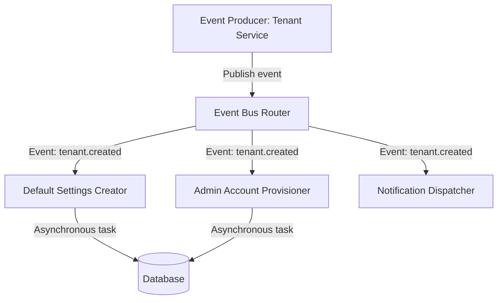
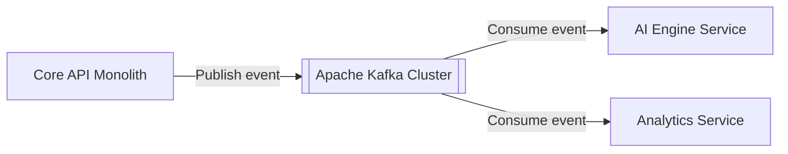
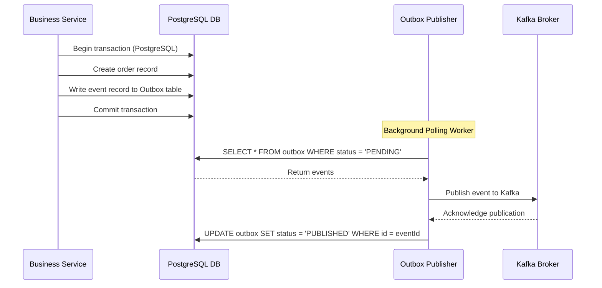
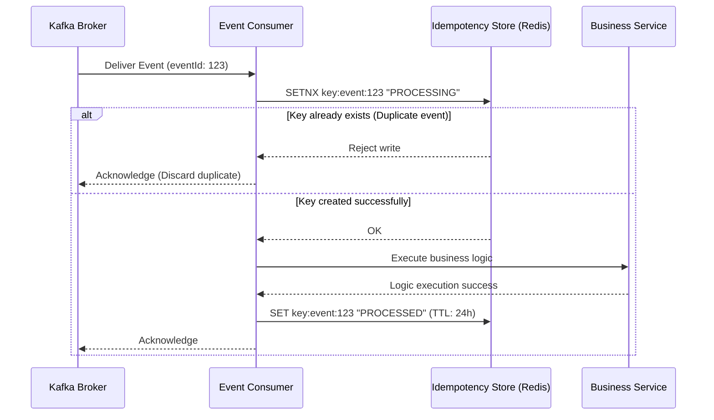
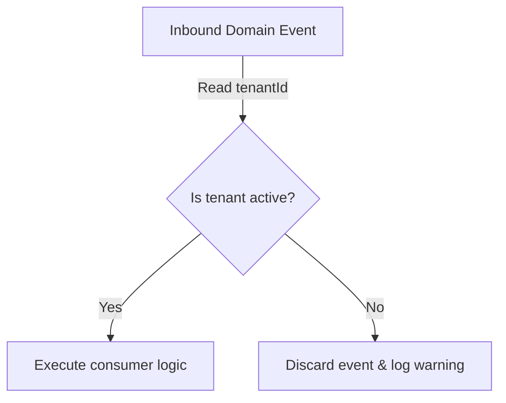

# EVENT-DRIVEN ARCHITECTURE & DOMAIN EVENTS CORE

**Project Name:** Enterprise SaaS Business Management Platform  
**Document Version:** 1.0.0 — Baseline Standard  
**Date:** July 14, 2026  
**Authors:** Principal Backend Architect, Distributed Systems Architect, and NestJS Enterprise Engineer  
**Classification:** Internal — Confidential  
**Phase:** 23.14 — Event-Driven Architecture & Domain Events Core  

---

## Table of Contents

1. [Executive Summary](#1-executive-summary)
2. [Event-Driven Architecture Overview](#2-event-driven-architecture-overview)
3. [Event Architecture Design](#3-event-architecture-design)
4. [Event Core Module Structure](#4-event-core-module-structure)
5. [Domain Event Design](#5-domain-event-design)
6. [Event Flow Examples](#6-event-flow-examples)
7. [Internal Event Bus Architecture](#7-internal-event-bus-architecture)
8. [Message Broker Architecture](#8-message-broker-architecture)
9. [Event Reliability Strategy](#9-event-reliability-strategy)
10. [Transactional Outbox Pattern](#10-transactional-outbox-pattern)
11. [Event-Driven Multi-Tenant Architecture](#11-event-driven-multi-tenant-architecture)
12. [Integration With Existing Core Modules](#12-integration-with-existing-core-modules)
13. [Event Architecture Diagrams](#13-event-architecture-diagrams)
14. [Enterprise Implementation Guidelines](#14-enterprise-implementation-guidelines)
15. [Implementation Summary](#15-implementation-summary)

---

## 1. Executive Summary

### 1.1 Document Purpose
This document establishes the **Event-Driven Architecture & Domain Events Core** (Phase 23.14). It details internal event buses, distributed message brokers, reliability strategies (Outbox pattern), and multi-tenant event schemas.

---

## 2. Event-Driven Architecture Overview

### 2.1 Asynchronous Communication in SaaS
As SaaS platforms scale, synchronous HTTP requests introduce latency, block threads, and increase system coupling. Event-driven architectures leverage asynchronous messaging to process background tasks (e.g., sending emails, generating reports) without blocking the primary request loop, improving application responsiveness and reliability.

### 2.2 Synchronous vs. Event-Driven Communication
*   **Synchronous:** The client blocks waiting for a response (e.g., HTTP POST).
*   **Event-Driven:** The client receives an immediate acknowledgment; the system processes subsequent actions asynchronously using events.

---

## 3. Event Architecture Design

Domain events represent immutable facts that have already occurred within the system:

```
Business Module ──► Domain Event ──► Event Bus ──► Event Handler ──► Side Effects
```

### 3.1 Component Responsibilities
*   **Event Producer:** The service that publishes a domain event.
*   **Event Bus:** The transport layer (internal event bus or message broker).
*   **Event Consumer:** The handler that processes the event.

---

## 4. Event Core Module Structure

The event-driven components are located under `src/core/events/`:

```
src/core/events/
 ├── events.module.ts            (Initializes local and distributed event adapters)
 ├── event-bus.service.ts        (Abstract service wrapping EventEmitter2 and Kafka adapters)
 ├── event.interface.ts          (TypeScript definitions for events)
 ├── decorators/
 │    └── event-handler.decorator.ts (Registers event consumers automatically)
 ├── handlers/
 │    └── event-handler.interface.ts (TypeScript interface representing event consumers)
 └── events/
      ├── user-created.event.ts  (Triggered upon user registration)
      ├── tenant-created.event.ts (Triggered upon tenant provisioning)
      └── payment-completed.event.ts (Triggered upon payment confirmation)
```

---

## 5. Domain Event Design

### 5.1 Schema Definition
Every event follows a standardized JSON schema:

```json
{
  "eventId": "evt-9c8b7a6f",
  "eventName": "tenant.created",
  "aggregateId": "tenant-uuid-1111",
  "tenantId": "tenant-uuid-1111",
  "timestamp": "2026-07-14T03:04:45Z",
  "payload": {
    "name": "Acme Corp",
    "ownerEmail": "owner@acme.com"
  }
}
```

*   `eventId`: Unique identifier for deduplication.
*   `eventName`: Dot-separated action name (`module.resource.action`).
*   `aggregateId`: ID of the target resource.
*   `tenantId`: Enforces multi-tenant data boundaries.
*   `timestamp`: Event generation time.
*   `payload`: Specific data required by consumers.

---

## 6. Event Flow Examples

### 6.1 Tenant Provisioning Flow
1.  `TenantService` creates a tenant record.
2.  `TenantCreatedEvent` is published to the `EventBus`.
3.  **Handlers execute in parallel:**
    *   **Default Settings Handler:** Configures default values (e.g., USD currency).
    *   **Admin User Handler:** Provisions the initial administrator account.
    *   **Welcome Email Handler:** Enqueues a notification task.
    *   **Audit Log Handler:** Writes to the security trail.

---

## 7. Internal Event Bus Architecture

For internal communication (within the same process), the platform uses `EventEmitter2`. This avoids external network overhead and simplifies local development.

---

## 8. Message Broker Architecture

To support scaling and distributed systems, the platform leverages external message brokers:

| Attribute | RabbitMQ | Apache Kafka | AWS SQS |
| :--- | :--- | :--- | :--- |
| **Performance** | High throughput | **Extremely high throughput** | Moderate |
| **Complexity** | Moderate | High | Low (Managed) |
| **Primary Use Case** | Routing and queueing | **Event streaming and replay** | Basic message queues |

**Recommendation:** The platform utilizes **Apache Kafka** for high-performance event streaming and data synchronization, with **Redis/BullMQ** managing local background job retries.

---

## 9. Event Reliability Strategy

To prevent event loss and ensure reliable processing, the platform implements:

*   **Retry Mechanisms:** Exponential backoff with jitter for transient failures.
*   **Dead Letter Queues (DLQ):** Failed messages are routed to a DLQ for debugging after 5 retry attempts.
*   **Idempotent Consumers:** Consumers use unique event IDs to prevent duplicate processing.

---

## 10. Transactional Outbox Pattern

The Transactional Outbox pattern guarantees that database state changes and event dispatches occur atomically:

```
Start Transaction ──► Update Business Table ──► Write to Outbox Table ──► Commit
```

A background worker polls the outbox table and publishes pending events to the message broker, preventing data inconsistency.

---

## 11. Event-Driven Multi-Tenant Architecture

Every event contains a `tenantId` property. This property allows consumers to validate tenant subscriptions and enforce isolation rules before processing events.

---

## 12. Integration With Existing Core Modules

*   **Authentication:** Triggers `user.login` events to update active session metrics.
*   **Authorization:** Invalidate user permissions cache upon receiving `user.permissions.updated` events.
*   **Audit Logging:** Translates domain events into audit records.
*   **Notification:** Listens for events to send email or SMS alerts.

---

## 13. Event Architecture Diagrams

### 13.1 Domain Event Flow



### 13.2 Distributed Event Architecture



### 13.3 Transactional Outbox Pattern Flow



### 13.4 Idempotent Consumer Loop



### 13.5 Event-Driven Tenant Isolation



---

## 14. Enterprise Implementation Guidelines

### 14.1 Event Naming Conventions
Events must be named using past tense actions: `[module].[resource].[action_past_tense]` (e.g., `pos.order.created`).

### 14.2 Versioning Strategy
Event schemas include version headers (e.g., `v1`, `v2`). Breaking schema changes require version increments and concurrent support during migration.

---

## 15. Implementation Summary

### 15.1 Event System Setup Schedule

| Task | Target Timeline | Status |
| :--- | :--- | :--- |
| Set up EventEmitter2 adapters | Day 1 | Planned |
| Create event decorator wrappers | Day 2 | Planned |
| Configure outbox database tables | Day 3 | Planned |
| Set up Kafka broker consumers | Day 4 | Planned |

---

## Document Control

| Field | Value |
|---|---|
| **Document ID** | SBMP-BE-23.14-EVENT-DRIVEN-CORE |
| **Version** | 1.0.0 |
| **Status** | APPROVED — Baseline |
| **Owner** | Distributed Systems Architect |
| **Reviewed By** | Principal Architect, Lead Developer, DevOps Director |
| **Review Cycle** | Quarterly |
| **Next Review** | October 2026 |

---

*Phase 23.14 — Event-Driven Architecture & Domain Events Core | SaaS Business Management Platform*  
*Enterprise Confidential — © 2026 All Rights Reserved*
