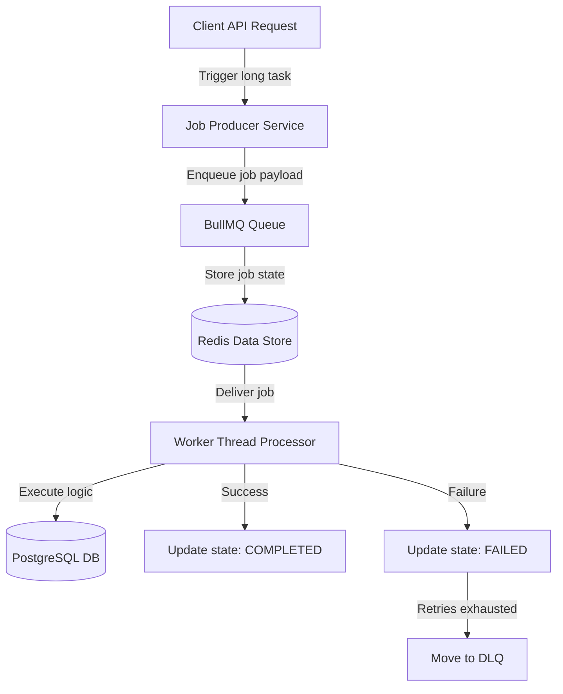
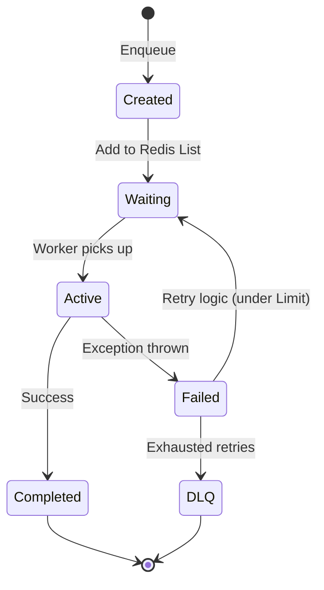
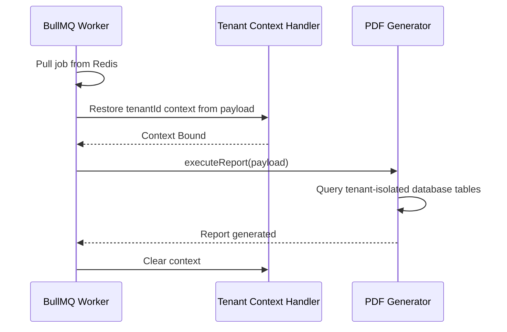
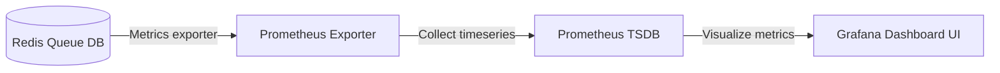

# BACKGROUND JOBS & TASK PROCESSING ARCHITECTURE

**Project Name:** Enterprise SaaS Business Management Platform  
**Document Version:** 1.0.0 — Baseline Standard  
**Date:** July 14, 2026  
**Authors:** Principal Backend Architect, Distributed Systems Engineer, and NestJS Enterprise Engineer  
**Classification:** Internal — Confidential  
**Phase:** 23.15 — Background Jobs & Task Processing Architecture  

---

## Table of Contents

1. [Executive Summary](#1-executive-summary)
2. [Background Processing Architecture Overview](#2-background-processing-architecture-overview)
3. [Background Job Architecture Design](#3-background-job-architecture-design)
4. [Background Job Core Module Structure](#4-background-job-core-module-structure)
5. [Queue Architecture Design](#5-queue-architecture-design)
6. [BullMQ & Redis Architecture](#6-bullmq--redis-architecture)
7. [Job Lifecycle Management](#7-job-lifecycle-management)
8. [Scheduled Task Architecture](#8-scheduled-task-architecture)
9. [SaaS Business Use Cases](#9-saas-business-use-cases)
10. [Reliability & Failure Handling](#10-reliability--failure-handling)
11. [Multi-Tenant Background Processing](#11-multi-tenant-background-processing)
12. [Monitoring Background Jobs](#12-monitoring-background-jobs)
13. [Security Considerations](#13-security-considerations)
14. [Background Jobs Diagrams](#14-background-jobs-diagrams)
15. [Enterprise Implementation Guidelines](#15-enterprise-implementation-guidelines)
16. [Implementation Summary](#16-implementation-summary)

---

## 1. Executive Summary

### 1.1 Document Purpose
This document establishes the **Background Jobs & Task Processing Architecture** (Phase 23.15). It details BullMQ queue systems, Redis job stores, worker scaling strategies, cron schedules, and multi-tenant job isolation policies.

---

## 2. Background Processing Architecture Overview

### 2.1 The Need for Background Processing
SaaS applications execute operations that exceed typical HTTP request timeout budgets (e.g., 30 seconds). Offloading these tasks to asynchronous background processes prevents server thread blocking and ensures UI responsiveness.

### 2.2 Synchronous vs. Asynchronous Task Processing
*   **Synchronous Processing:** Executes tasks sequentially within the client request-response lifecycle.
*   **Asynchronous Background Jobs:** Immediately acknowledges the request, placing the task in a queue for parallel execution by worker nodes.

### 2.3 Key Problems Solved
*   **Long-Running Tasks:** Complex computations (e.g., PDF generation).
*   **External API Delays:** Third-party integrations (e.g., payment gateways, SMS dispatches).
*   **Scheduled Operations:** Automated tasks (e.g., cleanups, billing cycles).

---

## 3. Background Job Architecture Design

Jobs flow through producer, queue, and worker layers:

```
Application ──► Job Producer ──► Redis Queue ──► Worker Processor ──► Database
```

### 3.1 Component Responsibilities
*   **Job Producer:** Enqueues tasks with required payloads.
*   **Queue System:** Manages job order, priorities, and status in Redis.
*   **Worker:** Consumes and executes jobs.
*   **Scheduler:** Enqueues cron-scheduled tasks.

---

## 4. Background Job Core Module Structure

The background jobs module is located under `src/core/jobs/`:

```
src/core/jobs/
 ├── jobs.module.ts            (Initializes BullMQ connections and registers queues)
 ├── queue.service.ts          (Exposes methods to enqueue jobs)
 ├── worker.service.ts         (Manages worker configurations)
 ├── scheduler.service.ts      (Configures cron-based recurring tasks)
 ├── queues/
 │    ├── email.queue.ts       (Email dispatch queue)
 │    ├── notification.queue.ts (SMS/Push dispatch queue)
 │    └── report.queue.ts      (PDF/CSV compilation queue)
 ├── processors/
 │    ├── email.processor.ts   (Processes email dispatches)
 │    ├── notification.processor.ts (Processes SMS/Push notifications)
 │    └── report.processor.ts  (Processes PDF/CSV compilation)
 └── interfaces/
      └── job.interface.ts     (TypeScript definitions for jobs)
```

---

## 5. Queue Architecture Design

*   **Email Queue:** Dispatches transactional emails (e.g., system invitations, invoices).
*   **Notification Queue:** Dispatches push notifications and international SMS alerts.
*   **Report Queue:** Compiles analytics logs and exports PDF reports.

---

## 6. BullMQ & Redis Architecture

The platform leverages **BullMQ** and **Redis** for queue management:

```
NestJS Producer ──► BullMQ Client ──► Redis Store ──► Worker Processor
```

*   **Job Storage:** Job state and payload are persisted in Redis.
*   **Retry Handling:** Automates retries with configurable delay rules.
*   **Status Tracking:** Monitors jobs through waiting, active, completed, and failed states.

---

## 7. Job Lifecycle Management

Jobs transition through the following states:

```
Created ──► Waiting ──► Active ──► Completed / Failed
```

*   **Retry Strategy:** Failed jobs are retried up to 5 times using exponential backoff.
*   **Timeout Handling:** Jobs that exceed their processing limit are terminated.
*   **Failure Tracking:** Failed jobs are moved to a Dead Letter Queue (DLQ) for debugging.

---

## 8. Scheduled Task Architecture

The platform uses NestJS scheduling to run cron-based operations:

*   **Daily:** Compiles analytics logs and purges expired Redis sessions.
*   **Hourly:** Syncs exchange rates and updates cache files.
*   **Monthly:** Generates recurring subscription invoices.

---

## 9. SaaS Business Use Cases

*   **User Management:** Enqueues verification and welcome email tasks.
*   **Subscription:** Dispatches renewal reminders and billing alerts.
*   **Finance:** Processes invoices, tax validations, and settlements.
*   **Analytics:** Compiles and emails analytics summaries.

---

## 10. Reliability & Failure Handling

*   **Worker Crash Recovery:** BullMQ automatically re-enqueues jobs if a worker node crashes mid-execution.
*   **Redis Reconnections:** Implements automatic retry connection logic for Redis.
*   **External API Failures:** Uses exponential backoff and circuit breakers to handle external API outages.

---

## 11. Multi-Tenant Background Processing

Every background job schema includes tenant metadata:

```json
{
  "tenantId": "tenant-uuid-111",
  "userId": "user-uuid-222",
  "jobType": "report.generate",
  "payload": {
    "reportId": "report-uuid-333"
  }
}
```

*   **Context Propagation:** Workers restore the tenant context before executing jobs, ensuring data isolation.
*   **Rate Limiting:** Prevents a single tenant from monopolizing queue processing capacity.

---

## 12. Monitoring Background Jobs

The queue processing pipeline integrates with the observability stack:

*   **Metrics:** Prometheus tracks queue depth, processing latency, and error rates.
*   **Grafana Dashboards:** Visualizes job throughput, worker efficiency, and failed jobs.

---

## 13. Security Considerations

*   **Payload Sanitization:** Validates job inputs to prevent code injection.
*   **Sensitive Data:** Payloads must not contain raw credentials or decryptable secrets.
*   **Privilege Checks:** Validates that the initiating user has permission to trigger the job.

---

## 14. Background Jobs Diagrams

### 14.1 Background Job Flow



### 14.2 Production Queue Architecture

```mermaid
graph TD
    SUBGRAPH_A[Application Pods]
        API_1[API Node 1]
        API_2[API Node 2]
    end
    SUBGRAPH_B[Redis Cluster]
        REDIS_M[(Redis Primary)]
    end
    SUBGRAPH_C[Worker Pods]
        WORK_1[Email Worker]
        WORK_2[Report Worker]
        WORK_3[Notification Worker]
    end

    API_1 -->|Push jobs| REDIS_M
    API_2 -->|Push jobs| REDIS_M
    REDIS_M -->|Fetch jobs| WORK_1
    REDIS_M -->|Fetch jobs| WORK_2
    REDIS_M -->|Fetch jobs| WORK_3
```

### 14.3 Job Lifecycle State Machine



### 14.4 Tenant Context Extraction



### 14.5 Monitoring & Dashboard Integrations



---

## 15. Enterprise Implementation Guidelines

### 15.1 Job Naming Conventions
Jobs use camelCase names: `[module].[actionName]` (e.g., `email.sendWelcome`).

### 15.2 Worker Scaling
Kubernetes Horizontal Pod Autoscalers (HPA) automatically scale worker pods based on queue length metrics.

---

## 16. Implementation Summary

### 16.1 Background Jobs Setup Schedule

| Task | Target Timeline | Status |
| :--- | :--- | :--- |
| Set up BullMQ configuration modules | Day 1 | Planned |
| Create email worker processors | Day 2 | Planned |
| Configure cron task schedulers | Day 3 | Planned |
| Integrate queue monitoring metrics | Day 4 | Planned |

---

## Document Control

| Field | Value |
|---|---|
| **Document ID** | SBMP-BE-23.15-BACKGROUND-JOBS |
| **Version** | 1.0.0 |
| **Status** | APPROVED — Baseline |
| **Owner** | Distributed Systems Engineer |
| **Reviewed By** | Principal Architect, Lead Developer, SRE Lead |
| **Review Cycle** | Quarterly |
| **Next Review** | October 2026 |

---

*Phase 23.15 — Background Jobs & Task Processing Architecture | SaaS Business Management Platform*  
*Enterprise Confidential — © 2026 All Rights Reserved*
