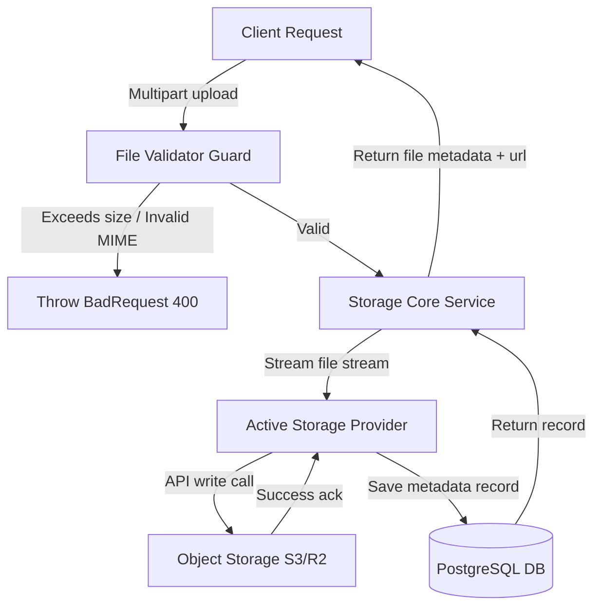
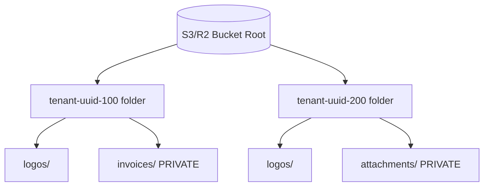
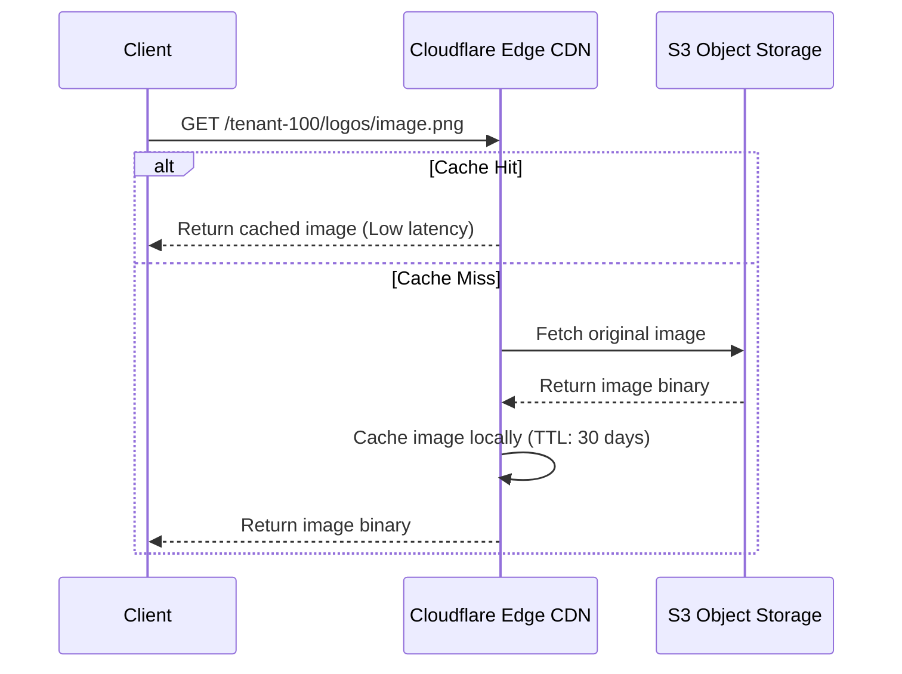
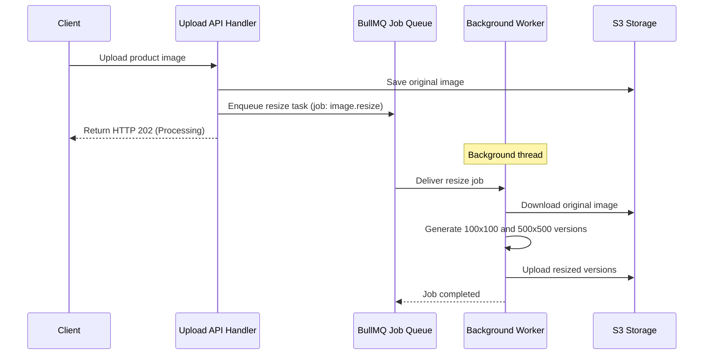
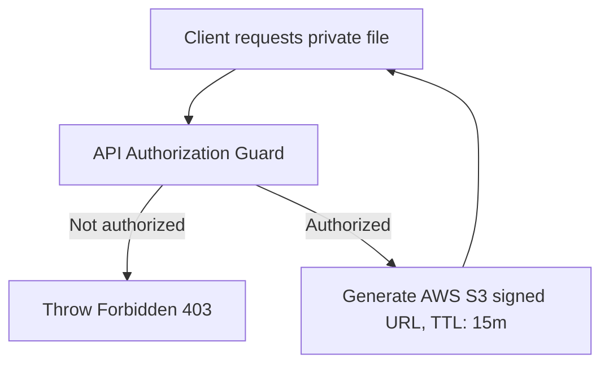

# FILE STORAGE & MEDIA MANAGEMENT CORE ARCHITECTURE

**Project Name:** Enterprise SaaS Business Management Platform  
**Document Version:** 1.0.0 — Baseline Standard  
**Date:** July 14, 2026  
**Authors:** Principal Backend Architect, Cloud Architect, and NestJS Enterprise Engineer  
**Classification:** Internal — Confidential  
**Phase:** 23.16 — File Storage & Media Management Core Architecture  

---

## Table of Contents

1. [Executive Summary](#1-executive-summary)
2. [File Storage Architecture Overview](#2-file-storage-architecture-overview)
3. [File Storage Architecture Design](#3-file-storage-architecture-design)
4. [File Storage Core Module Structure](#4-file-storage-core-module-structure)
5. [Storage Provider Strategy](#5-storage-provider-strategy)
6. [File Upload Flow Architecture](#6-file-upload-flow-architecture)
7. [File Metadata Management](#7-file-metadata-management)
8. [Multi-Tenant File Isolation](#8-multi-tenant-file-isolation)
9. [File Security Architecture](#9-file-security-architecture)
10. [CDN Integration Architecture](#10-cdn-integration-architecture)
11. [SaaS Business Use Cases](#11-saas-business-use-cases)
12. [File Processing Background Jobs](#12-file-processing-background-jobs)
13. [Storage Monitoring Strategy](#13-storage-monitoring-strategy)
14. [File Storage Diagrams](#14-file-storage-diagrams)
15. [Enterprise Implementation Guidelines](#15-enterprise-implementation-guidelines)
16. [Implementation Summary](#16-implementation-summary)

---

## 1. Executive Summary

### 1.1 Document Purpose
This document establishes the **File Storage & Media Management Core Architecture** (Phase 23.16). It details the storage provider abstraction model, upload flows, metadata structures, tenant directory isolation, and security guards required to manage media assets.

---

## 2. File Storage Architecture Overview

### 2.1 The Need for Centralized Storage
Modern SaaS applications process large amounts of unstructured data. Storing files directly on container filesystems causes issues in autoscaling groups (where containers are stateless and ephemeral). A centralized storage architecture secures, scales, and delivers files independently of application pods.

### 2.2 Storage Types Comparison
*   **Local File Storage:** Fast local disk writes, but data is lost when pods restart. Used only for temporary file processing during development.
*   **Object Storage (S3/R2):** Highly durable, distributed, and cost-effective API-driven storage for permanent files.
*   **Content Delivery Network (CDN):** Geographically distributed proxy caches that deliver files with low latency.

---

## 3. File Storage Architecture Design

Files flow from client uploads to CDN distribution:

```
Client ──► API Upload Guard ──► Storage Provider ──► Object Storage ──► CDN ──► Client
```

### 3.1 Component Responsibilities
*   **Upload Service:** Validates file sizes, types, and permissions.
*   **Storage Provider:** Abstract client interface executing API writes to buckets.
*   **File Metadata Service:** Records file properties in the database.
*   **Access Control Layer:** Validates ownership before issuing presigned access URLs.

---

## 4. File Storage Core Module Structure

The storage components are located under `src/core/storage/`:

```
src/core/storage/
 ├── storage.module.ts            (Initializes storage configurations and registers providers)
 ├── storage.service.ts           (Exposes clean API methods for uploading and deleting assets)
 ├── storage.provider.ts          (Abstract class defining the storage implementation interface)
 ├── providers/
 │    ├── local.provider.ts       (Implements local filesystem writes for local development)
 │    ├── s3.provider.ts          (Implements AWS S3 and Cloudflare R2 client integrations)
 │    └── cloud.provider.ts       (Implements Google Cloud Storage integrations)
 ├── validators/
 │    └── file.validator.ts       (Validates file sizes and magic-number MIME headers)
 └── interfaces/
      └── storage.interface.ts     (TypeScript definitions for storage operations)
```

---

## 5. Storage Provider Strategy

The storage layer leverages the **Provider pattern** to decouple business logic from the underlying storage infrastructure:

```
Application Module ──► Abstract Storage Service ──► Local / S3 / R2 / GCS Providers
```

This abstraction allows developers to use local filesystem storage during development and switch to AWS S3 or Cloudflare R2 in production by changing environment variables, without modifying business modules.

---

## 6. File Upload Flow Architecture

```
Client Upload ──► Validate Size/MIME ──► Stream to Object Storage ──► Save Metadata ──► Return URL
```

1.  **Client Upload:** Client sends files via multipart/form-data.
2.  **Validation:** Guard pipelines check file size limits and inspect file magic numbers to prevent MIME spoofing.
3.  **Stream to Storage:** The active provider streams the file directly to object storage (e.g., S3).
4.  **Save Metadata:** Database repositories record the file's storage path and ownership metadata.
5.  **Return Response:** Sends the sanitized, public, or signed access URL back to the client.

---

## 7. File Metadata Management

### 7.1 Database Metadata Schema
File metadata is stored in the database to enable quick queries and enforce access controls without querying the object storage APIs directly:

```json
{
  "id": "file-uuid-111",
  "tenantId": "tenant-uuid-222",
  "filename": "clean_logo_123.png",
  "originalName": "Acme Logo.png",
  "mimeType": "image/png",
  "size": 204857,
  "storagePath": "tenant-uuid-222/logos/clean_logo_123.png",
  "url": "https://cdn.saas.com/tenant-uuid-222/logos/clean_logo_123.png",
  "uploadedBy": "user-uuid-333",
  "createdAt": "2026-07-14T03:05:38Z"
}
```

---

## 8. Multi-Tenant File Isolation

Data isolation is enforced at the storage path level:

```
Bucket Root/
 ├── tenant-uuid-100/
 │    ├── logos/
 │    └── invoices/
 └── tenant-uuid-200/
      ├── logos/
      └── attachments/
```

*   **Path Nesting:** Files are automatically nested under their respective `tenantId` prefix.
*   **Private Buckets:** Private documents (e.g., invoices) are stored in private buckets and accessed only via short-lived presigned URLs.

---

## 9. File Security Architecture

*   **MIME Spoofing Defense:** Inspects file content magic numbers rather than relying on the file extension header.
*   **Storage Scanning:** Uploaded files are scanned for malware using ClamAV integrations before being made available.
*   **Signed URLs:** Restricts access to sensitive documents by requiring signed URLs with a maximum lifespan of 15 minutes.

---

## 10. CDN Integration Architecture

```
User GET ──► CDN Cache ──► (Cache Miss) ──► Object Storage Bucket ──► Cache & Return
```

To optimize performance and reduce egress costs, public assets (e.g., logos, product images) are served through Cloudflare CDN caches instead of hitting backend servers or storage buckets directly.

---

## 11. File Processing Background Jobs

Heavy media processing tasks are handled asynchronously using the jobs module:

```
Upload Image ──► Queue Resize Task ──► Generate Thumbnails (100x100) ──► Save to Bucket
```

---

## 12. Storage Monitoring Strategy

The observability stack monitors storage metrics:

*   **Prometheus:** Tracks upload durations, size distributions, and error rates.
*   **Grafana Dashboards:** Visualizes bandwidth usage, storage growth, and upload failure counts.

---

## 13. File Storage Diagrams

### 13.1 File Upload Lifecycle



### 13.2 Multi-Tenant Storage Architecture



### 13.3 CDN Request Cache Loop



### 13.4 Image resizing background processing pipeline



### 13.5 Secure signed URL validation flow



---

## 14. Enterprise Implementation Guidelines

### 14.1 File Naming Conventions
File names are sanitized to remove special characters and suffixed with a unique timestamp to prevent naming collisions: `[sanitized_name]_[timestamp].[extension]`.

### 14.2 Storage Lifecycle Management
Implements lifecycle policies on object storage buckets (e.g., delete files in temporary or export folders after 7 days) to control storage costs.

---

## 15. Implementation Summary

### 15.1 Storage Setup Schedule

| Task | Target Timeline | Status |
| :--- | :--- | :--- |
| Create StorageProvider interface models | Day 1 | Planned |
| Implement local storage provider engines | Day 2 | Planned |
| Configure AWS S3/Cloudflare R2 adapters | Day 3 | Planned |
| Implement image resizing job processors | Day 4 | Planned |

---

## Document Control

| Field | Value |
|---|---|
| **Document ID** | SBMP-BE-23.16-FILE-STORAGE |
| **Version** | 1.0.0 |
| **Status** | APPROVED — Baseline |
| **Owner** | Cloud Infrastructure Architect |
| **Reviewed By** | Principal Architect, Lead Developer, SRE Director |
| **Review Cycle** | Quarterly |
| **Next Review** | October 2026 |

---

*Phase 23.16 — File Storage & Media Management Core Architecture | SaaS Business Management Platform*  
*Enterprise Confidential — © 2026 All Rights Reserved*
