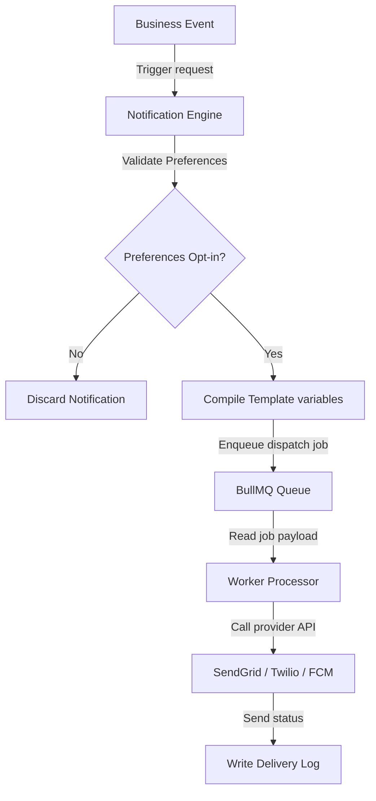
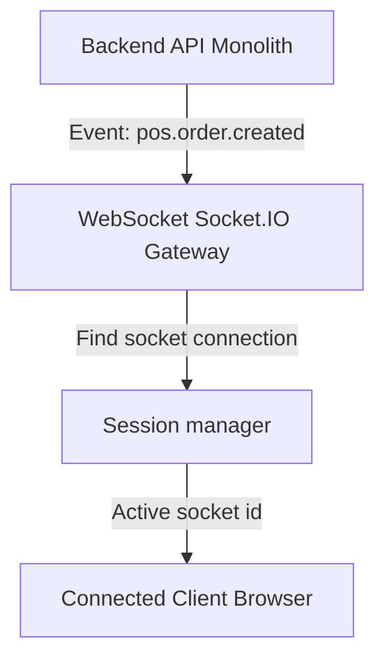
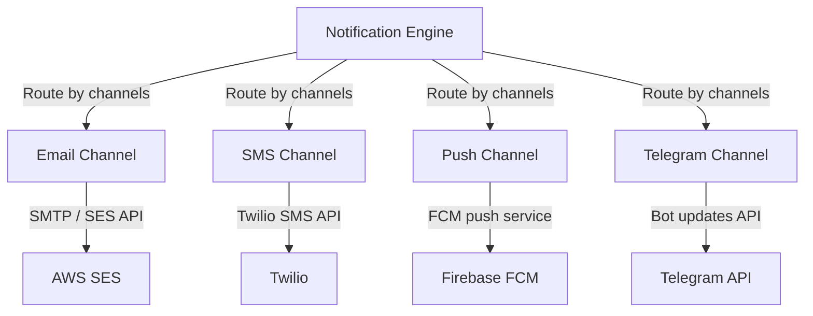
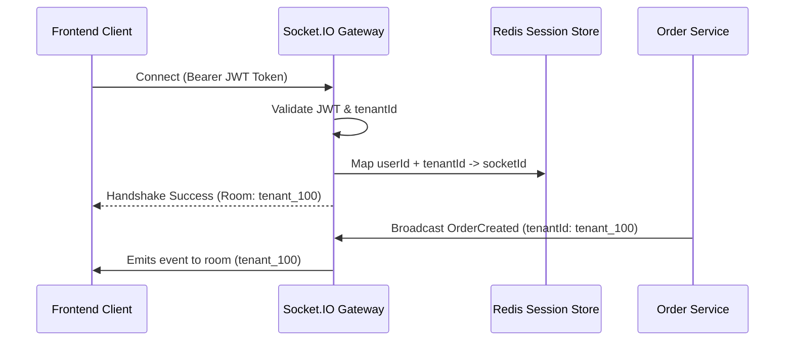
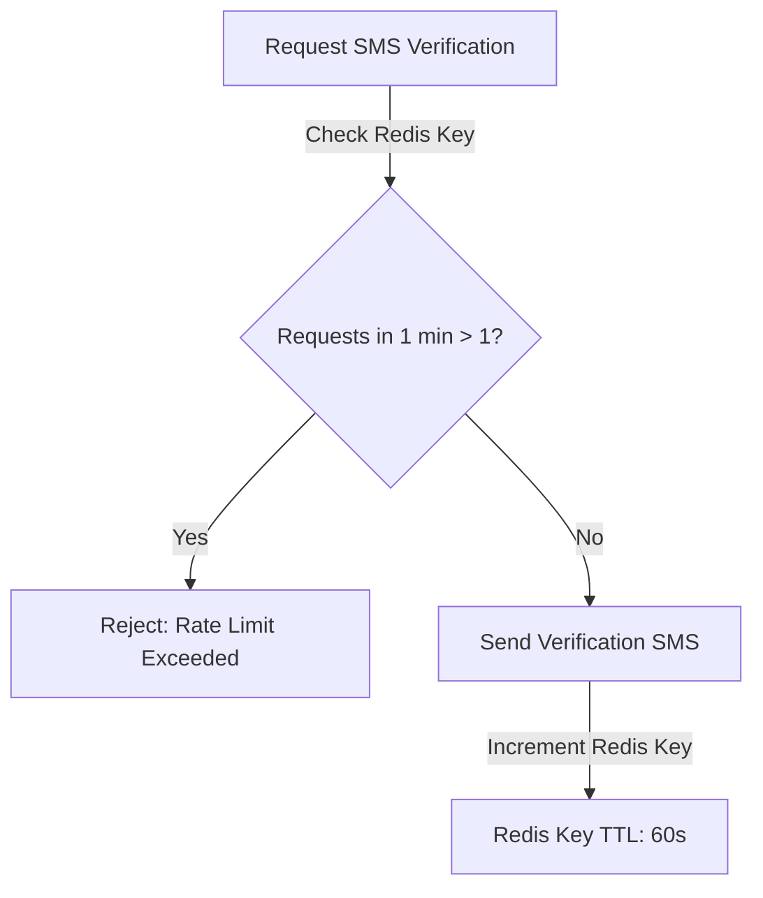

# NOTIFICATION & COMMUNICATION CORE ARCHITECTURE

**Project Name:** Enterprise SaaS Business Management Platform  
**Document Version:** 1.0.0 — Baseline Standard  
**Date:** July 14, 2026  
**Authors:** Principal Backend Architect, Communication Platform Architect, and NestJS Enterprise Engineer  
**Classification:** Internal — Confidential  
**Phase:** 23.17 — Notification & Communication Core Architecture  

---

## Table of Contents

1. [Executive Summary](#1-executive-summary)
2. [Notification Architecture Overview](#2-notification-architecture-overview)
3. [Communication Architecture Design](#3-communication-architecture-design)
4. [Notification Core Module Structure](#4-notification-core-module-structure)
5. [Notification Channel Architecture](#5-notification-channel-architecture)
6. [Notification Flow Design](#6-notification-flow-design)
7. [Notification Template Architecture](#7-notification-template-architecture)
8. [User Notification Preference System](#8-user-notification-preference-system)
9. [Multi-Tenant Notification Architecture](#9-multi-tenant-notification-architecture)
10. [Real-Time Notification Architecture](#10-real-time-notification-architecture)
11. [Background Job Integration](#11-background-job-integration)
12. [External Provider Integration](#12-external-provider-integration)
13. [Notification Database Design](#13-notification-database-design)
14. [Security Architecture](#14-security-architecture)
15. [Notification Architecture Diagrams](#15-notification-architecture-diagrams)
16. [Enterprise Implementation Guidelines](#16-enterprise-implementation-guidelines)
17. [Implementation Summary](#17-implementation-summary)

---

## 1. Executive Summary

### 1.1 Document Purpose
This document establishes the **Notification & Communication Core Architecture** (Phase 23.17). It details multi-channel adapters, dynamic templates, user preference managers, WebSocket gateways, and multi-tenant customization rules.

---

## 2. Notification Architecture Overview

### 2.1 The Need for a Centralized System
A centralized notification system isolates template compilation and delivery providers from business modules, ensuring consistent layouts, preference auditing, and delivery logging across all channels.

### 2.2 Notification Types
*   **Transactional Notifications:** Triggered by user actions (e.g., invoices, pass resets).
*   **Marketing Notifications:** Promotional alerts (e.g., campaigns).
*   **System Notifications:** Administrative messages (e.g., maintenance).

### 2.3 Key Benefits
*   **Engagement:** Drives user interactions via push notifications.
*   **Operations:** Dispatches automated operational alerts.
*   **Security:** Delivers immediate verification codes and sign-in alerts.

---

## 3. Communication Architecture Design

Events flow from business components to user channels:

```
Business Event ──► Notification Service ──► BullMQ ──► Provider Adapter ──► User
```

### 3.1 Component Responsibilities
*   **Event Producer:** Emits domain events.
*   **Notification Engine:** Compiles templates, resolves preferences, and route jobs.
*   **Queue Processor:** Manages delivery retries and throttling rules.
*   **Provider Adapter:** Translates payloads into provider-specific API calls.

---

## 4. Notification Core Module Structure

The notification components are located under `src/core/notifications/`:

```
src/core/notifications/
 ├── notifications.module.ts       (Registers channels, gateways, and configurations)
 ├── notification.service.ts       (Exposes clean API methods to send alerts)
 ├── notification.engine.ts        (Resolves routing logic and preference checks)
 ├── channels/
 │    ├── email.channel.ts         (SMTP/SES provider wrapper)
 │    ├── sms.channel.ts           (Twilio/local provider wrapper)
 │    ├── push.channel.ts          (Firebase Cloud Messaging wrapper)
 │    ├── inapp.channel.ts         (WebSocket gateway wrapper)
 │    └── telegram.channel.ts      (Telegram Bot API wrapper)
 ├── templates/
 │    └── template.service.ts      (Compiles Dynamic Handlebars/EJS templates)
 ├── preferences/
 │    └── preference.service.ts    (Validates recipient channel preferences)
 └── interfaces/
      └── notification.interface.ts (TypeScript definitions for notification modules)
```

---

## 5. Notification Channel Architecture

*   **Email:** Handles invoices, reports, and onboarding layouts.
*   **SMS:** Delivers low-latency One-Time Passwords (OTPs) and security alerts.
*   **Push:** Sends instant mobile application updates.
*   **In-App:** Renders real-time dashboard notifications.
*   **Telegram:** Delivers backup alerts and admin notifications.

---

## 6. Notification Flow Design

```
Business Action ──► Select Channel ──► Check Preferences ──► Queue Job ──► Dispatch ──► Log Status
```

1.  **Business Action:** A business module triggers a notification request.
2.  **Channel Selection:** The engine selects target communication channels.
3.  **Preferences Check:** The system verifies the user's opt-in settings.
4.  **Queue Job:** Enqueues the notification task in BullMQ.
5.  **Dispatch:** The active provider adapter delivers the message.
6.  **Log Status:** The database records delivery metrics.

---

## 7. Notification Template Architecture

### 7.1 Template Schema
Templates are structured to support localization:

```json
{
  "templateId": "tmpl-invoice-created",
  "type": "email",
  "language": "en",
  "variables": {
    "customerName": "John Doe",
    "invoiceAmount": "$150.00"
  }
}
```

Dynamic variables are compiled using **Handlebars** to maintain clean separating lines between template design and data.

---

## 8. User Notification Preference System

### 8.1 Preference Schema
Users can customize their notification channels:

```json
{
  "userId": "user-uuid-111",
  "preferences": {
    "security_alerts": { "email": true, "sms": true, "push": true },
    "billing_invoices": { "email": true, "sms": false, "push": false },
    "marketing": { "email": false, "sms": false, "push": false }
  }
}
```

*   **Security Alerts:** Locked to enabled to protect accounts.
*   **Marketing Alerts:** Configured as opt-in by default to ensure compliance.

---

## 9. Multi-Tenant Notification Architecture

### 9.1 Tenant Settings Schema
Tenants can customize their communication branding:

```json
{
  "tenantId": "tenant-uuid-123",
  "senderName": "Acme Corp Support",
  "senderEmail": "support@acme.com",
  "smtpSettings": {
    "host": "smtp.acme.com",
    "port": 587
  },
  "branding": {
    "logoUrl": "https://cdn.saas.com/tenant-123/logo.png",
    "primaryColor": "#1A56C4"
  }
}
```

---

## 10. Real-Time Notification Architecture

The platform uses WebSockets (`Socket.io`) to deliver real-time in-app alerts:

```
Backend Event ──► WebSocket Gateway ──► Authenticated Socket Connection ──► Client
```

Use cases include new orders, system alerts, and payment confirmations.

---

## 11. Background Job Integration

Notifications are queued in BullMQ to handle provider rate limits and transient network failures:

*   **Throttling:** Limits dispatches to comply with provider rate limits.
*   **Exponential Backoff:** Retries failed dispatches with progressive delays.
*   **DLQ Routing:** Unsent notifications are routed to a Dead Letter Queue (DLQ) for manual review.

---

## 12. External Provider Integration

*   **Email:** SMTP, SendGrid, and AWS SES.
*   **SMS:** Twilio and local providers.
*   **Push:** Firebase Cloud Messaging (FCM).
*   **Telegram:** Telegram Bot API.

The provider adapters implement standard interfaces, allowing teams to switch providers without altering core system code.

---

## 13. Notification Database Design

The database schema models notification states and delivery histories:

```
NotificationTemplate ──► Notification ──► NotificationDelivery
```

*   **Read State:** In-app notifications track read/unread status.
*   **Delivery Log:** Records delivery metrics for audits.

---

## 14. Security Architecture

*   **Rate Limits:** Throttles OTP dispatches to prevent spam.
*   **Data Masking:** Redacts PII in SMS and push payloads.
*   **Unauthorized Dispatch Protection:** Validates user authorization levels before executing notification requests.

---

## 15. Notification Architecture Diagrams

### 15.1 Notification Processing Flow



### 15.2 Real-Time Notification Architecture



### 15.3 Multi-Channel Dispatch Strategy



### 15.4 WebSocket Tenant Session Management



### 15.5 OTP rate-limiting protection loop



---

## 16. Enterprise Implementation Guidelines

### 16.1 Naming Conventions
Notification event names use past-tense dot notation: `[module].[resource].[event_name]` (e.g., `billing.invoice.created`).

### 16.2 Template Controls
Templates are saved as version-controlled JSON payloads, allowing changes to email layouts without rebuilding application packages.

---

## 17. Implementation Summary

### 17.1 Notifications Setup Schedule

| Task | Target Timeline | Status |
| :--- | :--- | :--- |
| Set up Socket.IO gateway architectures | Day 1 | Planned |
| Create email SMTP communication channels | Day 2 | Planned |
| Implement user preference management | Day 3 | Planned |
| Configure SMS/Push notification adapters | Day 4 | Planned |

---

## Document Control

| Field | Value |
|---|---|
| **Document ID** | SBMP-BE-23.17-NOTIFICATIONS |
| **Version** | 1.0.0 |
| **Status** | APPROVED — Baseline |
| **Owner** | Communication Platform Architect |
| **Reviewed By** | Principal Architect, Lead Developer, SecOps Lead |
| **Review Cycle** | Quarterly |
| **Next Review** | October 2026 |

---

*Phase 23.17 — Notification & Communication Core Architecture | SaaS Business Management Platform*  
*Enterprise Confidential — © 2026 All Rights Reserved*
