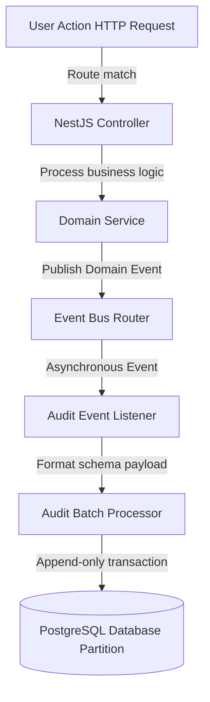
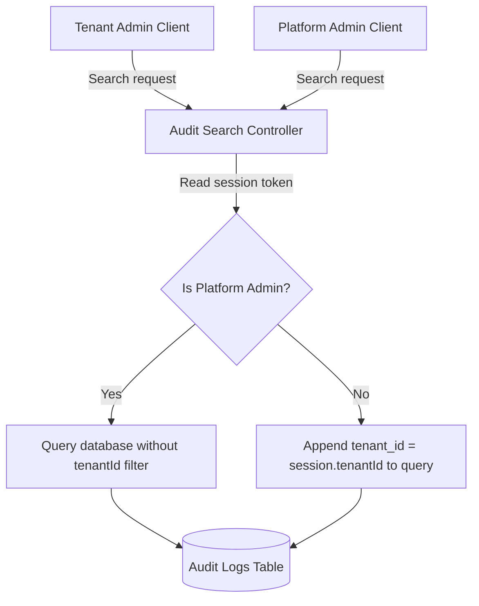
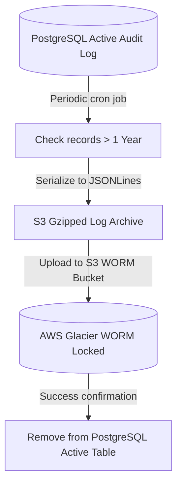
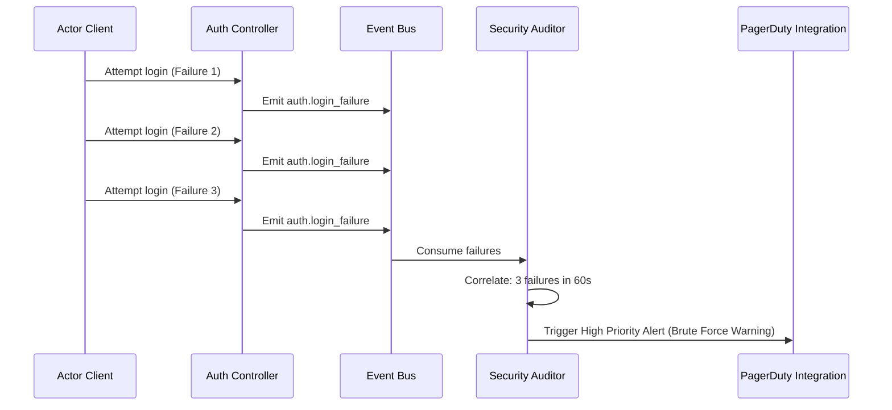

# AUDIT LOGGING & COMPLIANCE CORE ARCHITECTURE

**Project Name:** Enterprise SaaS Business Management Platform  
**Document Version:** 1.0.0 — Baseline Standard  
**Date:** July 14, 2026  
**Authors:** Principal Backend Architect, Security Architect, and Enterprise Compliance Engineer  
**Classification:** Internal — Confidential  
**Phase:** 23.18 — Audit Logging & Compliance Core Architecture  

---

## Table of Contents

1. [Executive Summary](#1-executive-summary)
2. [Audit Logging Architecture Overview](#2-audit-logging-architecture-overview)
3. [Audit Architecture Design](#3-audit-architecture-design)
4. [Audit Core Module Structure](#4-audit-core-module-structure)
5. [Audit Event Design](#5-audit-event-design)
6. [Audit Event Categories](#6-audit-event-categories)
7. [Audit Logging Flow](#7-audit-logging-flow)
8. [Event-Driven Audit Architecture](#8-event-driven-audit-architecture)
9. [Multi-Tenant Audit Architecture](#9-multi-tenant-audit-architecture)
10. [Audit Database Design](#10-audit-database-design)
11. [Compliance & Data Retention Strategy](#11-compliance--data-retention-strategy)
12. [Audit Search Architecture](#12-audit-search-architecture)
13. [Security Protection](#13-security-protection)
14. [Monitoring Integration](#14-monitoring-integration)
15. [Audit Architecture Diagrams](#15-audit-architecture-diagrams)
16. [Enterprise Implementation Guidelines](#16-enterprise-implementation-guidelines)
17. [Implementation Summary](#17-implementation-summary)

---

## 1. Executive Summary

### 1.1 Document Purpose
This document establishes the **Audit Logging & Compliance Core Architecture** (Phase 23.18). It details asynchronous logging pathways, domain event listeners, compliance retention schedules (SOC 2, GDPR), search endpoints, and cryptographic protection schemas for audit records.

---

## 2. Audit Logging Architecture Overview

### 2.1 Centralized Audit Trails in SaaS
Compliance frameworks (e.g., SOC 2 Type II, ISO 27001) require SaaS applications to maintain chronological, immutable records of all security-relevant and data-altering actions. The audit logging module provides this accountability without impacting system performance.

### 2.2 Logging Classifications
*   **Application Logs:** Internal system debug traces, error logs, and metrics.
*   **Security Logs:** Authentication attempts, permission evaluations, and firewall blocks.
*   **Audit Logs:** High-value business activity logs capturing who did what, when, and to which resources.

---

## 3. Audit Architecture Design

Audit logs are collected and processed asynchronously:

```
User Action ──► Domain Event ──► Audit Processor ──► WORM Storage ──► Admin Viewer
```

### 3.1 Component Responsibilities
*   **Audit Producer:** The service emitting events or controller annotations.
*   **Audit Collector:** The background event listener that aggregates and formats audit records.
*   **Audit Storage:** The write-once, read-many (WORM) storage pool.
*   **Audit Viewer:** The interface for administrators to search and inspect audit logs.

---

## 4. Audit Core Module Structure

The audit components are located under `src/core/audit/`:

```
src/core/audit/
 ├── audit.module.ts               (Registers event subscribers and intercepts)
 ├── audit.service.ts              (Exposes methods to programmatically write audit records)
 ├── audit.processor.ts            (Manages background database batch writes)
 ├── decorators/
 │    └── audit.decorator.ts       (Interceptor-backed decorator for controllers)
 ├── listeners/
 │    └── audit.event.listener.ts  (Listens to domain events and translates them to audit logs)
 ├── repositories/
 │    └── audit.repository.ts      (Handles querying and archiving operations)
 └── interfaces/
      └── audit.interface.ts       (TypeScript types for actor and resource definitions)
```

---

## 5. Audit Event Design

### 5.1 JSON Payload Schema
Every audit record uses a standardized JSON payload structure:

```json
{
  "id": "aud-8f7e6d5c",
  "tenantId": "tenant-uuid-111",
  "userId": "user-uuid-222",
  "action": "order.modified",
  "module": "sales",
  "resource": "order",
  "resourceId": "order-uuid-333",
  "oldValue": { "status": "PENDING" },
  "newValue": { "status": "APPROVED" },
  "ipAddress": "192.168.1.1",
  "userAgent": "Mozilla/5.0...",
  "timestamp": "2026-07-14T03:06:23Z"
}
```

*   `id`: Unique identifier for the audit record.
*   `tenantId`: Groups records for multi-tenant isolation.
*   `userId`: Identifies the user who performed the action.
*   `action`: The action name (`resource.action_past_tense`).
*   `module` / `resource`: Identifies the source system and entity type.
*   `oldValue` / `newValue`: Captures state changes.

---

## 6. Audit Event Categories

*   **Authentication Events:** `auth.login_success`, `auth.login_failure`, `auth.password_changed`.
*   **Authorization Events:** `authz.role_assigned`, `authz.permission_updated`.
*   **Business Events:** `pos.order.created`, `billing.payment_approved`.
*   **Security Events:** `security.suspicious_activity`, `security.brute_force_detected`.

---

## 7. Audit Logging Flow

```
HTTP Request ──► Interceptor / Domain Event ──► Event Bus ──► Background Writer
```

Audit logging is designed as an asynchronous process. Writing audit logs must not block or delay primary business operations. When a business transaction succeeds, it publishes a domain event; the audit module consumes this event and writes the log asynchronously using a background process.

---

## 8. Event-Driven Audit Architecture

The audit module subscribes to domain events to generate records:

1.  `PaymentService` processes a payment and publishes a `payment.completed` event.
2.  `AuditEventListener` consumes the event payload.
3.  The listener sanitizes the event variables and stores the audit record asynchronously.

---

## 9. Multi-Tenant Audit Architecture

*   **Log Segregation:** Every audit query automatically appends a `tenantId` filter.
*   **Platform Administrators:** Authorized super-admins can run system-wide audit reports across all tenants.
*   **Tenant Administrators:** Locked to view only audit records associated with their `tenantId`.

---

## 10. Audit Database Design

To optimize search performance, the audit table is structured for write-heavy workloads:

*   **Table Partitioning:** Partitioned by `created_at` date ranges to keep table sizes manageable.
*   **Indexes:** Enforces indexes on `tenant_id`, `user_id`, `action`, and `timestamp`.
*   **Retention:** Active audit records are stored in PostgreSQL for 1 year before being archived.

---

## 11. Compliance & Data Retention Strategy

The platform implements data retention rules in compliance with global standards:

*   **Security & Auth Logs:** Retained in PostgreSQL for 1 year to support SOC 2 audits.
*   **Financial Audit Logs:** Retained for 7 years to meet tax and accounting standards.
*   **Archiving:** Archived logs are written to immutable AWS S3 buckets configured with WORM lock policies.

---

## 12. Audit Search Architecture

```
Admin Dashboard UI ──► Audit Search API ──► Partition Query ──► Result
```

The search API supports filters for Date Range, Module, Action, User ID, and Tenant ID, allowing administrators to locate events quickly.

---

## 13. Security Protection

*   **Read-Only/Append-Only:** Database credentials restrict the application from running `UPDATE` or `DELETE` commands on the audit tables.
*   **PII Masking:** Personally Identifiable Information (e.g., credit card numbers, passwords) is redacted or masked before being logged.
*   **Tamper Evidence:** Audit logs are cryptographically chained using SHA-256 hashes to detect any tampering attempts.

---

## 14. Monitoring Integration

*   **Alerting:** Security events (e.g., three consecutive login failures) trigger alert systems.
*   **SIEM Integration:** Logs are exported to monitoring tools (e.g., AWS CloudWatch, Datadog) to support SIEM monitoring.

---

## 15. Audit Architecture Diagrams

### 15.1 Audit Event Flow



### 15.2 Multi-Tenant Audit Query Scoping



### 15.3 Cryptographic log chaining validation

```mermaid
graph LR
    SUBGRAPH_LOGS[Audit Trail Chaining]
        LOG1[Log Record N-1] -->|Payload hash| H1[Hash Value N-1]
        H1 -->|Injected into| LOG2[Log Record N]
        LOG2 -->|Combined payload hash| H2[Hash Value N]
        H2 -->|Injected into| LOG3[Log Record N+1]
    end
```

### 15.4 Audit log archiving lifecycle



### 15.5 Security Alerts Correlation Loop



---

## 16. Enterprise Implementation Guidelines

### 16.1 Audit Naming Conventions
Events must be named using dot notation ending in past tense verbs: `[module].[resource].[action_past_tense]` (e.g., `sales.invoice.generated`).

### 16.2 Data Security Rules
Do not store raw credit card numbers, passwords, authorization tokens, or decrypted credentials in audit values. Use anonymized tokens or hashes where referencing is necessary.

---

## 17. Implementation Summary

### 17.1 Audit Logging Setup Schedule

| Task | Target Timeline | Status |
| :--- | :--- | :--- |
| Set up AuditLog database structures | Day 1 | Planned |
| Implement Async Audit decorators | Day 2 | Planned |
| Configure event listeners | Day 3 | Planned |
| Build audit search controllers | Day 4 | Planned |

---

## Document Control

| Field | Value |
|---|---|
| **Document ID** | SBMP-BE-23.18-AUDIT-COMPLIANCE |
| **Version** | 1.0.0 |
| **Status** | APPROVED — Baseline |
| **Owner** | Enterprise Compliance Architect |
| **Reviewed By** | Principal Architect, Security Director, Lead DBA |
| **Review Cycle** | Quarterly |
| **Next Review** | October 2026 |

---

*Phase 23.18 — Audit Logging & Compliance Core Architecture | SaaS Business Management Platform*  
*Enterprise Confidential — © 2026 All Rights Reserved*
