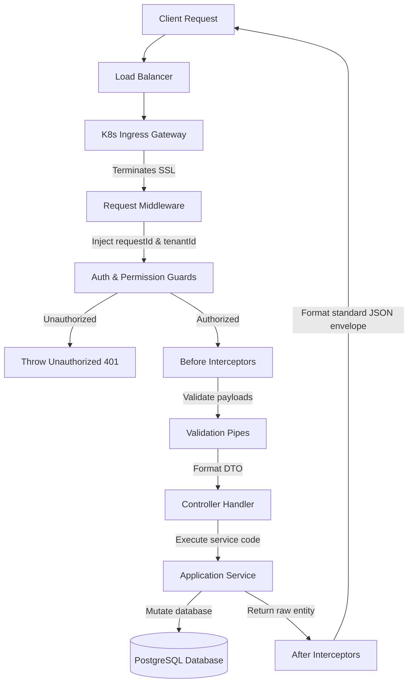
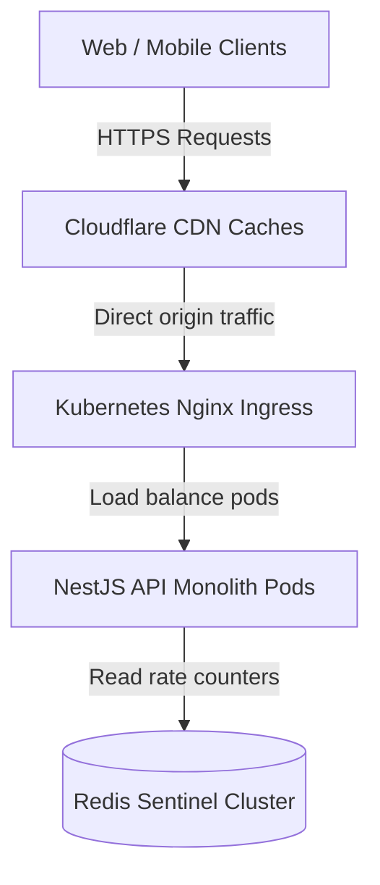
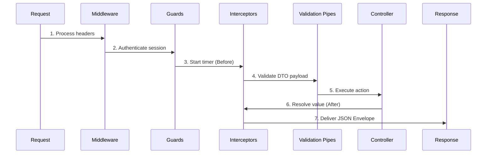
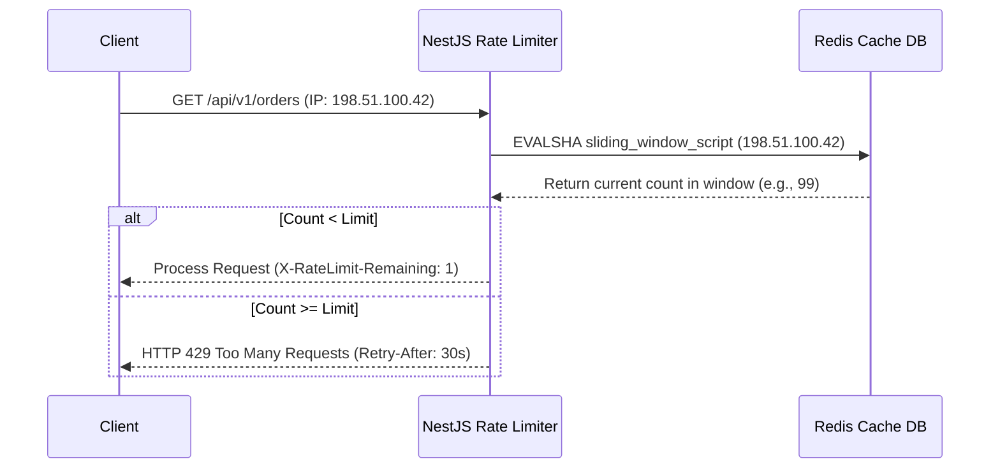
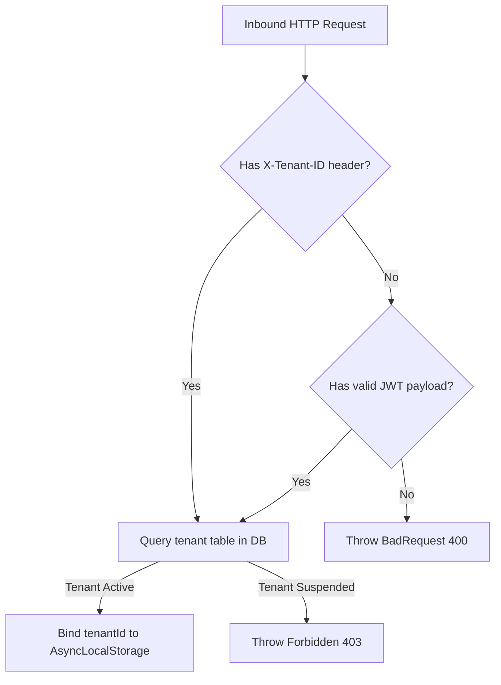

# API GATEWAY & REQUEST LIFECYCLE CORE ARCHITECTURE

**Project Name:** Enterprise SaaS Business Management Platform  
**Document Version:** 1.0.0 — Baseline Standard  
**Date:** July 14, 2026  
**Authors:** Principal Backend Architect, API Platform Architect, and NestJS Enterprise Engineer  
**Classification:** Internal — Confidential  
**Phase:** 23.19 — API Gateway & Request Lifecycle Core Architecture  

---

## Table of Contents

1. [Executive Summary](#1-executive-summary)
2. [API Gateway Architecture Overview](#2-api-gateway-architecture-overview)
3. [Request Lifecycle Architecture](#3-request-lifecycle-architecture)
4. [NestJS Request Pipeline Design](#4-nestjs-request-pipeline-design)
5. [API Gateway Core Module Structure](#5-api-gateway-core-module-structure)
6. [API Security Gateway Layer](#6-api-security-gateway-layer)
7. [Request Context Architecture](#7-request-context-architecture)
8. [API Versioning Architecture](#8-api-versioning-architecture)
9. [Rate Limiting Architecture](#9-rate-limiting-architecture)
10. [API Gateway Multi-Tenant Flow](#10-api-gateway-multi-tenant-flow)
11. [Integration With Existing Core Modules](#11-integration-with-existing-core-modules)
12. [External API Gateway Architecture](#12-external-api-gateway-architecture)
13. [Performance Optimization](#13-performance-optimization)
14. [API Monitoring Strategy](#14-api-monitoring-strategy)
15. [API Gateway Diagrams](#15-api-gateway-diagrams)
16. [Enterprise Implementation Guidelines](#16-enterprise-implementation-guidelines)
17. [Implementation Summary](#17-implementation-summary)

---

## 1. Executive Summary

### 1.1 Document Purpose
This document establishes the **API Gateway & Request Lifecycle Core Architecture** (Phase 23.19). It details NestJS request pipelines, middleware propagation, guard structures, request context caching, Redis rate-limiting configurations, and external Kubernetes Ingress gateways.

---

## 2. API Gateway Architecture Overview

### 2.1 Centralized Request Management
In enterprise microservices and modular monoliths, direct service access introduces security risks, duplicated authentication logic, and operational complexity. The API Gateway pattern addresses this by routing requests through a single entry point that manages routing, rate limiting, authentication, and logging.

### 2.2 Direct Service Access vs. API Gateway Pattern
*   **Direct Service Access:** Clients connect directly to downstream service endpoints, exposing internal service layouts and security logic.
*   **API Gateway Pattern:** Clients communicate exclusively with the gateway, which routes requests, validates tokens, and handles rate limiting.

---

## 3. Request Lifecycle Architecture

HTTP requests proceed through the following infrastructure and application layers:

```
Client ──► Load Balancer ──► Gateway ──► Middleware ──► Guard ──► Interceptor ──► Controller ──► DB
```

### 3.1 Lifecycle Stages
1.  **Client Request:** Client initiates an HTTP or WebSocket connection.
2.  **Load Balancer:** Distributes traffic across active instances.
3.  **API Gateway (Monolith Entry):** Terminates SSL certificates, validates headers, and enforces rate limits.
4.  **Middleware:** Injects tracing IDs and resolves tenant contexts.
5.  **Guard:** Evaluates JWT validity and validates user permissions.
6.  **Interceptor (Before):** Begins execution timers and sanitizes inputs.
7.  **Controller:** Resolves path parameters and delegates to business services.
8.  **Service / Repository:** Executes business operations and retrieves database records.

---

## 4. NestJS Request Pipeline Design

The NestJS framework processes inbound requests using a structured pipeline. Understanding this execution order is critical for implementing security checks, error boundaries, and context resolvers at the correct stage:

```
Middleware ──► Guards ──► Interceptors (Before) ──► Pipes ──► Controller ──► Interceptors (After) ──► Exception Filters
```

*   **Pipes:** Execute *after* guards and interceptors, meaning payload validation occurs only on authenticated and authorized requests.
*   **Exception Filters:** Catch all unhandled exceptions, formatting them into standardized API responses.

---

## 5. API Gateway Core Module Structure

The gateway components are located under `src/core/gateway/`:

```
src/core/gateway/
 ├── gateway.module.ts             (Wires up middlewares, guards, and rate limit providers)
 ├── gateway.service.ts            (Exposes routing controls and health statuses)
 ├── middleware/
 │    ├── request.middleware.ts    (Injects unique UUIDs to track requests)
 │    └── tenant.middleware.ts     (Resolves tenant context from headers or tokens)
 ├── guards/
 │    ├── auth.guard.ts            (Verifies bearer JWT tokens)
 │    └── permission.guard.ts      (Validates user scopes against resource endpoints)
 ├── interceptors/
 │    ├── logging.interceptor.ts   (Logs execution times and request payloads)
 │    └── response.interceptor.ts  (Formats outputs into standard JSON envelopes)
 └── throttling/
      └── rate-limit.config.ts     (Defines Redis-backed rate limiting rules)
```

---

## 6. API Security Gateway Layer

*   **Authentication Guard:** Validates signature configurations and checks token expiration.
*   **Authorization Guard:** Validates CASL actions (`read`, `create`, `update`, `delete`) before invoking controller handlers.
*   **IP Filtering:** Denies traffic from blocked CIDR ranges.
*   **Security Headers:** Helmets configure headers to prevent Cross-Site Scripting (XSS) and Clickjacking.

---

## 7. Request Context Architecture

### 7.1 Request Context Schema
An active context object is created for each request and bound to the thread-local storage:

```json
{
  "requestId": "req-7c8b9a2f-e3d4",
  "userId": "user-uuid-1234-5678",
  "tenantId": "tenant-uuid-9999-0000",
  "role": "TENANT_ADMIN",
  "permissions": ["pos.order.create", "pos.order.read"],
  "ip": "198.51.100.42",
  "userAgent": "Mozilla/5.0..."
}
```

This context is used to track operations in logging pipelines, evaluate authorization rules, and write security audits.

---

## 8. API Versioning Architecture

To support backward compatibility for client integrations, the platform implements URI-based API versioning:

```
/api/v1/orders ──► Route Handler V1
/api/v2/orders ──► Route Handler V2
```

*   **Deprecation Headers:** Deprecated endpoints return `Warning: 299 - "API version is deprecated"` headers to prompt client updates.

---

## 9. Rate Limiting Architecture

To protect system resources against brute force attacks and DDoS attempts, the platform uses a Redis-backed rate limiter:

*   **Auth Endpoints (e.g., `/api/v1/auth/login`):** Limit of 5 requests per minute.
*   **Standard Endpoints (e.g., `/api/v1/products`):** Limit of 100 requests per minute per IP address.

```
Request ──► Check Redis Counter ──► Counter < Limit? ──► Increment & Allow / Throw HTTP 429
```

---

## 10. API Gateway Multi-Tenant Flow

1.  **Extract Identifier:** Resolves the tenant ID from the `X-Tenant-ID` header or JWT payload.
2.  **Validate Tenant:** Verifies that the tenant exists and has an active subscription status.
3.  **Attach Context:** Binds the resolved tenant ID to the active `AsyncLocalStorage` instance.

---

## 11. Integration With Existing Core Modules

*   **Authentication:** Gateway guards extract and validate JWT headers.
*   **Logging:** Injects `requestId` into all logs generated during the request lifecycle.
*   **Exception Handling:** Pipelines map database and validation errors to standard JSON envelopes.

---

## 12. External API Gateway Architecture

For scale-out deployments, the system uses an external **Kubernetes Ingress Controller (Nginx)** to handle SSL termination, rate limiting, and routing before traffic reaches the NestJS application pods.

---

## 13. Performance Optimization

*   **Compression:** Employs Brotli/Gzip compression on JSON responses to reduce payload transfer sizes.
*   **TCP Connection Reuse:** Keeps TCP connections open between the ingress controller and application pods.
*   **Request Caching:** Caches public GET endpoints in Redis to bypass database queries.

---

## 14. API Monitoring Strategy

*   **SLO Tracking:** Monitors request latency, HTTP 5xx error rates, and connection counts.
*   **Telemetry:** Prometheus exports gateway performance data to Grafana dashboards.

---

## 15. API Gateway Diagrams

### 15.1 Complete Request Lifecycle



### 15.2 Production API Gateway Topology



### 15.3 NestJS execution pipeline sequence



### 15.4 Redis-based sliding window rate limiter



### 15.5 Multi-Tenant Request Identification Routing



---

## 16. Enterprise Implementation Guidelines

### 16.1 API Naming Conventions
Endpoints must use lower-case plural nouns with version prefixes: `/api/v[version]/[resources]` (e.g., `/api/v1/invoices`).

### 16.2 Production Deployment Rules
Ensure that the Nginx ingress controller limits maximum request payload sizes (e.g., to 10MB) to protect application pods from memory exhaustion.

---

## 17. Implementation Summary

### 17.1 Gateway Setup Schedule

| Task | Target Timeline | Status |
| :--- | :--- | :--- |
| Create RequestContext middleware models | Day 1 | Planned |
| Implement Auth & Permission guards | Day 2 | Planned |
| Configure Redis sliding window limiters | Day 3 | Planned |
| Verify Nginx ingress routing rules | Day 4 | Planned |

---

## Document Control

| Field | Value |
|---|---|
| **Document ID** | SBMP-BE-23.19-API-GATEWAY |
| **Version** | 1.0.0 |
| **Status** | APPROVED — Baseline |
| **Owner** | API Platform Architect |
| **Reviewed By** | Principal Architect, Lead Developer, SecOps Lead |
| **Review Cycle** | Quarterly |
| **Next Review** | October 2026 |

---

*Phase 23.19 — API Gateway & Request Lifecycle Core Architecture | SaaS Business Management Platform*  
*Enterprise Confidential — © 2026 All Rights Reserved*
