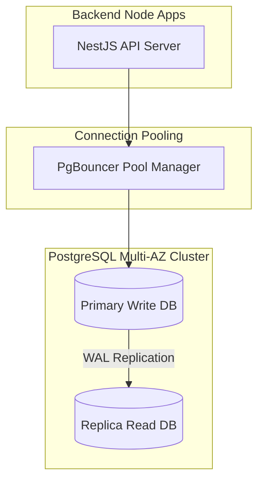
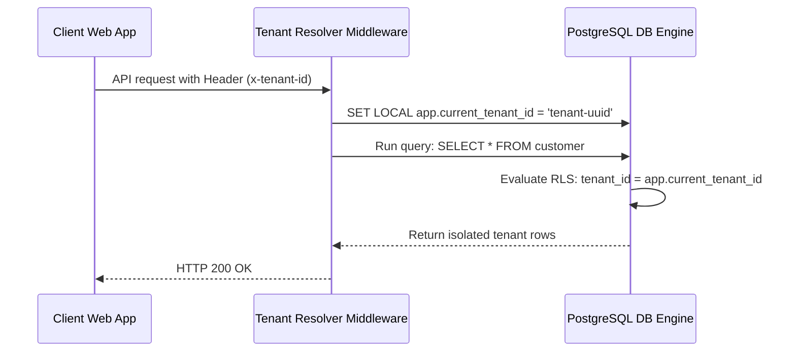
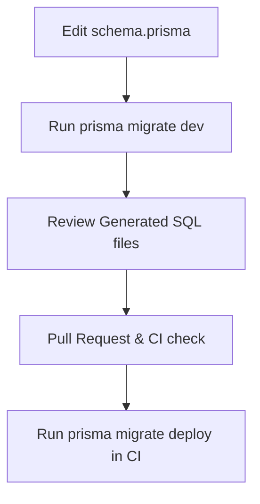
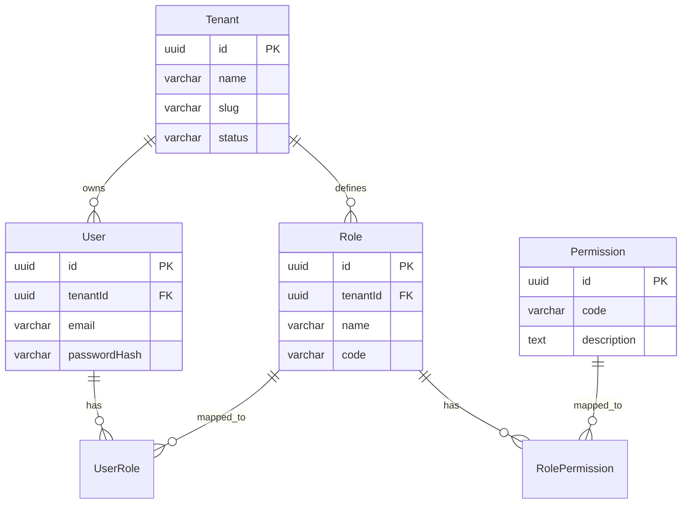
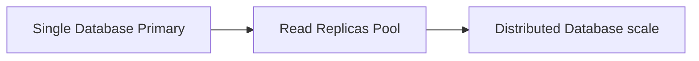

# DATABASE SCHEMA IMPLEMENTATION

**Project Name:** Enterprise SaaS Business Management Platform  
**Document Version:** 1.0.0 — Baseline Standard  
**Date:** July 14, 2026  
**Authors:** Principal Database Architect, PostgreSQL Expert, Prisma ORM Architect, Backend Engineer, and Enterprise Data Model Designer  
**Classification:** Internal — Confidential  
**Phase:** 23.2 — Database Schema Implementation  

---

## Table of Contents

1. [Executive Summary](#1-executive-summary)
2. [Database Implementation Foundation](#2-database-implementation-foundation)
3. [Database Architecture Layers](#3-database-architecture-layers)
4. [Multi-Tenant Database Model](#4-multi-tenant-database-model)
5. [Core Identity Tables](#5-core-identity-tables)
6. [Authentication Database](#6-authentication-database)
7. [Subscription & Billing Database](#7-subscription--billing-database)
8. [Business Core Database Foundation](#8-business-core-database-foundation)
9. [Audit & Logging Database](#9-audit--logging-database)
10. [Prisma Project Structure](#10-prisma-project-structure)
11. [Prisma Modeling Rules](#11-prisma-modeling-rules)
12. [Database Migration Strategy](#12-database-migration-strategy)
13. [Database Seed Strategy](#13-database-seed-strategy)
14. [Database Security](#14-database-security)
15. [Database Performance Optimization](#15-database-performance-optimization)
16. [Database Schema Testing](#16-database-schema-testing)
17. [Database Development Workflow](#17-database-development-workflow)
18. [Database Documentation & References](#18-database-documentation--references)
19. [Database Evolution Roadmap](#19-database-evolution-roadmap)
20. [Initial Database Implementation Milestone](#20-initial-database-implementation-milestone)
21. [Final Database Implementation Blueprints (Mermaid)](#21-final-database-implementation-blueprints-mermaid)
22. [Implementation Summary](#22-implementation-summary)

---

## 1. Executive Summary

### 1.1 Document Purpose
This document establishes the **Database Schema Implementation Plan** (Phase 23.2). It details the transition of the conceptual multi-tenant database design into a physical PostgreSQL schema using Prisma ORM.

### 1.2 Technology Requirements
*   **Database Engine:** PostgreSQL 15+ (enabling Row-Level Security, B-Tree/GIN indexing, and JSONB payloads).
*   **ORM Layer:** Prisma ORM with TypeScript bindings.
*   **Tenant Isolation Model:** Shared Database, Shared Schema, Tenant ID columns with Row-Level Security (RLS) policies.

---

## 2. Database Implementation Foundation

The database schema design proceeds through three development stages to ensure accuracy and performance:

```
  CONCEPTUAL MODEL            LOGICAL MODEL             PHYSICAL DATABASE
┌──────────────┐        ┌──────────────┐        ┌──────────────┐
│ Entity       │ ───►   │ Normalized   │ ───►   │ PostgreSQL   │
│ relationships│        │ schemas,     │        │ DDL tables,  │
│ mapped out   │        │ foreign keys │        │ indexes, RLS │
└──────────────┘        └──────────────┘        └──────────────┘
```

---

## 3. Database Architecture Layers

The database schema is organized into six functional layers:

```
   IDENTITY LAYER ◄── Authentication, Sessions, and Refresh Tokens
         │
         ▼
   TENANT LAYER ◄── Tenants, Subscriptions, and Plan Configurations
         │
         ▼
   SECURITY LAYER ◄── Users, Roles, Permissions, and Access Audits
         │
         ▼
   BUSINESS LAYER ◄── Organizations, Customers, and Inventories
         │
         ▼
   TRANSACTION LAYER ◄── Orders, Payments, Invoices, and Ledgers
         │
         ▼
   ANALYTICS LAYER ◄── Metrics Cubes and Clickstream Event Logs
```

---

## 4. Multi-Tenant Database Model

The database uses a **Shared Database, Shared Schema** multi-tenancy model to balance resource efficiency and operational simplicity:

*   **Tenant ID Columns:** Every tenant-specific table contains a `tenantId` UUID foreign key referencing the `Tenant` table.
*   **Row-Level Security (RLS):** PostgreSQL RLS policies block cross-tenant database access at the engine layer, acting as a fallback for application-layer security checks.

### 4.1 Tenant Context Flow
1.  **Request Inbound:** The client issues an API call including the Tenant HTTP header.
2.  **Authentication:** Gateway validates JWT tokens, decoding User and Tenant context.
3.  **Tenant Resolver:** Middleware binds the active Tenant ID to the transaction context.
4.  **Database Query:** The database runs queries with RLS filters applied.

---

## 5. Core Identity Tables

### 5.1 Tenant Table
*   `id`: UUID (Primary Key, Default: `uuid_generate_v4()`).
*   `name`: VARCHAR(255) (Not Null).
*   `slug`: VARCHAR(100) (Unique, Index).
*   `status`: VARCHAR(50) (Active, Suspended).
*   `createdAt`: TIMESTAMP (Default: `now()`).

### 5.2 User Table
*   `id`: UUID (Primary Key).
*   `tenantId`: UUID (Foreign Key, references `Tenant.id`).
*   `email`: VARCHAR(255) (Unique, Index).
*   `passwordHash`: VARCHAR(255) (Nullable for SSO users).
*   `status`: VARCHAR(50).

### 5.3 Role & Permission Tables
*   `Role`: `id` (UUID), `tenantId` (UUID), `name` (VARCHAR(100)), `code` (VARCHAR(100)).
*   `Permission`: `id` (UUID), `code` (VARCHAR(100)), `description` (TEXT).
*   `UserRole` & `RolePermission` act as join tables to map relations.

---

## 6. Authentication Database

Tables in the authentication layer track user sessions and login history:

*   **Account:** Mapped user credentials and third-party login providers.
*   **Session:** Active user logins with expiration timestamps.
*   **RefreshToken:** Signed refresh tokens with automatic rotation markers.
*   **OAuthProvider:** Integrations for SSO logins (e.g., Azure AD, Keycloak).
*   **LoginHistory:** Auditable log tracking IP addresses, user agents, and login status.

---

## 7. Subscription & Billing Database

The billing schema tracks subscription statuses and payment records:

*   **Plan:** Subscription tier configurations, defining usage limits and price points.
*   **Subscription:** Active tenant plan links, renewal dates, and status codes.
*   **Invoice:** Billing invoices linked to customer transactions.
*   **Payment:** Recorded invoice payments (e.g., credit cards, wire transfers).
*   **Transaction:** Ledger transactions tracking payment status and history.

---

## 8. Business Core Database Foundation

The core business layer manages organizational units and inventory:

*   **Organization:** Subsidiary entities managed by a tenant.
*   **Customer:** Customer profiles, addresses, and contacts.
*   **Product & Category:** Inventory products, SKUs, pricing, and category structures.
*   **Order & OrderItem:** Purchase records, item quantities, and pricing data.
*   **Inventory:** Warehouse records tracking stock counts and availability.

---

## 9. Audit & Logging Database

Auditing tables record user and system activities for security compliance:

*   **AuditLog:** Row-level database changes, tracking modified tables, change types, and previous/new values (JSONB).
*   **ActivityLog:** High-level user actions (e.g., exports, configurations, password updates).
*   **SystemEvent:** System alerts, integration errors, and background worker completions.

---

## 10. Prisma Project Structure

Prisma migrations and seed scripts are organized in the shared-types package directory:

```
/packages/shared-types
  ├── /prisma
  │     ├── schema.prisma   (Main Prisma model declarations)
  │     ├── seed.ts         (Seed script executing default record creations)
  │     └── /migrations     (SQL script files history)
  ├── package.json
  └── tsconfig.json
```

---

## 11. Prisma Modeling Rules

Prisma models follow strict naming and relationship conventions:

*   **Naming Conventions:** Models use `CamelCase` singular naming; tables use `snake_case` plural names mapped via `@@map`.
*   **Explicit Relations:** Join tables are declared explicitly (e.g., `UserRole` instead of implicit Prisma relations).
*   **Enums Mapping:** Custom values use PostgreSQL enums mapped using the `@db` property.
*   **Index Optimizations:** Composite indexes are defined for queries that filter by `tenantId` and search terms (e.g., `@@index([tenantId, createdAt])`).

---

## 12. Database Migration Strategy

Database migrations follow a structured workflow to prevent downtime:

```
  MODIFY SCHEMA             GENERATE SQL             APPLY STAGING
┌──────────────┐        ┌──────────────┐        ┌──────────────┐
│ Edit         │ ───►   │ Run prisma   │ ───►   │ Apply to     │
│ schema.prisma│        │ migrate dev  │        │ staging env  │
│ model file   │        │ SQL script   │        │ with tests   │
└──────────────┘        └──────────────┘        └──────────────┘
                                                       │
                                                       ▼
                                                 DEPLOY PRODUCTION
                                                ┌──────────────┐
                                                │ Deploy during│
                                                │ scheduled    │
                                                │ release window│
                                                └──────────────┘
```

---

## 13. Database Seed Strategy

The seed script (`seed.ts`) populates default lookup tables:

*   **System Roles:** Seeds core application roles (e.g., `SuperAdmin`, `TenantAdmin`, `BillingManager`, `SupportStaff`).
*   **Core Permissions:** Populates granular permission flags (e.g., `user:create`, `billing:read`, `settings:write`).
*   **Pricing Plans:** Seeds default billing plan structures (e.g., `Free`, `Growth`, `Enterprise`).
*   **Configuration Keys:** Seeds default system configuration variables.

---

## 14. Database Security

The PostgreSQL setup implements security controls to protect tenant data:

*   **Row-Level Security (RLS):** Every tenant-specific table enforces an RLS policy checking that the active query context matches the target row's `tenantId`.
*   **Data Encryption:** Sensitive fields (e.g., API keys, payment tokens) are encrypted before insertion using pg_crypto keys.
*   **Least Privilege Roles:** The NestJS API connects using a standard application user role restricted from altering tables.

---

## 15. Database Performance Optimization

Performance configurations are optimized for high read-to-write ratios:

*   **Composite Indexing:** Index structures are built on columns used in query filters (`tenantId`, `status`, `createdAt`).
*   **Connection Pooling:** PgBouncer pools connections, preventing backend containers from overloading database limits.
*   **Query Analysis:** Developers run `EXPLAIN ANALYZE` on complex queries to optimize join routes and table scans.

---

## 16. Database Schema Testing

Migration scripts are validated before deploying updates:

*   **Migration Verification:** Validate migration scripts on staging databases to check for schema errors.
*   **Integrity Asserts:** Automated tests execute queries to verify foreign key behaviors and unique constraints.
*   **Isolation Assertions:** Unit tests verify that queries on Tenant B return zero results when run within the security context of Tenant A.

---

## 17. Database Development Workflow

Developers follow a structured process to implement schema updates:

1.  **Draft Model:** Edit `/packages/shared-types/prisma/schema.prisma`.
2.  **Generate Migration:** Run `npx prisma migrate dev --name <migration_name>` locally.
3.  **Local Testing:** Run local test cases and verify seed data generation.
4.  **PR Submission:** Submit the PR, including generated SQL migration files for review.

---

## 18. Database Documentation & References

Database documentation is updated automatically during migrations:

*   **Data Dictionary:** Schema dictionaries list columns, types, nullability properties, and default values.
*   **Database Diagram:** The schema generator updates the database relationship diagrams on every migration run.
*   **Audit Reference Ledger:** Table properties list audit levels and row-level logging policies.

---

## 19. Database Evolution Roadmap

The database architecture scales to support growth:

```
  SINGLE INSTANCE          READ REPLICAS            DISTRIBUTED DB
┌──────────────┐        ┌──────────────┐        ┌──────────────┐
│ Single primary│ ───►   │ Master writes│ ───►   │ Sharded      │
│ database for │        │ with read    │        │ database scale│
│ read/write   │        │ replicas     │        │ by geography │
└──────────────┘        └──────────────┘        └──────────────┘
```

---

## 20. Initial Database Implementation Milestone

The database implementation milestone verifies base schemas:

*   [ ] PostgreSQL database container initializes successfully in Docker.
*   [ ] Prisma connection pools connect to local database endpoints.
*   [ ] Running `prisma migrate deploy` successfully creates core tables.
*   [ ] The seed script executes without errors, populating default roles and permissions.

---

## 21. Final Database Implementation Blueprints (Mermaid)

### 21.1 Database Architecture



### 21.2 Multi-Tenant Data Flow



### 21.3 Prisma Migration Flow



### 21.4 Core Entity Relationship



### 21.5 Database Evolution Roadmap



---

## 22. Implementation Summary

### 22.1 Database Setup Schedule

| Task | Target Timeline | Status |
| :--- | :--- | :--- |
| Set up PostgreSQL Docker container | Day 1 | Planned |
| Create schema.prisma models | Day 2 | Planned |
| Generate initial migrations | Day 3 | Planned |
| Implement seed.ts script | Day 4 | Planned |

---

## Document Control

| Field | Value |
|---|---|
| **Document ID** | SBMP-DB-23.2-SCHEMA-IMPLEMENTATION |
| **Version** | 1.0.0 |
| **Status** | APPROVED — Baseline |
| **Owner** | Principal Database Architect |
| **Reviewed By** | PostgreSQL Lead, Engineering Manager, DevOps Lead |
| **Review Cycle** | Quarterly |
| **Next Review** | October 2026 |

---

*Phase 23.2 — Database Schema Implementation | SaaS Business Management Platform*  
*Enterprise Confidential — © 2026 All Rights Reserved*
