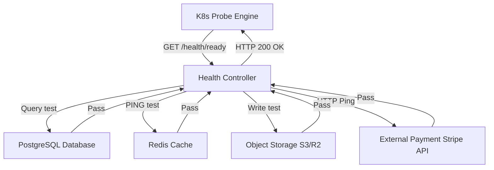
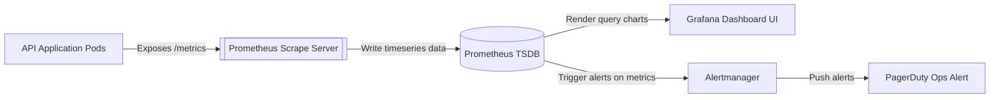
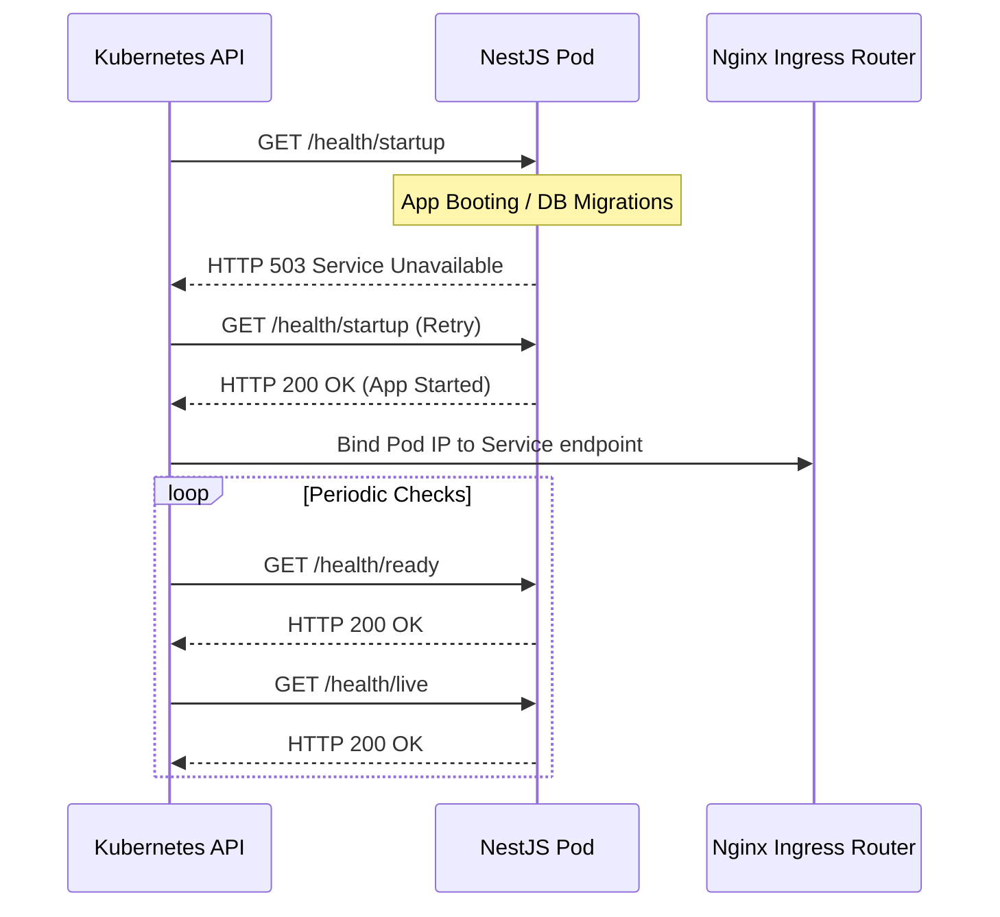
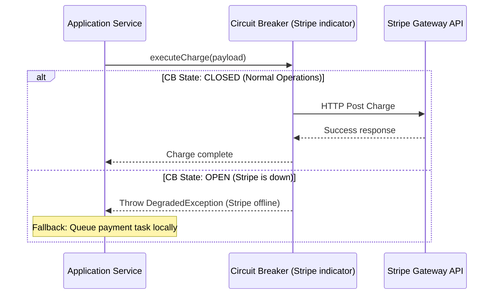
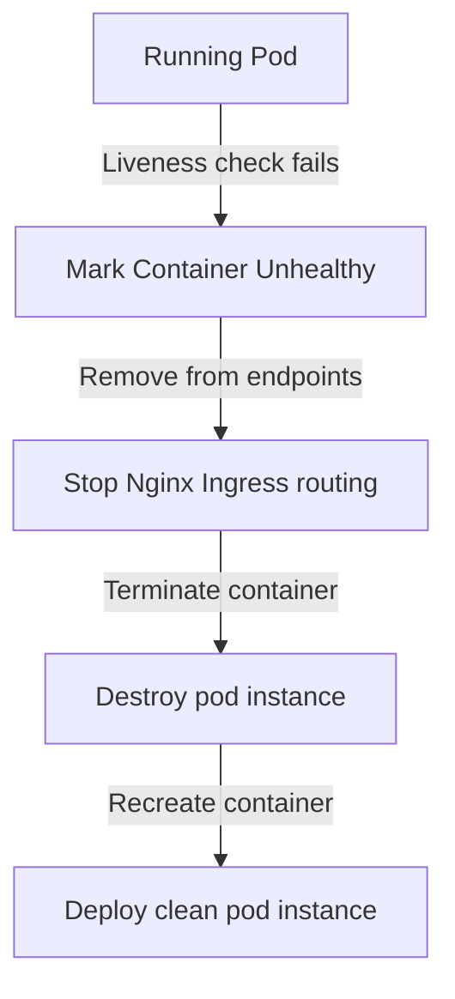

# HEALTH CHECK & SYSTEM RELIABILITY CORE ARCHITECTURE

**Project Name:** Enterprise SaaS Business Management Platform  
**Document Version:** 1.0.0 — Baseline Standard  
**Date:** July 14, 2026  
**Authors:** Principal Backend Architect, DevOps Architect, and NestJS Enterprise Engineer  
**Classification:** Internal — Confidential  
**Phase:** 23.20 — Health Check & System Reliability Core Architecture  

---

## Table of Contents

1. [Executive Summary](#1-executive-summary)
2. [Health Check Architecture Overview](#2-health-check-architecture-overview)
3. [System Reliability Architecture](#3-system-reliability-architecture)
4. [Health Check Core Module Structure](#4-health-check-core-module-structure)
5. [Kubernetes Health Probe Architecture](#5-kubernetes-health-probe-architecture)
6. [Database Health Checking](#6-database-health-checking)
7. [Redis Health Checking](#7-redis-health-checking)
8. [External Service Health Monitoring](#8-external-service-health-monitoring)
9. [Health Status Response Design](#9-health-status-response-design)
10. [Reliability Failure Strategy](#10-reliability-failure-strategy)
11. [Monitoring Integration](#11-monitoring-integration)
12. [SaaS Multi-Tenant Reliability](#12-saas-multi-tenant-reliability)
13. [Production Deployment Architecture](#13-production-deployment-architecture)
14. [Disaster Recovery Strategy](#14-disaster-recovery-strategy)
15. [Health & Monitoring Diagrams](#15-health--monitoring-diagrams)
16. [Enterprise Implementation Guidelines](#16-enterprise-implementation-guidelines)
17. [Implementation Summary](#17-implementation-summary)

---

## 1. Executive Summary

### 1.1 Document Purpose
This document establishes the **Health Check & System Reliability Core Architecture** (Phase 23.20). It details Kubernetes liveness/readiness/startup probes, dependency indicators (PostgreSQL, Redis), response contracts, and disaster recovery rules.

---

## 2. Health Check Architecture Overview

### 2.1 The Need for System Health Monitoring
Production container systems are dynamic, with nodes scaling up and down based on traffic demands. To maintain high availability, orchestrators (like Kubernetes) must monitor container health to automatically route traffic away from failing pods and replace degraded containers.

### 2.2 Core Concepts
*   **Health Check:** A localized check evaluating whether a service is running and accessible.
*   **Monitoring:** Time-series telemetry measuring system performance over time.
*   **Alerting:** Automated notifications triggered when metrics exceed defined thresholds.
*   **Incident Response:** Standard operating procedures for investigating and resolving alerts.

---

## 3. System Reliability Architecture

Health indicators monitor both application state and key infrastructure dependencies:

```
Application ──► Health Check Layer ──► Infrastructure Dependencies ──► Prometheus ──► Alertmanager
```

### 3.1 Indicator Responsibilities
*   **Application Health:** Evaluates CPU usage, memory thresholds, and thread responsiveness.
*   **Database Health:** Verifies connection pools and query response times.
*   **Cache Health:** Runs ping tests against Redis cache instances.
*   **External Service Health:** Verifies accessibility of third-party integration APIs (e.g., payment gateways).

---

## 4. Health Check Core Module Structure

The health components are located under `src/core/health/`:

```
src/core/health/
 ├── health.module.ts              (Registers Terminus indicators and endpoints)
 ├── health.controller.ts          (Exposes public endpoints for orchestrators)
 ├── health.service.ts             (Coordinates dependency checks and compile scores)
 ├── indicators/
 │    ├── database.health.ts       (Prisma/PostgreSQL connection check)
 │    ├── redis.health.ts          (Redis ping check)
 │    ├── storage.health.ts        (Local and S3 storage availability checks)
 │    └── external-api.health.ts   (HTTP ping checks for payment and email gateways)
 └── interfaces/
      └── health.interface.ts      (TypeScript definitions for health status payloads)
```

---

## 5. Kubernetes Health Probe Architecture

Kubernetes uses probes to monitor pod status and determine when containers are ready to receive traffic or need to be restarted:

*   **Startup Probe:** Determines if the application has completed initialization. Traffic routing and liveness checks are disabled until this probe passes.
*   **Liveness Probe (`GET /health/live`):** Determines if the application needs to be restarted. If the check fails, Kubernetes restarts the pod.
*   **Readiness Probe (`GET /health/ready`):** Determines if the application is ready to accept incoming traffic. If the check fails, the pod is removed from service endpoints.

---

## 6. Database Health Checking

```
App Service ──► Prisma Client Connection ──► SELECT 1 Query ──► PostgreSQL Engine
```

*   **Query Test:** Executes a basic query (e.g., `SELECT 1`) to verify read availability.
*   **Connection Pool:** Monitors connection pool utilization and alerts if connection availability drops below 20%.

---

## 7. Redis Health Checking

*   **Ping Check:** Sends a `PING` command to verify that the Redis instance responds with `PONG`.
*   **Latency Checking:** Measures ping response latency and flags degradation if it exceeds 100ms.

---

## 8. External Service Health Monitoring

*   **Checks:** Verifies connectivity to key external integrations (e.g., Stripe, SendGrid, Twilio).
*   **Timeouts:** Ping checks use a strict 3-second timeout limit to prevent blocking health checks.
*   **Circuit Breakers:** Tripping a circuit breaker due to external provider degradation marks the dependency as offline without failing the overall pod readiness check.

---

## 9. Health Status Response Design

### 9.1 Response Schema
The health controller returns a standardized JSON response contract:

```json
{
  "status": "healthy",
  "timestamp": "2026-07-14T03:07:24Z",
  "services": {
    "database": "up",
    "redis": "up",
    "storage": "up",
    "stripe_api": "degraded"
  }
}
```

*   `status`: System-wide status (`healthy`, `unhealthy`, or `degraded`).
*   `services`: Individual statuses for each checked dependency (`up`, `down`, or `degraded`).

---

## 10. Reliability Failure Strategy

*   **Database Outage:** Pod readiness checks fail, directing the ingress controller to stop sending traffic to the affected instance.
*   **Redis Outage:** If Redis becomes unavailable, the application degrades gracefully by routing read requests directly to the database instead of throwing system-wide errors.
*   **External API Outages:** System functions degrade gracefully (e.g., queuing unsent emails locally if the email provider is down) while the system continues to process core API requests.

---

## 11. Monitoring Integration

*   **Prometheus Exporter:** Exposes system metrics on `/metrics` for scrape targets.
*   **Grafana Dashboards:** Visualizes system metrics, database connections, and cache hit ratios.
*   **Alertmanager:** Routes high-priority failure alerts to channels like PagerDuty or Slack.
*   **Sentry:** Aggregates and alerts on unhandled application exceptions.

---

## 12. SaaS Multi-Tenant Reliability

To prevent data leaks and maintain tenant security, health check endpoints only expose aggregate platform metrics. Tenant-specific details, settings, and business metrics are excluded from public health endpoints.

---

## 13. Production Deployment Architecture

```
User ──► Ingress ──► K8s Service ──► Health Probes ──► Application Pods
```

Kubernetes services route client requests exclusively to pods whose readiness probes are passing. If a pod's readiness probe fails, it is automatically removed from the active routing pool.

---

## 14. Disaster Recovery Strategy

*   **Container Replacement:** Failing a pod's liveness check triggers Kubernetes to automatically terminate the degraded container and deploy a clean instance.
*   **Database Failovers:** Implements automated PostgreSQL replica promotion using Patroni if the primary database node crashes.
*   **Backup Verification:** Runs daily automated restore tests on database backups to ensure backup integrity.

---

## 15. Health & Monitoring Diagrams

### 15.1 Health Check Dependency Loop



### 15.2 Monitoring Integration Flow



### 15.3 Kubernetes probe routing lifecycle



### 15.4 Circuit Breaker Degradation Flow



### 15.5 Failover Container Recovery



---

## 16. Enterprise Implementation Guidelines

### 16.1 Health Endpoint Security
Public health check endpoints (e.g., `/health/live`) do not require authentication, allowing Kubernetes probes to run checks without token overhead. However, detailed health metrics (e.g., connection pool sizing) are restricted to internal Kubernetes cluster requests.

### 16.2 Production Readiness Checklist
Before moving to production, verify that:
*   CPU and memory thresholds are set for all containers.
*   Database and cache connections are configured with short connection timeouts.
*   Automatic failovers are tested and verified for PostgreSQL and Redis clusters.

---

## 17. Implementation Summary

### 17.1 Health & Reliability Setup Schedule

| Task | Target Timeline | Status |
| :--- | :--- | :--- |
| Set up Terminus health check controllers | Day 1 | Planned |
| Create database and cache indicator services | Day 2 | Planned |
| Configure Kubernetes liveness/readiness probes | Day 3 | Planned |
| Integrate Prometheus exporters | Day 4 | Planned |

---

## Document Control

| Field | Value |
|---|---|
| **Document ID** | SBMP-BE-23.20-HEALTH-RELIABILITY |
| **Version** | 1.0.0 |
| **Status** | APPROVED — Baseline |
| **Owner** | DevOps Architect |
| **Reviewed By** | Principal Architect, Lead Developer, SRE Lead |
| **Review Cycle** | Quarterly |
| **Next Review** | October 2026 |

---

*Phase 23.20 — Health Check & System Reliability Core Architecture | SaaS Business Management Platform*  
*Enterprise Confidential — © 2026 All Rights Reserved*
