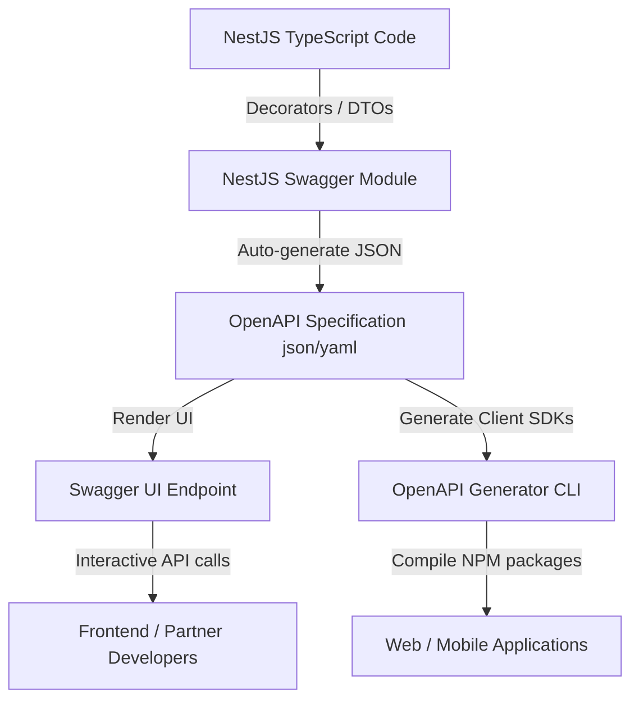
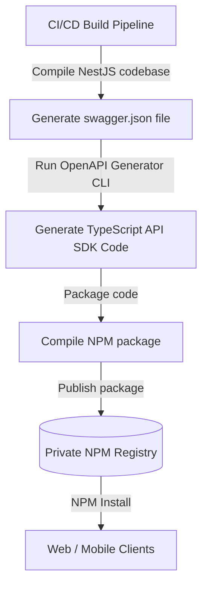
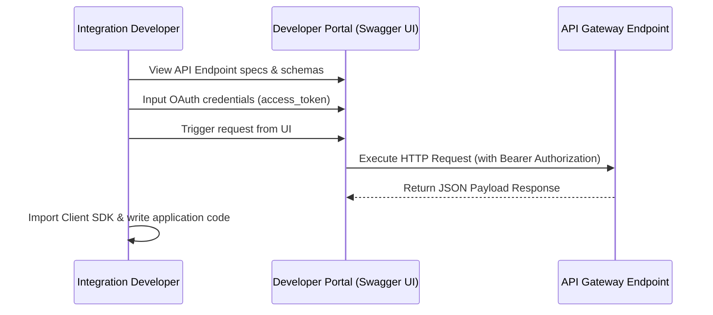
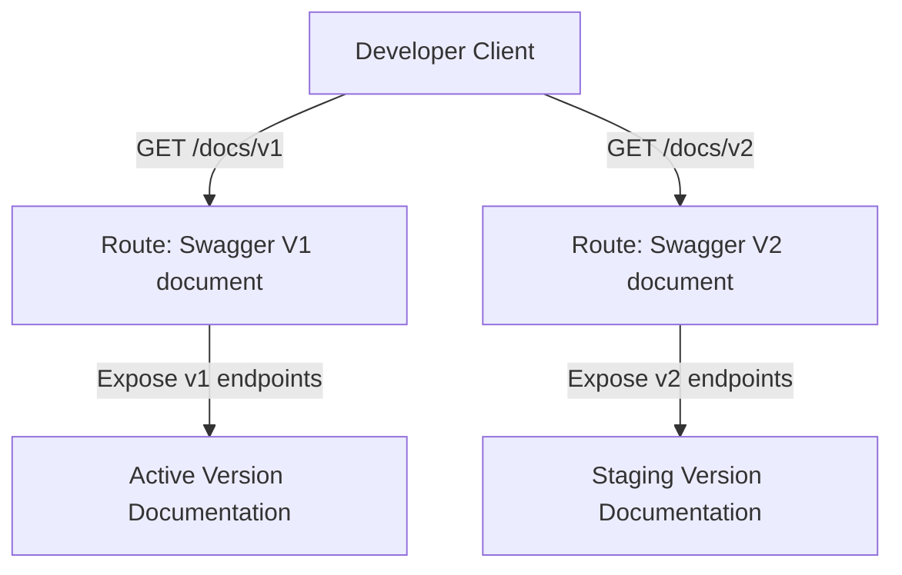
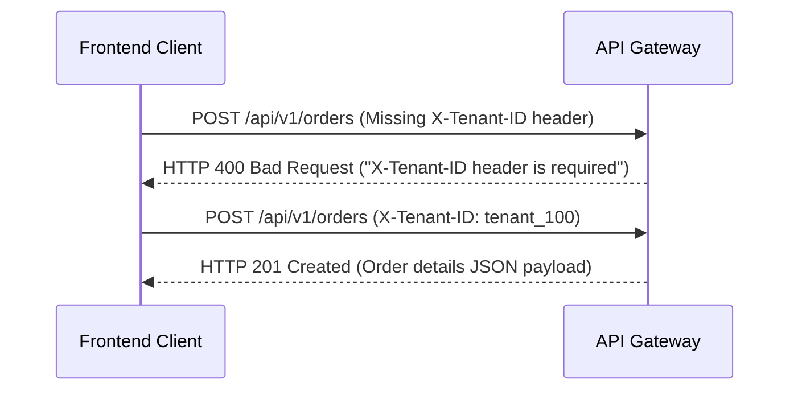

# API DOCUMENTATION & DEVELOPER EXPERIENCE CORE ARCHITECTURE

**Project Name:** Enterprise SaaS Business Management Platform  
**Document Version:** 1.0.0 — Baseline Standard  
**Date:** July 14, 2026  
**Authors:** Principal Backend Architect, API Platform Architect, and Developer Experience Engineer  
**Classification:** Internal — Confidential  
**Phase:** 23.21 — API Documentation & Developer Experience Core Architecture  

---

## Table of Contents

1. [Executive Summary](#1-executive-summary)
2. [API Documentation Architecture Overview](#2-api-documentation-architecture-overview)
3. [API Contract Architecture Design](#3-api-contract-architecture-design)
4. [API Documentation Core Module Structure](#4-api-documentation-core-module-structure)
5. [OpenAPI / Swagger Architecture](#5-openapi--swagger-architecture)
6. [API Documentation Standards](#6-api-documentation-standards)
7. [Authentication Documentation](#7-authentication-documentation)
8. [API Version Documentation Strategy](#8-api-version-documentation-strategy)
9. [Developer Experience Architecture](#9-developer-experience-architecture)
10. [SDK Generation Strategy](#10-sdk-generation-strategy)
11. [API Testing Integration](#11-api-testing-integration)
12. [Multi-Tenant API Documentation](#12-multi-tenant-api-documentation)
13. [Security Documentation](#13-security-documentation)
14. [Production Developer Portal Architecture](#14-production-developer-portal-architecture)
15. [API Documentation Diagrams](#15-api-documentation-diagrams)
16. [Enterprise Implementation Guidelines](#16-enterprise-implementation-guidelines)
17. [Implementation Summary](#17-implementation-summary)

---

## 1. Executive Summary

### 1.1 Document Purpose
This document establishes the **API Documentation & Developer Experience Core Architecture** (Phase 23.21). It details OpenAPI specification builders, Swagger UI configurations, custom documenting decorators, automated client SDK generations, and multi-tenant header documentations.

---

## 2. API Documentation Architecture Overview

### 2.1 The Value of Professional API Documentation
As SaaS integrations grow, undocumented API endpoints lead to integration errors, slower development cycles, and increased support overhead. Standardized, interactive API documentation acts as a formal contract between backend services and client applications (frontend web apps, mobile clients, and partner integrations).

---

## 3. API Contract Architecture Design

API documentation serves as the single source of truth for integrations:

```
Backend Code ──► OpenAPI Spec ──► Swagger UI / Portal ──► Client Integration
```

### 3.1 Contract Elements
*   **Request Schema:** Details query parameters, URL path variables, and request body DTOs.
*   **Response Schema:** Explains success envelopes, payload objects, and pagination models.
*   **Authentication Rules:** Documents JWT bearer handshake sequences and key scopes.
*   **Error Format:** Specifies validation and infrastructure error payloads.

---

## 4. API Documentation Core Module Structure

The documentation components are located under `src/core/docs/`:

```
src/core/docs/
 ├── docs.module.ts                (Wires up Swagger configurations and module endpoints)
 ├── swagger.config.ts             (Defines metadata, versions, and security schemes)
 ├── openapi.builder.ts            (Compiles the OpenAPI JSON file during build steps)
 ├── decorators/
 │    ├── api-response.decorator.ts (Formats success payloads and HTTP status codes)
 │    ├── api-auth.decorator.ts    (Specifies authentication schemas)
 │    └── api-error.decorator.ts   (Maps error codes to responses)
 └── interfaces/
      └── api-doc.interface.ts     (TypeScript interfaces for documentation options)
```

---

## 5. OpenAPI / Swagger Architecture

The platform uses the NestJS `@nestjs/swagger` module to generate OpenAPI schemas directly from TypeScript code:

*   **DTO Annotations:** DTO class properties are decorated using `@ApiProperty()` to export validation constraints (e.g., min/max values, string formats) to the OpenAPI schema.
*   **Controller Annotations:** Controllers use tags (e.g., `@ApiTags('Sales')`) and operation summaries (e.g., `@ApiOperation({ summary: 'Create invoice' })`) to group and describe endpoints.

---

## 6. API Documentation Standards

To maintain consistency, all API endpoints must include:

*   **Summary & Description:** A brief explanation of the endpoint's purpose.
*   **Authentication Scopes:** Specifies required user roles and permissions (e.g., `sales.invoice.write`).
*   **Status Codes:** Documents success paths (e.g., HTTP 200, 201) and error responses (e.g., HTTP 400, 401, 403, 429).
*   **Examples:** Complete JSON examples for both request payloads and response bodies.

---

## 7. Authentication Documentation

Endpoints that require authentication are marked with the lock icon in the Swagger UI and document the required security scheme:

```
Scheme: Bearer Auth
Header Format: Authorization: Bearer <access_token>
```

The documentation explains the JWT login process, token expiration lifespans, and session refresh flows.

---

## 8. API Version Documentation Strategy

Swagger documents are split by API version to keep documentation clean and manageable:

*   **V1 Document (`/docs/v1`):** Documents active production endpoints.
*   **V2 Document (`/docs/v2`):** Documents next-generation endpoints currently in testing.
*   **Deprecation Flags:** Deprecated endpoints are explicitly flagged in the UI with warning banners indicating the target deprecation schedule.

---

## 9. Developer Experience Architecture

The platform prioritizes developer experience (DX) to accelerate onboarding and integration:

```
Read API Docs ──► Test in Swagger UI ──► Import Postman Collection ──► Generate Client SDK
```

*   **Interactive Testing:** Swagger UI allows developers to execute mock API requests directly from the browser.
*   **Postman Exports:** Implements automated tasks to compile and export Postman collections from OpenAPI schemas.

---

## 10. SDK Generation Strategy

The platform leverages OpenAPI schemas to automate client SDK generation:

```
OpenAPI Schema (swagger.json) ──► OpenAPI Generator CLI ──► TypeScript SDK
```

*   **Outputs:** Automatically generates TypeScript client libraries for both Web and React Native applications.
*   **Type Safety:** Ensures frontend developers interact with APIs using automatically compiled interfaces, preventing parameter naming mismatches.

---

## 11. API Testing Integration

*   **Schema Validation:** Automated pipeline tasks validate that API response payloads match the documented OpenAPI schema, preventing out-of-date documentation.
*   **CI/CD Verification:** Builds and compiles OpenAPI definitions during pull request validations to catch documentation syntax errors early.

---

## 12. Multi-Tenant API Documentation

*   **Headers:** Endpoints explicitly document the requirement for the `X-Tenant-ID` header.
*   **Permission Scopes:** Specifies the roles and permission levels required to access each endpoint.
*   **Feature Flags:** Notes subscription tier requirements for premium endpoints (e.g., "Requires Pro subscription").

---

## 13. Security Documentation

To help developers build secure integrations, the documentation details API security policies:

*   **Rate Limits:** Documents rate limiting rules for each endpoint category.
*   **Input Sanitization:** Details input validation rules and error formats.

---

## 14. Production Developer Portal Architecture

For external developer ecosystems, the platform provides a dedicated portal:

```
Developer ──► Developer Portal ──► OpenAPI Spec ──► API Ingress Gateway ──► Monolith Pods
```

---

## 15. API Documentation Diagrams

### 15.1 API Documentation Flow



### 15.2 SDK Client Generation Pipeline



### 15.3 Developer Integration Workflow



### 15.4 Versioned API documentation routing



### 15.5 Multi-Tenant Header Identification



---

## 16. Enterprise Implementation Guidelines

### 16.1 Documentation Ownership
The engineering team that owns an API module is responsible for keeping its DTO decorators and endpoint descriptions up to date.

### 16.2 Review Process
Pull requests that modify API routes or payload schemas are required to update the corresponding DTOs and decorators, ensuring documentation changes are reviewed alongside code changes.

---

## 17. Implementation Summary

### 17.1 API Documentation Setup Schedule

| Task | Target Timeline | Status |
| :--- | :--- | :--- |
| Configure NestJS Swagger module structures | Day 1 | Planned |
| Annotate authentication and DTO modules | Day 2 | Planned |
| Set up automated SDK compiler pipelines | Day 3 | Planned |
| Create OpenAPI JSON schema exporter scripts | Day 4 | Planned |

---

## Document Control

| Field | Value |
|---|---|
| **Document ID** | SBMP-BE-23.21-API-DOCS |
| **Version** | 1.0.0 |
| **Status** | APPROVED — Baseline |
| **Owner** | Developer Experience Engineer |
| **Reviewed By** | Principal Architect, Lead Developer, Technical Writer |
| **Review Cycle** | Quarterly |
| **Next Review** | October 2026 |

---

*Phase 23.21 — API Documentation & Developer Experience Core Architecture | SaaS Business Management Platform*  
*Enterprise Confidential — © 2026 All Rights Reserved*
