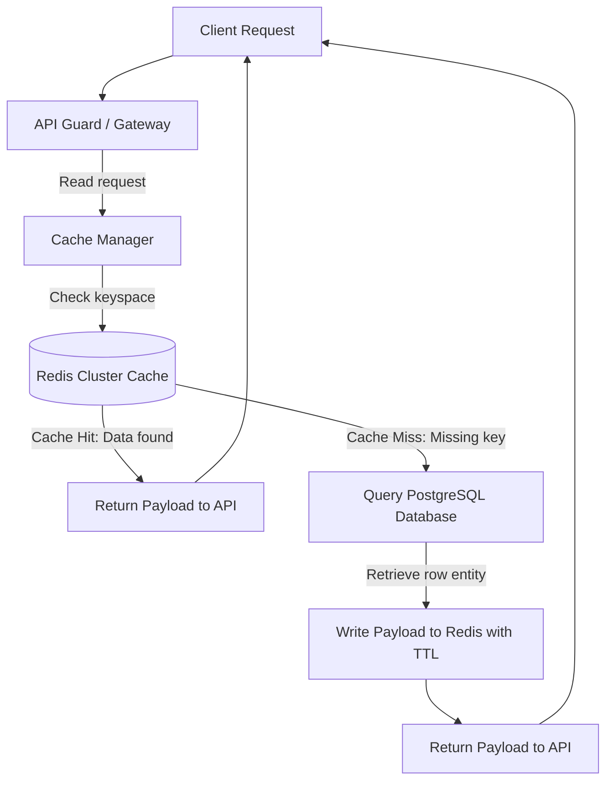
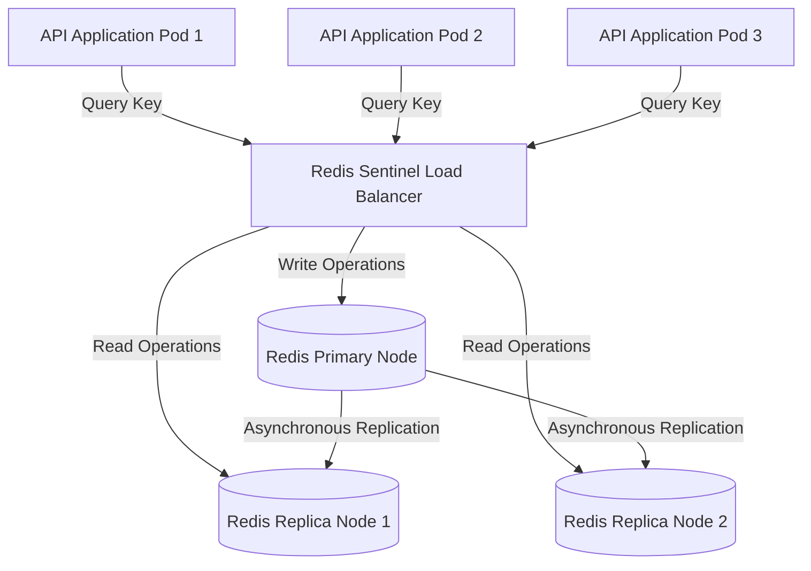
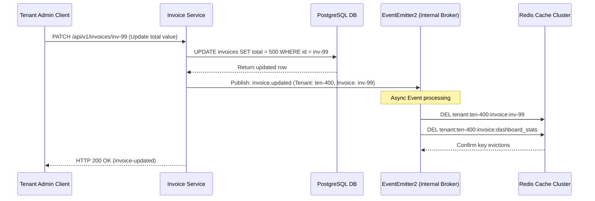
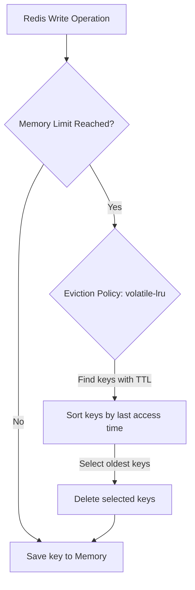
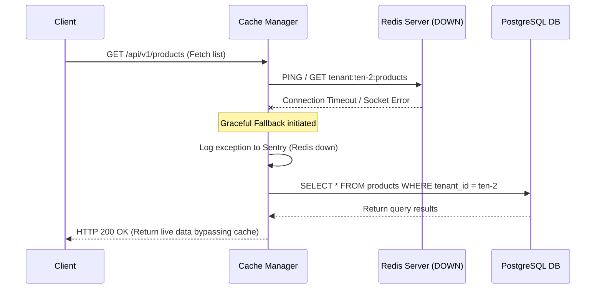

# CACHING STRATEGY & PERFORMANCE OPTIMIZATION CORE ARCHITECTURE

**Project Name:** Enterprise SaaS Business Management Platform  
**Document Version:** 1.0.0 — Baseline Standard  
**Date:** July 14, 2026  
**Authors:** Principal Backend Architect, Performance Engineer, and NestJS Enterprise Engineer  
**Classification:** Internal — Confidential  
**Phase:** 23.22 — Caching Strategy & Performance Optimization Core Architecture  

---

## Table of Contents

1. [Executive Summary](#1-executive-summary)
2. [Caching Architecture Overview](#2-caching-architecture-overview)
3. [Cache Architecture Design](#3-cache-architecture-design)
4. [Cache Core Module Structure](#4-cache-core-module-structure)
5. [Redis Cache Architecture](#5-redis-cache-architecture)
6. [Cache Strategy Design](#6-cache-strategy-design)
7. [Cache Use Cases](#7-cache-use-cases)
8. [Cache Key Architecture](#8-cache-key-architecture)
9. [Cache Expiration Strategy (TTL)](#9-cache-expiration-strategy-ttl)
10. [Cache Invalidation Architecture](#10-cache-invalidation-architecture)
11. [Multi-Tenant Cache Architecture](#11-multi-tenant-cache-architecture)
12. [Database Performance Optimization](#12-database-performance-optimization)
13. [Cache Reliability Strategy](#13-cache-reliability-strategy)
14. [Cache Monitoring Architecture](#14-cache-monitoring-architecture)
15. [Caching Strategy Diagrams](#15-caching-strategy-diagrams)
16. [Enterprise Implementation Guidelines](#16-enterprise-implementation-guidelines)
17. [Implementation Summary](#17-implementation-summary)

---

## 1. Executive Summary

### 1.1 Document Purpose
This document establishes the **Caching Strategy & Performance Optimization Core Architecture** (Phase 23.22). It details memory cache bounds, Redis cluster connection pools, Cache-Aside strategies, multi-tenant key isolations, and event-driven invalidation patterns.

---

## 2. Caching Architecture Overview

### 2.1 The Need for Caching in Multi-Tenant Platforms
High-concurrency multi-tenant SaaS environments place heavy read demands on relational databases. Implementing a structured caching strategy reduces database read loads, minimizes endpoint latency, and prevents database resource starvation during peak traffic.

### 2.2 Storage Tier Comparisons
*   **Database Query:** Persistent relational storage (PostgreSQL). Requires disk I/O and query compilation overhead.
*   **Cache Layer:** In-memory, network-accessible key-value database (Redis). Delivers sub-millisecond response times.
*   **Application Memory:** Process-local memory (RAM). Offers fast access speeds but is limited to a single application instance and lacks data synchronization across nodes.

---

## 3. Cache Architecture Design

```
Request ──► API Route ──► Cache Hit? ──► Return Cached Payload
                             │
                             └──► Cache Miss ──► Service ──► DB ──► Cache Data ──► Return
```

### 3.1 Lifecycle States
*   **Cache Hit:** The requested key is found in cache, returning the payload immediately and bypassing downstream databases.
*   **Cache Miss:** The key is missing, triggering a database lookup. The retrieved data is then written to the cache before being returned to the client.
*   **Cache Refresh:** Background tasks write updated database states to cache keys before they expire to prevent cache stampedes.

---

## 4. Cache Core Module Structure

The cache components are located under `src/core/cache/`:

```
src/core/cache/
 ├── cache.module.ts              (Binds Redis clients and module configurations)
 ├── cache.service.ts             (Provides set, get, delete, and flush helper methods)
 ├── cache.manager.ts             (Coordinates memory and distributed cache lookups)
 ├── strategies/
 │    ├── redis.strategy.ts       (Redis storage provider implementation)
 │    ├── memory.strategy.ts      (Local in-memory fallback strategy)
 │    └── distributed.strategy.ts (Multi-node synchronization engine)
 ├── decorators/
 │    └── cache.decorator.ts      (Controller method decorator for endpoint caching)
 └── interfaces/
      └── cache.interface.ts      (TypeScript interfaces for cache parameters)
```

---

## 5. Redis Cache Architecture

*   **In-Memory Storage:** Redis stores all data in memory, serving reads and writes without disk I/O bottlenecks.
*   **TTL Support:** Native Time-To-Live parameters automatically evict keys to keep memory usage optimized.
*   **Scale Topology:** Uses a Redis Sentinel or Redis Cluster deployment to provide high availability and automatic failover support.

---

## 6. Cache Strategy Design

*   **Cache-Aside Pattern (Recommended for Reads):** The application queries the cache first. If a cache miss occurs, the database is queried and the result is written back to the cache. This pattern isolates database failures from cache lookups.
*   **Write-Through Pattern:** Data is written to both the database and the cache concurrently. This ensures cache consistency but introduces write latency.
*   **Write-Behind Pattern:** Writes are committed to the cache first and queued to be persisted to the database asynchronously. This delivers fast write speeds but carries data loss risks if the cache node crashes before changes are persisted.

---

## 7. Cache Use Cases

*   **Authentication:** Session tokens (e.g., JWT IDs) are cached with short TTLs matching the token's lifespan.
*   **Authorization:** User role and permission tables are cached to avoid repeating database joins on every authenticated request.
*   **Tenant Data:** Tenant configuration settings and feature flags are cached since they are read frequently but changed rarely.
*   **Business Catalogs:** Frequently accessed read-only data, such as product lists and dashboard stats, are cached to reduce read loads.

---

## 8. Cache Key Architecture

### 8.1 Key Structure Guidelines
Cache keys must follow a consistent, colon-separated namespace structure:

```
[scope]:[tenantId]:[resource]:[identifier]
```

#### Examples
*   `tenant:uuid-100:config` (Tenant settings)
*   `user:uuid-200:permissions` (User permission scopes)
*   `product:uuid-100:catalog:list` (Tenant-scoped product list)

This structured layout prevents key collisions and simplifies bulk invalidations.

---

## 9. Cache Expiration Strategy (TTL)

*   **Short TTL (1-5 Minutes):** Used for dynamic data (e.g., active user sessions, inventory levels).
*   **Medium TTL (30-60 Minutes):** Used for configuration settings (e.g., tenant configurations, role mappings).
*   **Long TTL (24 Hours+):** Used for static lookup data (e.g., country lists, currency exchange rates).

---

## 10. Cache Invalidation Architecture

To prevent stale data states, updates trigger automated cache invalidation events:

```
Update Record ──► Mutate DB ──► Publish Invalidation Event ──► Evict Redis Keys
```

If a product record is updated, the application publishes an invalidation event to evict the corresponding product cache keys. Subsequent requests will experience a cache miss, load the fresh database record, and populate the cache.

---

## 11. Multi-Tenant Cache Architecture

### 11.1 Tenant Isolation
To prevent cross-tenant data leaks, all cache keys must include the `tenantId` as a prefix:

```
tenant:[tenantId]:[resource]
```

Application services automatically resolve the active `tenantId` from the request context and prepend it to all cache keys.

---

## 12. Database Performance Optimization

Caching works in tandem with database optimizations:

*   **Indexes:** Databases use indexes to speed up lookups during cache misses.
*   **Connection Pools:** PgBouncer optimizes connection lifecycles when handling cache-miss traffic.

---

## 13. Cache Reliability Strategy

*   **Bypass Fallback:** If the Redis cluster becomes unavailable, the cache manager catches the exception and falls back to routing queries directly to PostgreSQL.
*   **Eviction Policy:** Redis is configured with `volatile-lru` (Least Recently Used with TTL) to automatically evict expired keys when memory limits are reached.

---

## 14. Cache Monitoring Architecture

*   **Cache Hit Ratio:** Telemetry tracks `keyspace_hits` / (`keyspace_hits` + `keyspace_misses`). A drop below 80% indicates the need to refine TTL rules.
*   **Memory Utilization:** Monitors total memory usage against limits to prevent out-of-memory (OOM) evictions.

---

## 15. Caching Strategy Diagrams

### 15.1 Cache-Aside Read Request Flow



### 15.2 Distributed Caching Architecture



### 15.3 Event-Driven Cache Invalidation



### 15.4 Memory Eviction (volatile-lru) Thresholds



### 15.5 Cache-Bypass Graceful Degradation



---

## 16. Enterprise Implementation Guidelines

### 16.1 Cache Naming Conventions
Always lowercase and prefix keys with the target domain namespace. Use colons to demarcate scoping components: `domain:tenantId:resource:id` (e.g., `invoice:tenant_100:details:inv-500`).

### 16.2 Cache-Stampede Protection
Use locking mechanisms or randomize TTL expirations slightly (cache jitter) to prevent multiple concurrent requests from hitting the database simultaneously when a popular cache key expires.

---

## 17. Implementation Summary

### 17.1 Caching Setup Schedule

| Task | Target Timeline | Status |
| :--- | :--- | :--- |
| Set up Redis cache module services | Day 1 | Planned |
| Create cache interceptors and decorators | Day 2 | Planned |
| Implement event-driven key invalidations | Day 3 | Planned |
| Set up Redis cluster failover configurations | Day 4 | Planned |

---

## Document Control

| Field | Value |
|---|---|
| **Document ID** | SBMP-BE-23.22-CACHE-STRATEGY |
| **Version** | 1.0.0 |
| **Status** | APPROVED — Baseline |
| **Owner** | Performance Engineer |
| **Reviewed By** | Principal Architect, Lead Developer, DB Lead |
| **Review Cycle** | Quarterly |
| **Next Review** | October 2026 |

---

*Phase 23.22 — Caching Strategy & Performance Optimization Core Architecture | SaaS Business Management Platform*  
*Enterprise Confidential — © 2026 All Rights Reserved*
