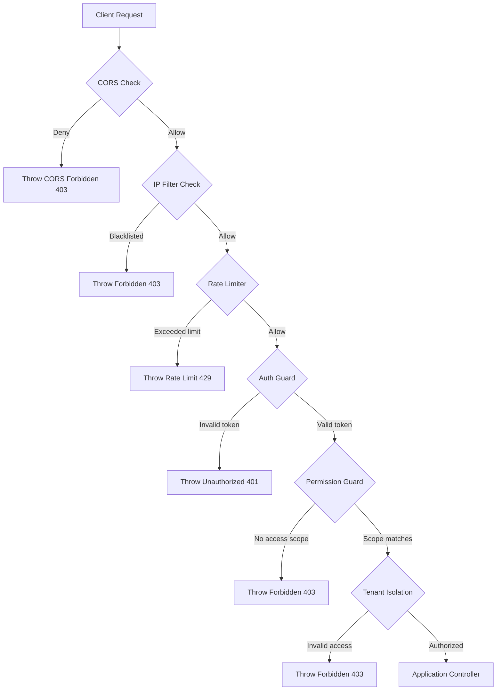
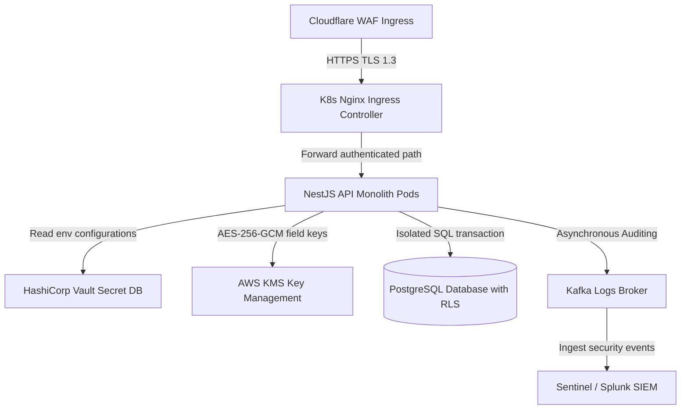
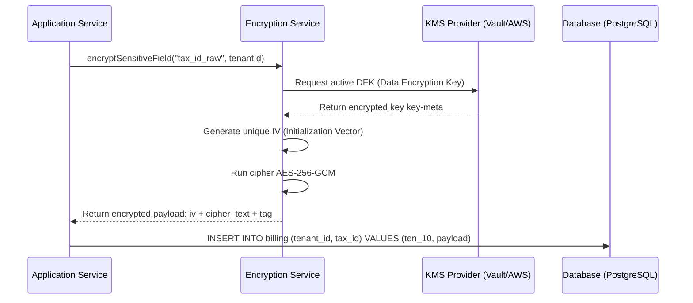
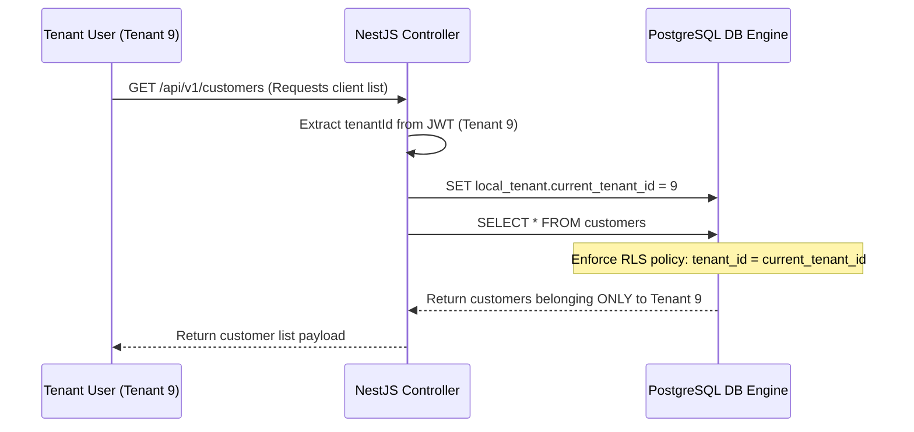
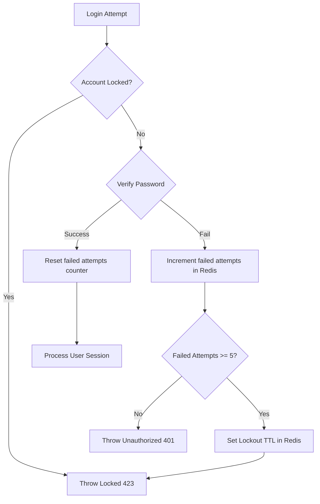

# SECURITY HARDENING & APPLICATION PROTECTION CORE ARCHITECTURE

**Project Name:** Enterprise SaaS Business Management Platform  
**Document Version:** 1.0.0 — Baseline Standard  
**Date:** July 14, 2026  
**Authors:** Principal Backend Architect, Application Security Architect, and NestJS Enterprise Engineer  
**Classification:** Internal — Confidential  
**Phase:** 23.23 — Security Hardening & Application Protection Core Architecture  

---

## Table of Contents

1. [Executive Summary](#1-executive-summary)
2. [Application Security Architecture Overview](#2-application-security-architecture-overview)
3. [Security Core Module Architecture](#3-security-core-module-architecture)
4. [HTTP Security Protection](#4-http-security-protection)
5. [CORS Security Architecture](#5-cors-security-architecture)
6. [Rate Limiting Architecture](#6-rate-limiting-architecture)
7. [Encryption Architecture](#7-encryption-architecture)
8. [Secret Management Architecture](#8-secret-management-architecture)
9. [Input Security Protection](#9-input-security-protection)
10. [Authentication Security Hardening](#10-authentication-security-hardening)
11. [Authorization Security](#11-authorization-security)
12. [Multi-Tenant Security Architecture](#12-multi-tenant-security-architecture)
13. [Security Audit Integration](#13-security-audit-integration)
14. [OWASP Security Strategy](#14-owasp-security-strategy)
15. [Security Monitoring Architecture](#15-security-monitoring-architecture)
16. [Security Architecture Diagrams](#16-security-architecture-diagrams)
17. [Enterprise Implementation Guidelines](#17-enterprise-implementation-guidelines)
18. [Implementation Summary](#18-implementation-summary)

---

## 1. Executive Summary

### 1.1 Document Purpose
This document establishes the **Security Hardening & Application Protection Core Architecture** (Phase 23.23). It details application security boundaries, AES-256-GCM database field encryption, environment secret storage (KMS/Vault), rate-limiting configurations, and OWASP Top 10 mitigation strategies.

---

## 2. Application Security Architecture Overview

### 2.1 The CIA Triad
The core platform architecture is built around the three pillars of the security triad:
*   **Confidentiality:** Restricts data access to authorized users and tenants.
*   **Integrity:** Protects data against unauthorized modification or tampering.
*   **Availability:** Ensures services remain resilient against DDoS attacks and resource exhaustion.

### 2.2 Security Domain Definitions
*   **Application Security:** Secure coding practices, input validation, and execution controls implemented in the codebase.
*   **Infrastructure Security:** Hardening of container runtimes, Kubernetes clusters, and operating system instances.
*   **Data Security:** Cryptographic encryption of data at rest, data in transit, and sensitive database columns.
*   **Network Security:** Isolation of virtual private networks, firewall rules, routing controls, and TLS terminations.

---

## 3. Security Core Module Architecture

The security components are located under `src/core/security/`:

```
src/core/security/
 ├── security.module.ts            (Integrates security providers, guards, and middlewares)
 ├── security.service.ts           (Coordinates encryption tasks and IP checks)
 ├── middleware/
 │    ├── security.middleware.ts    (Registers Helmet configuration parameters)
 │    └── ip-filter.middleware.ts   (Enforces CIDR blocks and IP whitelists/blacklists)
 ├── encryption/
 │    ├── encryption.service.ts    (Provides AES-256-GCM encryption helpers)
 │    └── crypto.provider.ts       (Coordinates KMS keys and IV generation configurations)
 ├── headers/
 │    └── security-headers.config.ts (Defines security header profiles)
 └── interfaces/
      └── security.interface.ts    (TypeScript interfaces for crypto parameters)
```

---

## 4. HTTP Security Protection

HTTP responses include standard security headers to protect clients against common web vulnerabilities:

*   **Helmet:** NestJS integrates the Helmet middleware to set security headers automatically.
*   **Content Security Policy (CSP):** restrics source domains for scripts, styles, and images to prevent Cross-Site Scripting (XSS).
*   **HTTP Strict Transport Security (HSTS):** Enforces HTTPS connections for all client requests.
*   **X-Frame-Options:** Set to `DENY` to prevent the application from being loaded in iframes, mitigating clickjacking attacks.
*   **X-Content-Type-Options:** Set to `nosniff` to prevent browsers from executing files with mismatched MIME types.

---

## 5. CORS Security Architecture

Cross-Origin Resource Sharing (CORS) rules restrict client access based on environment:

```
Domain Request ──► CORS Middleware ──► Domain Allowed? ──► Process / Block
```

*   **Development:** CORS permits connections from `localhost` to simplify local frontend development.
*   **Production:** CORS strictly limits access to registered application domains, blocking requests from unauthorized sites.

---

## 6. Rate Limiting Architecture

The platform uses a Redis-backed rate limiter to prevent API abuse, credential stuffing, and brute-force attacks:

*   **Auth Endpoints (e.g., `/api/v1/auth/login`):** Limited to 5 attempts per minute. Exceeding this triggers a temporary account lockout.
*   **API Endpoints:** Limited to 100 requests per minute per IP address.

```
Request ──► Rate Guard ──► Check Redis Counter ──► Counter < Limit? ──► Allow / Block (HTTP 429)
```

---

## 7. Encryption Architecture

The platform enforces encryption for sensitive data both in transit and at rest:

```
App Service ──► Encryption Service (AES-256-GCM) ──► Encrypted String ──► DB Row
```

*   **Database Columns:** Sensitive data fields (e.g., tax IDs, bank account details) are encrypted at the application layer using AES-256-GCM before database writes.
*   **Key Rotation:** Enforces automatic key rotation schedules integrated with external Key Management Services (KMS).

---

## 8. Secret Management Architecture

Hardcoding credentials, connection strings, or API keys in source code is strictly prohibited. The application retrieves all configuration secrets at runtime from environment variables populated by secure vaults:

*   **AWS Secrets Manager:** Used to store database passwords and third-party API credentials in AWS environments.
*   **HashiCorp Vault:** Provides localized secret storage and dynamic credential generation.

---

## 9. Input Security Protection

*   **SQL Injection:** Mitigated by the Prisma ORM, which uses parameterized queries for all database operations.
*   **Command Injection:** The codebase avoids calling shell execution utilities (e.g., `exec`, `spawn`) with unvalidated user inputs.
*   **Mass Assignment:** Enforced by NestJS validation pipes which strip undeclared properties from request payloads.

---

## 10. Authentication Security Hardening

*   **Hashing:** User passwords are encrypted using `Argon2id` before being written to database tables.
*   **MFA Support:** Supports Multi-Factor Authentication (MFA) using TOTP protocols.
*   **Session Lockouts:** Temporary account lockouts are triggered after 5 consecutive failed login attempts.

---

## 11. Authorization Security

*   **Insecure Direct Object Reference (IDOR):** Mitigated by verifying that resource requests match the user's active tenant context (`tenantId`).
*   **Privilege Escalation:** Evaluates permissions dynamically on each request, ensuring users cannot perform actions outside their assigned scopes.

---

## 12. Multi-Tenant Security Architecture

Multi-tenant isolation is enforced at multiple layers:

```
Request ──► Resolve Tenant Context ──► Enforce RBAC Scopes ──► Database Query Isolation
```

Database queries include explicit tenant scoping filters, and PostgreSQL Row-Level Security (RLS) is enabled to prevent cross-tenant data access.

---

## 13. Security Audit Integration

*   **Telemetry:** Security events (e.g., failed logins, permission changes, resource access failures) are logged asynchronously to the audit database.
*   **Alerting:** Suspicious activities are flagged and dispatched to SIEM integrations for investigation.

---

## 14. OWASP Security Strategy

The platform implements mitigations for the OWASP Top 10:

*   **Broken Access Control:** Enforced through tenant validation guards and RBAC structures.
*   **Cryptographic Failures:** Standardized on TLS 1.3 for connections and AES-256-GCM for field-level encryption.
*   **Injection:** Enforced by parameterized queries and strict input sanitization rules.

---

## 15. Security Monitoring Architecture

Security events follow a structured pipeline to ensure rapid response:

```
Security Event ──► Log Aggregator ──► SIEM Analysis ──► Alerts (Grafana/PagerDuty)
```

Ingress filters route performance and security metrics to Prometheus and Grafana dashboards, while exception traces are aggregated in Sentry.

---

## 16. Security Architecture Diagrams

### 16.1 Request Security Flow



### 16.2 Enterprise Security Architecture



### 16.3 AES-256-GCM Field Encryption Pipeline



### 16.4 Multi-Tenant Row Level Security Verification



### 16.5 Failed Login Lockout Flow



---

## 17. Enterprise Implementation Guidelines

### 17.1 Security Coding Standards
Use strict TypeScript configurations (`noImplicitAny: true`, `strictNullChecks: true`) and avoid using third-party libraries that lack active maintenance.

### 17.2 Penetration Testing Rules
Perform annual external penetration testing and schedule weekly automated vulnerability scans in staging environments to catch dependencies issues early.

---

## 18. Implementation Summary

### 18.1 Security Setup Schedule

| Task | Target Timeline | Status |
| :--- | :--- | :--- |
| Set up Helmet and CORS configurations | Day 1 | Planned |
| Implement validation guards and filters | Day 2 | Planned |
| Configure AES-256-GCM database field encryption | Day 3 | Planned |
| Integrate AWS Secrets Manager and KMS | Day 4 | Planned |

---

## Document Control

| Field | Value |
|---|---|
| **Document ID** | SBMP-BE-23.23-SECURITY-HARDENING |
| **Version** | 1.0.0 |
| **Status** | APPROVED — Baseline |
| **Owner** | Application Security Architect |
| **Reviewed By** | Principal Architect, Lead Developer, Security Officer |
| **Review Cycle** | Quarterly |
| **Next Review** | October 2026 |

---

*Phase 23.23 — Security Hardening & Application Protection Core Architecture | SaaS Business Management Platform*  
*Enterprise Confidential — © 2026 All Rights Reserved*
