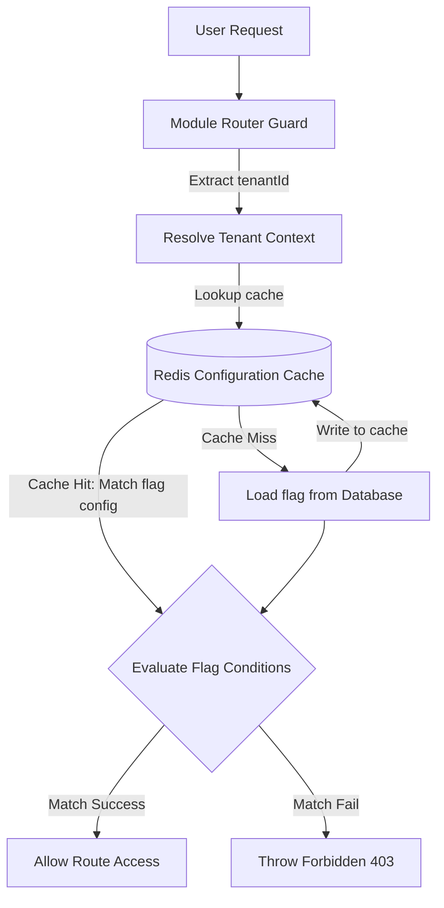
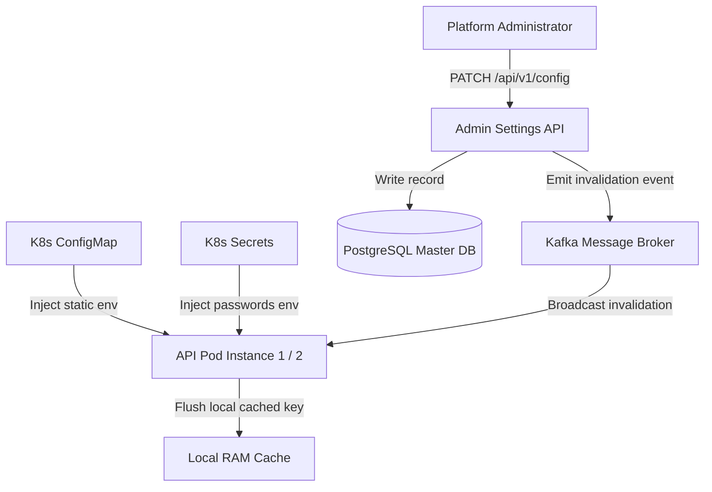
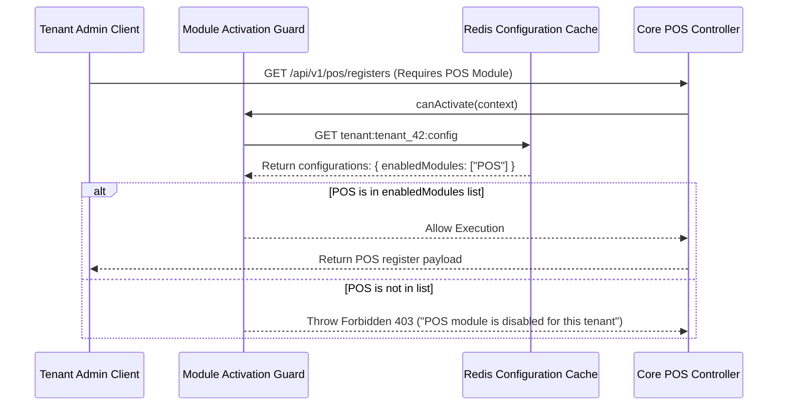
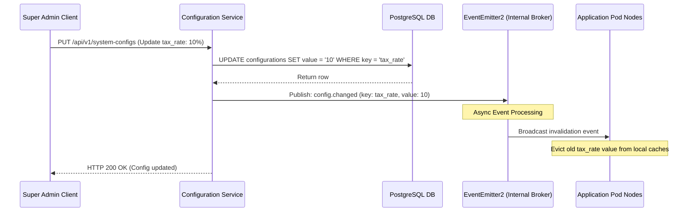
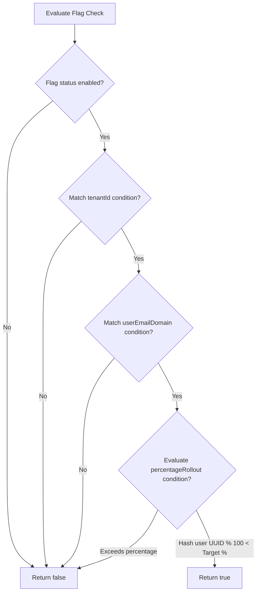

# ADVANCED CONFIGURATION & FEATURE MANAGEMENT CORE ARCHITECTURE

**Project Name:** Enterprise SaaS Business Management Platform  
**Document Version:** 1.0.0 — Baseline Standard  
**Date:** July 14, 2026  
**Authors:** Principal Backend Architect, SaaS Platform Architect, and NestJS Enterprise Engineer  
**Classification:** Internal — Confidential  
**Phase:** 23.24 — Advanced Configuration & Feature Management Core Architecture  

---

## Table of Contents

1. [Executive Summary](#1-executive-summary)
2. [Advanced Configuration Architecture Overview](#2-advanced-configuration-architecture-overview)
3. [Dynamic Configuration Architecture](#3-dynamic-configuration-architecture)
4. [Configuration Core Module Structure](#4-configuration-core-module-structure)
5. [Feature Flag Architecture](#5-feature-flag-architecture)
6. [SaaS Module Activation System](#6-saas-module-activation-system)
7. [Tenant Runtime Configuration](#7-tenant-runtime-configuration)
8. [Configuration Storage Strategy](#8-configuration-storage-strategy)
9. [Configuration Cache Architecture](#9-configuration-cache-architecture)
10. [Configuration Change Event Architecture](#10-configuration-change-event-architecture)
11. [Multi-Tenant Feature Management](#11-multi-tenant-feature-management)
12. [Configuration Security](#12-configuration-security)
13. [Configuration Audit Strategy](#13-configuration-audit-strategy)
14. [Production Configuration Management](#14-production-configuration-management)
15. [Configuration & Feature Diagrams](#15-configuration--feature-diagrams)
16. [Enterprise Implementation Guidelines](#16-enterprise-implementation-guidelines)
17. [Implementation Summary](#17-implementation-summary)

---

## 1. Executive Summary

### 1.1 Document Purpose
This document establishes the **Advanced Configuration & Feature Management Core Architecture** (Phase 23.24). It details runtime configuration stores, feature flag schemas, subscription module activation guards, event-driven cache invalidations, and Kubernetes secret integrations.

---

## 2. Advanced Configuration Architecture Overview

### 2.1 The Need for Dynamic Configurations
Enterprise SaaS platforms require the ability to toggle features, activate business modules, and customize system behaviors dynamically without requiring code redeployments or container restarts.

### 2.2 Configuration Types
*   **Static Configuration:** Constant variables packaged within the application bundle (e.g., supported locales).
*   **Environment Configuration:** Settings injected at container start via environment variables (e.g., database URLs).
*   **Runtime Configuration:** Dynamic parameters stored in databases or caches that can be modified during execution (e.g., global tax rules).
*   **Feature Configuration:** Tenant-specific feature flags and module activation states.

---

## 3. Dynamic Configuration Architecture

```
Admin Portal ──► Config Service ──► PostgreSQL / Redis Cache ──► App Runtime
```

### 3.1 Operations Layer
*   **Store Settings:** Configuration parameters are written to the database for persistence.
*   **Validate Settings:** Validates schema parameters using JSON Schema or Class-Validator rules before writing changes.
*   **Cache Settings:** Caches settings in Redis to prevent database bottlenecks during frequent configuration lookups.
*   **Apply Changes:** Uses event listeners to propagate settings updates to active application threads dynamically.

---

## 4. Configuration Core Module Structure

The configuration components are located under `src/core/configuration/`:

```
src/core/configuration/
 ├── configuration.module.ts       (Registers providers, cache engines, and controllers)
 ├── configuration.service.ts      (Exposes methods to read, write, and evaluate settings)
 ├── configuration.repository.ts   (Handles database writes for configuration records)
 ├── providers/
 │    ├── database.config.provider.ts (Database-backed configuration provider)
 │    └── cache.config.provider.ts    (Redis-backed configuration provider)
 ├── validators/
 │    └── config.validator.ts      (Validates configuration schemas)
 └── interfaces/
      └── configuration.interface.ts (TypeScript definitions for configs and flags)
```

---

## 5. Feature Flag Architecture

Feature flags allow teams to release code safely and rollout changes gradually:

*   **Gradual Rollout:** Exposes features to a percentage of users or tenants to monitor performance and stability.
*   **A/B Testing:** Routes users to different code paths to evaluate user engagement metrics.
*   **Risk Reduction:** Provides an immediate kill-switch to disable buggy features without redeploying code.

### 5.1 Schema Definition
Feature flag records use the following JSON schema format:

```json
{
  "name": "billing.stripe-checkout-v3",
  "enabled": true,
  "tenantId": "tenant-uuid-4444",
  "conditions": {
    "userEmailDomain": "example.com",
    "percentageRollout": 25
  }
}
```

---

## 6. SaaS Module Activation System

SaaS tiers restrict feature access based on active subscription plans:

```
Platform Admin ──► Tenant Subscription ──► Plan Capabilities ──► Route Guard
```

### 6.1 Subscription Capabilities Example
*   **Free Tier:** Access to POS module only. CRM and Inventory modules are disabled.
*   **Pro Tier:** Access to POS and Inventory modules. CRM module is disabled.
*   **Enterprise Tier:** Full access to POS, Inventory, and CRM modules.

---

## 7. Tenant Runtime Configuration

Tenants can customize business behaviors through self-service settings:

```json
{
  "tenantId": "tenant-uuid-101",
  "businessName": "Acme Retail Ltd",
  "currency": "USD",
  "timezone": "America/New_York",
  "language": "en",
  "taxSetting": "VAT_EXCLUSIVE",
  "enabledModules": ["POS", "INVENTORY"]
}
```

These parameters allow tenants to localize system behavior dynamically without code modifications.

---

## 8. Configuration Storage Strategy

*   **Environment Variables:** Best for static infrastructure settings (e.g., PostgreSQL credentials).
*   **Database Configuration:** Best for dynamic settings that require permanent persistence and history tracking (e.g., tenant configurations).
*   **Redis Cache:** Best for high-concurrency runtime checks (e.g., active feature flags).

---

## 9. Configuration Cache Architecture

To minimize lookup latency, configuration queries utilize a multi-tier cache pattern:

```
App Request ──► Read Local RAM ──► Read Redis Cache ──► Read Database
```

When configuration parameters are updated, the database write triggers a cache invalidation event to evict stale keys across all Redis cache nodes.

---

## 10. Configuration Change Event Architecture

```
Admin Save ──► DB Update ──► Emit config.changed Event ──► Evict Caches ──► Notify Sub-Services
```

The system uses `EventEmitter2` for local node invalidations and Kafka brokers for cross-pod synchronization.

---

## 11. Multi-Tenant Feature Management

The platform evaluates feature flag checks at the controller boundary using NestJS guards:

```
Request ──► Resolve Tenant Context ──► Evaluate Subscription Tier ──► Check Feature Flag ──► Allow/Deny
```

This prevents unauthorized access to premium modules across tenant boundaries.

---

## 12. Configuration Security

*   **Access Control:** Modifying configurations requires administrative privileges (e.g., `system.config.write`).
*   **Validation:** Inputs are validated against strict JSON schemas to prevent malformed values from causing system errors.

---

## 13. Configuration Audit Strategy

Every configuration change is logged to the audit database to maintain a history of modifications:

*   **Actor:** The user ID of the admin who made the change.
*   **Resource:** The key or setting that was updated.
*   **Diff:** A comparison of the old and new configuration values.
*   **Timestamp:** The date and time the modification was recorded.

---

## 14. Production Configuration Management

*   **Kubernetes ConfigMaps:** Used to inject non-sensitive application settings at pod start.
*   **Kubernetes Secrets:** Used to mount sensitive credentials (e.g., database passwords) as secure environment variables.

---

## 15. Configuration & Feature Diagrams

### 15.1 Feature Flag Evaluation Flow



### 15.2 Runtime Configuration Architecture



### 15.3 Dynamic Module Activation Pipeline



### 15.4 Dynamic Configurations Change Broker



### 15.5 Conditional Rules Rollout Check



---

## 16. Enterprise Implementation Guidelines

### 16.1 Feature Flag Lifecycles
Feature flags are meant for temporary transitions and should be removed from the codebase once a feature has been fully rolled out and stabilized in production, keeping the code clean and maintainable.

### 16.2 Rollback Procedures
Define a clear rollback plan for each new feature: if the feature causes production issues, disable its feature flag in the configuration dashboard to immediately restore the application to a known stable state.

---

## 17. Implementation Summary

### 17.1 Configuration Setup Schedule

| Task | Target Timeline | Status |
| :--- | :--- | :--- |
| Set up configuration database schemas | Day 1 | Planned |
| Create configuration services and validators | Day 2 | Planned |
| Implement module activation guards | Day 3 | Planned |
| Configure Redis configuration cache engines | Day 4 | Planned |

---

## Document Control

| Field | Value |
|---|---|
| **Document ID** | SBMP-BE-23.24-CONFIG-MANAGEMENT |
| **Version** | 1.0.0 |
| **Status** | APPROVED — Baseline |
| **Owner** | SaaS Platform Architect |
| **Reviewed By** | Principal Architect, Lead Developer, Product Lead |
| **Review Cycle** | Quarterly |
| **Next Review** | October 2026 |

---

*Phase 23.24 — Advanced Configuration & Feature Management Core Architecture | SaaS Business Management Platform*  
*Enterprise Confidential — © 2026 All Rights Reserved*
