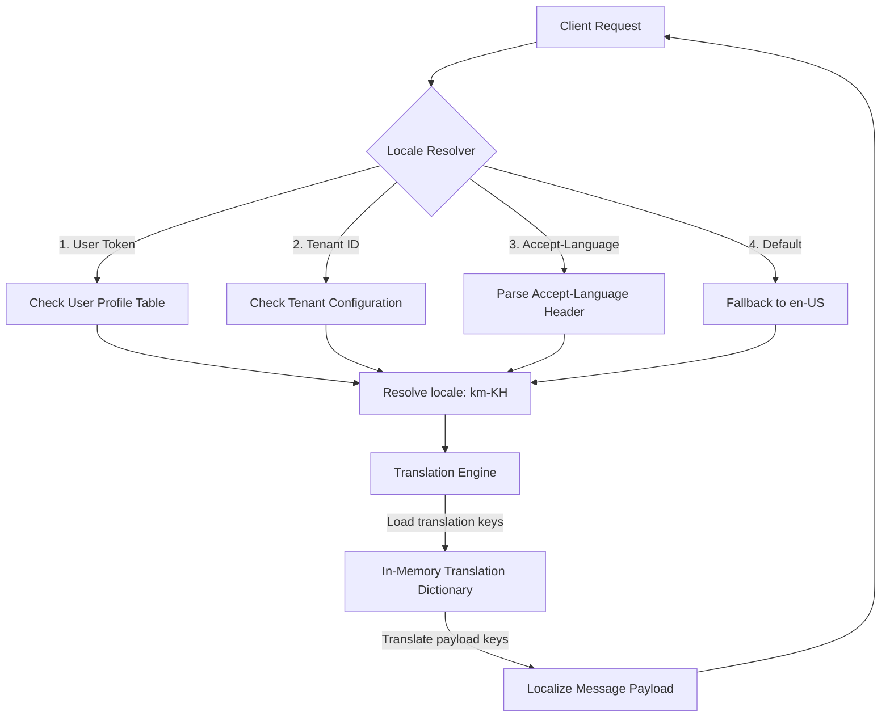
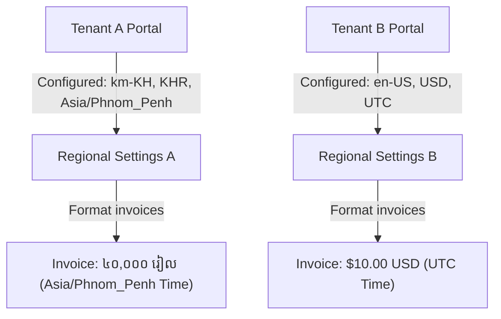
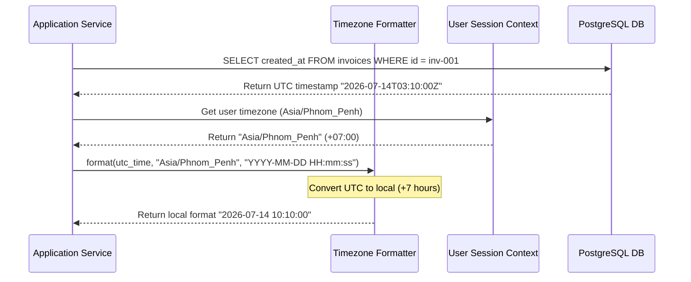
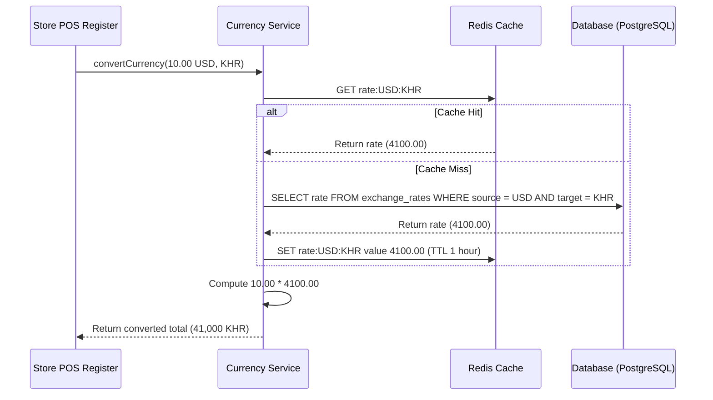
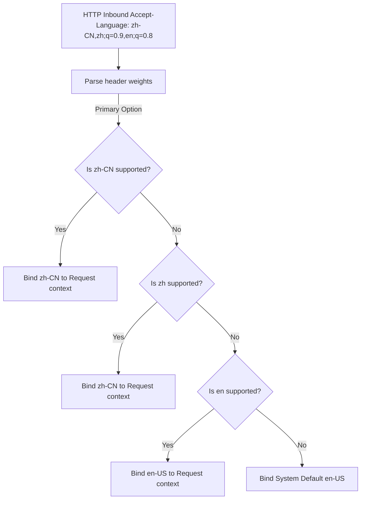

# INTERNATIONALIZATION (I18N), LOCALIZATION & REGIONAL SETTINGS CORE ARCHITECTURE

**Project Name:** Enterprise SaaS Business Management Platform  
**Document Version:** 1.0.0 — Baseline Standard  
**Date:** July 14, 2026  
**Authors:** Principal Backend Architect, SaaS Platform Architect, and Global Software Engineer  
**Classification:** Internal — Confidential  
**Phase:** 23.25 — Internationalization (i18n), Localization & Regional Settings Core Architecture  

---

## Table of Contents

1. [Executive Summary](#1-executive-summary)
2. [Internationalization Architecture Overview](#2-internationalization-architecture-overview)
3. [Localization Architecture Design](#3-localization-architecture-design)
4. [i18n Core Module Structure](#4-i18n-core-module-structure)
5. [Language Management Architecture](#5-language-management-architecture)
6. [Translation Management System](#6-translation-management-system)
7. [Locale Detection Strategy](#7-locale-detection-strategy)
8. [Currency Management Architecture](#8-currency-management-architecture)
9. [Date & Timezone Management](#9-date--timezone-management)
10. [Multi-Tenant Localization Architecture](#10-multi-tenant-localization-architecture)
11. [Localization Integration](#11-localization-integration)
12. [API Localization Strategy](#12-api-localization-strategy)
13. [Localization Security](#13-localization-security)
14. [Performance Optimization](#14-performance-optimization)
15. [i18n & Localization Diagrams](#15-i18n--localization-diagrams)
16. [Enterprise Implementation Guidelines](#16-enterprise-implementation-guidelines)
17. [Implementation Summary](#17-implementation-summary)

---

## 1. Executive Summary

### 1.1 Document Purpose
This document establishes the **Internationalization (i18n), Localization & Regional Settings Core Architecture** (Phase 23.25). It details multi-language setups (Khmer, English, Chinese), Accept-Language headers resolvers, currency formatting (KHR/USD), and dynamic timezone conversions.

---

## 2. Internationalization Architecture Overview

### 2.1 The Value of Regional Settings
SaaS platforms operating in Southeast Asia must support multiple languages, currencies, and timezones. Providing localized interfaces and compliance formatting (such as tax invoices in Khmer) is a core requirement for local adoption and regulatory compliance.

### 2.2 Definitions
*   **Internationalization (i18n):** Designing and building the codebase to support multiple languages and regions without requiring structural code changes.
*   **Localization (l10n):** Translating content and formatting dates, numbers, and currencies for a specific target market (e.g., configuring tax receipts for the Cambodia market).

### 2.3 Supported Locales
*   **Khmer (`km-KH`):** Primary language for Cambodian local operations and tax invoices.
*   **English (`en-US`):** Standard language for international administration and multi-national corporations.
*   **Chinese (`zh-CN`):** Supported for regional business trade operations.

---

## 3. Localization Architecture Design

```
HTTP Request ──► Locale Detector ──► Translation Engine ──► Localized Output
```

### 3.1 Operations Layer
*   **Locale Resolver:** Identifies the target locale by evaluating request headers, profile settings, and tenant configurations.
*   **Translation Engine:** Translates keys into target locale strings and replaces placeholders with dynamic variables.
*   **Language Resource Manager:** Manages JSON translation files and handles fallback strategies.

---

## 4. i18n Core Module Structure

The i18n components are located under `src/core/i18n/`:

```
src/core/i18n/
 ├── i18n.module.ts                (Integrates locale resolvers and translation file pipelines)
 ├── i18n.service.ts               (Exposes translation and format helpers)
 ├── locale.resolver.ts            (Resolves locales from requests)
 ├── translations/                 (JSON translation files by language code)
 │    ├── en/                      (English translation dictionaries)
 │    ├── km/                      (Khmer translation dictionaries)
 │    └── zh/                      (Chinese translation dictionaries)
 ├── formatters/
 │    ├── date.formatter.ts        (Formats timestamps based on timezone)
 │    ├── currency.formatter.ts    (Formats currency values based on locale rules)
 │    └── number.formatter.ts      (Formats decimal settings)
 └── interfaces/
      └── locale.interface.ts      (TypeScript interfaces for translation configurations)
```

---

## 5. Language Management Architecture

The platform supports BCP 47 language tags for locale identification:

*   **Khmer:** `km-KH` (Cambodia)
*   **English:** `en-US` (United States)
*   **Chinese:** `zh-CN` (China)

### Fallback Strategy
If a translation key is missing in the requested locale, the system falls back to `en-US` to ensure users see readable text instead of a blank space or error code.

---

## 6. Translation Management System

### 6.1 Translation Key Structure
Translation files use flat JSON structures:

```json
{
  "auth.login.success": "Logged in successfully",
  "error.validation.required": "Field {fieldName} is required"
}
```

#### Examples by Language
*   **English (`en-US`):** `User created successfully`
*   **Khmer (`km-KH`):** `បានបង្កើតអ្នកប្រើប្រាស់ដោយជោគជ័យ`
*   **Chinese (`zh-CN`):** `用户创建成功`

---

## 7. Locale Detection Strategy

The locale resolver evaluates target settings in the following priority order:

1.  **User Profile Settings:** Checked first if the user is authenticated.
2.  **Tenant Settings:** Used as the default configuration for the business.
3.  **Request Header:** Extracts the locale from the `Accept-Language` HTTP header.
4.  **System Default:** Falls back to `en-US` if no other settings are found.

---

## 8. Currency Management Architecture

The platform supports multi-currency operations using the standard ISO 4217 currency codes:

*   **Supported Currencies:** `KHR` (Cambodian Riel), `USD` (United States Dollar), and `CNY` (Chinese Yuan).
*   **KHR Formatting:** Format using local rules (e.g., `10,000 KHR` or `១០,០០០ រៀល`).
*   **USD Formatting:** Format using standard rules (e.g., `$2.50 USD`).
*   **Precision:** Financial values are processed as integers (e.g., storing cents) to prevent floating-point rounding errors during conversions.

---

## 9. Date & Timezone Management

*   **Server Timezone:** All database timestamps are stored in Coordinated Universal Time (`UTC`) to maintain consistency.
*   **User Timezone:** Timestamps are converted to the tenant or user's local timezone (e.g., `Asia/Phnom_Penh` for Cambodia) before being formatted for display in reports or receipts.

---

## 10. Multi-Tenant Localization Architecture

Tenants can customize default regional settings:

```json
{
  "language": "km-KH",
  "currency": "KHR",
  "timezone": "Asia/Phnom_Penh"
}
```

This configuration ensures that all system outputs, receipts, and emails generated for the tenant's clients default to their selected regional settings.

---

## 11. Localization Integration

*   **Notifications:** Email templates use localizers to deliver messages in the user's preferred language.
*   **Reporting:** Reports automatically format financial columns and timestamps to match the tenant's default currency and timezone.
*   **API Responses:** HTTP exception handlers localize error messages before returning them to client applications.

---

## 12. API Localization Strategy

The API returns standardized locale structures for responses:

```json
{
  "messageKey": "auth.login.success",
  "message": "បានបង្កើតអ្នកប្រើប្រាស់ដោយជោគជ័យ",
  "locale": "km-KH"
}
```

The `messageKey` allows client applications (such as mobile apps) to perform client-side translations if needed.

---

## 13. Localization Security

*   **Input Validation:** The locale resolver validates the `Accept-Language` header against a whitelist of supported languages to prevent injection attacks.
*   **XSS Protection:** Parameters injected into translation templates are HTML-encoded by the translation engine to prevent Cross-Site Scripting (XSS).

---

## 14. Performance Optimization

*   **Caching:** Translation dictionaries are loaded into memory at startup to bypass disk I/O bottlenecks.
*   **Redis Storage:** For dynamic, tenant-specific translations, the system caches dictionaries in Redis with medium-term TTLs.

---

## 15. i18n & Localization Diagrams

### 15.1 Localization Request Lifecycle



### 15.2 Multi-Tenant Regional Settings Mapping



### 15.3 Timezone Translation Sequence



### 15.4 Multi-Currency Exchange Rate Conversion



### 15.5 Accept-Language Priority Resolution



---

## 16. Enterprise Implementation Guidelines

### 16.1 Key Naming Rules
Always lowercase and use namespaces separated by dots: `feature.subfeature.messageKey` (e.g., `invoice.create.success`).

### 16.2 Translation Workflows
Deploy automated scripts to scan the codebase for translation keys, ensuring translation files are updated automatically during CI/CD builds.

---

## 17. Implementation Summary

### 17.1 Localization Setup Schedule

| Task | Target Timeline | Status |
| :--- | :--- | :--- |
| Set up i18n file translation folders | Day 1 | Planned |
| Create date and currency formatting services | Day 2 | Planned |
| Implement locale request resolvers | Day 3 | Planned |
| Validate Cambodian tax invoice formatting rules | Day 4 | Planned |

---

## Document Control

| Field | Value |
|---|---|
| **Document ID** | SBMP-BE-23.25-LOCALIZATION |
| **Version** | 1.0.0 |
| **Status** | APPROVED — Baseline |
| **Owner** | Global Software Engineer |
| **Reviewed By** | Principal Architect, Lead Developer, Localization Lead |
| **Review Cycle** | Quarterly |
| **Next Review** | October 2026 |

---

*Phase 23.25 — Internationalization (i18n), Localization & Regional Settings Core Architecture | SaaS Business Management Platform*  
*Enterprise Confidential — © 2026 All Rights Reserved*
