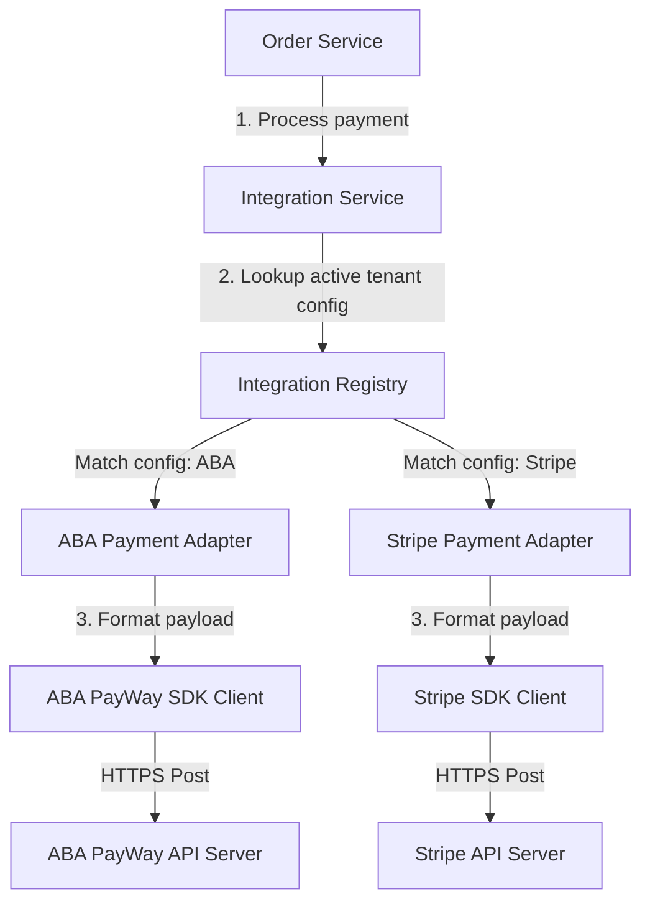
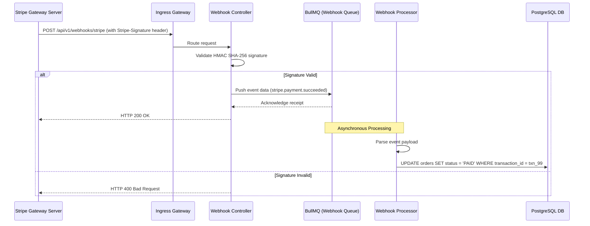
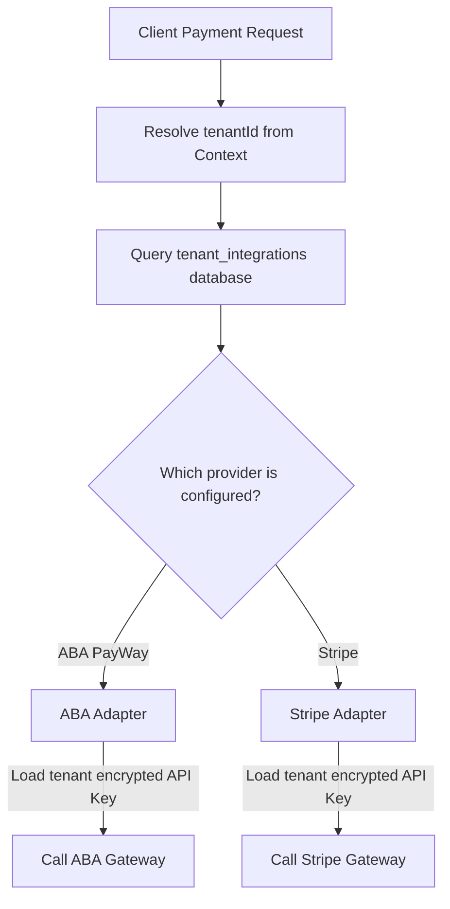
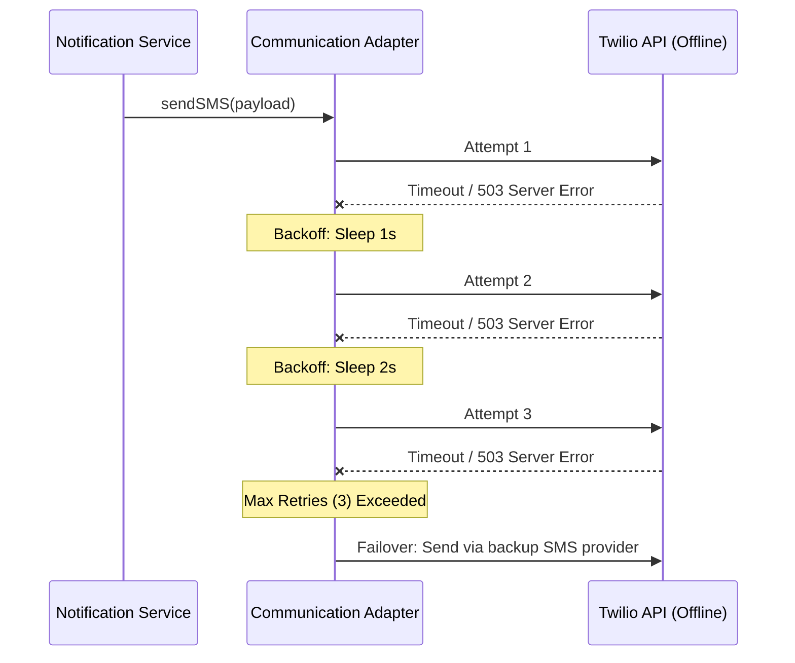
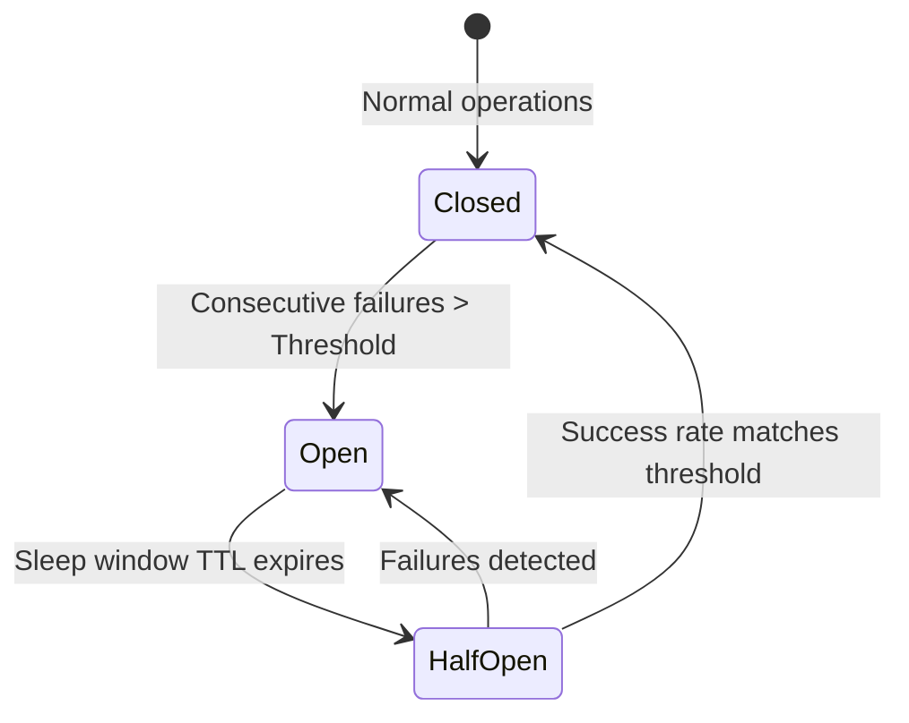

# API INTEGRATION & EXTERNAL SERVICE ADAPTER CORE ARCHITECTURE

**Project Name:** Enterprise SaaS Business Management Platform  
**Document Version:** 1.0.0 — Baseline Standard  
**Date:** July 14, 2026  
**Authors:** Principal Backend Architect, Integration Architect, and NestJS Enterprise Engineer  
**Classification:** Internal — Confidential  
**Phase:** 23.26 — API Integration & External Service Adapter Core Architecture  

---

## Table of Contents

1. [Executive Summary](#1-executive-summary)
2. [External Integration Architecture Overview](#2-external-integration-architecture-overview)
3. [Integration Architecture Design](#3-integration-architecture-design)
4. [Integration Core Module Structure](#4-integration-core-module-structure)
5. [Adapter Pattern Architecture](#5-adapter-pattern-architecture)
6. [Payment Integration Architecture](#6-payment-integration-architecture)
7. [Email & SMS Integration Architecture](#7-email--sms-integration-architecture)
8. [Webhook Architecture](#8-webhook-architecture)
9. [External API Security](#9-external-api-security)
10. [Retry & Failure Handling](#10-retry--failure-handling)
11. [Multi-Tenant Integration Configuration](#11-multi-tenant-integration-configuration)
12. [Integration Monitoring](#12-integration-monitoring)
13. [Integration Testing Strategy](#13-integration-testing-strategy)
14. [API Integration Diagrams](#14-api-integration-diagrams)
15. [Enterprise Implementation Guidelines](#15-enterprise-implementation-guidelines)
16. [Implementation Summary](#16-implementation-summary)

---

## 1. Executive Summary

### 1.1 Document Purpose
This document establishes the **API Integration & External Service Adapter Core Architecture** (Phase 23.26). It details adapter design patterns, third-party provider integration strategies (ABA PayWay, Stripe, Twilio), webhook signature verifications, and multi-tenant key stores.

---

## 2. External Integration Architecture Overview

### 2.1 Decoupling Third-Party Services
Enterprise SaaS platforms depend on external providers for payments, notifications, storage, and accounting. Directly coupling these third-party SDKs to core business services creates maintenance challenges and limits flexibility. Decoupling integrations through adapter abstraction layers ensures the platform remains adaptable to vendor changes.

---

## 3. Integration Architecture Design

```
Business Service ──► Adapter Interface ──► Concrete Adapter ──► External API Client
```

### 3.1 Operations Layer
*   **Integration Service:** Coordinates requests and manages provider failovers.
*   **Adapter:** Translates platform-standard inputs into provider-specific payloads.
*   **Provider Client:** Executes HTTP requests or uses provider SDKs to communicate with the external API.
*   **Response Mapper:** Translates provider-specific responses back into platform-standard data objects.

---

## 4. Integration Core Module Structure

The integration components are located under `src/core/integration/`:

```
src/core/integration/
 ├── integration.module.ts         (Binds adapters, providers, and webhook routing endpoints)
 ├── integration.service.ts        (Coordinates adapter lookups and status verification)
 ├── integration.registry.ts       (Dynamic lookup registry for tenant-scoped adapters)
 ├── adapters/
 │    ├── payment.adapter.ts       (Interface and translation class for checkout flows)
 │    ├── email.adapter.ts         (Interface and translation class for email gateways)
 │    ├── sms.adapter.ts           (Interface and translation class for SMS endpoints)
 │    └── storage.adapter.ts       (Interface and translation class for cloud storage)
 ├── providers/
 │    ├── aba.provider.ts          (ABA PayWay client implementation wrapper)
 │    ├── stripe.provider.ts       (Stripe client implementation wrapper)
 │    └── twilio.provider.ts       (Twilio SMS client implementation wrapper)
 └── interfaces/
      └── integration.interface.ts (TypeScript definitions for request/response payloads)
```

---

## 5. Adapter Pattern Architecture

The Adapter pattern abstracts third-party dependencies behind unified interfaces:

*   **Vendor Independence:** Swapping providers (e.g., switching from Twilio to a local SMS gateway) is accomplished by writing a new adapter implementation, leaving the core business logic unchanged.
*   **Unified Testing:** Business logic can be tested using mock adapters, eliminating the need to execute live external API requests.

---

## 6. Payment Integration Architecture

The platform supports multiple payment providers:

*   **Providers:** ABA PayWay, ACLEDA Bank, KHQR (Cambodia local payments), and Stripe (international payments).
*   **Verification:** Implements secure HMAC signature validations to verify checkout status callbacks.
*   **Callback Handlers:** Processes asynchronous transaction webhooks to update order statuses in the database.

---

## 7. Email & SMS Integration Architecture

*   **Email Channels:** Supports SMTP (dev), AWS SES, and SendGrid (prod).
*   **SMS Channels:** Supports Twilio and local telecommunication SMS gateways.
*   **Failover Policies:** If the primary delivery channel fails, the system automatically routes the message to a backup provider to ensure delivery.

---

## 8. Webhook Architecture

External providers use webhooks to notify the platform of events asynchronously (e.g., `payment.succeeded`, `subscription.updated`):

```
Provider Webhook ──► Validate Signature (HMAC) ──► Queue Event (BullMQ) ──► Process Event
```

Webhook payloads are pushed to BullMQ queues for asynchronous processing to ensure API endpoints respond quickly.

---

## 9. External API Security

*   **Secret Management:** External API credentials are encrypted at rest using AES-256-GCM before being stored in the database.
*   **Signature Validations:** Incoming webhooks require HMAC signature validation using SHA-256 hash checks.
*   **Token Expirations:** OAuth integrations use short-lived access tokens and manage refresh tokens securely.

---

## 10. Retry & Failure Handling

External API integrations must handle timeouts, rate limits, and network errors gracefully:

*   **Exponential Backoff:** Failed API requests are retried with progressively longer delays (e.g., 1s, 2s, 4s) to prevent overloading the target provider.
*   **Circuit Breakers:** If a provider fails repeatedly, the circuit breaker trips, immediately failing subsequent requests and allowing the provider time to recover.
*   **Dead Letter Queues (DLQ):** Unresolvable failed requests are moved to a DLQ for manual inspection.

---

## 11. Multi-Tenant Integration Configuration

Tenants configure their own third-party credentials (e.g., Stripe API keys) for customer checkouts:

```json
{
  "tenantId": "tenant-uuid-200",
  "provider": "STRIPE",
  "apiKey": "enc-aes256gcm-stripe-key",
  "configuration": {
    "webhookSecret": "whsec_...",
    "statementDescriptor": "ACME RETAIL"
  }
}
```

Tenant keys are stored securely using field-level envelope encryption.

---

## 12. Integration Monitoring

*   **Latency Scrapes:** Measures the execution time of external API requests to monitor provider performance.
*   **Error Tracking:** Tracks external HTTP error codes (e.g., 401 Unauthorized, 502 Bad Gateway) and alerts team members on high failure rates.

---

## 13. Integration Testing Strategy

*   **Mock Providers:** Tests use mock adapter implementations to verify business logic without sending traffic to external APIs.
*   **Sandbox Accounts:** Verifies adapter functionality against live developer sandbox environments during testing phases.

---

## 14. API Integration Diagrams

### 14.1 Adapter Architecture Flow



### 14.2 Webhook Processing Sequence



### 14.3 Multi-Tenant Custom Payment Config Routing



### 14.4 Exponential Backoff and Retries Loop



### 14.5 Circuit Breaker State Changes



---

## 15. Enterprise Implementation Guidelines

### 15.1 API Version Management
Adapters must explicitly specify the API version used for external calls to prevent breaking changes when vendors update their services.

### 15.2 Vendor Replacement Strategy
When replacing an integration provider, implement the new adapter alongside the existing one to allow for gradual traffic routing and fallback configurations during migrations.

---

## 16. Implementation Summary

### 16.1 Integration Setup Schedule

| Task | Target Timeline | Status |
| :--- | :--- | :--- |
| Create integration schemas and registries | Day 1 | Planned |
| Implement payment adapter interfaces | Day 2 | Planned |
| Configure webhook signature validation | Day 3 | Planned |
| Set up exponential backoff policies | Day 4 | Planned |

---

## Document Control

| Field | Value |
|---|---|
| **Document ID** | SBMP-BE-23.26-INTEGRATION-ADAPTER |
| **Version** | 1.0.0 |
| **Status** | APPROVED — Baseline |
| **Owner** | Integration Architect |
| **Reviewed By** | Principal Architect, Lead Developer, SecOps Lead |
| **Review Cycle** | Quarterly |
| **Next Review** | October 2026 |

---

*Phase 23.26 — API Integration & External Service Adapter Core Architecture | SaaS Business Management Platform*  
*Enterprise Confidential — © 2026 All Rights Reserved*
