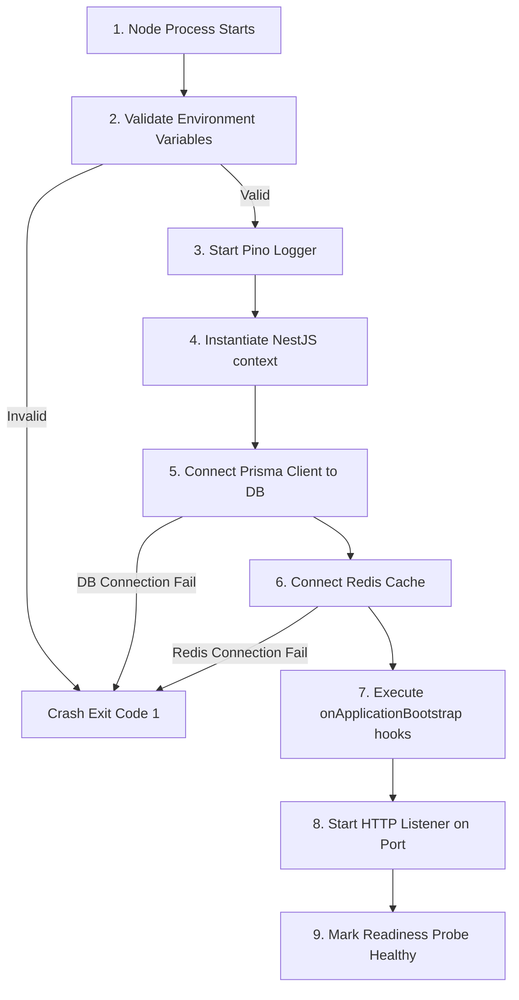
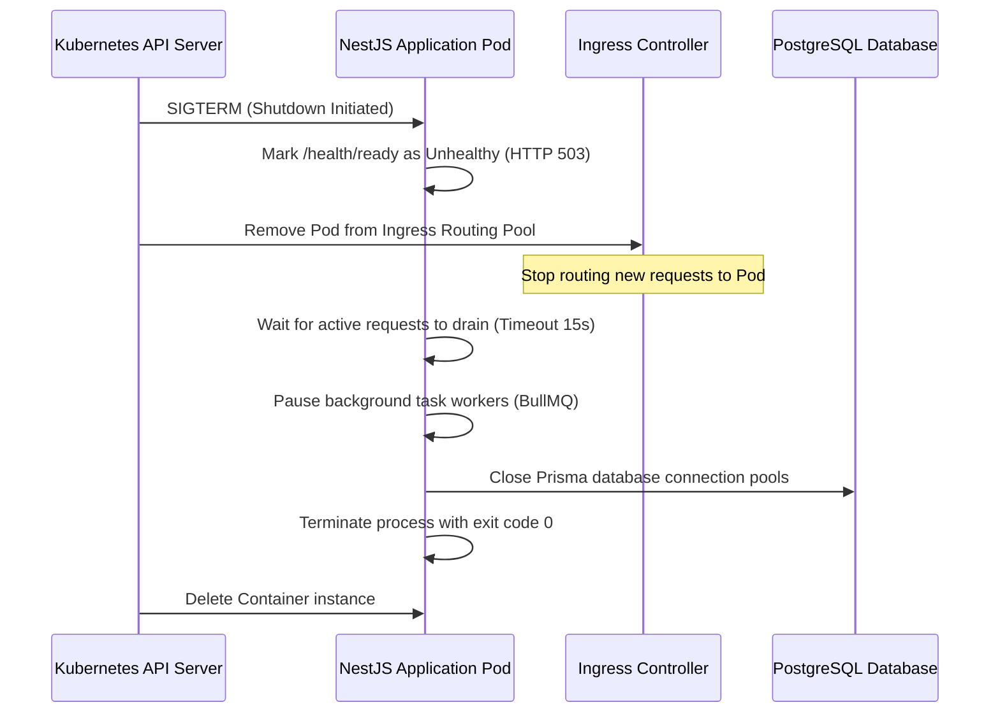
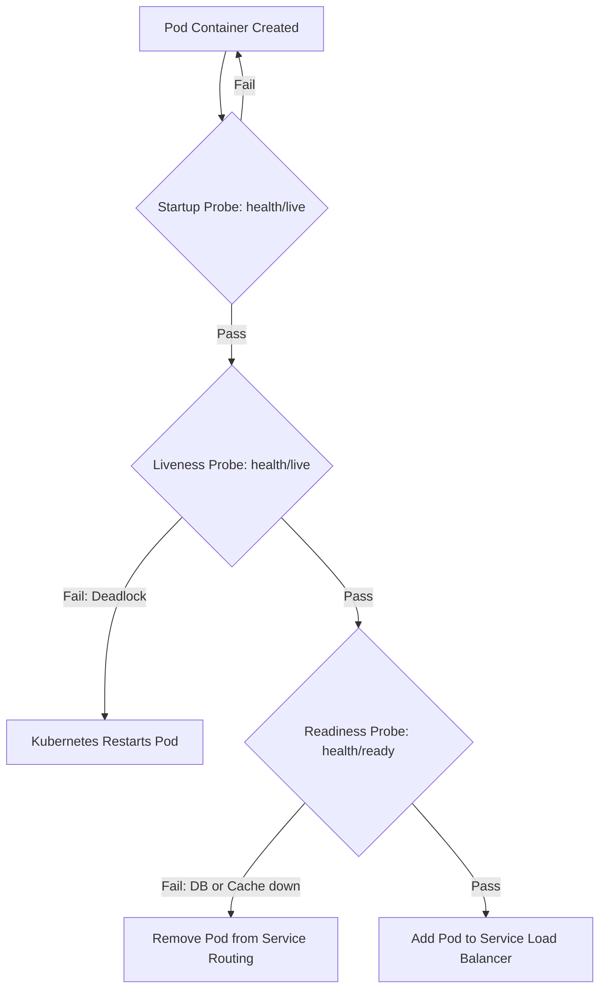
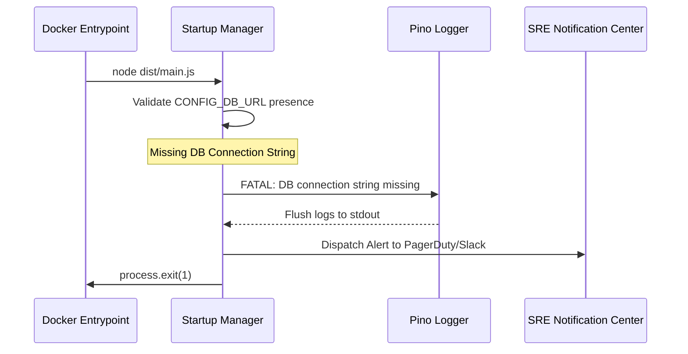
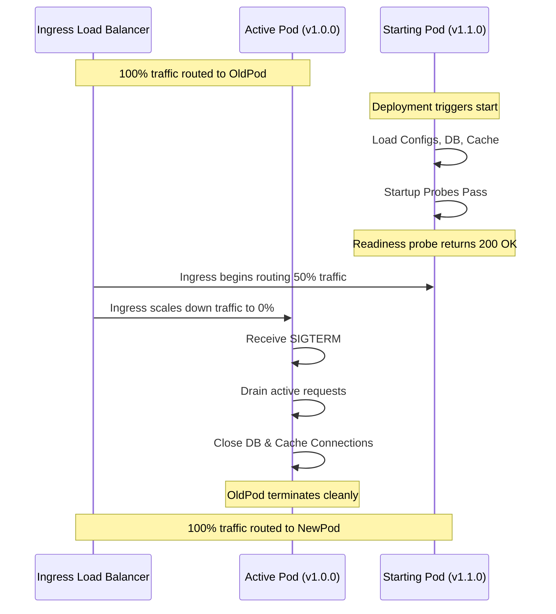

# SYSTEM BOOTSTRAP & APPLICATION LIFECYCLE CORE ARCHITECTURE

**Project Name:** Enterprise SaaS Business Management Platform  
**Document Version:** 1.0.0 — Baseline Standard  
**Date:** July 14, 2026  
**Authors:** Principal Backend Architect, NestJS Framework Architect, and Enterprise Platform Engineer  
**Classification:** Internal — Confidential  
**Phase:** 23.27 — System Bootstrap & Application Lifecycle Core Architecture  

---

## Table of Contents

1. [Executive Summary](#1-executive-summary)
2. [Application Bootstrap Architecture Overview](#2-application-bootstrap-architecture-overview)
3. [NestJS Application Lifecycle Architecture](#3-nestjs-application-lifecycle-architecture)
4. [Bootstrap Core Module Structure](#4-bootstrap-core-module-structure)
5. [Application Startup Sequence](#5-application-startup-sequence)
6. [Dependency Initialization Strategy](#6-dependency-initialization-strategy)
7. [Graceful Shutdown Architecture](#7-graceful-shutdown-architecture)
8. [Health Check Integration](#8-health-check-integration)
9. [Docker & Kubernetes Lifecycle Integration](#9-docker--kubernetes-lifecycle-integration)
10. [Error Handling During Startup](#10-error-handling-during-startup)
11. [Application Version Management](#11-application-version-management)
12. [Multi-Tenant Platform Initialization](#12-multi-tenant-platform-initialization)
13. [Production Deployment Flow](#13-production-deployment-flow)
14. [System Lifecycle Diagrams](#14-system-lifecycle-diagrams)
15. [Enterprise Implementation Guidelines](#15-enterprise-implementation-guidelines)
16. [Implementation Summary](#16-implementation-summary)

---

## 1. Executive Summary

### 1.1 Document Purpose
This document establishes the **System Bootstrap & Application Lifecycle Core Architecture** (Phase 23.27). It details application initialization phases, dependency resolution orders, graceful shutdown procedures, Kubernetes health probe alignments, and startup error management configurations.

---

## 2. Application Bootstrap Architecture Overview

### 2.1 Predictable Startup Behavior
Enterprise SaaS systems must initialize resource connections (databases, caches, message queues) in a controlled sequence. A predictable bootstrap sequence prevents runtime errors, simplifies debugging, and ensures that health probes accurately report the application's status to container orchestrators.

### 2.2 Definitions
*   **Application Initialization:** Bootstrapping the root NestJS context and parsing global environment configurations.
*   **Module Initialization:** Resolving and initializing dependencies for all active NestJS modules in the system.
*   **Dependency Initialization:** Establishing active connections to external infrastructure resources (e.g., PostgreSQL, Redis, Kafka).
*   **Runtime Lifecycle:** The execution state of the application after it is fully initialized and actively handling requests.

---

## 3. NestJS Application Lifecycle Architecture

The NestJS framework manages the application lifecycle through distinct phases:

1.  **Application Creation:** Bootstraps the application module context using `NestFactory.create()`.
2.  **Module Loading:** Imports and resolves the system's modular dependency tree.
3.  **Dependency Injection:** Instantiates all registered providers, services, and controllers.
4.  **Configuration Loading:** Loads environment variables and validates system configurations.
5.  **Database Connection:** Initializes the Prisma Client connection to PostgreSQL.
6.  **External Service Initialization:** Connects to external infrastructure (Redis caches, Kafka brokers, and S3 storage).
7.  **Application Ready:** Executes NestJS lifecycle hooks (`onModuleInit`, `onApplicationBootstrap`) and starts the HTTP server.

---

## 4. Bootstrap Core Module Structure

The bootstrap components are located under `src/core/bootstrap/`:

```
src/core/bootstrap/
 ├── bootstrap.module.ts           (Root bootstrap coordinator)
 ├── bootstrap.service.ts          (Monitors application startup state changes)
 ├── startup.manager.ts            (Manizes dependency verification sequences)
 ├── lifecycle/
 │    ├── startup.lifecycle.ts     (Implements NestJS onApplicationBootstrap hooks)
 │    └── shutdown.lifecycle.ts    (Implements NestJS beforeApplicationShutdown hooks)
 ├── checks/
 │    ├── dependency.check.ts      (Health verification for PostgreSQL and Redis)
 │    └── environment.check.ts     (Validates required environment variables)
 └── interfaces/
      └── lifecycle.interface.ts   (TypeScript definitions for lifecycle hooks)
```

---

## 5. Application Startup Sequence

```
Start ──► Config Validated ──► DB Connected ──► Cache Connected ──► Queue Started ──► Listen Port
```

The system initializes dependencies in a strict, sequential order to prevent downstream components from attempting to use uninitialized resources:

1.  **Load Configurations:** Read environment configurations and secrets from Kubernetes secrets or vault databases.
2.  **Initialize Logger:** Configure the Pino logger to capture startup events.
3.  **Establish Database Connections:** Connect the Prisma Client to PostgreSQL.
4.  **Connect Caching Layer:** Connect the Redis cache client.
5.  **Initialize Event Handlers:** Bind listeners for EventEmitters and connect Kafka message brokers.
6.  **Start HTTP Server:** Start the NestJS HTTP listener on the configured port.

---

## 6. Dependency Initialization Strategy

Dependencies are initialized in a top-down hierarchy:

```
Platform Core Configuration
       │
       ▼
Database Connections (PostgreSQL / Prisma)
       │
       ▼
Caching Layer & Message Queues (Redis / BullMQ)
       │
       ▼
External Services (S3 Storage / Payment Gateways)
       │
       ▼
Application Business Modules (POS / Inventory / Billing)
```

This sequence ensures that core system configurations and database pools are ready before business modules begin executing logic.

---

## 7. Graceful Shutdown Architecture

When a shutdown signal (e.g., `SIGTERM`) is received, the application must shut down cleanly to prevent data loss or corrupted connections:

```
SIGTERM ──► Stop Routing Requests ──► Drain Active Requests ──► Stop Queues ──► Close Database Connections
```

### Shutdown Step Flow
1.  **Stop Ingress Traffic:** Signal the health check endpoint to return an unhealthy status, causing Kubernetes to route new traffic away from the pod.
2.  **Drain Active Requests:** Wait for active HTTP requests to complete, up to a configurable timeout (e.g., 15 seconds).
3.  **Stop Background Queues:** Pause BullMQ workers and finish processing active background tasks.
4.  **Close Infrastructure Connections:** Close active Redis connections, Kafka brokers, and PostgreSQL database pools.
5.  **Process Exit:** Terminate the node process with code `0`.

---

## 8. Health Check Integration

The system leverages the NestJS Terminus module to manage pod states in production:

*   **Startup Phase:** While initializing dependencies, the readiness probe returns HTTP 503 Service Unavailable.
*   **Ready State:** Once all startup checks pass, the readiness probe (`/health/ready`) returns HTTP 200 OK.
*   **Shutdown Phase:** Upon receiving a `SIGTERM`, the readiness probe immediately returns HTTP 503, signaling the ingress controller to stop routing traffic to the pod during the graceful shutdown window.

---

## 9. Docker & Kubernetes Lifecycle Integration

The application lifecycle aligns with Kubernetes pod lifecycles:

*   **Startup Probe:** Verifies if the application container has started. The startup probe monitors `/health/live` to allow extra time for database migrations at launch.
*   **Liveness Probe:** Periodically checks `/health/live` to detect application deadlocks and trigger container restarts if needed.
*   **Readiness Probe:** Periodically checks `/health/ready` to ensure the pod can accept traffic. If dependencies (such as Redis or PostgreSQL) fail, the readiness probe fails and Kubernetes temporarily removes the pod from the service load balancer.

---

## 10. Error Handling During Startup

If a critical dependency fails to initialize during startup, the application logs the failure and shuts down cleanly:

```
Startup Error ──► Log Fatal Exception ──► Flush Logs ──► Exit Process Code 1
```

*   **No Silent Failures:** Critical errors (e.g., missing database access credentials or invalid port configurations) must crash the process with code `1` immediately rather than attempting to run in an unstable state.
*   **Logging Output:** Pino flushes all pending logs to `stdout` before the process terminates to ensure the error is captured by log aggregation tools.

---

## 11. Application Version Management

Startup scripts expose system metadata for observability and deployment tracking:

```json
{
  "name": "saas-core-backend",
  "version": "1.4.2",
  "environment": "production",
  "buildNumber": "b-88741",
  "commitHash": "9b1deb4d"
}
```

This metadata is logged at startup and exposed via the global `/health/info` endpoint for monitoring and troubleshooting.

---

## 12. Multi-Tenant Platform Initialization

To prevent resource exhaustion during startup, tenant configurations are loaded lazily:

*   **System Boot:** The system initializes core databases, global settings, and shared services first.
*   **Lazy Loading:** Tenant-specific configurations, localization overrides, and feature flags are resolved and cached on-demand when a tenant makes their first API request, ensuring that tenant data lookups do not block application startup.

---

## 13. Production Deployment Flow

The system supports zero-downtime rolling updates in Kubernetes:

```
Deploy New Pod ──► Run Startup Probes ──► Pass Readiness Probes ──► Route Traffic ──► Terminate Old Pods
```

Kubernetes keeps old pods active and routing traffic until the new pods pass their readiness checks. Once verified, traffic transitions to the new pods, and the old pods receive a `SIGTERM` to initiate a graceful shutdown.

---

## 14. System Lifecycle Diagrams

### 14.1 Application Startup Flow



### 14.2 Graceful Shutdown Flow



### 14.3 Kubernetes Probe Execution Stages



### 14.4 Startup Exception Crash Sequence



### 14.5 Zero-Downtime Rolling Deployment Timeline



---

## 15. Enterprise Implementation Guidelines

### 15.1 Shutdown Handling Rules
Always register shutdown hook listeners at the root of the NestJS application context to ensure all database pools and cache connections close cleanly before process exit.

### 15.2 Deployment Standards
Set conservative timeouts for liveness and readiness probes in production values files to ensure Kubernetes can detect and replace unresponsive containers quickly.

---

## 16. Implementation Summary

### 16.1 Lifecycle Setup Schedule

| Task | Target Timeline | Status |
| :--- | :--- | :--- |
| Configure NestJS lifecycle hook listeners | Day 1 | Planned |
| Set up graceful shutdown scripts | Day 2 | Planned |
| Integrate health checks with Terminus | Day 3 | Planned |
| Verify Kubernetes probe endpoints | Day 4 | Planned |

---

## Document Control

| Field | Value |
|---|---|
| **Document ID** | SBMP-BE-23.27-BOOTSTRAP-LIFECYCLE |
| **Version** | 1.0.0 |
| **Status** | APPROVED — Baseline |
| **Owner** | NestJS Framework Architect |
| **Reviewed By** | Principal Architect, DevOps Lead, Site Reliability Engineer |
| **Review Cycle** | Quarterly |
| **Next Review** | October 2026 |

---

*Phase 23.27 — System Bootstrap & Application Lifecycle Core Architecture | SaaS Business Management Platform*  
*Enterprise Confidential — © 2026 All Rights Reserved*
