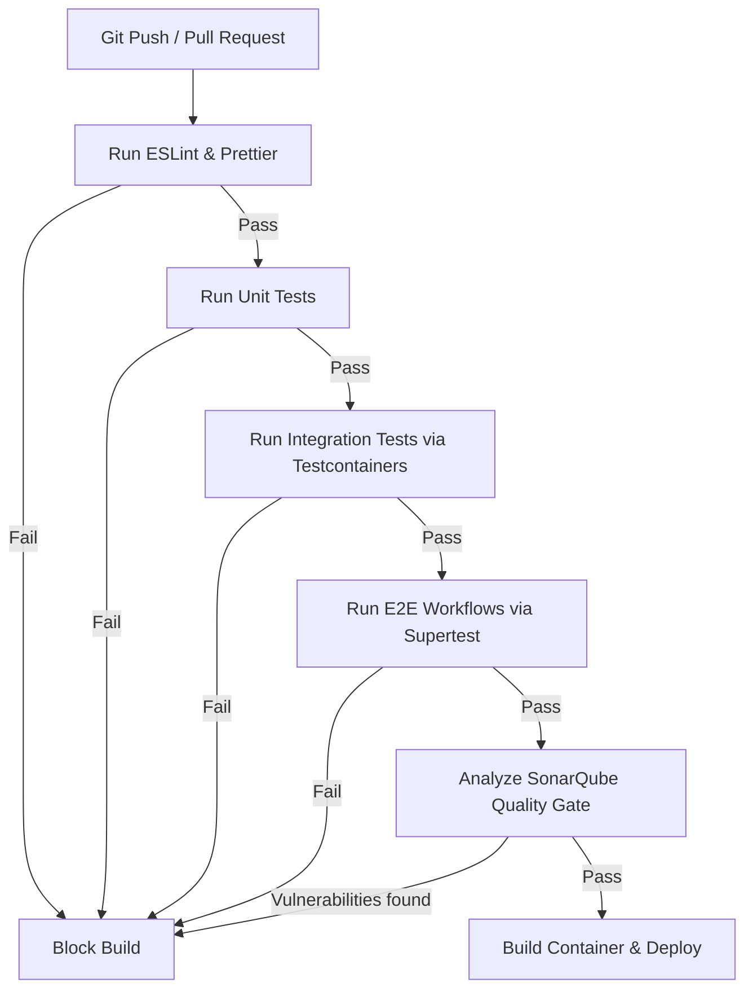
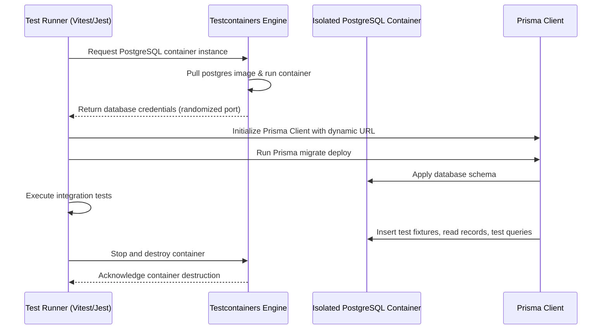
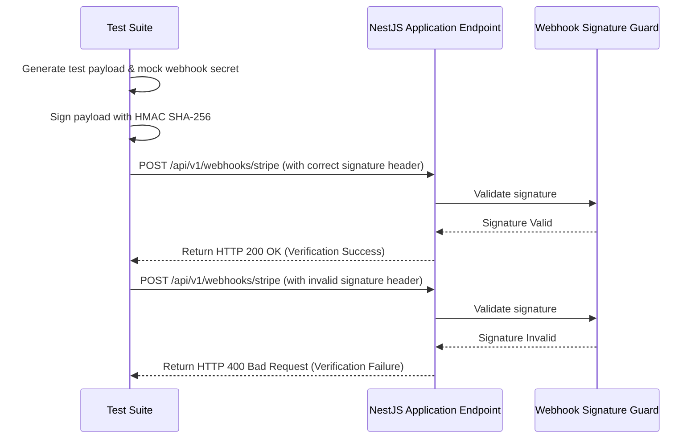
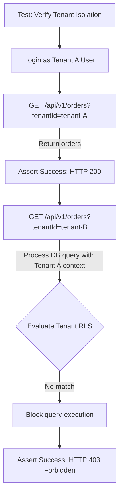

# TESTING FOUNDATION & QUALITY ASSURANCE CORE ARCHITECTURE

**Project Name:** Enterprise SaaS Business Management Platform  
**Document Version:** 1.0.0 — Baseline Standard  
**Date:** July 14, 2026  
**Authors:** Principal Backend Architect, Software Quality Architect, and NestJS Enterprise Engineer  
**Classification:** Internal — Confidential  
**Phase:** 23.28 — Testing Foundation & Quality Assurance Core Architecture  

---

## Table of Contents

1. [Executive Summary](#1-executive-summary)
2. [Testing Architecture Overview](#2-testing-architecture-overview)
3. [Testing Strategy Architecture](#3-testing-strategy-architecture)
4. [Testing Core Module Structure](#4-testing-core-module-structure)
5. [Unit Testing Architecture](#5-unit-testing-architecture)
6. [Integration Testing Architecture](#6-integration-testing-architecture)
7. [End-to-End Testing Architecture](#7-end-to-end-testing-architecture)
8. [Test Database Strategy](#8-test-database-strategy)
9. [Mocking External Services](#9-mocking-external-services)
10. [Authentication Testing Strategy](#10-authentication-testing-strategy)
11. [Multi-Tenant Testing Strategy](#11-multi-tenant-testing-strategy)
12. [API Testing Strategy](#12-api-testing-strategy)
13. [CI/CD Testing Pipeline](#13-cicd-testing-pipeline)
14. [Code Quality Standards](#14-code-quality-standards)
15. [Performance & Load Testing Strategy](#15-performance--load-testing-strategy)
16. [System Testing Diagrams](#16-system-testing-diagrams)
17. [Enterprise Implementation Guidelines](#17-enterprise-implementation-guidelines)
18. [Implementation Summary](#18-implementation-summary)

---

## 1. Executive Summary

### 1.1 Document Purpose
This document establishes the **Testing Foundation & Quality Assurance Core Architecture** (Phase 23.28). It details the testing hierarchy, test directory layouts, mock adapter strategies, Testcontainers configurations, multi-tenant data isolation testing, and CI/CD quality gate rules.

---

## 2. Testing Architecture Overview

### 2.1 Automated Testing in Enterprise SaaS
Enterprise SaaS platforms require rigorous automated testing to prevent regressions, maintain multi-tenant security boundaries, and ensure system updates do not impact tenant business operations.

### 2.2 Test Types
*   **Unit Testing:** Verifies the behavior of individual functions or services in isolation.
*   **Integration Testing:** Validates interactions between components, such as a service communicating with Prisma or Redis.
*   **End-to-End (E2E) Testing:** Tests complete business workflows (e.g., tenant onboarding) from the initial request to database validation.
*   **Performance Testing:** Measures system response times and throughput under simulated user loads.
*   **Security Testing:** Verifies authentication checks, authorization scopes, and tenant isolation barriers.

---

## 3. Testing Strategy Architecture

```
Code Change ──► Unit Tests ──► Integration Tests ──► E2E Tests ──► Quality Gates ──► Deploy
```

### 3.1 Operations Layer
*   **Unit Tests:** Executed locally by developers on save to verify component logic.
*   **Integration Tests:** Run before pull request merges to verify database queries and cache interactions.
*   **E2E Tests:** Executed in pre-production environments to validate complete user journeys.
*   **CI/CD Pipeline:** Enforces quality gates (e.g., minimum test pass rate, code coverage thresholds) before code can be deployed.

---

## 4. Testing Core Module Structure

The test files are organized under the root `test/` directory:

```
test/
 ├── unit/
 │    ├── services/           (Tests business logic services with mock dependencies)
 │    ├── controllers/        (Tests routing and status code mappings with mock services)
 │    └── repositories/       (Tests repositories with mock database clients)
 ├── integration/
 │    ├── database/           (Tests Prisma queries against temporary PostgreSQL containers)
 │    ├── redis/              (Tests cache invalidations and locks against Redis containers)
 │    └── external-services/  (Tests integrations using sandbox configurations)
 ├── e2e/
 │    ├── authentication/     (Tests authentication and token rotation endpoints)
 │    ├── tenant/             (Tests tenant registration and isolation boundaries)
 │    └── business-modules/   (Tests core transaction workflows)
 └── fixtures/
      └── test-data/          (JSON fixtures for seeding test environments)
```

---

## 5. Unit Testing Architecture

### 5.1 Isolating Components
Unit tests verify component logic in isolation by replacing external dependencies (like databases or third-party APIs) with mock implementations:

```
Instantiate Mock Dependencies ──► Inject into Target Component ──► Execute Method ──► Assert Output
```

This ensures unit tests are fast and run without requiring external infrastructure.

---

## 6. Integration Testing Architecture

### 6.1 Validating Infrastructure Connections
Integration tests verify that components interact correctly with active databases and cache engines:

```
Spin Up Testcontainers ──► Run Migrations ──► Execute Queries ──► Assert DB State
```

These tests run against actual database engines to ensure Prisma queries and relational triggers function correctly under realistic conditions.

---

## 7. End-to-End Testing Architecture

### 7.1 Testing User Journeys
E2E tests use `supertest` to execute HTTP requests against the application, verifying the complete execution flow from route guards to database updates:

*   **Tenant Onboarding Workflow Example:**
    1.  `POST /api/v1/tenants/register` (Registers a new tenant).
    2.  `POST /api/v1/auth/login` (Logs in the admin user).
    3.  `POST /api/v1/billing/subscriptions` (Activates a subscription tier).
    4.  Verify that the tenant and user records are created in the database and have the correct subscription capabilities mapped.

---

## 8. Test Database Strategy

*   **Option A: Separate Test Database:** Risky because concurrent test runs can overwrite each other's data.
*   **Option B: In-Memory Database:** Lacks support for database-specific features like PostgreSQL Row-Level Security (RLS).
*   **Option C: Docker Testcontainers (Recommended):** Spins up a fresh, isolated PostgreSQL container for each test suite, ensuring clean test environments and support for all database features.

---

## 9. Mocking External Services

External integrations (such as payment gateways or SMS providers) are mocked during testing to prevent unwanted external calls and charge fees:

```
App Request ──► Routing Resolver ──► Mock Provider Adapter ──► Return Fake Success/Fail
```

Tests verify that the application handles both successful and failed external service responses correctly.

---

## 10. Authentication Testing Strategy

The security testing suite verifies authentication and token management endpoints:

*   **Token Generation:** Validates that login requests return valid access and refresh tokens.
*   **Token Expirations:** Verifies that expired tokens are rejected by route guards.
*   **Scope Enforcement:** Tests that users are blocked when attempting to access endpoints outside their assigned scopes.

---

## 11. Multi-Tenant Testing Strategy

To verify tenant data isolation, tests simulate unauthorized data access attempts:

```
Tenant B Client ──► GET /api/v1/orders?tenantId=tenant-A ──► Guard Blocks Request (HTTP 403)
```

Tests ensure that database queries are scoped to the active tenant context and that RLS policies prevent cross-tenant data leaks.

---

## 12. API Testing Strategy

*   **DTO Validation:** Verifies that requests with missing required fields or invalid types are rejected with HTTP 400 Bad Request.
*   **Contract Testing:** Uses OpenAPI schemas to verify that API responses match the expected structures.

---

## 13. CI/CD Testing Pipeline

The CI/CD pipeline enforces testing gates to protect the production branch:

```
Git Push ──► Lint & Format ──► Run Unit Tests ──► Run Integration Tests ──► Run E2E Tests ──► Deploy
```

Code coverage metrics are analyzed during builds; pull requests are blocked if code coverage falls below the required threshold.

---

## 14. Code Quality Standards

*   **Static Analysis:** SonarQube analyzes code for security vulnerabilities, bugs, and code smells.
*   **Linting:** ESLint enforces coding standards and flags potential issues.
*   **Dependency Audits:** `npm audit` runs during builds to identify and block vulnerable dependencies.

---

## 15. Performance & Load Testing Strategy

*   **Throughput Testing:** k6 executes load tests to measure request latencies and error rates under heavy concurrent traffic.
*   **Endpoint Targets:** Focuses on high-traffic endpoints, such as checkout controllers, to identify and resolve performance bottlenecks.

---

## 16. System Testing Diagrams

### 16.1 Testing Pyramid

```
                  ▲
                 / \
                /   \
               / E2E \  <-- Complete workflows (Supertest)
              /-------\
             /   Int   \ <-- DB and Cache connections (Testcontainers)
            /-----------\
           /    Unit     \ <-- Pure function logic (Jest Mocks)
          /_______________\
```

### 16.2 CI/CD Quality Pipeline



### 16.3 Database Integration Test Lifecycle



### 16.4 Webhook Signature Verification Test



### 16.5 Multi-Tenant Data Leak Assertion



---

## 17. Enterprise Implementation Guidelines

### 17.1 Test Naming Conventions
Files must use the `.spec.ts` suffix (e.g., `invoice.service.spec.ts`). Group tests using descriptive nested blocks (e.g., `describe('InvoiceService')`, `describe('createInvoice')`).

### 17.2 Coverage Standards
Maintain a minimum of **80%** statement and branch coverage across all core business modules and utility classes.

---

## 18. Implementation Summary

### 18.1 Testing Setup Schedule

| Task | Target Timeline | Status |
| :--- | :--- | :--- |
| Set up Jest configuration files | Day 1 | Planned |
| Configure Testcontainers integration templates | Day 2 | Planned |
| Create multi-tenant test suites | Day 3 | Planned |
| Configure CI/CD quality gates and coverage limits | Day 4 | Planned |

---

## Document Control

| Field | Value |
|---|---|
| **Document ID** | SBMP-BE-23.28-TESTING-QA |
| **Version** | 1.0.0 |
| **Status** | APPROVED — Baseline |
| **Owner** | Software Quality Architect |
| **Reviewed By** | Principal Architect, QA Lead, DevOps Engineer |
| **Review Cycle** | Quarterly |
| **Next Review** | October 2026 |

---

*Phase 23.28 — Testing Foundation & Quality Assurance Core Architecture | SaaS Business Management Platform*  
*Enterprise Confidential — © 2026 All Rights Reserved*
