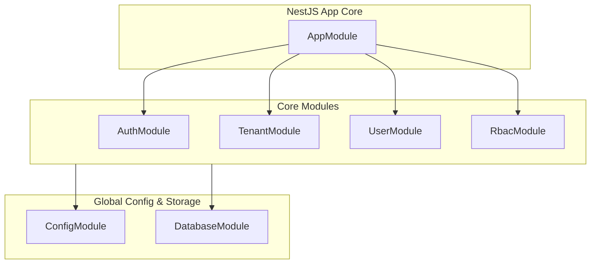
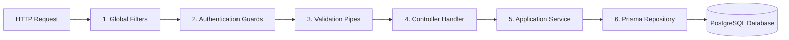
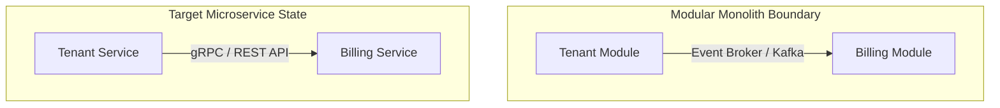
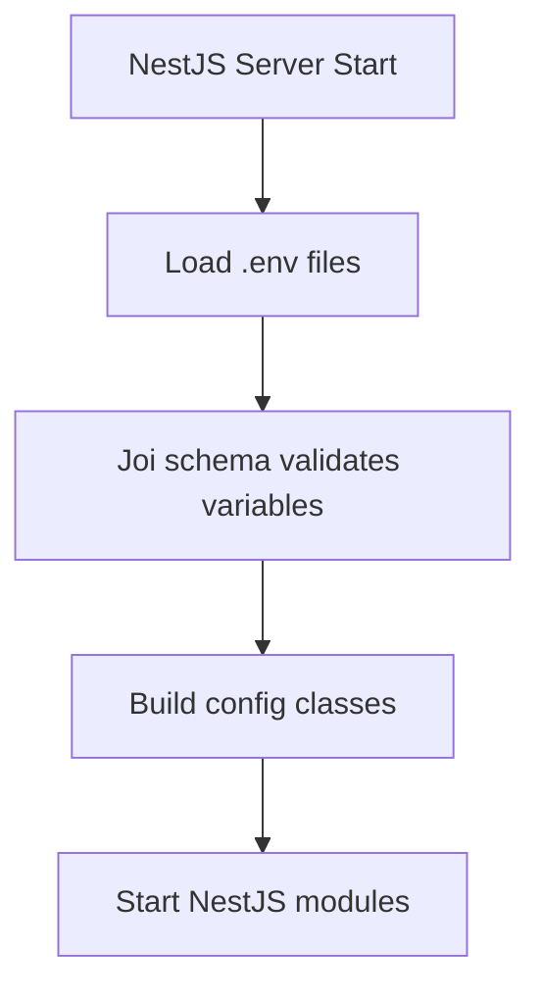
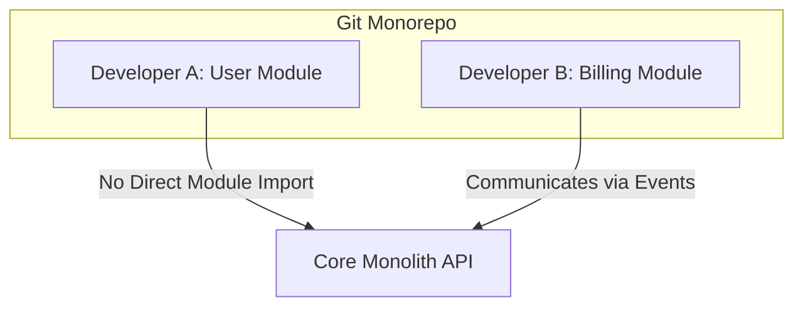

# BACKEND CORE MODULE DEVELOPMENT

**Project Name:** Enterprise SaaS Business Management Platform  
**Document Version:** 1.0.0 — Baseline Standard  
**Date:** July 14, 2026  
**Authors:** Principal Backend Architect and NestJS Enterprise Engineer  
**Classification:** Internal — Confidential  
**Phase:** 23.3 — Backend Core Module Development  

---

## Table of Contents

1. [Executive Summary](#1-executive-summary)
2. [Enterprise Folder Architecture](#2-enterprise-folder-architecture)
3. [Module Responsibilities](#3-module-responsibilities)
4. [Layered Architecture Layout](#4-layered-architecture-layout)
5. [Naming Conventions](#5-naming-conventions)
6. [Production Configuration Management](#6-production-configuration-management)
7. [Architectural Support Justification](#7-architectural-support-justification)
8. [Initial Module Verification Plan](#8-initial-module-verification-plan)
9. [Final Backend Architecture Blueprints (Mermaid)](#9-final-backend-architecture-blueprints-mermaid)
10. [Implementation Summary](#10-implementation-summary)

---

## 1. Executive Summary

### 1.1 Document Purpose
This document establishes the **Backend Core Module Development Plan** (Phase 23.3). It details the folder structure, layering boundaries, module responsibilities, naming rules, and configuration settings for the NestJS application.

### 1.2 Architectural Direction
The backend follows Clean Architecture and Domain-Driven Design (DDD) principles. It is structured as a modular monolith, allowing individual modules to be extracted into microservices as scaling demands increase.

---

## 2. Enterprise Folder Architecture

The NestJS backend application workspace is organized as follows:

```
src/
 ├── app/                      (App main routing module and root setup)
 ├── common/                   (Shared decorators, guards, and filters)
 │    ├── decorators/          (Custom decorators e.g., @CurrentUser, @Roles)
 │    ├── filters/             (Global exception filters for error translation)
 │    ├── guards/              (Auth guards and permission validators)
 │    ├── interceptors/        (Response logging and transformation interceptors)
 │    ├── middleware/          (Request trace ID and tenant context injections)
 │    ├── pipes/               (Global validation and resource converters)
 │    ├── utils/               (Utility helpers and formatting libraries)
 │    └── constants/           (System constants and code maps)
 ├── config/                   (Environment configurations, DB setups, and caches)
 ├── database/                 (ORM Prisma schema files and db migrations)
 │    ├── prisma/              (Prisma schema model declaration)
 │    ├── migrations/          (Generated SQL migration files history)
 │    └── database.module.ts   (Global database connection helper module)
 ├── modules/                  (Core business modules)
 │    ├── auth/                (Login sessions, credentials, and token rotations)
 │    ├── tenant/              (Tenant registrations and billing settings)
 │    ├── users/               (User profiles, accounts, and details)
 │    ├── roles/               (System roles definition and assignments)
 │    └── permissions/         (System permissions catalog)
 ├── infrastructure/           (External systems connections)
 │    ├── cache/               (Redis wrapper service module)
 │    ├── queue/               (BullMQ background runner setups)
 │    ├── email/               (SES / SMTP integration wrappers)
 │    └── storage/             (S3 file storage wrapper services)
 ├── shared/                   (Cross-module types and base entities)
 └── main.ts                   (NestJS server entry point)
```

---

## 3. Module Responsibilities

### 3.1 Authentication Module (`auth/`)
*   **Purpose:** Secure user authentication and token issuance.
*   **Business Responsibility:** Validates credentials, issues JWT tokens, handles OAuth redirection (Keycloak/SSO), and rotates refresh tokens.
*   **Controller Role:** Exposes public endpoints (`/api/v1/auth/login`, `/api/v1/auth/refresh`).
*   **Service Role:** Validates login profiles, signs tokens, and checks blacklists.
*   **Repository Role:** Interacts with Account, Session, and RefreshToken tables.
*   **Future Scalability:** Can be extracted into a dedicated Identity microservice.

### 3.2 Tenant Module (`tenant/`)
*   **Purpose:** Tenant isolation management.
*   **Business Responsibility:** Registers new tenants, configures tenant storage quotas, and manages subscription plan status.
*   **Controller Role:** Exposes administrative endpoints (`/api/v1/tenants`).
*   **Service Role:** Handles tenant registration workflows, applies row-level isolation configs, and manages billing plans.
*   **Repository Role:** Interacts with Tenant, Subscription, and Organization tables.
*   **Future Scalability:** Can be isolated to manage tenant configuration parameters.

### 3.3 Users Module (`users/`)
*   **Purpose:** User account management.
*   **Business Responsibility:** Manages user profiles, emails, status, and profile updates.
*   **Controller Role:** Exposes user endpoints (`/api/v1/users`).
*   **Service Role:** Implements user updates, handles soft deletions, and triggers registration emails.
*   **Repository Role:** Interacts with User, Account, and Profile tables.
*   **Future Scalability:** Links directly to the auth module to serve user data queries.

### 3.4 Roles & Permissions Modules (`roles/`, `permissions/`)
*   **Purpose:** Role-Based Access Control (RBAC).
*   **Business Responsibility:** Defines user role limits and maps permissions to system resources.
*   **Controller Role:** Exposes role administration endpoints (`/api/v1/roles`).
*   **Service Role:** Evaluates user permission sets and enforces permission guards.
*   **Repository Role:** Interacts with Role, Permission, UserRole, and RolePermission tables.
*   **Future Scalability:** Connects with the authentication gateway to cache user permissions in Redis.

---

## 4. Layered Architecture Layout

Code within each module is organized into four layers to maintain separation of concerns:

```
  API / CONTROLLER LAYER ◄── Handles HTTP requests and serializes DTO responses
            │
            ▼
  APPLICATION SERVICE LAYER ◄── Implements use cases and coordinates domain actions
            │
            ▼
  DOMAIN MODEL LAYER ◄── Defines domain entities, business rules, and interfaces
            │
            ▼
  INFRASTRUCTURE LAYER ◄── Interacts with databases, queues, and external APIs
```

---

## 5. Naming Conventions

Standardized naming conventions ensure codebase consistency:

*   **File Naming:** Lowercase with dash separators, suffixed by type (e.g., `tenant.controller.ts`, `create-tenant.dto.ts`).
*   **Class Naming:** PascalCase, matching the file suffix (e.g., `TenantController`, `TenantService`).
*   **Folder Naming:** Lowercase with dash separators (e.g., `tenant-management/`).
*   **DTO Naming:** PascalCase, suffixed by DTO (e.g., `CreateTenantDto`, `UpdateUserDto`).
*   **Entity Naming:** PascalCase, matching model classes (e.g., `TenantEntity`, `UserEntity`).
*   **Repository Naming:** PascalCase, suffixed by Repository (e.g., `TenantRepository`).

---

## 6. Production Configuration Management

The application manages configuration parameters using isolated `.env` environment files:

*   `.env`: Base variables template containing non-sensitive keys.
*   `.env.development`: Settings optimized for local developer environments (e.g., verbose logging, local database URLs).
*   `.env.production`: Production settings (e.g., cloud database endpoints, strict TLS requirements, debug logs disabled).

### 6.1 Configuration Module Structure
The NestJS Configuration module aggregates parameters into typed config classes:

*   **Database Config:** Handles connection string parameters, pooling limits, and retry logic.
*   **JWT Config:** Manages private keys, token expiration windows, and signing algorithms.
*   **Redis Config:** Configures host address lists, authentication credentials, and connection limits.
*   **Email Config:** Configures AWS SES endpoint regions and SMTP settings.
*   **Storage Config:** Manages bucket storage names, IAM access keys, and CDN domains.

---

## 7. Architectural Support Justification

The backend architecture is designed to support long-term scalability and maintenance:

*   **Multi-Tenant SaaS:** Tenant resolvers inject active tenant contexts into the request pipeline, verifying database isolation rules automatically.
*   **Multiple Business Modules:** Domain modules are decoupled, using event brokers to communicate instead of direct imports.
*   **Future Microservices:** Modules are designed with clean boundaries, making it easy to migrate them to independent microservices with minimal refactoring.
*   **Large Developer Team:** Standardized folders, file conventions, and linting rules prevent integration conflicts during parallel development.
*   **Enterprise Maintenance:** Modular structures and clear interfaces simplify updates and make the system easier to test and maintain over time.

---

## 8. Initial Module Verification Plan

*   **Liveness Verification:** Start the NestJS server and confirm the health check endpoint returns HTTP 200.
*   **Dependency Injection Test:** Verify NestJS startup outputs to check for missing providers or circular dependency warnings.
*   **Database Integration Check:** Run connection tests to verify Prisma client connectivity to PostgreSQL instances.

---

## 9. Final Backend Architecture Blueprints (Mermaid)

### 9.1 Module Layout Structure



### 9.2 Request Pipeline Layering



### 9.3 Module Decoupling (Future Microservices)



### 9.4 Configuration Lifecycle



### 9.5 Team Monorepo Workflows



---

## 10. Implementation Summary

### 10.1 Backend Core Setup Schedule

| Task | Target Timeline | Status |
| :--- | :--- | :--- |
| Set up NestJS core workspace folders | Day 1 | Planned |
| Implement global exception filters | Day 2 | Planned |
| Create tenant resolver middleware | Day 3 | Planned |
| Connect Prisma service providers | Day 4 | Planned |

---

## Document Control

| Field | Value |
|---|---|
| **Document ID** | SBMP-BE-23.3-CORE-MODULE |
| **Version** | 1.0.0 |
| **Status** | APPROVED — Baseline |
| **Owner** | Principal Backend Architect |
| **Reviewed By** | NestJS Lead, DevOps Manager, QA Lead |
| **Review Cycle** | Quarterly |
| **Next Review** | October 2026 |

---

*Phase 23.3 — Backend Core Module Development | SaaS Business Management Platform*  
*Enterprise Confidential — © 2026 All Rights Reserved*
