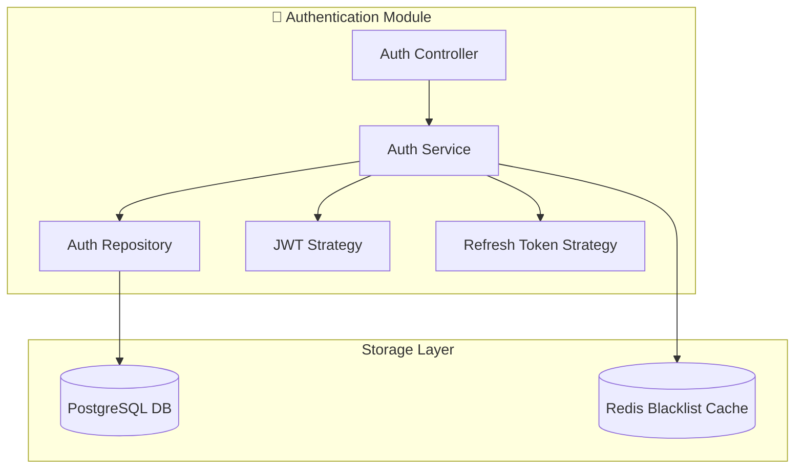
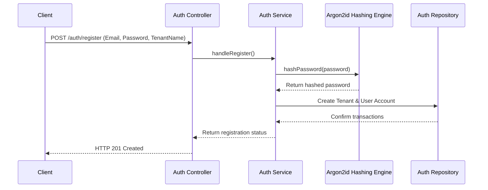
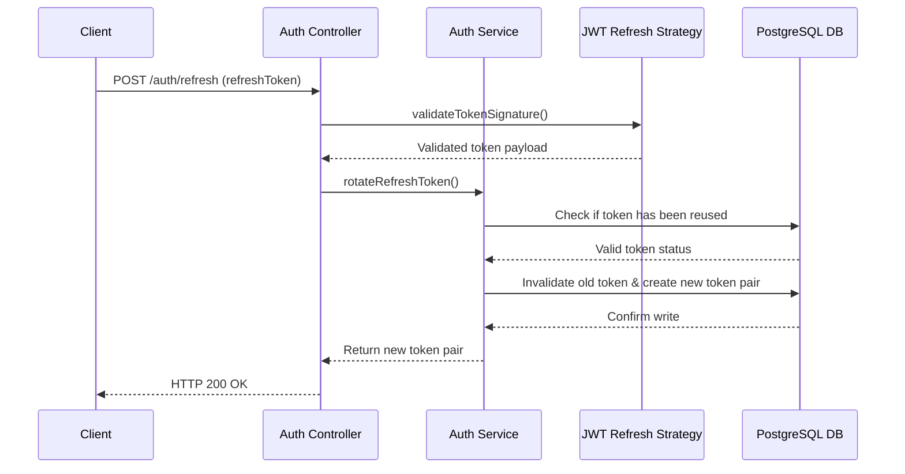
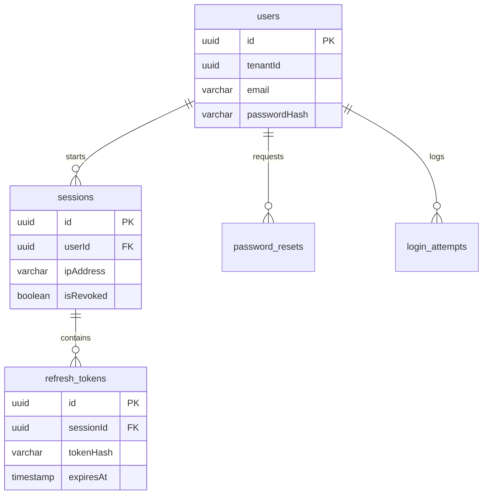
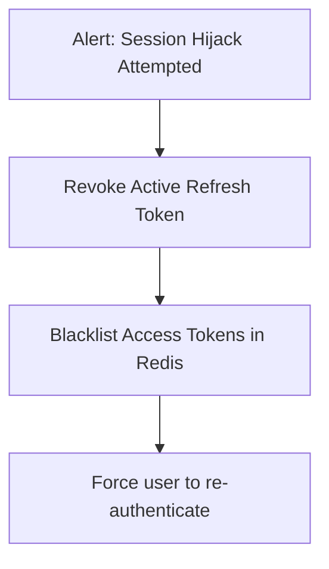

# AUTHENTICATION MODULE DESIGN

**Project Name:** Enterprise SaaS Business Management Platform  
**Document Version:** 1.0.0 — Baseline Standard  
**Date:** July 14, 2026  
**Authors:** Principal Backend Architect, Security Engineer, and NestJS Enterprise Developer  
**Classification:** Internal — Confidential  
**Phase:** 23.4 — Authentication Module Design  

---

## Table of Contents

1. [Executive Summary](#1-executive-summary)
2. [Auth Module Architecture](#2-auth-module-architecture)
3. [Authentication Flow Design](#3-authentication-flow-design)
4. [JWT Security Design](#4-jwt-security-design)
5. [Password Security & Policies](#5-password-security--policies)
6. [Multi-Tenant Authentication Isolation](#6-multi-tenant-authentication-isolation)
7. [Authentication Database Schema](#7-authentication-database-schema)
8. [Enterprise Security Features](#8-enterprise-security-features)
9. [API Endpoint Design Contracts](#9-api-endpoint-design-contracts)
10. [Final Authentication Blueprints (Mermaid)](#10-final-authentication-blueprints-mermaid)
11. [Implementation Summary](#11-implementation-summary)

---

## 1. Executive Summary

### 1.1 Document Purpose
This document establishes the **Authentication Module Design** (Phase 23.4). It details the architectural boundaries, processing pipelines, security schemas, token rules, and REST API endpoints for the enterprise authentication module in the NestJS backend application.

### 1.2 Security Directives
*   **Token Model:** Short-lived JWT access tokens with rotating, database-tracked refresh tokens.
*   **Security Standards:** Password hashing using Argon2id, IP-based request rate limiting, login failure account lockouts, and multi-tenant isolation contexts.

---

## 2. Auth Module Architecture

The `AuthModule` coordinates authentication, token issuance, and session tracking:

```
src/modules/auth/
 ├── controllers/
 │    └── auth.controller.ts        (REST routes for login, register, and refresh)
 ├── services/
 │    └── auth.service.ts            (Authenticates users and signs tokens)
 ├── repositories/
 │    └── auth.repository.ts         (Queries user accounts and sessions)
 ├── strategies/
 │    ├── jwt.strategy.ts            (Validates and decodes JWT payloads)
 │    └── refresh-token.strategy.ts  (Validates refresh tokens)
 ├── guards/
 │    ├── jwt-auth.guard.ts          (Blocks unauthenticated HTTP requests)
 │    └── roles.guard.ts             (Enforces role-based permissions)
 ├── dto/
 │    ├── login.dto.ts               (Validates login payloads)
 │    ├── register.dto.ts            (Validates registration payloads)
 │    └── refresh-token.dto.ts       (Validates refresh token requests)
 ├── entities/
 │    └── session.entity.ts          (Active login session domains)
 └── auth.module.ts                  (Module registrations)
```

---

## 3. Authentication Flow Design

### 3.1 User Registration Flow
1.  **Request Inbound:** The client sends profile and tenant credentials to the controller.
2.  **DTO Validation:** Pipes validate format and password complexity.
3.  **Password Hashing:** The service hashes the plain password using Argon2id.
4.  **Database Transaction:** The service creates both the `Tenant` and the `User` account within a single database transaction.

### 3.2 Login Flow
1.  **Validate Credentials:** The controller verifies input formats; the service verifies the user email and password hash.
2.  **Generate Tokens:** The service generates a short-lived access token and a rotating refresh token.
3.  **Create Session:** The service logs the session, user agent, IP address, and token hash.
4.  **Return Tokens:** The controller returns tokens via cookies or HTTP response bodies.

### 3.3 Token Refresh Flow
1.  **Verify Refresh Token:** The strategy decrypts and validates the signature of the refresh token.
2.  **Check Database Status:** The service checks if the token hash matches a valid session in the database.
3.  **Token Rotation:** The service rotates the token, generating a new access/refresh token pair and invalidating the old refresh token.

### 3.4 Logout Flow
1.  **Request Sign Out:** The client sends the logout request.
2.  **Revoke Session:** The service deletes the refresh token from the database and marks the session as revoked.

---

## 4. JWT Security Design

### 4.1 Access Token Specifications
*   **Lifespan:** 15 minutes.
*   **Payload Claims:**
    ```json
    {
      "sub": "user-uuid",
      "tenantId": "tenant-uuid",
      "role": "TenantAdmin",
      "permissions": ["user:create", "billing:read"],
      "iat": 1783936000,
      "exp": 1783936900
    }
    ```

### 4.2 Refresh Token Specifications
*   **Lifespan:** 7 days.
*   **Rotation:** Old refresh tokens are invalidated immediately upon reuse, protecting against token theft.
*   **Revocation:** Tokens can be revoked dynamically by SREs or users in case of device loss.

### 4.3 Design Rationale
*   **Short-Lived Access Tokens:** Minimize the risk window if a token is compromised, as access tokens cannot be easily revoked before expiration.
*   **Rotating Refresh Tokens:** Ensure that if a malicious actor steals a refresh token, the next refresh attempt by either the user or the attacker will trigger a reuse collision alert, invalidating the session.

---

## 5. Password Security & Policies

### 5.1 Password Hashing Strategy
*   **Algorithm:** Argon2id (using memory cost: 64MB, time cost: 3 passes, parallelism: 4 threads).
*   **Salting:** Every password hash uses a unique, cryptographically secure salt generated at hash runtime.

### 5.2 Account Security Rules
*   **Complexity Requirements:** Minimum 12 characters, including uppercase, lowercase, numbers, and symbols.
*   **Brute-Force Lockout:** Accounts are locked for 30 minutes after 5 consecutive failed login attempts.
*   **Password Reset Expirations:** Password reset links expire after 1 hour and can only be used once.

---

## 6. Multi-Tenant Authentication Isolation

### 6.1 Tenant Context Mapping
1.  Users log in with their credentials, returning a JWT token containing their `tenantId`.
2.  All database queries require the `tenantId` parameter, matching Row-Level Security (RLS) filters.
3.  Cross-tenant access attempts return HTTP 403 errors, preventing Tenant A from reading Tenant B data.

---

## 7. Authentication Database Schema

The authentication schema is structured as follows:

```
users ◄── System user profiles
  │
  ├── sessions ◄── Active user logins and metadata
  │
  ├── refresh_tokens ◄── Rotated token hashes for session management
  │
  ├── login_attempts ◄── Brute-force tracking database
  │
  └── password_resets ◄── One-time token resets
```

### 7.1 Table Field Specifications
*   **users:** `id` (UUID), `tenant_id` (UUID), `email` (VARCHAR), `password_hash` (VARCHAR), `status` (VARCHAR).
*   **sessions:** `id` (UUID), `user_id` (UUID), `ip_address` (VARCHAR), `user_agent` (VARCHAR), `is_revoked` (BOOLEAN).
*   **refresh_tokens:** `id` (UUID), `session_id` (UUID), `token_hash` (VARCHAR), `expires_at` (TIMESTAMP).
*   **login_attempts:** `id` (UUID), `email` (VARCHAR), `ip_address` (VARCHAR), `attempted_at` (TIMESTAMP), `is_successful` (BOOLEAN).
*   **password_resets:** `id` (UUID), `user_id` (UUID), `token_hash` (VARCHAR), `expires_at` (TIMESTAMP), `used_at` (TIMESTAMP).

---

## 8. Enterprise Security Features

*   **Rate Limiting:** IP-based request limits prevent API abuse.
*   **Session Management:** Users can view and terminate active sessions on other devices.
*   **Audit Logging:** Critical security events (e.g., login failures, password resets) are logged to audit tables with IP and user agent tracking.

---

## 9. API Endpoint Design Contracts

### 9.1 Register Tenant
*   **Route:** `POST /auth/register`
*   **Request payload:**
    ```json
    {
      "tenantName": "Acme Corp",
      "email": "admin@acme.com",
      "password": "SecurePassword123!"
    }
    ```
*   **Response format (HTTP 201):**
    ```json
    {
      "success": true,
      "tenantId": "tenant-uuid",
      "userId": "user-uuid"
    }
    ```

### 9.2 Login User
*   **Route:** `POST /auth/login`
*   **Request payload:**
    ```json
    {
      "email": "admin@acme.com",
      "password": "SecurePassword123!"
    }
    ```
*   **Response format (HTTP 200):**
    ```json
    {
      "accessToken": "eyJhbGciOi...",
      "refreshToken": "eyJhbGciOi...",
      "expiresIn": 900
    }
    ```

### 9.3 Refresh Token
*   **Route:** `POST /auth/refresh`
*   **Request payload:**
    ```json
    {
      "refreshToken": "eyJhbGciOi..."
    }
    ```
*   **Response format (HTTP 200):**
    ```json
    {
      "accessToken": "eyJhbGciOi...",
      "refreshToken": "eyJhbGciOi..."
    }
    ```

---

## 10. Final Authentication Blueprints (Mermaid)

### 10.1 Authentication Module Diagram



### 10.2 User Registration Flow



### 10.3 Token Refresh Flow



### 10.4 Database Schema Relations



### 10.5 Session Termination Lifecycle



---

## 11. Implementation Summary

### 11.1 Auth Setup Schedule

| Task | Target Timeline | Status |
| :--- | :--- | :--- |
| Set up JWT signing modules | Day 1 | Planned |
| Implement Argon2id password hash service | Day 2 | Planned |
| Implement token refresh and rotation logic | Day 3 | Planned |
| Set up user lockout middleware | Day 4 | Planned |

---

## Document Control

| Field | Value |
|---|---|
| **Document ID** | SBMP-BE-23.4-AUTH-MODULE |
| **Version** | 1.0.0 |
| **Status** | APPROVED — Baseline |
| **Owner** | Security Lead |
| **Reviewed By** | Backend Lead, DevOps Architect, QA Director |
| **Review Cycle** | Quarterly |
| **Next Review** | October 2026 |

---

*Phase 23.4 — Authentication Module Design | SaaS Business Management Platform*  
*Enterprise Confidential — © 2026 All Rights Reserved*
