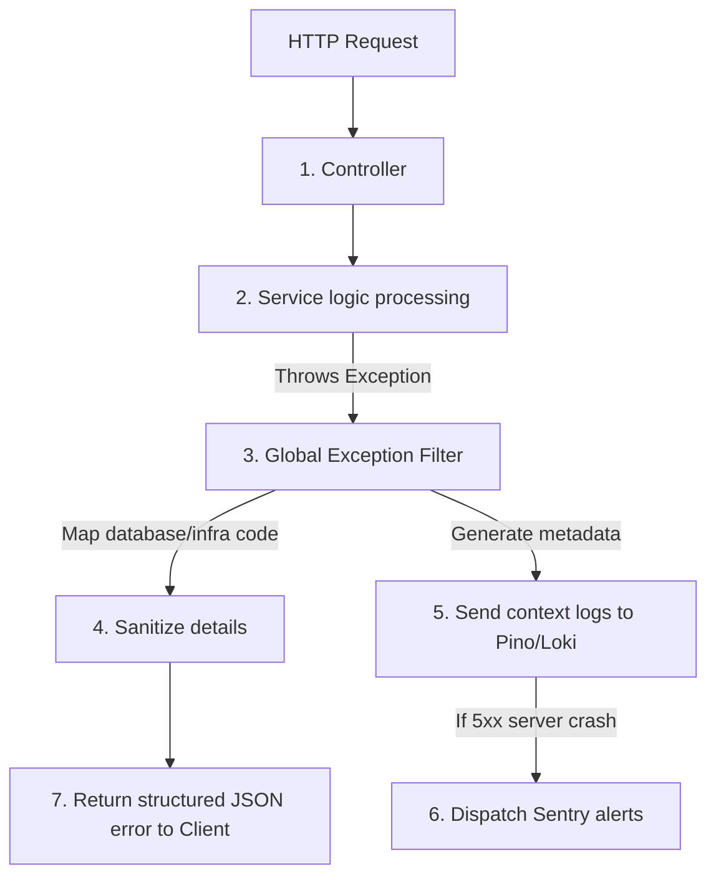
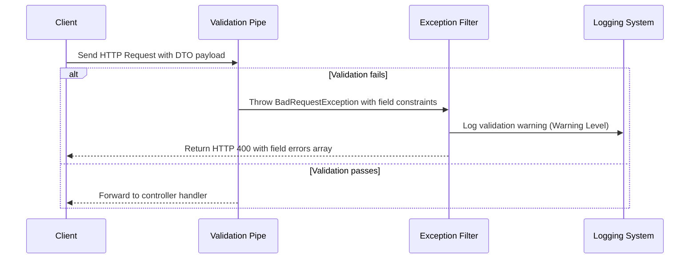
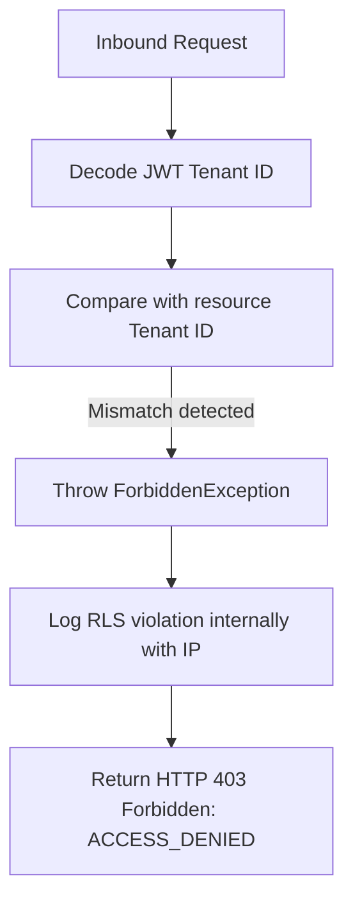
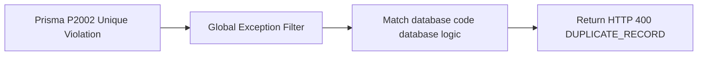
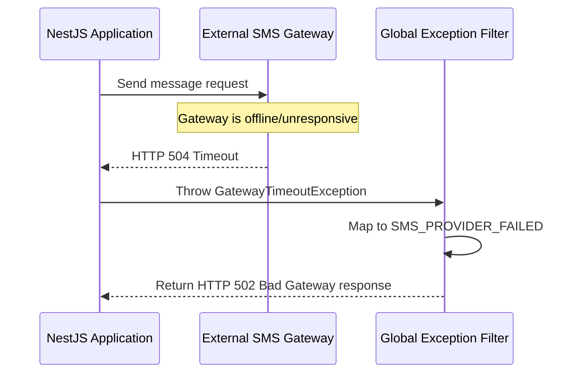

# EXCEPTION HANDLING & ERROR MANAGEMENT ARCHITECTURE

**Project Name:** Enterprise SaaS Business Management Platform  
**Document Version:** 1.0.0 — Baseline Standard  
**Date:** July 14, 2026  
**Authors:** Principal Backend Architect, NestJS Enterprise Engineer, and Software Quality Architect  
**Classification:** Internal — Confidential  
**Phase:** 23.6 — Exception Handling & Error Management Architecture  

---

## Table of Contents

1. [Executive Summary](#1-executive-summary)
2. [Exception Handling Architecture Overview](#2-exception-handling-architecture-overview)
3. [NestJS Exception Architecture Design](#3-nestjs-exception-architecture-design)
4. [Global Exception Filter Design](#4-global-exception-filter-design)
5. [Standard Error Response Format](#5-standard-error-response-format)
6. [Error Classification System](#6-error-classification-system)
7. [Prisma Error Handling Strategy](#7-prisma-error-handling-strategy)
8. [Validation Error Handling](#8-validation-error-handling)
9. [Logging & Observability Integration](#9-logging--observability-integration)
10. [Multi-Tenant SaaS Error Handling](#10-multi-tenant-saas-error-handling)
11. [Security Considerations](#11-security-considerations)
12. [Architecture Diagrams](#12-architecture-diagrams)
13. [Enterprise Implementation Guidelines](#13-enterprise-implementation-guidelines)
14. [Implementation Summary](#14-implementation-summary)

---

## 1. Executive Summary

### 1.1 Document Purpose
This document establishes the **Exception Handling & Error Management Architecture** (Phase 23.6). It designs a centralized exception framework for the backend, ensuring structured API responses, secure data isolation, automated database error mappings, and comprehensive observability.

---

## 2. Exception Handling Architecture Overview

### 2.1 Importance of Centralized Error Handling
Centralized error handling ensures that all API endpoints return consistent, structured error responses. It simplifies frontend integration, prevents stack trace leaks, and routes error telemetry to logging engines without cluttering business logic controllers with redundant `try/catch` blocks.

### 2.2 Error Typologies
*   **Business Errors:** Violations of domain rules (e.g., `INSUFFICIENT_STOCK`). Map to `400 Bad Request` or `422 Unprocessable Entity`.
*   **Validation Errors:** Request DTO schema validation failures. Map to `400 Bad Request`.
*   **Authentication Errors:** Invalid or expired credentials. Map to `401 Unauthorized`.
*   **Authorization Errors:** Insufficient roles or permissions. Map to `403 Forbidden`.
*   **Database Errors:** Unique constraint violations or deadlocks. Map to generic `500 Internal Server Error` but log details internally.
*   **Infrastructure Errors:** Network failures or memory limits. Map to `500 Internal Server Error`.
*   **External Service Errors:** Downstream payment or SMS gateway failures. Map to `502 Bad Gateway` or `503 Service Unavailable`.

---

## 3. NestJS Exception Architecture Design

The exception management system is located under `src/core/exceptions/`:

```
src/core/exceptions/
 ├── exceptions.module.ts            (Registers global exception filter)
 ├── filters/
 │    └── global-exception.filter.ts (Catch-all exception filter)
 ├── errors/
 │    ├── business.error.ts          (Custom domain-level errors base class)
 │    ├── validation.error.ts        (DTO validation errors base class)
 │    ├── not-found.error.ts         (Resource lookup errors base class)
 │    └── unauthorized.error.ts      (Auth access failure base class)
 └── response/
      └── error-response.interface.ts (TypeScript API response interface)
```

### 3.1 Responsibilities of Module Components
*   **GlobalExceptionFilter:** Resolves thrown exceptions, translates them to HTTP responses, strips database internals, and logs details.
*   **Custom Errors (business, validation, not-found, unauthorized):** Bounded domain exceptions extending the native JavaScript `Error` or NestJS `HttpException`.
*   **ErrorResponse Interface:** Defines the exact layout of the JSON error response sent to clients.

---

## 4. Global Exception Filter Design

### 4.1 Filter Pipeline Responsibilities
1.  **Intercept Exception:** Intercepts any unhandled exception before it reaches the client.
2.  **Generate Correlation ID:** Generates a unique tracking token (`requestId`) for debugging.
3.  **Trace Analysis:** Inspects error types (e.g., maps database failures to generic internal server errors).
4.  **Log Telemetry:** Routes metadata, request details, and stack traces to Winston or Pino.
5.  **Return Response:** Sends a sanitized, formatted JSON response to the client.

---

## 5. Standard Error Response Format

All API errors return a uniform schema:

```json
{
  "success": false,
  "statusCode": 400,
  "errorCode": "USER_EMAIL_EXISTS",
  "message": "Email already registered",
  "timestamp": "2026-07-14T03:01:17Z",
  "path": "/auth/register",
  "requestId": "req-9c8a7b6d-5e4f-3a2b"
}
```

### 5.1 Field Specifications
*   `success`: Explicitly set to `false`.
*   `statusCode`: Matching HTTP status code.
*   `errorCode`: Machine-readable code string for client-side handling.
*   `message`: Human-readable error message.
*   `timestamp`: UTC time string.
*   `path`: Requested endpoint URI.
*   `requestId`: UUID tracing the request in backend logging systems.

---

## 6. Error Classification System

```
                      GLOBAL EXCEPTION FILTER
                                 │
     ┌───────────────────┬───────┴───────────┬───────────────────┐
     ▼                   ▼                   ▼                   ▼
Authentication     Authorization         Business            Database
(INVALID_TOKEN)   (ACCESS_DENIED)   (LIMIT_EXCEEDED)    (DUPLICATE_RECORD)
```

### 6.1 Category Mappings
*   **Authentication Errors:** `INVALID_TOKEN`, `TOKEN_EXPIRED`, `LOGIN_FAILED`.
*   **Authorization Errors:** `ACCESS_DENIED`, `ROLE_NOT_ALLOWED`.
*   **Business Errors:** `INSUFFICIENT_BALANCE`, `SUBSCRIPTION_LIMIT_REACHED`.
*   **Database Errors:** `DUPLICATE_RECORD`, `FOREIGN_KEY_FAILED`.
*   **External Service Errors:** `PAYMENT_PROVIDER_DOWN`, `SMS_PROVIDER_FAILED`.

---

## 7. Prisma Error Handling Strategy

The exception filter catches and maps `PrismaClientKnownRequestError` codes to prevent database schema exposure:

*   **P2002 (Unique Constraint Violation):** Maps to `400 Bad Request` with code `DUPLICATE_RECORD` (e.g., email already exists).
*   **P2003 (Foreign Key Constraint Failure):** Maps to `400 Bad Request` with code `INVALID_REFERENCE` (e.g., referenced category does not exist).
*   **P2025 (Record Not Found):** Maps to `404 Not Found` with code `RECORD_NOT_FOUND`.

---

## 8. Validation Error Handling

DTO validation errors return structured, field-level arrays:

```json
{
  "success": false,
  "statusCode": 400,
  "errorCode": "VALIDATION_FAILED",
  "message": "Validation failed for request parameters",
  "errors": [
    {
      "field": "email",
      "constraints": ["email must be a valid email address"]
    },
    {
      "field": "password",
      "constraints": ["password must be longer than or equal to 12 characters"]
    }
  ],
  "timestamp": "2026-07-14T03:01:17Z",
  "path": "/auth/register",
  "requestId": "req-9c8a7b6d"
}
```

---

## 9. Logging & Observability Integration

### 9.1 Error Telemetry Pipeline
1.  **Pino/Winston:** Captures the error payload, stack trace, metadata, tenant context, and `requestId`.
2.  **Loki/ELK Stack:** Aggregates and indexes logs for searchability.
3.  **Sentry:** Reports critical system crashes (`5xx` errors) with alert routing.

```
Error Occurs ──► Capture Context ──► Write to Loki ──► Sentry Alert ──► Issue Resolved
```

---

## 10. Multi-Tenant SaaS Error Handling

*   **Tenant Authentication Failures:** Errors like `TENANT_NOT_ACTIVE`, `MODULE_NOT_ENABLED`, or `PLAN_LIMIT_EXCEEDED` block requests before reaching business logic controllers.
*   **Data Masking:** Detailed tenancy parameters (e.g., RLS violations) are logged internally for debug purposes but hidden from external API responses to prevent tenant enumeration.

---

## 11. Security Considerations

*   **No Stack Trace Exposure:** Stack traces are stripped from production API responses.
*   **No Database Detail Leakage:** Schema names, raw queries, and database constraint names are mapped to generic error codes.
*   **Sanitize Context:** Secrets, passwords, and API keys are redacted from logs before storage.

---

## 12. Architecture Diagrams

### 12.1 Exception Processing Pipeline



### 12.2 Request Validation Lifecycle



### 12.3 Multi-Tenant Access Guard Loop



### 12.4 Database Exception Mapping Flow



### 12.5 Downstream Gateway Timeout Failure



---

## 13. Enterprise Implementation Guidelines

### 13.1 Naming Conventions
*   **Custom Exception Classes:** Suffixed with `Error` or `Exception` (e.g., `BusinessError`, `DatabaseException`).
*   **Error Codes:** Uppercase, underscore-separated strings (e.g., `INSUFFICIENT_STOCK`).

### 13.2 HTTP Status Code Map
*   Validation errors: `400 Bad Request`.
*   Authentication/Token failure: `401 Unauthorized`.
*   Authorization/Scope mismatch: `403 Forbidden`.
*   Resource missing: `404 Not Found`.
*   Unique/Domain rules failures: `422 Unprocessable Entity`.
*   Downstream service errors: `502 Bad Gateway`.
*   System crashes: `500 Internal Server Error`.

---

## 14. Implementation Summary

### 14.1 Exception Setup Schedule

| Task | Target Timeline | Status |
| :--- | :--- | :--- |
| Set up global exception filters | Day 1 | Planned |
| Implement Prisma client error mapper | Day 2 | Planned |
| Configure DTO validation pipe alerts | Day 3 | Planned |
| Integrate Pino logging telemetry hooks | Day 4 | Planned |

---

## Document Control

| Field | Value |
|---|---|
| **Document ID** | SBMP-BE-23.6-EXCEPTION-HANDLING |
| **Version** | 1.0.0 |
| **Status** | APPROVED — Baseline |
| **Owner** | Principal Backend Architect |
| **Reviewed By** | QA Lead, Lead Developer, Security Architect |
| **Review Cycle** | Quarterly |
| **Next Review** | October 2026 |

---

*Phase 23.6 — Exception Handling & Error Management Architecture | SaaS Business Management Platform*  
*Enterprise Confidential — © 2026 All Rights Reserved*
