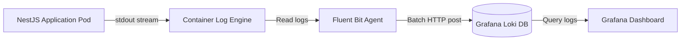
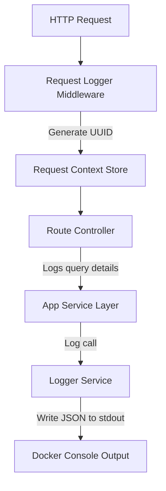
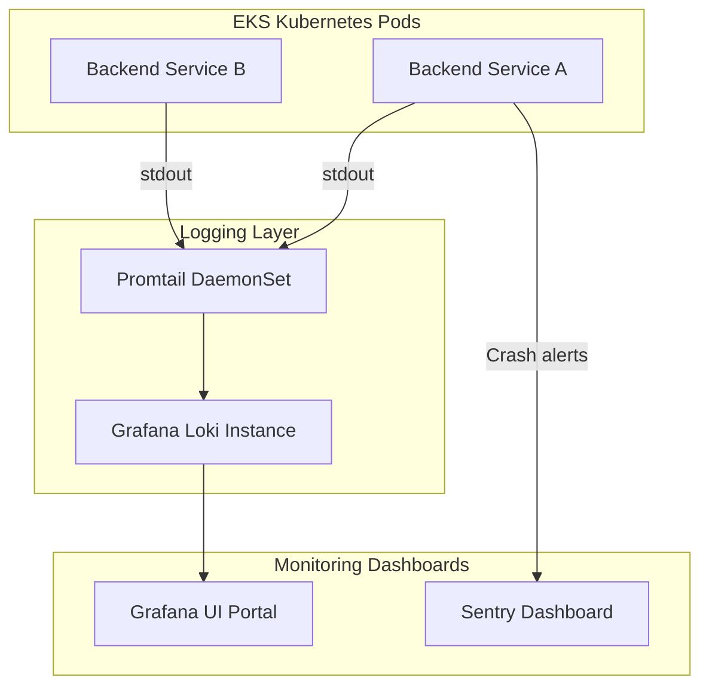
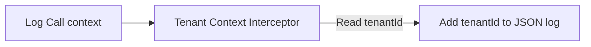
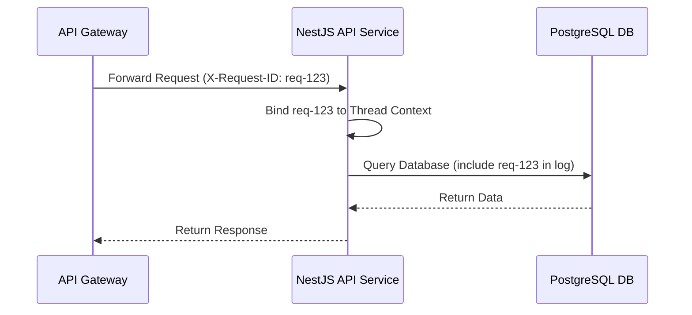
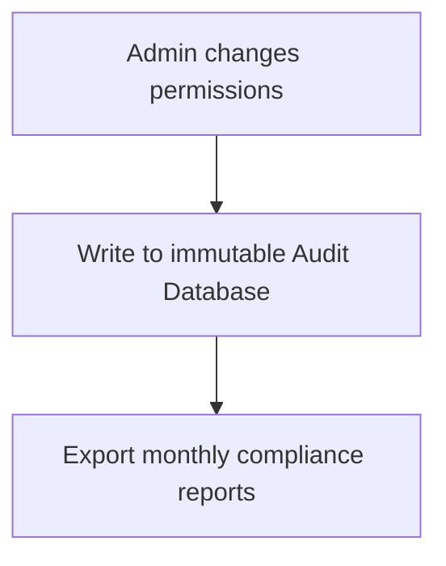

# LOGGING & OBSERVABILITY CORE ARCHITECTURE

**Project Name:** Enterprise SaaS Business Management Platform  
**Document Version:** 1.0.0 — Baseline Standard  
**Date:** July 14, 2026  
**Authors:** Principal Backend Architect, DevOps Architect, and NestJS Enterprise Engineer  
**Classification:** Internal — Confidential  
**Phase:** 23.7 — Logging & Observability Core Architecture  

---

## Table of Contents

1. [Executive Summary](#1-executive-summary)
2. [Logging & Observability Overview](#2-logging--observability-overview)
3. [Observability Architecture Design](#3-observability-architecture-design)
4. [NestJS Logging Core Module Design](#4-nestjs-logging-core-module-design)
5. [Structured Logging Design](#5-structured-logging-design)
6. [Log Levels Strategy](#6-log-levels-strategy)
7. [Request Logging Architecture](#7-request-logging-architecture)
8. [Security & Audit Logging](#8-security--audit-logging)
9. [Integration with Monitoring Stack](#9-integration-with-monitoring-stack)
10. [Multi-Tenant SaaS Logging Strategy](#10-multi-tenant-saas-logging-strategy)
11. [Production Logging Pipeline](#11-production-logging-pipeline)
12. [Log Retention Strategy](#12-log-retention-strategy)
13. [Disaster Debugging Workflow](#13-disaster-debugging-workflow)
14. [Architecture Diagrams](#14-architecture-diagrams)
15. [Enterprise Implementation Guidelines](#15-enterprise-implementation-guidelines)
16. [Implementation Summary](#16-implementation-summary)

---

## 1. Executive Summary

### 1.1 Document Purpose
This document establishes the **Logging & Observability Core Architecture** (Phase 23.7). It designs a high-performance, multi-tenant aware logging infrastructure, defining log formats, transport pipelines, retention periods, and monitoring integrations.

---

## 2. Logging & Observability Overview

### 2.1 Centralized Logging Rationale
In microservices-ready and multi-tenant SaaS environments, scattered flat log files are impossible to debug. Centralized logging aggregates logs from all containers, services, databases, and network gateways into a searchable index, enabling immediate lookup of errors across tenant scopes.

### 2.2 Core Concepts
*   **Logging:** Recording discrete event occurrences (e.g., database writes, network calls).
*   **Monitoring:** Aggregating numeric metrics over time (e.g., CPU load, API error rates).
*   **Tracing:** Following request lifecycles across service boundaries using tracking IDs.
*   **Alerting:** Triggering automated notifications when thresholds are breached.
*   **Observability:** The system capability to infer internal state based on external outputs (logs, metrics, traces).

---

## 3. Observability Architecture Design

The observability pipeline ensures that error states are processed from application execution to engineering notifications:

```
┌─────────────┐     ┌──────────────┐     ┌──────────────┐     ┌──────────────┐
│ Application │ ──► │ Logging      │ ──► │ Log          │ ──► │ Monitoring   │
│ Engine Logs │     │ Transport    │     │ Aggregator   │     │ & Alerting   │
└─────────────┘     └──────────────┘     └──────────────┘     └──────────────┘
                                                                     │
                                                                     ▼
                                                              ┌──────────────┐
                                                              │ Engineering  │
                                                              │ Alert Shunts │
                                                              └──────────────┘
```

### 3.1 Log Categorizations
*   **Application Logs:** General request flows, system boots, and route hits.
*   **Infrastructure Logs:** CPU metrics, container lifecycles, and load-balancer shunts.
*   **Database Logs:** Prisma query durations, lock occurrences, and schema migrations.
*   **Security Logs:** Brute-force lockout alerts and role permission updates.
*   **Audit Logs:** User-initiated data changes (e.g., payments processed, user creation).

---

## 4. NestJS Logging Core Module Design

The logging module is located within `src/core/logger/`:

```
src/core/logger/
 ├── logger.module.ts       (Initializes LoggerModule configurations)
 ├── logger.service.ts      (NestJS injectable logger implementation class)
 ├── logger.factory.ts      (Instantiates Winston/Pino engines based on NODE_ENV)
 ├── transports/
 │    ├── console.transport.ts  (Standard output terminal logger formatting)
 │    ├── file.transport.ts     (Winston file-based logging configurations)
 │    └── cloud.transport.ts    (Shunts logs directly to cloud daemon buffers)
 └── formatters/
      └── log.formatter.ts  (Serializes errors into standard structured JSON)
```

---

## 5. Structured Logging Design

### 5.1 JSON Log Schema
Structured logs are output as single-line JSON strings to facilitate parsing by indexing daemons (Promtail, Fluent Bit):

```json
{
  "timestamp": "2026-07-14T03:01:39.123Z",
  "level": "ERROR",
  "service": "backend-api",
  "environment": "production",
  "requestId": "req-8a7b6c5d-4e3f-2a1b",
  "tenantId": "tenant-uuid-1111",
  "userId": "user-uuid-9999",
  "message": "Payment processing failed on gateway connection timeout",
  "metadata": {
    "gateway": "Stripe",
    "transactionId": "tx_223344",
    "durationMs": 5002
  }
}
```

### 5.2 Field Schema Definitions
*   `timestamp`: ISO 8601 UTC time string.
*   `level`: Uppercase log severity level.
*   `service`: Service name identifier.
*   `environment`: Active runtime environment (`production`, `staging`, `development`).
*   `requestId`: Correlation ID mapping requests across services.
*   `tenantId`: Identifier of the tenant making the call.
*   `userId`: Active user UUID.
*   `message`: Narrative details of the event.
*   `metadata`: Key-value map for transaction-specific variables.

---

## 6. Log Levels Strategy

| Level | Purpose | Examples |
| :--- | :--- | :--- |
| **DEBUG** | Diagnostic details used during development and staging. | Prisma SQL query compilations, payload debug dumps. |
| **INFO** | Normal system operation updates. | Successful user login, background job completion. |
| **WARN** | Non-critical occurrences that may require investigation. | API response latency warnings, checkout retries. |
| **ERROR** | Operational failures affecting a single request. | Payment timeout, API validation failure. |
| **FATAL** | System-wide failures causing service disruption. | Database offline, Redis cache failure. |

---

## 7. Request Logging Architecture

Every HTTP request runs through the Request Logger Middleware:

```
Incoming Request
      │
      ▼
Generate Request ID (UUID)
      │
      ▼
Inject ID into request context
      │
      ▼
Process route handler
      │
      ▼
Log response metadata (HTTP code, execution time, tenant ID)
```

---

## 8. Security & Audit Logging

To comply with audit certifications (SOC 2, GDPR, CCPA), security and audit logs are separated from application logs:

*   **Application Logs:** High-volume stdout streams containing request lifecycles.
*   **Security Logs:** Track brute-force warnings, RLS breaches, and lockout triggers.
*   **Audit Logs:** Immutable audit ledger tracking CRUD operations on business configurations (e.g., changes to roles, permissions, or subscriptions).

---

## 9. Integration with Monitoring Stack

```
   LOGGER WRAPPER             INDEX ENGINE               GRAFANA / KIBANA
┌────────────────┐        ┌────────────────┐        ┌────────────────┐
│ Pino / Winston │ ───►   │ Promtail /     │ ───►   │ Metric / Trace │
│ JSON outputs   │        │ Fluent Bit     │        │ visualization  │
└────────────────┘        └────────────────┘        └────────────────┘
        │                                                   ▲
        ▼                                                   │
┌────────────────┐                                          │
│ Prometheus /   │ ─────────────────────────────────────────┘
│ Sentry Alerts  │
└────────────────┘
```

*   **Pino:** Default logging engine due to its performance benefits.
*   **Loki / Elasticsearch:** Ingest and index JSON logs.
*   **Grafana:** Aggregates logs and displays error dashboards.
*   **Prometheus:** Scrapes numeric metrics (`http_requests_total`).
*   **Sentry:** Ingests unhandled runtime crash stack traces.

---

## 10. Multi-Tenant SaaS Logging Strategy

All log calls automatically populate tenancy variables inside logging contexts:
*   `tenantId`: Isolates logs during multi-tenant debugging.
*   `organizationId`: Tracks parent-child tenant nodes.
*   `userId`: Traces malicious activity patterns to the source user account.
*   `moduleName`: Identifies the active business module (e.g., `Finance`, `POS`).

---

## 11. Production Logging Pipeline

In production Kubernetes clusters, the application logs directly to `stdout`. Sidecar agents ingest and route these logs to Loki:



---

## 12. Log Retention Strategy

| Environment | Retention Period | Storage Location |
| :--- | :--- | :--- |
| **Development** | 7 Days | Local disk / Console output |
| **Testing** | 14 Days | CI/CD Runner storage |
| **Production** | 90–365 Days | AWS S3 with cold-storage transitions |

### 12.1 Compliance & Sanitization
*   **Sensitive Data Masking:** Middleware redacts passwords, credit card numbers, and API tokens before writing logs to stdout.
*   **WORM Storage:** Production audit trails are stored in write-once-read-many (WORM) storage vaults to prevent tampering.

---

## 13. Disaster Debugging Workflow

```
Incident Occurs
      │
      ▼
Identify correlation requestId in Sentry/Loki
      │
      ▼
Trace requestId across gateways and DB queries
      │
      ▼
Isolate tenantId to verify data boundary limits
      │
      ▼
Diagnose root cause and deploy hotfix
```

---

## 14. Architecture Diagrams

### 14.1 Application Logging Flow



### 14.2 Production Observability Stack



### 14.3 Multi-Tenant Logging Architecture



### 14.4 Request ID Trace Path



### 14.5 Auditing Lifecycle



---

## 15. Enterprise Implementation Guidelines

### 15.1 Sensitive Data Masking Schema
The logging engine applies regex-based redact filters to strip:
*   `password`, `passwordConfirm`, `oldPassword`
*   `token`, `accessToken`, `refreshToken`
*   `cardNumber`, `cvv`, `pin`

### 15.2 Performance Considerations
*   **Asynchronous stdout writing:** Pino uses async writers to prevent event loop blocking under high log volumes.
*   **Selective debug mapping:** Production configurations suppress debug-level logs to minimize CPU overhead.

---

## 16. Implementation Summary

### 16.1 Observability Setup Schedule

| Task | Target Timeline | Status |
| :--- | :--- | :--- |
| Set up logger services and Pino configs | Day 1 | Planned |
| Implement request logger middleware | Day 2 | Planned |
| Configure Loki and Prometheus scraper configs | Day 3 | Planned |
| Validate PII sanitization filters | Day 4 | Planned |

---

## Document Control

| Field | Value |
|---|---|
| **Document ID** | SBMP-BE-23.7-LOGGING-OBSERVABILITY |
| **Version** | 1.0.0 |
| **Status** | APPROVED — Baseline |
| **Owner** | DevOps Architect |
| **Reviewed By** | Platform Engineer, Security Director, Backend Architect |
| **Review Cycle** | Quarterly |
| **Next Review** | October 2026 |

---

*Phase 23.7 — Logging & Observability Core Architecture | SaaS Business Management Platform*  
*Enterprise Confidential — © 2026 All Rights Reserved*
