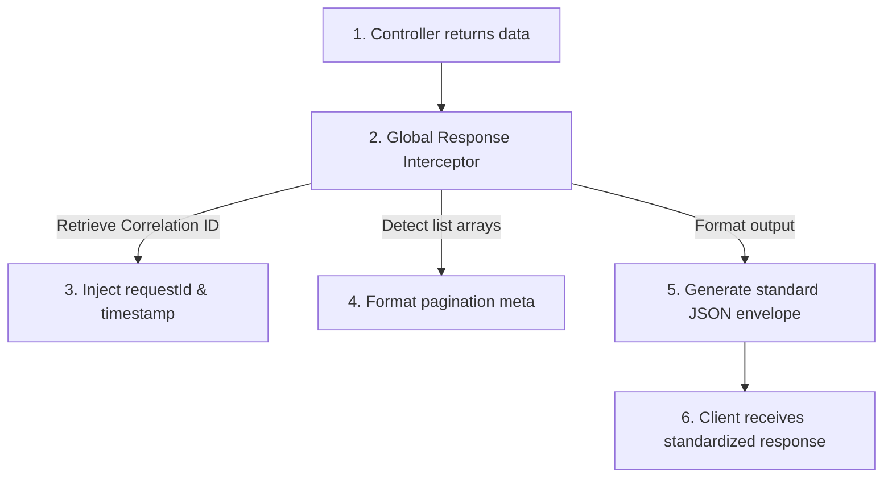
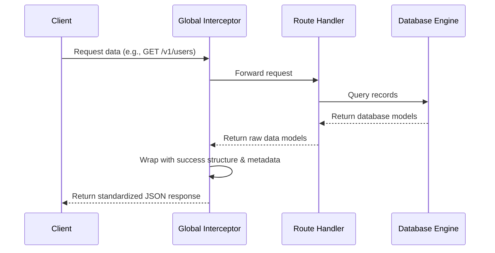
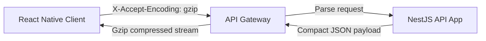
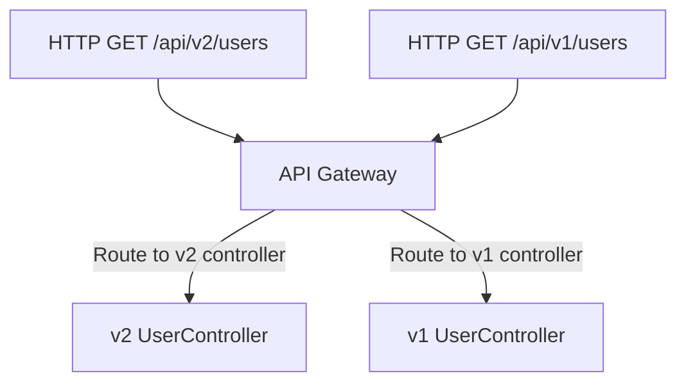
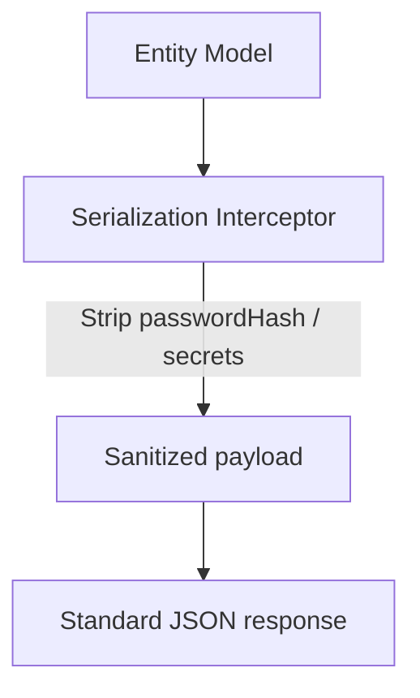

# API RESPONSE STANDARDIZATION ARCHITECTURE

**Project Name:** Enterprise SaaS Business Management Platform  
**Document Version:** 1.0.0 — Baseline Standard  
**Date:** July 14, 2026  
**Authors:** Principal Backend Architect, NestJS Enterprise Engineer, and API Design Specialist  
**Classification:** Internal — Confidential  
**Phase:** 23.8 — API Response Standardization Architecture  

---

## Table of Contents

1. [Executive Summary](#1-executive-summary)
2. [API Response Architecture Overview](#2-api-response-architecture-overview)
3. [Standard API Response Structures](#3-standard-api-response-structures)
4. [NestJS Response Core Module Design](#4-nestjs-response-core-module-design)
5. [Global Response Interceptor](#5-global-response-interceptor)
6. [Pagination Response Design](#6-pagination-response-design)
7. [API Metadata Architecture](#7-api-metadata-architecture)
8. [API Versioning Strategy](#8-api-versioning-strategy)
9. [Multi-Tenant API Response Design](#9-multi-tenant-api-response-design)
10. [Mobile Application API Optimization](#10-mobile-application-api-optimization)
11. [Security Considerations](#11-security-considerations)
12. [API Documentation Integration](#12-api-documentation-integration)
13. [Architecture Diagrams](#13-architecture-diagrams)
14. [Enterprise Implementation Guidelines](#14-enterprise-implementation-guidelines)
15. [Implementation Summary](#15-implementation-summary)

---

## 1. Executive Summary

### 1.1 Document Purpose
This document establishes the **API Response Standardization Architecture** (Phase 23.8). It details the structures, interception filters, pagination wrappers, and versioning strategies required to achieve uniform API responses.

---

## 2. API Response Architecture Overview

### 2.1 Rationale for Consistent Formats
Enterprise systems require uniform API contracts to ensure client robustness. Inconsistent API responses cause client-side parser failures, increase integration overhead, and make generic frontend error interceptors difficult to maintain.

### 2.2 Integration Benefits
*   **Backend Developers:** Simplifies controller implementations; handlers only return standard models.
*   **Frontend/Mobile Developers:** Allows implementation of a single network layer mapper, automating error toast triggers and token refreshes.
*   **Third-Party Consumers:** Ensures clean, predictable schema integrations.

---

## 3. Standard API Response Structures

### 3.1 Success Response Schema
```json
{
  "success": true,
  "statusCode": 200,
  "message": "Operation completed successfully",
  "data": {
    "id": "user-uuid",
    "name": "Jane Doe"
  },
  "meta": {
    "timestamp": "2026-07-14T03:02:04Z",
    "requestId": "req-9c8a7b6d"
  }
}
```

### 3.2 Error Response Schema
```json
{
  "success": false,
  "statusCode": 400,
  "errorCode": "INVALID_REQUEST",
  "message": "Validation constraints failed",
  "errors": [
    {
      "field": "email",
      "constraints": ["email must be a valid email address"]
    }
  ],
  "meta": {
    "timestamp": "2026-07-14T03:02:04Z",
    "requestId": "req-9c8a7b6d"
  }
}
```

### 3.3 Field Descriptions
*   `success`: Explicit status indicator.
*   `statusCode`: Matching HTTP status code.
*   `errorCode`: Machine-readable code string for client-side handling.
*   `message`: Human-readable description.
*   `data`: Payload payload payload object.
*   `errors`: Field-level validation constraints.
*   `meta`: Processing metadata.

---

## 4. NestJS Response Core Module Design

The response standardization classes are located under `src/core/response/`:

```
src/core/response/
 ├── response.module.ts            (Initializes the response interceptor module)
 ├── response.service.ts           (Exposes helper methods for response generation)
 ├── interceptors/
 │    └── response.interceptor.ts  (Transforms raw handler returns to Standard API format)
 ├── dto/
 │    └── api-response.dto.ts      (OpenAPI Swagger documentation definitions)
 └── interfaces/
      └── response.interface.ts    (TypeScript type definitions for responses)
```

---

## 5. Global Response Interceptor

### 5.1 Interceptor Responsibilities
*   **Response Wrapping:** Automatically wraps raw handler return objects inside the standard `success` response envelope.
*   **Metadata Injection:** Injects the processing timestamp and the unique `requestId` from the request context.
*   **Pagination Standardization:** Detects paginated records and formats the `pagination` metadata block.
*   **PII Stripping:** Automatically removes fields labeled with security decorators (e.g., `passwordHash`) before serialization.

---

## 6. Pagination Response Design

All paginated list queries return the following structure:

```json
{
  "success": true,
  "statusCode": 200,
  "message": "Items retrieved successfully",
  "data": [],
  "meta": {
    "timestamp": "2026-07-14T03:02:04Z",
    "requestId": "req-9c8a7b6d",
    "pagination": {
      "page": 1,
      "limit": 20,
      "total": 500,
      "totalPages": 25
    }
  }
}
```

### 6.1 Pagination Strategies
*   **Offset Pagination (`page`/`limit`):** Best for UI grids with exact page numbers. Simple to implement, but performance degrades on deep tables.
*   **Cursor Pagination (`starting_after`/`ending_before`):** Best for continuous feeds and high-volume real-time ledger queries. Highly performant as queries utilize indexed pointer ranges.

---

## 7. API Metadata Architecture

The metadata block contains key performance metrics:

```json
"meta": {
  "timestamp": "2026-07-14T03:02:04Z",
  "requestId": "req-9c8a7b6d",
  "version": "v1",
  "executionTime": "12ms",
  "server": "api-pod-3"
}
```

*   `version`: Tracks version shifts.
*   `executionTime`: Logs response latency.
*   `server`: Identifies the origin node in cluster deployments, aiding debug loops.

---

## 8. API Versioning Strategy

*   **URI Path Versioning:** Version indicators are embedded directly in the path (e.g., `/api/v1/users`, `/api/v2/users`).
*   **Compatibility Policy:** APIs support backward compatibility. When updates break schema structures, the version route is incremented (e.g., `/v2/`).
*   **Deprecation Lifecycle:** Deprecated routes return a `Deprecated: true` response header and log warnings. Deprecated endpoints are deactivated after 6 months.

---

## 9. Multi-Tenant API Response Design

### 9.1 Tenant Parameter Isolation
*   **Client Isolation:** Multi-tenant variables like database connection strings or execution environments are hidden from clients.
*   **Tenant Metadata Exposure:** Clients only receive tenant context indicators like `tenantId` and subscription scopes (`subscriptionPlan`, `enabledModules`).

---

## 10. Mobile Application API Optimization

To support high-performance mobile clients, the API response layer optimizes payloads:

*   **Field Filtering:** Clients can query specific fields to reduce network overhead.
*   **Payload Compression:** Gzip/Brotli compression is enforced on mobile requests.
*   **Consistent Error Layouts:** Ensures mobile clients parse offline sync error codes correctly.

---

## 11. Security Considerations

*   **Information Leakage Prevention:** Database schema names, raw error queries, and stack traces are stripped from production responses.
*   **Context Verification:** Ensures tenant contexts are validated in request/response interceptors to prevent cross-tenant data leakage.

---

## 12. API Documentation Integration

The standardized response structures are mapped directly to OpenAPI/Swagger:

*   **Swagger Schema Models:** DTO models (e.g., `ApiResponseDto`) leverage generics to ensure OpenAPI files document payload types correctly.
*   **Swagger Security Declarations:** Endpoints expose required authorization headers and HTTP status descriptions.

---

## 13. Architecture Diagrams

### 13.1 Response Processing Lifecycle



### 13.2 API Contract Flow



### 13.3 Mobile Compression Strategy



### 13.4 API Version Routing Shunt



### 13.5 Schema Serialization Sanitization



---

## 14. Enterprise Implementation Guidelines

### 14.1 Naming Conventions
*   **Response DTOs:** camelCase namespaces (e.g., `userResponseDto`).
*   **API Paths:** Lowercase, hyphen-separated plurals (e.g., `/v1/tenant-accounts`).

### 14.2 HTTP Status Code Usage
*   `200 OK`: Read, edit, or update success.
*   `201 Created`: Creation success.
*   `204 No Content`: Successful request with no data returned (e.g., logout).
*   `400 Bad Request`: Client-side validation failure.
*   `401 Unauthorized`: Authentication invalid or missing.
*   `403 Forbidden`: Mismatched authorization scopes.
*   `404 Not Found`: Target resource missing.
*   `500 Internal Server Error`: Server errors.

---

## 15. Implementation Summary

### 15.1 Response Setup Schedule

| Task | Target Timeline | Status |
| :--- | :--- | :--- |
| Set up global interceptor schemas | Day 1 | Planned |
| Implement offset/cursor paginator utilities | Day 2 | Planned |
| Define API version routing path filters | Day 3 | Planned |
| Configure Swagger API schemas | Day 4 | Planned |

---

## Document Control

| Field | Value |
|---|---|
| **Document ID** | SBMP-BE-23.8-RESPONSE-STANDARDIZATION |
| **Version** | 1.0.0 |
| **Status** | APPROVED — Baseline |
| **Owner** | Principal Backend Architect |
| **Reviewed By** | Mobile Architect, Lead Frontend Dev, DevOps Lead |
| **Review Cycle** | Quarterly |
| **Next Review** | October 2026 |

---

*Phase 23.8 — API Response Standardization Architecture | SaaS Business Management Platform*  
*Enterprise Confidential — © 2026 All Rights Reserved*
