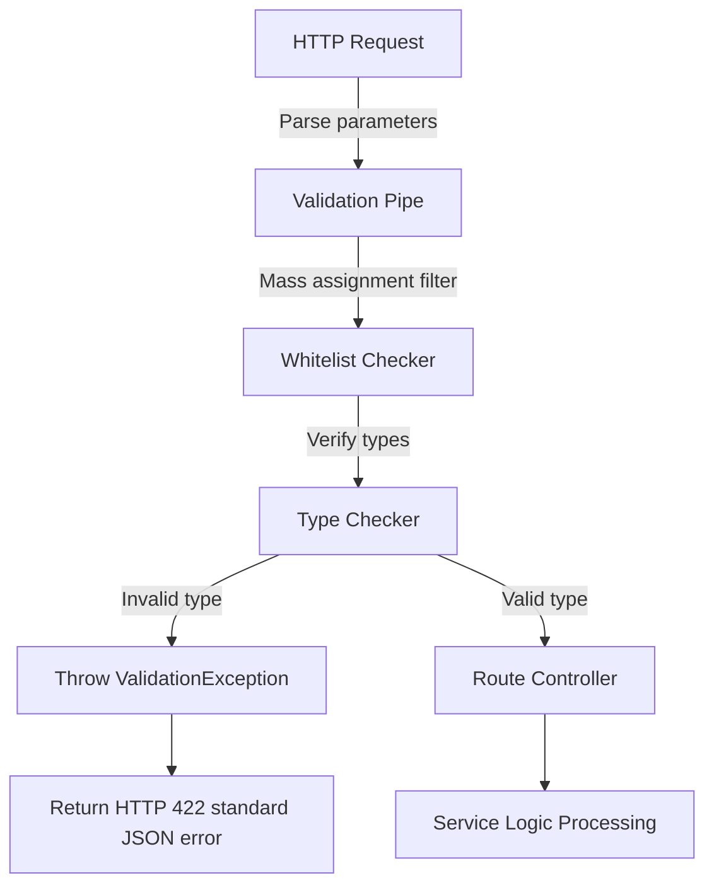
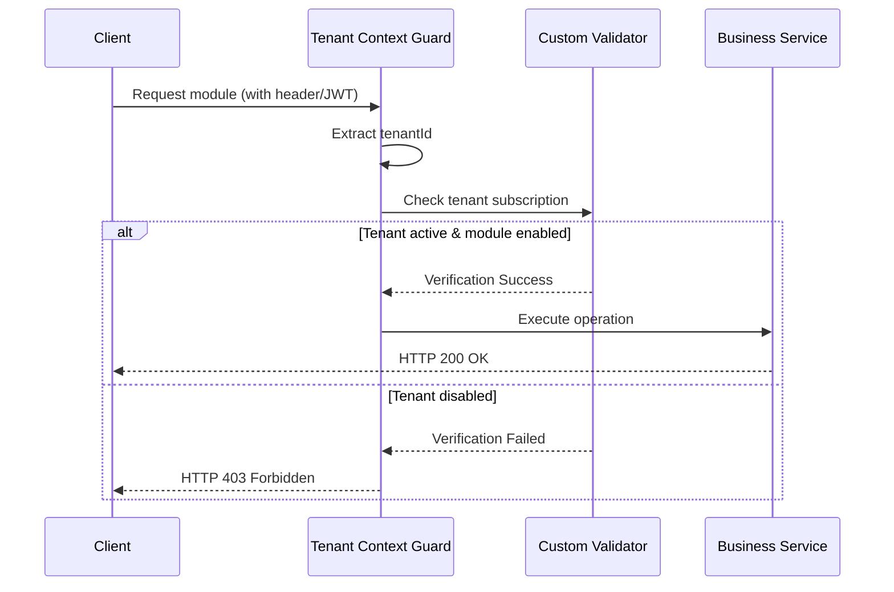
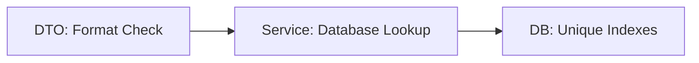
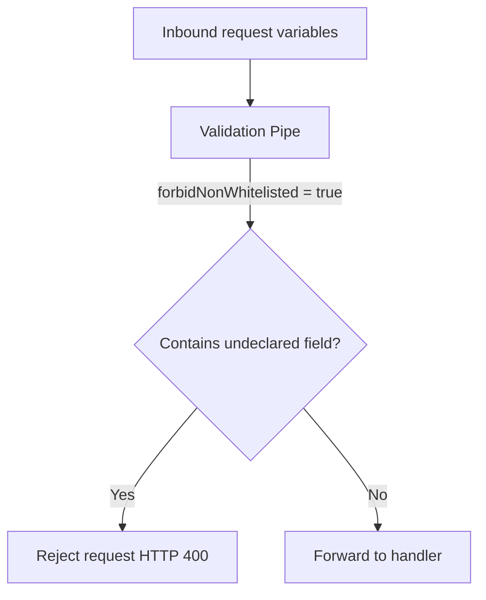
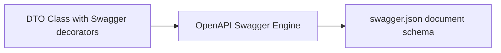

# REQUEST VALIDATION & DTO ARCHITECTURE

**Project Name:** Enterprise SaaS Business Management Platform  
**Document Version:** 1.0.0 — Baseline Standard  
**Date:** July 14, 2026  
**Authors:** Principal Backend Architect, NestJS Enterprise Engineer, and API Security Specialist  
**Classification:** Internal — Confidential  
**Phase:** 23.9 — Request Validation & DTO Architecture  

---

## Table of Contents

1. [Executive Summary](#1-executive-summary)
2. [Request Validation Architecture Overview](#2-request-validation-architecture-overview)
3. [Validation Architecture Design](#3-validation-architecture-design)
4. [NestJS Validation Core Module Design](#4-nestjs-validation-core-module-design)
5. [DTO Architecture Design](#5-dto-architecture-design)
6. [Validation Library Strategy](#6-validation-library-strategy)
7. [Common Validation Rules](#7-common-validation-rules)
8. [Security Validation Strategy](#8-security-validation-strategy)
9. [Multi-Tenant Validation Architecture](#9-multi-tenant-validation-architecture)
10. [Validation Error Response Design](#10-validation-error-response-design)
11. [Database Validation Strategy](#11-database-validation-strategy)
12. [API Documentation Integration](#12-api-documentation-integration)
13. [Architecture Diagrams](#13-architecture-diagrams)
14. [Enterprise Implementation Guidelines](#14-enterprise-implementation-guidelines)
15. [Implementation Summary](#15-implementation-summary)

---

## 1. Executive Summary

### 1.1 Document Purpose
This document establishes the **Request Validation & DTO Architecture** (Phase 23.9). It details the validation flows, DTO architectures, library strategies, security filters, and database validation mappings required to protect API endpoints.

---

## 2. Request Validation Architecture Overview

### 2.1 Backend Validation Rationale
Backend validation represents the final security boundary before requests mutate data. Unlike client-side validation, which can be bypassed via direct curl requests or proxy interceptors, server-side validation guarantees data integrity, schema consistency, and system protection.

### 2.2 Client-Side vs. Server-Side Validation
*   **Client-Side Validation:** Enhances UX by providing immediate visual feedback in the UI.
*   **Server-Side Validation:** Enforces business rules and security bounds, acting as the absolute authority on data correctness.

---

## 3. Validation Architecture Design

The validation pipeline runs sequentially:

```
┌────────┐     ┌─────────────┐     ┌─────────────┐     ┌─────────────┐
│ Client │ ──► │ DTO Schema  │ ──► │ Controller  │ ──► │ Database    │
│ Request│     │ Validation  │     │ Logic Gates │     │ Constraints │
└────────┘     └─────────────┘     └─────────────┘     └─────────────┘
```

### 3.1 Layer Responsibilities
*   **DTO Validation Layer:** Validates schema structure, data types, and value constraints.
*   **Controller:** Coordinates request routing and injects validated DTO contexts into services.
*   **Business Logic:** Enforces complex business validations (e.g., balance checks).
*   **Database Constraints:** Enforces final structural rules (e.g., unique email indexes).

---

## 4. NestJS Validation Core Module Design

The validation components are located under `src/core/validation/`:

```
src/core/validation/
 ├── validation.module.ts            (Configures validation pipelines)
 ├── validation.pipe.ts              (Implements class-validator rules)
 ├── decorators/
 │    ├── is-strong-password.decorator.ts (Custom complexity rules decorator)
 │    └── is-tenant-active.decorator.ts   (Checks if tenant status == ACTIVE)
 ├── validators/
 │    └── custom.validator.ts        (Custom validators mapping database lookups)
 └── schemas/
      └── validation.messages.ts     (Centralized message catalog for validations)
```

---

## 5. DTO Architecture Design

### 5.1 DTO Purpose
*   **API Contracts:** Formally defines the expected properties, formats, and types.
*   **Security:** Filters out undeclared parameters (preventing mass assignment attacks).
*   **Documentation:** Automatically populates Swagger documentation schemas.

### 5.2 DTO Naming Conventions
*   **Create Actions:** Prefix with `Create` and suffix with `Dto` (e.g., `CreateUserDto`).
*   **Update Actions:** Prefix with `Update` and suffix with `Dto` (e.g., `UpdateUserDto`).

---

## 6. Validation Library Strategy

The architecture leverages standard libraries depending on the context:

*   **Class-Validator / Class-Transformer:** Primary standard for DTO validation, integrating with NestJS decorators.
*   **Zod / Joi:** Used for validating runtime configuration files (`.env`).

### 6.1 Matrix Comparison

| Parameter | Class-Validator | Joi | Zod |
| :--- | :--- | :--- | :--- |
| **Performance** | Moderate (reflect-metadata) | High | High |
| **Developer Experience** | High (Decorator-based) | Moderate | High (TypeScript first) |
| **Type Safety** | High | Low (requires manual type mapping) | Absolute |

---

## 7. Common Validation Rules

*   **Strings:** Required flag, length limits, pattern matching (e.g., UUID format).
*   **Numbers:** Minimum and maximum bounds, range limits, integer checks.
*   **Email:** Valid RFC 5322 syntax validation.
*   **Password:** Cryptographic complexity checks (uppercase, lowercase, number, symbol, min 12 characters).
*   **Phone:** E.164 international formatting (e.g., `+1234567890`).
*   **Dates:** ISO 8601 formatting, valid date ranges (e.g., date must be in the future).

---

## 8. Security Validation Strategy

*   **Mass Assignment Protection:** NestJS ValidationPipe is configured with `whitelist: true` and `forbidNonWhitelisted: true`, discarding any property not declared in the DTO.
*   **Input Sanitization:** Strips HTML/JS elements from inputs to prevent XSS attacks.
*   **Type Casting:** Casts incoming strings to numbers or dates dynamically based on DTO rules.

---

## 9. Multi-Tenant Validation Architecture

Tenant security contexts are validated before processing the request:

```
HTTP Request ──► Parse tenantId ──► Verify Tenant Status ──► Verify User Permissions
```

Custom decorators (e.g., `@IsTenantActive()`) validate that:
*   The tenant exists and is active.
*   The requesting user is authorized within that tenant scope.
*   The target feature module is enabled for the tenant.

---

## 10. Validation Error Response Design

Validation failures return a `422 Unprocessable Entity` status with detailed field-level errors:

```json
{
  "success": false,
  "statusCode": 422,
  "errorCode": "VALIDATION_FAILED",
  "errors": [
    {
      "field": "email",
      "message": "Invalid email format"
    },
    {
      "field": "password",
      "message": "Password is too weak"
    }
  ]
}
```

---

## 11. Database Validation Strategy

Validation is enforced across three distinct layers:

1.  **DTO Validation:** Simple syntax and type checks (e.g., email format).
2.  **Business Validation:** Checks business logic and database state (e.g., email availability).
3.  **Database Constraints:** Absolute safety fallback (e.g., unique database index).

---

## 12. API Documentation Integration

DTO schemas are integrated with Swagger:
*   **OpenAPI Schemas:** Decorators like `@ApiProperty()` document field types, descriptions, and validation rules.
*   **Auto-generated Schemas:** Frontend developers use auto-generated clients matching backend DTO schemas.

---

## 13. Architecture Diagrams

### 13.1 Validation Request Flow



### 13.2 Multi-Tenant Validation Flow



### 13.3 Data Layer Validation Stages



### 13.4 Whitelist mass assignment filter



### 13.5 Swagger Schema Generator



---

## 14. Enterprise Implementation Guidelines

### 14.1 DTO Organization
Store module-specific DTOs directly within their respective modules (e.g., `src/modules/users/dto/`). Keep global or shared DTOs under `src/common/dto/`.

### 14.2 Error Message Standards
Messages must be clear, actionable, and free of system internals (e.g., "Must be a valid email address" rather than "regexp mismatch").

---

## 15. Implementation Summary

### 15.1 Validation Setup Schedule

| Task | Target Timeline | Status |
| :--- | :--- | :--- |
| Set up validation pipes | Day 1 | Planned |
| Create user registration DTO schemas | Day 2 | Planned |
| Implement custom tenant active checks | Day 3 | Planned |
| Integrate validation schemas with Swagger | Day 4 | Planned |

---

## Document Control

| Field | Value |
|---|---|
| **Document ID** | SBMP-BE-23.9-VALIDATION-DTO |
| **Version** | 1.0.0 |
| **Status** | APPROVED — Baseline |
| **Owner** | API Security Specialist |
| **Reviewed By** | Principal Architect, Lead Developer, QA Lead |
| **Review Cycle** | Quarterly |
| **Next Review** | October 2026 |

---

*Phase 23.9 — Request Validation & DTO Architecture | SaaS Business Management Platform*  
*Enterprise Confidential — © 2026 All Rights Reserved*
